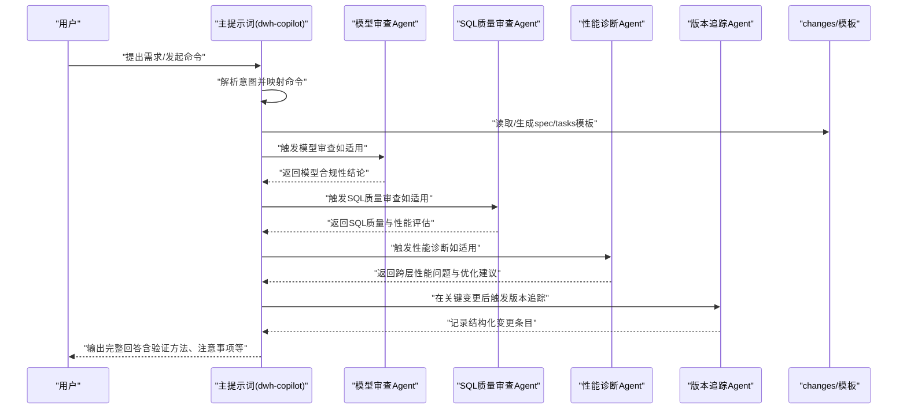
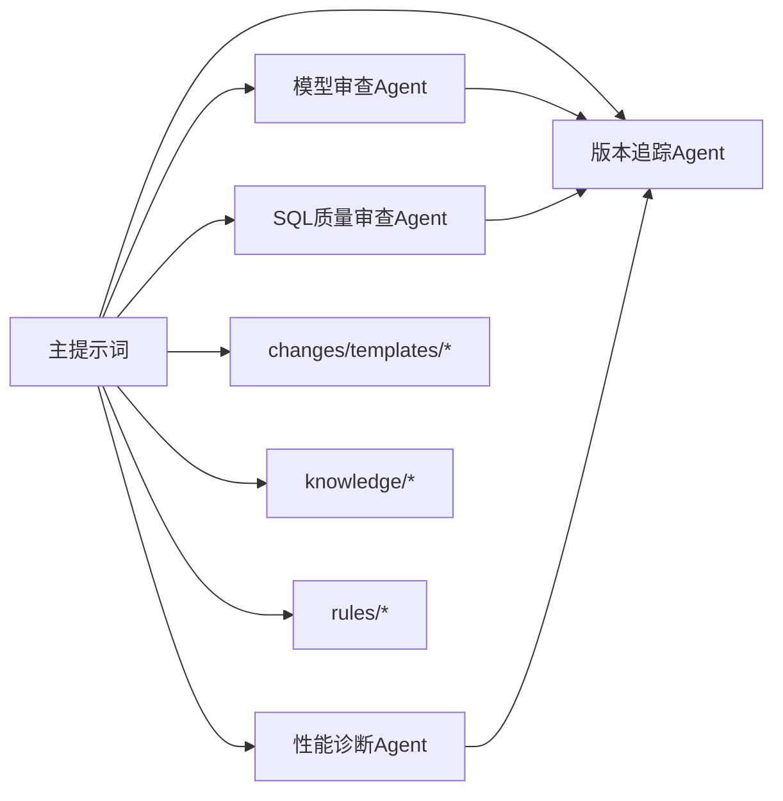

# AI代理系统

<cite>
**本文引用的文件**
- [主提示词 copilot-prompt.md](file://data_warehouse_engineering_code_copilot/agents/copilot-prompt.md)
- [SQL质量审查 Agent](file://data_warehouse_engineering_code_copilot/agents/sql-reviewer.md)
- [模型审查 Agent](file://data_warehouse_engineering_code_copilot/agents/model-reviewer.md)
- [性能诊断 Agent](file://data_warehouse_engineering_code_copilot/agents/performance-reviewer.md)
- [版本追踪 Agent](file://data_warehouse_engineering_code_copilot/agents/version-tracker.md)
- [目录结构与设计说明](file://data_warehouse_engineering_code_copilot/目录结构和设计说明.md)
- [变更模板：spec.md](file://data_warehouse_engineering_code_copilot/changes/templates/spec.md)
- [变更模板：tasks.md](file://data_warehouse_engineering_code_copilot/changes/templates/tasks.md)
- [项目上下文模板：project-context.md](file://data_warehouse_engineering_code_copilot/rules/project-context.md)
</cite>

## 目录
1. [简介](#简介)
2. [项目结构](#项目结构)
3. [核心组件](#核心组件)
4. [架构总览](#架构总览)
5. [详细组件分析](#详细组件分析)
6. [依赖分析](#依赖分析)
7. [性能考虑](#性能考虑)
8. [故障排除指南](#故障排除指南)
9. [结论](#结论)
10. [附录](#附录)

## 简介
本项目是一套面向数据仓库（Data Warehouse）开发的“工程化提示词工程”系统，旨在让AI在数仓开发中像顶尖数仓工程师一样工作：遵循统一的SQL、建模、调度、安全规范；强制走“需求→spec→任务→实施→审查→归档”的完整闭环；复用沉淀的SQL模式、ETL模式、建模技巧、性能优化经验；并在每次DDL/SQL/ETL/调度变更后自动追踪形成可审计的变更日志。系统通过主提示词定义AI助手的身份、工作原则与回答框架，辅以多个专业化Agent协同完成审查、诊断与追踪，配合变更模板与知识库形成“三段式知识结构”。

## 项目结构
系统采用“提示词工程 + 三段式知识库 + 变更追踪”的组织方式：
- agents/：AI角色与子Agent提示词，定义主提示词与各专业化Agent职责
- changes/templates/：变更管理模板（spec、tasks、log、validation-spec）
- knowledge/：领域知识库（SQL模式、ETL模式、维度建模技巧、性能优化经验）
- rules/：项目约束与规范（项目上下文、SQL编码规范、建模与分层规范、调度与运维规范、数据质量规范、安全红线、业务领域规则）
- 目录结构和设计说明.md：整体设计原则、命令式协作、典型工作流与扩展点

```mermaid
graph TB
subgraph "提示词与Agent"
A["主提示词<br/>agents/copilot-prompt.md"]
B["SQL质量审查<br/>agents/sql-reviewer.md"]
C["模型审查<br/>agents/model-reviewer.md"]
D["性能诊断<br/>agents/performance-reviewer.md"]
E["版本追踪<br/>agents/version-tracker.md"]
end
subgraph "变更管理"
F["spec 模板<br/>changes/templates/spec.md"]
G["tasks 模板<br/>changes/templates/tasks.md"]
end
subgraph "知识库"
H["SQL模式<br/>knowledge/sql-patterns.md"]
I["ETL模式<br/>knowledge/etl-patterns.md"]
J["维度建模技巧<br/>knowledge/dimension-modeling-tips.md"]
K["性能优化经验<br/>knowledge/performance-tips.md"]
end
subgraph "规则与上下文"
L["项目上下文<br/>rules/project-context.md"]
M["SQL编码规范<br/>rules/sql-style.md"]
N["建模与分层规范<br/>rules/modeling-standards.md"]
O["调度与运维规范<br/>rules/scheduling-standards.md"]
P["数据质量规范<br/>rules/data-quality.md"]
Q["安全红线<br/>rules/security.md"]
R["业务领域规则<br/>rules/domain-rules.md"]
end
A --> B
A --> C
A --> D
A --> E
A --> F
A --> G
A --> H
A --> I
A --> J
A --> K
A --> L
A --> M
A --> N
A --> O
A --> P
A --> Q
A --> R
```

图表来源
- [主提示词 copilot-prompt.md:1-147](file://data_warehouse_engineering_code_copilot/agents/copilot-prompt.md#L1-L147)
- [SQL质量审查 Agent:1-68](file://data_warehouse_engineering_code_copilot/agents/sql-reviewer.md#L1-L68)
- [模型审查 Agent:1-50](file://data_warehouse_engineering_code_copilot/agents/model-reviewer.md#L1-L50)
- [性能诊断 Agent:1-81](file://data_warehouse_engineering_code_copilot/agents/performance-reviewer.md#L1-L81)
- [版本追踪 Agent:1-120](file://data_warehouse_engineering_code_copilot/agents/version-tracker.md#L1-L120)
- [变更模板：spec.md:1-132](file://data_warehouse_engineering_code_copilot/changes/templates/spec.md#L1-L132)
- [变更模板：tasks.md:1-74](file://data_warehouse_engineering_code_copilot/changes/templates/tasks.md#L1-L74)
- [项目上下文模板：project-context.md:1-104](file://data_warehouse_engineering_code_copilot/rules/project-context.md#L1-L104)

章节来源
- [目录结构与设计说明:1-204](file://data_warehouse_engineering_code_copilot/目录结构和设计说明.md#L1-L204)

## 核心组件
- 主提示词（dwh-copilot）：定义AI助手的身份、工作原则、回答框架与命令体系，指导AI在固定流程内协作，避免发散与遗漏。
- 专业化Agent：
  - SQL质量审查Agent：审查SQL正确性、性能与可维护性，前置条件为模型审查通过。
  - 模型审查Agent：验证模型是否符合spec规格与建模最佳实践，独立于实现者上下文。
  - 性能诊断Agent：诊断SQL、ETL与调度作业的性能问题，支持跨层定位与量化评估。
  - 版本追踪Agent：在DDL/SQL/ETL/调度变更后自动记录结构化变更条目，确保可审计与可回溯。
- 变更模板：spec.md与tasks.md用于生成标准化的变更提案与任务拆分，保证实施过程可验证、可追溯。
- 知识库与规则：rules/提供约束与规范，knowledge/提供经验复用，二者与changes/形成“三段式知识结构”。

章节来源
- [主提示词 copilot-prompt.md:1-147](file://data_warehouse_engineering_code_copilot/agents/copilot-prompt.md#L1-L147)
- [SQL质量审查 Agent:1-68](file://data_warehouse_engineering_code_copilot/agents/sql-reviewer.md#L1-L68)
- [模型审查 Agent:1-50](file://data_warehouse_engineering_code_copilot/agents/model-reviewer.md#L1-L50)
- [性能诊断 Agent:1-81](file://data_warehouse_engineering_code_copilot/agents/performance-reviewer.md#L1-L81)
- [版本追踪 Agent:1-120](file://data_warehouse_engineering_code_copilot/agents/version-tracker.md#L1-L120)
- [变更模板：spec.md:1-132](file://data_warehouse_engineering_code_copilot/changes/templates/spec.md#L1-L132)
- [变更模板：tasks.md:1-74](file://data_warehouse_engineering_code_copilot/changes/templates/tasks.md#L1-L74)
- [项目上下文模板：project-context.md:1-104](file://data_warehouse_engineering_code_copilot/rules/project-context.md#L1-L104)

## 架构总览
系统采用“主提示词驱动 + 多Agent协作 + 变更追踪”的架构：
- 主提示词负责身份定义、工作原则与回答框架，同时定义命令体系与启动流程。
- 各Agent在特定阶段独立工作，前置条件满足后串联推进。
- 变更追踪贯穿所有关键操作，确保每次变更都有据可查。

图表来源
- [主提示词 copilot-prompt.md:36-147](file://data_warehouse_engineering_code_copilot/agents/copilot-prompt.md#L36-L147)
- [SQL质量审查 Agent:1-68](file://data_warehouse_engineering_code_copilot/agents/sql-reviewer.md#L1-L68)
- [模型审查 Agent:1-50](file://data_warehouse_engineering_code_copilot/agents/model-reviewer.md#L1-L50)
- [性能诊断 Agent:1-81](file://data_warehouse_engineering_code_copilot/agents/performance-reviewer.md#L1-L81)
- [版本追踪 Agent:1-120](file://data_warehouse_engineering_code_copilot/agents/version-tracker.md#L1-L120)
- [变更模板：spec.md:1-132](file://data_warehouse_engineering_code_copilot/changes/templates/spec.md#L1-L132)
- [变更模板：tasks.md:1-74](file://data_warehouse_engineering_code_copilot/changes/templates/tasks.md#L1-L74)

## 详细组件分析

### 主提示词（dwh-copilot）设计原理与工作机制
- 身份与原则
  - 顶尖数仓工程师搭档，强调“Spec驱动”“现状必须有出处”“变更即记录”等核心法则。
  - 回答框架包含问题理解、现状分析、方案设计、具体实现、验证方法、性能与成本考量、注意事项等七段式结构。
- 意图确认与命令体系
  - 通过映射表将用户自然语言映射到固定命令，如/sql、/etl、/model、/propose、/apply、/review、/optimize、/dq、/schedule、/archive等。
  - 纯技术讨论可直接回答，无需命令流程。
- 启动流程
  - 会话开始时读取rules/规则文件、检查changes/进行中的变更、检查版本追踪路径，报告当前状态并展示命令菜单。
- 命令详解
  - /init：初始化项目上下文，填充rules/project-context.md。
  - /sql：SQL开发，包含业务口径确认、编写SQL、验证方法、性能评估，并触发版本追踪。
  - /etl：ETL/数据集成开发，研究数据源→设计同步方式→编写脚本→验证幂等与回放能力，并触发版本追踪。
  - /model：数仓建模，梳理业务过程→分层归属→DDL设计→关系与口径文档化→基础度量值/指标对齐业务规则→触发版本追踪。
  - /propose：创建变更提案，Research→逐个提问→YAGNI裁剪→分段生成spec→HARD-GATE确认。
  - /apply：执行实施，前置检查spec+tasks+用户确认→逐task执行→每个task完成后展示验证证据→触发版本追踪。
  - /review：三阶段审查（Spec合规→模型质量→SQL质量），阶段一PASS后才启动阶段二，依此类推。
  - /optimize：性能诊断与优化，四层诊断（数据源层→抽取层→数仓层→应用层），必须量化优化前后对比。
  - /dq：数据质量校验，五大维度（完整性/唯一性/一致性/准确性/时效性），产出可执行对账SQL并与基准来源对比。
  - /schedule：调度配置，依赖识别→调度周期→重试与告警→SLA/基线→资源队列→失败回放策略，并触发版本追踪。
  - /archive：归档+知识沉淀，逐条展示log.md知识发现，确认后沉淀到knowledge/，并触发版本追踪。
- 调试流程与诊断层级
  - 四阶段：现象收集→根因定位→方案验证→实施修复。
  - 诊断层级：数据源层→抽取层→ODS层→DWD层→DWS层→ADS层→应用层。

章节来源
- [主提示词 copilot-prompt.md:1-147](file://data_warehouse_engineering_code_copilot/agents/copilot-prompt.md#L1-L147)
- [目录结构与设计说明:126-167](file://data_warehouse_engineering_code_copilot/目录结构和设计说明.md#L126-L167)

### SQL质量审查Agent
- 审查分级
  - Critical（阻塞）：计算结果错误、Join笛卡尔积/多对多未识别导致行数膨胀、全表扫描大型分区表、主键/唯一键重复、数据回刷未做幂等保护、跨库/跨集群引用未声明、敏感字段未脱敏。
  - Important（应修复）：子查询未使用CTE、重复计算未提取、字符串隐式类型转换、NULL处理缺失、时间过滤使用函数包裹分区字段阻断分区裁剪、WHERE条件可下推但写在ON子句、未声明字段别名、复杂SQL缺少头部注释。
  - Minor（建议）：关键字大小写不统一、缩进/换行风格不一致、字段顺序与DDL不一致、可合并的多次INSERT。
- 性能审查清单
  - 包括分区裁剪、Join顺序、Map/Broadcast Join、数据倾斜风险、聚合下推、SELECT*、不必要的ORDER BY、DISTINCT替代、窗口函数PARTITION BY合理性、CTE物化策略等。
- 输出格式
  - 分级列出问题与影响，附性能评估摘要与优化建议。
- 工具权限
  - 仅需Read/Grep/Glob（只读），不需要写入权限。

章节来源
- [SQL质量审查 Agent:1-68](file://data_warehouse_engineering_code_copilot/agents/sql-reviewer.md#L1-L68)

### 模型审查Agent
- 审查维度
  - 缺失实现、多余实现、理解偏差、业务规则落地、分层合规、建模合规（星型/雪花、事实表与维度分离、一致性维度复用、SCD策略）、物理设计合规（分区/分桶/表属性/字段类型最小化）、数据变更准确性。
- 输出格式
  - 模型结构验证、字段/约束逐条验证、分层合规、结论（Spec合规/不合规）。
- 工具权限
  - 仅需Read/Grep/Glob（只读），不需要写入权限。

章节来源
- [模型审查 Agent:1-50](file://data_warehouse_engineering_code_copilot/agents/model-reviewer.md#L1-L50)

### 性能诊断Agent
- 诊断框架
  - 数据源层：业务库索引/统计信息、抽取窗口、抽取量、CDC binlog延迟与位点。
  - 抽取层：全量vs增量策略、并发数与分片策略、网络带宽瓶颈、序列化/反序列化开销、写入批次与提交频率。
  - 数仓层：ODS分区设计、DWD清洗复杂度、DWS聚合粒度与重复建设、DIM SCD策略对Join开销、ADS二次聚合与未裁剪引用。
  - SQL层：分区裁剪、Join类型与顺序、数据倾斜、子查询物化、窗口函数PARTITION BY、谓词下推与列裁剪、小文件问题。
  - 应用层：BI二次聚合、API查询粒度、缓存与物化视图、时区/币种/单位换算开销。
- 输出格式
  - 性能评估摘要、问题清单（按影响排序）、优化路线图、优化前后对比。
- 工具权限
  - 仅需Read/Grep/Glob/Bash（只读explain/desc formatted/show partitions），不需要写入权限。

章节来源
- [性能诊断 Agent:1-81](file://data_warehouse_engineering_code_copilot/agents/performance-reviewer.md#L1-L81)

### 版本追踪Agent
- 触发时机
  - /sql、/etl、/model、/schedule、/dq产出新的对账规则或修复了数据问题、/apply每个Task完成后、用户手动要求记录时。
- 路径初始化
  - 首次触发时检查当前会话是否已设置变更日志路径；若未设置，询问路径并在当前会话中记住；若文件不存在，自动创建并写入文件头。
- 变更条目格式
  - 时间（精确到分钟）、模块、分层、任务、操作、变更内容（精确到库.表.字段或作业名）、关联文件、回刷范围、影响下游、备注。
- 记录规则
  - 原子化、精确引用、任务可追溯、下游必标注、回刷必声明、时间精确到分钟、不阻塞主流程。
- 输出示例
  - 展示结构化条目格式与模块分类。
- 工具权限
  - Read、Write/Edit（追加变更条目到日志文件）、不需要Bash/Grep/Glob（不主动扫描项目文件）。

章节来源
- [版本追踪 Agent:1-120](file://data_warehouse_engineering_code_copilot/agents/version-tracker.md#L1-L120)

### 变更模板与知识库
- 变更模板：spec.md与tasks.md
  - spec.md：背景与目标、现状分析（含出处要求）、功能点、业务规则与口径（可验证）、模型变更（DDL）、SQL加工设计、ETL/同步变更、调度变更、数据质量规则（DQ）、影响范围、风险与关注点、验证策略、待澄清、技术决策、执行日志、审查结论、HARD-GATE确认。
  - tasks.md：按数据源接入→ODS→DIM→DWD→DWS→ADS→调度配置→数据质量→权限发布的顺序拆分，每个任务原子化、精确到对象名称，包含关键DDL/SQL、依赖、验收标准、验证方法、回刷计划等。
- 知识库与规则
  - rules/：项目上下文、SQL编码规范、建模与分层规范、调度与运维规范、数据质量规范、安全红线、业务领域规则。
  - knowledge/：SQL模式、ETL模式、维度建模技巧、性能优化经验、索引与分区策略等。

章节来源
- [变更模板：spec.md:1-132](file://data_warehouse_engineering_code_copilot/changes/templates/spec.md#L1-L132)
- [变更模板：tasks.md:1-74](file://data_warehouse_engineering_code_copilot/changes/templates/tasks.md#L1-L74)
- [项目上下文模板：project-context.md:1-104](file://data_warehouse_engineering_code_copilot/rules/project-context.md#L1-L104)

## 依赖分析
- 组件耦合与协作
  - 主提示词是中枢，协调各Agent与模板；Agent之间存在前置条件：SQL质量审查依赖模型审查通过；性能诊断可独立启动。
  - 版本追踪贯穿所有关键操作，确保可审计与可回溯。
- 外部依赖与集成点
  - 项目上下文（rules/project-context.md）为Agent提供引擎、调度系统、元数据系统、数据治理、BI工具等环境信息。
  - 变更模板与知识库为Agent提供输入与参考依据。
- 潜在循环依赖
  - Agent间通过主提示词的命令体系串联，不存在直接循环依赖；版本追踪不写入Agent提示词，避免循环。

图表来源
- [主提示词 copilot-prompt.md:1-147](file://data_warehouse_engineering_code_copilot/agents/copilot-prompt.md#L1-L147)
- [SQL质量审查 Agent:1-68](file://data_warehouse_engineering_code_copilot/agents/sql-reviewer.md#L1-L68)
- [模型审查 Agent:1-50](file://data_warehouse_engineering_code_copilot/agents/model-reviewer.md#L1-L50)
- [性能诊断 Agent:1-81](file://data_warehouse_engineering_code_copilot/agents/performance-reviewer.md#L1-L81)
- [版本追踪 Agent:1-120](file://data_warehouse_engineering_code_copilot/agents/version-tracker.md#L1-L120)
- [变更模板：spec.md:1-132](file://data_warehouse_engineering_code_copilot/changes/templates/spec.md#L1-L132)
- [变更模板：tasks.md:1-74](file://data_warehouse_engineering_code_copilot/changes/templates/tasks.md#L1-L74)
- [项目上下文模板：project-context.md:1-104](file://data_warehouse_engineering_code_copilot/rules/project-context.md#L1-L104)

章节来源
- [目录结构与设计说明:1-204](file://data_warehouse_engineering_code_copilot/目录结构和设计说明.md#L1-L204)

## 性能考虑
- 命令式协作减少上下文漂移，提高执行效率与一致性。
- 三阶段审查（Spec合规→模型质量→SQL质量）避免返工，降低整体实施成本。
- 性能诊断Agent提供量化对比与优化路线图，帮助在实施前识别高风险路径。
- 版本追踪确保变更可审计，减少排查成本与回归风险。
- 建议在大规模回刷或跨层依赖场景中，优先使用性能诊断Agent进行根因定位与优化。

## 故障排除指南
- 常见问题与处理
  - 未设置版本追踪路径：首次触发版本追踪时会提示输入路径，输入后会自动创建并写入文件头；若路径无效，提示用户但不中断当前操作。
  - 未通过模型审查：SQL质量审查不会启动，需先修正模型问题并通过模型审查。
  - 性能诊断无结果：确认是否具备只读访问权限（如explain/desc/formatted/show partitions），以及是否正确选择诊断层级。
  - 变更日志格式不规范：确保变更内容精确到库.表.字段或作业名，任务字段必须填写，回刷范围与下游影响必须标注。
- 调试流程
  - 现象收集→根因定位→方案验证→实施修复；禁止在未确认根因前直接修改SQL、DDL或调度作业。
- 诊断层级
  - 数据源层→抽取层→ODS层→DWD层→DWS层→ADS层→应用层；逐层排查以缩小范围。

章节来源
- [版本追踪 Agent:19-89](file://data_warehouse_engineering_code_copilot/agents/version-tracker.md#L19-L89)
- [主提示词 copilot-prompt.md:133-147](file://data_warehouse_engineering_code_copilot/agents/copilot-prompt.md#L133-L147)

## 结论
本AI代理系统通过主提示词定义统一的协作范式，结合专业化Agent与变更追踪，形成从需求到上线再到归档的完整闭环。其核心优势在于：
- 明确的命令体系与回答框架，确保输出结构化、可验证；
- 三阶段审查与性能诊断，提升质量与效率；
- 强制变更追踪，保障可审计与可回溯；
- 三段式知识结构（rules/knowledge/changes）促进经验复用与持续改进。

## 附录
- 使用示例
  - 新建数据需求：用户提出需求→主提示词识别为/propose→生成spec→生成tasks→用户确认→/apply逐task实施→/review三阶段审查→/archive归档+沉淀。
  - 性能优化：用户反馈慢→主提示词走/optimize→按数据源→抽取→数仓→SQL→应用五层诊断→给出优化建议与量化对比→触发版本追踪→沉淀到knowledge/performance-tips.md。
- 扩展方法与最佳实践
  - 新增Agent：在agents/下新增Agent提示词，定义职责、前置条件、输出格式与工具权限；在主提示词中注册命令映射与触发时机。
  - 模板扩展：在changes/templates/下新增模板，定义输入输出与验证策略；在主提示词中注册命令映射。
  - 知识库扩展：在knowledge/下新增专题文档，遵循“实践→log.md知识发现→/archive沉淀→knowledge/复用”的知识飞轮。
  - 规则扩展：在rules/下新增或修订规范，确保与主提示词的“核心法则”保持一致。
- 与powerbi_code_copilot的差异
  - 本项目针对数仓场景替换为SQL/ETL/维度建模/调度/数据质量/审查/回刷/安全等数仓特色设计，强调分层、建模与性能优化。

章节来源
- [目录结构与设计说明:170-204](file://data_warehouse_engineering_code_copilot/目录结构和设计说明.md#L170-L204)
- [主提示词 copilot-prompt.md:126-167](file://data_warehouse_engineering_code_copilot/agents/copilot-prompt.md#L126-L167)