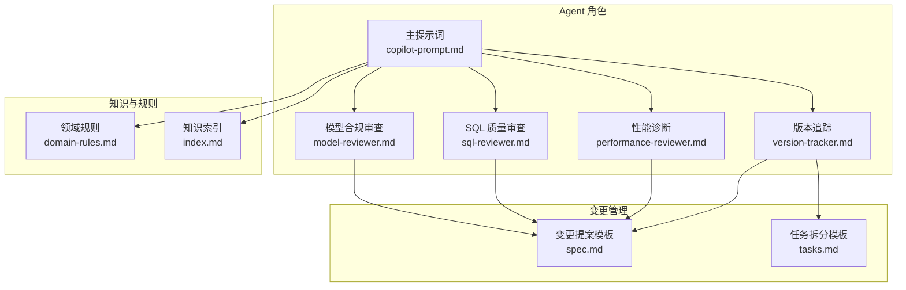
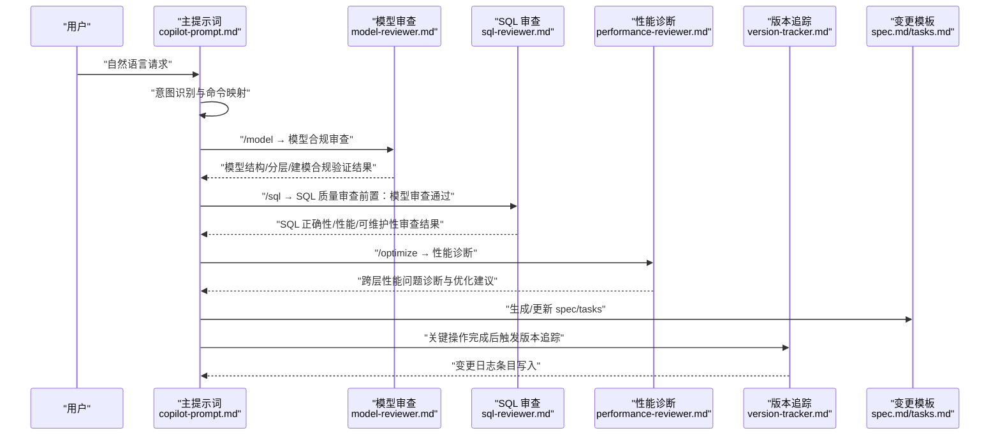
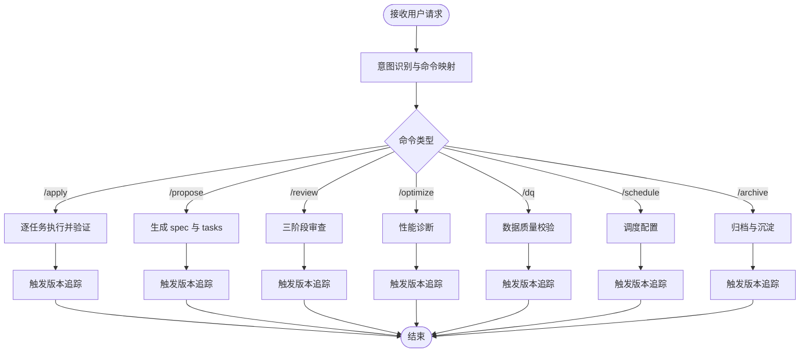
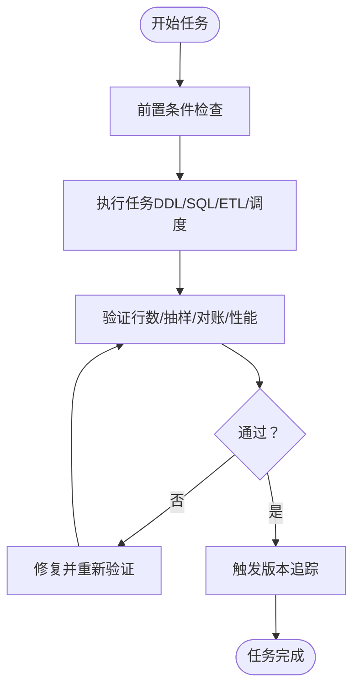
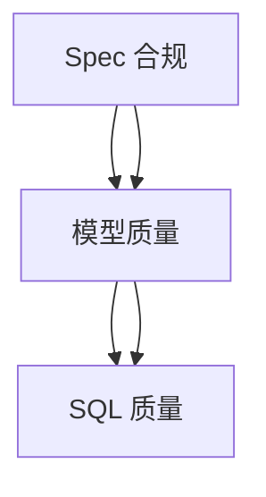
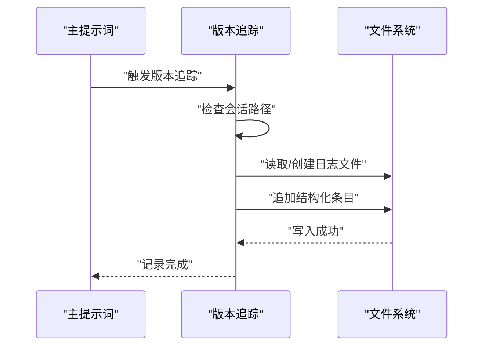
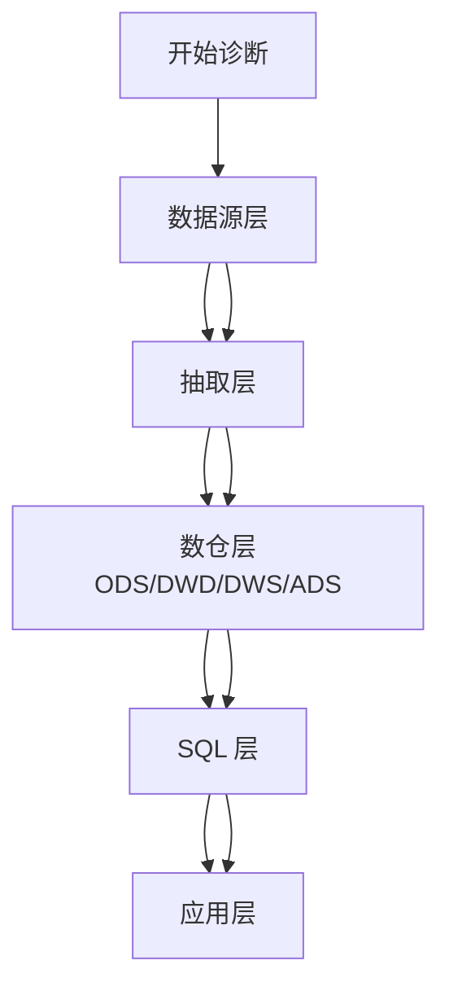
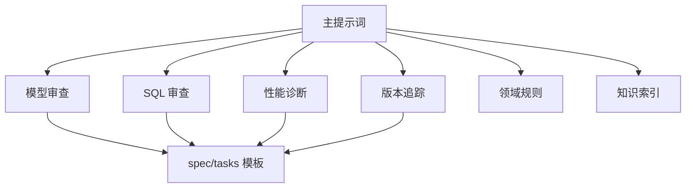

# Agent协作机制

<cite>
**本文引用的文件**
- [目录结构和设计说明.md](file://目录结构和设计说明.md)
- [copilot-prompt.md](file://agents/copilot-prompt.md)
- [model-reviewer.md](file://agents/model-reviewer.md)
- [sql-reviewer.md](file://agents/sql-reviewer.md)
- [performance-reviewer.md](file://agents/performance-reviewer.md)
- [version-tracker.md](file://agents/version-tracker.md)
- [spec.md](file://changes/templates/spec.md)
- [tasks.md](file://changes/templates/tasks.md)
- [domain-rules.md](file://rules/domain-rules.md)
- [index.md](file://knowledge/index.md)
</cite>

## 目录
1. [简介](#简介)
2. [项目结构](#项目结构)
3. [核心组件](#核心组件)
4. [架构总览](#架构总览)
5. [详细组件分析](#详细组件分析)
6. [依赖分析](#依赖分析)
7. [性能考虑](#性能考虑)
8. [故障排除指南](#故障排除指南)
9. [结论](#结论)
10. [附录](#附录)

## 简介
本文件系统性阐述 dwh-copilot 的 Agent 协作机制，围绕“命令识别与路由”“任务分配与执行”“三阶段审查流程”“版本追踪与审计”等核心要素，解释多个 Agent 之间的通信协议、协调流程与信息传递方式，并提供实际案例、扩展与自定义新 Agent 的方法。

## 项目结构
该项目采用“提示词工程 + 模板驱动 + 知识库 + 规则约束”的工程化组织方式：
- agents/：AI 角色与子 Agent 的提示词，定义职责、权限与协作边界
- changes/templates/：变更管理模板（spec、tasks、log、validation-spec）
- knowledge/：领域知识库（SQL 模式、ETL 模式、建模技巧、性能优化）
- rules/：项目约束与规范（领域规则、建模标准、调度规范、安全等）

图表来源
- [目录结构和设计说明.md: 24-54:24-54](file://目录结构和设计说明.md#L24-L54)
- [copilot-prompt.md: 1-147:1-147](file://agents/copilot-prompt.md#L1-L147)
- [model-reviewer.md: 1-50:1-50](file://agents/model-reviewer.md#L1-L50)
- [sql-reviewer.md: 1-68:1-68](file://agents/sql-reviewer.md#L1-L68)
- [performance-reviewer.md: 1-81:1-81](file://agents/performance-reviewer.md#L1-L81)
- [version-tracker.md: 1-120:1-120](file://agents/version-tracker.md#L1-L120)
- [spec.md: 1-132:1-132](file://changes/templates/spec.md#L1-L132)
- [tasks.md: 1-74:1-74](file://changes/templates/tasks.md#L1-L74)
- [domain-rules.md: 1-142:1-142](file://rules/domain-rules.md#L1-L142)
- [index.md: 1-60:1-60](file://knowledge/index.md#L1-L60)

章节来源
- [目录结构和设计说明.md: 19-55:19-55](file://目录结构和设计说明.md#L19-L55)

## 核心组件
- 主提示词（copilot-prompt.md）：定义核心法则、身份原则、命令体系、启动流程与回答框架，是所有 Agent 的协作中枢。
- 子 Agent：
  - 模型合规审查（model-reviewer.md）：验证模型结构、分层、建模规范与物理设计。
  - SQL 质量审查（sql-reviewer.md）：审查 SQL 正确性、性能与可维护性，前置条件为模型审查通过。
  - 性能诊断（performance-reviewer.md）：跨层诊断性能瓶颈，支持独立启动。
  - 版本追踪（version-tracker.md）：在关键节点自动记录结构化变更日志，确保可审计与可回溯。
- 变更模板：spec.md 与 tasks.md 作为“Spec 驱动”的载体，贯穿 propose/apply/review/archive 全流程。
- 规则与知识：domain-rules.md 与 knowledge/index.md 提供约束与经验复用。

章节来源
- [copilot-prompt.md: 4-147:4-147](file://agents/copilot-prompt.md#L4-L147)
- [model-reviewer.md: 1-50:1-50](file://agents/model-reviewer.md#L1-L50)
- [sql-reviewer.md: 1-68:1-68](file://agents/sql-reviewer.md#L1-L68)
- [performance-reviewer.md: 1-81:1-81](file://agents/performance-reviewer.md#L1-L81)
- [version-tracker.md: 1-120:1-120](file://agents/version-tracker.md#L1-L120)
- [spec.md: 1-132:1-132](file://changes/templates/spec.md#L1-L132)
- [tasks.md: 1-74:1-74](file://changes/templates/tasks.md#L1-L74)
- [domain-rules.md: 1-142:1-142](file://rules/domain-rules.md#L1-L142)
- [index.md: 1-60:1-60](file://knowledge/index.md#L1-L60)

## 架构总览
Agent 协作遵循“命令识别 → 路由 → 任务分配 → 审查 → 追踪”的闭环。主提示词负责意图识别与命令映射，子 Agent 依据职责分工协作，版本追踪贯穿每个关键节点，确保可审计与可回溯。

图表来源
- [copilot-prompt.md: 36-147:36-147](file://agents/copilot-prompt.md#L36-L147)
- [model-reviewer.md: 1-50:1-50](file://agents/model-reviewer.md#L1-L50)
- [sql-reviewer.md: 1-68:1-68](file://agents/sql-reviewer.md#L1-L68)
- [performance-reviewer.md: 1-81:1-81](file://agents/performance-reviewer.md#L1-L81)
- [version-tracker.md: 5-120:5-120](file://agents/version-tracker.md#L5-L120)
- [spec.md: 1-132:1-132](file://changes/templates/spec.md#L1-L132)
- [tasks.md: 1-74:1-74](file://changes/templates/tasks.md#L1-L74)

## 详细组件分析

### 命令识别与路由
- 意图确认：主提示词在收到用户自然语言后，先进行意图识别并映射到固定命令（如 /sql、/etl、/model、/propose、/apply、/review、/optimize、/dq、/schedule、/archive）。
- 路由规则：
  - /propose：生成变更提案（spec），并产出任务拆分（tasks）。
  - /apply：按 tasks 逐项执行，每个任务完成后触发版本追踪。
  - /review：三阶段审查（Spec 合规 → 模型质量 → SQL 质量），必须按顺序通过。
  - /optimize：性能诊断（数据源 → 抽取 → 数仓 → SQL → 应用）。
  - /dq：数据质量校验（完整性/唯一性/一致性/准确性/时效性）。
  - /schedule：调度配置与依赖。
  - /archive：归档 + 知识沉淀。
- 版本追踪路由：在 /sql、/etl、/model、/schedule、/dq、/apply 每个任务完成、以及用户手动记录时触发。

图表来源
- [copilot-prompt.md: 36-147:36-147](file://agents/copilot-prompt.md#L36-L147)
- [version-tracker.md: 5-120:5-120](file://agents/version-tracker.md#L5-L120)

章节来源
- [copilot-prompt.md: 36-147:36-147](file://agents/copilot-prompt.md#L36-L147)
- [version-tracker.md: 5-120:5-120](file://agents/version-tracker.md#L5-L120)

### 任务分配与执行
- 任务原子化：每个任务聚焦单一表或单一作业，做“小炸弹”而非“大炸弹”，便于验证与回溯。
- 任务拆分顺序：数据源接入 → ODS 落地 → DIM 维度建设 → DWD 明细加工 → DWS 汇总 → ADS 应用层 → 调度配置 → 数据质量 → 权限发布。
- 验证策略：行数核验、关键字段非空率、主键唯一性、与基准来源对账、单作业耗时、扫描量、成本等。
- 回刷计划：若涉及历史回刷，需明确分区范围、分批策略、失败处理与告警。

图表来源
- [tasks.md: 3-74:3-74](file://changes/templates/tasks.md#L3-L74)
- [version-tracker.md: 5-120:5-120](file://agents/version-tracker.md#L5-L120)

章节来源
- [tasks.md: 3-74:3-74](file://changes/templates/tasks.md#L3-L74)

### 三阶段审查流程
- 阶段一：Spec 合规（需求合规）→ 检查模型是否满足 spec 要求，包括缺失/多余/理解偏差、业务规则落地、分层合规、建模合规与物理设计合规。
- 阶段二：模型质量（模型与建模规范质量）→ 重点验证模型结构、分层依赖、一致性维度、SCD 策略与物理设计。
- 阶段三：SQL 质量（SQL 与性能质量）→ 前置条件为模型审查通过，审查 SQL 正确性、性能与可维护性。
- 审查顺序不可逆：必须前一阶段通过后方可进入下一阶段。

图表来源
- [copilot-prompt.md: 113-116:113-116](file://agents/copilot-prompt.md#L113-L116)
- [model-reviewer.md: 6-28:6-28](file://agents/model-reviewer.md#L6-L28)
- [sql-reviewer.md: 3](file://agents/sql-reviewer.md#L3)

章节来源
- [copilot-prompt.md: 113-116:113-116](file://agents/copilot-prompt.md#L113-L116)
- [model-reviewer.md: 6-28:6-28](file://agents/model-reviewer.md#L6-L28)
- [sql-reviewer.md: 3](file://agents/sql-reviewer.md#L3)

### 版本追踪与审计
- 触发时机：/sql、/etl、/model、/schedule、/dq、/apply 每个任务完成、以及用户手动记录时。
- 路径初始化：首次触发时询问并记忆变更日志存储路径，若文件不存在则自动创建并写入文件头。
- 记录格式：包含时间、模块、分层、任务、操作、变更内容、关联文件、回刷范围、影响下游与备注。
- 记录规则：原子化、精确引用、任务可追溯、下游必标注、回刷必声明、时间精确到分钟、不阻塞主流程。

图表来源
- [version-tracker.md: 5-120:5-120](file://agents/version-tracker.md#L5-L120)

章节来源
- [version-tracker.md: 5-120:5-120](file://agents/version-tracker.md#L5-L120)

### 性能诊断与优化
- 诊断框架：数据源层 → 抽取层 → 数仓层（ODS/DWD/DWS/ADS）→ SQL 层 → 应用层。
- 优化建议：分区裁剪、Join 顺序与类型、数据倾斜、CTE 物化、谓词下推、小文件合并、缓存与物化视图等。
- 对比评估：优化前后扫描量、运行耗时、资源消耗与计算成本的量化对比。

图表来源
- [performance-reviewer.md: 5-39:5-39](file://agents/performance-reviewer.md#L5-L39)

章节来源
- [performance-reviewer.md: 5-39:5-39](file://agents/performance-reviewer.md#L5-L39)

### 实际案例
- 场景 A：新建数据需求
  - 用户提出需求 → 主提示词识别为 /propose → 生成 spec 与 tasks → 用户确认 → /apply 逐任务执行 → 每个任务完成后触发版本追踪 → 全部完成后 /review 三阶段审查 → /archive 归档与沉淀。
- 场景 B：性能优化
  - 用户反馈慢 → 主提示词识别为 /optimize → 性能诊断（数据源→抽取→数仓→SQL→应用） → 给出优化建议与量化对比 → 触发版本追踪 → 沉淀到知识库。

章节来源
- [目录结构和设计说明.md: 126-166:126-166](file://目录结构和设计说明.md#L126-L166)

## 依赖分析
- 组件耦合与职责边界：
  - 主提示词是中枢，协调各子 Agent 并路由到相应模板与规则。
  - 模型审查与 SQL 审查存在前置依赖关系，SQL 审查必须在模型审查通过后进行。
  - 性能审查可独立启动，也可作为审查流程的一部分。
  - 版本追踪贯穿所有关键节点，确保可审计与可回溯。
- 外部依赖与集成点：
  - 规则与知识库提供约束与经验复用，提升审查与设计质量。
  - 变更模板（spec/tasks）作为流程契约，保证计划与执行一致。

图表来源
- [copilot-prompt.md: 1-147:1-147](file://agents/copilot-prompt.md#L1-L147)
- [model-reviewer.md: 1-50:1-50](file://agents/model-reviewer.md#L1-L50)
- [sql-reviewer.md: 1-68:1-68](file://agents/sql-reviewer.md#L1-L68)
- [performance-reviewer.md: 1-81:1-81](file://agents/performance-reviewer.md#L1-L81)
- [version-tracker.md: 1-120:1-120](file://agents/version-tracker.md#L1-L120)
- [spec.md: 1-132:1-132](file://changes/templates/spec.md#L1-L132)
- [tasks.md: 1-74:1-74](file://changes/templates/tasks.md#L1-L74)
- [domain-rules.md: 1-142:1-142](file://rules/domain-rules.md#L1-L142)
- [index.md: 1-60:1-60](file://knowledge/index.md#L1-L60)

章节来源
- [copilot-prompt.md: 1-147:1-147](file://agents/copilot-prompt.md#L1-L147)
- [model-reviewer.md: 1-50:1-50](file://agents/model-reviewer.md#L1-L50)
- [sql-reviewer.md: 1-68:1-68](file://agents/sql-reviewer.md#L1-L68)
- [performance-reviewer.md: 1-81:1-81](file://agents/performance-reviewer.md#L1-L81)
- [version-tracker.md: 1-120:1-120](file://agents/version-tracker.md#L1-L120)
- [spec.md: 1-132:1-132](file://changes/templates/spec.md#L1-L132)
- [tasks.md: 1-74:1-74](file://changes/templates/tasks.md#L1-L74)
- [domain-rules.md: 1-142:1-142](file://rules/domain-rules.md#L1-L142)
- [index.md: 1-60:1-60](file://knowledge/index.md#L1-L60)

## 性能考虑
- 命令识别与路由：尽量减少歧义，确保意图识别准确，避免重复触发与遗漏。
- 任务拆分：保持原子化，降低验证成本与回滚难度。
- 审查顺序：严格按 Spec 合规 → 模型质量 → SQL 质量的顺序，避免返工。
- 版本追踪：在关键节点触发，确保审计成本可控且信息完整。
- 性能诊断：建立量化对比基线，持续沉淀优化经验。

## 故障排除指南
- 常见问题与处理
  - 审查未通过：根据审查结果逐项修复，必要时回退到上一版本并重新验证。
  - 性能瓶颈：按诊断框架定位根因，优先修复分区裁剪、Join 顺序与倾斜问题。
  - 版本追踪失败：检查日志路径有效性与权限，提示用户但不中断主流程。
  - 任务未完成：检查前置条件、依赖与验证标准，确保每一步都有可验证证据。
- 调试流程：现象收集 → 根因定位 → 方案验证 → 实施修复，禁止在未确认根因前直接修改。

章节来源
- [copilot-prompt.md: 133-147:133-147](file://agents/copilot-prompt.md#L133-L147)
- [version-tracker.md: 80-89:80-89](file://agents/version-tracker.md#L80-L89)

## 结论
dwh-copilot 的 Agent 协作机制以“命令识别与路由”为核心，通过“任务原子化与模板驱动”实现可审计、可回溯、可复用的数仓工程化流程。主提示词作为中枢，协调模型审查、SQL 审查、性能诊断与版本追踪，确保 Spec 驱动与三阶段审查落地。通过知识库与规则约束，持续沉淀经验并提升质量与效率。

## 附录
- 新 Agent 开发方法
  - 明确职责与权限：仅读/只写/可执行，避免越权。
  - 设计输出格式：结构化、可机器解析，便于与其他 Agent 协作。
  - 定义触发条件：与主提示词命令映射一致，或在特定阶段前置启动。
  - 集成版本追踪：在关键节点触发，确保可审计。
  - 参考现有 Agent：model-reviewer、sql-reviewer、performance-reviewer 的职责边界与输出格式。
- 扩展建议
  - 新增独立的数据质量评审 Agent（dq-reviewer.md）。
  - 针对实时数仓（Flink）与湖仓一体（Iceberg/Hudi/Delta）专题扩展知识库。
  - 集成 dbt/SQLMesh 自动生成模型与测试。
  - 集成数据血缘平台（DataHub/OpenMetadata）实现变更影响分析自动化。

章节来源
- [目录结构和设计说明.md: 196-204:196-204](file://目录结构和设计说明.md#L196-L204)
- [model-reviewer.md: 48-50:48-50](file://agents/model-reviewer.md#L48-L50)
- [sql-reviewer.md: 66-68:66-68](file://agents/sql-reviewer.md#L66-L68)
- [performance-reviewer.md: 79-81:79-81](file://agents/performance-reviewer.md#L79-L81)
- [version-tracker.md: 115-120:115-120](file://agents/version-tracker.md#L115-L120)