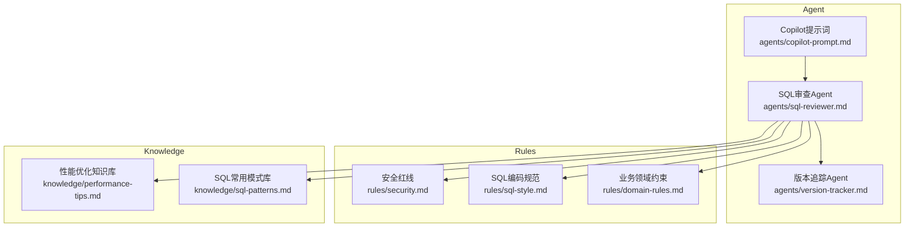
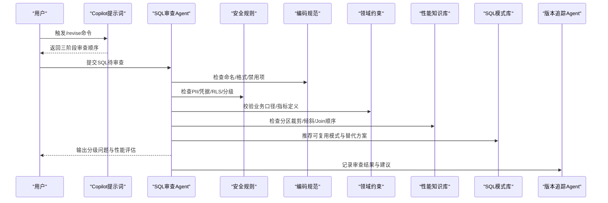
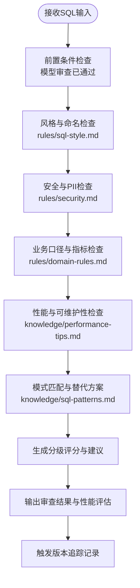
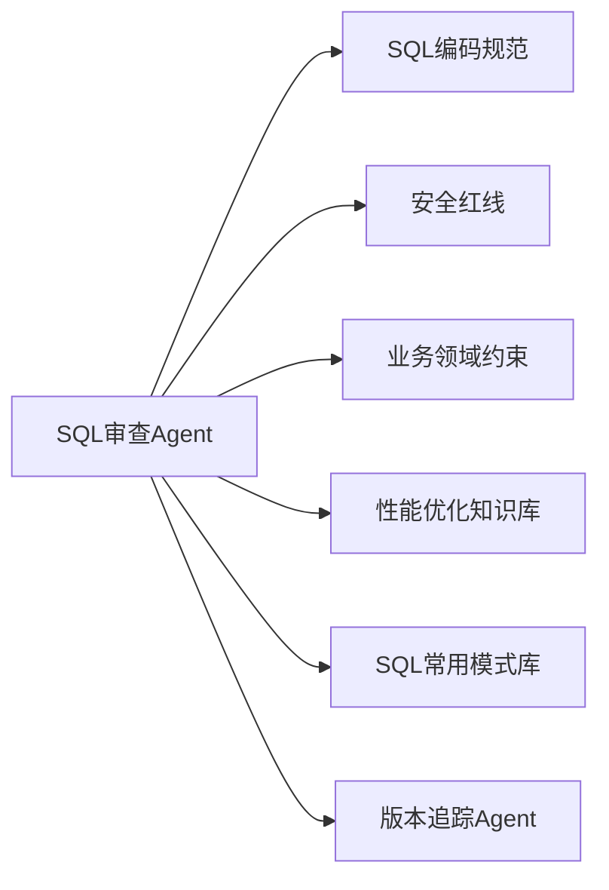

# SQL审查Agent

<cite>
**本文引用的文件**
- [agents/sql-reviewer.md](file://agents/sql-reviewer.md)
- [rules/security.md](file://rules/security.md)
- [rules/sql-style.md](file://rules/sql-style.md)
- [rules/domain-rules.md](file://rules/domain-rules.md)
- [knowledge/performance-tips.md](file://knowledge/performance-tips.md)
- [knowledge/sql-patterns.md](file://knowledge/sql-patterns.md)
- [agents/copilot-prompt.md](file://agents/copilot-prompt.md)
- [agents/version-tracker.md](file://agents/version-tracker.md)
</cite>

## 目录
1. [简介](#简介)
2. [项目结构](#项目结构)
3. [核心组件](#核心组件)
4. [架构总览](#架构总览)
5. [详细组件分析](#详细组件分析)
6. [依赖分析](#依赖分析)
7. [性能考量](#性能考量)
8. [故障排查指南](#故障排查指南)
9. [结论](#结论)
10. [附录](#附录)

## 简介
本文件为“SQL审查Agent”的技术文档，面向数据仓库工程师与AI协作助手的使用者，系统阐述SQL质量审查的工作原理、审查标准、评分机制与改进建议生成算法，并结合仓库内的规则与知识库，给出可操作的审查流程、示例与常见问题解决方案。审查Agent专注于数仓SQL的正确性、性能与可维护性，确保产出满足规范、安全与质量要求。

## 项目结构
该仓库围绕“规则（rules）+ 知识库（knowledge）+ Agent（agents）”三层组织，SQL审查Agent作为其中一环，承接规范与知识，形成标准化的审查流程与输出。

图表来源
- [agents/sql-reviewer.md:1-68](file://agents/sql-reviewer.md#L1-L68)
- [agents/copilot-prompt.md:113-115](file://agents/copilot-prompt.md#L113-L115)
- [rules/security.md:1-98](file://rules/security.md#L1-L98)
- [rules/sql-style.md:1-254](file://rules/sql-style.md#L1-L254)
- [rules/domain-rules.md:1-142](file://rules/domain-rules.md#L1-L142)
- [knowledge/performance-tips.md:1-349](file://knowledge/performance-tips.md#L1-L349)
- [knowledge/sql-patterns.md:1-331](file://knowledge/sql-patterns.md#L1-L331)
- [agents/version-tracker.md:1-79](file://agents/version-tracker.md#L1-L79)

章节来源
- [agents/sql-reviewer.md:1-68](file://agents/sql-reviewer.md#L1-L68)
- [agents/copilot-prompt.md:113-115](file://agents/copilot-prompt.md#L113-L115)

## 核心组件
- SQL审查Agent：负责对SQL进行质量、性能与可维护性审查，输出分级问题与性能评估摘要。
- 规则体系（rules）：提供安全、风格、领域约束等强制与建议性标准。
- 知识库（knowledge）：提供性能优化与常用SQL模式，支撑审查建议与最佳实践。
- Copilot提示词：定义审查流程、输出框架与三阶段审查顺序。
- 版本追踪Agent：在审查完成后记录结构化变更日志，保障可追溯性。

章节来源
- [agents/sql-reviewer.md:1-68](file://agents/sql-reviewer.md#L1-L68)
- [rules/security.md:1-98](file://rules/security.md#L1-L98)
- [rules/sql-style.md:1-254](file://rules/sql-style.md#L1-L254)
- [rules/domain-rules.md:1-142](file://rules/domain-rules.md#L1-L142)
- [knowledge/performance-tips.md:1-349](file://knowledge/performance-tips.md#L1-L349)
- [knowledge/sql-patterns.md:1-331](file://knowledge/sql-patterns.md#L1-L331)
- [agents/copilot-prompt.md:113-115](file://agents/copilot-prompt.md#L113-L115)
- [agents/version-tracker.md:1-79](file://agents/version-tracker.md#L1-L79)

## 架构总览
SQL审查Agent在Copilot提示词的三阶段审查框架下，串联规则与知识库，形成“规范驱动 + 知识支撑 + 结果可追溯”的审查闭环。

图表来源
- [agents/copilot-prompt.md:113-115](file://agents/copilot-prompt.md#L113-L115)
- [agents/sql-reviewer.md:1-68](file://agents/sql-reviewer.md#L1-L68)
- [rules/security.md:1-98](file://rules/security.md#L1-L98)
- [rules/sql-style.md:1-254](file://rules/sql-style.md#L1-L254)
- [rules/domain-rules.md:1-142](file://rules/domain-rules.md#L1-L142)
- [knowledge/performance-tips.md:1-349](file://knowledge/performance-tips.md#L1-L349)
- [knowledge/sql-patterns.md:1-331](file://knowledge/sql-patterns.md#L1-L331)
- [agents/version-tracker.md:1-79](file://agents/version-tracker.md#L1-L79)

## 详细组件分析

### SQL审查Agent（核心职责与流程）
- 审查目标：质量（正确性/可维护性）、性能（分区裁剪/倾斜/Join顺序）、安全（PII/凭据/RLS）。
- 审查前置：必须在模型审查通过后启动。
- 审查分级：
  - Critical（阻塞）：结果错误、笛卡尔积/多对多膨胀、全表扫描、重复键、回刷无幂等、跨库/PII未脱敏。
  - Important（应修复）：子查询未CTE、重复计算、隐式类型转换、NULL处理缺失、分区字段函数包裹、WHERE写在ON、缺别名、超长SQL缺注释。
  - Minor（建议）：关键字大小写不统一、缩进/换行不一致、字段顺序与DDL不一致、可合并多次INSERT。
- 性能审查清单：分区裁剪、Join顺序、Map/Broadcast Join、数据倾斜、聚合下推、SELECT *、ORDER BY位置、DISTINCT与GROUP BY替换、窗口函数PARTITION BY合理性、CTE物化。
- 输出格式：按分级列出问题，附性能评估摘要（影响等级、扫描量预估、优化建议）。

图表来源
- [agents/sql-reviewer.md:1-68](file://agents/sql-reviewer.md#L1-L68)
- [rules/sql-style.md:1-254](file://rules/sql-style.md#L1-L254)
- [rules/security.md:1-98](file://rules/security.md#L1-L98)
- [rules/domain-rules.md:1-142](file://rules/domain-rules.md#L1-L142)
- [knowledge/performance-tips.md:1-349](file://knowledge/performance-tips.md#L1-L349)
- [knowledge/sql-patterns.md:1-331](file://knowledge/sql-patterns.md#L1-L331)
- [agents/version-tracker.md:1-79](file://agents/version-tracker.md#L1-L79)

章节来源
- [agents/sql-reviewer.md:1-68](file://agents/sql-reviewer.md#L1-L68)

### 审查标准与评分机制
- 评分维度
  - 正确性：业务口径、聚合粒度、Join膨胀、NULL处理、幂等回刷。
  - 性能：分区裁剪、倾斜风险、Join顺序、Map/Broadcast、CTE物化、列裁剪/谓词下推。
  - 安全：PII脱敏、凭据隐藏、RLS、数据分级与访问控制。
  - 可维护性：CTE化、注释与别名、风格一致性、复杂SQL注释。
- 评分等级
  - Critical：阻断项，必须修复后方可进入下一阶段。
  - Important：应修复项，影响较大，建议优先处理。
  - Minor：建议项，提升可维护性与一致性。
- 评分与建议生成算法
  - 规则匹配：对SQL片段逐一匹配规则清单，命中即生成问题项。
  - 性能评估：基于性能知识库的检查清单，逐项打钩并量化影响等级与扫描量预估。
  - 建议生成：结合模式库与最佳实践，给出替代写法与优化建议。
  - 输出格式：按分级组织，提供可执行的修复建议与验证要点。

章节来源
- [agents/sql-reviewer.md:5-64](file://agents/sql-reviewer.md#L5-L64)
- [rules/security.md:1-98](file://rules/security.md#L1-L98)
- [rules/sql-style.md:165-190](file://rules/sql-style.md#L165-L190)
- [knowledge/performance-tips.md:5-349](file://knowledge/performance-tips.md#L5-L349)
- [knowledge/sql-patterns.md:1-331](file://knowledge/sql-patterns.md#L1-L331)

### 安全审查要点
- 禁止在脚本/配置中硬编码凭据；ADS/视图不得直接展示PII，必须脱敏或哈希。
- 多租户/多组织场景必须配置行级权限（RLS），变更需人工审查与验证。
- 数据分级与访问控制：L3+数据导出需二次审批，审计日志保留≥6个月。
- 上线与发布安全：PR Review、PII/财务表需双签、DDL变更需回滚预案、服务账号使用统一密钥管理。
- 回刷安全：明确范围与影响，发布数据修订公告，低峰期执行。

章节来源
- [rules/security.md:7-98](file://rules/security.md#L7-L98)

### 性能审查要点
- 分区裁剪：WHERE直接命中分区字段，禁止函数包裹；通过EXPLAIN验证。
- 倾斜风险：热点Key、高频空值/默认值、时间集中；提供过滤/加盐/Map Join等方案。
- Join顺序与类型：按引擎特性选择，Spark/Trino优先CBO，Hive可广播小表。
- CTE物化：Hive/Spark默认不物化，复杂多次引用建议落临时表或CACHE。
- 谓词下推与列裁剪：WHERE尽量下推，避免UDF导致失效；避免SELECT *。
- 窗口函数：PARTITION BY列基数适中，必要时配合DISTRIBUTE BY/SORT BY。
- 存储格式：优先ORC/Parquet + ZSTD，列裁剪与统计信息提升查询性能。

章节来源
- [knowledge/performance-tips.md:5-349](file://knowledge/performance-tips.md#L5-L349)

### 最佳实践与模式库
- 常用模式：去重保留最新、拉链表（SCD Type 2）、同环比、TopN、累计求和、行转列/列转行、数据回刷（幂等覆盖）、Lambda（增量+全量合并）、缺失日期补齐、NULL安全比较。
- 模式解释与性能说明：提供标准写法、等价写法与性能权衡，指导在不同引擎下的实现与优化。

章节来源
- [knowledge/sql-patterns.md:1-331](file://knowledge/sql-patterns.md#L1-L331)

### 审查流程与输出
- 流程：Copilot提示词定义三阶段审查顺序（Spec合规 → 模型质量 → SQL质量），SQL审查Agent在模型审查通过后启动。
- 输出：按Critical/Important/Minor分级列出问题，附性能评估摘要（影响等级、扫描量预估、优化建议）。
- 权限：仅需只读权限（Read/Grep/Glob）。

章节来源
- [agents/copilot-prompt.md:113-115](file://agents/copilot-prompt.md#L113-L115)
- [agents/sql-reviewer.md:44-67](file://agents/sql-reviewer.md#L44-L67)

### 配置参数与自定义选项
- 审查开关与范围
  - 规则集：alwaysApply为true的规则默认启用；domain-rules.md可在涉及业务领域特定逻辑时启用。
- 审查清单与自定义
  - 性能清单：可根据引擎特性调整Map Join阈值、倾斜检测参数、CTE物化策略。
  - 安全清单：根据数据分级与RLS策略调整脱敏与访问控制规则。
  - 风格清单：可扩展命名约定、注释模板与格式规范。
- 输出格式与模板
  - 采用分级输出与性能评估摘要模板，支持在团队内统一审查报告风格。

章节来源
- [rules/sql-style.md:1-254](file://rules/sql-style.md#L1-L254)
- [rules/domain-rules.md:1-4](file://rules/domain-rules.md#L1-L4)
- [agents/sql-reviewer.md:31-64](file://agents/sql-reviewer.md#L31-L64)

## 依赖分析
SQL审查Agent的依赖关系主要体现在规则与知识库的引用与交叉验证。

图表来源
- [agents/sql-reviewer.md:1-68](file://agents/sql-reviewer.md#L1-L68)
- [rules/security.md:1-98](file://rules/security.md#L1-L98)
- [rules/sql-style.md:1-254](file://rules/sql-style.md#L1-L254)
- [rules/domain-rules.md:1-142](file://rules/domain-rules.md#L1-L142)
- [knowledge/performance-tips.md:1-349](file://knowledge/performance-tips.md#L1-L349)
- [knowledge/sql-patterns.md:1-331](file://knowledge/sql-patterns.md#L1-L331)
- [agents/version-tracker.md:1-79](file://agents/version-tracker.md#L1-L79)

章节来源
- [agents/sql-reviewer.md:1-68](file://agents/sql-reviewer.md#L1-L68)

## 性能考量
- 分区裁剪与谓词下推：直接影响扫描量与执行时长，必须在WHERE中直接命中分区字段。
- 倾斜与热点：通过过滤、加盐、Map Join等方式缓解，避免单分区过载。
- Join顺序与类型：依据引擎特性选择最优Join策略，减少Shuffle与内存压力。
- CTE与物化：复杂多次引用建议落盘或缓存，避免重复计算。
- 存储格式与统计：列存格式与统计信息显著提升查询性能。

章节来源
- [knowledge/performance-tips.md:5-349](file://knowledge/performance-tips.md#L5-L349)

## 故障排查指南
- 常见问题
  - 分区裁剪失效：WHERE使用函数包裹分区字段，导致全表扫描；建议改为直接比较。
  - 数据倾斜：热点Key或默认值参与Join/Group By；建议过滤、加盐或Map Join。
  - 子查询未CTE：可读性差且重复计算；建议改写为WITH子句并物化。
  - NULL处理缺失：COUNT/SUM/Join条件中未显式处理NULL；建议使用COALESCE或安全比较。
  - SELECT *：增加扫描与解析成本；建议明确字段列表。
- 排查步骤
  - EXPLAIN查看执行计划，确认分区裁剪、Join类型与Shuffle数量。
  - 采样分析热点键，定位倾斜根因。
  - 对照性能知识库与模式库，验证替代写法与优化建议。
  - 通过版本追踪Agent记录问题与修复过程，确保可追溯。

章节来源
- [knowledge/performance-tips.md:23-349](file://knowledge/performance-tips.md#L23-L349)
- [knowledge/sql-patterns.md:1-331](file://knowledge/sql-patterns.md#L1-L331)
- [agents/version-tracker.md:1-79](file://agents/version-tracker.md#L1-L79)

## 结论
SQL审查Agent以规则与知识库为依据，构建了覆盖正确性、性能与安全的审查体系。通过分级评分与可执行建议，帮助团队在三阶段审查中持续提升SQL质量与可维护性，同时借助版本追踪实现变更可追溯与知识沉淀。

## 附录
- 审查示例与建议
  - 分区裁剪失效：将函数包裹的分区字段改为直接比较，减少扫描量。
  - 数据倾斜：对热点Key单独处理或加盐打散，降低单分区负载。
  - 可读性提升：将深层子查询改写为CTE并物化，提升可维护性。
  - 安全加固：对PII字段进行脱敏或哈希，避免在ADS/视图中直接展示。
- 常用SQL模式参考
  - 去重保留最新、拉链表（SCD Type 2）、同环比、TopN、累计求和、行转列/列转行、数据回刷（幂等覆盖）、Lambda（增量+全量合并）、缺失日期补齐、NULL安全比较。

章节来源
- [knowledge/sql-patterns.md:1-331](file://knowledge/sql-patterns.md#L1-L331)
- [agents/sql-reviewer.md:44-64](file://agents/sql-reviewer.md#L44-L64)