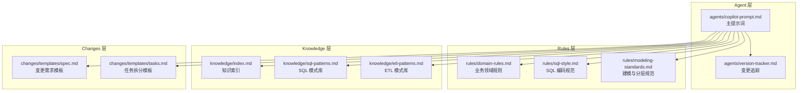
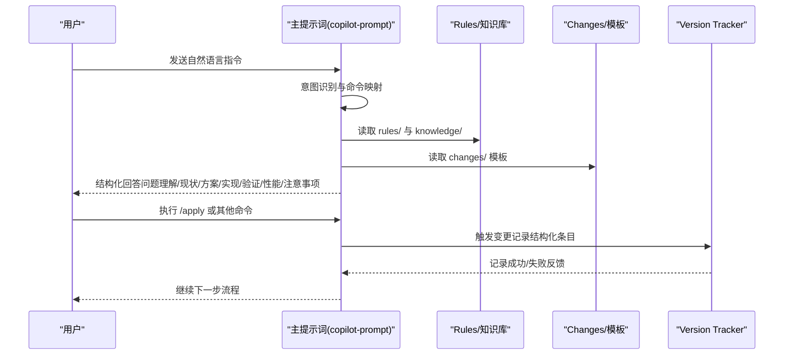
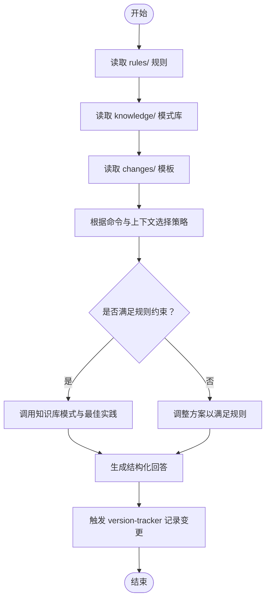
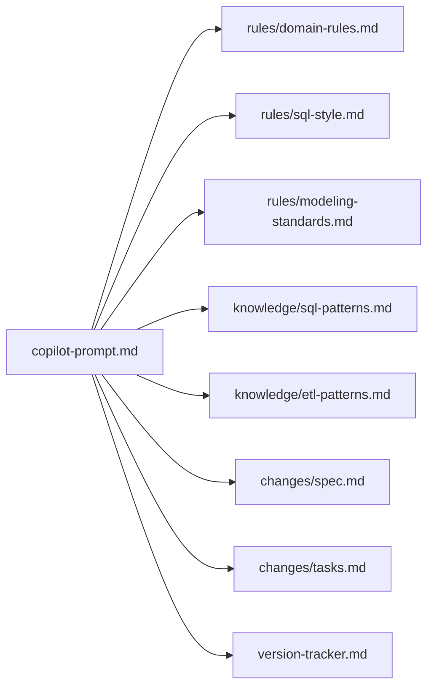

# 主提示词设计

<cite>
**本文引用的文件**
- [copilot-prompt.md](file://data_warehouse_engineering_code_copilot/agents/copilot-prompt.md)
- [目录结构和设计说明.md](file://data_warehouse_engineering_code_copilot/目录结构和设计说明.md)
- [version-tracker.md](file://data_warehouse_engineering_code_copilot/agents/version-tracker.md)
- [domain-rules.md](file://data_warehouse_engineering_code_copilot/rules/domain-rules.md)
- [sql-style.md](file://data_warehouse_engineering_code_copilot/rules/sql-style.md)
- [modeling-standards.md](file://data_warehouse_engineering_code_copilot/rules/modeling-standards.md)
- [index.md](file://data_warehouse_engineering_code_copilot/knowledge/index.md)
- [sql-patterns.md](file://data_warehouse_engineering_code_copilot/knowledge/sql-patterns.md)
- [etl-patterns.md](file://data_warehouse_engineering_code_copilot/knowledge/etl-patterns.md)
- [spec.md](file://data_warehouse_engineering_code_copilot/changes/templates/spec.md)
- [tasks.md](file://data_warehouse_engineering_code_copilot/changes/templates/tasks.md)
</cite>

## 目录
1. [简介](#简介)
2. [项目结构](#项目结构)
3. [核心组件](#核心组件)
4. [架构总览](#架构总览)
5. [详细组件分析](#详细组件分析)
6. [依赖分析](#依赖分析)
7. [性能考虑](#性能考虑)
8. [故障排查指南](#故障排查指南)
9. [结论](#结论)
10. [附录](#附录)

## 简介
本文件围绕主提示词“dwh-copilot”（数据仓库工程化协作助手）进行系统化技术文档化，重点阐释：
- AI 助手的核心身份与工作原则
- 三段式知识结构（rules/、knowledge/、changes/）的协作机制与信息调用流程
- 回答结构化输出的设计原理与格式规范
- 命令式工作流与强制变更追踪机制
- 面向不同数据仓库场景的提示词参数调整策略与最佳实践

## 项目结构
该项目采用“Agent + 知识库 + 变更管理”的工程化提示词工程组织方式，强调“Spec 驱动 + 三段式知识 + 强制变更追踪”。核心目录与职责如下：
- agents/：AI 角色与子 Agent 提示词，主提示词位于 copilot-prompt.md
- rules/：项目约束与规范（强制），包括 SQL 编码规范、建模分层标准、调度与安全等
- knowledge/：领域知识库（推荐复用），包含 SQL 模式、ETL 模式、建模技巧、性能优化等
- changes/：变更管理（历史与过程），包含 Spec 模板、任务模板、日志模板等
- 目录结构和设计说明.md：总体设计原则、命令体系、典型工作流与扩展方向

图表来源
- [目录结构和设计说明.md: 19-55:19-55](file://data_warehouse_engineering_code_copilot/目录结构和设计说明.md#L19-L55)
- [copilot-prompt.md: 1-147:1-147](file://data_warehouse_engineering_code_copilot/agents/copilot-prompt.md#L1-L147)

章节来源
- [目录结构和设计说明.md: 19-55:19-55](file://data_warehouse_engineering_code_copilot/目录结构和设计说明.md#L19-L55)
- [目录结构和设计说明.md: 70-78:70-78](file://data_warehouse_engineering_code_copilot/目录结构和设计说明.md#L70-L78)

## 核心组件
- 主提示词（copilot-prompt.md）
  - 身份与原则：强调“顶尖数仓工程师搭档”，输出语言与术语规范，不确定就问、不假设、不编造
  - 核心法则：Spec 驱动（Model is Cheap, Context is Expensive），No Spec, No Change，Spec is Truth，Reverse Sync，现状必须有出处，变更即记录
  - 回答框架：问题理解、现状分析、方案设计、具体实现、验证方法、性能与成本考量、注意事项
  - 命令体系：/init、/sql、/etl、/model、/propose、/apply、/review、/optimize、/dq、/schedule、/archive
  - 启动流程：读取 rules/、检查 changes/ 进行中变更、检查版本追踪路径、报告状态与命令菜单
- 变更追踪（version-tracker.md）
  - 触发时机：SQL/ETL/模型/调度变更后，以及 apply 每个 task 完成后
  - 记录格式：模块、分层、任务、操作、变更内容、关联文件、回刷范围、影响下游、备注
  - 记录规则：原子化、精确引用、任务可追溯、下游必标注、回刷必声明、时间精确到分钟、不阻塞主流程
- 知识库与规则
  - rules/：domain-rules.md（业务领域与 KPI）、sql-style.md（SQL 编码规范）、modeling-standards.md（建模与分层）
  - knowledge/：index.md（索引）、sql-patterns.md（SQL 模式）、etl-patterns.md（ETL 模式）
  - changes/：spec.md（变更需求）、tasks.md（任务拆分）

章节来源
- [copilot-prompt.md: 15-34:15-34](file://data_warehouse_engineering_code_copilot/agents/copilot-prompt.md#L15-L34)
- [copilot-prompt.md: 36-53:36-53](file://data_warehouse_engineering_code_copilot/agents/copilot-prompt.md#L36-L53)
- [copilot-prompt.md: 55-61:55-61](file://data_warehouse_engineering_code_copilot/agents/copilot-prompt.md#L55-L61)
- [version-tracker.md: 5-16:5-16](file://data_warehouse_engineering_code_copilot/agents/version-tracker.md#L5-L16)
- [version-tracker.md: 44-64:44-64](file://data_warehouse_engineering_code_copilot/agents/version-tracker.md#L44-L64)
- [version-tracker.md: 80-89:80-89](file://data_warehouse_engineering_code_copilot/agents/version-tracker.md#L80-L89)

## 架构总览
主提示词通过“命令驱动 + 三段式知识 + 强制变更追踪”的闭环，将 AI 的回答与工程实践绑定，确保每次变更都有据可依、可审计、可回溯。

图表来源
- [copilot-prompt.md: 36-53:36-53](file://data_warehouse_engineering_code_copilot/agents/copilot-prompt.md#L36-L53)
- [copilot-prompt.md: 65-131:65-131](file://data_warehouse_engineering_code_copilot/agents/copilot-prompt.md#L65-L131)
- [version-tracker.md: 5-16:5-16](file://data_warehouse_engineering_code_copilot/agents/version-tracker.md#L5-L16)

## 详细组件分析

### 身份与工作原则
- 身份定位：顶尖数仓工程师搭档，不是 SQL 生成器；用中文输出，技术术语保留英文
- 工作原则：不确定就问，不假设，不编造；每个任务原子化；涉及生产数据/PII/财务/历史回刷高亮提醒人工审查；有价值的发现主动沉淀到 knowledge/
- 核心法则：Spec 驱动、No Spec, No Change、Spec is Truth、Reverse Sync、现状必须有出处、变更即记录

章节来源
- [copilot-prompt.md: 15-22:15-22](file://data_warehouse_engineering_code_copilot/agents/copilot-prompt.md#L15-L22)
- [copilot-prompt.md: 6-13:6-13](file://data_warehouse_engineering_code_copilot/agents/copilot-prompt.md#L6-L13)

### 回答框架设计
回答必须包含以下结构（根据问题类型可省略不适用的部分）：
1) 问题理解 — 复述问题，确认理解一致
2) 现状分析 — 引用具体库.表.字段、作业名、SQL 片段，标注出处
3) 方案设计 — 给出推荐方案 + 替代方案（标注各自优劣）
4) 具体实现 — DDL / SQL / 调度配置（可直接复制使用）
5) 验证方法 — 数据对比、行数核验、对账 SQL
6) 性能与成本考量 — 数据扫描量、Shuffle、倾斜风险、计算成本
7) 注意事项 — 边界条件、回刷影响、上下游依赖、安全提醒

章节来源
- [copilot-prompt.md: 23-34:23-34](file://data_warehouse_engineering_code_copilot/agents/copilot-prompt.md#L23-L34)

### 命令体系与启动流程
- 启动流程：读取 rules/ 下所有规则文件；检查 changes/ 下是否有进行中的变更（排除 templates/）；检查当前会话是否已设置变更日志路径；报告当前状态，展示命令菜单
- 命令映射：将用户自然语言映射到 /sql、/etl、/model、/propose、/apply、/review、/optimize、/dq、/schedule、/archive 等命令
- 典型命令职责：
  - /sql：理解业务口径 → 编写 SQL（带注释，遵循 rules/sql-style.md）→ 提供验证方法 → 性能评估 → 触发 version-tracker
  - /etl：研究数据源 → 设计同步方式（全量/增量/CDC）→ 编写脚本（DataX/SeaTunnel/Flink CDC/dbt）→ 验证幂等与回放能力 → 触发 version-tracker
  - /model：业务过程梳理 → 选定粒度 → 识别维度 → 识别事实 → 分层归属判定 → DDL 设计 → 关系与口径文档化 → 基础度量值/指标对齐 domain-rules.md → 触发 version-tracker
  - /propose：Research → 逐个提问（一次只问一个，给选项+推荐）→ YAGNI 裁剪 → 分段生成 spec → HARD-GATE 确认
  - /apply：前置检查 spec + tasks + 用户确认 → 逐 task 执行，每个 task 完成后展示验证证据 → 零偏差原则：Plan 是合同，AI 是打印机 → 每个 task 完成后触发 version-tracker
  - /review：三阶段审查（Spec 合规 → 模型质量 → SQL 质量），阶段一 PASS 后才启动阶段二，阶段二 PASS 后才启动阶段三
  - /optimize：四层诊断（数据源层 → 抽取层 → 数仓层（ODS/DWD/DWS/ADS）→ 应用层）→ 必须量化优化前后的对比指标
  - /dq：五大维度（完整性/唯一性/一致性/准确性/时效性）→ 为每条规则产出可执行的对账 SQL，并与基准来源对比
  - /schedule：依赖识别 → 调度周期 → 重试与告警 → SLA/基线 → 资源队列 → 失败回放策略 → 有作业新增/调整时触发 version-tracker
  - /archive：逐条展示 log.md 知识发现，确认后沉淀到 knowledge/ → 完成后触发 version-tracker

章节来源
- [copilot-prompt.md: 55-61:55-61](file://data_warehouse_engineering_code_copilot/agents/copilot-prompt.md#L55-L61)
- [copilot-prompt.md: 36-53:36-53](file://data_warehouse_engineering_code_copilot/agents/copilot-prompt.md#L36-L53)
- [copilot-prompt.md: 68-89:68-89](file://data_warehouse_engineering_code_copilot/agents/copilot-prompt.md#L68-L89)
- [copilot-prompt.md: 91-93:91-93](file://data_warehouse_engineering_code_copilot/agents/copilot-prompt.md#L91-L93)
- [copilot-prompt.md: 95-101:95-101](file://data_warehouse_engineering_code_copilot/agents/copilot-prompt.md#L95-L101)
- [copilot-prompt.md: 103-105:103-105](file://data_warehouse_engineering_code_copilot/agents/copilot-prompt.md#L103-L105)
- [copilot-prompt.md: 107-111:107-111](file://data_warehouse_engineering_code_copilot/agents/copilot-prompt.md#L107-L111)
- [copilot-prompt.md: 113-115:113-115](file://data_warehouse_engineering_code_copilot/agents/copilot-prompt.md#L113-L115)
- [copilot-prompt.md: 117-119:117-119](file://data_warehouse_engineering_code_copilot/agents/copilot-prompt.md#L117-L119)
- [copilot-prompt.md: 121-123:121-123](file://data_warehouse_engineering_code_copilot/agents/copilot-prompt.md#L121-L123)
- [copilot-prompt.md: 125-127:125-127](file://data_warehouse_engineering_code_copilot/agents/copilot-prompt.md#L125-L127)
- [copilot-prompt.md: 129-131:129-131](file://data_warehouse_engineering_code_copilot/agents/copilot-prompt.md#L129-L131)

### 三段式知识结构协作机制
- rules/：约束与规范（强制），提供业务领域规则、SQL 编码规范、建模与分层标准、调度与安全等
- knowledge/：经验与模式库（推荐），提供 SQL 模式、ETL 模式、建模技巧、性能优化等
- changes/：过程与历史（强制），提供 Spec/任务/日志模板，确保每次变更可审计、可回溯

图表来源
- [目录结构和设计说明.md: 70-78:70-78](file://data_warehouse_engineering_code_copilot/目录结构和设计说明.md#L70-L78)
- [copilot-prompt.md: 58-61:58-61](file://data_warehouse_engineering_code_copilot/agents/copilot-prompt.md#L58-L61)

章节来源
- [目录结构和设计说明.md: 70-78:70-78](file://data_warehouse_engineering_code_copilot/目录结构和设计说明.md#L70-L78)
- [copilot-prompt.md: 58-61:58-61](file://data_warehouse_engineering_code_copilot/agents/copilot-prompt.md#L58-L61)

### 结构化输出设计原理与格式规范
- 输出结构：问题理解、现状分析、方案设计、具体实现、验证方法、性能与成本考量、注意事项
- 输出语言：中文为主，SQL 关键字、函数名等技术术语保留英文
- 输出来源：每个结论必须标注出处（库.表.字段、作业名、SQL 片段）
- 命令专属格式：
  - /sql：需求理解、数据口径、依赖表/字段、SQL 代码、验证方法、性能说明
  - /etl：研究数据源、设计同步方式、编写脚本、验证幂等与回放能力
  - /model：业务过程梳理、分层归属、DDL 设计、关系与口径文档化、指标对齐
  - /propose：Research、逐个提问、YAGNI 裁剪、分段生成 spec、HARD-GATE 确认
  - /apply：前置检查、逐 task 执行、验证证据、零偏差原则
  - /review：三阶段审查（Spec 合规 → 模型质量 → SQL 质量）
  - /optimize：四层诊断与量化对比
  - /dq：五大维度与对账 SQL
  - /schedule：依赖识别、调度周期、重试与告警、SLA/基线、资源队列、失败回放策略
  - /archive：知识发现沉淀到 knowledge/

章节来源
- [copilot-prompt.md: 23-34:23-34](file://data_warehouse_engineering_code_copilot/agents/copilot-prompt.md#L23-L34)
- [copilot-prompt.md: 75-89:75-89](file://data_warehouse_engineering_code_copilot/agents/copilot-prompt.md#L75-L89)
- [copilot-prompt.md: 91-93:91-93](file://data_warehouse_engineering_code_copilot/agents/copilot-prompt.md#L91-L93)
- [copilot-prompt.md: 95-101:95-101](file://data_warehouse_engineering_code_copilot/agents/copilot-prompt.md#L95-L101)
- [copilot-prompt.md: 103-105:103-105](file://data_warehouse_engineering_code_copilot/agents/copilot-prompt.md#L103-L105)
- [copilot-prompt.md: 107-111:107-111](file://data_warehouse_engineering_code_copilot/agents/copilot-prompt.md#L107-L111)
- [copilot-prompt.md: 113-115:113-115](file://data_warehouse_engineering_code_copilot/agents/copilot-prompt.md#L113-L115)
- [copilot-prompt.md: 117-119:117-119](file://data_warehouse_engineering_code_copilot/agents/copilot-prompt.md#L117-L119)
- [copilot-prompt.md: 121-123:121-123](file://data_warehouse_engineering_code_copilot/agents/copilot-prompt.md#L121-L123)
- [copilot-prompt.md: 125-127:125-127](file://data_warehouse_engineering_code_copilot/agents/copilot-prompt.md#L125-L127)
- [copilot-prompt.md: 129-131:129-131](file://data_warehouse_engineering_code_copilot/agents/copilot-prompt.md#L129-L131)

### 变更追踪与审计
- 触发时机：SQL/ETL/模型/调度变更后，以及 apply 每个 task 完成后
- 记录格式：模块、分层、任务、操作、变更内容、关联文件、回刷范围、影响下游、备注
- 记录规则：原子化、精确引用、任务可追溯、下游必标注、回刷必声明、时间精确到分钟、不阻塞主流程
- 路径初始化：首次询问时要求用户提供变更日志存储路径，支持新建或已存在文件

章节来源
- [version-tracker.md: 5-16:5-16](file://data_warehouse_engineering_code_copilot/agents/version-tracker.md#L5-L16)
- [version-tracker.md: 44-64:44-64](file://data_warehouse_engineering_code_copilot/agents/version-tracker.md#L44-L64)
- [version-tracker.md: 80-89:80-89](file://data_warehouse_engineering_code_copilot/agents/version-tracker.md#L80-L89)
- [version-tracker.md: 19-41:19-41](file://data_warehouse_engineering_code_copilot/agents/version-tracker.md#L19-L41)

### 规则与知识库的协同
- rules/domain-rules.md：业务领域约束、KPI/指标定义标准、数据质量规则、历史数据约定、行业特定规则、跨系统口径一致性、项目特定规则
- rules/sql-style.md：命名约定（库/表/字段/分区）、格式规范（关键字大小写、缩进、头部注释）、SQL 编写原则（性能优先、正确性优先、可维护性）、禁止事项、命名检查清单、常见错误对照
- rules/modeling-standards.md：分层架构（ODS/DWD/DWS/ADS/DIM）、模型架构（星型模型）、事实表设计、维度表设计、关系与关联、物理设计（分区/分桶/存储格式/生命周期）、度量值与指标
- knowledge/index.md：SQL 模式库、ETL 模式库、维度建模技巧、性能优化技巧、业务知识、技术约定、踩坑记录
- knowledge/sql-patterns.md：去重保留最新、拉链表（SCD2）、同环比、TopN 分组排名、累计求和、行转列/列转行等
- knowledge/etl-patterns.md：CDC 增量同步、JDBC 增量抽取、MERGE/UPSERT、小文件控制、历史回刷、文件接入、API 拉取、全量/增量/CDC 选型对照

章节来源
- [domain-rules.md: 6-142:6-142](file://data_warehouse_engineering_code_copilot/rules/domain-rules.md#L6-L142)
- [sql-style.md: 5-254:5-254](file://data_warehouse_engineering_code_copilot/rules/sql-style.md#L5-L254)
- [modeling-standards.md: 5-200:5-200](file://data_warehouse_engineering_code_copilot/rules/modeling-standards.md#L5-L200)
- [index.md: 1-60:1-60](file://data_warehouse_engineering_code_copilot/knowledge/index.md#L1-L60)
- [sql-patterns.md: 1-200:1-200](file://data_warehouse_engineering_code_copilot/knowledge/sql-patterns.md#L1-L200)
- [etl-patterns.md: 1-200:1-200](file://data_warehouse_engineering_code_copilot/knowledge/etl-patterns.md#L1-L200)

### 变更模板与流程
- changes/templates/spec.md：变更名称、背景与目标、现状分析（数据源与数据流、现有模型结构、现有指标/口径、发现与风险）、功能点、业务规则与口径、模型变更（DDL）、SQL 加工设计、ETL/同步变更、调度变更、数据质量规则（DQ）、影响范围、风险与关注点、验证策略、待澄清、技术决策、执行日志、审查结论、确认记录（HARD-GATE）
- changes/templates/tasks.md：任务拆分顺序（数据源接入→ODS→DIM→DWD→DWS→ADS→调度→DQ→权限发布）、前置条件、Task 1/2/…、关键 DDL/SQL、依赖、验收标准、验证方法、回刷计划、变更摘要

章节来源
- [spec.md: 1-132:1-132](file://data_warehouse_engineering_code_copilot/changes/templates/spec.md#L1-L132)
- [tasks.md: 1-74:1-74](file://data_warehouse_engineering_code_copilot/changes/templates/tasks.md#L1-L74)

## 依赖分析
- 组件耦合与内聚
  - 主提示词对 rules/、knowledge/、changes/ 的依赖是“读取型”，用于约束与知识复用，耦合度适中
  - version-tracker 对外部文件系统有“写入型”依赖，耦合度较高但职责清晰
- 直接与间接依赖
  - 主提示词直接依赖 rules/domain-rules.md、rules/sql-style.md、rules/modeling-standards.md
  - 主提示词间接依赖 knowledge/sql-patterns.md、knowledge/etl-patterns.md
  - 主提示词通过命令调用 version-tracker
- 潜在循环依赖
  - 未发现循环依赖迹象；各模块职责清晰，命令驱动的单向流程避免了循环
- 外部依赖与集成点
  - 与文件系统交互（读取模板、写入变更日志）
  - 与调度系统交互（依赖识别、SLA/基线、失败回放）
  - 与数据质量系统交互（DQ 规则、对账 SQL）

图表来源
- [copilot-prompt.md: 1-L147:1-147](file://data_warehouse_engineering_code_copilot/agents/copilot-prompt.md#L1-L147)
- [version-tracker.md: 1-L120:1-120](file://data_warehouse_engineering_code_copilot/agents/version-tracker.md#L1-L120)

章节来源
- [copilot-prompt.md: 1-L147:1-147](file://data_warehouse_engineering_code_copilot/agents/copilot-prompt.md#L1-L147)
- [version-tracker.md: 1-L120:1-120](file://data_warehouse_engineering_code_copilot/agents/version-tracker.md#L1-L120)

## 性能考虑
- 规则与知识库的读取
  - 建议在会话开始时缓存 rules/ 与 knowledge/ 的内容，减少重复读取
- 命令执行与验证
  - /optimize 与 /dq 需要量化对比指标，建议在执行前后记录扫描量、运行耗时、资源消耗、成本
- 变更追踪
  - 写入变更日志应异步或批量进行，避免阻塞主流程
- 模式库复用
  - 优先复用 knowledge/sql-patterns.md 与 knowledge/etl-patterns.md 中的成熟模式，减少自定义 SQL/ETL 的复杂度

## 故障排查指南
- 现象收集 → 根因定位 → 方案验证 → 实施修复
- 诊断层级：数据源层 → 抽取层 → ODS/DWD/DWS/ADS 层 → 应用层
- 禁止在未确认根因前直接修改 SQL、DDL 或调度作业
- 重大变更（生产数据/PII/财务/历史回刷）必须高亮提醒人工审查

章节来源
- [copilot-prompt.md: 133-146:133-146](file://data_warehouse_engineering_code_copilot/agents/copilot-prompt.md#L133-L146)

## 结论
主提示词 copilot-prompt.md 将“Spec 驱动 + 三段式知识 + 强制变更追踪”有机融合，形成了面向数据仓库工程的标准化协作范式。通过严格的命令体系、结构化输出与审计追踪，确保每次变更都有据可依、可审计、可回溯，同时最大化复用领域知识与最佳实践，提升团队整体效率与质量。

## 附录

### 提示词配置示例与最佳实践
- 配置示例
  - 启动时加载主提示词：将 agents/copilot-prompt.md 作为系统提示词加载
  - 初始化项目上下文：执行 /init，AI 将分析数仓项目结构并填充 rules/project-context.md
  - 命令式协作：使用 /sql、/etl、/model、/propose、/apply、/review、/optimize、/dq、/schedule、/archive
  - 变更追踪：首次使用时提供变更日志存储路径，后续每次变更自动记录
- 最佳实践
  - 严格遵循 No Spec, No Change 与 Spec is Truth
  - 每个回答必须包含“现状分析”与“验证方法”
  - 对于生产数据/PII/财务/历史回刷，务必高亮提醒人工审查
  - 优先复用 knowledge/ 中的模式库，减少自定义复杂逻辑
  - 每次变更完成后触发 version-tracker，确保可审计与可回溯

章节来源
- [目录结构和设计说明.md: 186-193:186-193](file://data_warehouse_engineering_code_copilot/目录结构和设计说明.md#L186-L193)
- [copilot-prompt.md: 65-67:65-67](file://data_warehouse_engineering_code_copilot/agents/copilot-prompt.md#L65-L67)
- [version-tracker.md: 19-41:19-41](file://data_warehouse_engineering_code_copilot/agents/version-tracker.md#L19-L41)

### 面向不同数据仓库场景的参数调整策略
- 传统数仓（Hive/Spark/MaxCompute）
  - 强调分区裁剪、Map Join/Broadcast、小文件合并、CTE 物化
  - 使用 rules/sql-style.md 的命名与格式规范
- 实时数仓（Flink CDC/Iceberg/Hudi）
  - 优先采用 CDC 增量同步（knowledge/etl-patterns.md 第 6 章）
  - 关注位点保护、幂等与回放（version-tracker 记录回刷范围）
- 湖仓一体（Iceberg/Hudi/Delta）
  - 使用 MERGE/UPSERT（knowledge/etl-patterns.md 第 58 章）
  - 控制小文件与 compaction（knowledge/etl-patterns.md 第 90 章）
- 成本优化（按量计费）
  - 量化扫描量、运行耗时、资源消耗、成本（/optimize 与 /dq）
  - 优先使用分区裁剪、Map Join、小文件合并
- 跨系统对齐
  - 使用 domain-rules.md 的跨系统口径一致性规则
  - 通过 changes/spec.md 的 DQ 规则与对账 SQL 进行验证

章节来源
- [sql-style.md: 165-201:165-201](file://data_warehouse_engineering_code_copilot/rules/sql-style.md#L165-L201)
- [etl-patterns.md: 6-27:6-27](file://data_warehouse_engineering_code_copilot/knowledge/etl-patterns.md#L6-L27)
- [etl-patterns.md: 57-87:57-87](file://data_warehouse_engineering_code_copilot/knowledge/etl-patterns.md#L57-L87)
- [etl-patterns.md: 90-119:90-119](file://data_warehouse_engineering_code_copilot/knowledge/etl-patterns.md#L90-L119)
- [domain-rules.md: 129-134:129-134](file://data_warehouse_engineering_code_copilot/rules/domain-rules.md#L129-L134)
- [spec.md: 83-92:83-92](file://data_warehouse_engineering_code_copilot/changes/templates/spec.md#L83-L92)