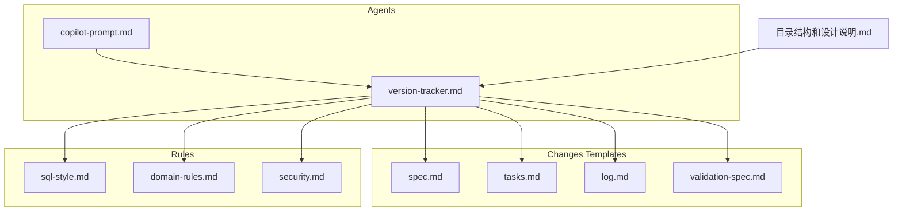
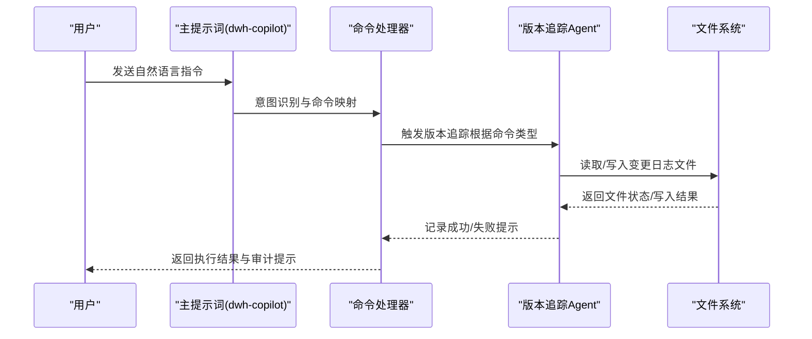
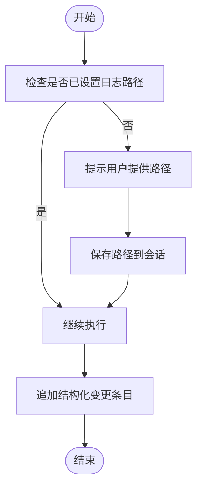
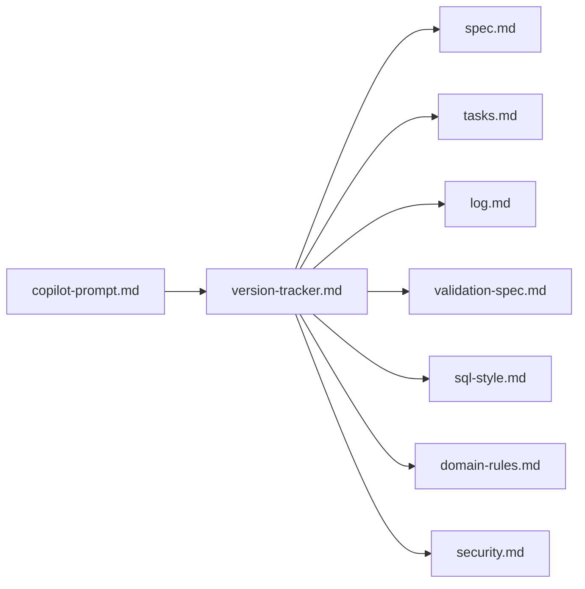

# 版本追踪Agent

<cite>
**本文引用的文件**
- [version-tracker.md](file://agents/version-tracker.md)
- [copilot-prompt.md](file://agents/copilot-prompt.md)
- [目录结构和设计说明.md](file://目录结构和设计说明.md)
- [log.md](file://changes/templates/log.md)
- [spec.md](file://changes/templates/spec.md)
- [tasks.md](file://changes/templates/tasks.md)
- [validation-spec.md](file://changes/templates/validation-spec.md)
- [sql-style.md](file://rules/sql-style.md)
- [domain-rules.md](file://rules/domain-rules.md)
- [security.md](file://rules/security.md)
</cite>

## 目录
1. [简介](#简介)
2. [项目结构](#项目结构)
3. [核心组件](#核心组件)
4. [架构总览](#架构总览)
5. [详细组件分析](#详细组件分析)
6. [依赖分析](#依赖分析)
7. [性能考虑](#性能考虑)
8. [故障排查指南](#故障排查指南)
9. [结论](#结论)
10. [附录](#附录)

## 简介
版本追踪Agent是dwh-copilot工程化提示词体系中的“强制变更追踪”子Agent，负责在每次DDL/SQL/ETL/调度变更完成后，自动记录结构化的变更条目到用户指定的变更日志文件。其目标是确保所有变更具备可审计、可回溯的能力，支撑“Spec驱动 + 三段式知识库”的完整闭环。

## 项目结构
围绕版本追踪Agent，整个工程采用“提示词工程 + 变更模板 + 规则约束 + 知识库”的组织方式：
- agents/：AI角色与子Agent提示词，其中version-tracker.md定义了版本追踪Agent的触发时机、记录格式与规则
- changes/templates/：变更管理模板，包括spec.md、tasks.md、log.md、validation-spec.md，用于承载变更过程与知识沉淀
- rules/：项目约束与规范，为版本追踪提供上下文与合规依据（如命名规范、领域规则、安全红线）
- 目录结构和设计说明.md：总体设计说明，强调“强制变更追踪”的核心地位

图表来源
- [version-tracker.md:1-120](file://agents/version-tracker.md#L1-L120)
- [copilot-prompt.md:1-147](file://agents/copilot-prompt.md#L1-L147)
- [目录结构和设计说明.md:1-204](file://目录结构和设计说明.md#L1-L204)
- [log.md:1-61](file://changes/templates/log.md#L1-L61)
- [spec.md:1-132](file://changes/templates/spec.md#L1-L132)
- [tasks.md:1-74](file://changes/templates/tasks.md#L1-L74)
- [validation-spec.md:1-123](file://changes/templates/validation-spec.md#L1-L123)
- [sql-style.md:1-254](file://rules/sql-style.md#L1-L254)
- [domain-rules.md:1-142](file://rules/domain-rules.md#L1-L142)
- [security.md:1-98](file://rules/security.md#L1-L98)

章节来源
- [目录结构和设计说明.md:19-55](file://目录结构和设计说明.md#L19-L55)
- [version-tracker.md:1-120](file://agents/version-tracker.md#L1-L120)

## 核心组件
- 触发器：在/sql、/etl、/model、/schedule、/dq、/apply等命令完成后，以及用户手动请求时触发
- 路径初始化：首次触发时询问并记忆变更日志路径，必要时自动创建文件头
- 记录格式：结构化Markdown条目，包含时间、模块、分层、任务、操作、变更内容、关联文件、回刷范围、下游影响、备注等字段
- 记录规则：原子化、精确引用、任务可追溯、下游必标注、回刷必声明、时间精确到分钟、不阻塞主流程
- 工具权限：读取现有日志文件、追加变更条目到日志文件，不主动扫描项目文件

章节来源
- [version-tracker.md:5-120](file://agents/version-tracker.md#L5-L120)
- [copilot-prompt.md:63-131](file://agents/copilot-prompt.md#L63-L131)

## 架构总览
版本追踪Agent在命令式协作流程中扮演“审计守门人”的角色，贯穿Spec驱动的完整生命周期：从需求提出、任务拆分、实施执行、审查验证到知识归档，每次关键节点都会触发版本追踪记录。

图表来源
- [copilot-prompt.md:36-131](file://agents/copilot-prompt.md#L36-L131)
- [version-tracker.md:19-120](file://agents/version-tracker.md#L19-L120)

## 详细组件分析

### 触发时机与控制流
- 触发条件：/sql、/etl、/model、/schedule、/dq完成后，以及每个Task完成后，或用户手动请求
- 首次询问：若未设置日志路径，Agent会提示用户提供路径并记忆
- 文件头：若文件不存在，自动创建并写入文件头
- 记录追加：每次变更追加一条结构化条目到日志文件末尾
- 失败处理：记录失败不中断主流程，提示用户但继续执行

图表来源
- [version-tracker.md:19-41](file://agents/version-tracker.md#L19-L41)
- [version-tracker.md:44-64](file://agents/version-tracker.md#L44-L64)

章节来源
- [version-tracker.md:5-41](file://agents/version-tracker.md#L5-L41)
- [version-tracker.md:44-64](file://agents/version-tracker.md#L44-L64)

### 变更条目格式与字段
- 时间：精确到分钟的YYYY-MM-DD HH:MM
- 模块：DDL、SQL、ETL、调度、数据质量、权限/安全、项目配置
- 分层：ODS、DWD、DWS、ADS、DIM、跨层
- 任务：来自spec或用户描述
- 操作：新建、修改、删除、回刷
- 变更内容：精确到库.表.字段或作业名
- 关联文件：SQL文件、DDL文件、调度配置文件、changes/文档
- 回刷范围：涉及历史分区回刷时标明分区范围
- 影响下游：列出受影响的下游表/作业/报表
- 备注：特殊说明、已知限制、待跟进事项

章节来源
- [version-tracker.md:44-89](file://agents/version-tracker.md#L44-L89)

### 记录规则与合规约束
- 原子化：一次命令对应一条记录，不合并多次操作
- 精确引用：变更内容必须精确到对象名称
- 任务可追溯：任务字段必须填写
- 下游必标注：DDL或核心DWS/DIM变更必须列出受影响的下游
- 回刷必声明：涉及历史分区回刷的必须标明分区范围
- 时间精确到分钟：HH:MM为必填项
- 不阻塞主流程：记录失败时提示用户但不中断当前操作

章节来源
- [version-tracker.md:80-89](file://agents/version-tracker.md#L80-L89)

### 与变更模板的协同
- spec.md：承载需求背景、功能点、模型变更、SQL设计、ETL/同步变更、调度变更、数据质量规则、影响范围、验证策略等
- tasks.md：按分层顺序拆分任务，每个任务精确到库.表.字段/作业名/调度依赖
- log.md：记录决策、踩坑、知识发现，支持/archive时沉淀到knowledge/
- validation-spec.md：验证原则与方法，确保变更可验证、可回溯

章节来源
- [spec.md:1-132](file://changes/templates/spec.md#L1-L132)
- [tasks.md:1-74](file://changes/templates/tasks.md#L1-L74)
- [log.md:1-61](file://changes/templates/log.md#L1-L61)
- [validation-spec.md:1-123](file://changes/templates/validation-spec.md#L1-L123)

### 与规则约束的集成
- 命名规范：统一库/表/字段命名，分区字段dt格式等
- 领域规则：业务口径、KPI定义、数据质量五维度、历史数据约定等
- 安全红线：PII脱敏、行级权限、数据分级、上线安全等

章节来源
- [sql-style.md:1-254](file://rules/sql-style.md#L1-L254)
- [domain-rules.md:1-142](file://rules/domain-rules.md#L1-L142)
- [security.md:1-98](file://rules/security.md#L1-L98)

### 版本追踪示例与查询方法
- 示例：参考version-tracker.md中的输出示例，包含时间、模块、分层、任务、操作、变更内容、关联文件、回刷范围、下游影响、备注等字段
- 查询方法：通过日志文件的标题行快速定位变更条目；结合changes/templates/中的spec.md、tasks.md、log.md、validation-spec.md进行变更历史回溯与影响分析

章节来源
- [version-tracker.md:92-111](file://agents/version-tracker.md#L92-L111)

### 配置选项与扩展机制
- 配置选项：首次触发时的路径设置；会话内路径记忆；文件头自动创建
- 扩展机制：Agent权限仅限读取与写入日志文件；不主动扫描项目文件；可通过模板扩展记录字段与规则

章节来源
- [version-tracker.md:19-41](file://agents/version-tracker.md#L19-L41)
- [version-tracker.md:115-120](file://agents/version-tracker.md#L115-L120)

## 依赖分析
版本追踪Agent与主提示词、命令体系、变更模板、规则约束之间存在强耦合关系：
- 与主提示词：通过命令映射触发，遵循“Spec驱动 + 三段式知识库”的整体流程
- 与变更模板：紧密配合spec.md、tasks.md、log.md、validation-spec.md，确保变更可审计、可回溯
- 与规则约束：遵循sql-style.md、domain-rules.md、security.md，确保记录内容符合规范与安全要求

图表来源
- [copilot-prompt.md:63-131](file://agents/copilot-prompt.md#L63-L131)
- [version-tracker.md:1-120](file://agents/version-tracker.md#L1-L120)
- [spec.md:1-132](file://changes/templates/spec.md#L1-L132)
- [tasks.md:1-74](file://changes/templates/tasks.md#L1-L74)
- [log.md:1-61](file://changes/templates/log.md#L1-L61)
- [validation-spec.md:1-123](file://changes/templates/validation-spec.md#L1-L123)
- [sql-style.md:1-254](file://rules/sql-style.md#L1-L254)
- [domain-rules.md:1-142](file://rules/domain-rules.md#L1-L142)
- [security.md:1-98](file://rules/security.md#L1-L98)

章节来源
- [目录结构和设计说明.md:70-106](file://目录结构和设计说明.md#L70-L106)

## 性能考虑
- 文件I/O：版本追踪仅追加写入日志文件，避免频繁读取与解析，性能开销极低
- 会话记忆：路径在会话内记忆，减少重复询问与路径解析
- 不阻塞主流程：记录失败不影响命令执行，提升整体吞吐

## 故障排查指南
- 路径无效：若用户提供的日志路径不可写，Agent会提示用户但不中断当前操作
- 文件头缺失：首次创建时自动写入文件头，确保日志格式规范
- 记录不完整：若系统无法获取精确时间，需标注占位符，由人工后续补全

章节来源
- [version-tracker.md:31-41](file://agents/version-tracker.md#L31-L41)
- [version-tracker.md:86-89](file://agents/version-tracker.md#L86-L89)

## 结论
版本追踪Agent通过严格的触发时机、结构化的记录格式与规则约束，实现了对DDL/SQL/ETL/调度变更的自动审计与可回溯。它与主提示词、变更模板、规则约束形成有机整体，支撑“Spec驱动 + 三段式知识库”的工程化协作模式，确保每次变更都有据可查、有迹可循。

## 附录
- 变更历史查询：通过日志文件标题行定位条目，结合changes/templates/中的spec.md、tasks.md、log.md、validation-spec.md进行回溯
- 知识沉淀：通过/archive命令将log.md中的知识发现沉淀到knowledge/，形成知识飞轮

章节来源
- [目录结构和设计说明.md:126-151](file://目录结构和设计说明.md#L126-L151)
- [log.md:20-34](file://changes/templates/log.md#L20-L34)