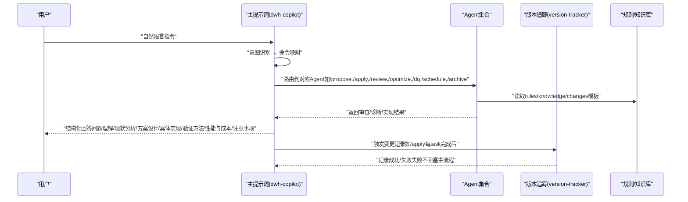
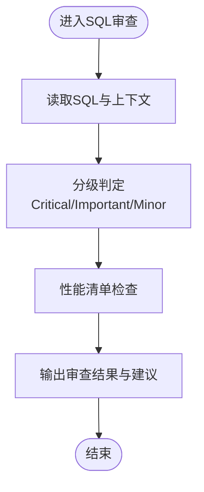
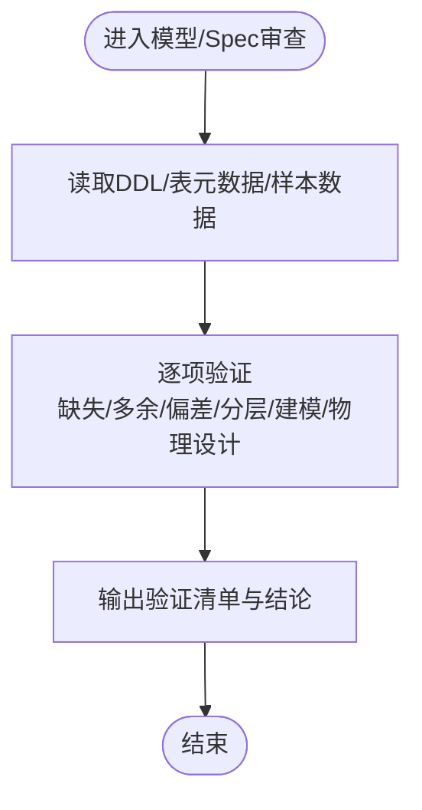
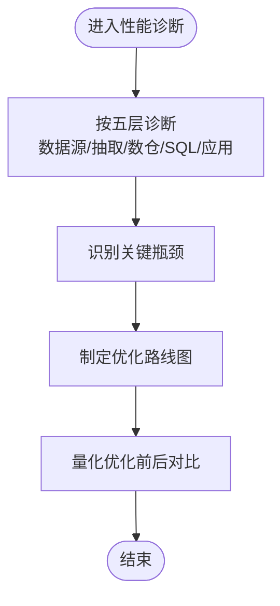
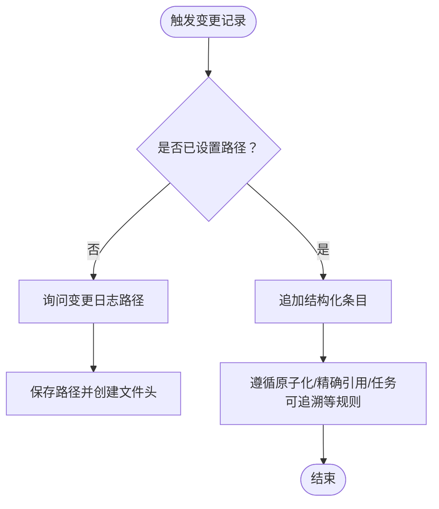
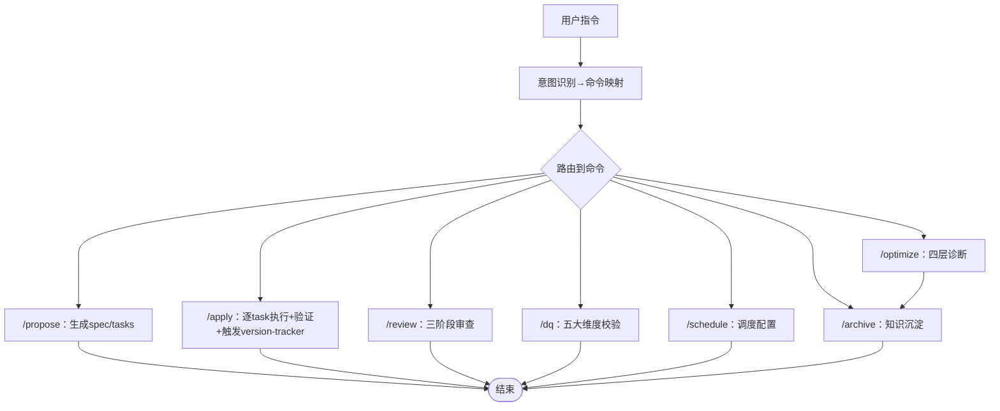
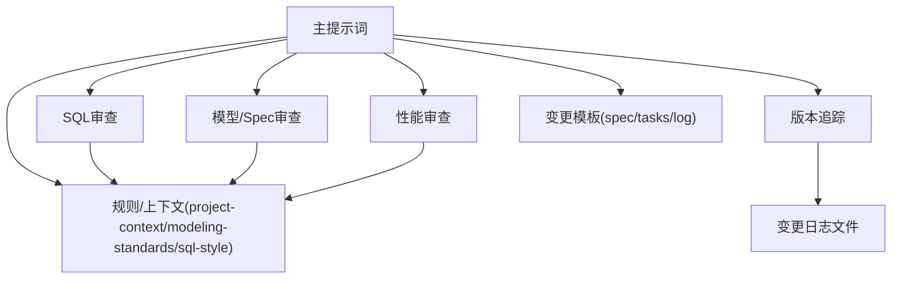

# AI协作助手系统

<cite>
**本文档引用的文件**
- [copilot-prompt.md](file://data_warehouse_engineering_code_copilot/agents/copilot-prompt.md)
- [sql-reviewer.md](file://data_warehouse_engineering_code_copilot/agents/sql-reviewer.md)
- [version-tracker.md](file://data_warehouse_engineering_code_copilot/agents/version-tracker.md)
- [model-reviewer.md](file://data_warehouse_engineering_code_copilot/agents/model-reviewer.md)
- [performance-reviewer.md](file://data_warehouse_engineering_code_copilot/agents/performance-reviewer.md)
- [目录结构和设计说明.md](file://data_warehouse_engineering_code_copilot/目录结构和设计说明.md)
- [spec.md](file://data_warehouse_engineering_code_copilot/changes/templates/spec.md)
- [tasks.md](file://data_warehouse_engineering_code_copilot/changes/templates/tasks.md)
- [log.md](file://data_warehouse_engineering_code_copilot/changes/templates/log.md)
- [project-context.md](file://data_warehouse_engineering_code_copilot/rules/project-context.md)
- [modeling-standards.md](file://data_warehouse_engineering_code_copilot/rules/modeling-standards.md)
- [sql-style.md](file://data_warehouse_engineering_code_copilot/rules/sql-style.md)
</cite>

## 目录
1. [简介](#简介)
2. [项目结构](#项目结构)
3. [核心组件](#核心组件)
4. [架构总览](#架构总览)
5. [详细组件分析](#详细组件分析)
6. [依赖分析](#依赖分析)
7. [性能考虑](#性能考虑)
8. [故障排查指南](#故障排查指南)
9. [结论](#结论)
10. [附录](#附录)

## 简介
本项目是一套面向数据仓库（Data Warehouse）开发的AI协作助手系统，旨在让AI在数仓开发中遵循统一的规范、流程与知识库，实现“需求 → 规格（Spec）→ 任务 → 实施 → 审查 → 归档”的完整闭环。系统通过主提示词定义AI助手的身份、原则与命令体系，辅以SQL审查、模型审查、性能诊断与版本追踪等专业Agent，确保每次DDL/SQL/ETL/调度变更均可审计、可回溯。

## 项目结构
系统采用“提示词工程 + 三段式知识库 + 强制变更追踪”的设计，围绕agents、changes、knowledge、rules四大目录展开，形成可加载到AI编码助手的工作区。

```mermaid
graph TB
subgraph "提示词与Agent"
A["agents/copilot-prompt.md<br/>主提示词：身份/原则/命令"]
B["agents/sql-reviewer.md<br/>SQL质量审查"]
C["agents/model-reviewer.md<br/>模型/Spec合规审查"]
D["agents/performance-reviewer.md<br/>性能诊断"]
E["agents/version-tracker.md<br/>变更追踪"]
end
subgraph "变更管理"
F["changes/templates/spec.md<br/>变更需求规格模板"]
G["changes/templates/tasks.md<br/>任务拆分模板"]
H["changes/templates/log.md<br/>变更日志模板"]
end
subgraph "知识库"
I["knowledge/index.md<br/>索引"]
J["knowledge/sql-patterns.md<br/>SQL模式"]
K["knowledge/etl-patterns.md<br/>ETL模式"]
L["knowledge/dimension-modeling-tips.md<br/>维度建模技巧"]
M["knowledge/performance-tips.md<br/>性能优化经验"]
end
subgraph "规则与上下文"
N["rules/project-context.md<br/>项目上下文"]
O["rules/modeling-standards.md<br/>建模与分层规范"]
P["rules/sql-style.md<br/>SQL编码规范"]
end
A --> B
A --> C
A --> D
A --> E
A --> F
A --> G
A --> H
A --> I
A --> J
A --> K
A --> L
A --> M
A --> N
A --> O
A --> P
```

图表来源
- [目录结构和设计说明.md: 19-55:19-55](file://data_warehouse_engineering_code_copilot/目录结构和设计说明.md#L19-L55)
- [copilot-prompt.md: 24-34:24-34](file://data_warehouse_engineering_code_copilot/agents/copilot-prompt.md#L24-L34)

章节来源
- [目录结构和设计说明.md: 19-55:19-55](file://data_warehouse_engineering_code_copilot/目录结构和设计说明.md#L19-L55)

## 核心组件
- 主提示词（dwh-copilot）：定义AI助手的身份、工作原则、回答框架与命令体系，确保所有交互在固定流程内进行。
- 专业Agent：
  - SQL质量审查：检查SQL正确性、性能与可维护性。
  - 模型/Spec合规审查：验证模型与建模规范、分层与物理设计的合规性。
  - 性能审查：按数据源→抽取→数仓→SQL→应用五层诊断性能瓶颈。
  - 版本追踪：在DDL/SQL/ETL/调度变更后自动记录结构化变更条目。
- 变更模板：spec、tasks、log模板支撑需求规格化、任务原子化与知识沉淀。
- 规则与上下文：project-context、modeling-standards、sql-style等提供强制约束与推荐实践。

章节来源
- [copilot-prompt.md: 15-34:15-34](file://data_warehouse_engineering_code_copilot/agents/copilot-prompt.md#L15-L34)
- [目录结构和设计说明.md: 78-106:78-106](file://data_warehouse_engineering_code_copilot/目录结构和设计说明.md#L78-L106)

## 架构总览
系统采用“命令驱动 + Agent协作 + 知识库复用 + 强制变更追踪”的架构。AI在每次会话开始时读取rules与changes状态，通过命令将用户意图映射到具体流程，各Agent在各自职责范围内提供审查与诊断，version-tracker确保每次变更可审计。

图表来源
- [copilot-prompt.md: 36-53:36-53](file://data_warehouse_engineering_code_copilot/agents/copilot-prompt.md#L36-L53)
- [copilot-prompt.md: 65-131:65-131](file://data_warehouse_engineering_code_copilot/agents/copilot-prompt.md#L65-L131)
- [version-tracker.md: 5-16:5-16](file://data_warehouse_engineering_code_copilot/agents/version-tracker.md#L5-L16)

## 详细组件分析

### 主提示词：身份、原则与命令体系
- 身份与原则：强调“顶尖数仓工程师搭档”，中文输出、不确定就问、任务原子化、高亮提醒人工审查涉及敏感数据/回刷的场景。
- 回答框架：问题理解、现状分析、方案设计、具体实现、验证方法、性能与成本考量、注意事项。
- 意图确认：将自然语言映射到命令（/sql、/etl、/model、/propose、/apply、/review、/optimize、/dq、/schedule、/archive）。
- 启动流程：读取rules、检查changes进行中的变更、检查version-tracker路径、报告状态并展示命令菜单。
- 命令详解：
  - /init：初始化项目上下文，填充rules/project-context.md。
  - /sql：SQL开发，带验证与性能评估，完成后触发version-tracker。
  - /etl：ETL/数据集成开发，设计同步方式并验证幂等与回放。
  - /model：数仓建模，分层归属、DDL设计、口径文档化、KPI对齐。
  - /propose：创建变更提案，逐项澄清、生成spec与tasks、HARD-GATE确认。
  - /apply：执行实施，前置检查+逐task执行+验证证据+每个task完成后触发version-tracker。
  - /review：三阶段审查（Spec合规→模型质量→SQL质量），逐阶段通过后进入下一阶段。
  - /optimize：四层诊断（数据源→抽取→数仓→应用），量化优化前后对比。
  - /dq：数据质量校验，五大维度（完整性/唯一性/一致性/准确性/时效性）。
  - /schedule：调度配置，依赖识别、周期、重试与告警、SLA/基线、资源队列、失败回放。
  - /archive：归档与知识沉淀，将log.md中的发现沉淀到knowledge/，完成后触发version-tracker。
- 调试流程：现象收集→根因定位→方案验证→实施修复，禁止在未确认根因前直接修改。

章节来源
- [copilot-prompt.md: 15-34:15-34](file://data_warehouse_engineering_code_copilot/agents/copilot-prompt.md#L15-L34)
- [copilot-prompt.md: 36-53:36-53](file://data_warehouse_engineering_code_copilot/agents/copilot-prompt.md#L36-L53)
- [copilot-prompt.md: 57-61:57-61](file://data_warehouse_engineering_code_copilot/agents/copilot-prompt.md#L57-L61)
- [copilot-prompt.md: 65-131:65-131](file://data_warehouse_engineering_code_copilot/agents/copilot-prompt.md#L65-L131)
- [copilot-prompt.md: 133-146:133-146](file://data_warehouse_engineering_code_copilot/agents/copilot-prompt.md#L133-L146)

### 角色代理架构与协作机制

#### SQL质量审查（sql-reviewer）
- 审查分级：Critical（阻塞）、Important（应修复）、Minor（建议）。
- 性能审查清单：分区裁剪、Join顺序、广播/Map Join、倾斜风险、聚合下推、SELECT *、ORDER BY、DISTINCT替代、窗口函数PARTITION BY、CTE物化等。
- 输出格式：按级别列出问题与影响，附性能评估摘要与优化建议。

图表来源
- [sql-reviewer.md: 5-30:5-30](file://data_warehouse_engineering_code_copilot/agents/sql-reviewer.md#L5-L30)
- [sql-reviewer.md: 31-43:31-43](file://data_warehouse_engineering_code_copilot/agents/sql-reviewer.md#L31-L43)
- [sql-reviewer.md: 44-64:44-64](file://data_warehouse_engineering_code_copilot/agents/sql-reviewer.md#L44-L64)

章节来源
- [sql-reviewer.md: 1-68:1-68](file://data_warehouse_engineering_code_copilot/agents/sql-reviewer.md#L1-L68)

#### 模型/Spec合规审查（model-reviewer）
- 审查维度：缺失/多余实现、理解偏差、业务规则落地、分层合规、建模合规、物理设计合规、数据变更准确性。
- 输出格式：模型结构验证、字段/约束逐条验证、分层合规结论与最终结论。

图表来源
- [model-reviewer.md: 6-29:6-29](file://data_warehouse_engineering_code_copilot/agents/model-reviewer.md#L6-L29)
- [model-reviewer.md: 30-47:30-47](file://data_warehouse_engineering_code_copilot/agents/model-reviewer.md#L30-L47)

章节来源
- [model-reviewer.md: 1-50:1-50](file://data_warehouse_engineering_code_copilot/agents/model-reviewer.md#L1-L50)

#### 性能审查（performance-reviewer）
- 诊断框架：数据源层→抽取层→数仓层→SQL层→应用层，覆盖索引/统计、并发/分片、分区/Join/倾斜/小文件/序列化等。
- 输出格式：整体评级、瓶颈识别、问题清单（P0/P1/P2）、优化路线图、优化前后对比。

图表来源
- [performance-reviewer.md: 5-39:5-39](file://data_warehouse_engineering_code_copilot/agents/performance-reviewer.md#L5-L39)
- [performance-reviewer.md: 41-77:41-77](file://data_warehouse_engineering_code_copilot/agents/performance-reviewer.md#L41-L77)

章节来源
- [performance-reviewer.md: 1-81:1-81](file://data_warehouse_engineering_code_copilot/agents/performance-reviewer.md#L1-L81)

#### 版本追踪（version-tracker）
- 触发时机：/sql、/etl、/model、/schedule、/dq产出新规则、/apply每个task完成后、用户手动记录。
- 路径初始化：首次触发时询问并记忆变更日志路径，不存在则自动创建带文件头。
- 变更条目格式：时间、模块、分层、任务、操作、变更内容、关联文件、回刷范围、影响下游、备注。
- 记录规则：原子化、精确引用、任务可追溯、下游必标注、回刷必声明、时间精确到分钟、不阻塞主流程。

图表来源
- [version-tracker.md: 5-16:5-16](file://data_warehouse_engineering_code_copilot/agents/version-tracker.md#L5-L16)
- [version-tracker.md: 19-41:19-41](file://data_warehouse_engineering_code_copilot/agents/version-tracker.md#L19-L41)
- [version-tracker.md: 44-64:44-64](file://data_warehouse_engineering_code_copilot/agents/version-tracker.md#L44-L64)
- [version-tracker.md: 80-89:80-89](file://data_warehouse_engineering_code_copilot/agents/version-tracker.md#L80-L89)

章节来源
- [version-tracker.md: 1-120:1-120](file://data_warehouse_engineering_code_copilot/agents/version-tracker.md#L1-L120)

### 命令式交互机制与工作流程控制
- 意图确认：自然语言→命令映射，避免发散与遗漏。
- 启动流程：会话开始时读取rules、检查changes进行中的变更、检查version-tracker路径并报告状态。
- 命令流程：
  - /propose：Research→逐项澄清→生成spec→生成tasks→HARD-GATE确认。
  - /apply：前置检查→逐task执行→展示验证证据→每个task完成后触发version-tracker。
  - /review：三阶段串行（Spec合规→模型质量→SQL质量），不通过不进下一阶段。
  - /optimize：四层诊断→量化对比→沉淀到knowledge/。
  - /dq：五大维度→对账SQL→与基准来源对比。
  - /schedule：依赖识别→周期→重试与告警→SLA/基线→资源队列→失败回放。
  - /archive：展示log.md→确认→沉淀到knowledge/→触发version-tracker。
- 状态管理与分支处理：命令间存在严格的先后关系与前置条件；/apply中每个task完成后触发version-tracker；/review三阶段串行，任一阶段不通过则阻塞。

图表来源
- [copilot-prompt.md: 36-53:36-53](file://data_warehouse_engineering_code_copilot/agents/copilot-prompt.md#L36-L53)
- [copilot-prompt.md: 103-111:103-111](file://data_warehouse_engineering_code_copilot/agents/copilot-prompt.md#L103-L111)
- [copilot-prompt.md: 113-116:113-116](file://data_warehouse_engineering_code_copilot/agents/copilot-prompt.md#L113-L116)
- [copilot-prompt.md: 117-124:117-124](file://data_warehouse_engineering_code_copilot/agents/copilot-prompt.md#L117-L124)
- [copilot-prompt.md: 125-128:125-128](file://data_warehouse_engineering_code_copilot/agents/copilot-prompt.md#L125-L128)
- [copilot-prompt.md: 129-131:129-131](file://data_warehouse_engineering_code_copilot/agents/copilot-prompt.md#L129-L131)

章节来源
- [copilot-prompt.md: 57-61:57-61](file://data_warehouse_engineering_code_copilot/agents/copilot-prompt.md#L57-L61)
- [copilot-prompt.md: 103-111:103-111](file://data_warehouse_engineering_code_copilot/agents/copilot-prompt.md#L103-L111)
- [copilot-prompt.md: 113-116:113-116](file://data_warehouse_engineering_code_copilot/agents/copilot-prompt.md#L113-L116)

### 使用示例与最佳实践
- 新建数据需求（场景A）：用户提出需求→/propose生成spec与tasks→/apply逐task执行并触发version-tracker→/review三阶段审查→/archive归档与沉淀。
- 性能优化（场景B）：用户反馈慢→/optimize四层诊断→给出具体修改与量化对比→触发version-tracker→沉淀到knowledge/performance-tips.md。
- 最佳实践：
  - 始终以Spec为Truth，实现与Spec冲突时修正实现。
  - 每次DDL/SQL/ETL/调度变更后必须触发version-tracker。
  - 任务原子化，聚焦单一表或单一作业。
  - 涉及生产数据/PII/财务/历史回刷时高亮提醒人工审查。
  - 将有价值的发现主动沉淀到knowledge/。

章节来源
- [目录结构和设计说明.md: 126-166:126-166](file://data_warehouse_engineering_code_copilot/目录结构和设计说明.md#L126-L166)
- [copilot-prompt.md: 6-13:6-13](file://data_warehouse_engineering_code_copilot/agents/copilot-prompt.md#L6-L13)
- [copilot-prompt.md: 18-21:18-21](file://data_warehouse_engineering_code_copilot/agents/copilot-prompt.md#L18-L21)

## 依赖分析
- 组件耦合与协作：
  - 主提示词作为入口与编排中心，将用户意图路由到具体Agent与模板。
  - version-tracker与所有命令强耦合，确保每次变更可审计。
  - model-reviewer与sql-reviewer依赖于实际DDL/表元数据与样本数据，独立于实现者上下文。
  - performance-reviewer可独立启动，不依赖其他审查阶段。
- 外部依赖与集成点：
  - 项目上下文（rules/project-context.md）用于初始化与上下文感知。
  - 建模与SQL规范（rules/modeling-standards.md、rules/sql-style.md）提供强制约束与推荐实践。
  - 变更模板（changes/templates/*）支撑需求规格化与任务原子化。

图表来源
- [目录结构和设计说明.md: 78-106:78-106](file://data_warehouse_engineering_code_copilot/目录结构和设计说明.md#L78-L106)
- [copilot-prompt.md: 57-61:57-61](file://data_warehouse_engineering_code_copilot/agents/copilot-prompt.md#L57-L61)

章节来源
- [目录结构和设计说明.md: 78-106:78-106](file://data_warehouse_engineering_code_copilot/目录结构和设计说明.md#L78-L106)
- [copilot-prompt.md: 57-61:57-61](file://data_warehouse_engineering_code_copilot/agents/copilot-prompt.md#L57-L61)

## 性能考虑
- 规范先行：通过rules/sql-style.md与rules/modeling-standards.md减少性能隐患（分区裁剪、Join顺序、倾斜风险、小文件、类型转换等）。
- 诊断闭环：performance-reviewer提供五层诊断，配合sql-reviewer的性能清单，形成从SQL到应用的全链路性能保障。
- 变更追踪：version-tracker记录优化前后对比指标（扫描量、运行耗时、资源消耗、成本），便于持续改进。

## 故障排查指南
- 未设置版本追踪路径：首次触发时会询问路径，不存在则自动创建带文件头；若路径无效，提示用户但不中断主流程。
- 审查不通过：/review三阶段任一不通过则阻塞进入下一阶段；/propose待澄清全部解决前不允许进入/apply。
- 性能问题定位：按数据源→抽取→数仓→SQL→应用五层诊断，优先解决阻断性问题（如未分区裁剪、倾斜键、小文件）。
- 变更审计：通过version-tracker条目精确到库.表.字段/作业名，快速定位影响范围与回溯。

章节来源
- [version-tracker.md: 19-41:19-41](file://data_warehouse_engineering_code_copilot/agents/version-tracker.md#L19-L41)
- [version-tracker.md: 80-89:80-89](file://data_warehouse_engineering_code_copilot/agents/version-tracker.md#L80-L89)
- [copilot-prompt.md: 113-116:113-116](file://data_warehouse_engineering_code_copilot/agents/copilot-prompt.md#L113-L116)
- [copilot-prompt.md: 133-146:133-146](file://data_warehouse_engineering_code_copilot/agents/copilot-prompt.md#L133-L146)

## 结论
本系统通过主提示词定义AI助手的职责与流程，借助SQL/模型/性能审查Agent与版本追踪Agent，构建了“Spec驱动 + 三段式知识库 + 强制变更追踪”的工程化协作体系。它不仅提升了数仓开发的规范性与可审计性，还通过模板化与自动化减少了人为疏漏，适合在团队中推广为标准工作流。

## 附录
- 项目定位与设计理念：面向数据仓库开发场景，强调规范、流程与知识复用，确保所有变更可审计、可回溯。
- 典型工作流：新建需求与性能优化两大场景的端到端流程，体现命令式协作与Agent分工。
- 扩展点：支持独立的数据质量评审Agent、实时数仓专题、湖仓一体专题、成本优化专题，以及与dbt/SQLMesh、数据血缘平台的集成。

章节来源
- [目录结构和设计说明.md: 8-16:8-16](file://data_warehouse_engineering_code_copilot/目录结构和设计说明.md#L8-L16)
- [目录结构和设计说明.md: 126-166:126-166](file://data_warehouse_engineering_code_copilot/目录结构和设计说明.md#L126-L166)
- [目录结构和设计说明.md: 196-204:196-204](file://data_warehouse_engineering_code_copilot/目录结构和设计说明.md#L196-L204)