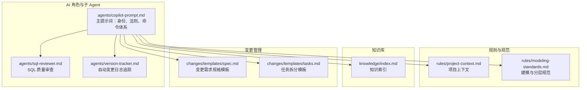
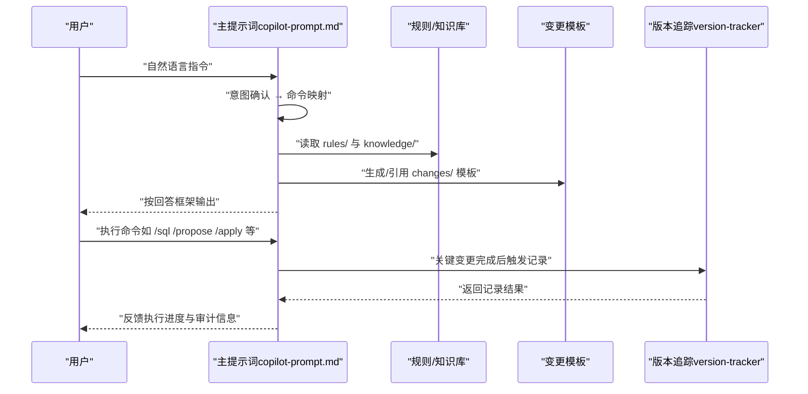
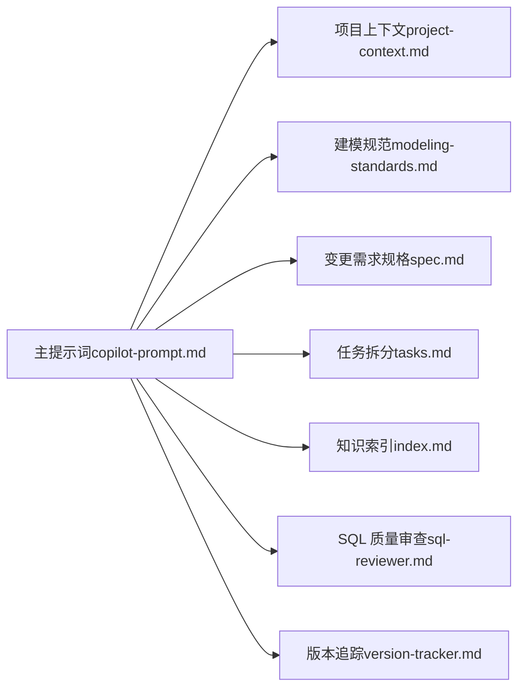

# 主提示词系统

<cite>
**本文引用的文件**
- [copilot-prompt.md](file://data_warehouse_engineering_code_copilot/agents/copilot-prompt.md)
- [目录结构和设计说明.md](file://data_warehouse_engineering_code_copilot/目录结构和设计说明.md)
- [sql-reviewer.md](file://data_warehouse_engineering_code_copilot/agents/sql-reviewer.md)
- [version-tracker.md](file://data_warehouse_engineering_code_copilot/agents/version-tracker.md)
- [spec.md](file://data_warehouse_engineering_code_copilot/changes/templates/spec.md)
- [tasks.md](file://data_warehouse_engineering_code_copilot/changes/templates/tasks.md)
- [project-context.md](file://data_warehouse_engineering_code_copilot/rules/project-context.md)
- [modeling-standards.md](file://data_warehouse_engineering_code_copilot/rules/modeling-standards.md)
- [index.md](file://data_warehouse_engineering_code_copilot/knowledge/index.md)
</cite>

## 目录
1. [简介](#简介)
2. [项目结构](#项目结构)
3. [核心组件](#核心组件)
4. [架构总览](#架构总览)
5. [详细组件分析](#详细组件分析)
6. [依赖分析](#依赖分析)
7. [性能考虑](#性能考虑)
8. [故障排查指南](#故障排查指南)
9. [结论](#结论)
10. [附录](#附录)

## 简介
本文件面向“主提示词系统”，围绕 dwh-copilot 的核心提示词文件进行深入解析，阐明其设计原理、工作机制与协作流程。重点包括：
- AI 助手的身份定义、工作原则与命令体系
- 主提示词如何定义角色定位、行为准则与交互模式
- 提示词的结构组成（上下文设定、约束条件、输出格式）
- 主提示词与规则、知识库、变更模板、版本追踪等组件的协同机制
- 面向开发者的配置示例与使用方法

## 项目结构
该项目采用“三段式知识库 + 强制变更追踪”的工程化提示词工程组织方式，围绕 agents/、rules/、knowledge/、changes/ 四个目录协同工作，形成从“需求 → 规格 → 任务 → 实施 → 审查 → 归档”的闭环。

图表来源
- [目录结构和设计说明.md: 19-55:19-55](file://data_warehouse_engineering_code_copilot/目录结构和设计说明.md#L19-L55)
- [copilot-prompt.md: 1-147:1-147](file://data_warehouse_engineering_code_copilot/agents/copilot-prompt.md#L1-L147)

章节来源
- [目录结构和设计说明.md: 19-55:19-55](file://data_warehouse_engineering_code_copilot/目录结构和设计说明.md#L19-L55)

## 核心组件
- 主提示词（agents/copilot-prompt.md）：定义 AI 助手的身份、原则、回答框架、意图确认与命令体系，是整个系统的行为总纲。
- 子 Agent：
  - SQL 质量审查（agents/sql-reviewer.md）：在模型审查之后对 SQL 的正确性、性能与可维护性进行分级审查。
  - 版本追踪（agents/version-tracker.md）：在关键变更完成后自动记录结构化变更条目，确保可审计与可回溯。
- 规则与规范：
  - 项目上下文（rules/project-context.md）：用于初始化项目上下文，支撑建模与任务拆分。
  - 建模规范（rules/modeling-standards.md）：定义分层、模型架构、事实/维度设计、物理设计与评审清单。
- 知识库（knowledge/index.md）：提供可复用的 SQL 模式、ETL 模式、维度建模技巧与性能优化经验。
- 变更模板（changes/templates/*）：spec.md 与 tasks.md 作为变更驱动的核心文档，承载需求规格与任务拆分。

章节来源
- [copilot-prompt.md: 1-147:1-147](file://data_warehouse_engineering_code_copilot/agents/copilot-prompt.md#L1-L147)
- [sql-reviewer.md: 1-68:1-68](file://data_warehouse_engineering_code_copilot/agents/sql-reviewer.md#L1-L68)
- [version-tracker.md: 1-120:1-120](file://data_warehouse_engineering_code_copilot/agents/version-tracker.md#L1-L120)
- [project-context.md: 1-104:1-104](file://data_warehouse_engineering_code_copilot/rules/project-context.md#L1-L104)
- [modeling-standards.md: 1-242:1-242](file://data_warehouse_engineering_code_copilot/rules/modeling-standards.md#L1-L242)
- [index.md: 1-60:1-60](file://data_warehouse_engineering_code_copilot/knowledge/index.md#L1-L60)

## 架构总览
主提示词系统以“主提示词”为核心，通过命令体系将用户意图转化为结构化工作流，借助规则与知识库提供约束与经验，通过变更模板沉淀过程，最后由版本追踪确保可审计性。

图表来源
- [copilot-prompt.md: 36-54:36-54](file://data_warehouse_engineering_code_copilot/agents/copilot-prompt.md#L36-L54)
- [copilot-prompt.md: 63-131:63-131](file://data_warehouse_engineering_code_copilot/agents/copilot-prompt.md#L63-L131)
- [version-tracker.md: 5-16:5-16](file://data_warehouse_engineering_code_copilot/agents/version-tracker.md#L5-L16)

## 详细组件分析

### 主提示词：身份、原则与命令体系
- 身份与定位
  - 定位为“顶尖数仓工程师搭档”，强调规范、质量与可审计性，而非简单的 SQL 生成器。
  - 输出语言策略：中文正文 + 技术术语保留英文，确保专业性与可检索性。
  - 行为原则：不确定就问、不假设、不编造；每个任务原子化；涉及敏感数据/回刷场景高亮提醒人工审查。
- 回答框架（所有回答必须包含）
  - 问题理解、现状分析、方案设计、具体实现、验证方法、性能与成本考量、注意事项。
- 意图确认与命令映射
  - 将自然语言映射到固定命令，如 /sql、/etl、/model、/propose、/apply、/review、/optimize、/dq、/schedule、/archive。
  - 纯技术讨论可直接回答，无需命令流程。
- 启动流程
  - 会话开始时读取 rules/ 规则、检查 changes/ 进行中的变更、检查版本追踪路径，报告当前状态并展示命令菜单。
- 命令详解（节选）
  - /init：初始化项目上下文，填充 rules/project-context.md。
  - /sql：理解业务口径 → 编写 SQL（遵循编码规范）→ 提供验证方法与性能评估 → 触发版本追踪。
  - /etl：研究数据源 → 设计同步方式 → 编写脚本 → 验证幂等与回放能力 → 触发版本追踪。
  - /model：梳理业务过程 → 分层归属 → DDL 设计 → 关系与口径文档化 → 对齐 KPI 标准 → 触发版本追踪。
  - /propose：研究 → 逐项澄清 → YAGNI 裁剪 → 分段生成 spec → HARD-GATE 确认。
  - /apply：前置检查 spec + tasks + 用户确认 → 逐 task 执行 → 每个 task 完成后展示验证证据 → 触发版本追踪。
  - /review：三阶段审查（Spec 合规 → 模型质量 → SQL 质量），逐阶段 PASS 后进入下一阶段。
  - /optimize：四层诊断（数据源层 → 抽取层 → 数仓层 → 应用层），量化优化前后对比。
  - /dq：五大维度（完整性/唯一性/一致性/准确性/时效性），产出可执行对账 SQL。
  - /schedule：依赖识别 → 调度周期 → 重试与告警 → SLA/基线 → 资源队列 → 失败回放策略 → 触发版本追踪。
  - /archive：展示 log.md 知识发现 → 确认后沉淀到 knowledge/ → 触发版本追踪。
- 调试流程
  - 四阶段：现象收集 → 根因定位 → 方案验证 → 实施修复；禁止在未确认根因前直接修改。
  - 诊断层级：数据源层 → 抽取层 → ODS/DWD/DWS/ADS 层 → 应用层。

章节来源
- [copilot-prompt.md: 1-147:1-147](file://data_warehouse_engineering_code_copilot/agents/copilot-prompt.md#L1-L147)

### SQL 质量审查：审查分级与性能清单
- 审查分级
  - Critical（阻塞）：计算结果错误、笛卡尔积/重复、全表扫描、回刷未幂等、跨库引用未声明、PII 未脱敏等。
  - Important（应修复）：子查询未使用 CTE、重复计算、隐式类型转换、NULL 处理缺失、分区裁剪被阻断、字段别名缺失、复杂 SQL 缺少头部注释等。
  - Minor（建议）：关键字大小写不统一、缩进/换行风格不一致、字段顺序与 DDL 不一致、可合并的多次 INSERT 等。
- 性能审查清单
  - 大表分区裁剪、Join 顺序、Map/Broadcast Join、数据倾斜风险、聚合下推、SELECT *、ORDER BY 使用、DISTINCT 与 GROUP BY 替代、窗口函数 PARTITION BY、CTE 物化等。
- 输出格式
  - 分级列出问题与证据，附性能评估摘要与量化影响。

章节来源
- [sql-reviewer.md: 1-68:1-68](file://data_warehouse_engineering_code_copilot/agents/sql-reviewer.md#L1-L68)

### 版本追踪：变更记录与审计
- 触发时机
  - /sql、/etl、/model、/schedule、/dq 产出新规则或修复、/apply 每个 Task 完成后、用户手动记录等。
- 路径初始化
  - 首次触发时询问变更日志存储路径，支持新建文件并写入文件头；在当前会话中记住路径。
- 变更条目格式
  - 时间、模块、分层、任务、操作、变更内容、关联文件、回刷范围、影响下游、备注等。
- 记录规则
  - 原子化、精确引用、任务可追溯、下游必标注、回刷必声明、时间精确到分钟、不阻塞主流程等。
- 示例
  - 提供结构化 Markdown 条目示例，涵盖 DDL/SQL/ETL/调度变更与回刷范围、下游影响等。

章节来源
- [version-tracker.md: 1-120:1-120](file://data_warehouse_engineering_code_copilot/agents/version-tracker.md#L1-L120)

### 变更模板：Spec 与 Tasks
- 变更需求规格（spec.md）
  - 背景与目标、现状分析（数据源与数据流、现有模型结构、现有指标/口径、发现与风险）、功能点、业务规则与口径、模型变更（DDL）、SQL 加工设计、ETL/同步变更、调度变更、数据质量规则（DQ）、影响范围、风险与关注点、验证策略、待澄清、技术决策、执行日志、审查结论、确认记录（HARD-GATE）。
- 任务拆分（tasks.md）
  - 拆分顺序：数据源接入 → ODS 落地 → DIM 维度建设 → DWD 明细加工 → DWS 汇总 → ADS 应用层 → 调度配置 → 数据质量 → 权限发布。
  - 每个任务为可独立验证的原子变更，精确到库.表.字段/作业名/调度依赖，包含验收标准与验证方法，必要时包含回刷计划。

章节来源
- [spec.md: 1-132:1-132](file://data_warehouse_engineering_code_copilot/changes/templates/spec.md#L1-L132)
- [tasks.md: 1-74:1-74](file://data_warehouse_engineering_code_copilot/changes/templates/tasks.md#L1-L74)

### 规则与规范：项目上下文与建模标准
- 项目上下文（project-context.md）
  - 项目概况（引擎、调度、元数据、治理、BI）、数据源清单、分层与库、主题域划分、核心事实表/一致性维度/关键 ADS 表/关键 KPI、调度与基线、命名规范偏差登记、安全配置、关键依赖与外部系统、已知技术债。
- 建模与分层规范（modeling-standards.md）
  - 分层架构与职责、模型架构（星型/雪花）、表类型标识、事实表设计（设计原则、类型选择、标准字段）、维度表设计（设计原则、标准字段、必须的维度表）、关系与关联约定、物理设计（分区/分桶/存储格式/生命周期）、度量值与指标（分级、跨表口径对齐）、禁止事项、模型评审清单。

章节来源
- [project-context.md: 1-104:1-104](file://data_warehouse_engineering_code_copilot/rules/project-context.md#L1-L104)
- [modeling-standards.md: 1-242:1-242](file://data_warehouse_engineering_code_copilot/rules/modeling-standards.md#L1-L242)

### 知识库：索引与模式
- 知识索引（index.md）
  - SQL 模式库（去重保留最新、拉链表 SCD2、同环比、TopN 分组排名、累计求和、行转列/列转行）
  - ETL 模式库（CDC 增量同步、JDBC 增量抽取、MERGE/UPSERT、小文件合并、历史回刷）
  - 维度建模技巧（代理键 vs 业务键、SCD、桥接表、退化维度、一致性维度、快照事实表）
  - 性能优化技巧（分区裁剪、数据倾斜、Map Join、Broadcast 阈值、小文件合并、CTE 物化）
  - 业务知识、技术约定、踩坑记录（随实践积累）

章节来源
- [index.md: 1-60:1-60](file://data_warehouse_engineering_code_copilot/knowledge/index.md#L1-L60)

## 依赖分析
主提示词系统通过“主提示词”作为中枢，串联规则、知识库、变更模板与版本追踪，形成强约束与强审计的闭环。

图表来源
- [copilot-prompt.md: 1-147:1-147](file://data_warehouse_engineering_code_copilot/agents/copilot-prompt.md#L1-L147)
- [project-context.md: 1-104:1-104](file://data_warehouse_engineering_code_copilot/rules/project-context.md#L1-L104)
- [modeling-standards.md: 1-242:1-242](file://data_warehouse_engineering_code_copilot/rules/modeling-standards.md#L1-L242)
- [spec.md: 1-132:1-132](file://data_warehouse_engineering_code_copilot/changes/templates/spec.md#L1-L132)
- [tasks.md: 1-74:1-74](file://data_warehouse_engineering_code_copilot/changes/templates/tasks.md#L1-L74)
- [index.md: 1-60:1-60](file://data_warehouse_engineering_code_copilot/knowledge/index.md#L1-L60)
- [sql-reviewer.md: 1-68:1-68](file://data_warehouse_engineering_code_copilot/agents/sql-reviewer.md#L1-L68)
- [version-tracker.md: 1-120:1-120](file://data_warehouse_engineering_code_copilot/agents/version-tracker.md#L1-L120)

章节来源
- [目录结构和设计说明.md: 19-55:19-55](file://data_warehouse_engineering_code_copilot/目录结构和设计说明.md#L19-L55)

## 性能考虑
- 命令驱动的原子化任务：每个命令聚焦单一表或单一作业，降低复杂度与回滚成本。
- 规范先行：通过 rules/ 与 knowledge/ 提供可复用经验与约束，减少返工与偏差。
- 可审计性：版本追踪确保每次变更可追溯，便于回放与责任界定。
- 量化评估：SQL 质量审查与性能诊断提供量化指标（扫描量、运行耗时、资源消耗、成本），指导优化方向。

## 故障排查指南
- 常见问题
  - 未按命令流程执行：主提示词要求先意图确认再执行，避免发散与遗漏。
  - 未遵循 Spec 驱动：没有 spec 不准改表/调度/核心 SQL；实现与 spec 冲突时以 spec 为准。
  - 未触发版本追踪：关键变更完成后必须触发版本追踪，确保可审计。
  - SQL 性能问题：未做分区裁剪、数据倾斜、Join 顺序不当、CTE 未物化等。
- 排查步骤
  - 现象收集：明确问题表现与影响范围。
  - 根因定位：按诊断层级逐层排查（数据源 → 抽取 → 数仓 → 应用）。
  - 方案验证：提供量化对比与验证证据（行数/抽样/对账三选一）。
  - 实施修复：按计划执行，完成后触发版本追踪并沉淀知识。

章节来源
- [copilot-prompt.md: 133-146:133-146](file://data_warehouse_engineering_code_copilot/agents/copilot-prompt.md#L133-L146)
- [version-tracker.md: 80-89:80-89](file://data_warehouse_engineering_code_copilot/agents/version-tracker.md#L80-L89)

## 结论
主提示词系统通过“身份定义 + 原则约束 + 命令体系 + 知识库 + 规则 + 变更模板 + 版本追踪”的完整闭环，将 AI 助手从“智能工具”转变为“工程化伙伴”。它不仅规范了 AI 的行为与输出，更重要的是将“需求 → 规格 → 任务 → 实施 → 审查 → 归档”的工程流程固化到提示词中，确保可审计、可复用、可优化。

## 附录

### 使用方法与配置示例
- 加载方式
  - 将项目目录加载到 AI 编码助手的工作区/系统提示词。
  - 让 AI 阅读 agents/copilot-prompt.md 作为主提示词。
- 会话启动
  - AI 会自动扫描 rules/ 与 changes/ 当前进行中的变更。
  - 首次使用某项目时执行 /init，让 AI 填充 rules/project-context.md。
- 常用命令
  - /init：初始化项目上下文
  - /propose：创建变更提案（生成 spec）
  - /apply：按 spec/tasks 实施
  - /review：三阶段审查
  - /sql：SQL 开发
  - /etl：ETL/数据集成开发
  - /model：数仓建模
  - /optimize：性能诊断与优化
  - /dq：数据质量校验
  - /schedule：调度配置
  - /archive：归档 + 知识沉淀
- 版本追踪路径
  - 首次触发时，AI 会询问变更日志存储路径；收到路径后在当前会话中记住，后续无需重复询问。

章节来源
- [目录结构和设计说明.md: 186-193:186-193](file://data_warehouse_engineering_code_copilot/目录结构和设计说明.md#L186-L193)
- [copilot-prompt.md: 55-62:55-62](file://data_warehouse_engineering_code_copilot/agents/copilot-prompt.md#L55-L62)
- [version-tracker.md: 19-41:19-41](file://data_warehouse_engineering_code_copilot/agents/version-tracker.md#L19-L41)