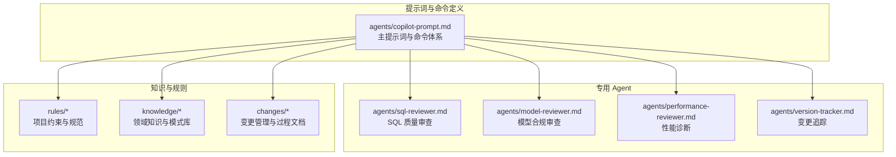
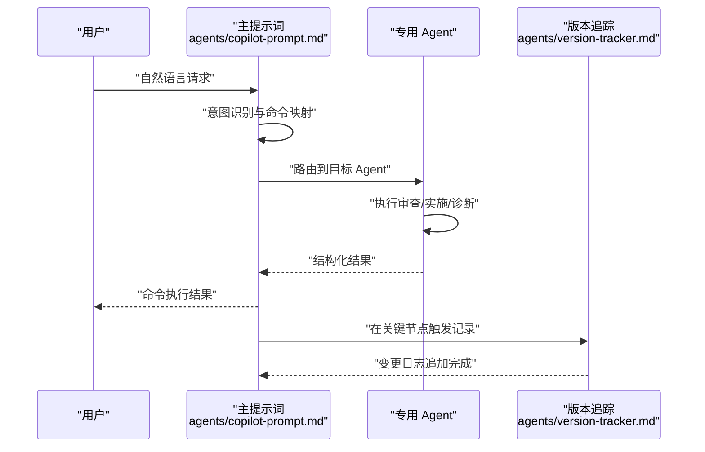
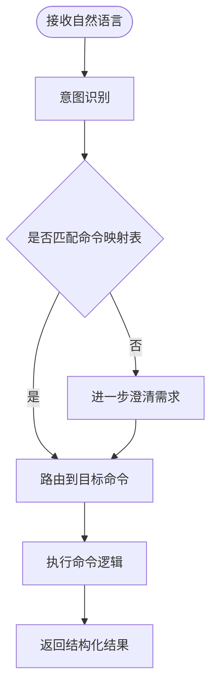
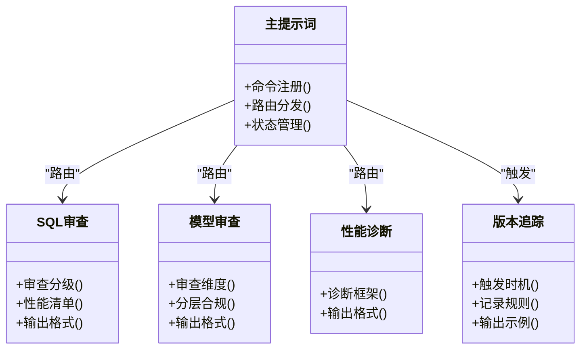
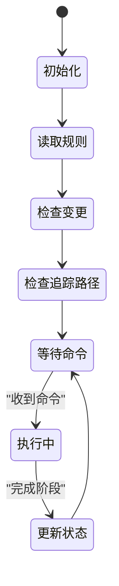
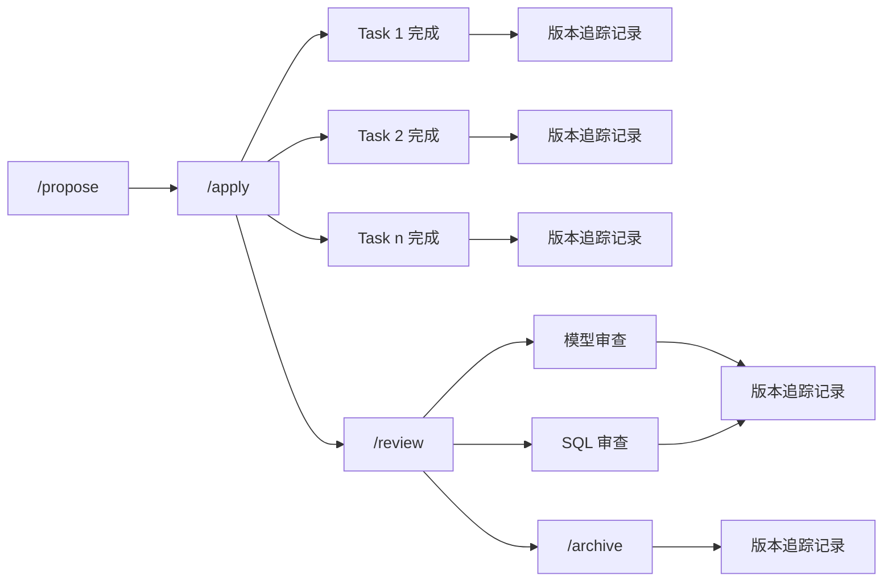
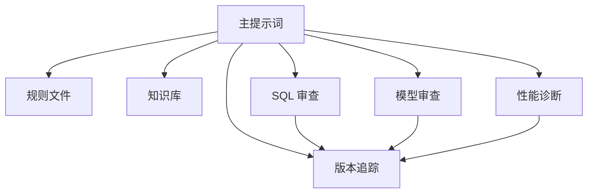

# 命令交互机制

<cite>
**本文引用的文件**
- [目录结构和设计说明.md](file://目录结构和设计说明.md)
- [copilot-prompt.md](file://agents/copilot-prompt.md)
- [sql-reviewer.md](file://agents/sql-reviewer.md)
- [model-reviewer.md](file://agents/model-reviewer.md)
- [performance-reviewer.md](file://agents/performance-reviewer.md)
- [version-tracker.md](file://agents/version-tracker.md)
</cite>

## 目录
1. [简介](#简介)
2. [项目结构](#项目结构)
3. [核心组件](#核心组件)
4. [架构总览](#架构总览)
5. [详细组件分析](#详细组件分析)
6. [依赖分析](#依赖分析)
7. [性能考虑](#性能考虑)
8. [故障排查指南](#故障排查指南)
9. [结论](#结论)
10. [附录](#附录)

## 简介
本文件围绕“命令交互机制”展开，系统性阐述 AI 助手如何通过命令驱动复杂工作流程，包括命令识别、解析与执行、命令注册与路由分发、状态管理、命令与 Agent 的绑定关系、参数传递、错误处理与结果反馈，以及扩展方法与使用示例。该机制以“命令式协作”为核心，配合“三段式知识库”与“强制变更追踪”，确保数仓开发在统一规范与可审计流程下高效推进。

## 项目结构
该项目采用“提示词工程 + 知识库 + 变更管理”的组织方式，命令交互机制依托主提示词文件集中定义命令体系与行为规范，各专用 Agent 负责不同领域的审查与执行，版本追踪 Agent 负责变更记录与审计。

**图表来源**
- [目录结构和设计说明.md: 24-54:24-54](file://目录结构和设计说明.md#L24-L54)
- [copilot-prompt.md: 63-131:63-131](file://agents/copilot-prompt.md#L63-L131)

**章节来源**
- [目录结构和设计说明.md: 24-54:24-54](file://目录结构和设计说明.md#L24-L54)
- [目录结构和设计说明.md: 80-97:80-97](file://目录结构和设计说明.md#L80-L97)

## 核心组件
- 命令识别与意图确认：主提示词在收到用户自然语言后，先进行意图识别并映射到具体命令，确认后再执行，避免误操作与遗漏。
- 命令注册与路由：命令注册集中于主提示词文件，命令行为与输出格式在对应命令段落中定义，Agent 通过“前置条件”与“审查分级”承接命令执行。
- 状态管理：会话开始时读取规则、检查进行中的变更、检查版本追踪路径，形成“当前状态”，并在命令执行后更新状态。
- 命令与 Agent 绑定：不同命令绑定到不同 Agent（如 SQL 命令绑定 SQL 质量审查 Agent，模型命令绑定模型合规审查 Agent），形成“命令 → Agent → 审查/执行 → 记录”的闭环。
- 参数传递与结果反馈：命令支持简要参数（如范围、作业名、变更名），Agent 输出结构化结果，版本追踪在关键节点追加变更日志，形成“输入参数 → 执行结果 → 审查结论 → 变更记录”的反馈链路。

**章节来源**
- [copilot-prompt.md: 36-53:36-53](file://agents/copilot-prompt.md#L36-L53)
- [copilot-prompt.md: 63-131:63-131](file://agents/copilot-prompt.md#L63-L131)
- [version-tracker.md: 5-16:5-16](file://agents/version-tracker.md#L5-L16)

## 架构总览
命令交互机制以主提示词为中心，围绕命令识别、路由分发、Agent 执行与版本追踪构建闭环。命令在主提示词中注册与定义，Agent 依据自身职责承接命令执行，版本追踪贯穿关键节点，确保所有变更可审计、可回溯。

**图表来源**
- [copilot-prompt.md: 36-53:36-53](file://agents/copilot-prompt.md#L36-L53)
- [copilot-prompt.md: 63-131:63-131](file://agents/copilot-prompt.md#L63-L131)
- [version-tracker.md: 5-16:5-16](file://agents/version-tracker.md#L5-L16)

## 详细组件分析

### 命令识别与解析
- 意图确认：主提示词要求先识别用户意图并映射到命令，确认后再执行，避免歧义与遗漏。
- 映射规则：将常见自然语言场景映射到固定命令（如“写 SQL”→/sql，“做同步”→/etl，“建模”→/model 等），并提供映射表格，便于统一理解。
- 参数解析：命令段落中定义参数（如范围、作业名、变更名），Agent 依据参数执行相应逻辑。

**图表来源**
- [copilot-prompt.md: 36-53:36-53](file://agents/copilot-prompt.md#L36-L53)

**章节来源**
- [copilot-prompt.md: 36-53:36-53](file://agents/copilot-prompt.md#L36-L53)

### 命令注册与路由分发
- 注册位置：命令注册集中在主提示词文件的“命令”章节，每个命令定义清晰的行为、前置条件、输出格式与触发时机。
- 路由策略：主提示词根据命令类型将请求路由到对应 Agent；Agent 再根据自身职责（只读审查或执行实施）决定下一步动作。
- 命令间依赖：部分命令存在先后依赖（如先 /propose，再 /apply；先模型审查，再 SQL 审查），主提示词中明确串联关系。

**图表来源**
- [copilot-prompt.md: 63-131:63-131](file://agents/copilot-prompt.md#L63-L131)
- [sql-reviewer.md: 1-68:1-68](file://agents/sql-reviewer.md#L1-L68)
- [model-reviewer.md: 1-50:1-50](file://agents/model-reviewer.md#L1-L50)
- [performance-reviewer.md: 1-81:1-81](file://agents/performance-reviewer.md#L1-L81)
- [version-tracker.md: 5-16:5-16](file://agents/version-tracker.md#L5-L16)

**章节来源**
- [copilot-prompt.md: 63-131:63-131](file://agents/copilot-prompt.md#L63-L131)

### 状态管理
- 会话启动：主提示词在每次会话开始时读取规则、检查进行中的变更、检查版本追踪路径，形成“当前状态”。
- 状态更新：命令执行后，状态随变更日志与审查结果更新，确保后续命令在最新上下文中执行。
- 会话持久化：版本追踪在首次触发时初始化日志路径并缓存，避免重复询问。

**图表来源**
- [copilot-prompt.md: 57-61:57-61](file://agents/copilot-prompt.md#L57-L61)
- [version-tracker.md: 19-31:19-31](file://agents/version-tracker.md#L19-L31)

**章节来源**
- [copilot-prompt.md: 57-61:57-61](file://agents/copilot-prompt.md#L57-L61)
- [version-tracker.md: 19-31:19-31](file://agents/version-tracker.md#L19-L31)

### 命令与 Agent 的绑定关系
- /sql → SQL 质量审查：在 SQL 审查 Agent 中定义审查分级、性能清单与输出格式，确保 SQL 质量与性能达标。
- /model → 模型合规审查：在模型审查 Agent 中定义审查维度、分层合规与输出格式，确保模型符合规范与 Spec。
- /optimize → 性能诊断：在性能诊断 Agent 中定义诊断框架与输出格式，量化瓶颈与优化收益。
- /review → 多阶段审查：先模型审查，再 SQL 审查，形成串行审查流程。
- /apply → 逐任务执行：每个任务完成后触发版本追踪，记录任务变更内容。
- /archive → 归档与沉淀：将知识发现沉淀到知识库，触发版本追踪记录归档操作。

**图表来源**
- [copilot-prompt.md: 103-131:103-131](file://agents/copilot-prompt.md#L103-L131)
- [version-tracker.md: 5-16:5-16](file://agents/version-tracker.md#L5-L16)

**章节来源**
- [copilot-prompt.md: 103-131:103-131](file://agents/copilot-prompt.md#L103-L131)
- [version-tracker.md: 5-16:5-16](file://agents/version-tracker.md#L5-L16)

### 参数传递、错误处理与结果反馈
- 参数传递：命令段落中定义参数（如范围、作业名、变更名），Agent 依据参数执行相应逻辑。
- 错误处理：版本追踪在记录失败时不阻塞主流程，提示用户但不影响当前操作；主提示词在命令执行前进行意图确认与前置检查，降低错误概率。
- 结果反馈：Agent 输出结构化结果（审查清单、性能评估、优化建议等），版本追踪在关键节点追加变更日志，形成“输入参数 → 执行结果 → 审查结论 → 变更记录”的闭环。

**章节来源**
- [copilot-prompt.md: 63-131:63-131](file://agents/copilot-prompt.md#L63-L131)
- [version-tracker.md: 80-89:80-89](file://agents/version-tracker.md#L80-L89)

### 命令使用示例与扩展方法
- 使用示例：主提示词提供了典型工作流示例（如新建需求、性能优化），展示命令串联与 Agent 协作过程。
- 扩展方法：可在主提示词中新增命令注册与行为定义，为新 Agent 提供前置条件与输出格式，确保与现有流程无缝衔接；同时可扩展版本追踪的触发时机，覆盖更多变更场景。

**章节来源**
- [目录结构和设计说明.md: 126-166:126-166](file://目录结构和设计说明.md#L126-L166)
- [copilot-prompt.md: 63-131:63-131](file://agents/copilot-prompt.md#L63-L131)

## 依赖分析
命令交互机制的关键依赖关系如下：
- 主提示词依赖规则与知识库，用于上下文注入与规范约束。
- 专用 Agent 依赖主提示词的命令定义与路由策略。
- 版本追踪依赖主提示词定义的触发时机与记录规则，贯穿命令执行全过程。

**图表来源**
- [copilot-prompt.md: 63-131:63-131](file://agents/copilot-prompt.md#L63-L131)
- [version-tracker.md: 5-16:5-16](file://agents/version-tracker.md#L5-L16)

**章节来源**
- [copilot-prompt.md: 63-131:63-131](file://agents/copilot-prompt.md#L63-L131)
- [version-tracker.md: 5-16:5-16](file://agents/version-tracker.md#L5-L16)

## 性能考虑
- 命令执行的性能取决于 Agent 的审查深度与工具权限范围。SQL/模型/性能审查均以只读为主，减少写入开销；版本追踪仅在关键节点追加日志，避免频繁 IO。
- 通过量化评估（扫描量、运行耗时、资源消耗、成本）与优化前后对比，帮助快速定位瓶颈并制定优化路线图。

[本节为通用指导，无需引用具体文件]

## 故障排查指南
- 命令未识别：检查主提示词中的映射规则，确认用户表达是否符合预期；必要时引导用户提供更明确的参数（如范围、作业名、变更名）。
- Agent 执行异常：确认 Agent 的前置条件是否满足（如模型审查需在 SQL 审查之前）；检查工具权限与只读限制。
- 版本追踪失败：检查日志路径是否有效且可写；版本追踪在失败时不阻塞主流程，可在后续补填时间或修正路径。

**章节来源**
- [copilot-prompt.md: 36-53:36-53](file://agents/copilot-prompt.md#L36-L53)
- [version-tracker.md: 80-89:80-89](file://agents/version-tracker.md#L80-L89)

## 结论
命令交互机制通过“命令识别 → 路由分发 → Agent 执行 → 版本追踪”的闭环，将数仓开发的复杂流程标准化、规范化与可审计化。主提示词集中定义命令体系与行为规范，专用 Agent 各司其职，版本追踪贯穿关键节点，确保变更可追溯、质量有保障、流程可扩展。

[本节为总结性内容，无需引用具体文件]

## 附录
- 命令清单与触发场景：主提示词中提供了完整的命令清单与触发场景，便于快速查阅与扩展。
- 典型工作流：包含新建需求与性能优化的典型流程，展示命令串联与 Agent 协作过程。

**章节来源**
- [目录结构和设计说明.md: 80-97:80-97](file://目录结构和设计说明.md#L80-L97)
- [目录结构和设计说明.md: 126-166:126-166](file://目录结构和设计说明.md#L126-L166)