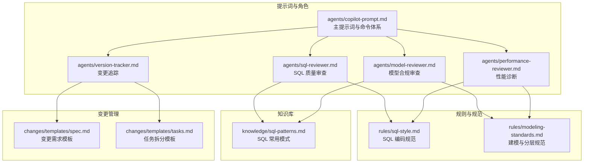
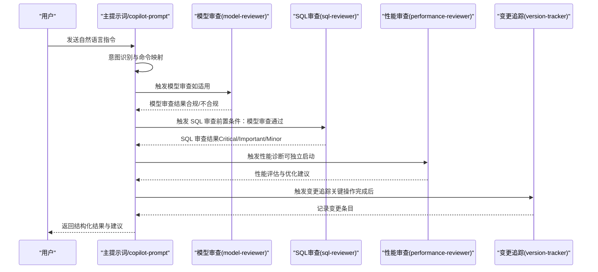
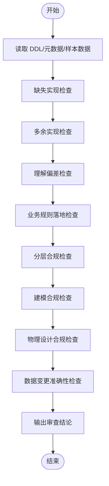
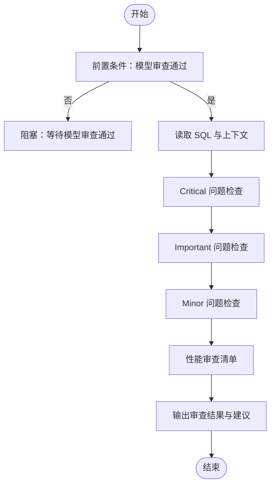
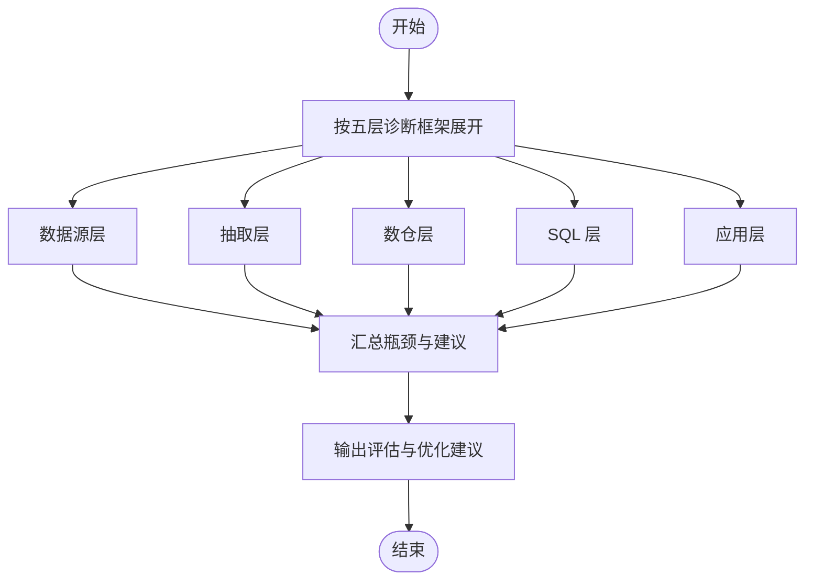
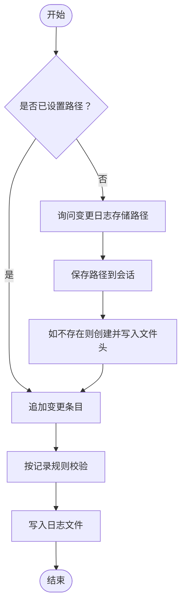
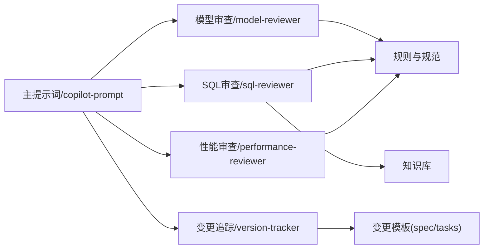

# 角色代理系统

<cite>
**本文引用的文件**
- [copilot-prompt.md](file://data_warehouse_engineering_code_copilot/agents/copilot-prompt.md)
- [sql-reviewer.md](file://data_warehouse_engineering_code_copilot/agents/sql-reviewer.md)
- [model-reviewer.md](file://data_warehouse_engineering_code_copilot/agents/model-reviewer.md)
- [performance-reviewer.md](file://data_warehouse_engineering_code_copilot/agents/performance-reviewer.md)
- [version-tracker.md](file://data_warehouse_engineering_code_copilot/agents/version-tracker.md)
- [目录结构和设计说明.md](file://data_warehouse_engineering_code_copilot/目录结构和设计说明.md)
- [sql-style.md](file://data_warehouse_engineering_code_copilot/rules/sql-style.md)
- [modeling-standards.md](file://data_warehouse_engineering_code_copilot/rules/modeling-standards.md)
- [spec.md](file://data_warehouse_engineering_code_copilot/changes/templates/spec.md)
- [tasks.md](file://data_warehouse_engineering_code_copilot/changes/templates/tasks.md)
- [sql-patterns.md](file://data_warehouse_engineering_code_copilot/knowledge/sql-patterns.md)
</cite>

## 目录
1. [简介](#简介)
2. [项目结构](#项目结构)
3. [核心组件](#核心组件)
4. [架构总览](#架构总览)
5. [详细组件分析](#详细组件分析)
6. [依赖分析](#依赖分析)
7. [性能考量](#性能考量)
8. [故障排查指南](#故障排查指南)
9. [结论](#结论)
10. [附录](#附录)

## 简介
本项目是一套面向数据仓库（Data Warehouse）开发的“工程化提示词工程”系统，通过一组角色代理（Agent）协同工作，实现：
- 规范驱动的开发流程（Spec 驱动）
- 三阶段审查（Spec 合规 → 模型质量 → SQL 质量）
- 强制变更追踪（自动记录变更日志）
- 知识沉淀与复用（rules/、knowledge/、changes/）

系统围绕主提示词“dwh-copilot”展开，通过命令式协作（/sql、/etl、/model、/propose、/apply、/review、/optimize、/dq、/schedule、/archive）引导 AI 在固定流程内完成任务，避免发散与遗漏。

## 项目结构
项目采用“提示词 + 规则 + 知识 + 变更模板”的四库联动结构：
- agents/：角色代理提示词，定义各 Agent 的职责、输入输出与处理逻辑
- rules/：项目约束与规范（SQL 编码规范、建模分层规范、调度与安全等）
- knowledge/：领域知识库（SQL 模式、ETL 模式、性能优化、维度建模技巧等）
- changes/：变更管理（Spec 驱动核心，包含模板与执行日志）

图表来源
- [copilot-prompt.md:1-147](file://data_warehouse_engineering_code_copilot/agents/copilot-prompt.md#L1-L147)
- [sql-reviewer.md:1-68](file://data_warehouse_engineering_code_copilot/agents/sql-reviewer.md#L1-L68)
- [model-reviewer.md:1-50](file://data_warehouse_engineering_code_copilot/agents/model-reviewer.md#L1-L50)
- [performance-reviewer.md:1-81](file://data_warehouse_engineering_code_copilot/agents/performance-reviewer.md#L1-L81)
- [version-tracker.md:1-120](file://data_warehouse_engineering_code_copilot/agents/version-tracker.md#L1-L120)
- [sql-style.md:1-254](file://data_warehouse_engineering_code_copilot/rules/sql-style.md#L1-L254)
- [modeling-standards.md:1-242](file://data_warehouse_engineering_code_copilot/rules/modeling-standards.md#L1-L242)
- [spec.md:1-132](file://data_warehouse_engineering_code_copilot/changes/templates/spec.md#L1-L132)
- [tasks.md:1-74](file://data_warehouse_engineering_code_copilot/changes/templates/tasks.md#L1-L74)
- [sql-patterns.md:1-331](file://data_warehouse_engineering_code_copilot/knowledge/sql-patterns.md#L1-L331)

章节来源
- [目录结构和设计说明.md:1-204](file://data_warehouse_engineering_code_copilot/目录结构和设计说明.md#L1-L204)

## 核心组件
- 主提示词与命令体系：定义 AI 的身份、原则、命令映射与工作流，确保所有交互遵循固定流程。
- 专业审查 Agent：
  - 模型合规审查（model-reviewer）：验证模型是否符合 Spec 与建模最佳实践，独立于实现者上下文。
  - SQL 质量审查（sql-reviewer）：审查 SQL 的正确性、性能与可维护性，前置条件为模型审查通过。
  - 性能审查（performance-reviewer）：独立诊断数据源层 → ETL → 数仓层 → SQL 层 → 应用层的性能瓶颈。
- 变更追踪（version-tracker）：在每次 DDL/SQL/ETL/调度变更后，自动记录结构化变更条目，支持手动触发与路径初始化。

章节来源
- [copilot-prompt.md:15-147](file://data_warehouse_engineering_code_copilot/agents/copilot-prompt.md#L15-L147)
- [model-reviewer.md:1-50](file://data_warehouse_engineering_code_copilot/agents/model-reviewer.md#L1-L50)
- [sql-reviewer.md:1-68](file://data_warehouse_engineering_code_copilot/agents/sql-reviewer.md#L1-L68)
- [performance-reviewer.md:1-81](file://data_warehouse_engineering_code_copilot/agents/performance-reviewer.md#L1-L81)
- [version-tracker.md:1-120](file://data_warehouse_engineering_code_copilot/agents/version-tracker.md#L1-L120)

## 架构总览
系统采用“主提示词驱动 + 专业 Agent 协作 + 强制变更追踪”的架构：
- 主提示词负责流程编排与命令映射，确保 AI 在固定轨道上工作。
- 专业 Agent 各司其职，彼此通过前置条件与触发时机协作，形成三阶段审查链路。
- 变更追踪贯穿所有关键节点，保证每次变更可审计、可回溯。

图表来源
- [copilot-prompt.md:63-147](file://data_warehouse_engineering_code_copilot/agents/copilot-prompt.md#L63-L147)
- [model-reviewer.md:1-50](file://data_warehouse_engineering_code_copilot/agents/model-reviewer.md#L1-L50)
- [sql-reviewer.md:1-68](file://data_warehouse_engineering_code_copilot/agents/sql-reviewer.md#L1-L68)
- [performance-reviewer.md:1-81](file://data_warehouse_engineering_code_copilot/agents/performance-reviewer.md#L1-L81)
- [version-tracker.md:5-120](file://data_warehouse_engineering_code_copilot/agents/version-tracker.md#L5-L120)

## 详细组件分析

### 模型合规审查 Agent（model-reviewer）
- 职责边界
  - 专注于验证模型是否符合 Spec 与建模最佳实践，独立于实现者上下文。
  - 以“元数据”为依据，必须读取实际 DDL、表元数据与样本数据进行验证。
- 输入输出
  - 输入：模型 DDL、表结构、字段定义、样本数据、Spec 文档。
  - 输出：模型结构验证、字段/约束逐条验证、分层合规、结论（合规/不合规）。
- 处理逻辑
  - 缺失实现、多余实现、理解偏差、业务规则落地、分层合规、建模合规、物理设计合规、数据变更准确性等维度逐一检查。
- 工具权限
  - 仅需只读权限（Read/Grep/Glob），不写入。

图表来源
- [model-reviewer.md:6-29](file://data_warehouse_engineering_code_copilot/agents/model-reviewer.md#L6-L29)

章节来源
- [model-reviewer.md:1-50](file://data_warehouse_engineering_code_copilot/agents/model-reviewer.md#L1-L50)

### SQL 质量审查 Agent（sql-reviewer）
- 职责边界
  - 专职审查 SQL 的正确性、性能与可维护性，前置条件为模型审查通过。
- 审查分级
  - Critical（阻塞）：计算结果错误、Join 笛卡尔积、全表扫描、主键重复、回刷无幂等、跨库引用与敏感字段未脱敏等。
  - Important（应修复）：子查询未使用 CTE、重复计算、字符串隐式类型转换、NULL 处理缺失、时间过滤阻断分区裁剪、WHERE 条件写在 ON 子句等。
  - Minor（建议）：关键字大小写不统一、缩进/换行风格不一致、字段顺序与 DDL 不一致、可合并的多次 INSERT 等。
- 性能审查清单
  - 大表分区裁剪、Join 顺序、Map/Broadcast Join、数据倾斜、聚合下推、SELECT *、不必要的 ORDER BY、DISTINCT 与 GROUP BY 替代、窗口函数 PARTITION BY、CTE 物化等。
- 输出格式
  - 分级列出问题，附带性能评估摘要与优化建议。
- 工具权限
  - 仅需只读权限（Read/Grep/Glob）。

图表来源
- [sql-reviewer.md:3-68](file://data_warehouse_engineering_code_copilot/agents/sql-reviewer.md#L3-L68)

章节来源
- [sql-reviewer.md:1-68](file://data_warehouse_engineering_code_copilot/agents/sql-reviewer.md#L1-L68)

### 性能审查 Agent（performance-reviewer）
- 职责边界
  - 独立启动，不依赖其他审查阶段，负责全栈性能诊断。
- 诊断框架
  - 数据源层、抽取层（ETL/同步）、数仓层（ODS/DWD/DWS/ADS）、SQL 层、应用层（下游）。
- 输出格式
  - 性能评估摘要、问题清单（按影响排序）、优化路线图、优化前后对比表格。
- 工具权限
  - 仅需只读权限（Read/Grep/Glob/Bash），用于执行 explain、desc formatted、show partitions 等。

图表来源
- [performance-reviewer.md:5-81](file://data_warehouse_engineering_code_copilot/agents/performance-reviewer.md#L5-L81)

章节来源
- [performance-reviewer.md:1-81](file://data_warehouse_engineering_code_copilot/agents/performance-reviewer.md#L1-L81)

### 变更追踪 Agent（version-tracker）
- 职责边界
  - 在每次 DDL/SQL/ETL/调度变更后，自动记录结构化的变更条目，支持手动触发。
- 触发时机
  - /sql、/etl、/model、/schedule、/dq 产出新的对账规则或修复数据问题、/apply 每个 Task 完成后、用户手动要求记录。
- 路径初始化
  - 首次触发时询问变更日志存储路径，支持新建文件并写入文件头。
- 变更条目格式
  - 时间（精确到分钟）、模块、分层、任务、操作、变更内容、关联文件、回刷范围、影响下游、备注。
- 记录规则
  - 原子化、精确引用、任务可追溯、下游必标注、回刷必声明、时间精确到分钟、不阻塞主流程。
- 工具权限
  - 读取现有日志文件、追加变更条目到日志文件，不需要 Bash、Grep、Glob。

图表来源
- [version-tracker.md:5-120](file://data_warehouse_engineering_code_copilot/agents/version-tracker.md#L5-L120)

章节来源
- [version-tracker.md:1-120](file://data_warehouse_engineering_code_copilot/agents/version-tracker.md#L1-L120)

### 主提示词与命令体系（copilot-prompt）
- 核心法则
  - Spec 驱动（Model is Cheap, Context is Expensive）
  - 身份与原则（顶级数仓工程师搭档、中文输出、不确定就问、做“小炸弹”、有价值发现主动沉淀）
  - 回答框架（问题理解、现状分析、方案设计、具体实现、验证方法、性能与成本考量、注意事项）
  - 意图确认（先映射命令再执行）
- 命令体系
  - /init、/sql、/etl、/model、/propose、/apply、/review、/optimize、/dq、/schedule、/archive
- 调试流程与诊断层级
  - 四阶段：现象收集 → 根因定位 → 方案验证 → 实施修复
  - 诊断层级：数据源层 → 抽取层 → ODS/DWD/DWS/ADS → 应用层

章节来源
- [copilot-prompt.md:1-147](file://data_warehouse_engineering_code_copilot/agents/copilot-prompt.md#L1-L147)

## 依赖分析
- 组件耦合与协作
  - 主提示词是中枢，协调各 Agent 的启动与输出。
  - 模型审查是 SQL 审查的前置条件，二者共同构成三阶段审查的第二与第三阶段。
  - 性能审查可独立启动，亦可作为 SQL 审查的一部分输出。
  - 变更追踪贯穿所有关键节点，与命令体系紧密耦合。
- 外部依赖与集成点
  - 规则与知识库为 Agent 提供权威约束与经验参考。
  - 变更模板（spec/tasks）为审查与追踪提供结构化输入。
- 潜在循环依赖
  - 通过前置条件与触发时机避免循环依赖，Agent 之间以“只读”为主，降低耦合。

图表来源
- [copilot-prompt.md:63-147](file://data_warehouse_engineering_code_copilot/agents/copilot-prompt.md#L63-L147)
- [model-reviewer.md:1-50](file://data_warehouse_engineering_code_copilot/agents/model-reviewer.md#L1-L50)
- [sql-reviewer.md:1-68](file://data_warehouse_engineering_code_copilot/agents/sql-reviewer.md#L1-L68)
- [performance-reviewer.md:1-81](file://data_warehouse_engineering_code_copilot/agents/performance-reviewer.md#L1-L81)
- [version-tracker.md:5-120](file://data_warehouse_engineering_code_copilot/agents/version-tracker.md#L5-L120)

章节来源
- [目录结构和设计说明.md:196-204](file://data_warehouse_engineering_code_copilot/目录结构和设计说明.md#L196-L204)

## 性能考量
- 审查效率
  - SQL 审查与性能审查均强调“只读”，减少对生产环境的影响。
  - 性能审查清单覆盖分区裁剪、Join 顺序、倾斜、小文件等关键指标，便于快速定位瓶颈。
- 变更追踪
  - 记录规则要求原子化与精确引用，避免重复与模糊描述带来的额外审计成本。
  - 不阻塞主流程的设计确保变更追踪不影响核心任务执行。
- 知识复用
  - SQL 模式库提供经过验证的高质量模式，减少重复造轮子的成本。

[本节为通用指导，不直接分析具体文件]

## 故障排查指南
- 常见问题与处理
  - SQL 审查阻塞：确保模型审查通过后再启动 SQL 审查。
  - 性能诊断不生效：确认只读权限满足（Read/Grep/Glob/Bash），并正确执行 explain/desc/formatted/show partitions。
  - 变更追踪失败：检查路径有效性与权限，失败时提示用户但不中断主流程。
- 诊断流程
  - 现象收集 → 根因定位 → 方案验证 → 实施修复
  - 按五层诊断框架逐步排查，优先处理阻断性问题。

章节来源
- [copilot-prompt.md:133-147](file://data_warehouse_engineering_code_copilot/agents/copilot-prompt.md#L133-L147)
- [performance-reviewer.md:79-81](file://data_warehouse_engineering_code_copilot/agents/performance-reviewer.md#L79-L81)
- [version-tracker.md:80-89](file://data_warehouse_engineering_code_copilot/agents/version-tracker.md#L80-L89)

## 结论
本角色代理系统通过主提示词驱动与专业 Agent 协作，实现了规范驱动、可审计、可复用的数据仓库开发流程。模型审查与 SQL 审查构成三阶段审查的核心，性能审查提供独立的诊断能力，变更追踪确保每次变更可追溯。结合规则与知识库，系统能够持续沉淀经验并提升团队整体质量与效率。

[本节为总结性内容，不直接分析具体文件]

## 附录

### Agent 配置示例与最佳实践
- 配置示例
  - 变更追踪路径初始化：首次触发时询问路径并保存到会话，不存在则创建并写入文件头。
  - SQL 审查输出格式：按 Critical/Important/Minor 分级列出问题，附带性能评估摘要与优化建议。
  - 模型审查输出格式：模型结构验证、字段/约束逐条验证、分层合规、结论。
- 最佳实践
  - 先模型审查，再 SQL 审查，最后性能审查，确保审查链路顺畅。
  - 变更追踪必须在关键操作完成后触发，保证可审计性。
  - 使用知识库中的 SQL 模式与性能优化经验，减少重复劳动。
  - 严格遵循规则与规范，避免跨层反向引用、未分区裁剪、SELECT * 等禁用事项。

章节来源
- [version-tracker.md:19-120](file://data_warehouse_engineering_code_copilot/agents/version-tracker.md#L19-L120)
- [sql-reviewer.md:44-68](file://data_warehouse_engineering_code_copilot/agents/sql-reviewer.md#L44-L68)
- [model-reviewer.md:30-47](file://data_warehouse_engineering_code_copilot/agents/model-reviewer.md#L30-L47)
- [sql-style.md:192-254](file://data_warehouse_engineering_code_copilot/rules/sql-style.md#L192-L254)
- [modeling-standards.md:212-242](file://data_warehouse_engineering_code_copilot/rules/modeling-standards.md#L212-L242)

### 扩展机制：添加新的专业审查 Agent
- 设计原则
  - 与现有 Agent 保持职责边界清晰，避免重复。
  - 以“只读”为主，尽量不写入，减少对生产环境的影响。
  - 与主提示词的命令体系对接，遵循相同的输入输出格式与触发时机。
- 实施步骤
  - 定义 Agent 的职责与前置条件，编写提示词文档。
  - 对接规则与知识库，确保审查依据权威可靠。
  - 在主提示词中注册命令映射与触发逻辑。
  - 在变更追踪中明确触发时机，确保每次审查都有记录。

章节来源
- [目录结构和设计说明.md:196-204](file://data_warehouse_engineering_code_copilot/目录结构和设计说明.md#L196-L204)
- [copilot-prompt.md:36-62](file://data_warehouse_engineering_code_copilot/agents/copilot-prompt.md#L36-L62)