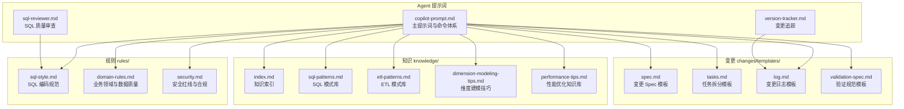
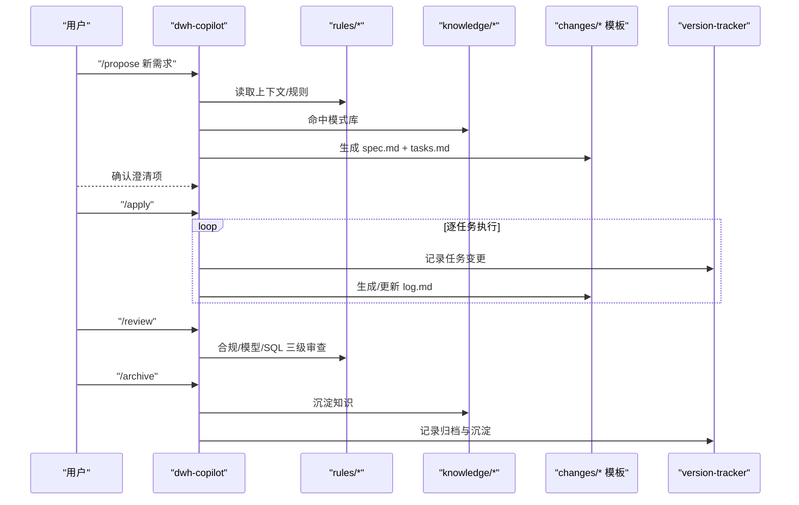
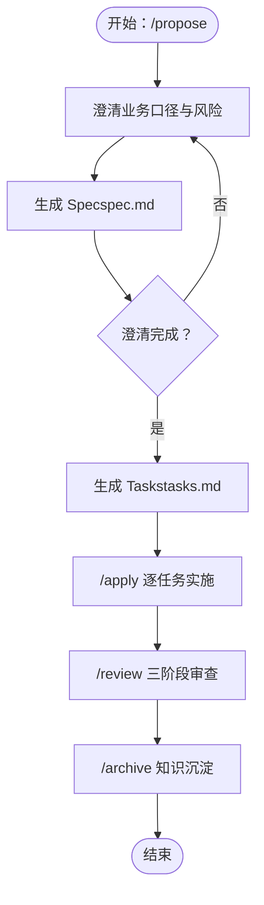
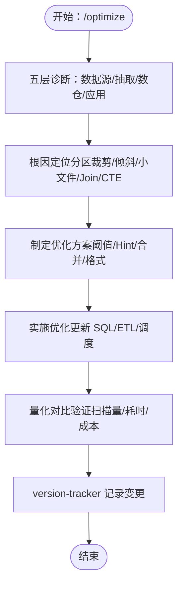
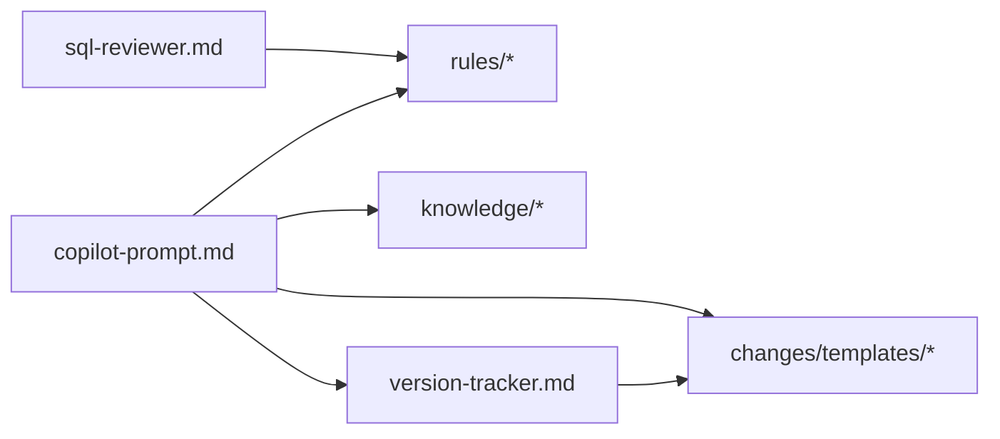

# 使用场景与最佳实践

<cite>
**本文引用的文件**
- [目录结构和设计说明.md](file://目录结构和设计说明.md)
- [copilot-prompt.md](file://agents/copilot-prompt.md)
- [sql-reviewer.md](file://agents/sql-reviewer.md)
- [version-tracker.md](file://agents/version-tracker.md)
- [sql-style.md](file://rules/sql-style.md)
- [domain-rules.md](file://rules/domain-rules.md)
- [security.md](file://rules/security.md)
- [index.md](file://knowledge/index.md)
- [sql-patterns.md](file://knowledge/sql-patterns.md)
- [etl-patterns.md](file://knowledge/etl-patterns.md)
- [dimension-modeling-tips.md](file://knowledge/dimension-modeling-tips.md)
- [performance-tips.md](file://knowledge/performance-tips.md)
- [spec.md](file://changes/templates/spec.md)
- [tasks.md](file://changes/templates/tasks.md)
- [log.md](file://changes/templates/log.md)
- [validation-spec.md](file://changes/templates/validation-spec.md)
</cite>

## 目录
1. [简介](#简介)
2. [项目结构](#项目结构)
3. [核心组件](#核心组件)
4. [架构总览](#架构总览)
5. [详细组件分析](#详细组件分析)
6. [依赖分析](#依赖分析)
7. [性能考虑](#性能考虑)
8. [故障排除指南](#故障排除指南)
9. [结论](#结论)
10. [附录](#附录)

## 简介
本指南面向数据仓库工程协作场景，围绕“Spec 驱动 + 三段式知识库 + 强制变更追踪”的工程化方法论，提供新需求开发、性能优化、日常开发最佳实践与常见问题排查的系统化工作流。通过命令式协作（/propose → /apply → /review → /archive）与模板化文档（Spec、Tasks、Log、Validation）保障变更的可审计、可回溯与可复用。

## 项目结构
项目采用“Agent + 规则 + 知识 + 变更模板”的分层组织，强调规范约束、经验复用与过程沉淀。

图表来源
- [目录结构和设计说明.md:19-55](file://目录结构和设计说明.md#L19-L55)
- [copilot-prompt.md:1-147](file://agents/copilot-prompt.md#L1-L147)
- [sql-style.md:1-254](file://rules/sql-style.md#L1-L254)
- [domain-rules.md:1-142](file://rules/domain-rules.md#L1-L142)
- [security.md:1-98](file://rules/security.md#L1-L98)
- [index.md:1-60](file://knowledge/index.md#L1-L60)
- [sql-patterns.md:1-331](file://knowledge/sql-patterns.md#L1-L331)
- [etl-patterns.md:1-220](file://knowledge/etl-patterns.md#L1-L220)
- [dimension-modeling-tips.md:1-253](file://knowledge/dimension-modeling-tips.md#L1-L253)
- [performance-tips.md:1-349](file://knowledge/performance-tips.md#L1-L349)
- [spec.md:1-132](file://changes/templates/spec.md#L1-L132)
- [tasks.md:1-74](file://changes/templates/tasks.md#L1-L74)
- [log.md:1-61](file://changes/templates/log.md#L1-L61)
- [validation-spec.md:1-123](file://changes/templates/validation-spec.md#L1-L123)

章节来源
- [目录结构和设计说明.md:19-55](file://目录结构和设计说明.md#L19-L55)
- [copilot-prompt.md:63-147](file://agents/copilot-prompt.md#L63-L147)

## 核心组件
- 主提示词与命令体系：定义“Spec 驱动”“三阶段审查”“调试流程”等协作范式，规范输出格式与验证铁律。
- SQL 质量审查：对 Critical/Important/Minor 问题分级，提供性能清单与输出格式。
- 变更追踪：在 DDL/SQL/ETL/调度等关键节点自动记录结构化变更日志，确保可审计与可回溯。
- 规则与规范：SQL 编码规范、领域规则、安全红线，构成强制约束。
- 知识库：SQL 模式、ETL 模式、维度建模、性能优化、知识索引，支撑经验复用。
- 变更模板：Spec、Tasks、Log、Validation，固化过程与证据。

章节来源
- [copilot-prompt.md:4-147](file://agents/copilot-prompt.md#L4-L147)
- [sql-reviewer.md:1-68](file://agents/sql-reviewer.md#L1-L68)
- [version-tracker.md:1-120](file://agents/version-tracker.md#L1-L120)
- [sql-style.md:1-254](file://rules/sql-style.md#L1-L254)
- [domain-rules.md:1-142](file://rules/domain-rules.md#L1-L142)
- [security.md:1-98](file://rules/security.md#L1-L98)
- [index.md:1-60](file://knowledge/index.md#L1-L60)
- [sql-patterns.md:1-331](file://knowledge/sql-patterns.md#L1-L331)
- [etl-patterns.md:1-220](file://knowledge/etl-patterns.md#L1-L220)
- [dimension-modeling-tips.md:1-253](file://knowledge/dimension-modeling-tips.md#L1-L253)
- [performance-tips.md:1-349](file://knowledge/performance-tips.md#L1-L349)
- [spec.md:1-132](file://changes/templates/spec.md#L1-L132)
- [tasks.md:1-74](file://changes/templates/tasks.md#L1-L74)
- [log.md:1-61](file://changes/templates/log.md#L1-L61)
- [validation-spec.md:1-123](file://changes/templates/validation-spec.md#L1-L123)

## 架构总览
下图展示从需求到上线的闭环流程，贯穿 Spec 生成、任务拆分、质量审查与知识沉淀。

图表来源
- [目录结构和设计说明.md:126-166](file://目录结构和设计说明.md#L126-L166)
- [copilot-prompt.md:103-136](file://agents/copilot-prompt.md#L103-L136)
- [spec.md:1-132](file://changes/templates/spec.md#L1-L132)
- [tasks.md:1-74](file://changes/templates/tasks.md#L1-L74)
- [log.md:1-61](file://changes/templates/log.md#L1-L61)
- [version-tracker.md:5-16](file://agents/version-tracker.md#L5-L16)

章节来源
- [目录结构和设计说明.md:126-166](file://目录结构和设计说明.md#L126-L166)
- [copilot-prompt.md:103-136](file://agents/copilot-prompt.md#L103-L136)

## 详细组件分析

### 新需求开发标准流程
- 需求澄清：通过 /propose 命令，逐步澄清粒度、时间窗、口径、SLA、PII/财务等风险点，形成 Spec。
- Spec 生成：使用 spec.md 模板，明确背景、现状、功能点、业务规则、模型/SQL/ETL/调度/DQ、影响范围与验证策略。
- 任务拆分：使用 tasks.md 按 ODS→DIM→DWD→DWS→ADS→调度→DQ→权限的顺序拆分，每个任务原子化且可独立验证。
- 质量审查：三阶段审查（Spec 合规 → 模型质量 → SQL 质量），未通过不进入下一阶段。
- 知识沉淀：通过 log.md 记录决策与踩坑，/archive 时沉淀到 knowledge/*。

图表来源
- [copilot-prompt.md:103-116](file://agents/copilot-prompt.md#L103-L116)
- [spec.md:1-132](file://changes/templates/spec.md#L1-L132)
- [tasks.md:1-74](file://changes/templates/tasks.md#L1-L74)
- [log.md:1-61](file://changes/templates/log.md#L1-L61)

章节来源
- [copilot-prompt.md:103-116](file://agents/copilot-prompt.md#L103-L116)
- [spec.md:1-132](file://changes/templates/spec.md#L1-L132)
- [tasks.md:1-74](file://changes/templates/tasks.md#L1-L74)
- [log.md:1-61](file://changes/templates/log.md#L1-L61)

### 性能优化完整工作流
- 问题诊断：按数据源→抽取→数仓→应用五层定位，量化优化前后对比（扫描量/耗时/资源/成本）。
- 根因分析：识别分区裁剪缺失、数据倾斜、小文件、Join 顺序不当、CTE 未物化等典型问题。
- 方案实施：依据性能知识库给出具体优化建议（如 Map/Broadcast Join、小文件合并、列裁剪、存储格式）。
- 效果验证：通过执行计划与作业历史定位慢点，结合采样与对账验证收益。

图表来源
- [copilot-prompt.md:117-119](file://agents/copilot-prompt.md#L117-L119)
- [performance-tips.md:1-349](file://knowledge/performance-tips.md#L1-L349)
- [version-tracker.md:5-16](file://agents/version-tracker.md#L5-L16)

章节来源
- [copilot-prompt.md:117-119](file://agents/copilot-prompt.md#L117-L119)
- [performance-tips.md:1-349](file://knowledge/performance-tips.md#L1-L349)
- [version-tracker.md:5-16](file://agents/version-tracker.md#L5-L16)

### 日常开发最佳实践

#### SQL 开发规范
- 命名约定：库/表/字段/分区统一规范，避免保留字与混拼，使用 snake_case。
- 格式规范：关键字大小写、缩进与换行、头部注释、行内注释。
- 编写原则：性能优先（分区裁剪、CTE、GROUP BY 替 DISTINCT）、正确性优先（NULL 处理、DECIMAL、幂等写入）、可维护性（语义化 CTE、统一别名）。
- 禁止事项：SELECT *、函数包裹分区字段、INSERT INTO 分区表、跨层反向引用等。

章节来源
- [sql-style.md:7-254](file://rules/sql-style.md#L7-L254)

#### ETL 任务开发
- 同步选型：全量/增量/JDBC/CDC 三选一，结合实时性、完整性、复杂度与历史追踪需求。
- 幂等与回放：ODS 覆盖写入、CDC 事件保留、MERGE 幂等写入、小文件合并与回刷分批执行。
- 约定与陷阱：水位单调递增、跨日重叠窗口、时区一致、文件接入完成标记、API 限流与断点续传。

章节来源
- [etl-patterns.md:1-220](file://knowledge/etl-patterns.md#L1-L220)

#### 数据质量保证
- 五维度规则：完整性/唯一性/一致性/准确性/时效性，明确严重等级与阈值。
- 验证策略：行数核验、主键唯一性、核心指标对比、字段级抽样、边界测试、回刷对账。
- DQ 规则：为每条规则产出可执行的对账 SQL，与基准来源对比。

章节来源
- [domain-rules.md:69-142](file://rules/domain-rules.md#L69-L142)
- [validation-spec.md:1-123](file://changes/templates/validation-spec.md#L1-L123)

#### 安全合规检查
- 禁止项：硬编码凭据、直接展示 PII、在测试环境使用真实数据、在公共仓库提交敏感文件。
- 脱敏与 RLS：字段级脱敏策略、行级权限配置与验证、数据分级与访问控制。
- 上线与应急：双签机制、回滚预案、审计日志、应急响应流程。

章节来源
- [security.md:1-98](file://rules/security.md#L1-L98)

### 常见问题与故障排除

#### SQL 常见错误
- 函数包裹分区字段导致全表扫描 → 改为直接比较 dt。
- SELECT * 未明列字段 → 明确字段列表。
- FLOAT 存金额 → 使用 DECIMAL。
- 保留字作字段名 → 使用合法标识符。

章节来源
- [sql-style.md:226-254](file://rules/sql-style.md#L226-L254)

#### 性能问题定位
- 分区裁剪缺失：EXPLAIN 检查 PartitionFilters。
- 数据倾斜：采样热点键，加盐打散或过滤单独处理。
- 小文件：控制 reduce 数、DISTRIBUTE BY、AQE 合并。
- CTE 未物化：复杂 CTE 先落临时表或显式 CACHE。

章节来源
- [performance-tips.md:23-349](file://knowledge/performance-tips.md#L23-L349)

#### ETL 回刷与幂等
- 单分区覆盖写入（INSERT OVERWRITE）保证幂等。
- 分批回刷 + 进度表 + 失败重试 + 下游通知。
- 回刷中加“回刷中”标记，避免下游读到不一致数据。

章节来源
- [etl-patterns.md:122-152](file://knowledge/etl-patterns.md#L122-L152)
- [sql-patterns.md:232-255](file://knowledge/sql-patterns.md#L232-L255)

## 依赖分析
- Agent 依赖规则与知识库：主提示词在每次会话开始时读取 rules/ 并检查 changes/ 当前变更，确保输出遵循规范与模板。
- 审查依赖：SQL 质量审查前置条件为模型审查通过；三阶段审查串行推进。
- 追踪依赖：DDL/SQL/ETL/调度变更后必须触发 version-tracker，保证可审计。

图表来源
- [copilot-prompt.md:57-61](file://agents/copilot-prompt.md#L57-L61)
- [sql-reviewer.md:1-4](file://agents/sql-reviewer.md#L1-L4)
- [version-tracker.md:5-16](file://agents/version-tracker.md#L5-L16)

章节来源
- [copilot-prompt.md:57-61](file://agents/copilot-prompt.md#L57-L61)
- [sql-reviewer.md:1-4](file://agents/sql-reviewer.md#L1-L4)
- [version-tracker.md:5-16](file://agents/version-tracker.md#L5-L16)

## 性能考虑
- 分区裁剪：WHERE 直接命中 dt，避免函数包裹。
- Join 顺序与类型：按引擎选择 Broadcast Hash Join、Sort Merge Join 或 Bucket Join。
- 小文件控制：reduce 数、DISTRIBUTE BY、AQE 合并、周期性合并。
- CTE 物化：复杂 CTE 先落临时表或显式 CACHE。
- 存储格式：ORC/Parquet + ZSTD，列裁剪与谓词下推收益显著。
- 调度与资源：错峰调度、资源队列隔离、失败重试与告警。

章节来源
- [performance-tips.md:1-349](file://knowledge/performance-tips.md#L1-L349)

## 故障排除指南
- 现象收集：采集执行计划、作业历史、Stage Metrics、采样数据。
- 根因定位：分区裁剪、倾斜键、小文件、Join 类型、CTE 未物化。
- 方案验证：先在开发/预发验证，再灰度到生产。
- 实施修复：更新 SQL/ETL/调度，version-tracker 记录变更，沉淀到 knowledge/*。

章节来源
- [copilot-prompt.md:133-146](file://agents/copilot-prompt.md#L133-L146)
- [performance-tips.md:327-349](file://knowledge/performance-tips.md#L327-L349)
- [version-tracker.md:5-16](file://agents/version-tracker.md#L5-L16)

## 结论
通过“Spec 驱动 + 三段式知识库 + 强制变更追踪”，dwh-copilot 将数仓开发从经验驱动转变为流程化、可审计、可复用的工程实践。建议团队在每次协作中严格遵循命令体系与模板，持续沉淀知识，提升交付质量与效率。

## 附录

### 命令速查与触发时机
- /init：初始化项目上下文（填充 rules/project-context.md）
- /sql：SQL 开发（完成后触发 version-tracker）
- /etl：ETL/同步开发（完成后触发 version-tracker）
- /model：数仓建模（完成后触发 version-tracker）
- /propose：创建变更提案（生成 spec + tasks）
- /apply：按 spec/tasks 实施（每个 task 完成后触发 version-tracker）
- /review：三阶段审查（Spec 合规 → 模型质量 → SQL 质量）
- /optimize：性能诊断与优化（量化对比）
- /dq：数据质量校验（五大维度）
- /schedule：调度配置（新增/调整触发 version-tracker）
- /archive：归档 + 知识沉淀（触发 version-tracker）

章节来源
- [copilot-prompt.md:65-132](file://agents/copilot-prompt.md#L65-L132)
- [version-tracker.md:5-16](file://agents/version-tracker.md#L5-L16)