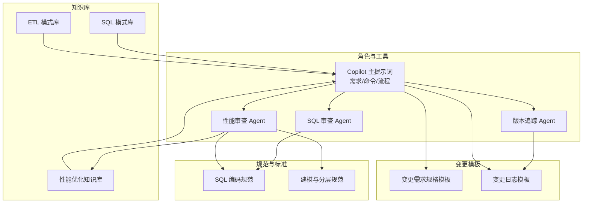
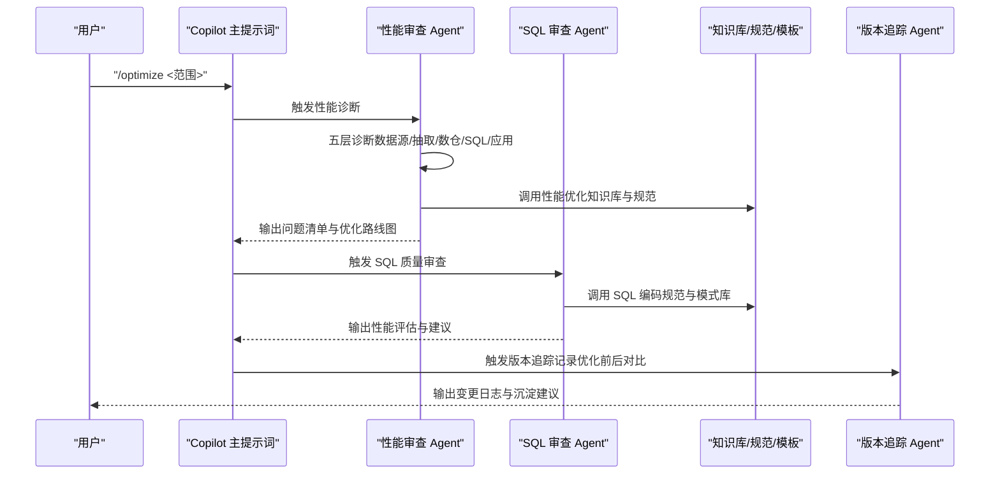
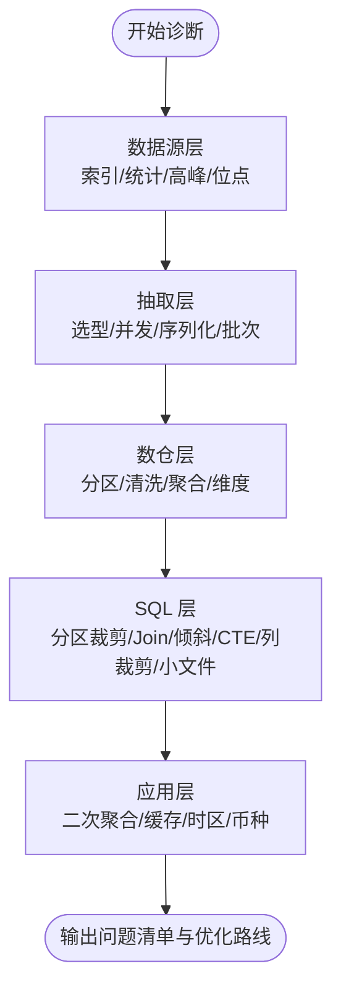
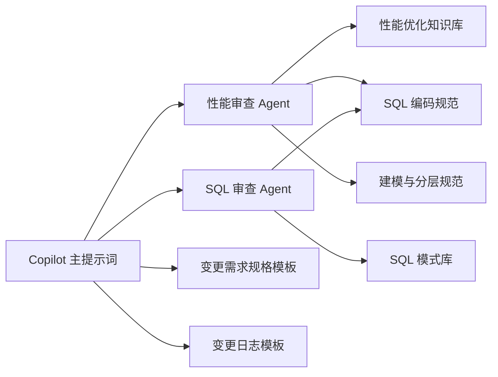

# 性能优化工作流

<cite>
**本文引用的文件**
- [目录结构和设计说明.md](file://目录结构和设计说明.md)
- [copilot-prompt.md](file://agents/copilot-prompt.md)
- [performance-reviewer.md](file://agents/performance-reviewer.md)
- [sql-reviewer.md](file://agents/sql-reviewer.md)
- [performance-tips.md](file://knowledge/performance-tips.md)
- [sql-patterns.md](file://knowledge/sql-patterns.md)
- [etl-patterns.md](file://knowledge/etl-patterns.md)
- [sql-style.md](file://rules/sql-style.md)
- [modeling-standards.md](file://rules/modeling-standards.md)
- [spec.md](file://changes/templates/spec.md)
- [log.md](file://changes/templates/log.md)
</cite>

## 目录
1. [简介](#简介)
2. [项目结构](#项目结构)
3. [核心组件](#核心组件)
4. [架构总览](#架构总览)
5. [详细组件分析](#详细组件分析)
6. [依赖分析](#依赖分析)
7. [性能考虑](#性能考虑)
8. [故障排查指南](#故障排查指南)
9. [结论](#结论)
10. [附录](#附录)

## 简介
本指南围绕数据仓库性能优化，提供系统化的诊断与优化工作流。基于项目提供的“五层诊断框架”“性能优化知识库”“SQL/ETL 模式库”“规范与模板”，形成从问题定位、根因分析、方案制定、实施验证到持续监控的闭环。目标是帮助读者掌握“如何系统地发现瓶颈、如何量化优化收益、如何建立可持续的优化机制”。

## 项目结构
该项目采用“Agent + 知识库 + 规范 + 变更模板”的工程化提示词工程结构，强调：
- 规范驱动（rules/）：强制性约束与标准
- 经验复用（knowledge/）：SQL/ETL/性能/建模技巧
- 流程闭环（changes/）：变更提案、任务拆分、验证与归档
- 角色协同（agents/）：Copilot、SQL 审查、性能审查、版本追踪

图表来源
- [目录结构和设计说明.md: 19-55:19-55](file://目录结构和设计说明.md#L19-L55)
- [copilot-prompt.md: 23-34:23-34](file://agents/copilot-prompt.md#L23-L34)
- [sql-reviewer.md: 1-68:1-68](file://agents/sql-reviewer.md#L1-L68)
- [performance-reviewer.md: 1-81:1-81](file://agents/performance-reviewer.md#L1-L81)

章节来源
- [目录结构和设计说明.md: 19-55:19-55](file://目录结构和设计说明.md#L19-L55)
- [目录结构和设计说明.md: 109-123:109-123](file://目录结构和设计说明.md#L109-L123)

## 核心组件
- 五层诊断框架：数据源层 → 抽取层 → 数仓层 → SQL 层 → 应用层
- 性能审查清单：分区裁剪、Join 类型与顺序、倾斜、CTE 物化、列裁剪、小文件等
- 规范与模板：SQL 编码规范、建模分层规范、变更需求规格、变更日志
- 模式库：SQL 常用模式、ETL 同步模式、性能优化经验

章节来源
- [performance-reviewer.md: 5-39:5-39](file://agents/performance-reviewer.md#L5-L39)
- [sql-reviewer.md: 31-42:31-42](file://agents/sql-reviewer.md#L31-L42)
- [sql-style.md: 165-190:165-190](file://rules/sql-style.md#L165-L190)
- [modeling-standards.md: 7-46:7-46](file://rules/modeling-standards.md#L7-L46)
- [spec.md: 1-132:1-132](file://changes/templates/spec.md#L1-L132)
- [log.md: 20-61:20-61](file://changes/templates/log.md#L20-L61)

## 架构总览
下图展示了性能优化工作流的总体架构：从 Copilot 命令入口，到性能审查 Agent 的五层诊断，再到规范与知识库的支撑，最终通过变更模板与版本追踪形成闭环。

图表来源
- [copilot-prompt.md: 117-120:117-120](file://agents/copilot-prompt.md#L117-L120)
- [performance-reviewer.md: 41-77:41-77](file://agents/performance-reviewer.md#L41-L77)
- [sql-reviewer.md: 44-64:44-64](file://agents/sql-reviewer.md#L44-L64)
- [log.md: 46-54:46-54](file://changes/templates/log.md#L46-L54)

## 详细组件分析

### 五层诊断框架
- 数据源层：索引/统计信息、抽取窗口是否落在业务高峰、CDC 延迟与位点
- 抽取层：全量/增量/CDC 选型、并发与分片、序列化开销、写入批次
- 数仓层：分区设计、清洗复杂度、聚合粒度、维度策略、二次聚合
- SQL 层：分区裁剪、Join 类型与顺序、倾斜、CTE 物化、列裁剪、小文件
- 应用层：BI 二次聚合、API 粒度、缓存与物化、时区/币种换算

图表来源
- [performance-reviewer.md: 7-39:7-39](file://agents/performance-reviewer.md#L7-L39)

章节来源
- [performance-reviewer.md: 5-39:5-39](file://agents/performance-reviewer.md#L5-L39)

### 性能问题识别与根因分析
- 分区裁剪：WHERE 直接命中分区字段，禁止函数包裹；验证执行计划中的 PartitionFilters
- 数据倾斜：任务卡在 99%、个别 reducer 处理量远高于其他、OOM 集中；常见原因：NULL/默认值、业务热点、时间集中
- Map/Broadcast Join：小表广播避免 Shuffle；阈值建议与配置项
- 小文件：元数据爆炸、Map Task 启动开销大、查询性能下降；控制手段与阈值
- CTE 物化：Hive/Spark 默认不物化，多次引用需临时表或 CACHE
- 谓词下推与列裁剪：WHERE 下推与列裁剪显著降低扫描量
- Join 顺序与类型：按引擎选择最优 Join；分桶 Join 跳过 Shuffle
- 窗口函数：PARTITION BY 列基数适中；配合 DISTRIBUTE BY/SORT BY
- 存储格式与压缩：ORC/Parquet + ZSTD/ Snappy；列存收益巨大
- 调度与资源：队列划分、错峰调度、SLA 基线、失败重试

章节来源
- [performance-tips.md: 5-349:5-349](file://knowledge/performance-tips.md#L5-L349)

### 优化方案制定与实施
- SQL 优化：分区裁剪、Map Join、列裁剪、CTE 物化、窗口函数优化、避免 SELECT *
- 表结构优化：分区设计、分桶、存储格式与压缩、生命周期
- 分区策略优化：按 dt 分区、二级分区（如 dh/region）、单表分区数与单分区文件数阈值
- ETL 优化：CDC/增量/全量选型、并发与分片、小文件合并、幂等写入
- 调度优化：资源队列、调度时间窗、SLA 基线、失败重试与回放

章节来源
- [performance-tips.md: 5-349:5-349](file://knowledge/performance-tips.md#L5-L349)
- [etl-patterns.md: 1-220:1-220](file://knowledge/etl-patterns.md#L1-L220)
- [modeling-standards.md: 171-193:171-193](file://rules/modeling-standards.md#L171-L193)

### 效果验证与监控
- 量化对比：扫描量、运行耗时、资源消耗、计算成本
- 执行计划验证：EXPLAIN/EXPLAIN EXTENDED、PartitionFilters/DataFilters
- 作业历史与 Profile：识别慢 stage、单 task 数据量、shuffle 读写
- 数据采样：倾斜键采样、关键指标对比
- 指标监控：SLA 基线、资源队列占用、失败重试次数

章节来源
- [performance-reviewer.md: 41-77:41-77](file://agents/performance-reviewer.md#L41-L77)
- [performance-tips.md: 327-349:327-349](file://knowledge/performance-tips.md#L327-L349)

### 持续优化机制
- 变更即记录：每次 DDL/SQL/ETL/调度变更后自动追加结构化日志
- 知识沉淀：将踩坑与优化经验沉淀到 knowledge/，形成知识飞轮
- 三阶段审查：Spec 合规 → 模型质量 → SQL 质量，不通过不进下一阶段
- 回刷流程：分批回刷 + 进度跟踪 + 失败重试 + 告警

章节来源
- [目录结构和设计说明.md: 98-106:98-106](file://目录结构和设计说明.md#L98-L106)
- [copilot-prompt.md: 113-116:113-116](file://agents/copilot-prompt.md#L113-L116)
- [etl-patterns.md: 122-152:122-152](file://knowledge/etl-patterns.md#L122-L152)

### 实战案例：从诊断到优化的完整流程
- 现象收集：dws_user_active_1d 跑了 2 小时，慢
- 五层诊断：数据源层（索引/统计）、抽取层（CDC/增量策略）、数仓层（分区/清洗/聚合）、SQL 层（分区裁剪/Join/倾斜/CTE）、应用层（BI 二次聚合）
- 根因定位：未分区裁剪 + 倾斜键 + 小文件
- 方案验证：补分区裁剪（扫描量从 2TB → 8GB）、倾斜键加盐打散、小文件合并
- 实施修复：按优化路线图逐条实施，触发版本追踪
- 归档沉淀：将优化前后对比与经验沉淀到 knowledge/

章节来源
- [目录结构和设计说明.md: 153-166:153-166](file://目录结构和设计说明.md#L153-L166)
- [performance-reviewer.md: 65-77:65-77](file://agents/performance-reviewer.md#L65-L77)
- [log.md: 46-54:46-54](file://changes/templates/log.md#L46-L54)

## 依赖分析
- Copilot 主提示词驱动流程：/propose → /apply → /review → /optimize → /archive
- 性能审查依赖知识库与规范：性能优化知识库、SQL 编码规范、建模分层规范
- SQL 审查依赖 SQL 模式库与规范：SQL 模式库、SQL 编码规范
- 变更模板支撑：spec.md 与 log.md 用于记录与沉淀

图表来源
- [copilot-prompt.md: 63-132:63-132](file://agents/copilot-prompt.md#L63-L132)
- [performance-reviewer.md: 1-81:1-81](file://agents/performance-reviewer.md#L1-L81)
- [sql-reviewer.md: 1-68:1-68](file://agents/sql-reviewer.md#L1-L68)
- [performance-tips.md: 1-349:1-349](file://knowledge/performance-tips.md#L1-L349)
- [sql-patterns.md: 1-331:1-331](file://knowledge/sql-patterns.md#L1-L331)
- [sql-style.md: 1-254:1-254](file://rules/sql-style.md#L1-L254)
- [modeling-standards.md: 1-242:1-242](file://rules/modeling-standards.md#L1-L242)
- [spec.md: 1-132:1-132](file://changes/templates/spec.md#L1-L132)
- [log.md: 1-61:1-61](file://changes/templates/log.md#L1-L61)

章节来源
- [copilot-prompt.md: 63-132:63-132](file://agents/copilot-prompt.md#L63-L132)
- [performance-reviewer.md: 1-81:1-81](file://agents/performance-reviewer.md#L1-L81)
- [sql-reviewer.md: 1-68:1-68](file://agents/sql-reviewer.md#L1-L68)

## 性能考虑
- 分区裁剪与谓词下推：避免全表扫描，优先直接比较分区字段
- Join 顺序与类型：按引擎选择最优 Join；Map/Broadcast/SortMerge/ShuffleHash
- 倾斜处理：过滤 + 单独处理、加盐打散、Map Join 小表
- CTE 物化：多次引用的复杂 CTE 先落临时表，Spark 可 CACHE
- 列裁剪与存储格式：ORC/Parquet + ZSTD，列存收益巨大
- 小文件控制：输出端控制 reduce 数、DISTRIBUTE BY、AQE 合并
- 窗口函数：PARTITION BY 列基数适中，配合 DISTRIBUTE BY/SORT BY
- 调度与资源：队列划分、错峰调度、SLA 基线、失败重试

章节来源
- [performance-tips.md: 5-349:5-349](file://knowledge/performance-tips.md#L5-L349)

## 故障排查指南
- 通用流程：EXPLAIN → 作业历史 → Profile/Stage Metrics → 数据采样
- 常用命令：SHOW PARTITIONS、DESC FORMATTED、SHOW CREATE TABLE、ANALYZE TABLE
- 常见问题定位：未分区裁剪、倾斜键、小文件、CTE 未物化、列裁剪失效、UDF 导致 PPD 失效
- 失败重试：指数退避、幂等检查、连续失败告警与值班

章节来源
- [performance-tips.md: 327-349:327-349](file://knowledge/performance-tips.md#L327-L349)

## 结论
通过五层诊断框架与规范、知识库、模板、Agent 的协同，可以系统化地定位与解决数据仓库性能问题。关键在于：
- 以规范为纲，以知识为库，以模板为据，以 Agent 为流程引擎
- 量化优化前后指标，建立持续改进与沉淀机制
- 将经验固化为模式与流程，形成可复用的知识飞轮

## 附录

### 优化前后对比模板（摘自模板）
- 扫描量、运行耗时、资源消耗、计算成本
- 每条优化建议必须填写优化前后对比

章节来源
- [log.md: 46-54:46-54](file://changes/templates/log.md#L46-L54)