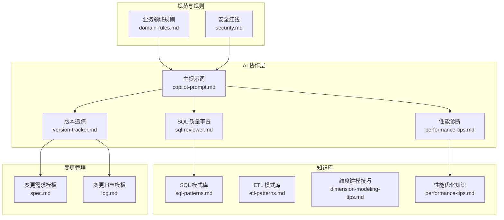
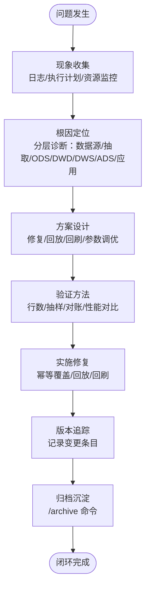
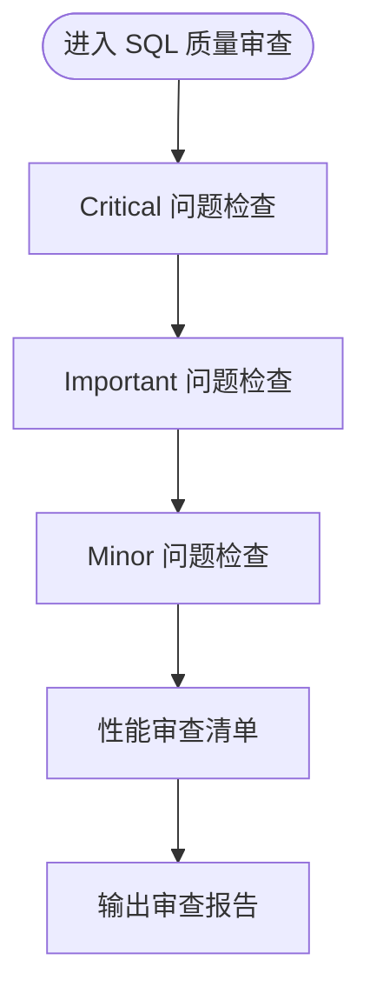
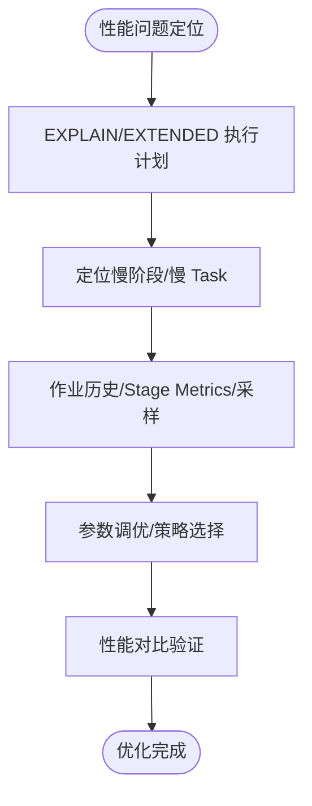
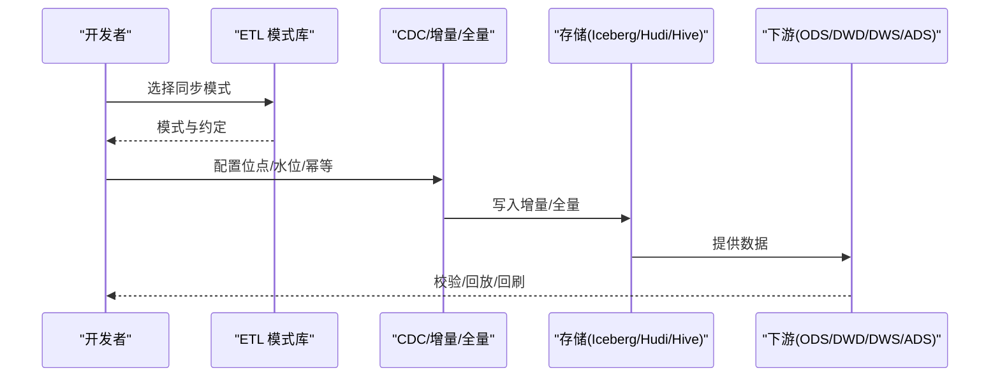
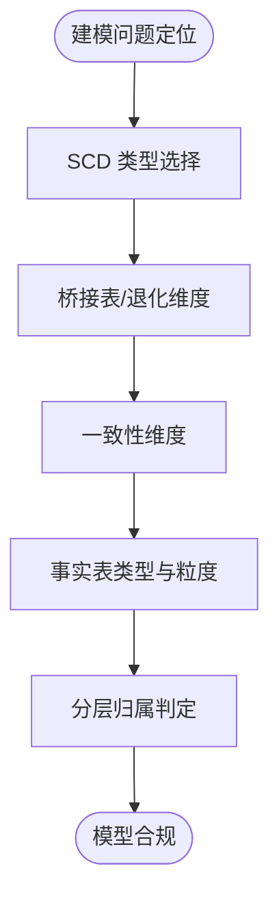
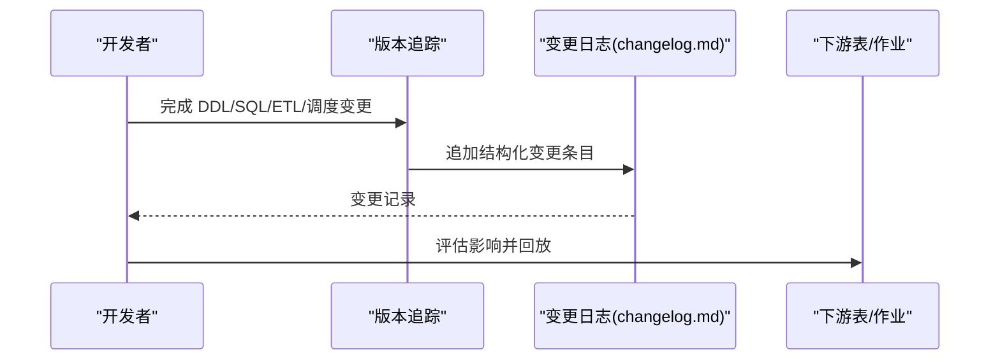
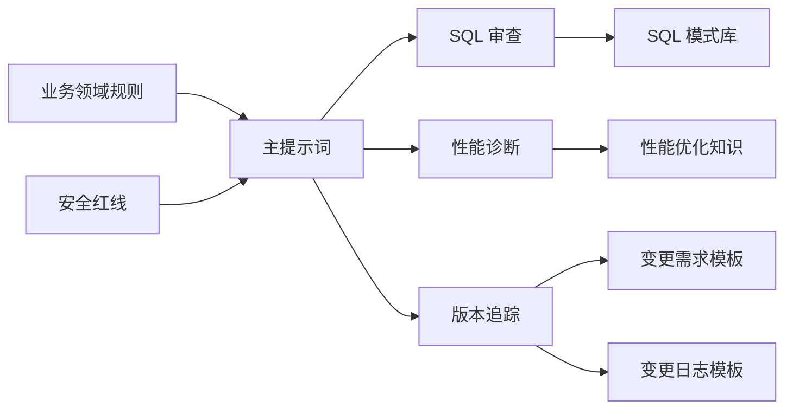

# 故障排除与调试指南

<cite>
**本文引用的文件**
- [目录结构和设计说明.md](file://目录结构和设计说明.md)
- [copilot-prompt.md](file://agents/copilot-prompt.md)
- [sql-reviewer.md](file://agents/sql-reviewer.md)
- [version-tracker.md](file://agents/version-tracker.md)
- [performance-tips.md](file://knowledge/performance-tips.md)
- [etl-patterns.md](file://knowledge/etl-patterns.md)
- [sql-patterns.md](file://knowledge/sql-patterns.md)
- [dimension-modeling-tips.md](file://knowledge/dimension-modeling-tips.md)
- [domain-rules.md](file://rules/domain-rules.md)
- [security.md](file://rules/security.md)
- [spec.md](file://changes/templates/spec.md)
- [log.md](file://changes/templates/log.md)
</cite>

## 目录
1. [简介](#简介)
2. [项目结构](#项目结构)
3. [核心组件](#核心组件)
4. [架构总览](#架构总览)
5. [详细组件分析](#详细组件分析)
6. [依赖分析](#依赖分析)
7. [性能考虑](#性能考虑)
8. [故障排除指南](#故障排除指南)
9. [结论](#结论)
10. [附录](#附录)

## 简介
本指南面向数据仓库开发中的常见问题，提供系统化的故障排除与调试方法。内容涵盖 SQL 执行失败、ETL 任务异常、性能问题、权限与安全错误等典型场景，配套问题定位方法、日志分析技巧、参数调优策略、版本追踪回溯与影响分析，以及预防措施与最佳实践，帮助提升问题解决效率与系统稳定性。

## 项目结构
本项目采用“提示词 + 知识库 + 变更管理”的工程化协作结构：
- agents：AI 角色与子 Agent（主提示词、SQL 审查、性能审查、版本追踪）
- knowledge：领域知识库（SQL 模式、ETL 模式、维度建模、性能优化）
- rules：约束与规范（业务领域规则、安全红线、建模与调度标准）
- changes/templates：变更模板（spec、tasks、log、validation-spec）

图表来源
- [目录结构和设计说明.md:19-55](file://目录结构和设计说明.md#L19-L55)
- [copilot-prompt.md:1-147](file://agents/copilot-prompt.md#L1-L147)
- [sql-reviewer.md:1-68](file://agents/sql-reviewer.md#L1-L68)
- [version-tracker.md:1-120](file://agents/version-tracker.md#L1-L120)
- [performance-tips.md:1-349](file://knowledge/performance-tips.md#L1-L349)
- [etl-patterns.md:1-220](file://knowledge/etl-patterns.md#L1-L220)
- [sql-patterns.md:1-331](file://knowledge/sql-patterns.md#L1-L331)
- [dimension-modeling-tips.md:1-253](file://knowledge/dimension-modeling-tips.md#L1-L253)
- [domain-rules.md:1-142](file://rules/domain-rules.md#L1-L142)
- [security.md:1-98](file://rules/security.md#L1-L98)
- [spec.md:1-132](file://changes/templates/spec.md#L1-L132)
- [log.md:1-61](file://changes/templates/log.md#L1-L61)

章节来源
- [目录结构和设计说明.md:19-55](file://目录结构和设计说明.md#L19-L55)

## 核心组件
- 主提示词与命令体系：定义 AI 的身份、法则、命令映射与调试流程，确保问题处理遵循“现象收集 → 根因定位 → 方案验证 → 实施修复”的四阶段。
- SQL 质量审查：从正确性、性能、可维护性三个层级识别问题，提供可量化的性能评估与优化建议。
- 性能诊断知识库：覆盖分区裁剪、数据倾斜、Map/Reduce Join、小文件、谓词下推、列裁剪、窗口函数、存储格式等关键优化点。
- ETL 模式库：CDC、JDBC 增量、MERGE/UPSERT、小文件控制、历史回刷、文件与 API 接入等常见场景的最佳实践与常见陷阱。
- 维度建模技巧：SCD、桥接表、退化维度、一致性维度、事实表类型与分层归属，指导模型层面的问题定位与修复。
- 安全与领域规则：PII 脱敏、行级权限、数据分级、业务口径一致性、跨系统对齐，保障问题修复不引入新的安全与口径偏差。
- 版本追踪：在每次 DDL/SQL/ETL/调度变更后自动记录结构化变更条目，支持回溯与影响分析。

章节来源
- [copilot-prompt.md:133-147](file://agents/copilot-prompt.md#L133-L147)
- [sql-reviewer.md:5-68](file://agents/sql-reviewer.md#L5-L68)
- [performance-tips.md:1-349](file://knowledge/performance-tips.md#L1-L349)
- [etl-patterns.md:1-220](file://knowledge/etl-patterns.md#L1-L220)
- [dimension-modeling-tips.md:1-253](file://knowledge/dimension-modeling-tips.md#L1-L253)
- [domain-rules.md:69-142](file://rules/domain-rules.md#L69-L142)
- [security.md:1-98](file://rules/security.md#L1-L98)
- [version-tracker.md:1-120](file://agents/version-tracker.md#L1-L120)

## 架构总览
下图展示了从问题发现到修复与沉淀的闭环流程，强调“先定位、后修复、再沉淀”的工程化思维。

图表来源
- [copilot-prompt.md:133-147](file://agents/copilot-prompt.md#L133-L147)
- [version-tracker.md:5-16](file://agents/version-tracker.md#L5-L16)

## 详细组件分析

### SQL 质量审查组件
- 审查分级：Critical（阻塞）、Important（应修复）、Minor（建议），覆盖计算结果错误、笛卡尔积、全表扫描、重复、跨库引用、PII 未脱敏等。
- 性能审查清单：分区裁剪、Join 顺序、广播/Map Join、数据倾斜、聚合下推、SELECT *、不必要的 ORDER BY、DISTINCT 与 GROUP BY 替代、窗口函数 PARTITION BY、CTE 物化。
- 输出格式：问题清单 + 性能影响评估 + 优化建议摘要。

图表来源
- [sql-reviewer.md:5-68](file://agents/sql-reviewer.md#L5-L68)

章节来源
- [sql-reviewer.md:5-68](file://agents/sql-reviewer.md#L5-L68)

### 性能诊断与优化组件
- 分区裁剪：禁止函数包裹分区字段，使用 EXPLAIN/EXTENDED 验证 PartitionFilters。
- 数据倾斜：识别热点键、NULL/默认值、业务集中；提供过滤+单独处理、加盐打散、Map Join 等方案。
- Map/Reduce Join：阈值与 Hint 使用，注意广播内存与多表嵌套风险。
- 小文件：控制 reduce 数、DISTRIBUTE BY、AQE 合并、周期性合并。
- CTE/物化：引擎差异，Spark 可 CACHE，注意释放。
- 谓词下推与列裁剪：WHERE 下推、列裁剪、UDF 导致失效。
- Join 顺序与类型：按引擎选择最优 Join，Bucket Join 跳过 Shuffle。
- 窗口函数：PARTITION BY 基数与 ORDER BY 复杂度权衡。
- 存储格式与压缩：ORC/Parquet/ZSTD 推荐，列存收益显著。
- 调度与资源：资源队列、错峰调度、SLA 基线、失败重试策略。

图表来源
- [performance-tips.md:327-349](file://knowledge/performance-tips.md#L327-L349)

章节来源
- [performance-tips.md:1-349](file://knowledge/performance-tips.md#L1-L349)

### ETL 模式与回放组件
- CDC 增量同步：Flink CDC + Kafka + Iceberg/Hudi，位点保护、op 字段、幂等、回放。
- JDBC 增量抽取：单调递增水位字段、重叠窗口、幂等覆盖、网络并发。
- MERGE/UPSERT：ACID 存储幂等写入、乱序保护、冲突处理、compaction。
- 小文件控制：reduce 数、DISTRIBUTE BY、AQE 合并。
- 历史回刷：范围确认、依赖 DAG、试点、分批、进度跟踪、失败处理。
- 文件与 API 接入：目录约定、完成标记、编码、schema 校验、bad record 隔离、限流与断点续传。
- 时区与数据漂移：存储 UTC + tz/local_dt、分区按业务日、报表明确时区口径。

图表来源
- [etl-patterns.md:6-220](file://knowledge/etl-patterns.md#L6-L220)

章节来源
- [etl-patterns.md:1-220](file://knowledge/etl-patterns.md#L1-L220)

### 维度建模与口径一致性组件
- SCD 类型：Type 1/2/3 适用场景与代价；拉链表写入需幂等覆盖。
- 桥接表：多对多/多值维度处理，权重与时间窗口。
- 退化维度：低基数/仅事实表使用的属性直接退化为事实表列。
- 一致性维度：跨主题共享维度，避免重复建设与口径不一致。
- 事实表类型：事务/周期/累积快照选择与粒度匹配。
- 分层归属：ODS/DWD/DWS/ADS/DIM 的判定原则与反模式。

图表来源
- [dimension-modeling-tips.md:39-253](file://knowledge/dimension-modeling-tips.md#L39-L253)

章节来源
- [dimension-modeling-tips.md:1-253](file://knowledge/dimension-modeling-tips.md#L1-L253)

### 安全与领域规则组件
- 数据安全：禁止硬编码凭据、PII 脱敏、测试环境使用脱敏样本、非安全渠道传输。
- 字段级脱敏：手机号、身份证、邮箱、银行卡、姓名、地址等掩码与哈希策略。
- 行级权限：多租户/多组织/多业务线必须配置 RLS，变更需验证与审计。
- 数据分级与访问控制：L1-L4 分级与访问限制、审计日志、跨级别合并表。
- 上线与发布安全：生产上线双签、DDL 回滚预案、统一密钥管理、临时探索查询禁止落地。
- 数据回刷安全：范围、影响、回退方案、对外指标回刷公告、低峰期执行。
- 业务安全：财务/营收/上市口径标注精度与披露规则、预测/预算数据时效性。
- 跨境合规：GDPR/PIPL 等法规、去标识化、数据出境清单与审批。

章节来源
- [security.md:1-98](file://rules/security.md#L1-L98)
- [domain-rules.md:69-142](file://rules/domain-rules.md#L69-L142)

### 版本追踪与影响分析组件
- 触发时机：/sql、/etl、/model、/schedule、/dq、/apply 每个 Task 完成后、手动记录。
- 变更条目格式：时间、模块、分层、任务、操作、变更内容、关联文件、回刷范围、影响下游、备注。
- 记录规则：原子化、精确引用、任务可追溯、下游必标注、回刷必声明、时间精确到分钟、不阻塞主流程。
- 影响分析：通过“影响下游”字段与变更日志，快速定位受波及的表/作业/报表，制定回放与补偿策略。

图表来源
- [version-tracker.md:5-16](file://agents/version-tracker.md#L5-L16)
- [version-tracker.md:44-64](file://agents/version-tracker.md#L44-L64)

章节来源
- [version-tracker.md:1-120](file://agents/version-tracker.md#L1-L120)

## 依赖分析
- 组件耦合与协作：
  - 主提示词驱动命令体系，串联 SQL 审查、性能诊断、版本追踪。
  - 知识库为审查与诊断提供可复用模式与最佳实践。
  - 规则与领域知识为问题定位提供约束与口径依据。
  - 变更模板支撑问题修复后的结构化记录与沉淀。
- 外部依赖与集成点：
  - 执行引擎（Hive/Spark/MaxCompute）与存储（Iceberg/Hudi/Hive/ORC/Parquet）。
  - 调度系统（Azkaban/DolphinScheduler/MC）与作业历史/日志查看。
  - 数据血缘平台（可选）辅助影响分析自动化。

图表来源
- [copilot-prompt.md:1-147](file://agents/copilot-prompt.md#L1-L147)
- [version-tracker.md:1-120](file://agents/version-tracker.md#L1-L120)
- [spec.md:1-132](file://changes/templates/spec.md#L1-L132)
- [log.md:1-61](file://changes/templates/log.md#L1-L61)

章节来源
- [目录结构和设计说明.md:19-55](file://目录结构和设计说明.md#L19-L55)

## 性能考虑
- 通用流程：EXPLAIN 执行计划、作业历史/Stage Metrics、Profile、数据采样找倾斜键。
- 关键优化点：分区裁剪、谓词下推、列裁剪、Join 顺序与类型、Map/Reduce Join、小文件合并、窗口函数分区与排序、存储格式与压缩。
- 资源与调度：资源队列划分、错峰调度、SLA 基线、失败重试与回放策略。

章节来源
- [performance-tips.md:327-349](file://knowledge/performance-tips.md#L327-L349)

## 故障排除指南

### 一、SQL 执行失败
- 现象与定位
  - 全表扫描：检查 WHERE 条件是否包裹分区字段，使用 EXPLAIN/EXTENDED 验证 PartitionFilters。
  - 笛卡尔积/重复行：确认 Join 条件与业务日期限制，避免维度重复膨胀。
  - NULL 处理：COUNT/SUM/Join 条件中缺失 NULL 处理，导致结果异常。
  - 字段别名缺失：下游难以追溯，建议在复杂 SQL 头部添加注释与字段说明。
- 解决方案
  - 采用分区裁剪与谓词下推，避免函数包裹分区字段。
  - 使用 CTE/物化减少重复计算，必要时缓存中间结果。
  - 明确字段别名与注释，确保可维护性。
- 验证方法
  - EXPLAIN/EXTENDED 执行计划对比，扫描量与 Shuffle 数量变化。
  - 行数核验、关键指标对比、抽样校验。

章节来源
- [sql-reviewer.md:31-68](file://agents/sql-reviewer.md#L31-L68)
- [performance-tips.md:23-34](file://knowledge/performance-tips.md#L23-L34)

### 二、ETL 任务异常
- CDC 增量同步
  - 现象：binlog 事件时间与事务提交时间混淆、大事务瞬时产生海量 binlog、主备切换位点跳变。
  - 解决：使用 op 字段与时间戳组合排序，监控 lag，GTID 校验。
- JDBC 增量抽取
  - 现象：update_time 不更新导致漏更新、时区不一致导致跨日漏数。
  - 解决：使用单调递增且有索引的水位字段，统一时区，跨天边界重叠窗口 + ODS 去重。
- MERGE/UPSERT
  - 现象：Hive 非事务表不支持 MERGE、频繁 UPSERT 产生删除标记文件。
  - 解决：使用 ACID 存储（Hudi/Iceberg/Delta），开启 compaction。
- 小文件控制
  - 现象：reduce 数过多导致小文件爆炸。
  - 解决：控制 reduce 数、DISTRIBUTE BY、AQE 合并。
- 历史回刷
  - 现象：单次回刷上千分区影响日常基线、回刷期间下游读到不一致数据。
  - 解决：分批回刷 + 进度跟踪 + “回刷中”标记 + 通知下游。
- 文件与 API 接入
  - 现象：Excel 科学计数法、CSV 未转义、Token 写在代码中。
  - 解决：显式编码、schema 校验、断点续传、密钥管理服务。

章节来源
- [etl-patterns.md:6-220](file://knowledge/etl-patterns.md#L6-L220)

### 三、性能问题
- 数据倾斜
  - 现象：任务卡在 99%、个别 reducer 处理数据量远超其他节点、OOM。
  - 解决：过滤+单独处理、加盐打散（二次聚合）、Map Join 小表。
- Map/Reduce Join
  - 现象：广播内存不足、多表嵌套广播累积 driver 内存。
  - 解决：调整阈值、显式 Hint、避免多表嵌套。
- 小文件
  - 现象：NameNode 压力、Map Task 启动开销大、查询性能下降。
  - 解决：控制 reduce 数、DISTRIBUTE BY、AQE 合并、周期性合并。
- 窗口函数
  - 现象：PARTITION BY 列基数过低或过高导致倾斜或启动开销大。
  - 解决：合理分区键、配合 DISTRIBUTE BY/SORT BY。
- 存储格式
  - 现象：TextFile/JSON 查询慢。
  - 解决：优先 ORC/Parquet + ZSTD，列裁剪与谓词下推收益显著。

章节来源
- [performance-tips.md:42-349](file://knowledge/performance-tips.md#L42-L349)

### 四、权限与安全错误
- 现象：PII 直接展示、凭据硬编码、RLS 规则未生效、跨级别数据合并未按最高级别管控。
- 解决：
  - 字段脱敏与哈希策略，禁止在 ADS/视图中直接展示 PII。
  - 使用统一密钥管理服务，禁止在脚本中硬编码凭据。
  - 行级权限必须在 spec 中明确定义并通过人工审查，变更后验证。
  - 数据分级访问控制与审计日志，异常访问行为告警。
- 预防措施：上线双签、回滚预案、临时探索查询禁止落地生产库。

章节来源
- [security.md:1-98](file://rules/security.md#L1-L98)

### 五、数据质量与口径不一致
- 五大维度：完整性、唯一性、一致性、准确性、时效性。
- 严重等级：P0 阻断、P1 告警、P2 监控。
- 跨系统一致性：先确认业务定义 → 再确认数据源差异 → 最后修代码。
- 对账与验证：行数核验、抽样校验、关键指标对比、基准来源对比。

章节来源
- [domain-rules.md:69-142](file://rules/domain-rules.md#L69-L142)

### 六、版本追踪与回溯
- 变更记录：精确到库.表.字段/作业名，包含模块、分层、任务、操作、变更内容、关联文件、回刷范围、影响下游、备注。
- 回溯步骤：
  - 在变更日志中定位变更时间与内容。
  - 根据“影响下游”字段识别受波及对象。
  - 通过 changes/templates/log.md 记录的踩坑与知识发现，复用修复方案。
  - 必要时进行回放或回刷，确保数据一致性。

章节来源
- [version-tracker.md:44-120](file://agents/version-tracker.md#L44-L120)
- [log.md:1-61](file://changes/templates/log.md#L1-L61)

## 结论
通过规范化的命令体系、严格的审查与诊断流程、完备的知识库与变更模板，以及自动化的版本追踪，本指南提供了从问题发现到修复与沉淀的完整闭环。建议在日常开发中坚持“先定位、后修复、再沉淀”，并充分利用性能优化、ETL 模式、维度建模与安全规则，持续提升系统稳定性与问题解决效率。

## 附录
- 常用验证与诊断命令
  - EXPLAIN/EXPLAIN EXTENDED：查看执行计划与 PartitionFilters。
  - SHOW PARTITIONS/DESC FORMATTED/SHOW CREATE TABLE：查看分区与元数据。
  - ANALYZE TABLE COMPUTE STATISTICS FOR COLUMNS：让优化器生效。
- 变更模板与知识沉淀
  - changes/templates/spec.md：需求规格与任务拆分。
  - changes/templates/log.md：变更日志与知识发现。
  - /archive 命令：将 log.md 中的知识条目沉淀到 knowledge/。

章节来源
- [performance-tips.md:335-349](file://knowledge/performance-tips.md#L335-L349)
- [spec.md:1-132](file://changes/templates/spec.md#L1-L132)
- [log.md:1-61](file://changes/templates/log.md#L1-L61)