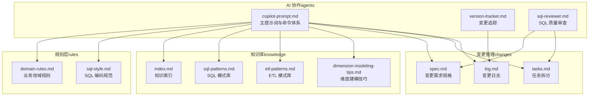
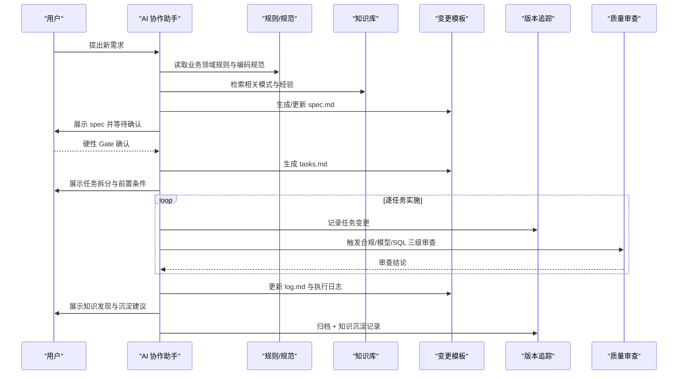
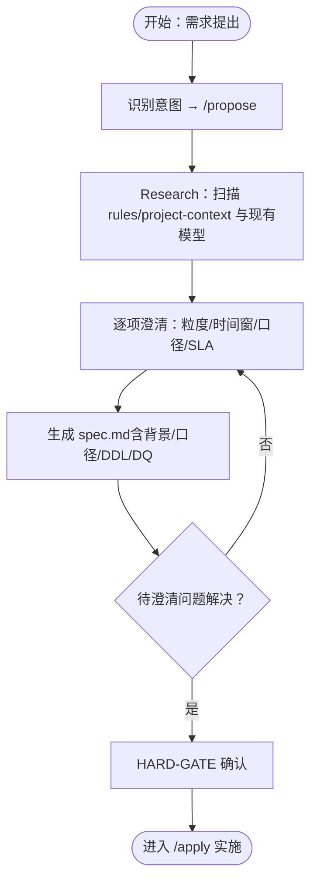
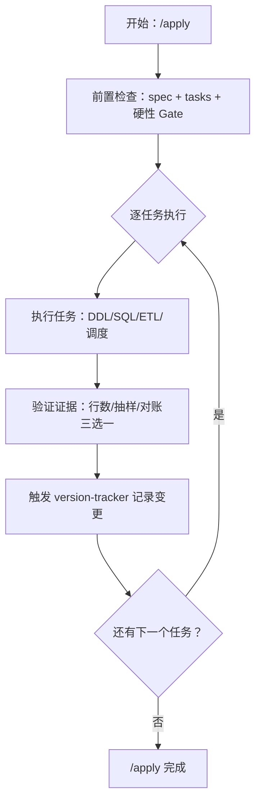
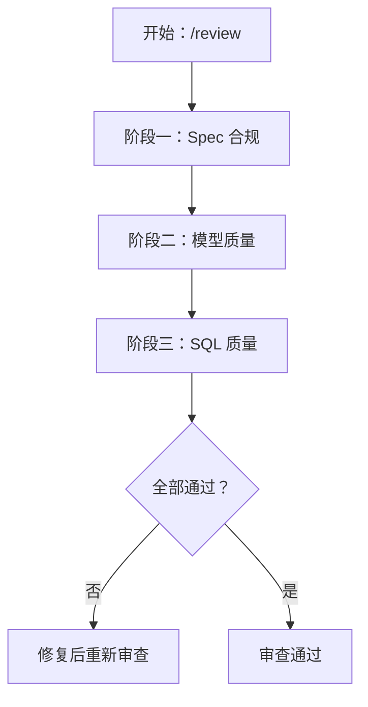
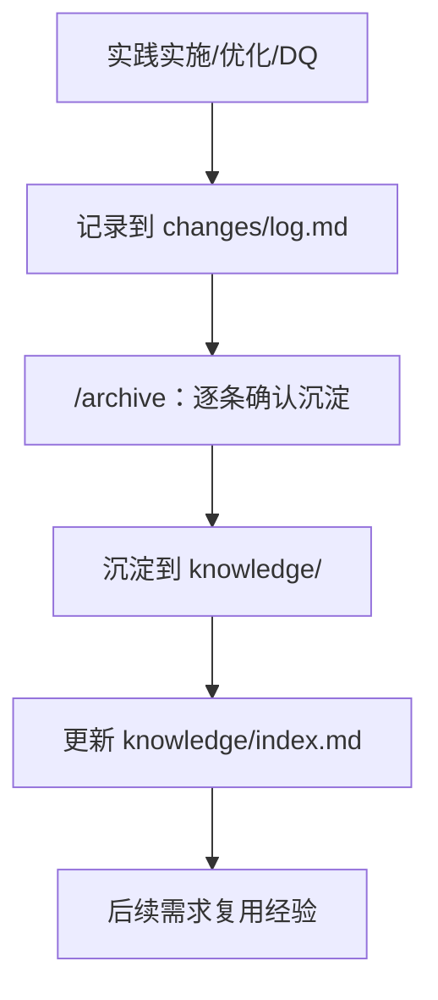
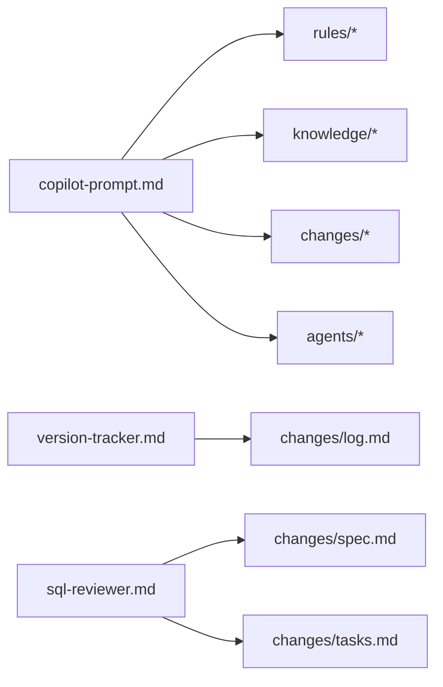

# 新需求开发流程

<cite>
**本文引用的文件**
- [目录结构和设计说明.md](file://目录结构和设计说明.md)
- [copilot-prompt.md](file://agents/copilot-prompt.md)
- [spec.md](file://changes/templates/spec.md)
- [tasks.md](file://changes/templates/tasks.md)
- [log.md](file://changes/templates/log.md)
- [version-tracker.md](file://agents/version-tracker.md)
- [sql-reviewer.md](file://agents/sql-reviewer.md)
- [domain-rules.md](file://rules/domain-rules.md)
- [sql-style.md](file://rules/sql-style.md)
- [index.md](file://knowledge/index.md)
- [sql-patterns.md](file://knowledge/sql-patterns.md)
- [etl-patterns.md](file://knowledge/etl-patterns.md)
- [dimension-modeling-tips.md](file://knowledge/dimension-modeling-tips.md)
</cite>

## 目录
1. [简介](#简介)
2. [项目结构](#项目结构)
3. [核心组件](#核心组件)
4. [架构概览](#架构概览)
5. [详细组件分析](#详细组件分析)
6. [依赖分析](#依赖分析)
7. [性能考虑](#性能考虑)
8. [故障排查指南](#故障排查指南)
9. [结论](#结论)
10. [附录](#附录)

## 简介
本指南面向数据仓库工程团队，围绕“需求提出—Spec 生成—任务拆分—实施—审查—归档”的完整闭环，系统化阐述新需求开发流程。重点包括：
- Spec 驱动开发的核心理念与实践方法
- 需求澄清与 Spec 生成的具体步骤
- 任务拆分与实施的操作方法
- 质量审查与验收的标准流程
- 知识沉淀与复用的最佳实践
- 命令体系与模板文件的使用方法（/propose、/apply、/review、/archive 等）

## 项目结构
项目采用“三段式知识结构”组织：rules（约束）、knowledge（经验）、changes（过程）。围绕该结构，形成“Spec 驱动 + 强制变更追踪”的工程化协作体系。

图表来源
- [目录结构和设计说明.md:19-55](file://目录结构和设计说明.md#L19-L55)
- [copilot-prompt.md:1-147](file://agents/copilot-prompt.md#L1-L147)
- [version-tracker.md:1-120](file://agents/version-tracker.md#L1-L120)

章节来源
- [目录结构和设计说明.md:19-55](file://目录结构和设计说明.md#L19-L55)

## 核心组件
- 主提示词与命令体系：定义 AI 在数仓场景下的身份、法则、回答框架与命令映射，确保流程化协作。
- 规则与规范：提供业务领域规则、SQL 编码规范等强制约束，保障实现质量与一致性。
- 知识库：沉淀 SQL 模式、ETL 模式、维度建模技巧等经验，支撑复用与传承。
- 变更模板：spec、tasks、log 三大模板构成 Spec 驱动流程的关键载体。
- 变更追踪：在每次 DDL/SQL/ETL/调度变更后自动记录结构化日志，确保可审计、可回溯。

章节来源
- [copilot-prompt.md:1-147](file://agents/copilot-prompt.md#L1-L147)
- [version-tracker.md:1-120](file://agents/version-tracker.md#L1-L120)
- [spec.md:1-132](file://changes/templates/spec.md#L1-L132)
- [tasks.md:1-74](file://changes/templates/tasks.md#L1-L74)
- [log.md:1-61](file://changes/templates/log.md#L1-L61)

## 架构概览
下图展示了从需求提出到最终交付的端到端流程，以及各组件之间的交互关系。

图表来源
- [copilot-prompt.md:103-131](file://agents/copilot-prompt.md#L103-L131)
- [version-tracker.md:5-15](file://agents/version-tracker.md#L5-L15)
- [sql-reviewer.md:1-68](file://agents/sql-reviewer.md#L1-L68)

## 详细组件分析

### 需求澄清与 Spec 生成
- 目标：在实施前达成“Spec is Truth”的共识，确保实现与需求一致。
- 关键步骤：
  - 识别意图并映射到命令（/propose）
  - Research：扫描项目上下文与既有模型，明确现状与风险
  - 逐项澄清：粒度、时间窗、是否含退款、SLA 等
  - 生成 spec：包含背景目标、现状分析、功能点、业务规则、模型变更、SQL 设计、ETL/同步、调度、DQ、影响范围、风险与关注点、验证策略、待澄清、技术决策等
  - HARD-GATE：待澄清问题全部解决后方可进入 /apply

图表来源
- [copilot-prompt.md:103-106](file://agents/copilot-prompt.md#L103-L106)
- [spec.md:8-132](file://changes/templates/spec.md#L8-L132)

章节来源
- [copilot-prompt.md:103-106](file://agents/copilot-prompt.md#L103-L106)
- [spec.md:8-132](file://changes/templates/spec.md#L8-L132)

### 任务拆分与实施
- 目标：将 spec 落地为可独立验证的原子任务，按 ODS→DIM→DWD→DWS→ADS→调度→DQ→权限的顺序推进。
- 关键要素：
  - 前置条件：数据源可用、项目上下文更新、上游就绪、资源队列确认等
  - 每个任务精确到库.表.字段/作业名/依赖
  - 关键 DDL/SQL/ETL/调度配置
  - 验收标准与验证方法（行数核验、抽样校验、对账、性能验证）
  - 回刷计划（范围、分批策略、失败处理）

图表来源
- [copilot-prompt.md:107-112](file://agents/copilot-prompt.md#L107-L112)
- [tasks.md:3-74](file://changes/templates/tasks.md#L3-L74)
- [version-tracker.md:5-15](file://agents/version-tracker.md#L5-L15)

章节来源
- [copilot-prompt.md:107-112](file://agents/copilot-prompt.md#L107-L112)
- [tasks.md:3-74](file://changes/templates/tasks.md#L3-L74)

### 质量审查与验收
- 三阶段审查：Spec 合规 → 模型质量 → SQL 质量，不通过不得进入下一阶段。
- 审查要点：
  - 规则一致性：业务口径、金额单位、时间维度、KPI 定义等
  - 模型规范：分层归属、命名规范、维度建模技巧、SCD 策略
  - SQL 质量：分区裁剪、Join 顺序、倾斜风险、重复计算、NULL 处理、头部注释等
- 审查工具：sql-reviewer 提供分级与清单，辅助快速定位问题。

图表来源
- [copilot-prompt.md:113-116](file://agents/copilot-prompt.md#L113-L116)
- [sql-reviewer.md:1-68](file://agents/sql-reviewer.md#L1-L68)

章节来源
- [copilot-prompt.md:113-116](file://agents/copilot-prompt.md#L113-L116)
- [sql-reviewer.md:1-68](file://agents/sql-reviewer.md#L1-L68)

### 知识沉淀与复用
- 知识飞轮：实践 → changes/log.md 知识发现 → /archive 沉淀 → knowledge/ 复用。
- 沉淀内容：SQL 模式、建模技巧、ETL/同步技巧、调度与运维、性能优化、数据质量、安全与权限、业务口径等。
- 复用路径：通过 knowledge/index.md 的关键词索引快速命中相关经验。

图表来源
- [log.md:20-35](file://changes/templates/log.md#L20-L35)
- [copilot-prompt.md:129-131](file://agents/copilot-prompt.md#L129-L131)
- [index.md:1-60](file://knowledge/index.md#L1-L60)

章节来源
- [log.md:20-35](file://changes/templates/log.md#L20-L35)
- [copilot-prompt.md:129-131](file://agents/copilot-prompt.md#L129-L131)
- [index.md:1-60](file://knowledge/index.md#L1-L60)

### 命令体系与模板文件使用
- 命令映射：AI 将用户自然语言映射到 /sql、/etl、/model、/propose、/apply、/review、/optimize、/dq、/schedule、/archive 等命令。
- 模板文件：
  - spec.md：需求规格与设计
  - tasks.md：任务拆分与验收
  - log.md：变更日志与知识沉淀
- 变更追踪：version-tracker 在每次 DDL/SQL/ETL/调度变更后自动记录结构化日志。

章节来源
- [copilot-prompt.md:36-52](file://agents/copilot-prompt.md#L36-L52)
- [spec.md:1-132](file://changes/templates/spec.md#L1-L132)
- [tasks.md:1-74](file://changes/templates/tasks.md#L1-L74)
- [log.md:1-61](file://changes/templates/log.md#L1-L61)
- [version-tracker.md:5-15](file://agents/version-tracker.md#L5-L15)

## 依赖分析
- 组件耦合与协作：
  - copilot-prompt.md 作为中枢，协调 rules、knowledge、changes 与 agents 的使用
  - version-tracker 与 changes/log.md 强耦合，确保每次变更可审计
  - sql-reviewer 依赖 spec 与 tasks 的实现，形成闭环审查
- 外部依赖与集成：
  - 与调度系统、数据源、数据库引擎的对接
  - 与知识库检索与沉淀的集成（/archive）

图表来源
- [copilot-prompt.md:1-147](file://agents/copilot-prompt.md#L1-L147)
- [version-tracker.md:1-120](file://agents/version-tracker.md#L1-L120)
- [sql-reviewer.md:1-68](file://agents/sql-reviewer.md#L1-L68)

章节来源
- [copilot-prompt.md:1-147](file://agents/copilot-prompt.md#L1-L147)
- [version-tracker.md:1-120](file://agents/version-tracker.md#L1-L120)
- [sql-reviewer.md:1-68](file://agents/sql-reviewer.md#L1-L68)

## 性能考虑
- 性能优先原则：大型分区表必须有分区裁剪；优先使用 CTE；小表 Join 大表使用 Map/Broadcast hint；避免 SELECT * 与不必要的 ORDER BY。
- 常见性能陷阱：函数包裹分区字段阻断裁剪、隐式类型转换、重复计算未提取、数据倾斜、小文件过多。
- 优化流程：四层诊断（数据源→抽取→数仓→应用），量化优化前后对比指标（扫描量、耗时、资源、成本）。

章节来源
- [sql-style.md:165-201](file://rules/sql-style.md#L165-L201)
- [sql-reviewer.md:31-43](file://agents/sql-reviewer.md#L31-L43)

## 故障排查指南
- 调试流程：现象收集 → 根因定位 → 方案验证 → 实施修复，禁止在未确认根因前直接修改。
- 诊断层级：数据源层 → 抽取层 → ODS/DWD/DWS/ADS 层 → 应用层，逐层定位问题。
- 常见问题：分区字段函数包裹、Join 笛卡尔积、全表扫描、主键重复、回刷未幂等、跨库引用未声明、PII 未脱敏等。

章节来源
- [copilot-prompt.md:133-146](file://agents/copilot-prompt.md#L133-L146)
- [sql-reviewer.md:7-30](file://agents/sql-reviewer.md#L7-L30)

## 结论
通过“Spec 驱动 + 三段式知识库 + 强制变更追踪”的工程化体系，团队可在复杂数据仓库场景中实现标准化、可审计、可复用的需求管理流程。建议在团队内推广以下最佳实践：
- 所有变更必须先有 spec，再实施
- 任务必须原子化、可验证、可回溯
- 三阶段审查必须严格执行
- 变更日志与知识沉淀必须同步进行
- 严格遵循编码规范与领域规则

## 附录
- 命令速查：
  - /init：初始化项目上下文
  - /sql：SQL 开发
  - /etl：ETL/同步开发
  - /model：数仓建模
  - /propose：创建变更提案
  - /apply：按 spec/tasks 实施
  - /review：三阶段审查
  - /optimize：性能诊断与优化
  - /dq：数据质量校验
  - /schedule：调度配置
  - /archive：归档 + 知识沉淀
- 模板文件路径：
  - changes/spec.md
  - changes/tasks.md
  - changes/log.md

章节来源
- [目录结构和设计说明.md:80-97](file://目录结构和设计说明.md#L80-L97)
- [copilot-prompt.md:63-131](file://agents/copilot-prompt.md#L63-L131)