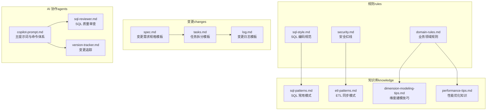
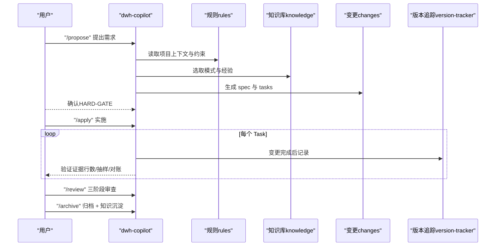
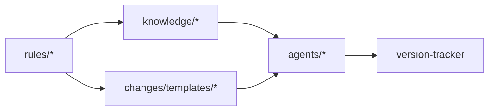

# 日常开发最佳实践

<cite>
**本文引用的文件**
- [目录结构和设计说明.md](file://目录结构和设计说明.md)
- [copilot-prompt.md](file://agents/copilot-prompt.md)
- [sql-reviewer.md](file://agents/sql-reviewer.md)
- [version-tracker.md](file://agents/version-tracker.md)
- [sql-style.md](file://rules/sql-style.md)
- [security.md](file://rules/security.md)
- [domain-rules.md](file://rules/domain-rules.md)
- [dimension-modeling-tips.md](file://knowledge/dimension-modeling-tips.md)
- [etl-patterns.md](file://knowledge/etl-patterns.md)
- [performance-tips.md](file://knowledge/performance-tips.md)
- [sql-patterns.md](file://knowledge/sql-patterns.md)
- [spec.md](file://changes/templates/spec.md)
- [tasks.md](file://changes/templates/tasks.md)
- [log.md](file://changes/templates/log.md)
</cite>

## 目录
1. [简介](#简介)
2. [项目结构](#项目结构)
3. [核心组件](#核心组件)
4. [架构总览](#架构总览)
5. [详细组件分析](#详细组件分析)
6. [依赖分析](#依赖分析)
7. [性能考虑](#性能考虑)
8. [故障排查指南](#故障排查指南)
9. [结论](#结论)
10. [附录](#附录)

## 简介
本最佳实践指南面向日常数据仓库开发，围绕 SQL 开发规范、ETL 同步策略、数据质量保证、安全合规与变更追踪等方面，提供可操作的流程与方法论。项目采用“Spec 驱动 + 三段式知识库 + 强制变更追踪”的工程化协作模式，确保开发过程可审计、可回溯、可复用。

## 项目结构
项目以“规则（rules）+ 知识库（knowledge）+ 变更（changes）+ AI 协作（agents）”四大部分构成，形成“约束—经验—过程—执行”的闭环。

图表来源
- [目录结构和设计说明.md:19-55](file://目录结构和设计说明.md#L19-L55)
- [copilot-prompt.md:23-68](file://agents/copilot-prompt.md#L23-L68)
- [sql-style.md:1-254](file://rules/sql-style.md#L1-L254)
- [security.md:1-98](file://rules/security.md#L1-L98)
- [domain-rules.md:1-142](file://rules/domain-rules.md#L1-L142)
- [sql-patterns.md:1-331](file://knowledge/sql-patterns.md#L1-L331)
- [etl-patterns.md:1-220](file://knowledge/etl-patterns.md#L1-L220)
- [dimension-modeling-tips.md:1-253](file://knowledge/dimension-modeling-tips.md#L1-L253)
- [performance-tips.md:1-349](file://knowledge/performance-tips.md#L1-L349)
- [spec.md:1-132](file://changes/templates/spec.md#L1-L132)
- [tasks.md:1-74](file://changes/templates/tasks.md#L1-L74)
- [log.md:1-61](file://changes/templates/log.md#L1-L61)

章节来源
- [目录结构和设计说明.md:1-204](file://目录结构和设计说明.md#L1-L204)

## 核心组件
- 规则层（rules）：定义强制性规范与约束，包括 SQL 编码规范、安全红线、业务领域规则等，确保开发过程有“底线”。
- 知识库（knowledge）：沉淀 SQL 模式、ETL 同步模式、维度建模技巧、性能优化经验，形成“工具箱”，提升复用效率。
- 变更（changes）：以模板化的方式记录需求、任务、日志与验证，确保每次变更可审计、可回溯。
- AI 协作（agents）：通过命令式协作，驱动从需求到实施再到审查与归档的全流程，保障一致性与质量。

章节来源
- [目录结构和设计说明.md:59-106](file://目录结构和设计说明.md#L59-L106)
- [copilot-prompt.md:63-147](file://agents/copilot-prompt.md#L63-L147)

## 架构总览
整体流程以“Spec 驱动”为核心，贯穿“需求 → 规划 → 实施 → 审查 → 归档”的闭环，配套 AI 协作与变更追踪，确保质量与可追溯性。

图表来源
- [copilot-prompt.md:103-131](file://agents/copilot-prompt.md#L103-L131)
- [version-tracker.md:5-15](file://agents/version-tracker.md#L5-L15)
- [spec.md:1-132](file://changes/templates/spec.md#L1-L132)
- [tasks.md:1-74](file://changes/templates/tasks.md#L1-L74)

章节来源
- [copilot-prompt.md:63-147](file://agents/copilot-prompt.md#L63-L147)
- [目录结构和设计说明.md:126-167](file://目录结构和设计说明.md#L126-L167)

## 详细组件分析

### SQL 开发规范与最佳实践
- 命名约定
  - 库/表/字段统一使用 snake_case，关键字大写，函数小写。
  - 分层命名前缀：ods_/dwd_/dws_/ads_/dim_ 等；粒度后缀：_di/_df/_1d/_zip 等。
  - 分区字段统一 dt（YYYYMMDD），小时分区 dh（YYYYMMDDHH）。
- 代码格式
  - 头部注释强制：用途、依赖、产出、调度、责任人、变更记录。
  - 缩进 4 空格，字段别名对齐，JOIN/ON/AND/OR 换行与行首放置。
- SQL 编写原则
  - 性能优先：分区裁剪、CTE、Map/Broadcast Join、GROUP BY 替代 DISTINCT。
  - 正确性优先：Join 条件包含两侧分区字段、显式处理 NULL、DECIMAL 金额、幂等 INSERT OVERWRITE。
  - 可维护性：复杂 SQL 拆分 CTE、语义化命名、统一表别名、避免超长表达式。
- 禁止事项
  - 禁止 SELECT *、函数包裹分区字段、INSERT INTO 分区表、跨层反向引用、硬编码业务日期、保留调试代码。

章节来源
- [sql-style.md:7-254](file://rules/sql-style.md#L7-L254)

### ETL 同步策略与实施方法
- 同步策略选型
  - 全量抽取：适用于小表、需要一致快照且实现简单。
  - JDBC 增量：适用于一般业务表，基于单调递增字段的批量抽取。
  - CDC：适用于延迟敏感、需要事件流与历史变更追踪的大表。
- 关键约定
  - 位点保护（Checkpoint/Op 字段）、幂等写入（MERGE/UPSERT/INSERT OVERWRITE）、回放能力（Kafka 保留期）。
  - 水位字段单调递增、索引完善、跨天重叠窗口与 ODS 去重。
  - 主键 upsert、乱序保护（update_time > t.update_time）、小文件控制（DISTRIBUTE BY/动态合并）。
- 历史回刷
  - 分批执行、进度跟踪、失败重试与告警、下游通知与“回刷中”标记。

章节来源
- [etl-patterns.md:6-220](file://knowledge/etl-patterns.md#L6-L220)

### 数据质量保证
- 五大维度
  - 完整性（非空率 ≥ 99.9%）、唯一性（COUNT(*) = COUNT(DISTINCT pk)）、一致性（跨系统差异 < 0.1%）、准确性（与业务库直查对账）、时效性（产出时间 ≤ SLA 基线）。
- 严重等级
  - P0 阻断：直接停下游、告警值班、不允许发布数据；P1 告警：24 小时内修复；P2 监控：记录与日报告知。
- 对账与验证
  - 生成可执行的对账 SQL，与基准来源（业务库直查/三方系统/上一版本）对比；验证方法：行数核验、关键指标对比、抽样校验。

章节来源
- [domain-rules.md:69-91](file://rules/domain-rules.md#L69-L91)

### 安全合规检查
- 数据安全
  - 禁止硬编码凭据、禁止在 ADS/视图中直接展示 PII、禁止在测试环境使用真实生产数据、禁止在公共仓库提交密钥/内部数据样本。
- 字段级脱敏
  - 手机号、身份证、邮箱、银行卡、姓名（中文）、地址等按标准脱敏或哈希。
- 行级权限（RLS）
  - 多租户/多组织/多业务线必须配置 RLS，变更需人工审查与验证。
- 数据分级与访问控制
  - L1-L4 分级与访问限制；L3+ 数据导出需二次审批；跨级别合并表按最高级别管控。
- 上线与发布安全
  - 生产 SQL 必须 PR Review；涉及 PII/财务表需双签；DDL 变更需回滚预案；临时探索查询禁止落地生产库。
- 数据回刷安全
  - 明确范围、影响下游、回退方案；对外指标回刷需公告；低峰期执行。
- 业务安全与跨境合规
  - 财务/营收/上市口径需标注精度与披露口径；预测/预算指标需明确时效性；跨境数据传输需符合 GDPR/PIPL，做去标识化与清单审批。
- 安全审计与应急响应
  - L3+ 查询留痕；异常访问告警；发现泄露/错误数据/漏洞立即冻结/下线/修补并启动 RCA。

章节来源
- [security.md:7-98](file://rules/security.md#L7-L98)

### 维度建模与分层规范
- 维度建模技巧
  - 代理键 vs 业务键：双键并存，拉链表/SCD2 必用代理键；SCD 三类型：Type 1（覆盖）、Type 2（拉链）、Type 3（双列对照）。
  - 桥接表：解决多对多或多值维度，注意权重与时间窗口；退化维度：低基数/仅事实表使用的属性直接退化。
  - 一致性维度：跨主题共享，避免重复建设；事实表类型：事务/周期快照/累积快照/无事实事实表。
- 分层归属判定
  - ODS：原始落地（保留源端字段，不加工）；DWD：清洗+维度退化+业务过程；DWS：轻度聚合；ADS：应用层指标；DIM：维度表。

章节来源
- [dimension-modeling-tips.md:5-253](file://knowledge/dimension-modeling-tips.md#L5-L253)

### SQL 模式与常见算法
- 去重保留最新：ROW_NUMBER 按 update_time/op_seq 去重，注意倾斜键与 DISTRIBUTE BY。
- 拉链表（SCD2）：老链关、新链开，end_date/is_current/start_date 三列；写入幂等（INSERT OVERWRITE）。
- 同环比（YoY/MoM）：处理空值/零值，统一口径；与 dim_date 关联更稳健。
- 分组 TopN：ROW_NUMBER/RANK/DENSE_RANK 选择；注意 PARTITION BY 列基数。
- 累计求和：ROWS BETWEEN UNBOUNDED PRECEDING AND CURRENT ROW；跨年/跨月分组。
- 行转列/列转行：行转列 CASE WHEN；列转行注意展开后行数膨胀。
- 数据回刷：INSERT OVERWRITE 单分区幂等覆盖；多分区批量回刷控制并发。
- 增量+全量合并：Lambda 合并，增量优先覆盖昨日全量；注意 schema 一致。
- 缺失日期补齐：LEFT JOIN dim_date 补全；COALESCE 处理空值。
- NULL 安全比较：Spark/Hive 用 <=>，通用写法用 OR (a IS NULL AND b IS NULL)。

章节来源
- [sql-patterns.md:6-331](file://knowledge/sql-patterns.md#L6-L331)

### 性能优化实践
- 分区裁剪：WHERE 直接命中 dt/dh，禁止函数包裹分区字段；验证 EXPLAIN/执行计划。
- 数据倾斜：热点键过滤/单独处理、加盐打散（Salt+二次聚合）、Map Join 小表。
- Map/Broadcast Join：阈值建议（Hive/Spark/Trino）；多 Broadcast Join 注意 driver 内存。
- 小文件问题：输出端控制 reduce 数、AQE 自动合并、周期性合并（Concatenate/Rewrite）。
- CTE 物化：Hive/Spark 默认不物化，复杂 CTE 先落临时表或 CACHE；注意释放。
- 谓词下推与列裁剪：WHERE 下推、SELECT 明列字段；UDF 会使谓词无法下推。
- Join 顺序与类型：Broadcast Hash Join 最快；Sort Merge Join 代价高；Bucket Join 跳过 Shuffle。
- 窗口函数：PARTITION BY 列基数适中；DISTRIBUTE BY + SORT BY 降低二次排序。
- 存储格式与压缩：ORC/Parquet 列存收益显著；ZSTD 压缩率高。
- 调度与资源：资源队列划分、错峰调度、SLA 基线、失败重试与告警。

章节来源
- [performance-tips.md:5-349](file://knowledge/performance-tips.md#L5-L349)

### 变更追踪与审查流程
- 触发时机
  - /sql、/etl、/model、/schedule、/dq 产出新的对账规则或修复数据问题、/apply 每个 Task 完成后、手动记录。
- 变更条目格式
  - 时间、模块、分层、任务、操作、变更内容、关联文件、回刷范围、影响下游、备注。
- 记录规则
  - 原子化、精确引用、任务可追溯、下游必标注、回刷必声明、时间精确到分钟、不阻塞主流程。
- 审查流程
  - 三阶段：Spec 合规 → 模型质量 → SQL 质量；阶段一 PASS 后启动阶段二，阶段二 PASS 后启动阶段三。

章节来源
- [version-tracker.md:5-120](file://agents/version-tracker.md#L5-L120)
- [copilot-prompt.md:113-128](file://agents/copilot-prompt.md#L113-L128)

## 依赖分析
- 组件耦合与协同
  - 规则（rules）为强制约束，指导知识库（knowledge）与变更（changes）的编写方向。
  - 知识库（knowledge）沉淀 SQL/ETL/建模/性能经验，支撑 AI 协作（agents）的命令式执行。
  - 变更（changes）模板串联需求、任务与日志，版本追踪（version-tracker）确保可审计。
- 外部依赖与集成点
  - 调度系统（Azkaban/DolphinScheduler/MC）、存储格式（ORC/Parquet/Iceberg/Hudi）、引擎（Hive/Spark/MaxCompute）。
- 潜在循环依赖
  - 通过“命令式流程”与“模板化文档”避免循环依赖；AI 协作仅读取，不写入外部系统。

图表来源
- [目录结构和设计说明.md:19-55](file://目录结构和设计说明.md#L19-L55)
- [copilot-prompt.md:63-147](file://agents/copilot-prompt.md#L63-L147)
- [version-tracker.md:1-120](file://agents/version-tracker.md#L1-L120)

章节来源
- [目录结构和设计说明.md:19-55](file://目录结构和设计说明.md#L19-L55)

## 性能考虑
- 优化优先级
  - 先分区裁剪，再 Join 顺序与类型，后小文件与存储格式；最后窗口函数与列裁剪。
- 量化对比
  - 扫描量、运行耗时、资源消耗、成本；优化前后对比必须可测量。
- 工具与方法
  - EXPLAIN/执行计划、作业历史、Profile/Stage Metrics、数据采样（倾斜键识别）。

章节来源
- [performance-tips.md:327-349](file://knowledge/performance-tips.md#L327-L349)
- [copilot-prompt.md:117-120](file://agents/copilot-prompt.md#L117-L120)

## 故障排查指南
- 调试流程
  - 现象收集 → 根因定位 → 方案验证 → 实施修复；禁止在未确认根因前直接修改 SQL/DDL/调度。
- 诊断层级
  - 数据源层（结构变更/迟到/重复/事务边界）、抽取层（同步成功/增量单调/binlog 丢失）、ODS/DWD/DWS/ADS/应用层（口径一致性与时效性）。
- 常见问题
  - 未分区裁剪导致全表扫描、JOIN 笛卡尔积/重复膨胀、数据倾斜、小文件过多、CTE 未物化重复计算、WHERE 下推失效、SELECT * 导致列裁剪失效。

章节来源
- [copilot-prompt.md:133-147](file://agents/copilot-prompt.md#L133-L147)
- [sql-reviewer.md:7-68](file://agents/sql-reviewer.md#L7-L68)

## 结论
本最佳实践以“Spec 驱动 + 三段式知识库 + 强制变更追踪”为核心，结合 SQL 编码规范、ETL 同步策略、数据质量与安全合规要求，形成可操作、可审计、可复用的日常开发流程。通过 AI 协作与模板化文档，开发者可在统一框架下高效、高质量地交付数据仓库成果。

## 附录
- 实际应用场景建议
  - 新建主题：先用 /propose 生成 spec 与 tasks，再 /apply 实施，最后 /review 与 /archive。
  - 性能优化：用 /optimize 五层诊断定位根因，给出量化优化建议并沉淀到 knowledge。
  - 数据质量：用 /dq 生成对账规则与验证方法，按严重等级处理并记录到 changes/log。
  - 安全合规：在 /sql 与 /etl 中遵循安全红线，涉及 PII/财务/跨境时额外审批与脱敏。

章节来源
- [目录结构和设计说明.md:126-167](file://目录结构和设计说明.md#L126-L167)
- [copilot-prompt.md:68-147](file://agents/copilot-prompt.md#L68-L147)