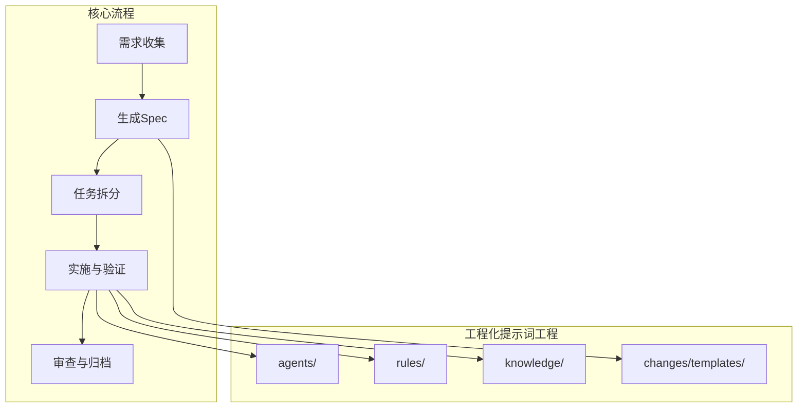
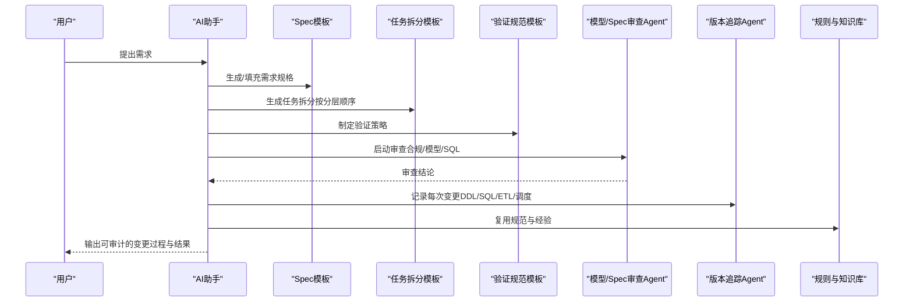
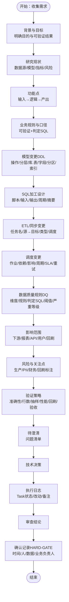
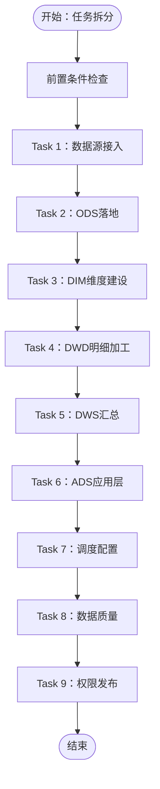
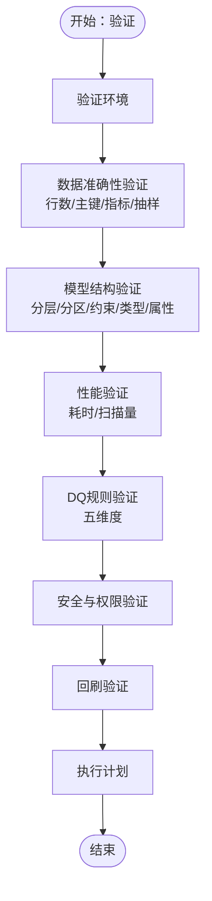
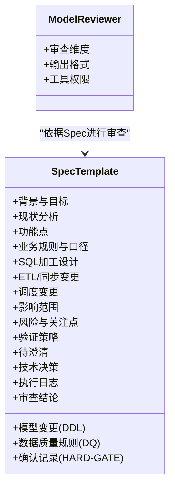
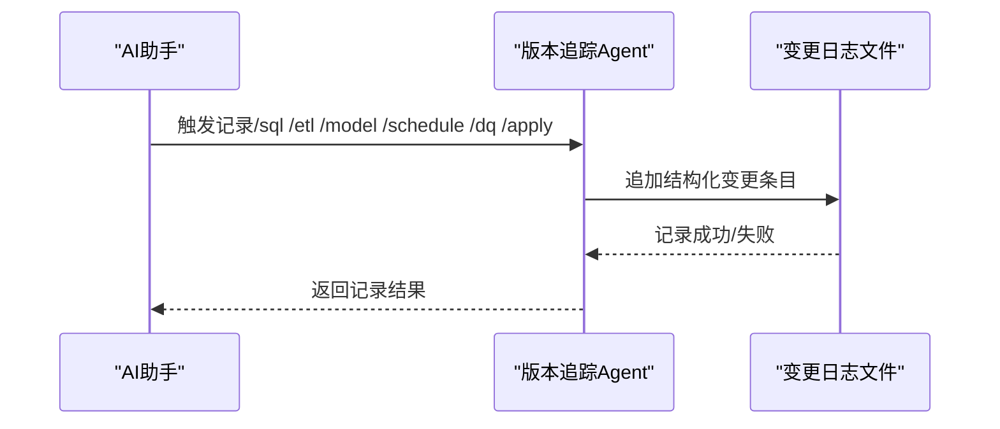
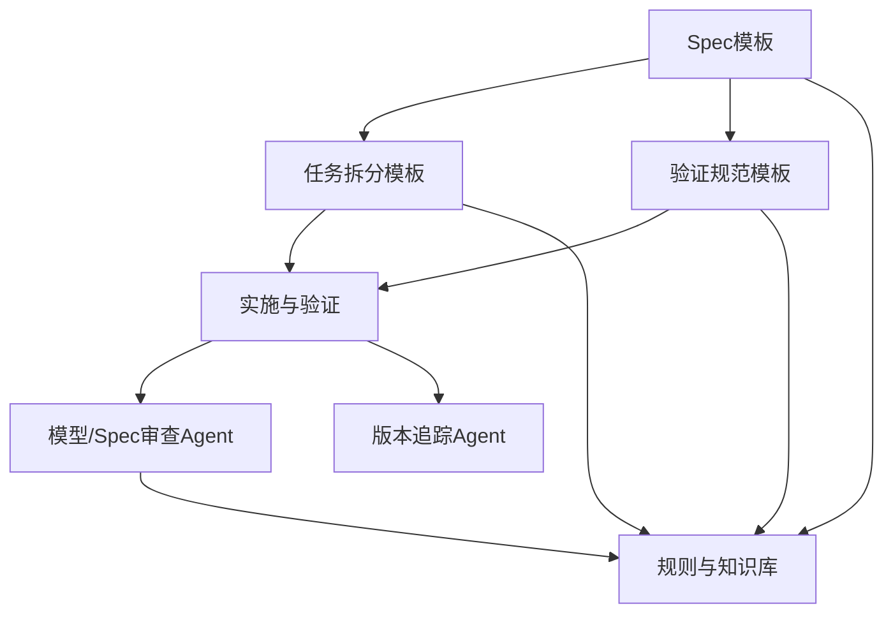

# Spec驱动设计

<cite>
**本文引用的文件**
- [spec.md](file://data_warehouse_engineering_code_copilot/changes/templates/spec.md)
- [tasks.md](file://data_warehouse_engineering_code_copilot/changes/templates/tasks.md)
- [validation-spec.md](file://data_warehouse_engineering_code_copilot/changes/templates/validation-spec.md)
- [目录结构和设计说明.md](file://data_warehouse_engineering_code_copilot/目录结构和设计说明.md)
- [domain-rules.md](file://data_warehouse_engineering_code_copilot/rules/domain-rules.md)
- [data-quality.md](file://data_warehouse_engineering_code_copilot/rules/data-quality.md)
- [model-reviewer.md](file://data_warehouse_engineering_code_copilot/agents/model-reviewer.md)
- [version-tracker.md](file://data_warehouse_engineering_code_copilot/agents/version-tracker.md)
- [index.md](file://data_warehouse_engineering_code_copilot/knowledge/index.md)
</cite>

## 目录
1. [简介](#简介)
2. [项目结构](#项目结构)
3. [核心组件](#核心组件)
4. [架构总览](#架构总览)
5. [详细组件分析](#详细组件分析)
6. [依赖分析](#依赖分析)
7. [性能考量](#性能考量)
8. [故障排查指南](#故障排查指南)
9. [结论](#结论)
10. [附录](#附录)

## 简介
本文件围绕“Spec驱动设计”展开，系统阐述需求规格（Spec）的核心理念、设计原理与落地方法，涵盖需求背景、口径定义、DDL设计、DQ规则等关键要素；详解Spec模板结构与字段含义，说明如何生成高质量的需求规格文档；梳理从需求收集到规格确认的完整工作流程；并提供实际使用示例与最佳实践，包括常见问题的解决方案与注意事项。该体系以“需求 → spec → 任务 → 实施 → 审查 → 归档”的闭环为核心，配合三段式知识库与强制变更追踪，确保数仓工程的可审计、可复用与可持续演进。

## 项目结构
本项目面向数据仓库工程场景，采用“Spec驱动 + 三段式知识库 + 强制变更追踪”的工程化提示词工程组织方式，核心目录与职责如下：
- agents/：AI角色与子Agent提示词，包括主提示词、SQL审查、模型/Spec合规审查、性能诊断、版本追踪等
- changes/templates/：变更管理模板，包括Spec模板、任务拆分模板、验证规范模板、变更日志模板
- knowledge/：数仓领域知识库，包含SQL模式、ETL模式、维度建模技巧、性能优化经验等
- rules/：项目约束与规范，包括项目上下文、SQL风格、建模分层、调度运维、数据质量、安全、业务领域规则等

图表来源
- [目录结构和设计说明.md: 21-55:21-55](file://data_warehouse_engineering_code_copilot/目录结构和设计说明.md#L21-L55)
- [目录结构和设计说明.md: 126-151:126-151](file://data_warehouse_engineering_code_copilot/目录结构和设计说明.md#L126-L151)

章节来源
- [目录结构和设计说明.md: 19-55:19-55](file://data_warehouse_engineering_code_copilot/目录结构和设计说明.md#L19-L55)

## 核心组件
- 规格模板（Spec）：统一的变更需求文档模板，覆盖背景目标、现状分析、功能点、业务规则与口径、模型变更（DDL）、SQL加工设计、ETL/同步变更、调度变更、数据质量规则、影响范围、风险与关注点、验证策略、待澄清、技术决策、执行日志、审查结论、确认记录等
- 任务拆分模板（Tasks）：按数仓分层顺序（ODS→DIM→DWD→DWS→ADS）拆解原子任务，明确目标、分层、涉及变更、关键DDL/SQL、依赖、验收标准、验证方法、回刷计划等
- 验证规范模板（Validation-Spec）：定义验证原则、验证环境、数据准确性验证、模型结构验证、性能验证、DQ规则验证、安全与权限验证、回刷验证与执行计划
- 模型合规审查Agent：独立审查模型是否符合Spec与建模最佳实践，输出结构化验证结论
- 版本追踪Agent：在每次DDL/SQL/ETL/调度变更后自动记录结构化变更条目，确保可审计、可回溯
- 规则与知识库：业务领域规则、数据质量规范、SQL/ETL/建模/性能/安全等规范与经验沉淀

章节来源
- [spec.md: 1-132:1-132](file://data_warehouse_engineering_code_copilot/changes/templates/spec.md#L1-L132)
- [tasks.md: 1-74:1-74](file://data_warehouse_engineering_code_copilot/changes/templates/tasks.md#L1-L74)
- [validation-spec.md: 1-123:1-123](file://data_warehouse_engineering_code_copilot/changes/templates/validation-spec.md#L1-L123)
- [model-reviewer.md: 1-50:1-50](file://data_warehouse_engineering_code_copilot/agents/model-reviewer.md#L1-L50)
- [version-tracker.md: 1-120:1-120](file://data_warehouse_engineering_code_copilot/agents/version-tracker.md#L1-L120)

## 架构总览
Spec驱动设计的系统架构以“需求 → 规格 → 任务 → 实施 → 审查 → 归档”为主线，结合三段式知识库与强制变更追踪，形成可审计、可复用、可持续演进的工程闭环。

图表来源
- [目录结构和设计说明.md: 126-151:126-151](file://data_warehouse_engineering_code_copilot/目录结构和设计说明.md#L126-L151)
- [目录结构和设计说明.md: 80-96:80-96](file://data_warehouse_engineering_code_copilot/目录结构和设计说明.md#L80-L96)
- [model-reviewer.md: 1-50:1-50](file://data_warehouse_engineering_code_copilot/agents/model-reviewer.md#L1-L50)
- [version-tracker.md: 5-16:5-16](file://data_warehouse_engineering_code_copilot/agents/version-tracker.md#L5-L16)

## 详细组件分析

### 组件A：Spec模板（需求规格）
- 目标与背景：明确“为什么做”以及“做完后的效果”，可验证结果需指明表、指标、粒度、SLA
- 现状分析：数据源与数据流、现有模型结构、现有指标/口径、发现与风险
- 功能点：输入→计算逻辑→产出表/分区的清晰描述
- 业务规则与口径：每条规则必须可验证，必须提供判定SQL片段
- 模型变更（DDL）：操作类型、分层、库.表、字段/分区/索引、说明；关键DDL以伪代码或完整形式呈现
- SQL加工设计：脚本、输入表、输出表、调度周期、关键逻辑摘要
- ETL/同步变更：任务名、源→目标、同步类型、调度、说明
- 调度变更：作业名、类型、上游依赖、下游影响、调度周期、SLA/基线、重试
- 数据质量规则（DQ）：维度、规则、判定SQL、阈值、严重等级
- 影响范围：下游表、报表/API、用户/角色、是否涉及历史回刷
- 风险与关注点：涉及生产数据/PII/财务/历史回刷必须标注
- 验证策略：数据准确性验证、行数核验、抽样校验、性能验证、回刷验证、用户验收
- 待澄清：问题清单，全部解决后才能进入/apply
- 技术决策：记录关键设计决策
- 执行日志：Task状态、实际改动、备注
- 审查结论与确认记录（HARD-GATE）：确认时间、确认人、数据负责人、业务负责人

图表来源
- [spec.md: 8-132:8-132](file://data_warehouse_engineering_code_copilot/changes/templates/spec.md#L8-L132)

章节来源
- [spec.md: 8-132:8-132](file://data_warehouse_engineering_code_copilot/changes/templates/spec.md#L8-L132)

### 组件B：任务拆分模板（按分层顺序）
- 拆分顺序：数据源接入 → ODS落地 → DIM维度建设 → DWD明细加工 → DWS汇总 → ADS应用层 → 调度配置 → 数据质量 → 权限发布
- 每个任务为可独立验证的原子变更，精确到库.表.字段/作业名/调度依赖
- 前置条件：数据源连接、项目上下文、上游表、调度资源等
- 任务内容：目标、分层、涉及变更（DDL/SQL/ETL/调度）、关键DDL/SQL、依赖、验收标准、验证方法、回刷计划

图表来源
- [tasks.md: 3-74:3-74](file://data_warehouse_engineering_code_copilot/changes/templates/tasks.md#L3-L74)

章节来源
- [tasks.md: 3-74:3-74](file://data_warehouse_engineering_code_copilot/changes/templates/tasks.md#L3-L74)

### 组件C：验证规范模板（Validation-Spec）
- 验证原则：数据驱动、三选一铁律（行数核验/抽样对比/对账SQL）、对比验证、边界测试、回刷可重入
- 验证环境：数据源环境、集群、数据量级、时间范围、基准值来源
- 数据准确性验证：行数核验、主键/唯一性核验、P0/P1/P2指标验证、字段级抽样
- 模型结构验证：分层正确性、分区字段/范围、主键/唯一约束、字段类型最小化、分桶/索引策略、表属性、无循环依赖
- 性能验证：全量首跑、单分区增量、历史回刷的耗时与扫描量
- DQ规则验证：完整性/唯一性/一致性/准确性/时效性
- 安全与权限验证：表权限、PII脱敏、行级权限
- 回刷验证：批次、分区范围、期望/实际行数、关键指标对账
- 执行计划：从准备基准数据到汇总验证报告与归档的步骤清单

图表来源
- [validation-spec.md: 6-123:6-123](file://data_warehouse_engineering_code_copilot/changes/templates/validation-spec.md#L6-L123)

章节来源
- [validation-spec.md: 6-123:6-123](file://data_warehouse_engineering_code_copilot/changes/templates/validation-spec.md#L6-L123)

### 组件D：模型/Spec合规审查Agent
- 审查维度：缺失实现、多余实现、理解偏差、业务规则落地、分层合规、建模合规、物理设计合规、数据变更准确性
- 输出格式：模型结构验证、字段/约束逐条验证、分层合规、结论（合规/不合规）
- 工具权限：只读，不需要写入权限

图表来源
- [model-reviewer.md: 1-50:1-50](file://data_warehouse_engineering_code_copilot/agents/model-reviewer.md#L1-L50)
- [spec.md: 8-132:8-132](file://data_warehouse_engineering_code_copilot/changes/templates/spec.md#L8-L132)

章节来源
- [model-reviewer.md: 1-50:1-50](file://data_warehouse_engineering_code_copilot/agents/model-reviewer.md#L1-L50)

### 组件E：版本追踪Agent
- 触发时机：/sql、/etl、/model、/schedule、/dq、/apply每个Task完成后、用户手动要求记录
- 记录格式：时间、模块、分层、任务、操作、变更内容、关联文件、回刷范围、影响下游、备注
- 记录规则：原子化、精确引用、任务可追溯、下游必标注、回刷必声明、时间精确到分钟、不阻塞主流程
- 输出示例：包含模块、分层、任务、操作、变更内容、关联文件、回刷范围、影响下游、备注等字段

图表来源
- [version-tracker.md: 5-16:5-16](file://data_warehouse_engineering_code_copilot/agents/version-tracker.md#L5-L16)
- [version-tracker.md: 44-64:44-64](file://data_warehouse_engineering_code_copilot/agents/version-tracker.md#L44-L64)
- [version-tracker.md: 80-89:80-89](file://data_warehouse_engineering_code_copilot/agents/version-tracker.md#L80-L89)

章节来源
- [version-tracker.md: 5-16:5-16](file://data_warehouse_engineering_code_copilot/agents/version-tracker.md#L5-L16)
- [version-tracker.md: 44-64:44-64](file://data_warehouse_engineering_code_copilot/agents/version-tracker.md#L44-L64)
- [version-tracker.md: 80-89:80-89](file://data_warehouse_engineering_code_copilot/agents/version-tracker.md#L80-L89)

### 组件F：规则与知识库
- 业务领域规则：金额精度、百分比格式、同比/环比、排名、排序键、状态颜色、KPI定义标准、跨系统一致性、历史数据约定、行业特定规则、项目特定规则
- 数据质量规范：五维度（完整性/唯一性/一致性/准确性/时效性）、规则强制要求、规则模板、严重等级、上线流程、规则文件结构、历史趋势、反模式、与业务方SLA
- 知识索引：SQL模式库、ETL模式库、维度建模技巧、性能优化技巧、业务知识、技术约定、踩坑记录

章节来源
- [domain-rules.md: 6-142:6-142](file://data_warehouse_engineering_code_copilot/rules/domain-rules.md#L6-L142)
- [data-quality.md: 5-195:5-195](file://data_warehouse_engineering_code_copilot/rules/data-quality.md#L5-L195)
- [index.md: 1-60:1-60](file://data_warehouse_engineering_code_copilot/knowledge/index.md#L1-L60)

## 依赖分析
- 组件耦合与内聚
  - Spec模板与任务拆分模板强耦合：任务拆分必须严格对应Spec中的模型变更、SQL加工、ETL/同步、调度与DQ
  - 验证规范模板与Spec模板强耦合：验证策略必须覆盖Spec中定义的所有变更点
  - 模型/Spec审查Agent与Spec模板强耦合：审查结论基于Spec逐项核对
  - 版本追踪Agent与各模板弱耦合：通过标准化记录格式串联所有变更
- 直接与间接依赖
  - 规则与知识库为间接依赖，贯穿需求收集、Spec生成、任务拆分、实施与验证全过程
- 外部依赖与集成点
  - 调度系统（上游依赖/SLA/重试）、数据质量平台（DQ规则与阈值）、权限与安全系统（PII脱敏/行级权限）
- 接口契约与实现细节
  - 规则文件（rules/）提供业务与技术约束；知识库（knowledge/）提供经验复用；模板（changes/templates/）提供过程记录

图表来源
- [目录结构和设计说明.md: 31-36:31-36](file://data_warehouse_engineering_code_copilot/目录结构和设计说明.md#L31-L36)
- [目录结构和设计说明.md: 45-52:45-52](file://data_warehouse_engineering_code_copilot/目录结构和设计说明.md#L45-L52)

章节来源
- [目录结构和设计说明.md: 31-36:31-36](file://data_warehouse_engineering_code_copilot/目录结构和设计说明.md#L31-L36)
- [目录结构和设计说明.md: 45-52:45-52](file://data_warehouse_engineering_code_copilot/目录结构和设计说明.md#L45-L52)

## 性能考量
- 分区裁剪：WHERE条件直接命中分区字段，禁止函数包裹
- 数据倾斜：高频空值/默认值加盐打散或拆分SQL
- Map Join：小表广播加速
- 广播阈值：各引擎默认阈值与调参与性能优化
- 小文件合并：输出端控制并发与文件大小
- CTE物化：各引擎对WITH的物化策略差异
- 性能验证：在验证规范中量化耗时、扫描量、成本，确保上线前达到SLA基线

章节来源
- [index.md: 42-47:42-47](file://data_warehouse_engineering_code_copilot/knowledge/index.md#L42-L47)
- [validation-spec.md: 80-87:80-87](file://data_warehouse_engineering_code_copilot/changes/templates/validation-spec.md#L80-L87)

## 故障排查指南
- DQ规则上线流程
  - 设计：在Spec的“数据质量规则（DQ）”中列明
  - 实现：与作业SQL一同提交，统一存放dq/<schema>/<table>.sql
  - 测试：在测试环境跑7天确认阈值合理
  - 上线：DQ与作业同步上线，启用告警
  - 运营：周度review DQ通过率，调整阈值
- 常见反模式
  - 仅在出问题后才补DQ
  - 规则只有“通过/失败”二值
  - DQ规则与业务变化不同步
  - DQ失败但下游继续运行
  - DQ规则集中在超大文件
- 版本追踪记录失败
  - 路径无效时提示用户但不中断当前操作
  - 请补填具体时间占位符，由人工后续补全

章节来源
- [data-quality.md: 115-122:115-122](file://data_warehouse_engineering_code_copilot/rules/data-quality.md#L115-L122)
- [data-quality.md: 183-189:183-189](file://data_warehouse_engineering_code_copilot/rules/data-quality.md#L183-L189)
- [version-tracker.md: 87-89:87-89](file://data_warehouse_engineering_code_copilot/agents/version-tracker.md#L87-L89)

## 结论
Spec驱动设计通过统一的模板、严格的任务拆分、可验证的审查与归档机制，构建了从需求到上线的完整闭环。它强调“需求文档（Spec）是昂贵的核心资产”，并通过三段式知识库与强制变更追踪，确保每次变更可审计、可复用、可回溯。在实际应用中，务必遵循“No Spec, No Change”“Spec is Truth”“Reverse Sync”“变更即记录”的四条铁律，结合业务领域规则与数据质量规范，持续沉淀经验，提升数仓工程的稳定性与效率。

## 附录
- 使用示例与最佳实践
  - 需求收集：明确背景与目标，可验证结果（表/指标/粒度/SLA）
  - 规格生成：逐项填写现状分析、功能点、业务规则与口径、DDL、SQL设计、ETL/同步、调度、DQ、影响范围、风险与关注点、验证策略、待澄清、技术决策、执行日志、审查结论、确认记录
  - 任务拆分：按ODS→DIM→DWD→DWS→ADS顺序拆解，每个任务精确到库.表.字段/作业名/调度依赖
  - 实施与验证：遵循验证规范模板，三选一证据（行数核验/抽样对比/对账SQL），边界测试与回刷可重入
  - 审查与归档：模型/Spec审查Agent独立审查，版本追踪Agent自动记录，最终归档沉淀
- 注意事项
  - 涉及生产数据/PII/财务/历史回刷必须标注
  - DQ规则必须与业务变化同步评审
  - 严格遵循分层依赖与建模规范
  - 性能验证必须量化对比，确保SLA达标

章节来源
- [目录结构和设计说明.md: 61-69:61-69](file://data_warehouse_engineering_code_copilot/目录结构和设计说明.md#L61-L69)
- [目录结构和设计说明.md: 126-151:126-151](file://data_warehouse_engineering_code_copilot/目录结构和设计说明.md#L126-L151)
- [spec.md: 102-111:102-111](file://data_warehouse_engineering_code_copilot/changes/templates/spec.md#L102-L111)
- [validation-spec.md: 8-13:8-13](file://data_warehouse_engineering_code_copilot/changes/templates/validation-spec.md#L8-L13)