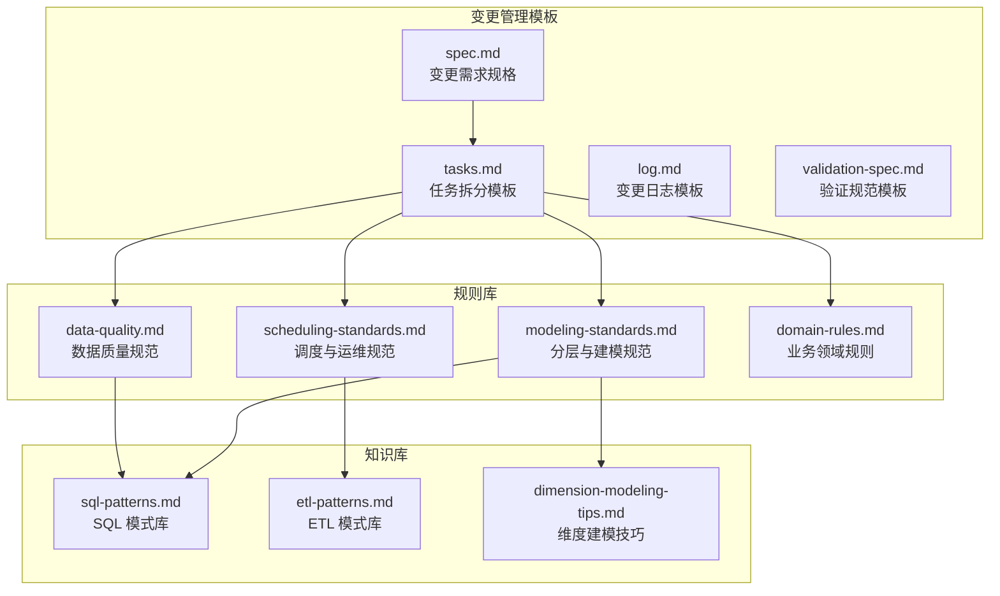
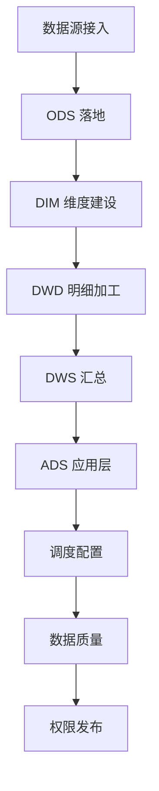
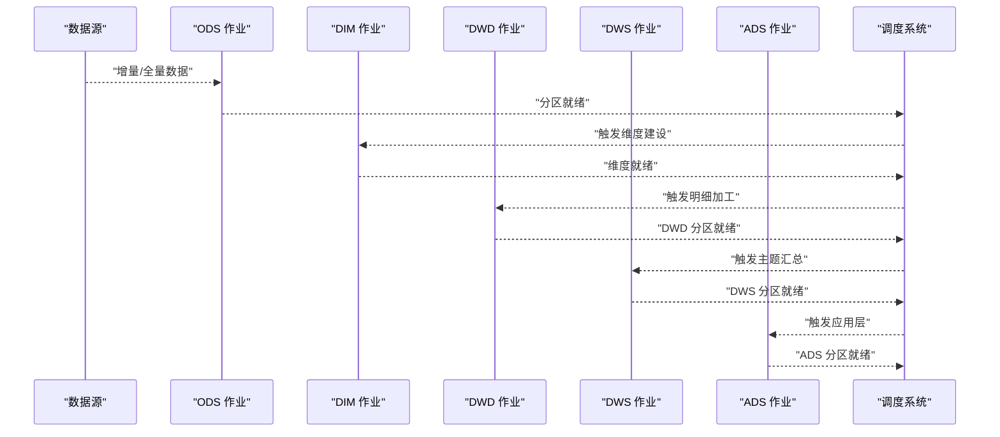
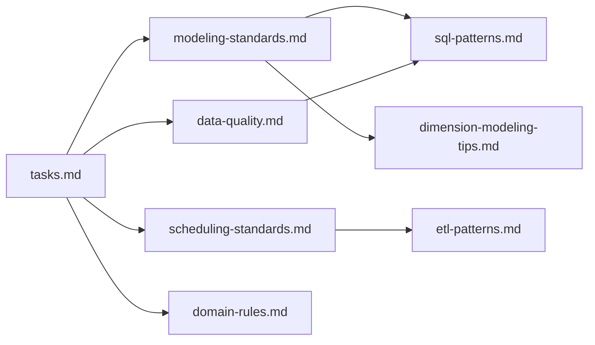

# 任务拆分模板

<cite>
**本文引用的文件列表**
- [目录结构和设计说明.md](file://目录结构和设计说明.md)
- [tasks.md](file://changes/templates/tasks.md)
- [spec.md](file://changes/templates/spec.md)
- [modeling-standards.md](file://rules/modeling-standards.md)
- [scheduling-standards.md](file://rules/scheduling-standards.md)
- [data-quality.md](file://rules/data-quality.md)
- [domain-rules.md](file://rules/domain-rules.md)
- [etl-patterns.md](file://knowledge/etl-patterns.md)
- [sql-patterns.md](file://knowledge/sql-patterns.md)
- [dimension-modeling-tips.md](file://knowledge/dimension-modeling-tips.md)
</cite>

## 目录
1. [简介](#简介)
2. [项目结构](#项目结构)
3. [核心组件](#核心组件)
4. [架构总览](#架构总览)
5. [详细组件分析](#详细组件分析)
6. [依赖分析](#依赖分析)
7. [性能考量](#性能考量)
8. [故障排查指南](#故障排查指南)
9. [结论](#结论)
10. [附录](#附录)

## 简介
本文件围绕“任务拆分模板”（tasks.md）展开，系统阐述变更需求规格如何被拆解为可执行、可验证、可并行的任务，以及在数仓分层架构（ODS、DWD、DWS、ADS、DIM）下的任务分配原则与执行顺序。文档还提供任务拆分示例、依赖关系与并行执行可能性分析，并解释任务拆分对项目管理与质量控制的重要意义。

## 项目结构
任务拆分模板位于变更管理模板目录，与需求规格（spec.md）、知识库（SQL/ETL/建模技巧）、规则库（分层、调度、数据质量、领域规则）共同构成“Spec 驱动”的工程化协作体系。

图表来源
- [目录结构和设计说明.md:19-55](file://目录结构和设计说明.md#L19-L55)
- [tasks.md:1-74](file://changes/templates/tasks.md#L1-L74)
- [spec.md:1-132](file://changes/templates/spec.md#L1-132)
- [modeling-standards.md:1-242](file://rules/modeling-standards.md#L1-L242)
- [scheduling-standards.md:1-233](file://rules/scheduling-standards.md#L1-L233)
- [data-quality.md:1-195](file://rules/data-quality.md#L1-L195)
- [domain-rules.md:1-142](file://rules/domain-rules.md#L1-L142)
- [etl-patterns.md:1-220](file://knowledge/etl-patterns.md#L1-L220)
- [sql-patterns.md:1-331](file://knowledge/sql-patterns.md#L1-L331)
- [dimension-modeling-tips.md:1-253](file://knowledge/dimension-modeling-tips.md#L1-L253)

章节来源
- [目录结构和设计说明.md:19-55](file://目录结构和设计说明.md#L19-L55)

## 核心组件
- 任务拆分模板（tasks.md）：定义任务拆分顺序、任务字段、验收标准、验证方法、回刷计划等，确保每个任务可独立验证且精确到库.表.字段/作业名/调度依赖。
- 变更需求规格（spec.md）：提供背景、现状、功能点、业务规则、模型变更、SQL 设计、ETL/同步、调度、DQ、影响范围、风险与关注点、验证策略等，是任务拆分的输入。
- 分层与建模规范（modeling-standards.md）：明确各层职责、命名规范、事实/维度表设计、关系与关联约定、禁止事项等，指导任务归属与实现。
- 调度与运维规范（scheduling-standards.md）：定义作业命名、依赖关系、调度周期、SLA、重试与告警、资源队列、脚本规范、上线流程等，保障任务执行与可观测性。
- 数据质量规范（data-quality.md）：定义五维度规则、严重等级、规则上线流程、规则文件结构、历史趋势等，确保任务交付质量。
- 业务领域规则（domain-rules.md）：提供金额/百分比/时间/排名/状态颜色等业务口径与跨系统一致性要求，约束任务实现细节。
- 知识库（sql-patterns.md、etl-patterns.md、dimension-modeling-tips.md）：提供去重、拉链、同环比、TopN、历史回刷、CDC/JDBC/UPSERT、维度建模等可复用模式，支撑任务设计与验证。

章节来源
- [tasks.md:1-74](file://changes/templates/tasks.md#L1-L74)
- [spec.md:1-132](file://changes/templates/spec.md#L1-132)
- [modeling-standards.md:1-242](file://rules/modeling-standards.md#L1-L242)
- [scheduling-standards.md:1-233](file://rules/scheduling-standards.md#L1-L233)
- [data-quality.md:1-195](file://rules/data-quality.md#L1-L195)
- [domain-rules.md:1-142](file://rules/domain-rules.md#L1-L142)
- [sql-patterns.md:1-331](file://knowledge/sql-patterns.md#L1-L331)
- [etl-patterns.md:1-220](file://knowledge/etl-patterns.md#L1-L220)
- [dimension-modeling-tips.md:1-253](file://knowledge/dimension-modeling-tips.md#L1-L253)

## 架构总览
任务拆分遵循“分层顺序”：数据源接入 → ODS 落地 → DIM 维度建设 → DWD 明细加工 → DWS 汇总 → ADS 应用层 → 调度配置 → 数据质量 → 权限发布。该顺序体现了“自下而上”的工程化路径，确保每层职责清晰、依赖明确、可验证、可并行。

图表来源
- [tasks.md:3-3](file://changes/templates/tasks.md#L3-L3)

章节来源
- [tasks.md:3-3](file://changes/templates/tasks.md#L3-L3)

## 详细组件分析

### 任务拆分模板字段与生成规则
- 拆分顺序与原子性：任务必须是“可独立验证的原子变更”，精确到库.表.字段/作业名/调度依赖，避免跨层跳跃与循环依赖。
- 前置条件：数据源连接、项目上下文、上游表、调度资源队列、其他依赖/配置前提。
- 任务结构：
  - 目标：一句话描述
  - 分层：ODS / DWD / DWS / ADS / DIM
  - 涉及变更：DDL、SQL、ETL、调度
  - 关键 DDL/SQL：提供关键脚本片段
  - 依赖：无 / Task N
  - 验收标准：具体数值或可观测行为
  - 验证方法：行数核验、关键字段非空率、主键唯一性、与基准来源对账差异、单作业耗时
  - 回刷计划：范围、分批策略、失败处理
- 变更摘要：统计新建/修改表数、脚本数、调度作业数、DQ 规则数、历史回刷分区数、Spec-Plan 偏差记录、性能影响评估、上线后观察期与回退方案、遗留问题。

章节来源
- [tasks.md:7-74](file://changes/templates/tasks.md#L7-L74)

### 数仓分层下的任务分配逻辑
- ODS（贴源层）
  - 任务类型：数据源接入、CDC/JDBC 增量/全量同步、幂等覆盖、小文件控制、历史回刷。
  - 任务特征：保留源端字段，不做业务加工；强调幂等与回放能力。
- DIM（维度层）
  - 任务类型：一致性维度建设、SCD（Type1/2/3）、桥接表、退化维度、维度表物理化。
  - 任务特征：代理键+业务键双键并存；拉链表需带时间窗口；跨主题复用。
- DWD（明细层）
  - 任务类型：业务过程切分、清洗、维度退化、关联维度、分区裁剪、去重保留最新。
  - 任务特征：事实表只保留外键、退化维度与度量值；事务事实表与累积快照严格区分。
- DWS（汇总层）
  - 任务类型：主题域轻度聚合、同环比、TopN、累计求和、行转列/列转行。
  - 任务特征：可加和指标；避免在 DWD/DWS 层做业务口径加工。
- ADS（应用层）
  - 任务类型：指标+业务口径、报表/仪表盘、API 输出。
  - 任务特征：直接服务报表/API；避免跨层反向读取。
- 中间表（mid_/tmp_）
  - 任务类型：探索/中间过渡；生命周期短（7-30 天）。

章节来源
- [modeling-standards.md:7-46](file://rules/modeling-standards.md#L7-L46)
- [modeling-standards.md:49-69](file://rules/modeling-standards.md#L49-L69)
- [modeling-standards.md:73-87](file://rules/modeling-standards.md#L73-L87)
- [modeling-standards.md:118-142](file://rules/modeling-standards.md#L118-L142)
- [modeling-standards.md:151-167](file://rules/modeling-standards.md#L151-L167)
- [modeling-standards.md:171-193](file://rules/modeling-standards.md#L171-L193)
- [dimension-modeling-tips.md:233-253](file://knowledge/dimension-modeling-tips.md#L233-L253)

### 任务拆分示例与执行顺序
示例场景：新增“销售域月度看板表（按门店×商品类目）”
- 步骤 1：数据源接入（ODS）
  - 任务：接入订单/支付源表，CDC/JDBC 增量同步，幂等覆盖，小文件控制。
  - 依赖：上游业务库连接、账号/网络、调度资源队列。
  - 验收：当日分区就绪、行数核验、关键字段非空率达标。
- 步骤 2：维度建设（DIM）
  - 任务：dim_shop、dim_sku、dim_date 等一致性维度就绪；若需 SCD2，准备拉链表。
  - 依赖：ODS 增量就绪。
  - 验收：维度可关联率≥99.9%，拉链表无重叠。
- 步骤 3：明细加工（DWD）
  - 任务：dwd_trade_order_di 明细事实表，清洗、维度退化、分区裁剪。
  - 依赖：ODS、DIM。
  - 验收：主键唯一、金额/数量合理、分区就绪。
- 步骤 4：主题汇总（DWS）
  - 任务：dws_shop_sku_monthly 轻度聚合，按门店×类目维度汇总。
  - 依赖：DWD、DIM。
  - 验收：行数核验、与基准来源对账差异<0.5%。
- 步骤 5：应用层（ADS）
  - 任务：ads_sales_dashboard_monthly 指标表，服务看板/报表。
  - 依赖：DWS。
  - 验收：指标口径一致、SLA 达标。
- 步骤 6：调度配置
  - 任务：配置作业命名、强依赖、SLA、重试与告警、资源队列。
  - 依赖：上一步输出表。
  - 验收：作业成功率达到 99%+，P95 时长达标。
- 步骤 7：数据质量
  - 任务：上线 DQ 规则（完整性/唯一性/一致性/准确性/时效性），启用告警。
  - 依赖：上一步作业。
  - 验收：DQ 通过率≥99.5%，P0/P1 规则阻断/告警。
- 步骤 8：权限发布
  - 任务：按角色授权、行级权限（如 RLS）、PII 脱敏。
  - 依赖：上一步数据质量通过。
  - 验收：权限清单与审批记录齐全。

章节来源
- [tasks.md:15-58](file://changes/templates/tasks.md#L15-L58)
- [scheduling-standards.md:29-57](file://rules/scheduling-standards.md#L29-L57)
- [data-quality.md:9-34](file://rules/data-quality.md#L9-L34)

### 任务依赖关系与并行执行可能性
- 依赖关系
  - 强依赖：上游表当日分区就绪后才触发下游（传感器/检查任务）。
  - 弱依赖：仅在上游存在新数据时启动（事件驱动型作业）。
  - 禁止跨层反向与跳跃：DWD 不能读 DWS/ADS；ADS 不能直接读 ODS。
- 并行执行
  - 同一层内可并行：多个事实表/维度表的加工任务可并行，只要不互相依赖。
  - 跨层并行：DWD/DIM 可并行推进，但需满足“先 DIM 后 DWD”的约束。
  - 调度错峰：按层错峰，DWD 基线早于 DWS，DWS 基线早于 ADS，预留缓冲。

图表来源
- [scheduling-standards.md:29-57](file://rules/scheduling-standards.md#L29-L57)
- [modeling-standards.md:163-167](file://rules/modeling-standards.md#L163-L167)

章节来源
- [scheduling-standards.md:29-57](file://rules/scheduling-standards.md#L29-L57)
- [modeling-standards.md:163-167](file://rules/modeling-standards.md#L163-L167)

### 任务拆分对项目管理与质量控制的意义
- 项目管理
  - 明确拆分顺序与原子任务，降低变更风险与回溯成本。
  - 严格的前置条件与验收标准，减少“脏变更”进入生产。
  - 任务与作业一一对应，便于资源规划与 SLA 对齐。
- 质量控制
  - 每层任务都有明确的 DDL/SQL/ETL/调度/回刷计划，确保可验证与可审计。
  - DQ 五维度与严重等级贯穿全流程，P0 阻断机制保障数据质量底线。
  - 变更日志与版本追踪，形成可审计的变更路径。

章节来源
- [tasks.md:3-6](file://changes/templates/tasks.md#L3-L6)
- [data-quality.md:9-18](file://rules/data-quality.md#L9-L18)
- [目录结构和设计说明.md:98-106](file://目录结构和设计说明.md#L98-L106)

## 依赖分析
任务拆分模板与规则库、知识库之间存在强耦合关系：任务实现必须遵循分层规范、调度规范、数据质量规范与领域规则；同时可复用 SQL/ETL/建模模式库中的成熟做法。

图表来源
- [tasks.md:1-74](file://changes/templates/tasks.md#L1-L74)
- [modeling-standards.md:1-242](file://rules/modeling-standards.md#L1-L242)
- [scheduling-standards.md:1-233](file://rules/scheduling-standards.md#L1-L233)
- [data-quality.md:1-195](file://rules/data-quality.md#L1-L195)
- [domain-rules.md:1-142](file://rules/domain-rules.md#L1-L142)
- [sql-patterns.md:1-331](file://knowledge/sql-patterns.md#L1-L331)
- [etl-patterns.md:1-220](file://knowledge/etl-patterns.md#L1-L220)
- [dimension-modeling-tips.md:1-253](file://knowledge/dimension-modeling-tips.md#L1-L253)

章节来源
- [tasks.md:1-74](file://changes/templates/tasks.md#L1-L74)
- [modeling-standards.md:1-242](file://rules/modeling-standards.md#L1-L242)
- [scheduling-standards.md:1-233](file://rules/scheduling-standards.md#L1-L233)
- [data-quality.md:1-195](file://rules/data-quality.md#L1-L195)
- [domain-rules.md:1-142](file://rules/domain-rules.md#L1-L142)
- [sql-patterns.md:1-331](file://knowledge/sql-patterns.md#L1-L331)
- [etl-patterns.md:1-220](file://knowledge/etl-patterns.md#L1-L220)
- [dimension-modeling-tips.md:1-253](file://knowledge/dimension-modeling-tips.md#L1-L253)

## 性能考量
- 分区裁剪：WHERE 条件直接命中分区字段，禁止函数包裹。
- 数据倾斜：高频空值/默认值加盐打散，或拆分 SQL。
- Map Join/Broadcast：小表广播加速，注意广播阈值。
- 小文件合并：控制 reduce 数与 distribute by，避免下游小文件爆炸。
- 历史回刷：分批回刷 + 进度跟踪 + 失败重试，避免冲击日常基线。

章节来源
- [sql-patterns.md:42-47](file://knowledge/sql-patterns.md#L42-L47)
- [etl-patterns.md:90-120](file://knowledge/etl-patterns.md#L90-L120)
- [modeling-standards.md:171-186](file://rules/modeling-standards.md#L171-L186)

## 故障排查指南
- DQ 失败
  - P0：阻断下游、告警值班、不允许发布数据。
  - P1：失败但允许下游运行，需要 24 小时内修复。
  - P2：仅记录与日报告知。
- 重试与告警
  - 资源不足/超时：指数退避重试。
  - 上游延迟：等待上游 + 自动重试。
  - 数据问题（DQ 失败）：不重试，直接告警。
- 回放与回退
  - 单分区失败：重试或人工补跑。
  - 多分区批量失败：确认根因后批量回刷。
  - 回退：先停下游，修模型/代码，从 DWD 开始回刷受影响分区。

章节来源
- [data-quality.md:102-114](file://rules/data-quality.md#L102-L114)
- [scheduling-standards.md:94-116](file://rules/scheduling-standards.md#L94-L116)
- [scheduling-standards.md:205-233](file://rules/scheduling-standards.md#L205-L233)

## 结论
任务拆分模板以“分层顺序”为核心，将变更需求规格转化为可执行、可验证、可并行的任务集合。通过严格的分层职责、调度依赖、数据质量与领域规则约束，确保任务实现与交付质量；同时借助知识库中的成熟模式，提升开发效率与一致性。良好的任务拆分是项目管理与质量控制的关键抓手。

## 附录
- 术语
  - ODS：贴源层，原始落地不加工。
  - DWD：明细层，业务过程切分、清洗、维度退化。
  - DWS：汇总层，主题域轻度聚合。
  - ADS：应用层，指标+业务口径，直接服务报表/API。
  - DIM：维度层，一致性维度共享。
- 参考流程
  - 典型工作流：/propose → 生成 spec → 生成 tasks → /apply → /review → /archive。

章节来源
- [目录结构和设计说明.md:126-151](file://目录结构和设计说明.md#L126-L151)
- [modeling-standards.md:36-46](file://rules/modeling-standards.md#L36-L46)