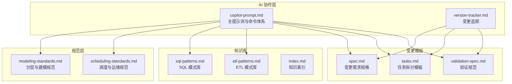
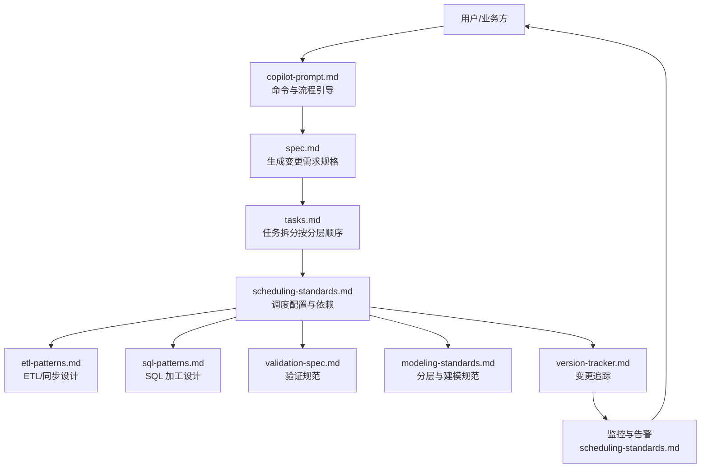
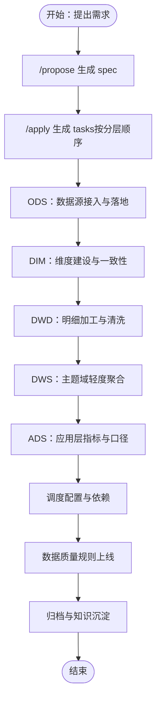
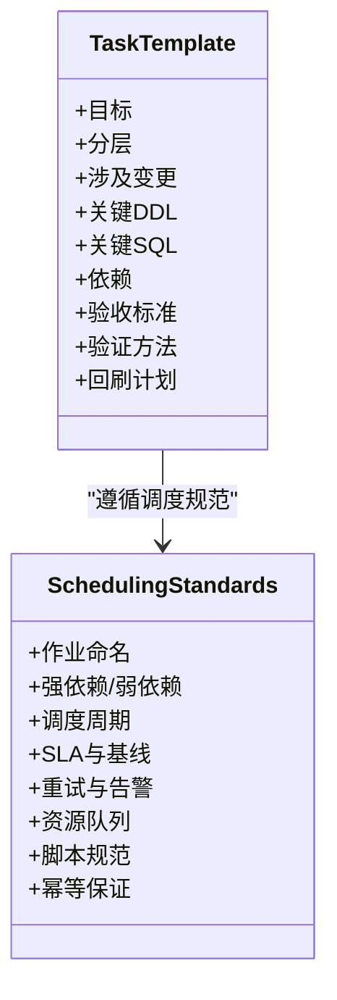
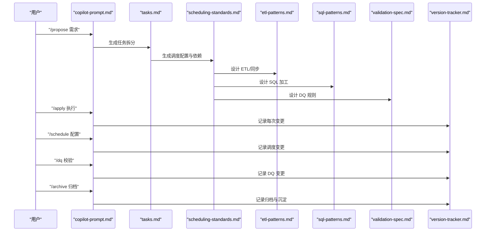
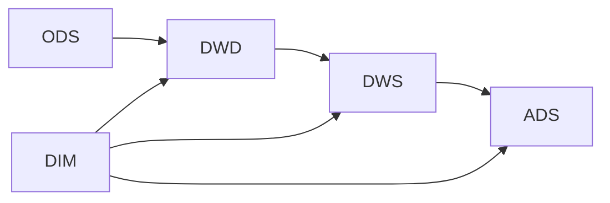

# 任务调度系统

<cite>
**本文引用的文件**
- [目录结构和设计说明.md](file://data_warehouse_engineering_code_copilot/目录结构和设计说明.md)
- [copilot-prompt.md](file://data_warehouse_engineering_code_copilot/agents/copilot-prompt.md)
- [tasks.md](file://data_warehouse_engineering_code_copilot/changes/templates/tasks.md)
- [spec.md](file://data_warehouse_engineering_code_copilot/changes/templates/spec.md)
- [validation-spec.md](file://data_warehouse_engineering_code_copilot/changes/templates/validation-spec.md)
- [scheduling-standards.md](file://data_warehouse_engineering_code_copilot/rules/scheduling-standards.md)
- [modeling-standards.md](file://data_warehouse_engineering_code_copilot/rules/modeling-standards.md)
- [version-tracker.md](file://data_warehouse_engineering_code_copilot/agents/version-tracker.md)
- [etl-patterns.md](file://data_warehouse_engineering_code_copilot/knowledge/etl-patterns.md)
- [sql-patterns.md](file://data_warehouse_engineering_code_copilot/knowledge/sql-patterns.md)
</cite>

## 目录
1. [简介](#简介)
2. [项目结构](#项目结构)
3. [核心组件](#核心组件)
4. [架构总览](#架构总览)
5. [详细组件分析](#详细组件分析)
6. [依赖分析](#依赖分析)
7. [性能考虑](#性能考虑)
8. [故障排查指南](#故障排查指南)
9. [结论](#结论)
10. [附录](#附录)

## 简介
本文件面向“任务调度系统”的技术文档，围绕数据仓库工程化实践，系统阐述任务拆分与执行机制、按分层（ODS/DWD/DWS/ADS/DIM）的任务顺序与依赖关系、任务模板的设计原理（任务描述、执行顺序、资源分配等）、调度自动化流程（从任务生成到执行监控的完整生命周期），以及实际使用示例与优化技巧。文档以 dwh-copilot 工程化提示词工程为基础，强调“Spec 驱动 + 三段式知识库 + 强制变更追踪”的闭环工作流，确保任务可审计、可回溯、可复用。

## 项目结构
该项目采用“Agent + 规则 + 知识 + 变更模板”的组织方式：
- agents：AI 角色与子 Agent 提示词，负责命令式协作与流程引导
- rules：项目约束与规范（分层、调度、安全、质量等）
- knowledge：领域知识库（SQL 模式、ETL 模式、建模技巧、性能优化）
- changes/templates：变更管理模板（spec、tasks、validation-spec、log）

图表来源
- [目录结构和设计说明.md:19-55](file://data_warehouse_engineering_code_copilot/目录结构和设计说明.md#L19-L55)
- [copilot-prompt.md:63-132](file://data_warehouse_engineering_code_copilot/agents/copilot-prompt.md#L63-L132)
- [scheduling-standards.md:1-233](file://data_warehouse_engineering_code_copilot/rules/scheduling-standards.md#L1-L233)
- [modeling-standards.md:1-242](file://data_warehouse_engineering_code_copilot/rules/modeling-standards.md#L1-L242)
- [version-tracker.md:1-120](file://data_warehouse_engineering_code_copilot/agents/version-tracker.md#L1-L120)
- [sql-patterns.md:1-331](file://data_warehouse_engineering_code_copilot/knowledge/sql-patterns.md#L1-L331)
- [etl-patterns.md:1-220](file://data_warehouse_engineering_code_copilot/knowledge/etl-patterns.md#L1-L220)

章节来源
- [目录结构和设计说明.md:19-55](file://data_warehouse_engineering_code_copilot/目录结构和设计说明.md#L19-L55)
- [copilot-prompt.md:63-132](file://data_warehouse_engineering_code_copilot/agents/copilot-prompt.md#L63-L132)

## 核心组件
- 任务模板（tasks.md）：定义任务拆分顺序、目标、分层、涉及变更、关键 DDL/SQL、依赖、验收标准、验证方法、回刷计划等，确保每个任务是“可独立验证的原子变更”。
- 变更需求规格（spec.md）：明确背景目标、现状分析、功能点、业务规则、模型变更、SQL 设计、ETL/同步、调度变更、数据质量规则、影响范围、风险关注点、验证策略等。
- 调度规范（scheduling-standards.md）：定义调度系统约定、依赖关系（强依赖/弱依赖）、调度周期、SLA 与基线、重试与告警、资源队列、脚本规范、上线流程、监控与可观测性、失败回放与回退。
- 分层规范（modeling-standards.md）：明确 ODS/DWD/DWS/ADS/DIM 的职责、命名、表类型、字段设计、分区与分桶、存储格式、生命周期、关系与关联、禁止事项与评审清单。
- 变更追踪（version-tracker.md）：在每次 DDL/SQL/ETL/调度变更后自动记录结构化变更条目，确保所有变更可审计、可回溯。
- SQL/ETL 模式库：提供可复用的 SQL 模式（去重、拉链、同环比、TopN、累计求和、行转列/列转行、回刷、Lambda 合并、缺失日期补齐、NULL 安全比较）与 ETL 模式（CDC、JDBC 增量、MERGE/UPSERT、小文件控制、历史回刷、文件/API 接入、选型对照、时区处理）。

章节来源
- [tasks.md:1-74](file://data_warehouse_engineering_code_copilot/changes/templates/tasks.md#L1-L74)
- [spec.md:1-132](file://data_warehouse_engineering_code_copilot/changes/templates/spec.md#L1-L132)
- [scheduling-standards.md:1-233](file://data_warehouse_engineering_code_copilot/rules/scheduling-standards.md#L1-L233)
- [modeling-standards.md:1-242](file://data_warehouse_engineering_code_copilot/rules/modeling-standards.md#L1-L242)
- [version-tracker.md:1-120](file://data_warehouse_engineering_code_copilot/agents/version-tracker.md#L1-L120)
- [sql-patterns.md:1-331](file://data_warehouse_engineering_code_copilot/knowledge/sql-patterns.md#L1-L331)
- [etl-patterns.md:1-220](file://data_warehouse_engineering_code_copilot/knowledge/etl-patterns.md#L1-L220)

## 架构总览
调度系统以“Spec 驱动 + 任务拆分 + 依赖触发 + 幂等执行 + 变更追踪 + 监控告警”为核心闭环，贯穿从需求到上线的全生命周期。

图表来源
- [copilot-prompt.md:103-132](file://data_warehouse_engineering_code_copilot/agents/copilot-prompt.md#L103-L132)
- [tasks.md:3](file://data_warehouse_engineering_code_copilot/changes/templates/tasks.md#L3)
- [scheduling-standards.md:29-57](file://data_warehouse_engineering_code_copilot/rules/scheduling-standards.md#L29-L57)
- [etl-patterns.md:1-220](file://data_warehouse_engineering_code_copilot/knowledge/etl-patterns.md#L1-L220)
- [sql-patterns.md:1-331](file://data_warehouse_engineering_code_copilot/knowledge/sql-patterns.md#L1-L331)
- [validation-spec.md:1-123](file://data_warehouse_engineering_code_copilot/changes/templates/validation-spec.md#L1-L123)
- [modeling-standards.md:7-46](file://data_warehouse_engineering_code_copilot/rules/modeling-standards.md#L7-L46)
- [version-tracker.md:5-15](file://data_warehouse_engineering_code_copilot/agents/version-tracker.md#L5-L15)

## 详细组件分析

### 任务拆分与执行机制（按分层顺序）
- 拆分顺序：数据源接入 → ODS 落地 → DIM 维度建设 → DWD 明细加工 → DWS 汇总 → ADS 应用层 → 调度配置 → 数据质量 → 权限发布
- 每个任务必须精确到库.表.字段/作业名/调度依赖，具备可独立验证的原子性
- 任务模板包含：目标、分层、涉及变更（DDL/SQL/ETL/调度）、关键 DDL/SQL、依赖、验收标准、验证方法、回刷计划（如涉及）

图表来源
- [tasks.md:3](file://data_warehouse_engineering_code_copilot/changes/templates/tasks.md#L3)
- [copilot-prompt.md:103-111](file://data_warehouse_engineering_code_copilot/agents/copilot-prompt.md#L103-L111)

章节来源
- [tasks.md:3-58](file://data_warehouse_engineering_code_copilot/changes/templates/tasks.md#L3-L58)
- [目录结构和设计说明.md:126-151](file://data_warehouse_engineering_code_copilot/目录结构和设计说明.md#L126-L151)

### 任务模板设计原理
- 任务描述：明确目标、分层、涉及变更（DDL/SQL/ETL/调度）、关键 DDL/SQL
- 执行顺序：严格按 ODS→DIM→DWD→DWS→ADS 的顺序推进，避免跨层依赖
- 资源分配：作业名与输出表一致，命名规范统一，队列划分明确（核心/普通/回刷/探索/实时）
- 验收与验证：行数核验、关键字段非空率、主键唯一性、与基准来源对账、单作业耗时阈值
- 回刷策略：范围、分批策略、失败处理（重试与告警）

图表来源
- [tasks.md:15-58](file://data_warehouse_engineering_code_copilot/changes/templates/tasks.md#L15-L58)
- [scheduling-standards.md:9-166](file://data_warehouse_engineering_code_copilot/rules/scheduling-standards.md#L9-L166)

章节来源
- [tasks.md:15-58](file://data_warehouse_engineering_code_copilot/changes/templates/tasks.md#L15-L58)
- [scheduling-standards.md:9-166](file://data_warehouse_engineering_code_copilot/rules/scheduling-standards.md#L9-L166)

### 调度自动化流程（从任务生成到执行监控）
- 命令式协作：/propose → /apply → /schedule → /dq → /archive
- 依赖识别：上游表当日分区就绪后才触发下游（强依赖），事件驱动型作业（弱依赖）
- 周期与基线：天级/小时级/周级/月级/按需；核心 ADS 必须有基线，DWS/DWD 基线倒推
- 重试与告警：资源不足/超时、上游延迟、数据问题（DQ 失败）、代码 bug 的差异化策略
- 资源队列：核心/普通/回刷/探索/实时队列划分与申请
- 脚本规范：统一脚本头、变量约定、幂等保证（INSERT OVERWRITE 单分区）
- 上线流程：代码评审、测试环境验证、DQ 规则上线、生产首跑、历史回刷、观察期、变更日志
- 监控与可观测性：成功率、运行时长、数据产出延迟、数据量趋势、DQ 通过率、资源消耗趋势
- 失败回放与回退：单分区失败重试/补跑、多分区批量失败确认根因后回刷、回退脚本与流程

图表来源
- [copilot-prompt.md:103-132](file://data_warehouse_engineering_code_copilot/agents/copilot-prompt.md#L103-L132)
- [tasks.md:3](file://data_warehouse_engineering_code_copilot/changes/templates/tasks.md#L3)
- [scheduling-standards.md:29-233](file://data_warehouse_engineering_code_copilot/rules/scheduling-standards.md#L29-L233)
- [etl-patterns.md:1-220](file://data_warehouse_engineering_code_copilot/knowledge/etl-patterns.md#L1-L220)
- [sql-patterns.md:1-331](file://data_warehouse_engineering_code_copilot/knowledge/sql-patterns.md#L1-L331)
- [validation-spec.md:1-123](file://data_warehouse_engineering_code_copilot/changes/templates/validation-spec.md#L1-L123)
- [version-tracker.md:5-15](file://data_warehouse_engineering_code_copilot/agents/version-tracker.md#L5-L15)

章节来源
- [copilot-prompt.md:103-132](file://data_warehouse_engineering_code_copilot/agents/copilot-prompt.md#L103-L132)
- [scheduling-standards.md:29-233](file://data_warehouse_engineering_code_copilot/rules/scheduling-standards.md#L29-L233)

### 任务模板使用示例与拆分策略
- 示例场景：新建 ADS 月度销售看板表（按门店×商品类目维度）
  - 步骤：/propose → Research + 澄清 → 生成 spec → 生成 tasks（ODS→DIM→DWD→DWS→ADS）
  - 执行：/apply 逐 task 执行，每个 task 完成后展示验证证据（行数/抽样/对账三选一）
  - 审查与归档：/review（三阶段）→ /archive（归档 + 知识沉淀）
- 复杂任务拆分策略：
  - 将大任务拆分为多个原子任务（每个任务只负责单一表或单一作业）
  - 明确强依赖（上游分区就绪）与弱依赖（事件驱动）
  - 为每个任务设定验收标准与验证方法，确保可回溯
- 执行优化技巧：
  - 使用幂等写入（INSERT OVERWRITE 单分区）
  - 控制小文件（reduce 数、distribute by、动态合并）
  - 合理设置调度周期与 SLA 基线，避免级联失败
  - 为历史回刷制定分批策略与失败处理（重试与告警）

章节来源
- [目录结构和设计说明.md:126-151](file://data_warehouse_engineering_code_copilot/目录结构和设计说明.md#L126-L151)
- [tasks.md:15-58](file://data_warehouse_engineering_code_copilot/changes/templates/tasks.md#L15-L58)
- [scheduling-standards.md:61-166](file://data_warehouse_engineering_code_copilot/rules/scheduling-standards.md#L61-L166)
- [etl-patterns.md:90-151](file://data_warehouse_engineering_code_copilot/knowledge/etl-patterns.md#L90-L151)

## 依赖分析
- 分层依赖关系：ODS → DWD → DWS → ADS，维度层（DIM）为 DWD/DWS/ADS 提供一致性维度
- 依赖类型：
  - 强依赖：上游表当日分区就绪后才触发下游（sensor/check 任务）
  - 弱依赖：仅在上游存在新数据时启动（事件驱动）
- 禁止跨层反向与跳跃：DWD 不能读 DWS/ADS；ADS 不能直接读 ODS；禁止循环依赖与跨主题强耦合
- 作业命名与队列：作业名 = 输出表名；队列划分（核心/普通/回刷/探索/实时）

图表来源
- [modeling-standards.md:36-46](file://data_warehouse_engineering_code_copilot/rules/modeling-standards.md#L36-L46)
- [scheduling-standards.md:29-57](file://data_warehouse_engineering_code_copilot/rules/scheduling-standards.md#L29-L57)

章节来源
- [modeling-standards.md:151-168](file://data_warehouse_engineering_code_copilot/rules/modeling-standards.md#L151-L168)
- [scheduling-standards.md:29-57](file://data_warehouse_engineering_code_copilot/rules/scheduling-standards.md#L29-L57)

## 性能考虑
- 分区裁剪：WHERE 条件直接命中分区字段，禁止函数包裹
- 数据倾斜：高频空值/默认值加盐打散或拆分 SQL
- Map Join：小表广播加速
- 小文件合并：reduce 数控制、distribute by、动态合并
- CTE 物化：各引擎对 WITH 的物化策略差异
- 重试与告警：指数退避、上游延迟等待、数据问题不重试
- 资源队列：核心队列承载核心 ADS/DWS，普通队列承载 DWD/DWS，回刷/探索/实时队列隔离

章节来源
- [scheduling-standards.md:94-134](file://data_warehouse_engineering_code_copilot/rules/scheduling-standards.md#L94-L134)
- [sql-patterns.md:37-331](file://data_warehouse_engineering_code_copilot/knowledge/sql-patterns.md#L37-L331)
- [etl-patterns.md:90-119](file://data_warehouse_engineering_code_copilot/knowledge/etl-patterns.md#L90-L119)

## 故障排查指南
- 调试流程：现象收集 → 根因定位 → 方案验证 → 实施修复
- 诊断层级：数据源层 → 抽取层 → ODS 层 → DWD 层 → DWS 层 → ADS 层 → 应用层
- 失败回放：单分区失败重试或人工补跑；多分区批量失败确认根因后批量回刷
- 回退策略：代码 bug rollback 到上一版本并回刷受影响分区；模型 bug 停下游、修模型、从 DWD 开始回刷；数据错误禁用下游报表并对外说明 ETA
- 变更追踪：每次 DDL/SQL/ETL/调度变更后自动记录结构化条目，确保可审计、可回溯

章节来源
- [copilot-prompt.md:133-146](file://data_warehouse_engineering_code_copilot/agents/copilot-prompt.md#L133-L146)
- [scheduling-standards.md:205-233](file://data_warehouse_engineering_code_copilot/rules/scheduling-standards.md#L205-L233)
- [version-tracker.md:5-89](file://data_warehouse_engineering_code_copilot/agents/version-tracker.md#L5-L89)

## 结论
本调度系统以“Spec 驱动 + 任务模板 + 依赖触发 + 幂等执行 + 变更追踪 + 监控告警”为核心闭环，确保任务可拆分、可验证、可回溯、可复用。通过严格的分层规范与调度规范，结合可复用的 SQL/ETL 模式库，能够高效支撑复杂数据需求的交付与优化。建议在实践中坚持“小任务、强依赖、幂等写入、分批回刷、可观测性优先”的原则，持续沉淀知识与经验，提升整体工程效率与稳定性。

## 附录
- 命令菜单与流程：/init、/sql、/etl、/model、/propose、/apply、/review、/optimize、/dq、/schedule、/archive
- 变更追踪触发时机：/sql、/etl、/model、/schedule、/dq、/apply 每个 Task 完成后、用户手动记录
- 验证三选一铁律：行数核验、抽样对比、对账 SQL 三选一的实际证据

章节来源
- [copilot-prompt.md:36-51](file://data_warehouse_engineering_code_copilot/agents/copilot-prompt.md#L36-L51)
- [version-tracker.md:5-15](file://data_warehouse_engineering_code_copilot/agents/version-tracker.md#L5-L15)
- [validation-spec.md:6-13](file://data_warehouse_engineering_code_copilot/changes/templates/validation-spec.md#L6-L13)