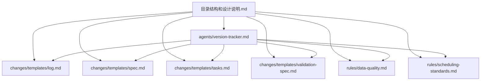
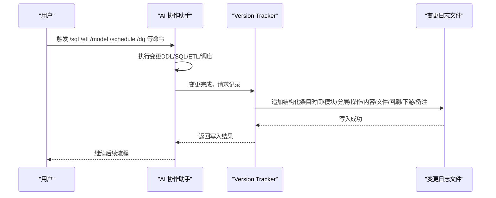
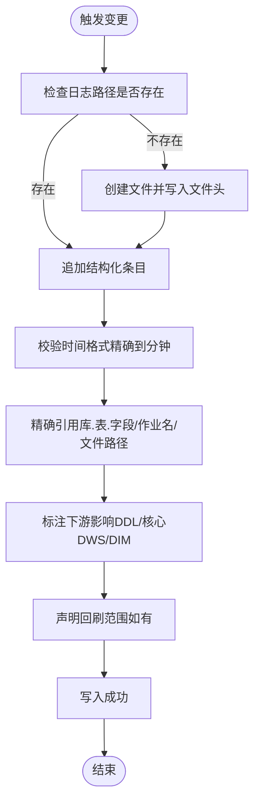
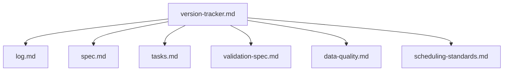

# 变更日志模板

<cite>
**本文引用的文件**
- [log.md](file://data_warehouse_engineering_code_copilot/changes/templates/log.md)
- [version-tracker.md](file://data_warehouse_engineering_code_copilot/agents/version-tracker.md)
- [目录结构和设计说明.md](file://data_warehouse_engineering_code_copilot/目录结构和设计说明.md)
- [spec.md](file://data_warehouse_engineering_code_copilot/changes/templates/spec.md)
- [tasks.md](file://data_warehouse_engineering_code_copilot/changes/templates/tasks.md)
- [validation-spec.md](file://data_warehouse_engineering_code_copilot/changes/templates/validation-spec.md)
- [data-quality.md](file://data_warehouse_engineering_code_copilot/rules/data-quality.md)
- [scheduling-standards.md](file://data_warehouse_engineering_code_copilot/rules/scheduling-standards.md)
</cite>

## 目录
1. [简介](#简介)
2. [项目结构](#项目结构)
3. [核心组件](#核心组件)
4. [架构概览](#架构概览)
5. [详细组件分析](#详细组件分析)
6. [依赖分析](#依赖分析)
7. [性能考虑](#性能考虑)
8. [故障排查指南](#故障排查指南)
9. [结论](#结论)
10. [附录](#附录)

## 简介
本技术文档围绕“变更日志模板”展开，系统阐述 log.md 的记录格式与审计要求，涵盖变更时间、变更人、变更类型、影响范围、验证结果等关键要素，并说明变更日志在版本追踪与审计中的作用。同时，结合版本追踪 Agent 的触发机制与记录规范，提供完整的日志记录示例，解释变更日志与版本控制系统的协同关系，以及如何实现强制变更追踪。

## 项目结构
本项目采用“提示词工程 + 变更模板 + 知识库 + 规范”的组织方式，其中变更日志模板位于 changes/templates/log.md，版本追踪 Agent 位于 agents/version-tracker.md，二者共同构成“强制变更追踪”的基础能力。

图表来源
- [目录结构和设计说明.md:19-55](file://data_warehouse_engineering_code_copilot/目录结构和设计说明.md#L19-L55)
- [version-tracker.md:1-120](file://data_warehouse_engineering_code_copilot/agents/version-tracker.md#L1-L120)
- [log.md:1-61](file://data_warehouse_engineering_code_copilot/changes/templates/log.md#L1-L61)

章节来源
- [目录结构和设计说明.md:19-55](file://data_warehouse_engineering_code_copilot/目录结构和设计说明.md#L19-L55)

## 核心组件
- 变更日志模板（log.md）：用于记录决策、踩坑、知识发现、实现偏差、回刷、性能对比、数据质量验证等，支撑知识沉淀与审计。
- 版本追踪 Agent（version-tracker.md）：在每次 DDL/SQL/ETL/调度变更后自动追加结构化条目，确保“所有变更可审计、可回溯”。

章节来源
- [log.md:1-61](file://data_warehouse_engineering_code_copilot/changes/templates/log.md#L1-L61)
- [version-tracker.md:44-64](file://data_warehouse_engineering_code_copilot/agents/version-tracker.md#L44-L64)

## 架构概览
版本追踪 Agent 在命令执行完成后触发，依据预设的“变更条目格式”写入到用户指定的变更日志文件末尾。该流程贯穿 Spec 驱动的完整闭环，确保每次变更都有据可查。

图表来源
- [version-tracker.md:5-15](file://data_warehouse_engineering_code_copilot/agents/version-tracker.md#L5-L15)
- [version-tracker.md:44-64](file://data_warehouse_engineering_code_copilot/agents/version-tracker.md#L44-L64)

## 详细组件分析

### 变更日志模板（log.md）结构与字段说明
log.md 采用 Markdown 表格与列表形式，覆盖以下关键板块：
- 时间线：记录事件的时间节点与阶段。
- 技术决策：记录决策、选择、放弃方案与原因。
- 踩坑记录：问题、原因、解决方案与沉淀状态。
- 知识发现：关键词与分类标签，便于检索与沉淀。
- Spec-实现偏差记录：偏差点、预期与实际情况、处理方式。
- 数据回刷记录：表名、回刷分区范围、触发原因、行数变化、完成时间。
- 性能对比记录：扫描量、耗时、资源、成本等指标的优化前后对比。
- 数据质量验证记录：规则、结果、实际值、阈值、是否通过。
- 质量备忘：补充说明。

章节来源
- [log.md:5-61](file://data_warehouse_engineering_code_copilot/changes/templates/log.md#L5-L61)

### 版本追踪 Agent 的触发与记录规范
Agent 的触发时机与记录格式如下：
- 触发时机：/sql、/etl、/model、/schedule、/dq 命令执行后，以及每个 Task 完成后。
- 记录格式：以标题行开头，包含时间（精确到分钟）、模块、分层、任务、操作类型、变更内容、关联文件、回刷范围、影响下游、备注等字段。
- 记录规则：原子化、精确引用、任务可追溯、下游必标注、回刷必声明、时间精确到分钟、不阻塞主流程。

图表来源
- [version-tracker.md:19-41](file://data_warehouse_engineering_code_copilot/agents/version-tracker.md#L19-L41)
- [version-tracker.md:44-64](file://data_warehouse_engineering_code_copilot/agents/version-tracker.md#L44-L64)
- [version-tracker.md:80-89](file://data_warehouse_engineering_code_copilot/agents/version-tracker.md#L80-L89)

章节来源
- [version-tracker.md:5-15](file://data_warehouse_engineering_code_copilot/agents/version-tracker.md#L5-L15)
- [version-tracker.md:44-64](file://data_warehouse_engineering_code_copilot/agents/version-tracker.md#L44-L64)
- [version-tracker.md:80-89](file://data_warehouse_engineering_code_copilot/agents/version-tracker.md#L80-L89)

### 变更日志与版本控制系统的协同
- 版本控制集成：变更日志文件作为“可审计的历史记录”，与 Git 提交形成互补。Git 记录“代码变更”，日志记录“变更意图与影响”。
- 强制变更追踪：Agent 在每次关键操作完成后自动写入，避免遗漏；若路径无效，Agent 会提示用户但不中断当前流程，确保主流程不被打断。
- 审计要求：日志条目包含时间、模块、分层、任务、操作、变更内容、关联文件、回刷范围、下游影响、备注等，满足审计所需的“可追溯、可验证、可回放”。

章节来源
- [version-tracker.md:115-120](file://data_warehouse_engineering_code_copilot/agents/version-tracker.md#L115-L120)
- [目录结构和设计说明.md:98-106](file://data_warehouse_engineering_code_copilot/目录结构和设计说明.md#L98-L106)

### 完整日志记录示例（规范指引）
以下示例展示不同类型变更的记录规范（示例为规范性描述，不直接粘贴具体代码片段）：
- 新建 DWD 订单明细表落地与首日全量回刷：包含模块（DDL+SQL）、分层（DWD）、任务、操作（新建）、变更内容（表/脚本/字段口径）、关联文件、回刷范围、影响下游、备注。
- ETL 同步配置变更：包含模块（ETL）、分层（ODS/DWD）、任务、操作（修改）、变更内容（同步任务名/源目标/同步类型/调度）、关联文件、影响下游。
- 调度作业新增/修改：包含模块（调度）、分层（各层）、任务、操作（新建/修改）、变更内容（作业名/依赖/周期/SLA）、关联文件、影响下游。
- 数据质量规则上线：包含模块（数据质量）、分层（各层）、任务、操作（新建/修改）、变更内容（规则/阈值/严重等级）、关联文件、影响下游。
- 性能优化前后对比：包含模块（SQL/ETL/调度）、分层（相关层）、任务、操作（优化）、变更内容（优化点）、性能对比记录（扫描量/耗时/资源/成本）。

章节来源
- [version-tracker.md:92-111](file://data_warehouse_engineering_code_copilot/agents/version-tracker.md#L92-L111)

### 与 Spec/Task/Validation 的衔接
- Spec 驱动：所有变更必须有 Spec 作为依据，变更日志应与 Spec 中的“功能点、业务规则、模型变更、SQL 设计、ETL/同步、调度、数据质量规则、影响范围、验证策略”保持一致。
- Task 原子化：每个 Task 的完成都会触发版本追踪，确保“一次命令一条记录”，便于回溯。
- 验证闭环：在验证规范中记录验证环境、验证原则、验证方法与结果，与日志中的“验证结果”相互印证。

章节来源
- [spec.md:3-6](file://data_warehouse_engineering_code_copilot/changes/templates/spec.md#L3-L6)
- [tasks.md:3-5](file://data_warehouse_engineering_code_copilot/changes/templates/tasks.md#L3-L5)
- [validation-spec.md:6-12](file://data_warehouse_engineering_code_copilot/changes/templates/validation-spec.md#L6-L12)

## 依赖分析
- 组件耦合关系
  - version-tracker 依赖 changes/templates/log.md 的结构字段，用于生成条目。
  - version-tracker 与 rules/data-quality.md、rules/scheduling-standards.md 协同，确保 DQ 与调度规范在日志中得到体现。
  - version-tracker 与 changes/templates/spec.md、tasks.md、validation-spec.md 协同，确保变更来源与验证结果在日志中可追溯。

图表来源
- [version-tracker.md:44-64](file://data_warehouse_engineering_code_copilot/agents/version-tracker.md#L44-L64)
- [log.md:1-61](file://data_warehouse_engineering_code_copilot/changes/templates/log.md#L1-L61)
- [spec.md:1-132](file://data_warehouse_engineering_code_copilot/changes/templates/spec.md#L1-L132)
- [tasks.md:1-74](file://data_warehouse_engineering_code_copilot/changes/templates/tasks.md#L1-L74)
- [validation-spec.md:1-123](file://data_warehouse_engineering_code_copilot/changes/templates/validation-spec.md#L1-L123)
- [data-quality.md:1-195](file://data_warehouse_engineering_code_copilot/rules/data-quality.md#L1-L195)
- [scheduling-standards.md:1-233](file://data_warehouse_engineering_code_copilot/rules/scheduling-standards.md#L1-L233)

章节来源
- [version-tracker.md:44-64](file://data_warehouse_engineering_code_copilot/agents/version-tracker.md#L44-L64)

## 性能考虑
- 写入开销：Agent 仅在变更完成后追加日志，不进行扫描或构建，写入开销极低。
- 并发安全：日志文件采用追加写入，避免并发写冲突；若需要多实例并发，建议引入轻量锁或序列化写入。
- 存储与检索：建议将日志文件纳入版本控制，配合分类标签与关键词，提升检索效率。

## 故障排查指南
- 路径未设置或无效：Agent 首次触发时会提示设置日志路径，收到路径后会在当前会话中记忆；若路径无效，Agent 会提示但不中断流程。
- 时间格式不正确：必须精确到分钟，仅记录日期不含时间的条目不被接受；若系统无法获取精确时间，需标注占位符以便人工补全。
- 变更内容模糊：必须精确到对象名称（库.表.字段、作业名、文件路径），不接受模糊描述。
- 下游未标注：DDL 或核心 DWS/DIM 变更必须列出受影响的下游。
- 回刷未声明：涉及历史分区回刷的，必须标明分区范围。

章节来源
- [version-tracker.md:19-41](file://data_warehouse_engineering_code_copilot/agents/version-tracker.md#L19-L41)
- [version-tracker.md:80-89](file://data_warehouse_engineering_code_copilot/agents/version-tracker.md#L80-L89)

## 结论
变更日志模板与版本追踪 Agent 共同构成了“强制变更追踪”的基础设施。通过严格的记录格式与审计要求，确保每次变更的可追溯、可验证与可回溯，从而提升数据仓库工程的透明度与可靠性。结合 Spec/Task/Validation 的闭环，进一步强化变更的可控性与质量保障。

## 附录
- 变更日志字段清单（示例）
  - 时间：精确到分钟
  - 模块：DDL/SQL/ETL/调度/数据质量/权限/安全/项目配置
  - 分层：ODS/DWD/DWS/ADS/DIM/跨层
  - 任务：需求/任务名称
  - 操作：新建/修改/删除/回刷
  - 变更内容：库.表.字段/作业名/文件路径
  - 关联文件：SQL/DDL/调度配置/changes/文档
  - 回刷范围：分区范围
  - 影响下游：受影响的表/作业/报表
  - 备注：特殊说明/已知限制/待跟进事项

章节来源
- [version-tracker.md:44-64](file://data_warehouse_engineering_code_copilot/agents/version-tracker.md#L44-L64)