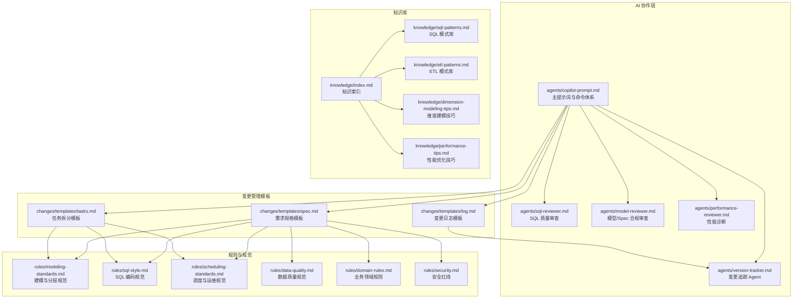
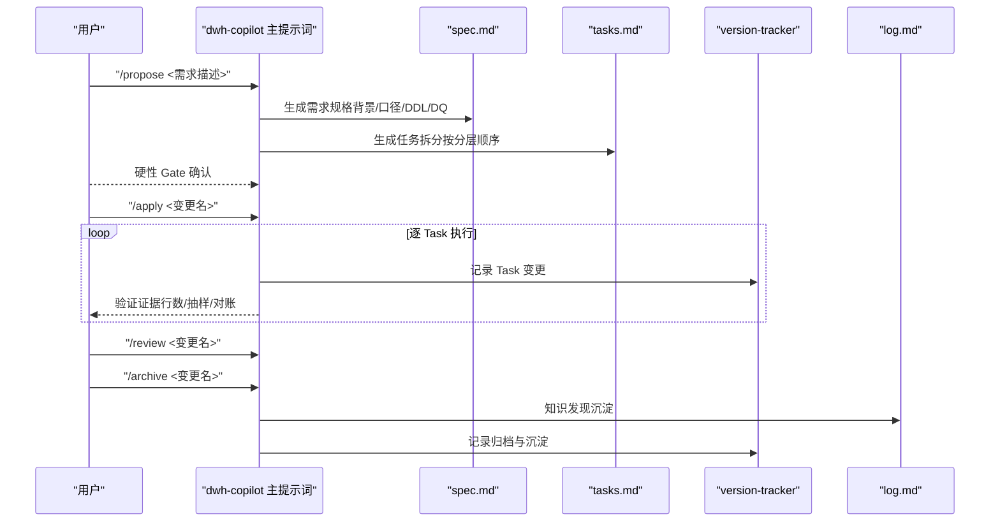
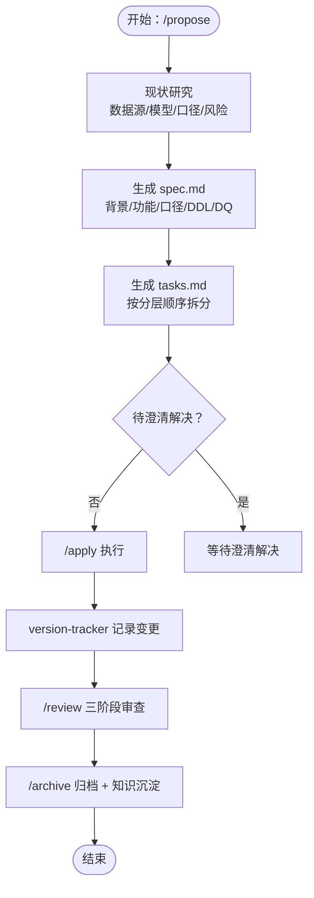
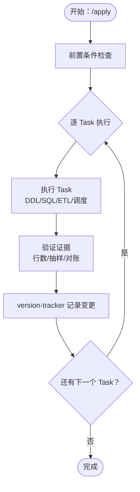
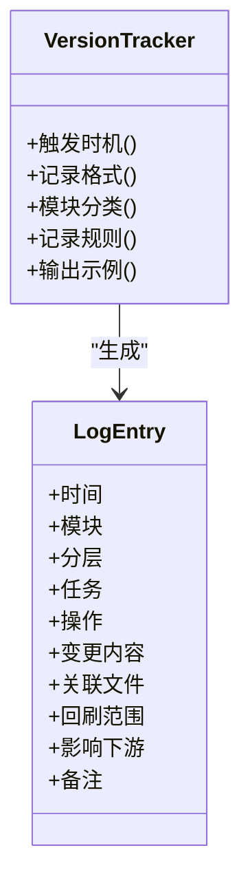
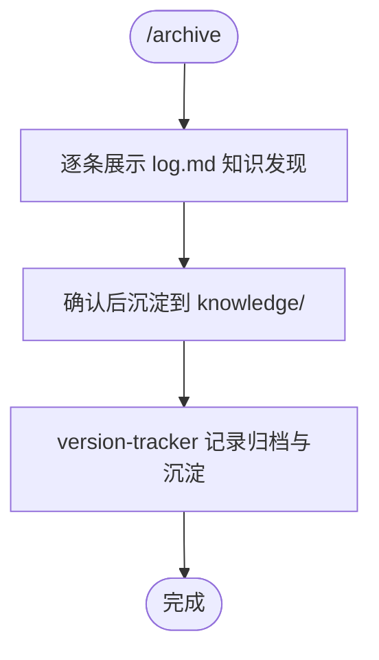
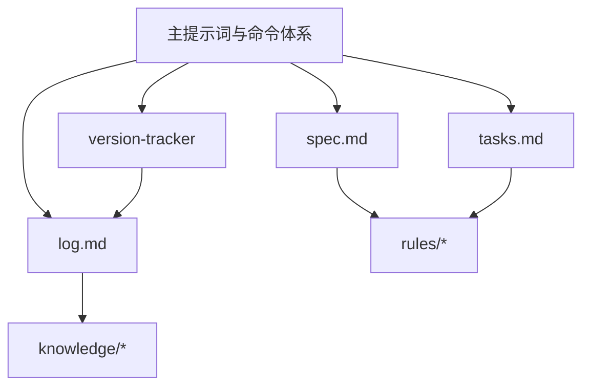

# 变更管理系统

<cite>
**本文引用的文件**
- [目录结构和设计说明.md](file://目录结构和设计说明.md)
- [copilot-prompt.md](file://agents/copilot-prompt.md)
- [version-tracker.md](file://agents/version-tracker.md)
- [spec.md](file://changes/templates/spec.md)
- [tasks.md](file://changes/templates/tasks.md)
- [log.md](file://changes/templates/log.md)
- [modeling-standards.md](file://rules/modeling-standards.md)
- [sql-style.md](file://rules/sql-style.md)
- [scheduling-standards.md](file://rules/scheduling-standards.md)
- [data-quality.md](file://rules/data-quality.md)
- [domain-rules.md](file://rules/domain-rules.md)
- [security.md](file://rules/security.md)
- [index.md](file://knowledge/index.md)
</cite>

## 目录
1. [简介](#简介)
2. [项目结构](#项目结构)
3. [核心组件](#核心组件)
4. [架构总览](#架构总览)
5. [详细组件分析](#详细组件分析)
6. [依赖分析](#依赖分析)
7. [性能考虑](#性能考虑)
8. [故障排查指南](#故障排查指南)
9. [结论](#结论)
10. [附录](#附录)

## 简介
本文件为“变更管理系统”的全面技术文档，围绕“Spec 驱动设计”展开，系统化解析需求规格生成、评审与执行流程，深入说明变更管理模板体系（spec.md、tasks.md、log.md）的设计原理与使用方法，阐述变更需求规格模板的结构与字段定义（背景、口径、DDL、DQ 规则等），解释任务拆分与执行机制（按数仓分层的任务顺序与依赖关系），并说明变更日志追踪机制的实现原理与使用场景。最后提供完整的变更管理流程示例与最佳实践。

## 项目结构
项目采用“三段式知识库 + 强制变更追踪”的工程化提示词工程组织方式：
- agents/：AI 角色与子 Agent 提示词，包括主提示词、审查与追踪等
- changes/templates/：变更管理模板（spec、tasks、log）
- knowledge/：领域知识库（SQL 模式、ETL 模式、建模技巧、性能优化等）
- rules/：项目约束与规范（建模、SQL、调度、数据质量、安全等）

图表来源
- [目录结构和设计说明.md:19-55](file://目录结构和设计说明.md#L19-L55)
- [copilot-prompt.md:23-53](file://agents/copilot-prompt.md#L23-L53)
- [version-tracker.md:1-120](file://agents/version-tracker.md#L1-L120)

章节来源
- [目录结构和设计说明.md:19-55](file://目录结构和设计说明.md#L19-L55)

## 核心组件
- 主提示词与命令体系：定义 AI 的身份、法则、回答框架与命令映射，确保每次协作在固定流程内进行，避免遗漏与发散。
- 变更追踪 Agent：在每次 DDL/SQL/ETL/调度变更后自动记录结构化变更条目，确保所有变更可审计、可回溯。
- 变更管理模板：spec.md（需求规格）、tasks.md（任务拆分）、log.md（变更日志），构成“需求 → 任务 → 实施 → 审查 → 归档”的闭环。
- 规则与规范：建模、SQL、调度、数据质量、安全等强制约束，保障实现与 Spec 一致。
- 知识库：SQL 模式、ETL 模式、建模技巧、性能优化等经验沉淀，支持“实践 → 发现 → 沉淀 → 复用”。

章节来源
- [copilot-prompt.md:64-131](file://agents/copilot-prompt.md#L64-L131)
- [version-tracker.md:5-15](file://agents/version-tracker.md#L5-L15)
- [spec.md:1-132](file://changes/templates/spec.md#L1-L132)
- [tasks.md:1-74](file://changes/templates/tasks.md#L1-L74)
- [log.md:1-61](file://changes/templates/log.md#L1-L61)

## 架构总览
系统围绕“Spec 驱动 + 三段式知识库 + 强制变更追踪”构建，形成从需求到上线的完整闭环。

图表来源
- [copilot-prompt.md:103-131](file://agents/copilot-prompt.md#L103-L131)
- [version-tracker.md:7-15](file://agents/version-tracker.md#L7-L15)
- [log.md:22-23](file://changes/templates/log.md#L22-L23)

## 详细组件分析

### 需求规格模板（spec.md）设计与使用
- 目标：将“为什么做 + 做完后的效果（可验证的结果描述）”固化为可执行的规格，确保实现与 Spec 一致。
- 结构要点：
  - 背景与目标：明确业务动机与可验证结果（表/指标/粒度/SLA）
  - 现状分析：数据源与数据流、现有模型结构、现有指标口径、风险与发现
  - 功能点：以“输入 → 计算逻辑 → 产出表/分区”的形式描述
  - 业务规则与口径：每条规则必须可验证，且附判定 SQL 片段
  - 模型变更（DDL）：按操作（新建/修改/删除）与分层列出变更项
  - SQL 加工设计：脚本、输入/输出、调度周期、关键逻辑摘要
  - ETL/同步变更：任务名、源→目标、同步类型、调度、说明
  - 调度变更：作业名、类型、上游依赖、下游影响、周期、SLA/基线、重试
  - 数据质量规则（DQ）：完整性/唯一性/一致性/准确性/时效性，附判定 SQL 与阈值
  - 影响范围：下游表/报表/API/用户/角色、是否历史回刷
  - 风险与关注点：标注涉及生产数据/PII/财务/历史回刷
  - 验证策略：数据准确性、行数核验、抽样校验、性能验证、回刷验证、用户验收
  - 待澄清：问题列表，全部解决后才能进入 /apply
  - 技术决策：记录关键决策
  - 执行日志：Task 状态、实际改动、备注
  - 审查结论与确认记录（HARD-GATE）：时间、确认人、数据/业务负责人

图表来源
- [copilot-prompt.md:103-115](file://agents/copilot-prompt.md#L103-L115)
- [spec.md:113-132](file://changes/templates/spec.md#L113-L132)
- [tasks.md:1-74](file://changes/templates/tasks.md#L1-L74)
- [version-tracker.md:7-15](file://agents/version-tracker.md#L7-L15)

章节来源
- [spec.md:8-132](file://changes/templates/spec.md#L8-L132)
- [copilot-prompt.md:103-115](file://agents/copilot-prompt.md#L103-L115)

### 任务拆分与执行机制（tasks.md）
- 目标：将变更拆分为“可独立验证的原子变更”，每个任务精确到库.表.字段/作业名/调度依赖。
- 分层顺序：ODS → DIM → DWD → DWS → ADS → 调度配置 → 数据质量 → 权限发布。
- 每个 Task 的关键要素：
  - 目标、分层、涉及变更（DDL/SQL/ETL/调度）
  - 关键 DDL/SQL（必要时附代码片段）
  - 依赖（无/Task N）
  - 验收标准（具体数值或可观测行为）
  - 验证方法（行数核验、关键字段非空率、主键唯一性、与基准来源对账、单作业耗时）
  - 回刷计划（范围、分批策略、失败处理）

图表来源
- [tasks.md:3-74](file://changes/templates/tasks.md#L3-L74)
- [version-tracker.md:7-15](file://agents/version-tracker.md#L7-L15)

章节来源
- [tasks.md:15-74](file://changes/templates/tasks.md#L15-L74)

### 变更日志追踪机制（version-tracker）
- 触发时机：/sql、/etl、/model、/schedule、/dq、/apply 每个 Task 完成后、手动记录。
- 记录格式：模块、分层、任务、操作（新建/修改/删除/回刷）、变更内容（精确到库.表.字段/作业名）、关联文件、回刷范围、影响下游、备注。
- 记录规则：原子化、精确引用、任务可追溯、下游必标注、回刷必声明、时间精确到分钟、不阻塞主流程。

图表来源
- [version-tracker.md:5-120](file://agents/version-tracker.md#L5-L120)

章节来源
- [version-tracker.md:44-120](file://agents/version-tracker.md#L44-L120)

### 变更日志模板（log.md）设计与使用
- 目标：记录决策、踩坑与知识发现，支撑“知识飞轮”（实践 → 发现 → 沉淀 → 复用）。
- 结构要点：
  - 时间线：按阶段记录事件与备注
  - 技术决策：决策、选择、放弃的方案与原因
  - 踩坑记录：问题、原因、解决方案、是否沉淀
  - 知识发现：关键词描述 + 分类标签（SQL 模式、建模技巧、ETL/同步技巧、调度与运维、性能优化、数据质量、数据安全与权限、业务口径）
  - Spec-实现偏差记录：偏差点、Spec 预期、实际情况、处理方式
  - 数据回刷记录：表名、回刷分区范围、触发原因、行数变化、完成时间
  - 性能对比记录：扫描量、耗时、资源、成本
  - 数据质量验证记录：规则、结果、实际值、阈值、是否通过
  - 质量备忘

图表来源
- [log.md:22-61](file://changes/templates/log.md#L22-L61)
- [copilot-prompt.md:129-131](file://agents/copilot-prompt.md#L129-L131)

章节来源
- [log.md:1-61](file://changes/templates/log.md#L1-L61)

### 规则与规范在变更流程中的作用
- 建模与分层规范：明确各层职责、表类型标识、事实/维度设计原则、物理设计（分区/分桶/存储/生命周期）、指标分级与对齐。
- SQL 编码规范：命名约定（库/表/字段/分区）、格式规范（关键字大小写、缩进、头部注释）、编写原则（性能优先、正确性优先、可维护性）、禁止事项与常见错误对照。
- 调度与运维规范：调度系统约定（作业名与输出表一致、基于上游完成度触发）、依赖关系（强依赖/弱依赖）、调度周期、SLA 与基线、重试与告警、资源队列、脚本规范、上线流程、监控与可观测性、失败回放与回退。
- 数据质量规范：五维度（完整性/唯一性/一致性/准确性/时效性）、规则强制要求、规则模板、严重等级、上线流程、历史趋势、反模式、与业务方 SLA。
- 业务领域规则：通用业务规则（金额/百分比/时间/同比/环比/排序键/状态颜色）、KPI 定义标准（必备属性、同名指标必须同口径）、历史数据约定、行业特定规则、跨系统口径一致性、项目特定规则。
- 安全红线：数据安全（禁止硬编码凭据、禁止在 ADS 直接展示 PII、禁止在测试环境使用真实数据、禁止在公共仓库提交敏感信息）、字段级脱敏标准、行级权限（RLS）、数据分级与访问控制、上线与发布安全、数据回刷安全、业务安全、跨境合规、安全审计、应急响应。

章节来源
- [modeling-standards.md:7-242](file://rules/modeling-standards.md#L7-L242)
- [sql-style.md:7-254](file://rules/sql-style.md#L7-L254)
- [scheduling-standards.md:7-233](file://rules/scheduling-standards.md#L7-L233)
- [data-quality.md:9-195](file://rules/data-quality.md#L9-L195)
- [domain-rules.md:8-142](file://rules/domain-rules.md#L8-L142)
- [security.md:7-98](file://rules/security.md#L7-L98)

### 知识库与复用
- 知识索引：提供 SQL 模式、ETL 模式、维度建模技巧、性能优化技巧、业务知识、技术约定、踩坑记录的轻量索引，便于 AI 快速命中。
- 知识沉淀：通过 /archive 将 log.md 中的知识发现确认后沉淀到 knowledge/，形成可复用的经验库。

章节来源
- [index.md:1-60](file://knowledge/index.md#L1-L60)

## 依赖分析
- 组件耦合与内聚：
  - 主提示词与命令体系是中枢，驱动 Spec 生成、任务拆分、审查与归档。
  - 变更追踪 Agent 与模板紧密耦合，确保每次变更都有结构化记录。
  - 规则与规范作为“强制约束”，贯穿 Spec、Tasks、SQL、调度、DQ、安全等环节。
  - 知识库作为“经验复用”，与变更日志形成闭环。
- 外部依赖与集成点：
  - 调度系统（Airflow/DolphinScheduler 等）：作业命名、依赖、SLA、重试、队列、变量约定。
  - 数据质量平台：DQ 规则上线、阈值管理、历史趋势分析。
  - 数据血缘平台：变更影响分析自动化（扩展方向）。
- 潜在循环依赖：
  - 通过“分层归属判定”与“禁止跨层反向/跳跃/循环依赖”规则避免。

图表来源
- [copilot-prompt.md:64-131](file://agents/copilot-prompt.md#L64-L131)
- [modeling-standards.md:163-168](file://rules/modeling-standards.md#L163-L168)
- [scheduling-standards.md:29-58](file://rules/scheduling-standards.md#L29-L58)

章节来源
- [copilot-prompt.md:80-97](file://agents/copilot-prompt.md#L80-L97)
- [modeling-standards.md:163-168](file://rules/modeling-standards.md#L163-L168)
- [scheduling-standards.md:29-58](file://rules/scheduling-standards.md#L29-L58)

## 性能考虑
- 分区裁剪与分区字段使用：避免在 WHERE 中对分区字段使用函数包裹，确保大表分区裁剪生效。
- Join 优化：小表广播（Map Join/Broadcast）、避免跨层反向 Join、维度退化减少 Join。
- 存储与压缩：大表优先 ORC/Parquet + ZSTD/Snappy，临时表使用 Parquet + Snappy。
- CTE 与物化：复杂 SQL 拆分为语义化 CTE，必要时物化中间结果。
- 幂等写入：所有写入使用 INSERT OVERWRITE 单分区，保证幂等与回放能力。
- 监控与基线：按层设置 SLA 基线，监控运行时长、数据产出延迟、DQ 通过率、资源消耗趋势。

章节来源
- [sql-style.md:167-198](file://rules/sql-style.md#L167-L198)
- [modeling-standards.md:173-193](file://rules/modeling-standards.md#L173-L193)
- [scheduling-standards.md:74-116](file://rules/scheduling-standards.md#L74-L116)

## 故障排查指南
- 调试流程：现象收集 → 根因定位 → 方案验证 → 实施修复。
- 诊断层级：数据源层 → 抽取层 → 数仓层（ODS/DWD/DWS/ADS）→ 应用层（BI/API/下游消费）。
- 常见问题与处理：
  - DQ 失败：P0 阻断、P1 告警、P2 监控；按严重等级分级处理与告警。
  - 数据不一致：与业务库对账、检查维度关联时间窗口、确认拉链表区间无重叠。
  - 性能异常：检查分区裁剪、倾斜键、小文件、Join 顺序；对比优化前后扫描量、耗时、资源。
  - 回放与回退：单分区失败重试或人工补跑；批量失败确认根因后批量回刷；代码/模型/数据错误的回退脚本与下游冻结/解冻流程。

章节来源
- [copilot-prompt.md:133-146](file://agents/copilot-prompt.md#L133-L146)
- [data-quality.md:102-121](file://rules/data-quality.md#L102-L121)
- [scheduling-standards.md:205-233](file://rules/scheduling-standards.md#L205-L233)

## 结论
本变更管理系统以“Spec 驱动”为核心，通过标准化模板（spec.md、tasks.md、log.md）、严格的规则与规范、以及强制的变更追踪，实现了从需求到上线的全生命周期闭环管理。配合知识库沉淀与复用，持续提升团队的工程化水平与交付质量。

## 附录

### 变更管理流程示例（新建数据需求）
- 用户提出需求 → AI 识别为 /propose → Research 扫描项目上下文 → 逐项澄清 → 生成 spec.md 与 tasks.md → HARD-GATE 确认
- 用户执行 /apply → 逐 Task 执行与验证 → version-tracker 记录 → 全部完成后 /review → /archive → 知识沉淀

章节来源
- [目录结构和设计说明.md:126-151](file://目录结构和设计说明.md#L126-L151)
- [copilot-prompt.md:103-131](file://agents/copilot-prompt.md#L103-L131)

### 最佳实践
- No Spec, No Change：未生成 Spec 不得进行任何 DDL/SQL/调度变更
- Spec is Truth：实现与 Spec 冲突时，修正实现以对齐 Spec
- Reverse Sync：执行中发现偏差，先修 Spec 再修实现
- 现状必须有出处：每个结论必须标注库.表.字段、作业名或 SQL 片段
- 变更即记录：每次变更完成后同步更新 changes/ 与变更日志
- 任务原子化：聚焦单一表或单一作业，做“小炸弹”而非“大炸弹”
- 零偏差原则：Plan 是合同，AI 是打印机
- 知识飞轮：实践 → 发现 → 沉淀 → 复用

章节来源
- [copilot-prompt.md:6-22](file://agents/copilot-prompt.md#L6-L22)
- [version-tracker.md:80-89](file://agents/version-tracker.md#L80-L89)