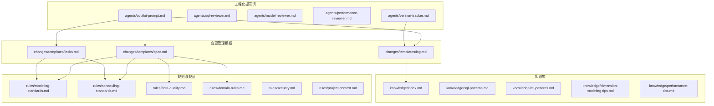
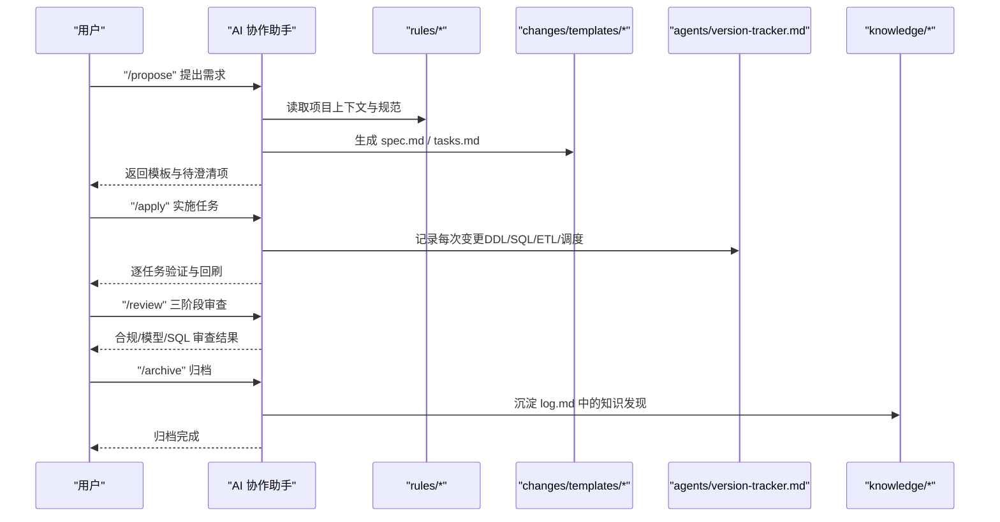
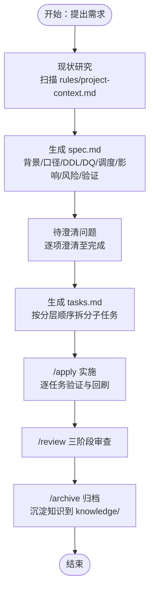
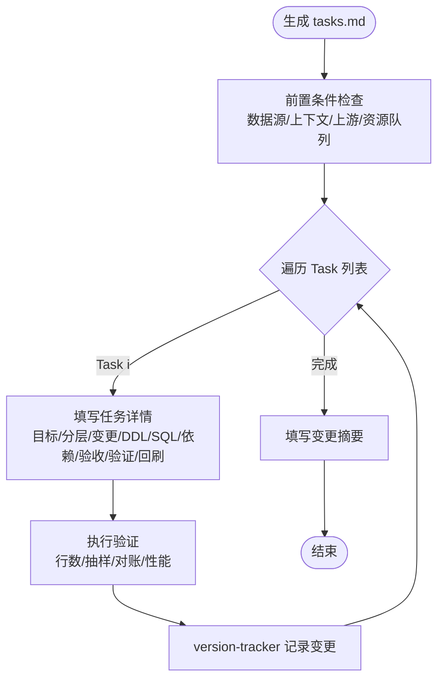
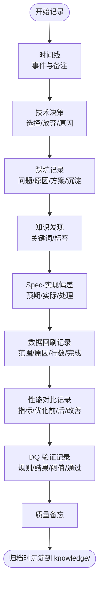
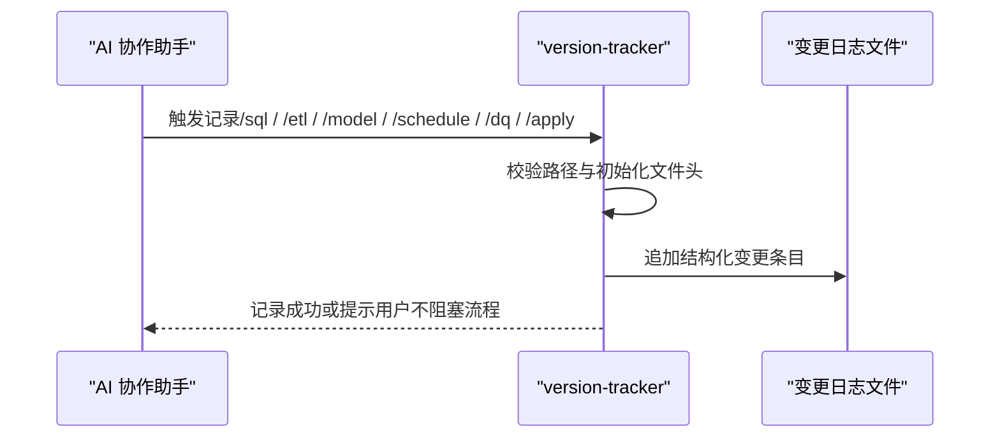
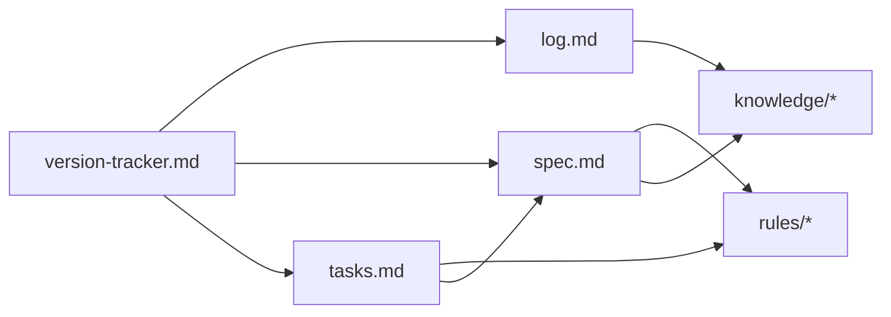
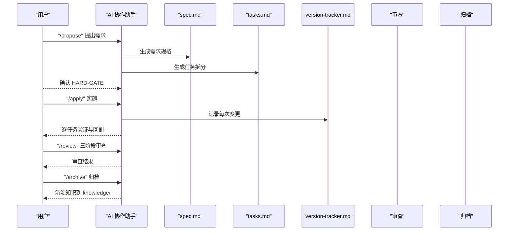

# 变更管理系统

<cite>
**本文引用的文件**
- [目录结构和设计说明.md](file://目录结构和设计说明.md)
- [spec.md](file://changes/templates/spec.md)
- [tasks.md](file://changes/templates/tasks.md)
- [log.md](file://changes/templates/log.md)
- [version-tracker.md](file://agents/version-tracker.md)
- [modeling-standards.md](file://rules/modeling-standards.md)
- [scheduling-standards.md](file://rules/scheduling-standards.md)
- [data-quality.md](file://rules/data-quality.md)
- [domain-rules.md](file://rules/domain-rules.md)
- [index.md](file://knowledge/index.md)
</cite>

## 目录
1. [简介](#简介)
2. [项目结构](#项目结构)
3. [核心组件](#核心组件)
4. [架构总览](#架构总览)
5. [详细组件分析](#详细组件分析)
6. [依赖分析](#依赖分析)
7. [性能考量](#性能考量)
8. [故障排查指南](#故障排查指南)
9. [结论](#结论)
10. [附录](#附录)

## 简介
本项目是一套面向数据仓库工程的“Spec 驱动 + 三段式知识库 + 强制变更追踪”的协作与治理框架。其核心理念是：
- 以“需求文档（Spec）”为昂贵的核心资产，一切变更必须先有 Spec，后有实现；
- 通过“三段式知识库”沉淀可复用的经验（rules/ 约束、knowledge/ 经验、changes/ 过程）；
- 强制变更追踪，确保所有 DDL、SQL、ETL、调度变更均可审计、可回溯。

本技术文档围绕变更管理的三大模板（spec.md、tasks.md、log.md）展开，系统讲解 Spec 驱动变更管理的理念、实现机制与最佳实践，并提供从需求提出到最终归档的完整流程示例。

## 项目结构
项目采用“提示词工程 + 模板 + 规则 + 知识库 + 变更追踪”的分层组织方式：
- agents/：AI 角色与子 Agent 提示词，负责在固定命令流中执行工程化任务；
- changes/templates/：变更管理模板，包括需求规格、任务拆分、变更日志；
- rules/：项目约束与规范（建模、调度、数据质量、安全、领域规则等）；
- knowledge/：领域知识库，沉淀 SQL 模式、ETL 模式、建模技巧、性能优化等经验；
- 目录结构和设计说明.md：总体设计原则、命令式协作、数仓特色设计与典型工作流。

图表来源
- [目录结构和设计说明.md: 19-55:19-55](file://目录结构和设计说明.md#L19-L55)
- [version-tracker.md: 1-120:1-120](file://agents/version-tracker.md#L1-L120)

章节来源
- [目录结构和设计说明.md: 19-55:19-55](file://目录结构和设计说明.md#L19-L55)

## 核心组件
- 变更需求规格模板（spec.md）：定义背景、现状、功能点、业务规则、DDL、SQL 设计、ETL/同步、调度、数据质量、影响范围、风险与关注点、验证策略、执行日志、审查结论与确认记录等。
- 任务拆分模板（tasks.md）：按数仓分层顺序（ODS→DIM→DWD→DWS→ADS→调度→DQ→权限）拆分子任务，每个任务为可独立验证的原子变更。
- 变更日志模板（log.md）：记录决策、踩坑、知识发现、Spec-实现偏差、回刷记录、性能对比、DQ 验证记录等，支持归档时沉淀到知识库。

章节来源
- [spec.md: 1-132:1-132](file://changes/templates/spec.md#L1-L132)
- [tasks.md: 1-74:1-74](file://changes/templates/tasks.md#L1-L74)
- [log.md: 1-61:1-61](file://changes/templates/log.md#L1-L61)

## 架构总览
系统围绕“命令式协作 + 模板驱动 + 强制追踪”的闭环工作流运转：
- 用户通过命令触发 AI 协作（/propose、/apply、/review、/archive 等）；
- AI 基于 rules/ 与 knowledge/ 生成或校验内容；
- changes/templates/ 作为模板载体，驱动 Spec、任务与日志；
- agents/version-tracker.md 在每次关键变更后自动记录结构化变更条目；
- 归档时将 log.md 中的知识发现沉淀到 knowledge/，形成知识飞轮。

图表来源
- [目录结构和设计说明.md: 80-97:80-97](file://目录结构和设计说明.md#L80-L97)
- [version-tracker.md: 5-16:5-16](file://agents/version-tracker.md#L5-L16)
- [log.md: 20-35:20-35](file://changes/templates/log.md#L20-L35)

## 详细组件分析

### 变更需求规格模板（spec.md）
- 目的：将“需求”转化为可执行、可验证、可审计的工程文档，确保实现与 Spec 保持一致。
- 关键要素：
  - 背景与目标：明确“为什么做 + 做完后的效果”，可验证（表/指标/粒度/SLA）。
  - 现状分析：数据源与数据流、现有模型结构、现有指标/口径、发现与风险。
  - 功能点：输入→计算逻辑→产出表/分区，每个功能点可独立验证。
  - 业务规则与口径：每条规则必须可验证，必须有判定 SQL 片段。
  - 模型变更（DDL）：操作类型、分层、库.表、字段/分区/索引、说明；关键 DDL 以伪代码或完整形式呈现。
  - SQL 加工设计：脚本、输入/输出、调度周期、关键逻辑摘要。
  - ETL/同步变更：任务名、源→目标、同步类型、调度、说明。
  - 调度变更：作业名、类型、上游依赖、下游影响、调度周期、SLA/基线、重试。
  - 数据质量规则（DQ）：维度、规则、判定 SQL、阈值、严重等级。
  - 影响范围：下游表/报表/API/用户/角色、是否历史回刷（含分区范围）。
  - 风险与关注点：涉及生产数据/PII/财务/历史回刷必须标注。
  - 验证策略：数据准确性、行数核验、抽样校验、性能验证、回刷验证、用户验收。
  - 待澄清：所有问题解决后才能进入 /apply。
  - 技术决策：记录关键设计取舍。
  - 执行日志：Task 状态、实际改动、备注。
  - 审查结论与确认记录（HARD-GATE）：时间、审查人、数据/业务负责人。

图表来源
- [目录结构和设计说明.md: 126-151:126-151](file://目录结构和设计说明.md#L126-L151)
- [spec.md: 8-132:8-132](file://changes/templates/spec.md#L8-L132)
- [tasks.md: 1-74:1-74](file://changes/templates/tasks.md#L1-L74)

章节来源
- [spec.md: 8-132:8-132](file://changes/templates/spec.md#L8-L132)

### 任务拆分模板（tasks.md）
- 目的：将复杂变更拆分为“可独立验证的原子变更”，确保每一步都有明确的验收标准与验证方法。
- 拆分顺序：数据源接入 → ODS 落地 → DIM 维度建设 → DWD 明细加工 → DWS 汇总 → ADS 应用层 → 调度配置 → 数据质量 → 权限发布。
- 每个任务必须精确到“库.表.字段 / 作业名 / 调度依赖”，并包含：
  - 目标、分层、涉及变更（DDL/SQL/ETL/调度）、关键 DDL/SQL、依赖、验收标准、验证方法、回刷计划（如涉及）。
- 变更摘要：统计新建/修改表数、脚本数、调度作业数、DQ 规则数、历史回刷分区数、Spec-Plan 偏差、性能影响评估、上线后观察期与回退方案、遗留问题。

图表来源
- [tasks.md: 3-74:3-74](file://changes/templates/tasks.md#L3-L74)
- [version-tracker.md: 7-16:7-16](file://agents/version-tracker.md#L7-L16)

章节来源
- [tasks.md: 3-74:3-74](file://changes/templates/tasks.md#L3-L74)

### 变更日志模板（log.md）
- 目的：记录决策、踩坑与知识发现，形成“实践 → 变更日志 → 归档沉淀 → 知识库复用”的知识飞轮。
- 内容结构：
  - 时间线：按时间顺序记录关键事件。
  - 技术决策：选择与放弃的方案及原因。
  - 踩坑记录：问题、原因、解决方案、是否沉淀。
  - 知识发现：关键词、分类标签（SQL 模式、建模技巧、ETL/同步技巧、调度与运维、性能优化、数据质量、数据安全与权限、业务口径）。
  - Spec-实现偏差记录：偏差点、Spec 预期、实际情况、处理方式。
  - 数据回刷记录：表名、回刷分区范围、触发原因、行数变化、完成时间。
  - 性能对比记录：扫描量、耗时、资源、成本。
  - 数据质量验证记录：规则、结果、实际值、阈值、是否通过。
  - 质量备忘：后续观察与注意事项。

图表来源
- [log.md: 5-61:5-61](file://changes/templates/log.md#L5-L61)

章节来源
- [log.md: 5-61:5-61](file://changes/templates/log.md#L5-L61)

### 强制变更追踪（agents/version-tracker.md）
- 触发时机：/sql、/etl、/model、/schedule、/dq 命令执行完毕，以及每个 Task 完成后。
- 记录格式：包含时间、模块、分层、任务、操作、变更内容、关联文件、回刷范围、影响下游、备注等字段。
- 记录规则：原子化、精确引用、任务可追溯、下游必标注、回刷必声明、时间精确到分钟、不阻塞主流程。
- 输出示例：提供结构化条目模板与示例，确保每次变更可审计、可回溯。

图表来源
- [version-tracker.md: 5-16:5-16](file://agents/version-tracker.md#L5-L16)
- [version-tracker.md: 44-64:44-64](file://agents/version-tracker.md#L44-L64)
- [version-tracker.md: 80-89:80-89](file://agents/version-tracker.md#L80-L89)

章节来源
- [version-tracker.md: 5-16:5-16](file://agents/version-tracker.md#L5-L16)
- [version-tracker.md: 44-64:44-64](file://agents/version-tracker.md#L44-L64)
- [version-tracker.md: 80-89:80-89](file://agents/version-tracker.md#L80-L89)

### 规则与规范支撑
- 建模与分层规范（modeling-standards.md）：分层职责、表类型标识、事实/维度设计原则、物理设计、指标分级、禁止事项与评审清单。
- 调度与运维规范（scheduling-standards.md）：调度系统约定、命名约定、依赖关系、调度周期、SLA 与基线、重试与告警、资源队列、脚本规范、上线流程、监控与可观测性、失败回放与回退。
- 数据质量规范（data-quality.md）：五维度规则、强制 DQ 要求、规则模板、严重等级、上线流程、文件结构、历史趋势、反模式与业务 SLA。
- 业务领域规则（domain-rules.md）：通用业务规则、KPI/指标定义标准、DQ 五大维度、历史数据约定、行业特定规则、跨系统口径一致性、项目特定规则。

章节来源
- [modeling-standards.md: 7-242:7-242](file://rules/modeling-standards.md#L7-L242)
- [scheduling-standards.md: 5-233:5-233](file://rules/scheduling-standards.md#L5-L233)
- [data-quality.md: 5-195:5-195](file://rules/data-quality.md#L5-L195)
- [domain-rules.md: 6-142:6-142](file://rules/domain-rules.md#L6-L142)

### 知识库与复用
- 知识索引（index.md）：提供 SQL 模式、ETL 模式、维度建模技巧、性能优化技巧、业务知识、技术约定与踩坑记录的轻量索引，便于 AI 快速命中。
- 知识沉淀：归档时将 log.md 中的知识发现逐条确认并沉淀到 knowledge/ 对应专题文件，形成可复用的“工具箱”。

章节来源
- [index.md: 1-60:1-60](file://knowledge/index.md#L1-L60)

## 依赖分析
- 组件耦合与协作：
  - changes/templates/* 依赖 rules/* 与 knowledge/* 的约束与经验；
  - agents/version-tracker.md 与 changes/templates/* 强耦合，确保每次变更均有结构化记录；
  - 归档阶段将 changes/log.md 的知识沉淀到 knowledge/，形成闭环。
- 外部依赖与集成点：
  - 调度系统（如 DolphinScheduler/Airflow）：通过调度配置与 SLA 基线对接；
  - 数据质量平台：通过 DQ 规则与历史趋势表对接；
  - 数据血缘平台：可与变更影响分析自动化集成（扩展点）。

图表来源
- [目录结构和设计说明.md: 70-78:70-78](file://目录结构和设计说明.md#L70-L78)
- [version-tracker.md: 100-105:100-105](file://agents/version-tracker.md#L100-L105)

章节来源
- [目录结构和设计说明.md: 70-78:70-78](file://目录结构和设计说明.md#L70-L78)
- [version-tracker.md: 100-105:100-105](file://agents/version-tracker.md#L100-L105)

## 性能考量
- 分区裁剪与过滤：WHERE 条件直接命中分区字段，避免函数包裹导致的全表扫描。
- 数据倾斜治理：高频空值/默认值加盐打散，或拆分 SQL；合理使用广播/分桶 Join。
- 小文件合并：通过 distribute by 与 reduce 数控制，减少小文件带来的调度与扫描开销。
- 存储格式与压缩：大表优先 ORC/Parquet + ZSTD，临时表可使用 Parquet + Snappy。
- 幂等写入：调度脚本统一使用 INSERT OVERWRITE 单分区，避免 DROP TABLE 等破坏性操作。
- 监控与告警：单作业耗时 > P95 × 1.5、行数环比异常、关键字段非空率下降等触发告警。

章节来源
- [performance-tips.md](file://knowledge/performance-tips.md)
- [scheduling-standards.md: 162-166:162-166](file://rules/scheduling-standards.md#L162-L166)
- [data-quality.md: 184-201:184-201](file://rules/data-quality.md#L184-L201)

## 故障排查指南
- DQ 失败：
  - P0：阻断下游、立即告警值班、不允许发布数据；
  - P1：失败但允许下游运行，需 24 小时内修复；
  - P2：仅记录与日报告知。
- 调度失败：
  - 资源不足/超时：指数退避重试；
  - 上游延迟：等待上游 + 自动重试；
  - 数据问题（DQ 失败）：不重试，直接告警；
  - 代码 bug：不重试，需人工干预。
- 回放与回退：
  - 单分区失败：重试或人工补跑；
  - 多分区批量失败：确认根因后批量回刷；
  - 回退：先停下游，回滚代码到上一版本，从 DWD 开始回刷受影响分区。

章节来源
- [scheduling-standards.md: 94-116:94-116](file://rules/scheduling-standards.md#L94-L116)
- [scheduling-standards.md: 205-233:205-233](file://rules/scheduling-standards.md#L205-L233)
- [data-quality.md: 102-114:102-114](file://rules/data-quality.md#L102-L114)

## 结论
本变更管理系统以“Spec 驱动 + 三段式知识库 + 强制变更追踪”为核心，通过标准化模板与命令式协作，确保变更的可验证、可审计与可复用。借助 rules/ 与 knowledge/ 的约束与经验，结合 agents/version-tracker.md 的自动追踪能力，形成从需求提出到最终归档的完整闭环，有效降低数仓工程中的不确定性与风险。

## 附录

### 变更管理流程示例（从需求提出到最终归档）
- 场景 A：新建一个数据需求（如销售域 ADS 月度看板表）
  1) 用户提出需求 → AI 识别为 /propose；
  2) Research：扫描 rules/project-context.md，查找已有 DWS/维度表；
  3) 逐项澄清：粒度、时间窗、是否含退款、SLA；
  4) 生成 changes/<change-name>/spec.md（含模型变更 DDL、SQL 设计、调度配置、DQ 规则）；
  5) 生成 changes/<change-name>/tasks.md（按 ODS→DIM→DWD→DWS→ADS 顺序）；
  6) HARD-GATE：等待用户确认；
  7) 用户同意后执行 /apply：逐 task 实施，每个 task 完成后展示验证证据并触发 version-tracker；
  8) 全部完成后执行 /review（三阶段审查）→ /archive（归档 + 知识沉淀）。

图表来源
- [目录结构和设计说明.md: 126-151:126-151](file://目录结构和设计说明.md#L126-L151)
- [version-tracker.md: 7-16:7-16](file://agents/version-tracker.md#L7-L16)