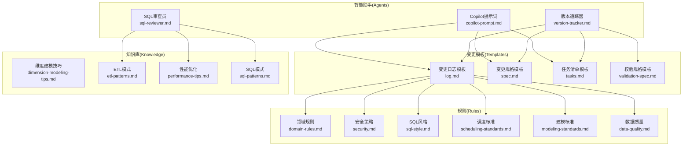
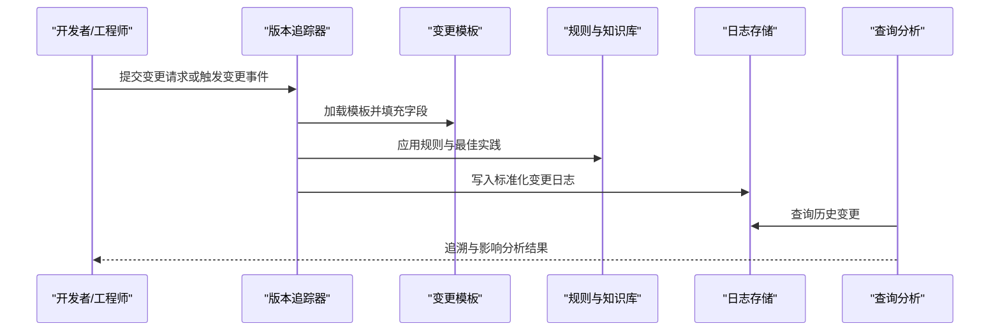
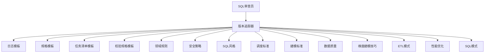

# 变更追踪日志

<cite>
**本文引用的文件**
- [version-tracker.md](file://data_warehouse_engineering_code_copilot/agents/version-tracker.md)
- [log.md](file://data_warehouse_engineering_code_copilot/changes/templates/log.md)
- [spec.md](file://data_warehouse_engineering_code_copilot/changes/templates/spec.md)
- [tasks.md](file://data_warehouse_engineering_code_copilot/changes/templates/tasks.md)
- [validation-spec.md](file://data_warehouse_engineering_code_copilot/changes/templates/validation-spec.md)
- [sql-reviewer.md](file://data_warehouse_engineering_code_copilot/agents/sql-reviewer.md)
- [copilot-prompt.md](file://data_warehouse_engineering_code_copilot/agents/copilot-prompt.md)
- [rules/domain-rules.md](file://data_warehouse_engineering_code_copilot/rules/domain-rules.md)
- [rules/security.md](file://data_warehouse_engineering_code_copilot/rules/security.md)
- [rules/sql-style.md](file://data_warehouse_engineering_code_copilot/rules/sql-style.md)
- [rules/scheduling-standards.md](file://data_warehouse_engineering_code_copilot/rules/scheduling-standards.md)
- [rules/modeling-standards.md](file://data_warehouse_engineering_code_copilot/rules/modeling-standards.md)
- [rules/data-quality.md](file://data_warehouse_engineering_code_copilot/rules/data-quality.md)
- [knowledge/dimension-modeling-tips.md](file://data_warehouse_engineering_code_copilot/knowledge/dimension-modeling-tips.md)
- [knowledge/etl-patterns.md](file://data_warehouse_engineering_code_copilot/knowledge/etl-patterns.md)
- [knowledge/performance-tips.md](file://data_warehouse_engineering_code_copilot/knowledge/performance-tips.md)
- [knowledge/sql-patterns.md](file://data_warehouse_engineering_code_copilot/knowledge/sql-patterns.md)
</cite>

## 目录
1. [引言](#引言)
2. [项目结构](#项目结构)
3. [核心组件](#核心组件)
4. [架构总览](#架构总览)
5. [详细组件分析](#详细组件分析)
6. [依赖关系分析](#依赖关系分析)
7. [性能考虑](#性能考虑)
8. [故障排查指南](#故障排查指南)
9. [结论](#结论)
10. [附录](#附录)

## 引言
本技术文档围绕“变更追踪日志系统”展开，目标是帮助数据仓库工程团队建立统一的变更记录规范与自动化流程，覆盖DDL变更、SQL执行、ETL任务等多类变更的记录规则，并提供查询与分析方法、实际使用示例及性能优化建议。本文档基于仓库中现有的变更模板、规则与知识库文件进行系统化梳理与扩展说明。

## 项目结构
该仓库以“智能助手（Agents）+ 变更模板（Templates）+ 规则与知识库（Rules & Knowledge）”为核心组织方式：
- agents：包含多个面向不同任务的提示词与角色定义，如版本追踪器、SQL审查员等
- changes/templates：存放变更日志模板与规格说明，支撑标准化记录
- rules：领域规则、安全策略、SQL风格、调度标准、建模标准、数据质量等
- knowledge：维度建模技巧、ETL模式、性能优化、SQL模式等

图表来源
- [version-tracker.md](file://data_warehouse_engineering_code_copilot/agents/version-tracker.md)
- [log.md](file://data_warehouse_engineering_code_copilot/changes/templates/log.md)
- [spec.md](file://data_warehouse_engineering_code_copilot/changes/templates/spec.md)
- [tasks.md](file://data_warehouse_engineering_code_copilot/changes/templates/tasks.md)
- [validation-spec.md](file://data_warehouse_engineering_code_copilot/changes/templates/validation-spec.md)
- [sql-reviewer.md](file://data_warehouse_engineering_code_copilot/agents/sql-reviewer.md)
- [copilot-prompt.md](file://data_warehouse_engineering_code_copilot/agents/copilot-prompt.md)
- [rules/domain-rules.md](file://data_warehouse_engineering_code_copilot/rules/domain-rules.md)
- [rules/security.md](file://data_warehouse_engineering_code_copilot/rules/security.md)
- [rules/sql-style.md](file://data_warehouse_engineering_code_copilot/rules/sql-style.md)
- [rules/scheduling-standards.md](file://data_warehouse_engineering_code_copilot/rules/scheduling-standards.md)
- [rules/modeling-standards.md](file://data_warehouse_engineering_code_copilot/rules/modeling-standards.md)
- [rules/data-quality.md](file://data_warehouse_engineering_code_copilot/rules/data-quality.md)
- [knowledge/dimension-modeling-tips.md](file://data_warehouse_engineering_code_copilot/knowledge/dimension-modeling-tips.md)
- [knowledge/etl-patterns.md](file://data_warehouse_engineering_code_copilot/knowledge/etl-patterns.md)
- [knowledge/performance-tips.md](file://data_warehouse_engineering_code_copilot/knowledge/performance-tips.md)
- [knowledge/sql-patterns.md](file://data_warehouse_engineering_code_copilot/knowledge/sql-patterns.md)

章节来源
- [version-tracker.md](file://data_warehouse_engineering_code_copilot/agents/version-tracker.md)
- [log.md](file://data_warehouse_engineering_code_copilot/changes/templates/log.md)
- [spec.md](file://data_warehouse_engineering_code_copilot/changes/templates/spec.md)
- [tasks.md](file://data_warehouse_engineering_code_copilot/changes/templates/tasks.md)
- [validation-spec.md](file://data_warehouse_engineering_code_copilot/changes/templates/validation-spec.md)

## 核心组件
- 版本追踪器（Agent）
  - 职责：驱动变更日志的生成与规范化，确保DDL、SQL、ETL等变更被结构化记录
  - 关键输入：变更类型、对象、影响范围、责任人、时间戳、关联任务/工单号
  - 关键输出：符合模板的变更日志条目
- 变更模板（Templates）
  - 变更日志模板：定义字段与结构，便于统一归档与检索
  - 变更规格模板：描述变更的业务背景、目标、风险与验收标准
  - 任务清单模板：列出实施步骤、验证点、回滚计划
  - 校验规格模板：定义数据一致性与质量校验规则
- 规则与知识库（Rules & Knowledge）
  - 领域规则、安全策略、SQL风格、调度标准、建模标准、数据质量
  - 维度建模技巧、ETL模式、性能优化、SQL模式

章节来源
- [version-tracker.md](file://data_warehouse_engineering_code_copilot/agents/version-tracker.md)
- [log.md](file://data_warehouse_engineering_code_copilot/changes/templates/log.md)
- [spec.md](file://data_warehouse_engineering_code_copilot/changes/templates/spec.md)
- [tasks.md](file://data_warehouse_engineering_code_copilot/changes/templates/tasks.md)
- [validation-spec.md](file://data_warehouse_engineering_code_copilot/changes/templates/validation-spec.md)
- [rules/domain-rules.md](file://data_warehouse_engineering_code_copilot/rules/domain-rules.md)
- [rules/security.md](file://data_warehouse_engineering_code_copilot/rules/security.md)
- [rules/sql-style.md](file://data_warehouse_engineering_code_copilot/rules/sql-style.md)
- [rules/scheduling-standards.md](file://data_warehouse_engineering_code_copilot/rules/scheduling-standards.md)
- [rules/modeling-standards.md](file://data_warehouse_engineering_code_copilot/rules/modeling-standards.md)
- [rules/data-quality.md](file://data_warehouse_engineering_code_copilot/rules/data-quality.md)
- [knowledge/dimension-modeling-tips.md](file://data_warehouse_engineering_code_copilot/knowledge/dimension-modeling-tips.md)
- [knowledge/etl-patterns.md](file://data_warehouse_engineering_code_copilot/knowledge/etl-patterns.md)
- [knowledge/performance-tips.md](file://data_warehouse_engineering_code_copilot/knowledge/performance-tips.md)
- [knowledge/sql-patterns.md](file://data_warehouse_engineering_code_copilot/knowledge/sql-patterns.md)

## 架构总览
下图展示了从“变更触发”到“日志归档与查询”的端到端流程，以及各组件之间的依赖关系：

图表来源
- [version-tracker.md](file://data_warehouse_engineering_code_copilot/agents/version-tracker.md)
- [log.md](file://data_warehouse_engineering_code_copilot/changes/templates/log.md)
- [spec.md](file://data_warehouse_engineering_code_copilot/changes/templates/spec.md)
- [tasks.md](file://data_warehouse_engineering_code_copilot/changes/templates/tasks.md)
- [validation-spec.md](file://data_warehouse_engineering_code_copilot/changes/templates/validation-spec.md)
- [rules/domain-rules.md](file://data_warehouse_engineering_code_copilot/rules/domain-rules.md)
- [rules/security.md](file://data_warehouse_engineering_code_copilot/rules/security.md)
- [rules/sql-style.md](file://data_warehouse_engineering_code_copilot/rules/sql-style.md)
- [rules/scheduling-standards.md](file://data_warehouse_engineering_code_copilot/rules/scheduling-standards.md)
- [rules/modeling-standards.md](file://data_warehouse_engineering_code_copilot/rules/modeling-standards.md)
- [rules/data-quality.md](file://data_warehouse_engineering_code_copilot/rules/data-quality.md)
- [knowledge/dimension-modeling-tips.md](file://data_warehouse_engineering_code_copilot/knowledge/dimension-modeling-tips.md)
- [knowledge/etl-patterns.md](file://data_warehouse_engineering_code_copilot/knowledge/etl-patterns.md)
- [knowledge/performance-tips.md](file://data_warehouse_engineering_code_copilot/knowledge/performance-tips.md)
- [knowledge/sql-patterns.md](file://data_warehouse_engineering_code_copilot/knowledge/sql-patterns.md)

## 详细组件分析

### 变更日志模板（设计原理与实现机制）
- 设计原则
  - 结构化：统一字段与层级，便于机器解析与人工阅读
  - 可追溯：包含变更主体、对象、时间、影响范围、责任人、关联任务/工单号
  - 可审计：记录审批、验证与回滚信息，支持合规与复盘
- 字段定义（建议）
  - 基础信息：变更编号、提交人、提交时间、审批状态
  - 变更详情：变更类型（DDL/SQL/ETL）、对象名称、变更前后对比摘要
  - 影响分析：影响表/视图/任务、数据量变化预估、性能影响评估
  - 验证与回滚：校验规则、回滚步骤、验证结果
  - 关联信息：工单号、评审意见、附件链接
- 存储方式
  - 文本归档：Markdown 文件按日期/项目命名，便于版本控制与检索
  - 结构化索引：抽取关键字段建立索引，支持快速查询与报表
  - 元数据管理：维护模板版本、规则映射、责任人清单

章节来源
- [log.md](file://data_warehouse_engineering_code_copilot/changes/templates/log.md)

### 变更规格模板（变更背景与验收）
- 目的：明确变更目标、业务价值、风险与验收标准
- 关键要素
  - 背景与目标：业务驱动、问题描述、预期收益
  - 变更范围：涉及对象、边界条件、依赖关系
  - 风险与应对：性能风险、数据风险、回滚策略
  - 验收标准：数据质量、功能正确性、性能阈值
- 与日志模板的衔接：规格作为日志的上下文依据，确保记录可审计、可追溯

章节来源
- [spec.md](file://data_warehouse_engineering_code_copilot/changes/templates/spec.md)

### 任务清单模板（实施与验证）
- 目的：将变更拆解为可执行的任务，明确验证点与回滚步骤
- 关键要素
  - 实施步骤：DDL、SQL脚本、ETL配置更新
  - 验证点：数据一致性、性能回归、业务指标
  - 回滚步骤：逆向操作、补偿逻辑、恢复策略
- 与日志模板的衔接：任务执行情况写入日志，形成闭环

章节来源
- [tasks.md](file://data_warehouse_engineering_code_copilot/changes/templates/tasks.md)

### 校验规格模板（数据一致性与质量）
- 目的：定义数据校验规则，确保变更后数据质量达标
- 关键要素
  - 校验维度：完整性、唯一性、范围、一致性、时效性
  - 校验方法：抽样、全量比对、统计对比、业务指标回归
  - 工具与脚本：SQL校验脚本、自动化工具、监控告警
- 与日志模板的衔接：校验结果作为变更验证的一部分归档

章节来源
- [validation-spec.md](file://data_warehouse_engineering_code_copilot/changes/templates/validation-spec.md)

### 版本追踪器（自动化流程）
- 触发方式
  - 手动触发：开发人员在完成变更后提交日志
  - 自动触发：CI/CD流水线在DDL/SQL/ETL变更后自动采集元数据并生成日志
- 流程要点
  - 模板加载：根据变更类型选择对应模板
  - 字段填充：从代码、配置、工单系统抽取必要字段
  - 规则应用：调用规则与知识库进行合规检查与最佳实践建议
  - 日志生成：输出标准化日志文件并归档
- 与SQL审查员的协作
  - 审查SQL语法、性能与安全
  - 输出审查意见与改进建议，纳入日志的“验证与回滚”部分

章节来源
- [version-tracker.md](file://data_warehouse_engineering_code_copilot/agents/version-tracker.md)
- [sql-reviewer.md](file://data_warehouse_engineering_code_copilot/agents/sql-reviewer.md)

### 规则与知识库（支撑与约束）
- 领域规则：业务域边界、命名约定、权限模型
- 安全策略：敏感数据处理、访问控制、加密要求
- SQL风格：命名、注释、事务、错误处理
- 调度标准：批处理窗口、重试策略、失败告警
- 建模标准：星型/雪花模型、维度粒度、事实表设计
- 数据质量：准确性、一致性、完整性、可重复性
- 知识库：维度建模技巧、ETL模式、性能优化、SQL模式

章节来源
- [rules/domain-rules.md](file://data_warehouse_engineering_code_copilot/rules/domain-rules.md)
- [rules/security.md](file://data_warehouse_engineering_code_copilot/rules/security.md)
- [rules/sql-style.md](file://data_warehouse_engineering_code_copilot/rules/sql-style.md)
- [rules/scheduling-standards.md](file://data_warehouse_engineering_code_copilot/rules/scheduling-standards.md)
- [rules/modeling-standards.md](file://data_warehouse_engineering_code_copilot/rules/modeling-standards.md)
- [rules/data-quality.md](file://data_warehouse_engineering_code_copilot/rules/data-quality.md)
- [knowledge/dimension-modeling-tips.md](file://data_warehouse_engineering_code_copilot/knowledge/dimension-modeling-tips.md)
- [knowledge/etl-patterns.md](file://data_warehouse_engineering_code_copilot/knowledge/etl-patterns.md)
- [knowledge/performance-tips.md](file://data_warehouse_engineering_code_copilot/knowledge/performance-tips.md)
- [knowledge/sql-patterns.md](file://data_warehouse_engineering_code_copilot/knowledge/sql-patterns.md)

## 依赖关系分析
- 组件耦合
  - 版本追踪器依赖模板与规则/知识库，保证生成的日志结构一致且合规
  - 日志模板与规格模板相互补充，前者强调“记录”，后者强调“背景与验收”
  - SQL审查员与版本追踪器协同，将审查结果纳入日志
- 外部依赖
  - CI/CD流水线：用于自动触发与元数据采集
  - 工单系统：用于提取变更编号、责任人、评审意见
  - 数据库/ETL平台：用于提取DDL/SQL/ETL变更元数据

图表来源
- [version-tracker.md](file://data_warehouse_engineering_code_copilot/agents/version-tracker.md)
- [log.md](file://data_warehouse_engineering_code_copilot/changes/templates/log.md)
- [spec.md](file://data_warehouse_engineering_code_copilot/changes/templates/spec.md)
- [tasks.md](file://data_warehouse_engineering_code_copilot/changes/templates/tasks.md)
- [validation-spec.md](file://data_warehouse_engineering_code_copilot/changes/templates/validation-spec.md)
- [rules/domain-rules.md](file://data_warehouse_engineering_code_copilot/rules/domain-rules.md)
- [rules/security.md](file://data_warehouse_engineering_code_copilot/rules/security.md)
- [rules/sql-style.md](file://data_warehouse_engineering_code_copilot/rules/sql-style.md)
- [rules/scheduling-standards.md](file://data_warehouse_engineering_code_copilot/rules/scheduling-standards.md)
- [rules/modeling-standards.md](file://data_warehouse_engineering_code_copilot/rules/modeling-standards.md)
- [rules/data-quality.md](file://data_warehouse_engineering_code_copilot/rules/data-quality.md)
- [knowledge/dimension-modeling-tips.md](file://data_warehouse_engineering_code_copilot/knowledge/dimension-modeling-tips.md)
- [knowledge/etl-patterns.md](file://data_warehouse_engineering_code_copilot/knowledge/etl-patterns.md)
- [knowledge/performance-tips.md](file://data_warehouse_engineering_code_copilot/knowledge/performance-tips.md)
- [knowledge/sql-patterns.md](file://data_warehouse_engineering_code_copilot/knowledge/sql-patterns.md)
- [sql-reviewer.md](file://data_warehouse_engineering_code_copilot/agents/sql-reviewer.md)

## 性能考虑
- 模板渲染与规则应用
  - 将规则与知识库缓存到内存，减少I/O开销
  - 对模板进行预编译，避免重复解析
- 日志存储
  - 使用分层存储：热数据（近期）放在高性能介质；冷数据（历史）归档至低成本存储
  - 建立字段索引与全文索引，提升查询效率
- 查询分析
  - 对高频查询建立物化视图或缓存
  - 使用分区表与列式存储优化大体量日志查询
- CI/CD集成
  - 在流水线中异步化日志生成，避免阻塞主流程
  - 并行化规则检查与模板填充，缩短生成时延

## 故障排查指南
- 常见问题
  - 模板字段缺失：检查变更类型是否匹配模板，确认元数据采集是否完整
  - 规则冲突：核对领域规则与安全策略，确认是否存在未覆盖的边界场景
  - 查询缓慢：检查索引是否合理、分区策略是否有效、缓存命中率
- 排查步骤
  - 定位问题阶段：查看日志生成时间线与规则应用日志
  - 复现与验证：在测试环境重放变更流程，验证模板与规则
  - 修复与回归：修复后执行回归测试，确保修复不引入新问题
- 建议
  - 建立变更日志健康度监控（生成成功率、模板命中率、规则触发率）
  - 定期回顾规则与模板，剔除过时项，新增最佳实践

## 结论
通过统一的变更模板、严格的规则与知识库、以及自动化的版本追踪器，本系统能够实现对DDL、SQL、ETL等各类变更的标准化记录与可追溯管理。配合合理的存储与查询策略，可高效支撑变更历史追溯与影响分析，保障数据仓库工程的稳定性与可审计性。

## 附录

### 变更日志字段定义（建议）
- 基础信息：变更编号、提交人、提交时间、审批状态
- 变更详情：变更类型、对象名称、变更前后摘要
- 影响分析：影响表/视图/任务、数据量变化预估、性能影响评估
- 验证与回滚：校验规则、回滚步骤、验证结果
- 关联信息：工单号、评审意见、附件链接

章节来源
- [log.md](file://data_warehouse_engineering_code_copilot/changes/templates/log.md)

### 常见查询场景与示例（路径指引）
- 场景一：按时间范围查询某对象的变更历史
  - 步骤：筛选日志文件，按时间字段排序，提取相关变更条目
  - 参考路径：[log.md](file://data_warehouse_engineering_code_copilot/changes/templates/log.md)
- 场景二：统计某责任人/团队的变更数量与影响范围
  - 步骤：按提交人聚合，计算变更次数与影响对象数
  - 参考路径：[version-tracker.md](file://data_warehouse_engineering_code_copilot/agents/version-tracker.md)
- 场景三：分析某次变更的回滚可行性与风险
  - 步骤：查看任务清单与回滚步骤，结合校验规格评估风险
  - 参考路径：[tasks.md](file://data_warehouse_engineering_code_copilot/changes/templates/tasks.md)，[validation-spec.md](file://data_warehouse_engineering_code_copilot/changes/templates/validation-spec.md)

### 性能优化建议（路径指引）
- 模板与规则缓存：参考规则与知识库文件，建立本地缓存
  - 参考路径：[rules/domain-rules.md](file://data_warehouse_engineering_code_copilot/rules/domain-rules.md)，[rules/security.md](file://data_warehouse_engineering_code_copilot/rules/security.md)，[rules/sql-style.md](file://data_warehouse_engineering_code_copilot/rules/sql-style.md)，[rules/scheduling-standards.md](file://data_warehouse_engineering_code_copilot/rules/scheduling-standards.md)，[rules/modeling-standards.md](file://data_warehouse_engineering_code_copilot/rules/modeling-standards.md)，[rules/data-quality.md](file://data_warehouse_engineering_code_copilot/rules/data-quality.md)
- 查询加速：参考性能优化知识库
  - 参考路径：[knowledge/performance-tips.md](file://data_warehouse_engineering_code_copilot/knowledge/performance-tips.md)