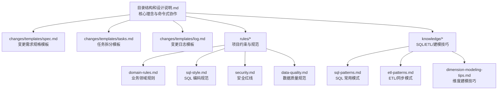
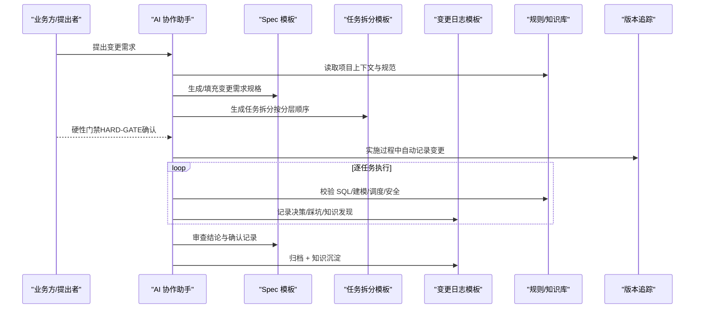
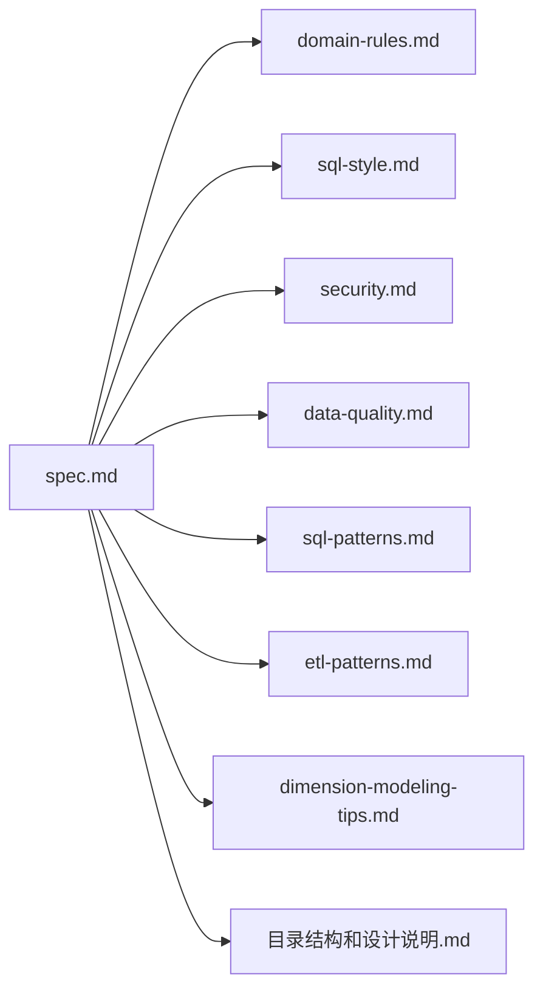

# 变更需求规格模板

<cite>
**本文引用的文件列表**
- [spec.md](file://data_warehouse_engineering_code_copilot/changes/templates/spec.md)
- [tasks.md](file://data_warehouse_engineering_code_copilot/changes/templates/tasks.md)
- [log.md](file://data_warehouse_engineering_code_copilot/changes/templates/log.md)
- [目录结构和设计说明.md](file://data_warehouse_engineering_code_copilot/目录结构和设计说明.md)
- [domain-rules.md](file://data_warehouse_engineering_code_copilot/rules/domain-rules.md)
- [sql-style.md](file://data_warehouse_engineering_code_copilot/rules/sql-style.md)
- [security.md](file://data_warehouse_engineering_code_copilot/rules/security.md)
- [data-quality.md](file://data_warehouse_engineering_code_copilot/rules/data-quality.md)
- [sql-patterns.md](file://data_warehouse_engineering_code_copilot/knowledge/sql-patterns.md)
- [etl-patterns.md](file://data_warehouse_engineering_code_copilot/knowledge/etl-patterns.md)
- [dimension-modeling-tips.md](file://data_warehouse_engineering_code_copilot/knowledge/dimension-modeling-tips.md)
</cite>

## 目录
1. [简介](#简介)
2. [项目结构](#项目结构)
3. [核心组件](#核心组件)
4. [架构总览](#架构总览)
5. [详细组件分析](#详细组件分析)
6. [依赖分析](#依赖分析)
7. [性能考量](#性能考量)
8. [故障排查指南](#故障排查指南)
9. [结论](#结论)
10. [附录](#附录)

## 简介
本技术文档围绕“变更需求规格模板”（Spec）展开，系统阐述其结构、字段填写规范、注意事项与最佳实践，并结合仓库中的规则与知识库，解释 Spec 在变更管理流程中的核心作用与价值。文档旨在帮助读者从需求描述出发，生成规范、可审计、可执行的变更规格文档，支撑后续的任务拆分、实施、审查与归档。

## 项目结构
仓库采用“提示词 + 规则 + 知识库 + 变更模板”的协同结构，其中 Spec 模板位于 changes/templates 下，配套的任务拆分、变更日志模板与其上下文规则、SQL 模式、ETL 模式、维度建模技巧共同构成完整的 Spec 驱动变更流程。

图表来源
- [目录结构和设计说明.md:19-55](file://data_warehouse_engineering_code_copilot/目录结构和设计说明.md#L19-L55)
- [spec.md:1-132](file://data_warehouse_engineering_code_copilot/changes/templates/spec.md#L1-L132)
- [tasks.md:1-74](file://data_warehouse_engineering_code_copilot/changes/templates/tasks.md#L1-L74)
- [log.md:1-61](file://data_warehouse_engineering_code_copilot/changes/templates/log.md#L1-L61)

章节来源
- [目录结构和设计说明.md:19-55](file://data_warehouse_engineering_code_copilot/目录结构和设计说明.md#L19-L55)

## 核心组件
- 变更需求规格模板（Spec）：定义变更背景、现状分析、功能点、业务规则、模型变更（DDL）、SQL 设计、ETL/同步、调度、数据质量、影响范围、风险与关注点、验证策略、待澄清、技术决策、执行日志、审查结论与确认记录等。
- 任务拆分模板（Tasks）：按 ODS→DIM→DWD→DWS→ADS→调度→DQ→权限的顺序拆解原子变更，明确目标、分层、涉及变更、关键 DDL/SQL、依赖、验收标准、验证方法与回刷计划。
- 变更日志模板（Log）：记录决策、踩坑与知识发现，沉淀到知识库，形成知识飞轮。

章节来源
- [spec.md:1-132](file://data_warehouse_engineering_code_copilot/changes/templates/spec.md#L1-L132)
- [tasks.md:1-74](file://data_warehouse_engineering_code_copilot/changes/templates/tasks.md#L1-L74)
- [log.md:1-61](file://data_warehouse_engineering_code_copilot/changes/templates/log.md#L1-L61)

## 架构总览
Spec 驱动的变更管理流程强调“需求 → 规格 → 任务 → 实施 → 审查 → 归档”，贯穿统一的规范与知识复用，确保每次变更可审计、可回溯、可沉淀。

图表来源
- [目录结构和设计说明.md:126-151](file://data_warehouse_engineering_code_copilot/目录结构和设计说明.md#L126-L151)
- [目录结构和设计说明.md:98-105](file://data_warehouse_engineering_code_copilot/目录结构和设计说明.md#L98-L105)

## 详细组件分析

### 1. 变更背景与目标（Section 8-10）
- 填写要点：
  - 明确“为什么做”以及“做完后的可验证效果”（表、指标、粒度、SLA）。
  - 与业务目标对齐，避免仅描述技术动作。
- 注意事项：
  - 避免空泛表述，必须可验证、可追踪。
- 最佳实践：
  - 以“指标口径 + 产出表/分区 + SLA 基线”三要素闭环描述目标。

章节来源
- [spec.md:8-10](file://data_warehouse_engineering_code_copilot/changes/templates/spec.md#L8-L10)

### 2. 现状分析（Section 12-36）
- 数据源与数据流（Section 16-21）：
  - 业务系统、接入方式（JDBC 全量/增量/CDC/文件/API）、数据延迟、已有上游表/作业。
  - 每个结论必须有出处（库.表.字段、作业名、SQL 片段、调度页面截图）。
- 现有模型结构（Section 23-31）：
  - 分层、表名、粒度、分区、行数量级、备注。
- 现有指标/口径（Section 28-31）：
  - 指标、当前定义、责任表、备注。
- 风险与发现（Section 33-36）：
  - 列举风险点，与现状分析呼应。

章节来源
- [spec.md:16-36](file://data_warehouse_engineering_code_copilot/changes/templates/spec.md#L16-L36)

### 3. 功能点（Section 38-40）
- 以“输入 → 计算逻辑 → 产出表/分区”的结构描述每个功能点。
- 与 DDL/SQL/ETL/调度设计一一对应。

章节来源
- [spec.md:38-40](file://data_warehouse_engineering_code_copilot/changes/templates/spec.md#L38-L40)

### 4. 业务规则与口径（Section 42-47）
- 每条规则必须可验证，且提供判定 SQL 片段。
- 与 domain-rules.md 的业务口径、KPI 定义、行业规则保持一致。

章节来源
- [spec.md:42-47](file://data_warehouse_engineering_code_copilot/changes/templates/spec.md#L42-L47)
- [domain-rules.md:45-66](file://data_warehouse_engineering_code_copilot/rules/domain-rules.md#L45-L66)

### 5. 模型变更（DDL）（Section 49-65）
- DDL 变更清单（Section 51-55）：操作（新建/修改/删除）、分层、库.表名、字段/分区/索引、说明。
- 关键 DDL（Section 57-65）：伪代码或完整 DDL，遵循命名规范与分区约定。

章节来源
- [spec.md:49-65](file://data_warehouse_engineering_code_copilot/changes/templates/spec.md#L49-L65)
- [sql-style.md:9-18](file://data_warehouse_engineering_code_copilot/rules/sql-style.md#L9-L18)
- [sql-style.md:20-47](file://data_warehouse_engineering_code_copilot/rules/sql-style.md#L20-L47)
- [sql-style.md:80-87](file://data_warehouse_engineering_code_copilot/rules/sql-style.md#L80-L87)

### 6. SQL 加工设计（Section 67-70）
- 脚本、输入表、输出表、调度周期、关键逻辑摘要。
- 与 sql-patterns.md 的常见模式（去重、拉链、同环比、TopN、累计求和、行转列/列转行、回刷、Lambda 合并、缺失日期补齐、NULL 安全比较）相呼应。

章节来源
- [spec.md:67-70](file://data_warehouse_engineering_code_copilot/changes/templates/spec.md#L67-L70)
- [sql-patterns.md:6-38](file://data_warehouse_engineering_code_copilot/knowledge/sql-patterns.md#L6-L38)
- [sql-patterns.md:42-94](file://data_warehouse_engineering_code_copilot/knowledge/sql-patterns.md#L42-L94)
- [sql-patterns.md:97-141](file://data_warehouse_engineering_code_copilot/knowledge/sql-patterns.md#L97-L141)
- [sql-patterns.md:144-168](file://data_warehouse_engineering_code_copilot/knowledge/sql-patterns.md#L144-L168)
- [sql-patterns.md:171-195](file://data_warehouse_engineering_code_copilot/knowledge/sql-patterns.md#L171-L195)
- [sql-patterns.md:198-229](file://data_warehouse_engineering_code_copilot/knowledge/sql-patterns.md#L198-L229)
- [sql-patterns.md:232-255](file://data_warehouse_engineering_code_copilot/knowledge/sql-patterns.md#L232-L255)
- [sql-patterns.md:258-286](file://data_warehouse_engineering_code_copilot/knowledge/sql-patterns.md#L258-L286)
- [sql-patterns.md:289-308](file://data_warehouse_engineering_code_copilot/knowledge/sql-patterns.md#L289-L308)
- [sql-patterns.md:311-331](file://data_warehouse_engineering_code_copilot/knowledge/sql-patterns.md#L311-L331)

### 7. ETL/同步变更（Section 72-76）
- 任务名、源→目标、同步类型（全量/增量/CDC）、调度、说明。
- 与 etl-patterns.md 的 CDC、JDBC 增量、MERGE/UPSERT、小文件控制、历史回刷、文件接入、API 拉取、全量/增量/CDC 选型对照、时区处理等一致。

章节来源
- [spec.md:72-76](file://data_warehouse_engineering_code_copilot/changes/templates/spec.md#L72-L76)
- [etl-patterns.md:6-27](file://data_warehouse_engineering_code_copilot/knowledge/etl-patterns.md#L6-L27)
- [etl-patterns.md:30-54](file://data_warehouse_engineering_code_copilot/knowledge/etl-patterns.md#L30-L54)
- [etl-patterns.md:57-87](file://data_warehouse_engineering_code_copilot/knowledge/etl-patterns.md#L57-L87)
- [etl-patterns.md:90-119](file://data_warehouse_engineering_code_copilot/knowledge/etl-patterns.md#L90-L119)
- [etl-patterns.md:122-152](file://data_warehouse_engineering_code_copilot/knowledge/etl-patterns.md#L122-L152)
- [etl-patterns.md:155-171](file://data_warehouse_engineering_code_copilot/knowledge/etl-patterns.md#L155-L171)
- [etl-patterns.md:174-189](file://data_warehouse_engineering_code_copilot/knowledge/etl-patterns.md#L174-L189)
- [etl-patterns.md:192-203](file://data_warehouse_engineering_code_copilot/knowledge/etl-patterns.md#L192-L203)
- [etl-patterns.md:206-220](file://data_warehouse_engineering_code_copilot/knowledge/etl-patterns.md#L206-L220)

### 8. 调度变更（Section 78-82）
- 作业名、类型、上游依赖、下游影响、调度周期、SLA/基线、重试。
- 与 data-quality.md 的 SLA 基线、DQ 上线流程一致。

章节来源
- [spec.md:78-82](file://data_warehouse_engineering_code_copilot/changes/templates/spec.md#L78-L82)
- [data-quality.md:115-122](file://data_warehouse_engineering_code_copilot/rules/data-quality.md#L115-L122)

### 9. 数据质量规则（DQ）（Section 83-92）
- 五维度：完整性、唯一性、一致性、准确性、时效性。
- 判定 SQL、阈值、严重等级（P0/P1/P2）。
- 与 data-quality.md 的五维度、规则模板、严重等级、上线流程一致。

章节来源
- [spec.md:83-92](file://data_warehouse_engineering_code_copilot/changes/templates/spec.md#L83-L92)
- [data-quality.md:9-18](file://data_warehouse_engineering_code_copilot/rules/data-quality.md#L9-L18)
- [data-quality.md:35-101](file://data_warehouse_engineering_code_copilot/rules/data-quality.md#L35-L101)
- [data-quality.md:102-114](file://data_warehouse_engineering_code_copilot/rules/data-quality.md#L102-L114)
- [data-quality.md:115-122](file://data_warehouse_engineering_code_copilot/rules/data-quality.md#L115-L122)

### 10. 影响范围（Section 93-98）
- 影响的下游表、报表/API、用户/角色、是否涉及历史回刷（如是，标明分区范围）。
- 与 etl-patterns.md 的历史回刷流程一致。

章节来源
- [spec.md:93-98](file://data_warehouse_engineering_code_copilot/changes/templates/spec.md#L93-L98)
- [etl-patterns.md:122-152](file://data_warehouse_engineering_code_copilot/knowledge/etl-patterns.md#L122-L152)

### 11. 风险与关注点（Section 100-102）
- 涉及生产数据、PII、财务、历史回刷必须标注。
- 与 security.md 的安全红线一致。

章节来源
- [spec.md:100-102](file://data_warehouse_engineering_code_copilot/changes/templates/spec.md#L100-L102)
- [security.md:7-13](file://data_warehouse_engineering_code_copilot/rules/security.md#L7-L13)

### 12. 验证策略（Section 104-111）
- 数据准确性验证、行数核验、抽样校验、性能验证、回刷验证、用户验收。
- 与 data-quality.md 的 DQ 上线流程一致。

章节来源
- [spec.md:104-111](file://data_warehouse_engineering_code_copilot/changes/templates/spec.md#L104-L111)
- [data-quality.md:115-122](file://data_warehouse_engineering_code_copilot/rules/data-quality.md#L115-L122)

### 13. 待澄清（Section 113-115）
- 问题清单，全部解决后才能进入 /apply。

章节来源
- [spec.md:113-115](file://data_warehouse_engineering_code_copilot/changes/templates/spec.md#L113-L115)

### 14. 技术决策（Section 117）
- 记录关键决策与取舍。

章节来源
- [spec.md:117](file://data_warehouse_engineering_code_copilot/changes/templates/spec.md#L117)

### 15. 执行日志（Section 119-123）
- 任务、状态、实际改动、备注。
- 与 tasks.md 的任务执行与验收标准一致。

章节来源
- [spec.md:119-123](file://data_warehouse_engineering_code_copilot/changes/templates/spec.md#L119-L123)
- [tasks.md:41-53](file://data_warehouse_engineering_code_copilot/changes/templates/tasks.md#L41-L53)

### 16. 审查结论（Section 124）
- 三阶段审查（合规→模型→SQL）结论。

章节来源
- [spec.md:124](file://data_warehouse_engineering_code_copilot/changes/templates/spec.md#L124)

### 17. 确认记录（HARD-GATE）（Section 126-132）
- 硬性门禁，必须有确认时间、确认人、数据负责人、业务负责人。

章节来源
- [spec.md:126-132](file://data_warehouse_engineering_code_copilot/changes/templates/spec.md#L126-L132)

## 依赖分析
- 规则依赖：domain-rules.md、sql-style.md、security.md、data-quality.md。
- 知识依赖：sql-patterns.md、etl-patterns.md、dimension-modeling-tips.md。
- 流程依赖：目录结构和设计说明.md 中的命令式协作与强制变更追踪。

图表来源
- [spec.md:1-132](file://data_warehouse_engineering_code_copilot/changes/templates/spec.md#L1-L132)
- [domain-rules.md:1-142](file://data_warehouse_engineering_code_copilot/rules/domain-rules.md#L1-L142)
- [sql-style.md:1-254](file://data_warehouse_engineering_code_copilot/rules/sql-style.md#L1-L254)
- [security.md:1-98](file://data_warehouse_engineering_code_copilot/rules/security.md#L1-L98)
- [data-quality.md:1-195](file://data_warehouse_engineering_code_copilot/rules/data-quality.md#L1-L195)
- [sql-patterns.md:1-331](file://data_warehouse_engineering_code_copilot/knowledge/sql-patterns.md#L1-L331)
- [etl-patterns.md:1-220](file://data_warehouse_engineering_code_copilot/knowledge/etl-patterns.md#L1-L220)
- [dimension-modeling-tips.md:1-253](file://data_warehouse_engineering_code_copilot/knowledge/dimension-modeling-tips.md#L1-L253)
- [目录结构和设计说明.md:59-105](file://data_warehouse_engineering_code_copilot/目录结构和设计说明.md#L59-L105)

章节来源
- [目录结构和设计说明.md:59-105](file://data_warehouse_engineering_code_copilot/目录结构和设计说明.md#L59-L105)

## 性能考量
- SQL 编写原则：分区裁剪、CTE、Map Join、GROUP BY 优先、避免 SELECT *、函数包裹分区字段等。
- ETL 优化：CDC 位点保护、JDBC 增量水位、MERGE/UPSERT、小文件控制、历史回刷分批并发。
- 维度建模：代理键/业务键、SCD 类型、桥接表、退化维度、一致性维度、事实表类型选择。

章节来源
- [sql-style.md:165-201](file://data_warehouse_engineering_code_copilot/rules/sql-style.md#L165-L201)
- [etl-patterns.md:90-119](file://data_warehouse_engineering_code_copilot/knowledge/etl-patterns.md#L90-L119)
- [dimension-modeling-tips.md:5-36](file://data_warehouse_engineering_code_copilot/knowledge/dimension-modeling-tips.md#L5-L36)
- [dimension-modeling-tips.md:39-83](file://data_warehouse_engineering_code_copilot/knowledge/dimension-modeling-tips.md#L39-L83)
- [dimension-modeling-tips.md:86-122](file://data_warehouse_engineering_code_copilot/knowledge/dimension-modeling-tips.md#L86-L122)
- [dimension-modeling-tips.md:125-155](file://data_warehouse_engineering_code_copilot/knowledge/dimension-modeling-tips.md#L125-L155)
- [dimension-modeling-tips.md:158-176](file://data_warehouse_engineering_code_copilot/knowledge/dimension-modeling-tips.md#L158-L176)
- [dimension-modeling-tips.md:179-204](file://data_warehouse_engineering_code_copilot/knowledge/dimension-modeling-tips.md#L179-L204)
- [dimension-modeling-tips.md:207-231](file://data_warehouse_engineering_code_copilot/knowledge/dimension-modeling-tips.md#L207-L231)

## 故障排查指南
- 规则冲突：以 Spec 为准，实现与 Spec 冲突时，错误在实现。
- 变更追踪：version-tracker 自动记录每次 DDL/SQL/ETL/调度变更，确保可审计。
- DQ 失败：P0 必须阻断，P1/P2 需按严重等级处理与修复。
- 安全问题：涉及 PII/财务/回刷必须标注并遵循安全红线。
- 回刷异常：按 etl-patterns.md 的分批回刷流程与失败处理机制执行。

章节来源
- [目录结构和设计说明.md:64-68](file://data_warehouse_engineering_code_copilot/目录结构和设计说明.md#L64-L68)
- [目录结构和设计说明.md:98-105](file://data_warehouse_engineering_code_copilot/目录结构和设计说明.md#L98-L105)
- [data-quality.md:102-114](file://data_warehouse_engineering_code_copilot/rules/data-quality.md#L102-L114)
- [security.md:69-79](file://data_warehouse_engineering_code_copilot/rules/security.md#L69-L79)
- [etl-patterns.md:122-152](file://data_warehouse_engineering_code_copilot/knowledge/etl-patterns.md#L122-L152)

## 结论
Spec 模板是数仓工程化的“核心资产”，它将需求转化为可执行、可验证、可审计的规范蓝图。通过与规则与知识库的强耦合，Spec 驱动的任务拆分、实施、审查与归档形成闭环，确保变更质量与可追溯性，提升团队协作效率与交付稳定性。

## 附录
- 使用示例（流程示意）：
  - 业务方提出需求 → AI 读取 rules/project-context.md 与规范 → 自动生成 changes/<change>/spec.md 与 tasks.md → 硬性门禁确认 → /apply 实施 → /review 三阶段审查 → /archive 归档 + 知识沉淀。
- 关键参考：
  - 命令式协作：/sql、/etl、/model、/propose、/apply、/review、/optimize、/dq、/schedule、/archive。
  - 强制变更追踪：version-tracker 自动记录每次变更。

章节来源
- [目录结构和设计说明.md:80-97](file://data_warehouse_engineering_code_copilot/目录结构和设计说明.md#L80-L97)
- [目录结构和设计说明.md:126-151](file://data_warehouse_engineering_code_copilot/目录结构和设计说明.md#L126-L151)