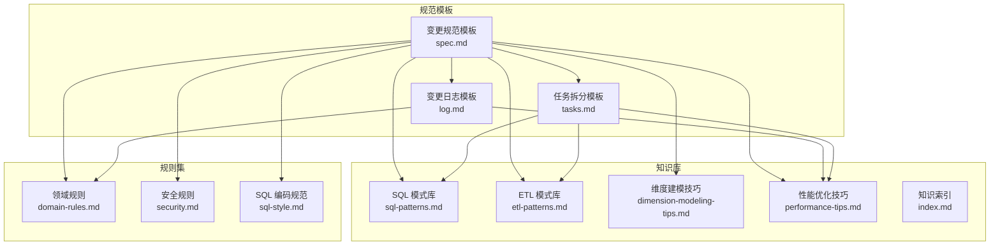
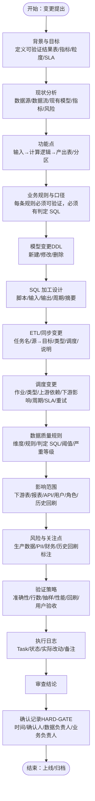
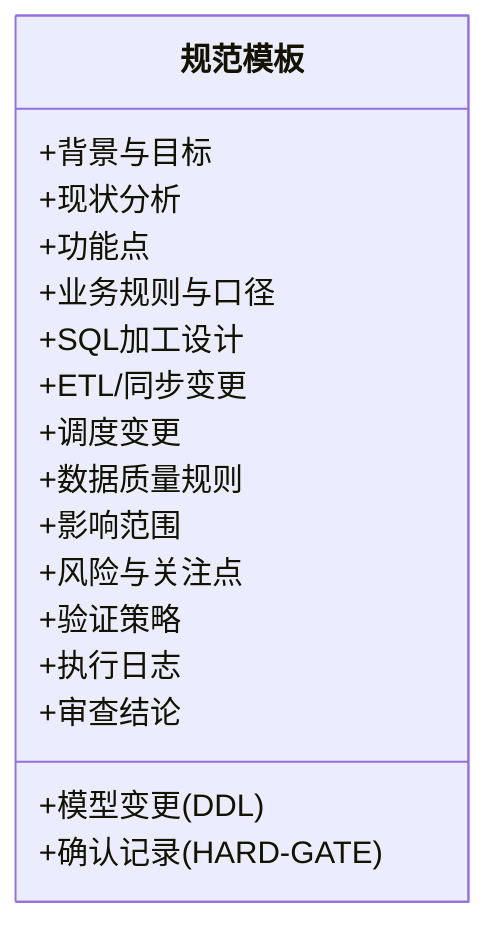
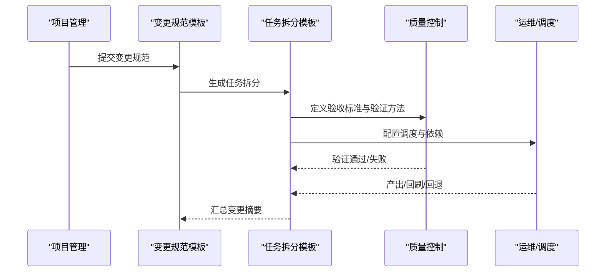
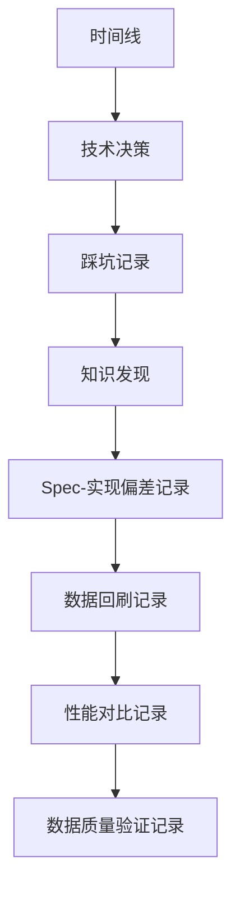
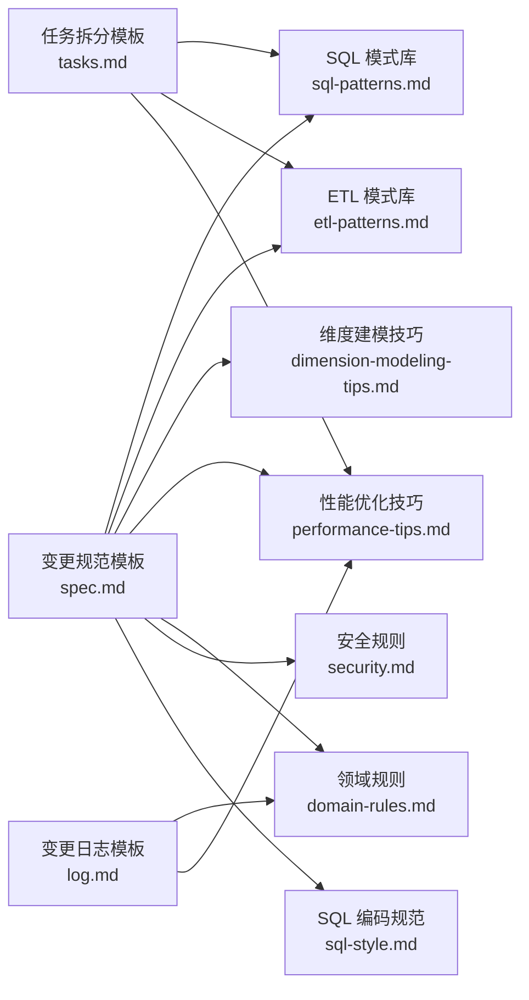

# 验证规范模板

<cite>
**本文引用的文件**
- [spec.md](file://data_warehouse_engineering_code_copilot/changes/templates/spec.md)
- [tasks.md](file://data_warehouse_engineering_code_copilot/changes/templates/tasks.md)
- [log.md](file://data_warehouse_engineering_code_copilot/changes/templates/log.md)
- [index.md](file://data_warehouse_engineering_code_copilot/knowledge/index.md)
- [sql-patterns.md](file://data_warehouse_engineering_code_copilot/knowledge/sql-patterns.md)
- [etl-patterns.md](file://data_warehouse_engineering_code_copilot/knowledge/etl-patterns.md)
- [dimension-modeling-tips.md](file://data_warehouse_engineering_code_copilot/knowledge/dimension-modeling-tips.md)
- [performance-tips.md](file://data_warehouse_engineering_code_copilot/knowledge/performance-tips.md)
- [domain-rules.md](file://data_warehouse_engineering_code_copilot/rules/domain-rules.md)
- [security.md](file://data_warehouse_engineering_code_copilot/rules/security.md)
- [sql-style.md](file://data_warehouse_engineering_code_copilot/rules/sql-style.md)
</cite>

## 目录
1. [简介](#简介)
2. [项目结构](#项目结构)
3. [核心组件](#核心组件)
4. [架构总览](#架构总览)
5. [详细组件分析](#详细组件分析)
6. [依赖关系分析](#依赖关系分析)
7. [性能考量](#性能考量)
8. [故障排查指南](#故障排查指南)
9. [结论](#结论)
10. [附录](#附录)

## 简介
本文件围绕“验证规范模板”（validation-spec.md）进行系统化技术文档编制，旨在帮助读者理解变更验证规范的设计目的、使用方法与最佳实践。文档以仓库中的变更规范模板、任务拆分模板、变更日志模板以及知识库中的 SQL 模式、ETL 模式、维度建模技巧、性能优化知识、领域规则、安全规则和 SQL 编码规范为基础，构建从“背景与目标”到“验证策略”的闭环流程，强调数据完整性、业务逻辑验证、性能指标评估与质量控制的关键作用，并提供可操作的编写示例与落地建议。

## 项目结构
本仓库围绕数据仓库工程实践，形成“变更规范模板 + 任务拆分模板 + 变更日志模板 + 知识库 + 规则集”的协同体系：
- 变更规范模板：定义变更背景、现状分析、功能点、业务规则、模型变更、SQL 设计、ETL/同步、调度、数据质量、影响范围、风险与关注点、验证策略、执行日志、审查结论与确认记录等。
- 任务拆分模板：将变更拆解为可独立验证的原子任务，明确目标、分层、涉及变更、关键 DDL/SQL、依赖、验收标准、验证方法、回刷计划等。
- 变更日志模板：记录时间线、技术决策、踩坑记录、知识发现、Spec-实现偏差、回刷记录、性能对比、DQ 验证记录等。
- 知识库：SQL 模式库、ETL 模式库、维度建模技巧、性能优化技巧、业务知识、技术约定等，支撑规范编写与验证。
- 规则集：领域规则（业务口径、KPI 定义、数据质量）、安全红线、SQL 编码规范，确保规范与工程实践一致。

图表来源
- [spec.md:1-132](file://data_warehouse_engineering_code_copilot/changes/templates/spec.md#L1-L132)
- [tasks.md:1-74](file://data_warehouse_engineering_code_copilot/changes/templates/tasks.md#L1-L74)
- [log.md:1-61](file://data_warehouse_engineering_code_copilot/changes/templates/log.md#L1-L61)
- [index.md:1-60](file://data_warehouse_engineering_code_copilot/knowledge/index.md#L1-L60)

章节来源
- [spec.md:1-132](file://data_warehouse_engineering_code_copilot/changes/templates/spec.md#L1-L132)
- [tasks.md:1-74](file://data_warehouse_engineering_code_copilot/changes/templates/tasks.md#L1-L74)
- [log.md:1-61](file://data_warehouse_engineering_code_copilot/changes/templates/log.md#L1-L61)
- [index.md:1-60](file://data_warehouse_engineering_code_copilot/knowledge/index.md#L1-L60)

## 核心组件
- 变更规范模板（spec.md）：定义变更的背景、现状、功能点、业务规则、模型/SQL/ETL/调度/数据质量、影响范围、风险与关注点、验证策略、执行日志、审查结论与确认记录等，是验证规范的骨架。
- 任务拆分模板（tasks.md）：将变更拆解为可独立验证的原子任务，明确每个任务的目标、分层、涉及变更、关键 DDL/SQL、依赖、验收标准、验证方法、回刷计划等，是验证规范的执行单元。
- 变更日志模板（log.md）：记录变更过程中的技术决策、踩坑、知识发现、Spec-实现偏差、回刷记录、性能对比、DQ 验证记录等，是验证规范的证据链与沉淀。
- 知识库（sql-patterns.md、etl-patterns.md、dimension-modeling-tips.md、performance-tips.md、index.md）：提供可复用的 SQL/ETL/建模/性能模式与最佳实践，支撑规范编写与验证。
- 规则集（domain-rules.md、security.md、sql-style.md）：提供业务口径、数据质量、安全与 SQL 编码规范，确保规范与工程实践一致。

章节来源
- [spec.md:104-112](file://data_warehouse_engineering_code_copilot/changes/templates/spec.md#L104-L112)
- [tasks.md:15-52](file://data_warehouse_engineering_code_copilot/changes/templates/tasks.md#L15-L52)
- [log.md:36-59](file://data_warehouse_engineering_code_copilot/changes/templates/log.md#L36-L59)
- [index.md:6-60](file://data_warehouse_engineering_code_copilot/knowledge/index.md#L6-L60)

## 架构总览
验证规范模板的架构围绕“变更驱动 + 原子任务 + 可验证性 + 质量控制 + 持续沉淀”的闭环展开：
- 变更驱动：从背景与目标出发，明确可验证的结果描述（表、指标、粒度、SLA）。
- 原子任务：将变更拆解为可独立验证的任务，每个任务具备明确的验收标准与验证方法。
- 可验证性：验证策略覆盖数据准确性、行数核验、抽样校验、性能验证、回刷验证、用户验收等。
- 质量控制：数据质量规则（完整性、唯一性、一致性、准确性、时效性）与严重等级（阻断/告警/监控）贯穿始终。
- 持续沉淀：变更日志记录技术决策、踩坑、知识发现与 Spec-实现偏差，形成知识飞轮。

图表来源
- [spec.md:8-132](file://data_warehouse_engineering_code_copilot/changes/templates/spec.md#L8-L132)

章节来源
- [spec.md:8-132](file://data_warehouse_engineering_code_copilot/changes/templates/spec.md#L8-L132)

## 详细组件分析

### 组件A：变更规范模板（spec.md）
- 设计目的：为变更提供标准化的“验证蓝图”，确保变更在设计阶段就明确可验证性、质量控制与风险管控。
- 使用方法：
  - 在“背景与目标”中明确可验证的结果描述（表、指标、粒度、SLA）。
  - 在“现状分析”中引用出处（库.表.字段、作业名、SQL 片段、调度页面截图）。
  - 在“业务规则与口径”中为每条规则提供可验证的判定 SQL 片段。
  - 在“数据质量规则”中定义维度、规则、判定 SQL、阈值与严重等级。
  - 在“验证策略”中覆盖数据准确性、行数核验、抽样校验、性能验证、回刷验证、用户验收。
- 关键作用：
  - 质量控制：通过 DQ 规则与严重等级，将质量门槛前置到设计阶段。
  - 风险管控：通过风险与关注点标注，确保涉及生产数据、PII、财务、历史回刷的变更得到特别关注。
  - 可追溯性：通过执行日志与审查结论，形成完整的变更证据链。

图表来源
- [spec.md:1-132](file://data_warehouse_engineering_code_copilot/changes/templates/spec.md#L1-L132)

章节来源
- [spec.md:8-132](file://data_warehouse_engineering_code_copilot/changes/templates/spec.md#L8-L132)

### 组件B：任务拆分模板（tasks.md）
- 设计目的：将变更拆解为可独立验证的原子任务，确保每个任务具备明确的验收标准与验证方法。
- 使用方法：
  - 明确前置条件（数据源连接、项目上下文、上游表、调度资源等）。
  - 为每个 Task 定义目标、分层、涉及变更（DDL/SQL/ETL/调度）、关键 DDL/SQL、依赖、验收标准、验证方法、回刷计划。
  - 在“变更摘要”中汇总新建/修改表数、脚本数、调度作业数、DQ 规则数、历史回刷分区数、Spec-Plan 偏差记录、性能影响评估、上线后观察期与回退方案、遗留问题。
- 关键作用：
  - 原子化验证：每个任务可独立验证，降低变更风险。
  - 可追溯性：通过验收标准与验证方法，确保任务完成质量。

图表来源
- [tasks.md:3-74](file://data_warehouse_engineering_code_copilot/changes/templates/tasks.md#L3-L74)

章节来源
- [tasks.md:3-74](file://data_warehouse_engineering_code_copilot/changes/templates/tasks.md#L3-L74)

### 组件C：变更日志模板（log.md）
- 设计目的：记录变更过程中的技术决策、踩坑、知识发现、Spec-实现偏差、回刷记录、性能对比、DQ 验证记录等，形成知识飞轮。
- 使用方法：
  - 在“时间线”中记录关键事件与备注。
  - 在“技术决策”中记录决策、选择、放弃的方案与原因。
  - 在“踩坑记录”中记录问题、原因、解决方案与沉淀。
  - 在“知识发现”中记录关键词与分类标签，便于检索。
  - 在“Spec-实现偏差记录”中记录偏差点、预期与实际情况、处理方式。
  - 在“数据回刷记录”“性能对比记录”“数据质量验证记录”中量化对比与验证结果。
- 关键作用：
  - 知识沉淀：将经验固化为可检索的知识条目。
  - 偏差追踪：通过偏差记录，确保问题闭环。
  - 证据链：为审查与归档提供完整证据。

图表来源
- [log.md:5-61](file://data_warehouse_engineering_code_copilot/changes/templates/log.md#L5-L61)

章节来源
- [log.md:5-61](file://data_warehouse_engineering_code_copilot/changes/templates/log.md#L5-L61)

### 组件D：知识库与规则集
- 知识库（sql-patterns.md、etl-patterns.md、dimension-modeling-tips.md、performance-tips.md、index.md）：
  - SQL 模式库：提供去重保留最新、拉链表（SCD2）、同环比、TopN、累计求和、行转列/列转行、数据回刷、增量+全量合并、缺失日期补齐、NULL 安全比较等模式，支撑规范中的业务规则与 SQL 设计。
  - ETL 模式库：提供 CDC 增量同步、JDBC 增量抽取、MERGE/UPSERT、小文件控制、历史回刷、文件接入、API 拉取、全量/增量/CDC 选型对照、数据漂移与时区处理等模式，支撑规范中的 ETL/同步与调度设计。
  - 维度建模技巧：提供代理键/业务键、SCD 三种类型、桥接表、退化维度、一致性维度、事实表类型选择、维度表分级、分层归属判定等，支撑规范中的模型变更与口径设计。
  - 性能优化技巧：提供分区裁剪、数据倾斜、Map Join/Broadcast Join、小文件问题、CTE/ WITH 物化策略、谓词下推与列裁剪、Join 顺序与类型、窗口函数性能、存储格式与压缩、调度与资源、性能分析工具等，支撑规范中的性能验证与优化。
  - 知识索引：提供 SQL 模式、ETL 模式、维度建模、性能优化、业务知识、技术约定的轻量索引，便于检索与复用。
- 规则集（domain-rules.md、security.md、sql-style.md）：
  - 领域规则：提供通用业务规则、KPI/指标定义标准、数据质量规则（五大维度与严重等级）、历史数据约定、行业特定规则、跨系统口径一致性、项目特定规则等，确保规范与业务一致。
  - 安全规则：提供数据安全、字段级脱敏、行级权限（RLS）、数据分级与访问控制、上线与发布安全、数据回刷安全、业务安全、跨境合规、安全审计、应急响应等，确保规范满足安全要求。
  - SQL 编码规范：提供命名约定（库/表/字段/分区）、格式规范（关键字大小写、缩进与换行、头部注释、行内注释）、SQL 编写原则（性能优先、正确性优先、可维护性）、禁止事项、命名检查清单、常见错误对照等，确保规范可读、可维护、可复用。

章节来源
- [sql-patterns.md:1-331](file://data_warehouse_engineering_code_copilot/knowledge/sql-patterns.md#L1-L331)
- [etl-patterns.md:1-220](file://data_warehouse_engineering_code_copilot/knowledge/etl-patterns.md#L1-L220)
- [dimension-modeling-tips.md:1-253](file://data_warehouse_engineering_code_copilot/knowledge/dimension-modeling-tips.md#L1-L253)
- [performance-tips.md:1-349](file://data_warehouse_engineering_code_copilot/knowledge/performance-tips.md#L1-L349)
- [index.md:1-60](file://data_warehouse_engineering_code_copilot/knowledge/index.md#L1-L60)
- [domain-rules.md:69-91](file://data_warehouse_engineering_code_copilot/rules/domain-rules.md#L69-L91)
- [security.md:7-98](file://data_warehouse_engineering_code_copilot/rules/security.md#L7-L98)
- [sql-style.md:7-254](file://data_warehouse_engineering_code_copilot/rules/sql-style.md#L7-L254)

## 依赖关系分析
验证规范模板与知识库、规则集之间存在紧密的依赖关系：
- 规范模板依赖知识库中的 SQL/ETL/建模/性能模式，确保业务规则与 SQL 设计、ETL/同步与调度设计、模型变更与口径设计具备可复用的最佳实践。
- 规范模板依赖规则集中的领域规则、安全规则与 SQL 编码规范，确保变更满足业务口径、数据质量、安全与编码规范要求。
- 任务拆分模板与变更日志模板依赖规范模板，形成从“规范—任务—日志”的闭环。

图表来源
- [spec.md:1-132](file://data_warehouse_engineering_code_copilot/changes/templates/spec.md#L1-L132)
- [tasks.md:1-74](file://data_warehouse_engineering_code_copilot/changes/templates/tasks.md#L1-L74)
- [log.md:1-61](file://data_warehouse_engineering_code_copilot/changes/templates/log.md#L1-L61)

章节来源
- [spec.md:1-132](file://data_warehouse_engineering_code_copilot/changes/templates/spec.md#L1-L132)
- [tasks.md:1-74](file://data_warehouse_engineering_code_copilot/changes/templates/tasks.md#L1-L74)
- [log.md:1-61](file://data_warehouse_engineering_code_copilot/changes/templates/log.md#L1-L61)

## 性能考量
- 分区裁剪：大型分区表的 WHERE 条件必须直接命中分区字段，禁止用函数包裹，确保扫描量最小化。
- 数据倾斜：通过过滤/单独处理、加盐打散、Map Join 小表等方式缓解热点数据导致的任务卡顿与 OOM。
- Map Join/Broadcast Join：当 Join 一侧是小表时，广播小表到每个 Map Task，避免 Shuffle，提升性能。
- 小文件问题：通过输出端控制 reduce 数、AQE 自动合并、周期性合并等手段控制小文件数量，降低元数据压力与查询开销。
- CTE/ WITH 物化策略：在 Hive/Spark 中默认不物化，需根据引用次数与复杂度决定是否物化为临时表或显式 CACHE。
- 谓词下推与列裁剪：将 WHERE 条件下推到数据源层，减少扫描；只读必要列，利用列存格式的列裁剪收益。
- Join 顺序与类型：根据引擎特性选择 Broadcast Hash Join、Shuffle Hash Join、Sort Merge Join 或 Bucket Join，减少 Shuffle。
- 窗口函数性能：合理设置 PARTITION BY 列基数，避免全局排序，必要时配合 DISTRIBUTE BY 与预排序。
- 存储格式与压缩：优先采用 ORC/Parquet 等列存格式，结合 ZSTD 等高压缩比算法，提升查询性能与存储效率。
- 调度与资源：按主题/优先级划分队列，错峰调度，SLA 基线与失败重试策略确保稳定性。

章节来源
- [performance-tips.md:5-349](file://data_warehouse_engineering_code_copilot/knowledge/performance-tips.md#L5-L349)

## 故障排查指南
- 数据完整性：检查非空率、分区字段一致性、上游/下游行数差异，确保完整性规则通过。
- 唯一性：验证主键不重复，必要时进行去重处理。
- 一致性：跨系统/上下游对齐，行数差异与金额差异需在阈值范围内。
- 准确性：与业务库直查对账，确保指标口径一致。
- 时效性：检查产出时间是否满足 SLA 基线。
- 性能异常：通过 EXPLAIN 查看执行计划，定位慢 stage；利用作业历史与 Profile/Stage Metrics 分析单 task 数据量、运行时长与 shuffle 读写量；通过数据采样找出倾斜键。
- 安全问题：核查凭据是否硬编码、PII 是否脱敏、RLS 是否正确配置、访问控制是否满足分级要求。
- 规范不符：检查命名是否符合 SQL 编码规范、是否使用 SELECT *、是否在最外层不必要的 ORDER BY、是否函数包裹分区字段等。

章节来源
- [domain-rules.md:69-91](file://data_warehouse_engineering_code_copilot/rules/domain-rules.md#L69-L91)
- [security.md:7-98](file://data_warehouse_engineering_code_copilot/rules/security.md#L7-L98)
- [sql-style.md:165-254](file://data_warehouse_engineering_code_copilot/rules/sql-style.md#L165-L254)
- [performance-tips.md:327-349](file://data_warehouse_engineering_code_copilot/knowledge/performance-tips.md#L327-L349)

## 结论
验证规范模板通过“变更驱动 + 原子任务 + 可验证性 + 质量控制 + 持续沉淀”的闭环，确保变更在设计阶段就具备明确的可验证性、质量门槛与风险管控。依托知识库与规则集，规范模板能够快速复用最佳实践，降低变更风险，提升数据质量与系统稳定性。建议在实际使用中：
- 在“背景与目标”中明确可验证的结果描述；
- 在“业务规则与口径”中为每条规则提供可验证的判定 SQL；
- 在“数据质量规则”中定义维度、规则、判定 SQL、阈值与严重等级；
- 在“验证策略”中覆盖准确性、行数、抽样、性能、回刷与用户验收；
- 在“执行日志”中记录任务状态与实际改动；
- 在“审查结论”与“确认记录（HARD-GATE）”中完成质量门禁；
- 在“变更日志”中沉淀技术决策、踩坑与知识发现，形成知识飞轮。

## 附录
- 编写示例与最佳实践：
  - 在“现状分析”中引用出处（库.表.字段、作业名、SQL 片段、调度页面截图）。
  - 在“业务规则与口径”中为每条规则提供判定 SQL 片段，确保可验证。
  - 在“数据质量规则”中定义五大维度与严重等级，明确阈值与判定 SQL。
  - 在“验证策略”中覆盖准确性、行数核验、抽样校验、性能验证、回刷验证、用户验收。
  - 在“执行日志”中记录每个任务的验收标准与验证方法，确保可追溯。
  - 在“变更摘要”中汇总新建/修改表数、脚本数、调度作业数、DQ 规则数、历史回刷分区数、Spec-Plan 偏差记录、性能影响评估、上线后观察期与回退方案、遗留问题。
- 参考文件路径：
  - [spec.md](file://data_warehouse_engineering_code_copilot/changes/templates/spec.md)
  - [tasks.md](file://data_warehouse_engineering_code_copilot/changes/templates/tasks.md)
  - [log.md](file://data_warehouse_engineering_code_copilot/changes/templates/log.md)
  - [sql-patterns.md](file://data_warehouse_engineering_code_copilot/knowledge/sql-patterns.md)
  - [etl-patterns.md](file://data_warehouse_engineering_code_copilot/knowledge/etl-patterns.md)
  - [dimension-modeling-tips.md](file://data_warehouse_engineering_code_copilot/knowledge/dimension-modeling-tips.md)
  - [performance-tips.md](file://data_warehouse_engineering_code_copilot/knowledge/performance-tips.md)
  - [domain-rules.md](file://data_warehouse_engineering_code_copilot/rules/domain-rules.md)
  - [security.md](file://data_warehouse_engineering_code_copilot/rules/security.md)
  - [sql-style.md](file://data_warehouse_engineering_code_copilot/rules/sql-style.md)