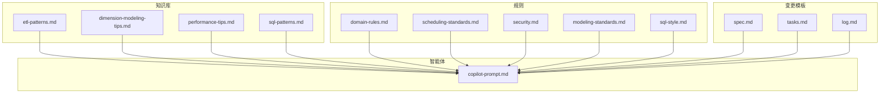
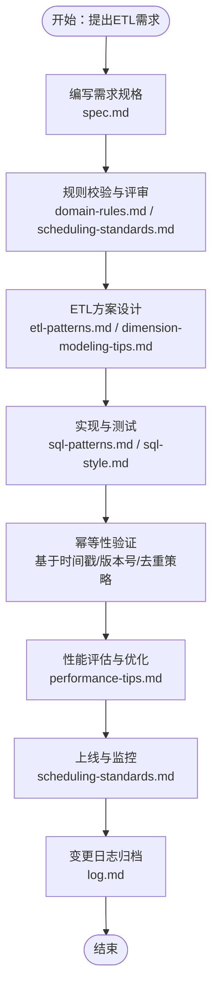
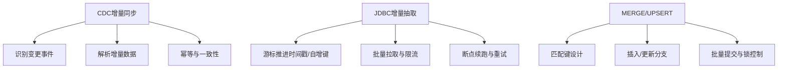
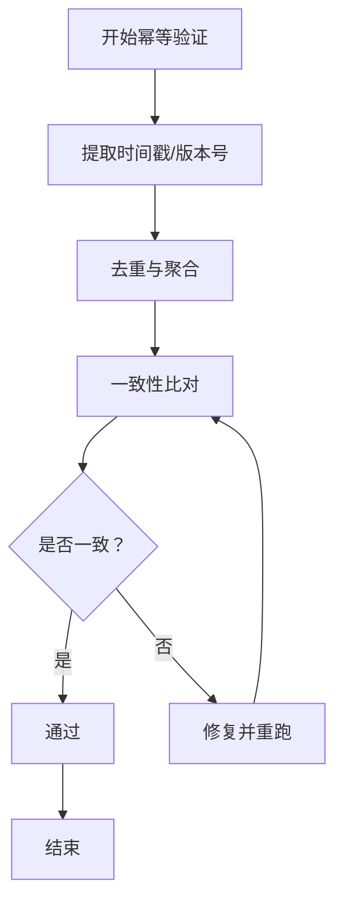
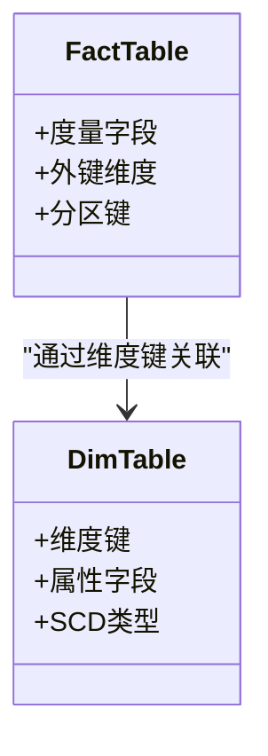
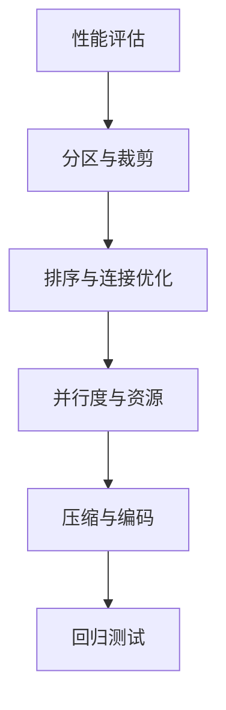
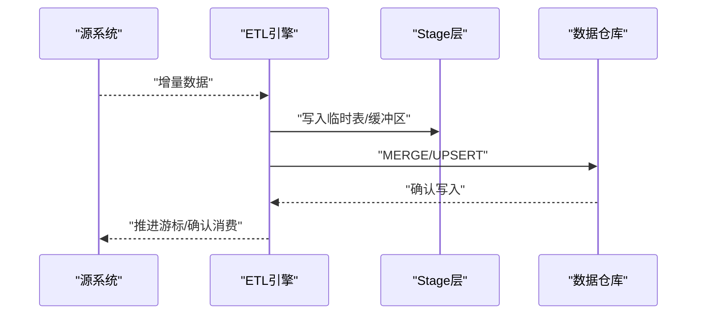
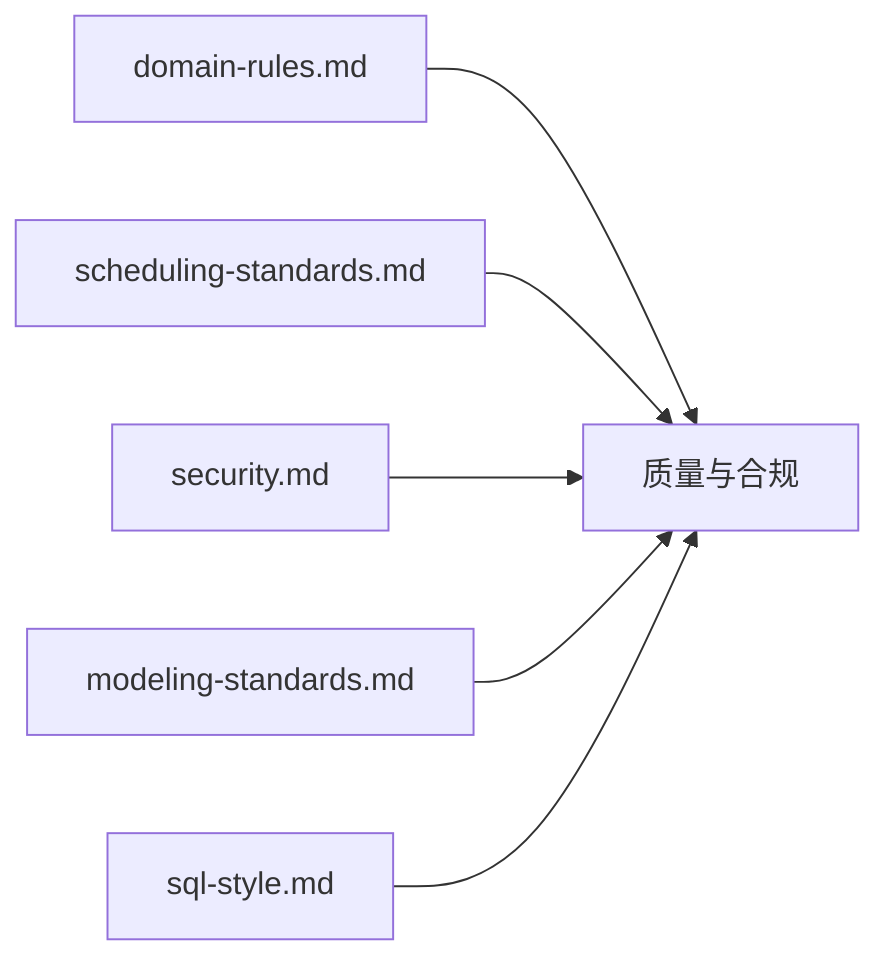
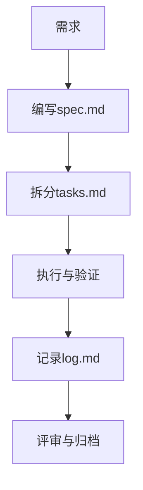
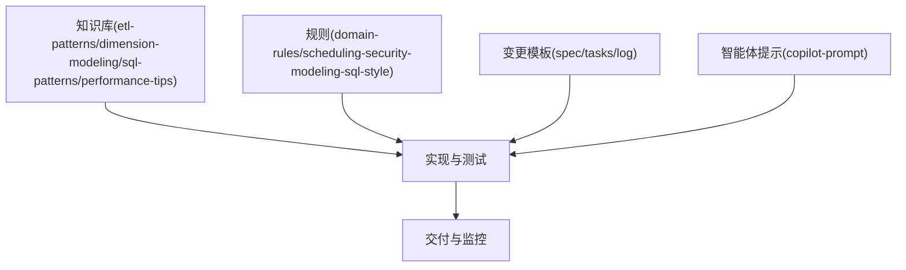

# ETL开发工作流程

<cite>
**本文引用的文件**
- [etl-patterns.md](file://data_warehouse_engineering_code_copilot/knowledge/etl-patterns.md)
- [dimension-modeling-tips.md](file://data_warehouse_engineering_code_copilot/knowledge/dimension-modeling-tips.md)
- [performance-tips.md](file://data_warehouse_engineering_code_copilot/knowledge/performance-tips.md)
- [sql-patterns.md](file://data_warehouse_engineering_code_copilot/knowledge/sql-patterns.md)
- [rules/domain-rules.md](file://data_warehouse_engineering_code_copilot/rules/domain-rules.md)
- [rules/scheduling-standards.md](file://data_warehouse_engineering_code_copilot/rules/scheduling-standards.md)
- [rules/security.md](file://data_warehouse_engineering_code_copilot/rules/security.md)
- [rules/modeling-standards.md](file://data_warehouse_engineering_code_copilot/rules/modeling-standards.md)
- [rules/sql-style.md](file://data_warehouse_engineering_code_copilot/rules/sql-style.md)
- [changes/templates/spec.md](file://data_warehouse_engineering_code_copilot/changes/templates/spec.md)
- [changes/templates/tasks.md](file://data_warehouse_engineering_code_copilot/changes/templates/tasks.md)
- [changes/templates/log.md](file://data_warehouse_engineering_code_copilot/changes/templates/log.md)
- [agents/copilot-prompt.md](file://data_warehouse_engineering_code_copilot/agents/copilot-prompt.md)
</cite>

## 目录
1. [引言](#引言)
2. [项目结构](#项目结构)
3. [核心组件](#核心组件)
4. [架构总览](#架构总览)
5. [详细组件分析](#详细组件分析)
6. [依赖关系分析](#依赖关系分析)
7. [性能考虑](#性能考虑)
8. [故障排查指南](#故障排查指南)
9. [结论](#结论)
10. [附录](#附录)

## 引言
本文件系统化梳理ETL开发的标准流程与最佳实践，围绕数据接入配置、同步策略选择、幂等性保障、ETL模式应用（CDC增量同步、JDBC增量抽取、MERGE/UPSERT）展开，并结合仓库中的规则与模板，形成从需求到交付的完整闭环。目标是帮助不同层次的读者快速掌握ETL开发的关键步骤与质量保障机制。

## 项目结构
该代码库以“知识库+规则+变更模板+智能体提示”的方式组织ETL相关知识与规范，便于在实际开发中检索与复用。核心模块如下：
- 知识库：包含维度建模技巧、ETL模式、SQL模式、性能优化等主题文档
- 规则：涵盖域规则、调度标准、安全规范、建模标准、SQL风格等
- 变更模板：用于规范需求规格、任务拆分与变更日志
- 智能体提示：定义Copilot在ETL领域的行为准则与输出框架

**图表来源**
- [etl-patterns.md](file://data_warehouse_engineering_code_copilot/knowledge/etl-patterns.md)
- [dimension-modeling-tips.md](file://data_warehouse_engineering_code_copilot/knowledge/dimension-modeling-tips.md)
- [performance-tips.md](file://data_warehouse_engineering_code_copilot/knowledge/performance-tips.md)
- [sql-patterns.md](file://data_warehouse_engineering_code_copilot/knowledge/sql-patterns.md)
- [rules/domain-rules.md](file://data_warehouse_engineering_code_copilot/rules/domain-rules.md)
- [rules/scheduling-standards.md](file://data_warehouse_engineering_code_copilot/rules/scheduling-standards.md)
- [rules/security.md](file://data_warehouse_engineering_code_copilot/rules/security.md)
- [rules/modeling-standards.md](file://data_warehouse_engineering_code_copilot/rules/modeling-standards.md)
- [rules/sql-style.md](file://data_warehouse_engineering_code_copilot/rules/sql-style.md)
- [changes/templates/spec.md](file://data_warehouse_engineering_code_copilot/changes/templates/spec.md)
- [changes/templates/tasks.md](file://data_warehouse_engineering_code_copilot/changes/templates/tasks.md)
- [changes/templates/log.md](file://data_warehouse_engineering_code_copilot/changes/templates/log.md)
- [agents/copilot-prompt.md](file://data_warehouse_engineering_code_copilot/agents/copilot-prompt.md)

**章节来源**
- [agents/copilot-prompt.md:1-25](file://data_warehouse_engineering_code_copilot/agents/copilot-prompt.md#L1-L25)

## 核心组件
- ETL模式库：提供CDC增量同步、JDBC增量抽取、MERGE/UPSERT等模式的实现要点与适用场景
- 维度建模技巧：指导事实表与维度表的数据结构设计，确保ETL输出满足星型/雪花模型要求
- 性能优化：覆盖分区、排序、压缩、并行度等维度的调优策略
- SQL模式：总结常见ETL操作的SQL范式，如去重、窗口计算、连接与聚合
- 规则体系：域规则、调度标准、安全规范、建模标准、SQL风格，为ETL开发提供约束与检查点
- 变更模板：spec.md（需求规格）、tasks.md（任务拆分）、log.md（变更日志），确保变更可追溯
- 智能体提示：定义Copilot在ETL领域的职责边界、输出框架与质量控制原则

**章节来源**
- [etl-patterns.md](file://data_warehouse_engineering_code_copilot/knowledge/etl-patterns.md)
- [dimension-modeling-tips.md](file://data_warehouse_engineering_code_copilot/knowledge/dimension-modeling-tips.md)
- [performance-tips.md](file://data_warehouse_engineering_code_copilot/knowledge/performance-tips.md)
- [sql-patterns.md](file://data_warehouse_engineering_code_copilot/knowledge/sql-patterns.md)
- [rules/domain-rules.md](file://data_warehouse_engineering_code_copilot/rules/domain-rules.md)
- [rules/scheduling-standards.md](file://data_warehouse_engineering_code_copilot/rules/scheduling-standards.md)
- [rules/security.md](file://data_warehouse_engineering_code_copilot/rules/security.md)
- [rules/modeling-standards.md](file://data_warehouse_engineering_code_copilot/rules/modeling-standards.md)
- [rules/sql-style.md](file://data_warehouse_engineering_code_copilot/rules/sql-style.md)
- [changes/templates/spec.md](file://data_warehouse_engineering_code_copilot/changes/templates/spec.md)
- [changes/templates/tasks.md](file://data_warehouse_engineering_code_copilot/changes/templates/tasks.md)
- [changes/templates/log.md](file://data_warehouse_engineering_code_copilot/changes/templates/log.md)
- [agents/copilot-prompt.md:1-25](file://data_warehouse_engineering_code_copilot/agents/copilot-prompt.md#L1-L25)

## 架构总览
下图展示ETL开发从需求到交付的端到端流程，强调“规范驱动”“变更可追溯”“质量优先”的原则。

**图表来源**
- [changes/templates/spec.md](file://data_warehouse_engineering_code_copilot/changes/templates/spec.md)
- [rules/domain-rules.md](file://data_warehouse_engineering_code_copilot/rules/domain-rules.md)
- [rules/scheduling-standards.md](file://data_warehouse_engineering_code_copilot/rules/scheduling-standards.md)
- [etl-patterns.md](file://data_warehouse_engineering_code_copilot/knowledge/etl-patterns.md)
- [dimension-modeling-tips.md](file://data_warehouse_engineering_code_copilot/knowledge/dimension-modeling-tips.md)
- [sql-patterns.md](file://data_warehouse_engineering_code_copilot/knowledge/sql-patterns.md)
- [rules/sql-style.md](file://data_warehouse_engineering_code_copilot/rules/sql-style.md)
- [performance-tips.md](file://data_warehouse_engineering_code_copilot/knowledge/performance-tips.md)
- [changes/templates/log.md](file://data_warehouse_engineering_code_copilot/changes/templates/log.md)

## 详细组件分析

### ETL模式与应用场景
- CDC增量同步：适用于具备变更日志能力的源系统（如数据库binlog、消息队列）。核心要点包括：识别变更事件、解析增量数据、处理重复与乱序、保证一致性与幂等
- JDBC增量抽取：适用于无变更日志的源系统。核心要点包括：基于时间戳/自增主键的游标推进、批量拉取、分页与限流、失败重试与断点续跑
- MERGE/UPSERT：用于将增量数据合并到目标表。核心要点包括：匹配键设计、插入/更新分支、删除标记处理、批量提交与锁竞争控制

**图表来源**
- [etl-patterns.md](file://data_warehouse_engineering_code_copilot/knowledge/etl-patterns.md)

**章节来源**
- [etl-patterns.md](file://data_warehouse_engineering_code_copilot/knowledge/etl-patterns.md)

### 幂等性验证与数据质量
- 时间戳/版本号：通过源系统提供的变更时间或业务版本号作为幂等判断依据
- 去重策略：对重复数据进行去重（如按主键聚合、窗口去重）
- 一致性校验：对同一周期内多次执行的结果进行比对，确保输出稳定
- 审计字段：记录处理批次、时间窗口、影响行数等元数据，便于追踪与回溯

**图表来源**
- [etl-patterns.md](file://data_warehouse_engineering_code_copilot/knowledge/etl-patterns.md)

**章节来源**
- [etl-patterns.md](file://data_warehouse_engineering_code_copilot/knowledge/etl-patterns.md)

### 维度建模与ETL输出
- 星型/雪花模型：事实表存储度量，维度表存储属性；通过缓慢变化维度（SCD）处理维度变更
- 分区与排序：按日期分区，按维度键排序，提升查询与连接性能
- 字段命名与类型：遵循统一的命名规范与数据类型约定，减少下游转换成本

**图表来源**
- [dimension-modeling-tips.md](file://data_warehouse_engineering_code_copilot/knowledge/dimension-modeling-tips.md)

**章节来源**
- [dimension-modeling-tips.md](file://data_warehouse_engineering_code_copilot/knowledge/dimension-modeling-tips.md)

### 性能优化策略
- 分区裁剪：利用分区键过滤，避免全表扫描
- 排序与连接：对连接键进行排序，降低内存压力
- 并行度与资源：合理设置并行度，避免资源争用
- 压缩与编码：选择合适的压缩算法与列式存储格式

**图表来源**
- [performance-tips.md](file://data_warehouse_engineering_code_copilot/knowledge/performance-tips.md)

**章节来源**
- [performance-tips.md](file://data_warehouse_engineering_code_copilot/knowledge/performance-tips.md)

### SQL模式与实现范式
- 去重与聚合：窗口函数与分组聚合的组合使用
- 连接与过滤：先过滤后连接，减少中间结果集
- 批处理与事务：批量提交与事务粒度控制，平衡吞吐与一致性

**图表来源**
- [sql-patterns.md](file://data_warehouse_engineering_code_copilot/knowledge/sql-patterns.md)

**章节来源**
- [sql-patterns.md](file://data_warehouse_engineering_code_copilot/knowledge/sql-patterns.md)

### 规则与合规
- 域规则：确保字段语义与业务含义一致
- 调度标准：明确周期、优先级、失败策略
- 安全规范：敏感数据脱敏、访问控制、审计日志
- 建模标准：命名规范、主外键约束、完整性检查
- SQL风格：可读性、注释、一致性

**图表来源**
- [rules/domain-rules.md](file://data_warehouse_engineering_code_copilot/rules/domain-rules.md)
- [rules/scheduling-standards.md](file://data_warehouse_engineering_code_copilot/rules/scheduling-standards.md)
- [rules/security.md](file://data_warehouse_engineering_code_copilot/rules/security.md)
- [rules/modeling-standards.md](file://data_warehouse_engineering_code_copilot/rules/modeling-standards.md)
- [rules/sql-style.md](file://data_warehouse_engineering_code_copilot/rules/sql-style.md)

**章节来源**
- [rules/domain-rules.md](file://data_warehouse_engineering_code_copilot/rules/domain-rules.md)
- [rules/scheduling-standards.md](file://data_warehouse_engineering_code_copilot/rules/scheduling-standards.md)
- [rules/security.md](file://data_warehouse_engineering_code_copilot/rules/security.md)
- [rules/modeling-standards.md](file://data_warehouse_engineering_code_copilot/rules/modeling-standards.md)
- [rules/sql-style.md](file://data_warehouse_engineering_code_copilot/rules/sql-style.md)

### 变更管理与交付
- 需求规格（spec.md）：明确数据来源、目标、范围、质量要求与验收标准
- 任务拆分（tasks.md）：将复杂ETL拆分为原子任务，便于并行与回滚
- 变更日志（log.md）：记录每次变更的背景、影响面与验证结果

**图表来源**
- [changes/templates/spec.md](file://data_warehouse_engineering_code_copilot/changes/templates/spec.md)
- [changes/templates/tasks.md](file://data_warehouse_engineering_code_copilot/changes/templates/tasks.md)
- [changes/templates/log.md](file://data_warehouse_engineering_code_copilot/changes/templates/log.md)

**章节来源**
- [changes/templates/spec.md](file://data_warehouse_engineering_code_copilot/changes/templates/spec.md)
- [changes/templates/tasks.md](file://data_warehouse_engineering_code_copilot/changes/templates/tasks.md)
- [changes/templates/log.md](file://data_warehouse_engineering_code_copilot/changes/templates/log.md)

## 依赖关系分析
ETL开发过程中的依赖关系体现在：知识库为实现提供方法论，规则为实现提供约束，模板为交付提供可追溯性，智能体为团队提供协作与质量保障。

**图表来源**
- [etl-patterns.md](file://data_warehouse_engineering_code_copilot/knowledge/etl-patterns.md)
- [dimension-modeling-tips.md](file://data_warehouse_engineering_code_copilot/knowledge/dimension-modeling-tips.md)
- [sql-patterns.md](file://data_warehouse_engineering_code_copilot/knowledge/sql-patterns.md)
- [performance-tips.md](file://data_warehouse_engineering_code_copilot/knowledge/performance-tips.md)
- [rules/domain-rules.md](file://data_warehouse_engineering_code_copilot/rules/domain-rules.md)
- [rules/scheduling-standards.md](file://data_warehouse_engineering_code_copilot/rules/scheduling-standards.md)
- [rules/security.md](file://data_warehouse_engineering_code_copilot/rules/security.md)
- [rules/modeling-standards.md](file://data_warehouse_engineering_code_copilot/rules/modeling-standards.md)
- [rules/sql-style.md](file://data_warehouse_engineering_code_copilot/rules/sql-style.md)
- [changes/templates/spec.md](file://data_warehouse_engineering_code_copilot/changes/templates/spec.md)
- [changes/templates/tasks.md](file://data_warehouse_engineering_code_copilot/changes/templates/tasks.md)
- [changes/templates/log.md](file://data_warehouse_engineering_code_copilot/changes/templates/log.md)
- [agents/copilot-prompt.md](file://data_warehouse_engineering_code_copilot/agents/copilot-prompt.md)

**章节来源**
- [agents/copilot-prompt.md:1-25](file://data_warehouse_engineering_code_copilot/agents/copilot-prompt.md#L1-L25)

## 性能考虑
- 合理分区：按业务周期与查询热点进行分区，减少扫描范围
- 连接顺序：小表在左，避免大表笛卡尔积
- 批处理大小：根据内存与IO能力调整批大小，兼顾吞吐与稳定性
- 压缩策略：列式存储与高压缩比算法配合，降低存储与网络开销
- 并行度：根据CPU核数与磁盘IO能力设置并行度，避免过度竞争

[本节为通用性能建议，无需特定文件引用]

## 故障排查指南
- 数据重复：检查幂等键与去重逻辑，确认游标推进是否正确
- 数据丢失：核查断点续跑与重试策略，确认异常分支处理
- 性能退化：检查分区裁剪、连接顺序与批处理大小，定位瓶颈
- 权限问题：核对安全规范与访问控制，确保最小权限原则
- 变更未生效：检查变更日志与评审流程，确保变更已归档并验证

**章节来源**
- [rules/security.md](file://data_warehouse_engineering_code_copilot/rules/security.md)
- [changes/templates/log.md](file://data_warehouse_engineering_code_copilot/changes/templates/log.md)

## 结论
通过将ETL模式、建模技巧、性能优化、规则约束与变更模板有机结合，可以构建一套可复用、可追溯、可演进的ETL开发体系。建议在每个阶段严格遵循规范与模板，借助智能体提示提升协作效率与质量水平。

[本节为总结性内容，无需特定文件引用]

## 附录
- 参考文件清单
  - etl-patterns.md：ETL模式与实现要点
  - dimension-modeling-tips.md：维度建模与数据结构设计
  - performance-tips.md：性能优化策略
  - sql-patterns.md：SQL实现范式
  - domain-rules.md / scheduling-standards.md / security.md / modeling-standards.md / sql-style.md：规则与约束
  - spec.md / tasks.md / log.md：变更模板
  - copilot-prompt.md：智能体协作与质量控制原则

[本节为参考清单，无需特定文件引用]