# SQL开发工作流程

<cite>
**本文档引用的文件**
- [copilot-prompt.md](file://data_warehouse_engineering_code_copilot/agents/copilot-prompt.md)
- [sql-reviewer.md](file://data_warehouse_engineering_code_copilot/agents/sql-reviewer.md)
- [version-tracker.md](file://data_warehouse_engineering_code_copilot/agents/version-tracker.md)
- [sql-patterns.md](file://data_warehouse_engineering_code_copilot/knowledge/sql-patterns.md)
- [performance-tips.md](file://data_warehouse_engineering_code_copilot/knowledge/performance-tips.md)
- [sql-style.md](file://data_warehouse_engineering_code_copilot/rules/sql-style.md)
- [domain-rules.md](file://data_warehouse_engineering_code_copilot/rules/domain-rules.md)
- [security.md](file://data_warehouse_engineering_code_copilot/rules/security.md)
</cite>

## 目录
1. [简介](#简介)
2. [项目结构](#项目结构)
3. [核心组件](#核心组件)
4. [架构概览](#架构概览)
5. [详细组件分析](#详细组件分析)
6. [依赖关系分析](#依赖关系分析)
7. [性能考虑](#性能考虑)
8. [故障排查指南](#故障排查指南)
9. [最佳实践总结](#最佳实践总结)
10. [附录](#附录)

## 简介

本文件详细阐述了数据仓库工程中的SQL开发标准流程，基于dwh-copilot智能助手的工作框架，构建了一套完整的SQL开发、质量审查、版本追踪和持续改进体系。该体系涵盖了从需求理解、SQL编写、性能优化到质量保证的全流程管理，确保数据仓库开发的规范化、标准化和可持续发展。

## 项目结构

该项目采用模块化设计，围绕SQL开发工作流构建了完整的知识体系：

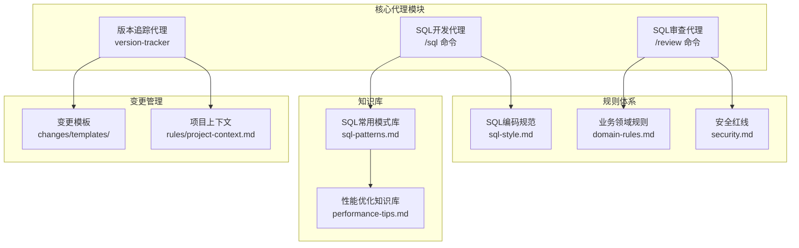

**图表来源**
- [copilot-prompt.md:68-127](file://data_warehouse_engineering_code_copilot/agents/copilot-prompt.md#L68-L127)
- [sql-style.md:1-254](file://data_warehouse_engineering_code_copilot/rules/sql-style.md#L1-L254)
- [sql-patterns.md:1-331](file://data_warehouse_engineering_code_copilot/knowledge/sql-patterns.md#L1-L331)

**章节来源**
- [copilot-prompt.md:1-147](file://data_warehouse_engineering_code_copilot/agents/copilot-prompt.md#L1-L147)
- [sql-style.md:1-254](file://data_warehouse_engineering_code_copilot/rules/sql-style.md#L1-L254)

## 核心组件

### SQL开发代理（/sql 命令）

SQL开发代理是整个工作流程的核心控制器，负责指导开发者完成从需求分析到SQL实现的全过程：

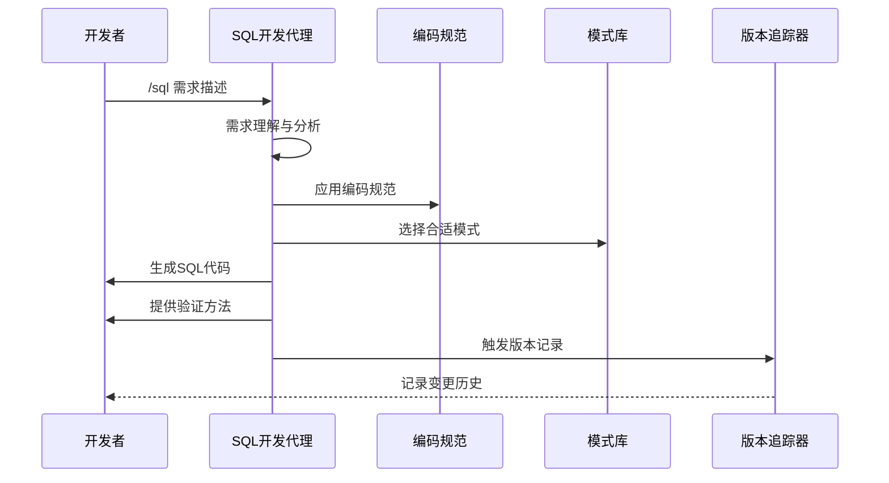

**图表来源**
- [copilot-prompt.md:68-90](file://data_warehouse_engineering_code_copilot/agents/copilot-prompt.md#L68-L90)
- [sql-style.md:165-190](file://data_warehouse_engineering_code_copilot/rules/sql-style.md#L165-L190)

### SQL审查代理（/review 命令）

SQL审查代理专注于代码质量、性能和可维护性的深度审查：

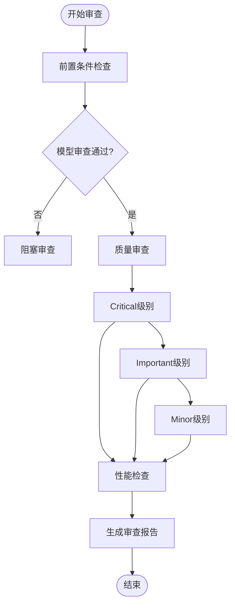

**图表来源**
- [copilot-prompt.md:113-115](file://data_warehouse_engineering_code_copilot/agents/copilot-prompt.md#L113-L115)
- [sql-reviewer.md:5-43](file://data_warehouse_engineering_code_copilot/agents/sql-reviewer.md#L5-L43)

### 版本追踪代理

版本追踪代理确保所有变更都有据可查，建立了完整的变更管理闭环：

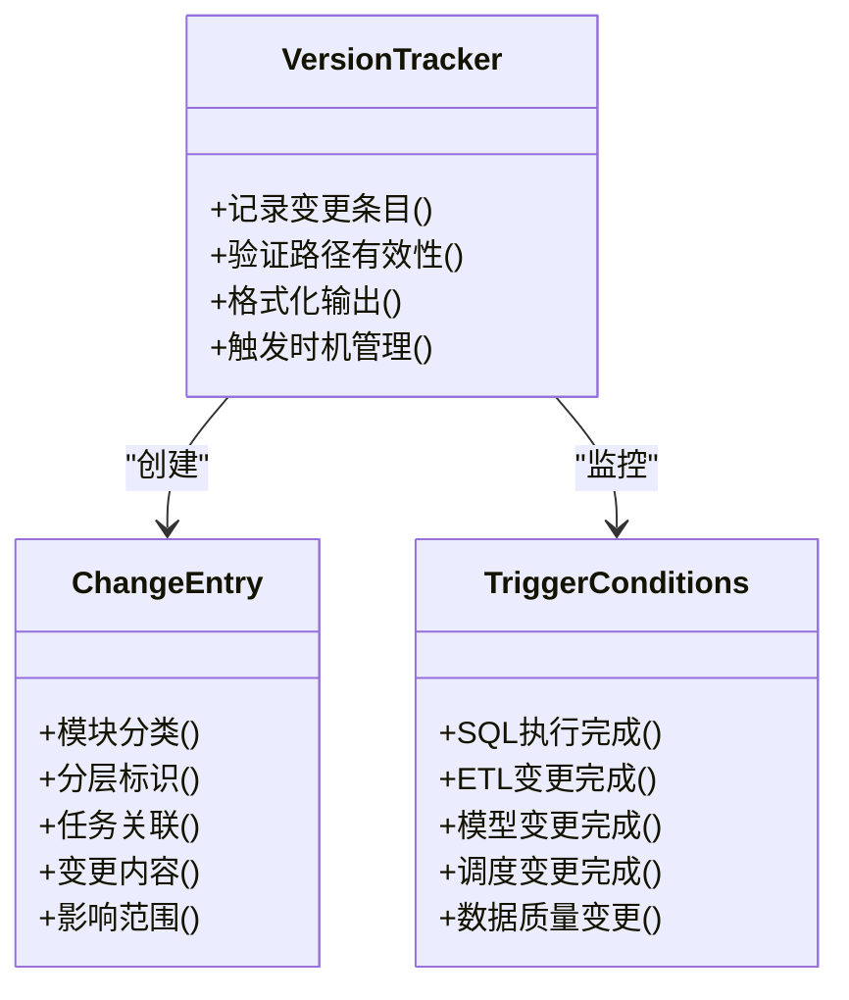

**图表来源**
- [version-tracker.md:1-120](file://data_warehouse_engineering_code_copilot/agents/version-tracker.md#L1-L120)

**章节来源**
- [copilot-prompt.md:68-127](file://data_warehouse_engineering_code_copilot/agents/copilot-prompt.md#L68-L127)
- [sql-reviewer.md:1-68](file://data_warehouse_engineering_code_copilot/agents/sql-reviewer.md#L1-L68)
- [version-tracker.md:1-120](file://data_warehouse_engineering_code_copilot/agents/version-tracker.md#L1-L120)

## 架构概览

整个SQL开发工作流程采用分层架构设计，确保各组件职责清晰、耦合度低：

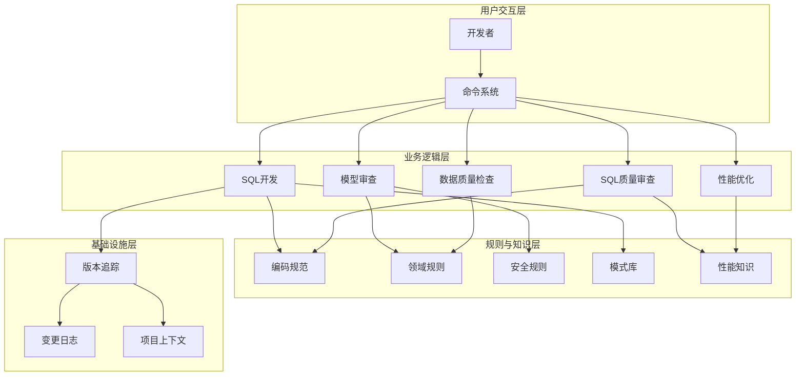

**图表来源**
- [copilot-prompt.md:63-147](file://data_warehouse_engineering_code_copilot/agents/copilot-prompt.md#L63-L147)
- [sql-style.md:1-254](file://data_warehouse_engineering_code_copilot/rules/sql-style.md#L1-L254)
- [domain-rules.md:1-142](file://data_warehouse_engineering_code_copilot/rules/domain-rules.md#L1-L142)
- [security.md:1-98](file://data_warehouse_engineering_code_copilot/rules/security.md#L1-L98)

## 详细组件分析

### SQL开发最佳实践

#### 命名约定体系

SQL开发遵循严格的命名约定，确保代码的一致性和可维护性：

| 命名类别 | 约定规则 | 示例 |
|---------|---------|------|
| 数据库命名 | `ods_`、`dwh_dwd`、`dwh_dws`、`dwh_ads`、`dwh_dim` | `ods_mysql_orders`、`dwh_dwd` |
| 表命名 | `{layer}_{biz_process}_{grain}{period}` | `dwd_trade_order_di`、`dws_user_active_1d` |
| 字段命名 | `_amt`、`_qty`、`_rate`、`is_*`、`*_date` | `amount_amt`、`session_cnt`、`is_active` |
| 分区字段 | 统一使用 `dt`，格式 `YYYYMMDD` | `PARTITIONED BY (dt STRING)` |

#### SQL编写原则

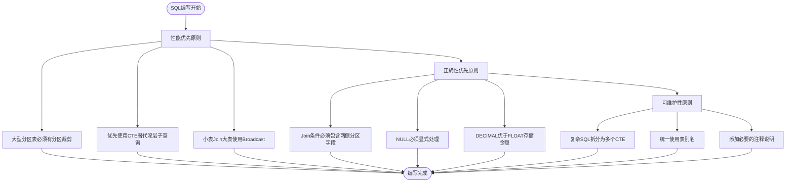

**图表来源**
- [sql-style.md:165-190](file://data_warehouse_engineering_code_copilot/rules/sql-style.md#L165-L190)

#### 禁止事项清单

| 禁止类型 | 具体内容 | 风险说明 |
|---------|---------|---------|
| 写入方式 | 禁止使用 `INSERT INTO` 写入分区表 | 重复执行会产生重复数据 |
| 表结构 | 禁止在调度脚本中使用 `DROP TABLE` | 删除表必须走运维变更流程 |
| 日期处理 | 禁止在SQL中硬编码业务日期 | 调度脚本必须使用变量 `${bizdate}` |
| 层级引用 | 禁止跨层反向引用 | 如 DWD 直接读 ADS 会破坏数据流 |
| 魔法数字 | 禁止使用未注释的"魔法数字" | 降低代码可读性和可维护性 |

**章节来源**
- [sql-style.md:192-254](file://data_warehouse_engineering_code_copilot/rules/sql-style.md#L192-L254)

### SQL常用模式库

#### 去重保留最新模式

该模式适用于处理CDC后处理和全量去重场景：

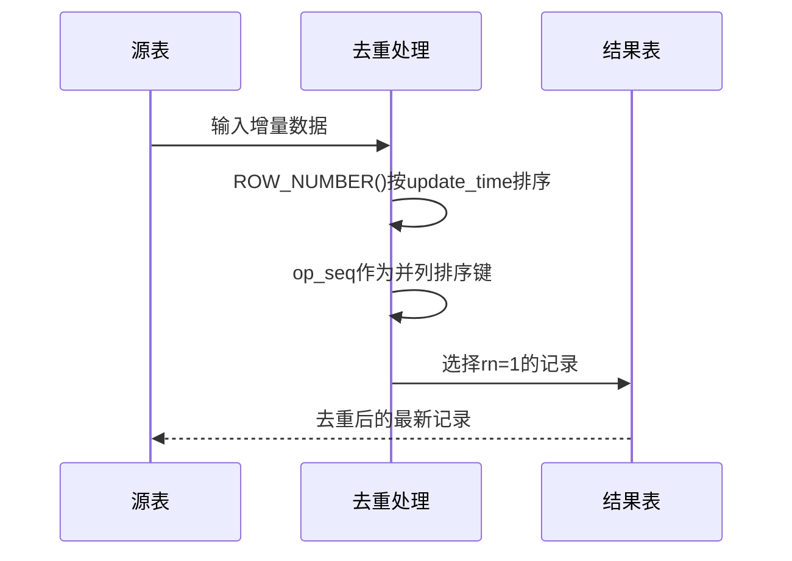

**图表来源**
- [sql-patterns.md:6-39](file://data_warehouse_engineering_code_copilot/knowledge/sql-patterns.md#L6-L39)

#### 拉链表（SCD Type 2）模式

处理缓慢变化维度的历史版本保留：

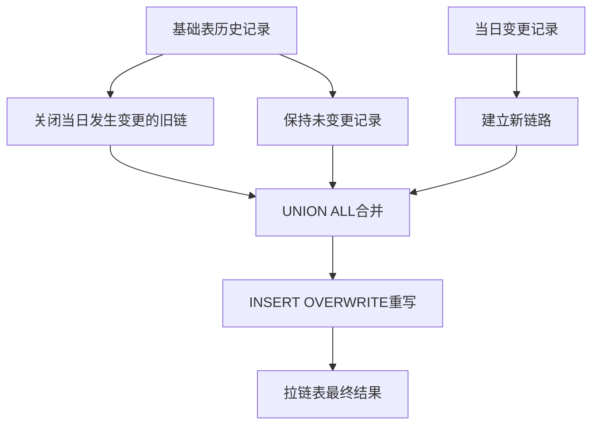

**图表来源**
- [sql-patterns.md:42-94](file://data_warehouse_engineering_code_copilot/knowledge/sql-patterns.md#L42-L94)

#### 同环比计算模式

计算指标的同比和环比增长率：

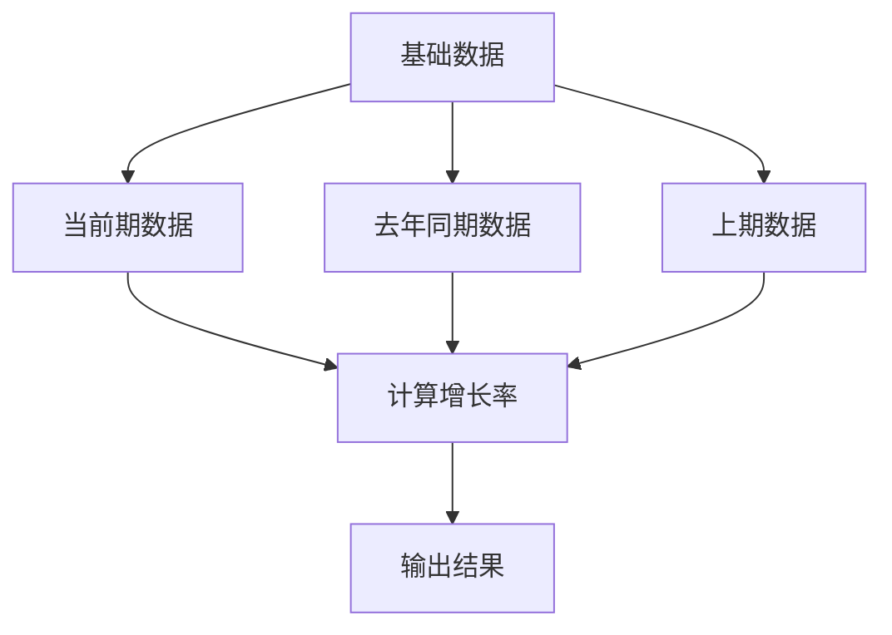

**图表来源**
- [sql-patterns.md:97-141](file://data_warehouse_engineering_code_copilot/knowledge/sql-patterns.md#L97-L141)

**章节来源**
- [sql-patterns.md:1-331](file://data_warehouse_engineering_code_copilot/knowledge/sql-patterns.md#L1-L331)

### 性能优化知识库

#### 分区裁剪优化

分区裁剪是大数据查询性能优化的关键：

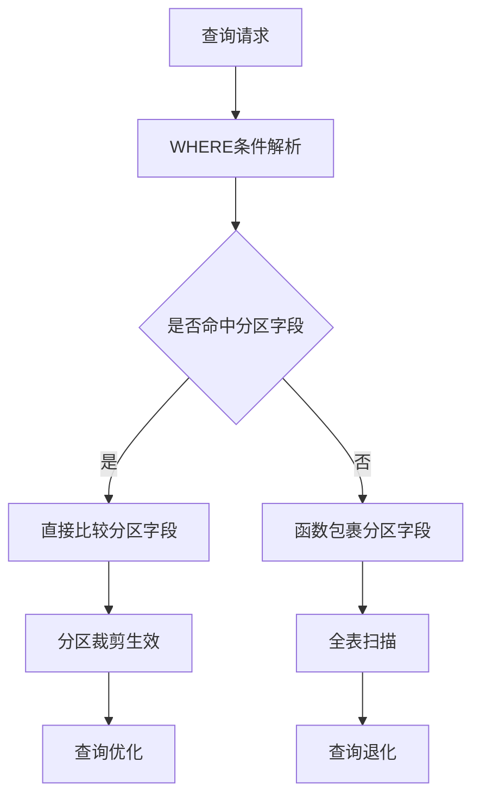

**图表来源**
- [performance-tips.md:5-40](file://data_warehouse_engineering_code_copilot/knowledge/performance-tips.md#L5-L40)

#### 数据倾斜解决方案

针对数据倾斜问题的三种主要解决方案：

| 解决方案 | 适用场景 | 实现方式 | 优点 | 风险 |
|---------|---------|---------|------|------|
| 过滤+单独处理 | 热点键明确且可识别 | 将热点键单独处理 | 实现简单，效果明显 | 可能遗漏边界情况 |
| 加盐打散 | 热点分布相对均匀 | 使用随机盐值分散到多个桶 | 通用性强 | 需要二次聚合，增加复杂度 |
| Map Join小表 | 小表可广播 | 使用广播机制避免Shuffle | 性能提升显著 | 小表大小受限，内存压力 |

**章节来源**
- [performance-tips.md:42-136](file://data_warehouse_engineering_code_copilot/knowledge/performance-tips.md#L42-L136)

### 数据质量审查体系

#### 五大维度审查

数据质量审查涵盖完整性、唯一性、一致性、准确性和时效性五个维度：

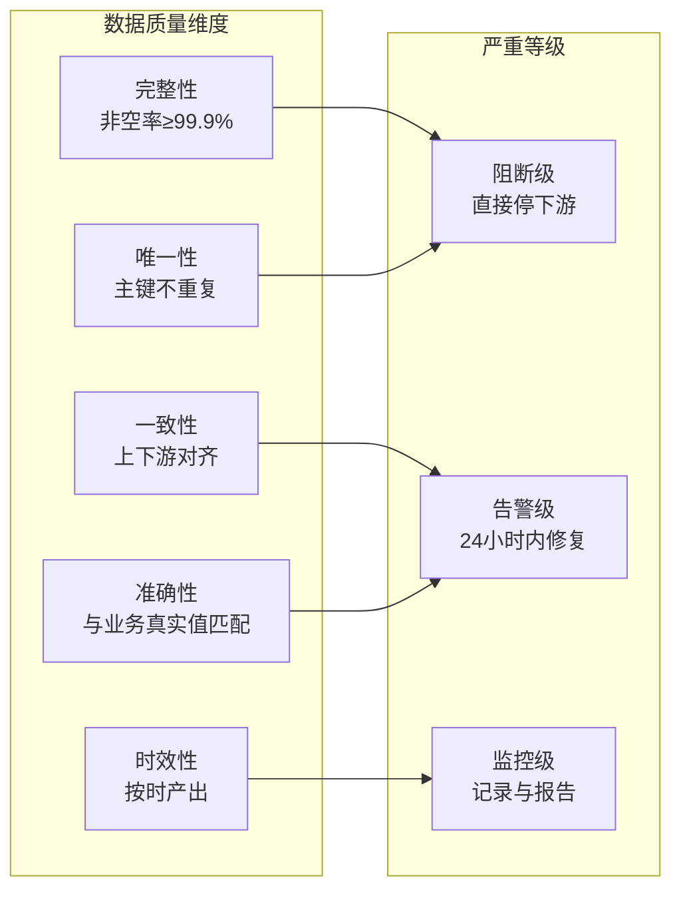

**图表来源**
- [domain-rules.md:69-91](file://data_warehouse_engineering_code_copilot/rules/domain-rules.md#L69-L91)

#### 审查分级标准

| 审查级别 | 问题类型 | 处理要求 | 影响范围 |
|---------|---------|---------|---------|
| Critical | 计算结果错误、笛卡尔积、全表扫描 | 阻塞修改，必须修复 | 影响数据准确性 |
| Important | 子查询可读性差、重复计算、类型转换 | 应修复，影响代码质量 | 影响可维护性 |
| Minor | 关键字大小写、缩进风格、字段顺序 | 建议修复，影响代码规范 | 影响团队标准 |

**章节来源**
- [sql-reviewer.md:5-64](file://data_warehouse_engineering_code_copilot/agents/sql-reviewer.md#L5-L64)
- [domain-rules.md:81-91](file://data_warehouse_engineering_code_copilot/rules/domain-rules.md#L81-L91)

## 依赖关系分析

### 规则依赖关系

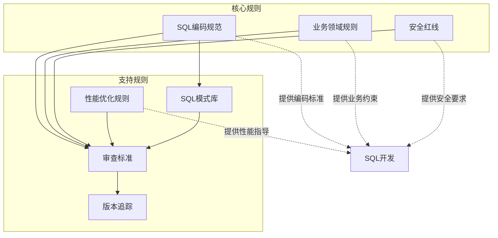

**图表来源**
- [sql-style.md:1-254](file://data_warehouse_engineering_code_copilot/rules/sql-style.md#L1-L254)
- [domain-rules.md:1-142](file://data_warehouse_engineering_code_copilot/rules/domain-rules.md#L1-L142)
- [security.md:1-98](file://data_warehouse_engineering_code_copilot/rules/security.md#L1-L98)

### 组件耦合度分析

| 组件 | 内聚性 | 耦合度 | 说明 |
|------|-------|--------|------|
| SQL开发代理 | 高 | 低 | 专注于SQL开发流程，与其他组件松耦合 |
| SQL审查代理 | 中 | 中 | 需要依赖多个规则和知识库，但职责明确 |
| 版本追踪代理 | 高 | 低 | 专注于变更记录，功能相对独立 |
| 规则系统 | 中 | 高 | 为多个组件提供约束，是系统的中枢 |
| 知识库 | 高 | 低 | 提供模式和最佳实践，相对独立 |

**章节来源**
- [copilot-prompt.md:133-147](file://data_warehouse_engineering_code_copilot/agents/copilot-prompt.md#L133-L147)

## 性能考虑

### 查询性能优化策略

#### Join优化策略

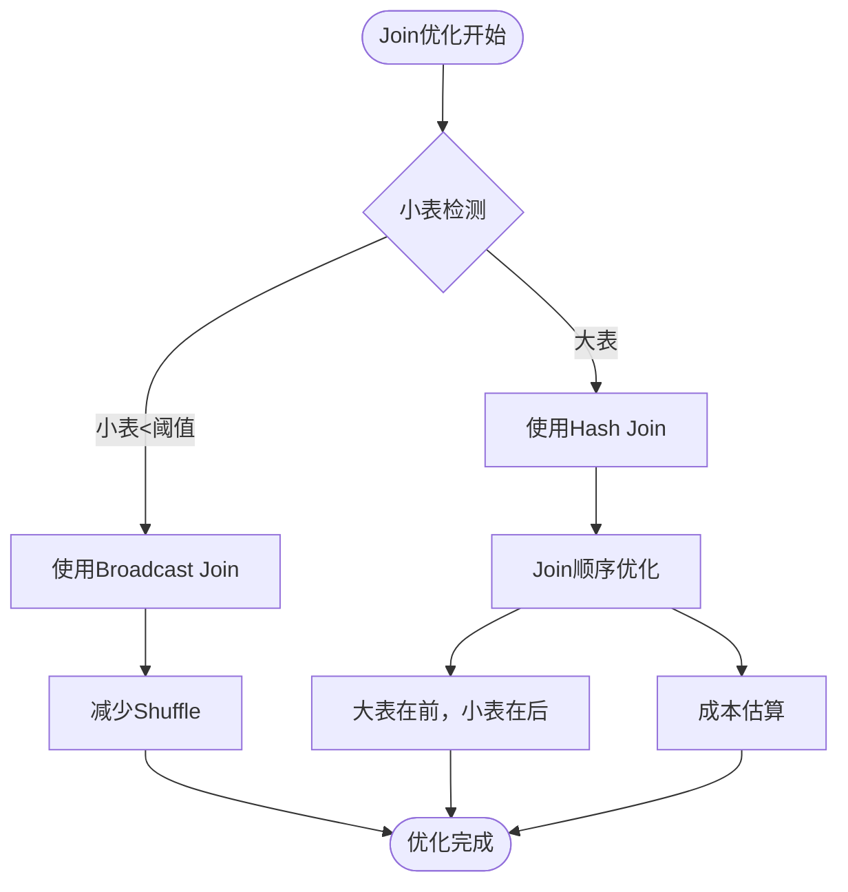

#### 窗口函数优化

窗口函数是性能优化的重点关注对象：

| 优化要点 | 实现方式 | 性能收益 |
|---------|---------|---------|
| PARTITION BY列基数 | 选择高基数列作为分区键 | 避免数据倾斜 |
| ORDER BY复杂度 | 简化排序键，使用预排序 | 减少排序开销 |
| DISTRIBUTE BY配合 | 使用DISTRIBUTE BY + SORT BY | 优化数据分布 |
| CTE物化策略 | 大型CTE物化为临时表 | 避免重复计算 |

**章节来源**
- [performance-tips.md:259-284](file://data_warehouse_engineering_code_copilot/knowledge/performance-tips.md#L259-L284)

### 存储格式选择

| 存储格式 | 适用场景 | 压缩比 | 查询性能 | 列裁剪收益 |
|---------|---------|--------|---------|-----------|
| ORC | Hive主流 | 3-5倍 | 优秀 | 显著 |
| Parquet | Spark/Iceberg | 3-5倍 | 优秀 | 显著 |
| TextFile | 临时/兼容 | 1.5-2倍 | 一般 | 有限 |
| Avro | Schema演进 | 2-3倍 | 良好 | 中等 |
| JSON | 半结构化 | 1.2-1.5倍 | 差 | 无 |

## 故障排查指南

### 调试流程

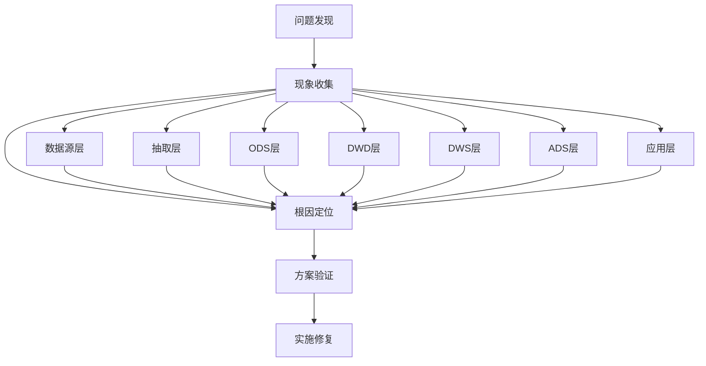

#### 诊断层级

| 层级 | 诊断重点 | 常见问题 | 解决方案 |
|------|---------|---------|---------|
| 数据源层 | 业务库结构变更、源表迟到/重复 | 数据不一致、重复记录 | 检查源端schema、CDC配置 |
| 抽取层 | 同步成功性、增量字段单调性 | 数据丢失、重复抽取 | 验证抽取逻辑、监控增量字段 |
| ODS层 | 落表行数一致性、分区完整性 | 数据丢失、分区错误 | 核对上游数据、检查分区策略 |
| DWD层 | 业务过程完整性、维度退化正确性 | 业务口径偏差、数据清洗失效 | 审查ETL逻辑、验证维度映射 |
| DWS层 | 聚合粒度正确性、口径对齐 | 指标计算错误、膨胀问题 | 检查聚合逻辑、验证口径一致性 |
| ADS层 | 指标计算符合spec、异常值处理 | 指标偏差、空值处理不当 | 对账验证、异常值分析 |
| 应用层 | 下游BI/API二次聚合、时区/币种 | 展示错误、计算偏差 | 检查应用层逻辑、时区转换 |

**章节来源**
- [copilot-prompt.md:133-147](file://data_warehouse_engineering_code_copilot/agents/copilot-prompt.md#L133-L147)

### 性能问题诊断

#### 常见性能问题识别

| 问题类型 | 现象特征 | 诊断方法 | 解决方案 |
|---------|---------|---------|---------|
| 数据倾斜 | 任务卡在99%、个别reducer处理量大 | `EXPLAIN`查看stage分布 | 加盐打散、过滤单独处理 |
| 全表扫描 | 查询耗时长、分区裁剪失效 | `EXPLAIN`查看PartitionFilters | 修正WHERE条件、避免函数包裹 |
| Join性能差 | Shuffle数据量大、内存溢出 | 检查Join类型和顺序 | 使用Broadcast Join、优化Join顺序 |
| CTE重复计算 | 大型CTE多次引用导致性能问题 | 检查CTE使用次数 | 物化为临时表、使用CACHE |

**章节来源**
- [performance-tips.md:327-349](file://data_warehouse_engineering_code_copilot/knowledge/performance-tips.md#L327-L349)

## 最佳实践总结

### SQL开发流程最佳实践

#### 需求理解阶段

1. **业务口径确认**
   - 明确数据粒度和时间范围
   - 确认过滤条件和业务规则
   - 识别关键指标和计算逻辑

2. **技术可行性评估**
   - 评估数据可用性和完整性
   - 分析潜在性能瓶颈
   - 确定合适的SQL模式

#### 代码实现阶段

1. **遵循编码规范**
   - 严格使用命名约定
   - 采用CTE替代深层嵌套
   - 添加必要的注释说明

2. **性能优化实践**
   - 确保分区裁剪生效
   - 优化Join顺序和类型
   - 避免不必要的排序操作

#### 质量保证阶段

1. **代码审查要点**
   - 检查业务逻辑正确性
   - 验证性能优化效果
   - 确认可维护性标准

2. **验证方法**
   - 数据对比和行数核验
   - 关键指标对比
   - 抽样校验和对账

### 版本管理最佳实践

#### 变更记录规范

1. **原子化记录**
   - 一次命令对应一条记录
   - 不合并多次操作
   - 精确引用变更对象

2. **完整信息记录**
   - 模块分类和分层标识
   - 任务关联和变更内容
   - 下游影响和回刷范围

#### 审查流程优化

1. **三阶段审查**
   - Spec Compliance：需求合规性
   - Model Quality：模型质量
   - SQL Quality：SQL与性能质量

2. **自动化支持**
   - 版本追踪器自动记录
   - 审查标准自动化检查
   - 变更影响分析

**章节来源**
- [copilot-prompt.md:68-127](file://data_warehouse_engineering_code_copilot/agents/copilot-prompt.md#L68-L127)
- [version-tracker.md:80-90](file://data_warehouse_engineering_code_copilot/agents/version-tracker.md#L80-L90)

## 附录

### 常用命令速查

| 命令 | 功能描述 | 使用场景 |
|------|---------|---------|
| `/sql` | SQL开发 | 新建或修改SQL脚本 |
| `/model` | 数仓建模 | 表结构设计和DDL |
| `/etl` | ETL开发 | 数据集成和同步 |
| `/review` | 代码审查 | SQL质量审查 |
| `/optimize` | 性能优化 | 查询性能诊断 |
| `/dq` | 数据质量 | 数据质量校验 |
| `/schedule` | 调度配置 | 作业调度管理 |
| `/archive` | 知识沉淀 | 变更归档和总结 |

### 安全合规要点

#### 数据安全控制

1. **PII数据保护**
   - 禁止在SQL中直接展示敏感信息
   - 实施字段级脱敏策略
   - 使用哈希处理不可逆数据

2. **访问控制**
   - 实施行级权限控制
   - 建立数据分级制度
   - 完善审计日志

#### 合规要求

1. **跨境数据传输**
   - 符合GDPR/PIPL等法规
   - 实施去标识化处理
   - 建立数据出境清单

2. **审计与监控**
   - L3+数据查询留痕
   - 异常访问行为告警
   - 离职员工权限回收