# 工作流程详解

<cite>
**本文引用的文件**
- [目录结构和设计说明.md](file://目录结构和设计说明.md)
- [copilot-prompt.md](file://agents/copilot-prompt.md)
- [sql-reviewer.md](file://agents/sql-reviewer.md)
- [performance-reviewer.md](file://agents/performance-reviewer.md)
- [version-tracker.md](file://agents/version-tracker.md)
- [index.md](file://knowledge/index.md)
- [sql-patterns.md](file://knowledge/sql-patterns.md)
- [etl-patterns.md](file://knowledge/etl-patterns.md)
- [dimension-modeling-tips.md](file://knowledge/dimension-modeling-tips.md)
- [performance-tips.md](file://knowledge/performance-tips.md)
- [domain-rules.md](file://rules/domain-rules.md)
- [sql-style.md](file://rules/sql-style.md)
- [modeling-standards.md](file://rules/modeling-standards.md)
- [scheduling-standards.md](file://rules/scheduling-standards.md)
- [data-quality.md](file://rules/data-quality.md)
- [security.md](file://rules/security.md)
</cite>

## 目录
1. [简介](#简介)
2. [项目结构](#项目结构)
3. [核心组件](#核心组件)
4. [架构总览](#架构总览)
5. [详细组件分析](#详细组件分析)
6. [依赖分析](#依赖分析)
7. [性能考虑](#性能考虑)
8. [故障排查指南](#故障排查指南)
9. [结论](#结论)
10. [附录](#附录)

## 简介
本文件面向数据仓库（Data Warehouse）开发场景，系统化阐述“需求提出 → 规格制定 → 任务拆分 → 实施 → 审查 → 归档”的全流程闭环，以及性能优化、SQL/ETL/建模/调度等专项工作的标准流程。围绕“Spec 驱动 + 三段式知识库 + 强制变更追踪”的核心设计，帮助读者建立可审计、可复用、可沉淀的工程化协作范式。

## 项目结构
项目采用“提示词 + 知识库 + 变更管理”的三层协作结构：
- agents/：AI 角色与子 Agent 提示词，定义命令体系与协作流程
- knowledge/：领域知识库（SQL 模式、ETL 模式、建模技巧、性能优化）
- rules/：项目约束与规范（命名、建模分层、调度、数据质量、安全）
- changes/templates/：变更模板（spec/tasks/log/validation-spec）

```mermaid
graph TB
subgraph "提示词与协作"
A["agents/copilot-prompt.md<br/>主提示词与命令体系"]
B["agents/sql-reviewer.md<br/>SQL 质量审查"]
C["agents/performance-reviewer.md<br/>性能诊断"]
D["agents/version-tracker.md<br/>变更追踪"]
end
subgraph "知识库"
K1["knowledge/index.md<br/>知识索引"]
K2["knowledge/sql-patterns.md<br/>SQL 模式库"]
K3["knowledge/etl-patterns.md<br/>ETL 模式库"]
K4["knowledge/dimension-modeling-tips.md<br/>建模技巧"]
K5["knowledge/performance-tips.md<br/>性能优化"]
end
subgraph "规范与规则"
R1["rules/sql-style.md<br/>SQL 编码规范"]
R2["rules/modeling-standards.md<br/>建模与分层规范"]
R3["rules/scheduling-standards.md<br/>调度与运维规范"]
R4["rules/data-quality.md<br/>数据质量规范"]
R5["rules/security.md<br/>安全红线"]
R6["rules/domain-rules.md<br/>业务领域规则"]
end
subgraph "变更管理"
T1["changes/templates/spec.md"]
T2["changes/templates/tasks.md"]
T3["changes/templates/log.md"]
T4["changes/templates/validation-spec.md"]
end
A --> B
A --> C
A --> D
A --> K1
A --> K2
A --> K3
A --> K4
A --> K5
A --> R1
A --> R2
A --> R3
A --> R4
A --> R5
A --> R6
A --> T1
A --> T2
A --> T3
A --> T4
```

**图表来源**
- [目录结构和设计说明.md:19-55](file://目录结构和设计说明.md#L19-L55)
- [copilot-prompt.md:63-147](file://agents/copilot-prompt.md#L63-L147)

**章节来源**
- [目录结构和设计说明.md:19-55](file://目录结构和设计说明.md#L19-L55)

## 核心组件
- 主提示词与命令体系：定义“/propose → /apply → /review → /optimize → /dq → /schedule → /archive”等命令，确保每次协作在固定流程内进行，避免发散与遗漏。
- 三段式知识结构：
  - rules/：约束与红线（必须遵守）
  - knowledge/：经验与模式库（推荐复用）
  - changes/：过程与历史（每次变更的“病历”）
- 强制变更追踪：version-tracker 在每次 DDL/SQL/ETL/调度变更后自动记录结构化日志，确保所有变更可审计、可回溯。

**章节来源**
- [目录结构和设计说明.md:61-106](file://目录结构和设计说明.md#L61-L106)
- [copilot-prompt.md:63-147](file://agents/copilot-prompt.md#L63-L147)
- [version-tracker.md:5-16](file://agents/version-tracker.md#L5-L16)

## 架构总览
下图展示了从“新建数据需求”到“上线归档”的典型工作流，以及性能优化与数据质量校验的贯穿路径。

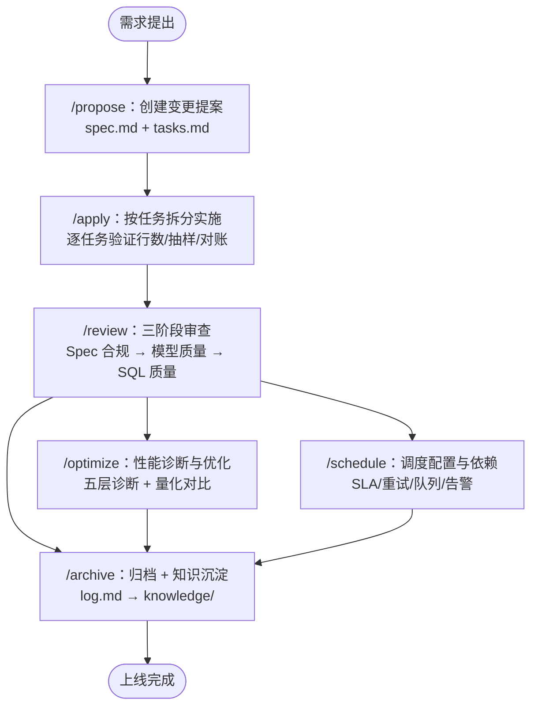

**图表来源**
- [目录结构和设计说明.md:126-167](file://目录结构和设计说明.md#L126-L167)
- [copilot-prompt.md:103-132](file://agents/copilot-prompt.md#L103-L132)

## 详细组件分析

### 新建数据需求全流程（从需求到上线）
- 需求澄清：粒度、时间窗、是否含退款、SLA 等
- 生成 spec：包含模型变更 DDL、SQL 设计、调度配置、DQ 规则
- 生成 tasks：按 ODS→DIM→DWD→DWS→ADS 顺序拆分
- 硬 Gate 确认：用户确认后方可进入实施
- 实施与验证：逐任务执行，每个任务完成后展示验证证据（行数/抽样/对账三选一），并触发 version-tracker
- 审查与归档：三阶段审查通过后，归档 + 知识沉淀

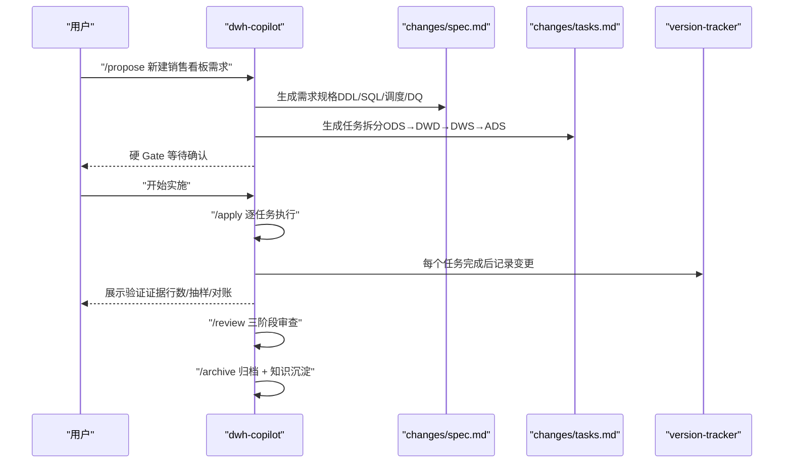

**图表来源**
- [目录结构和设计说明.md:128-151](file://目录结构和设计说明.md#L128-L151)
- [copilot-prompt.md:103-112](file://agents/copilot-prompt.md#L103-L112)
- [version-tracker.md:44-64](file://agents/version-tracker.md#L44-L64)

**章节来源**
- [目录结构和设计说明.md:128-151](file://目录结构和设计说明.md#L128-L151)
- [copilot-prompt.md:103-112](file://agents/copilot-prompt.md#L103-L112)

### 性能优化标准流程（根因诊断 → 优化方案 → 效果验证）
- 诊断层级：数据源 → ETL → 数仓（ODS/DWD/DWS/ADS）→ SQL → 应用
- 量化对比：扫描量、运行耗时、资源消耗、成本
- 优化优先级：分区裁剪 → 倾斜键 → Map Join → 小文件合并 → CTE 物化策略
- 优化前后对比：每条建议必须给出优化前后的对比指标

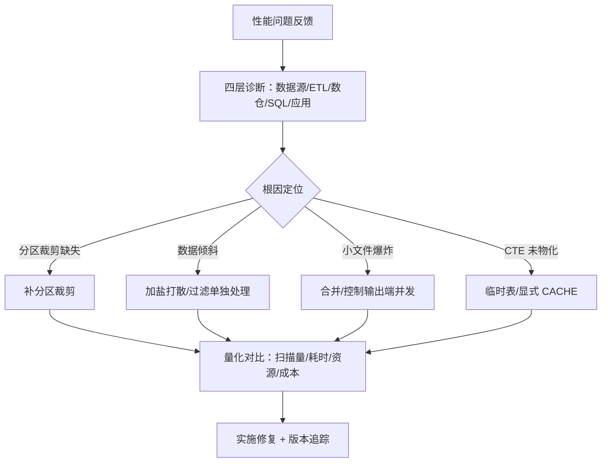

**图表来源**
- [performance-reviewer.md:5-39](file://agents/performance-reviewer.md#L5-L39)
- [performance-tips.md:5-349](file://knowledge/performance-tips.md#L5-L349)
- [version-tracker.md:44-64](file://agents/version-tracker.md#L44-L64)

**章节来源**
- [performance-reviewer.md:5-77](file://agents/performance-reviewer.md#L5-L77)
- [performance-tips.md:5-349](file://knowledge/performance-tips.md#L5-L349)

### SQL 开发专项流程
- 命名规范：库/表/字段/分区统一命名与注释
- 编码规范：关键字大小写、缩进、头部注释、禁止 SELECT *
- 性能优先：分区裁剪、CTE、Map Join、避免 ORDER BY 最外层
- 正确性优先：NULL 处理、DECIMAL、幂等写入
- 可维护性：语义化 CTE 名称、统一别名、避免超长表达式

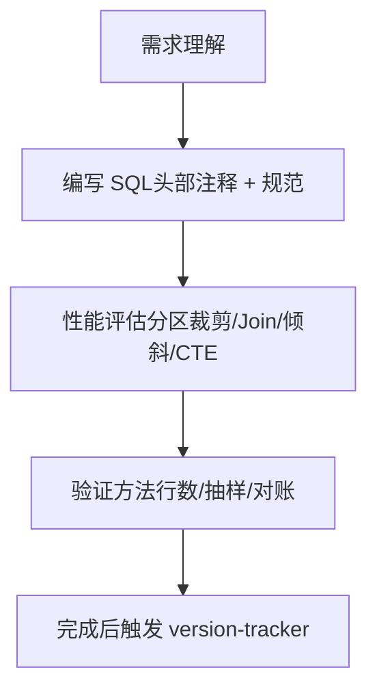

**图表来源**
- [copilot-prompt.md:68-90](file://agents/copilot-prompt.md#L68-L90)
- [sql-style.md:7-254](file://rules/sql-style.md#L7-L254)
- [sql-patterns.md:1-331](file://knowledge/sql-patterns.md#L1-L331)

**章节来源**
- [copilot-prompt.md:68-90](file://agents/copilot-prompt.md#L68-L90)
- [sql-style.md:7-254](file://rules/sql-style.md#L7-L254)

### ETL 开发专项流程
- 全量/增量/CDC 选型：依据实时性、源端压力、完整性、复杂度、历史追踪需求
- 幂等与回放：CDC 位点保护、JDBC 水位、MERGE 幂等写入
- 小文件控制：输出端并发与文件大小控制、AQE 合并
- 历史回刷：范围确认、依赖 DAG、试点、分批并发、进度跟踪、失败重试

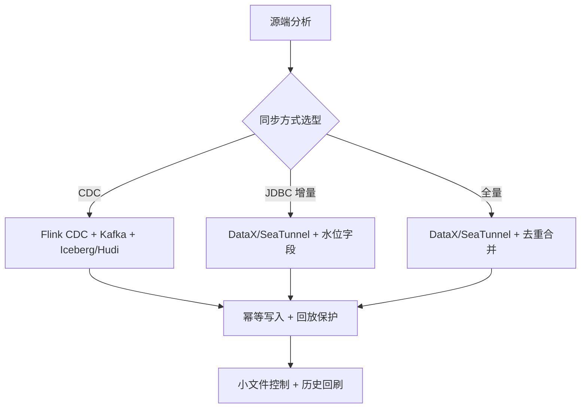

**图表来源**
- [etl-patterns.md:6-220](file://knowledge/etl-patterns.md#L6-L220)
- [scheduling-standards.md:137-166](file://rules/scheduling-standards.md#L137-L166)

**章节来源**
- [etl-patterns.md:6-220](file://knowledge/etl-patterns.md#L6-L220)
- [scheduling-standards.md:137-166](file://rules/scheduling-standards.md#L137-L166)

### 建模开发专项流程
- 分层归属：ODS/DWD/DWS/ADS/DIM 明确职责与粒度
- 维度建模：星型模型优先，代理键+业务键双键并存，SCD 策略选择
- 关系与口径：一致性维度、退化维度、桥接表、维度可关联性
- 物理设计：分区/分桶/存储格式/生命周期

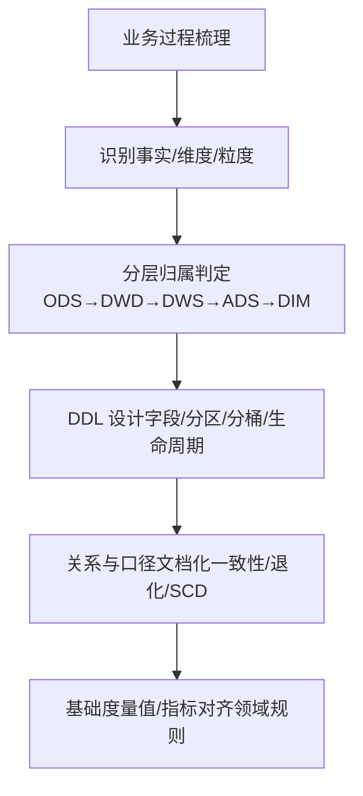

**图表来源**
- [copilot-prompt.md:95-102](file://agents/copilot-prompt.md#L95-L102)
- [modeling-standards.md:7-242](file://rules/modeling-standards.md#L7-L242)
- [dimension-modeling-tips.md:1-253](file://knowledge/dimension-modeling-tips.md#L1-L253)

**章节来源**
- [copilot-prompt.md:95-102](file://agents/copilot-prompt.md#L95-L102)
- [modeling-standards.md:7-242](file://rules/modeling-standards.md#L7-L242)

### 调度配置专项流程
- 作业与表一一对应，作业名 = 输出表名
- 基于上游完成度触发，强依赖/弱依赖明确
- SLA 基线倒推，重试与告警分级，资源队列划分
- 调度脚本头注释与变量约定，幂等写入

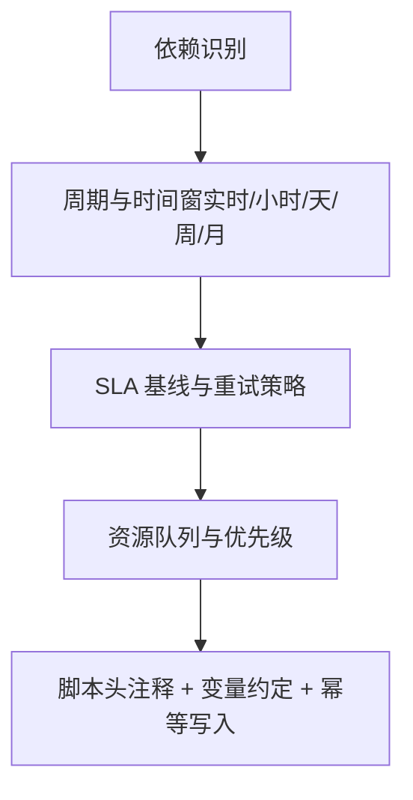

**图表来源**
- [scheduling-standards.md:7-166](file://rules/scheduling-standards.md#L7-L166)

**章节来源**
- [scheduling-standards.md:7-166](file://rules/scheduling-standards.md#L7-L166)

### 数据质量校验专项流程
- 五维度：完整性/唯一性/一致性/准确性/时效性
- 规则强制：行数上下限、主键唯一、关键字段非空、维度可关联、数值合理
- 规则上线：与作业同步上线、阈值测试、启用告警
- 历史趋势：维护 ops_dq.dq_result，周度 review

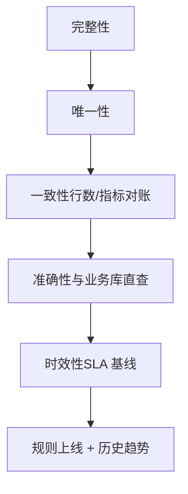

**图表来源**
- [data-quality.md:9-195](file://rules/data-quality.md#L9-L195)

**章节来源**
- [data-quality.md:9-195](file://rules/data-quality.md#L9-L195)

### 知识沉淀与复用方法
- 知识索引：每条用一句话说清核心逻辑，快速命中 sql-patterns/etl-patterns/dimension-modeling-tips/performance-tips
- 归档流程：/archive 逐条展示 log.md 知识发现，确认后沉淀到 knowledge/
- 版本追踪：每次变更自动记录结构化日志，确保可审计、可回溯

**章节来源**
- [index.md:1-60](file://knowledge/index.md#L1-L60)
- [copilot-prompt.md:129-132](file://agents/copilot-prompt.md#L129-L132)
- [version-tracker.md:44-64](file://agents/version-tracker.md#L44-L64)

## 依赖分析
- 组件耦合与内聚：提示词驱动各子 Agent 协作，rules/knowledge/changes 三库相互支撑，形成“实践 → 发现 → 沉淀 → 复用”的知识飞轮
- 外部依赖：调度系统（DolphinScheduler/Airflow）、数据源（MySQL/业务库）、存储（Hive/Spark/Iceberg）
- 变更追踪：version-tracker 与 changes/templates/log.md 协同，确保每次变更可审计

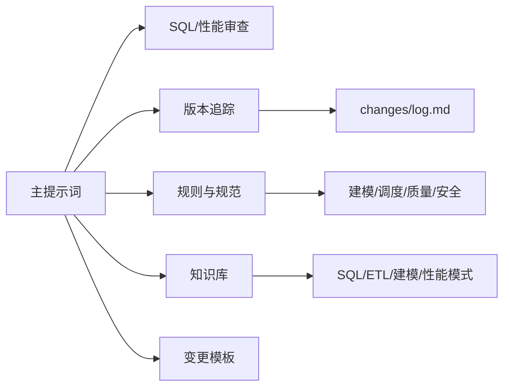

**图表来源**
- [copilot-prompt.md:63-147](file://agents/copilot-prompt.md#L63-L147)
- [version-tracker.md:44-64](file://agents/version-tracker.md#L44-L64)

**章节来源**
- [copilot-prompt.md:63-147](file://agents/copilot-prompt.md#L63-L147)
- [version-tracker.md:44-64](file://agents/version-tracker.md#L44-L64)

## 性能考虑
- 分区裁剪：WHERE 条件直接命中分区字段，禁止函数包裹
- 倾斜处理：高频空值/默认值加盐打散，或拆分 SQL
- Map Join：小表广播加速，注意阈值与 driver 内存
- 小文件合并：输出端控制并发与文件大小，AQE 自动合并
- CTE 物化：Spark/Hive 引擎差异，必要时临时表或显式 CACHE
- 谓词下推与列裁剪：WHERE 下推、只读必要列
- Join 顺序与类型：按引擎选择最优 Join，Bucket Join 跳过 Shuffle
- 窗口函数：合理 PARTITION BY，配合 DISTRIBUTE BY/SORT BY
- 存储格式与压缩：ORC/Parquet + ZSTD 优先

**章节来源**
- [performance-tips.md:5-349](file://knowledge/performance-tips.md#L5-L349)

## 故障排查指南
- 调试四阶段：现象收集 → 根因定位 → 方案验证 → 实施修复
- 诊断层级：数据源层 → 抽取层 → 数仓层（ODS/DWD/DWS/ADS）→ 应用层（BI/API）
- 审查清单：SQL 质量审查（Critical/Important/Minor）与性能审查清单
- 失败回放与回退：单分区失败重试/人工补跑；批量失败确认根因后回刷；代码/模型/数据错误的回退脚本

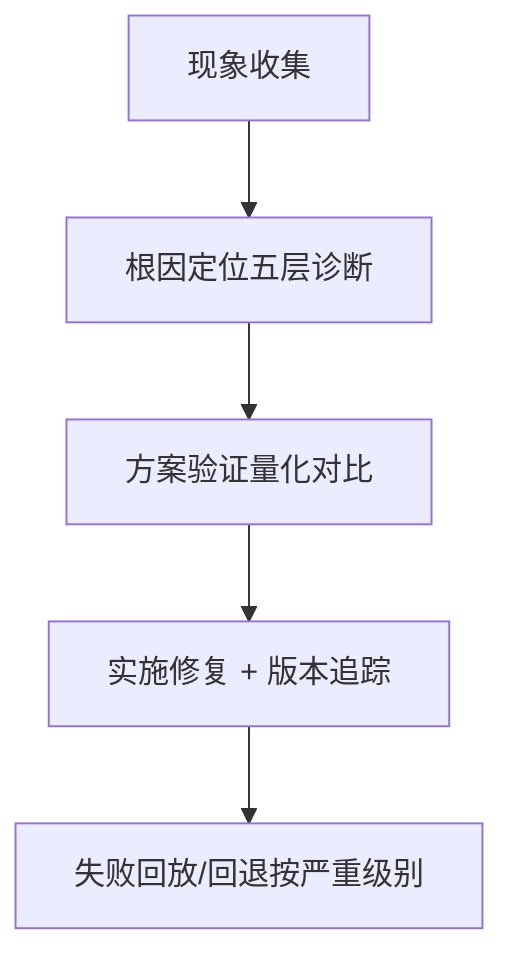

**图表来源**
- [copilot-prompt.md:133-147](file://agents/copilot-prompt.md#L133-L147)
- [sql-reviewer.md:31-64](file://agents/sql-reviewer.md#L31-L64)
- [scheduling-standards.md:205-233](file://rules/scheduling-standards.md#L205-L233)

**章节来源**
- [copilot-prompt.md:133-147](file://agents/copilot-prompt.md#L133-L147)
- [sql-reviewer.md:31-64](file://agents/sql-reviewer.md#L31-L64)
- [scheduling-standards.md:205-233](file://rules/scheduling-standards.md#L205-L233)

## 结论
本工作流程以“Spec 驱动 + 三段式知识库 + 强制变更追踪”为核心，将新建数据需求从提出到上线的全过程标准化、可审计化、可复用化。通过 SQL/ETL/建模/调度/性能/质量等专项流程与知识沉淀机制，形成持续改进的工程化闭环，既保障交付质量，又降低维护成本。

## 附录
- 命令速览：/init、/sql、/etl、/model、/propose、/apply、/review、/optimize、/dq、/schedule、/archive
- 建议实践：
  - 所有变更必须先有 spec，再实施
  - 每次 DDL/SQL/ETL/调度变更后必须触发 version-tracker
  - 性能优化必须量化对比，形成优化前后对比表
  - 数据质量规则与作业同步上线，启用告警与历史趋势分析