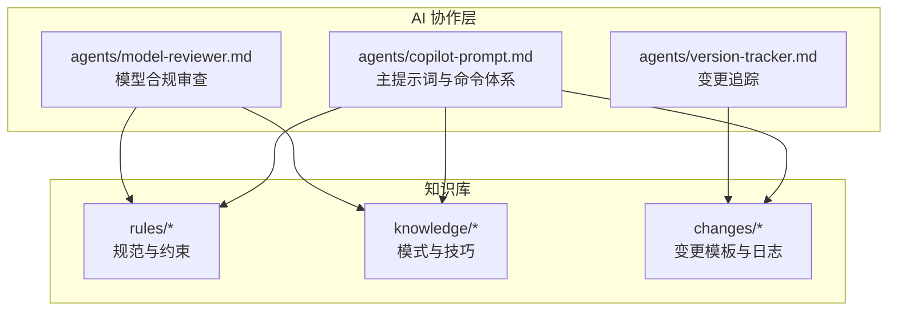
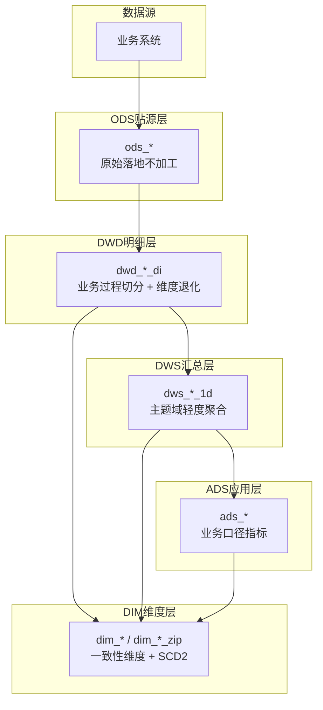
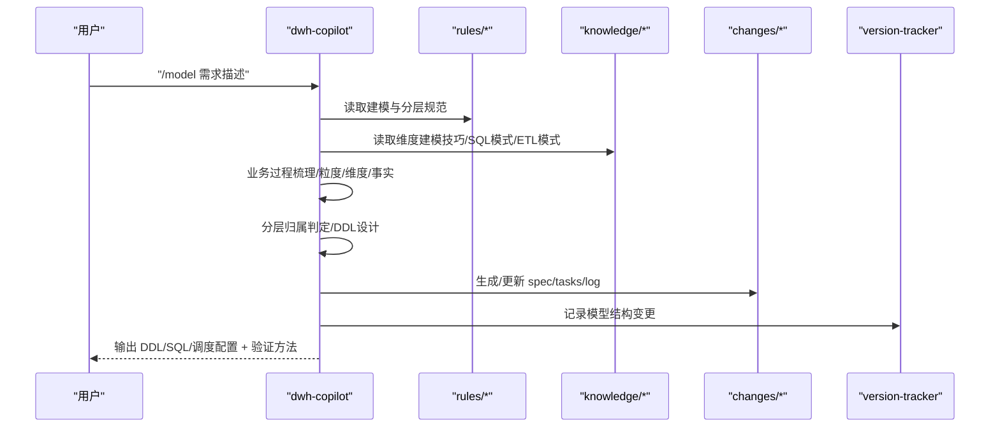
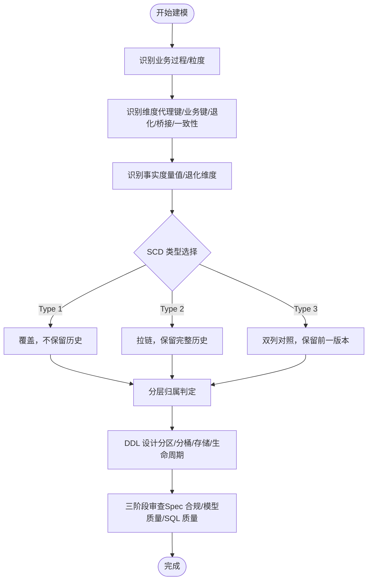
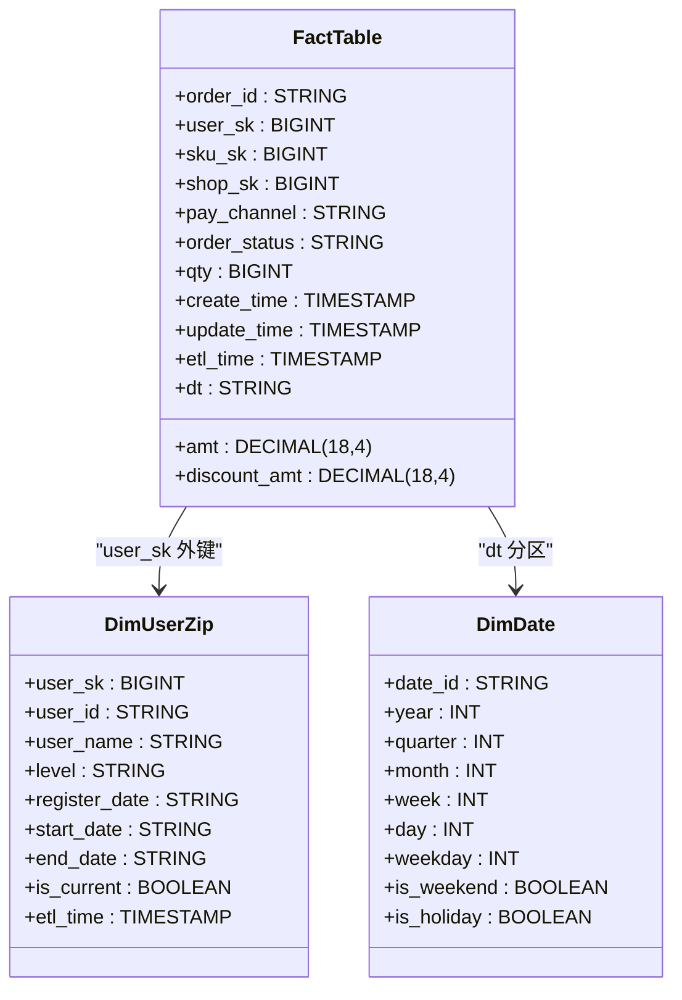
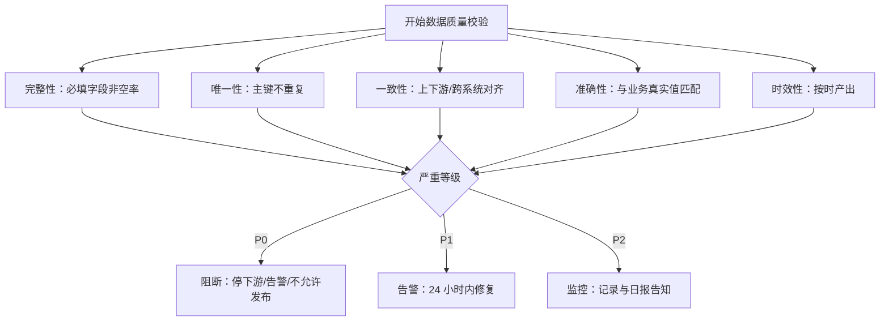
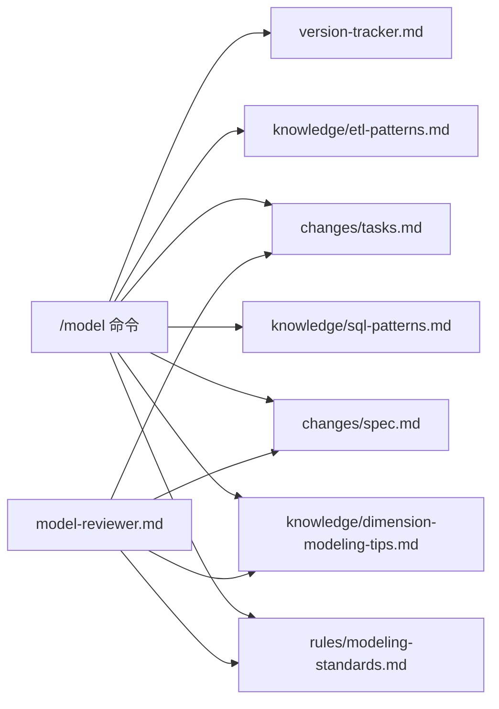

# 建模开发工作流程

<cite>
**本文引用的文件**
- [目录结构和设计说明.md](file://目录结构和设计说明.md)
- [copilot-prompt.md](file://agents/copilot-prompt.md)
- [modeling-standards.md](file://rules/modeling-standards.md)
- [dimension-modeling-tips.md](file://knowledge/dimension-modeling-tips.md)
- [sql-patterns.md](file://knowledge/sql-patterns.md)
- [etl-patterns.md](file://knowledge/etl-patterns.md)
- [performance-tips.md](file://knowledge/performance-tips.md)
- [sql-style.md](file://rules/sql-style.md)
- [domain-rules.md](file://rules/domain-rules.md)
- [model-reviewer.md](file://agents/model-reviewer.md)
- [spec.md](file://changes/templates/spec.md)
</cite>

## 目录
1. [简介](#简介)
2. [项目结构](#项目结构)
3. [核心组件](#核心组件)
4. [架构概览](#架构概览)
5. [详细组件分析](#详细组件分析)
6. [依赖分析](#依赖分析)
7. [性能考虑](#性能考虑)
8. [故障排查指南](#故障排查指南)
9. [结论](#结论)
10. [附录](#附录)

## 简介
本文件系统化阐述“建模开发”工作流程，围绕 /model 命令的使用方法，提供从需求到交付的完整规范与最佳实践。重点覆盖：
- 维度建模设计：星型模型、SCD 策略、代理键与业务键、桥接表、退化维度、一致性维度
- 分层架构规划：ODS/DWD/DWS/ADS/DIM 的职责边界与归属判定
- 表结构设计：事实表/维度表/桥接表的字段设计、分区与分桶、存储格式与生命周期
- 规范与质量检查：命名规范、SQL 风格、数据质量规则、变更追踪与三阶段审查

## 项目结构
该项目采用“提示词 + 知识库 + 变更模板”的工程化协作结构，围绕 dwh-copilot AI 协作助手构建，强调“Spec 驱动 + 三段式知识库 + 强制变更追踪”。

图表来源
- [目录结构和设计说明.md:19-55](file://目录结构和设计说明.md#L19-L55)
- [copilot-prompt.md:23-51](file://agents/copilot-prompt.md#L23-L51)

章节来源
- [目录结构和设计说明.md:19-55](file://目录结构和设计说明.md#L19-L55)
- [copilot-prompt.md:23-51](file://agents/copilot-prompt.md#L23-L51)

## 核心组件
- 角色与命令体系：AI 以 dwh-copilot 身份，遵循“Spec 驱动”与“三段式知识库”，通过 /model、/propose、/apply、/review、/dq、/schedule 等命令驱动工作流。
- 规范与约束：rules/ 下的建模与分层规范、SQL 编码规范、领域规则、数据质量规范等，构成强制约束。
- 知识与模式：knowledge/ 下的维度建模技巧、SQL 模式、ETL 模式、性能优化经验，提供可复用工具箱。
- 变更与追踪：changes/ 下的模板与日志，以及 version-tracker.md 的自动变更记录，确保所有改动可审计、可回溯。

章节来源
- [copilot-prompt.md:63-131](file://agents/copilot-prompt.md#L63-L131)
- [目录结构和设计说明.md:70-106](file://目录结构和设计说明.md#L70-L106)

## 架构概览
数仓建模遵循 Kimball 维度建模范式，采用 ODS/DWD/DWS/ADS/DIM 分层，强调：
- 星型模型优先：事实表 + 一致性维度，维度表采用代理键 + 业务键双键并存
- SCD 策略：Type 1/2/3 三选一，避免全量 SCD2 导致模型膨胀
- 维度复用：一致性维度跨主题共享，避免重复建设
- 分层归属：严格按“是否清洗/业务过程切分/聚合/直接服务报表”判定归属

图表来源
- [modeling-standards.md:7-46](file://rules/modeling-standards.md#L7-L46)
- [dimension-modeling-tips.md:233-253](file://knowledge/dimension-modeling-tips.md#L233-L253)

章节来源
- [modeling-standards.md:7-46](file://rules/modeling-standards.md#L7-L46)
- [dimension-modeling-tips.md:233-253](file://knowledge/dimension-modeling-tips.md#L233-L253)

## 详细组件分析

### /model 命令工作流
/model 命令的完整流程如下：
1) 业务过程梳理 → 选定粒度 → 识别维度 → 识别事实
2) 分层归属判定（ODS / DWD / DWS / ADS / DIM）
3) DDL 设计（表名、字段、分区、分桶、表属性、生命周期）
4) 关系与口径文档化（一致性维度、退化维度、缓慢变化维策略）
5) 基础度量值/指标定义对齐 domain-rules.md 的 KPI 标准
6) 变更记录：完成后触发 version-tracker，记录模型结构变更

图表来源
- [copilot-prompt.md:95-102](file://agents/copilot-prompt.md#L95-L102)
- [modeling-standards.md:73-115](file://rules/modeling-standards.md#L73-L115)
- [dimension-modeling-tips.md:39-83](file://knowledge/dimension-modeling-tips.md#L39-L83)

章节来源
- [copilot-prompt.md:95-102](file://agents/copilot-prompt.md#L95-L102)
- [modeling-standards.md:73-115](file://rules/modeling-standards.md#L73-L115)
- [dimension-modeling-tips.md:39-83](file://knowledge/dimension-modeling-tips.md#L39-L83)

### 维度建模最佳实践
- 代理键 vs 业务键：推荐双键并存，拉链表/跨系统集成必须用代理键
- SCD 策略：Type 1（覆盖，不保留历史）、Type 2（拉链，保留完整历史）、Type 3（双列对照，保留前一版本）
- 桥接表：解决多对多或多值维度，需权重字段与时间窗口
- 退化维度：低基数且仅事实表内使用可退化为事实表列
- 一致性维度：跨主题共享，避免重复建设，变更需广播预警
- 事实表类型：事务事实表（单事件）、周期快照（等间隔状态）、累积快照（流程里程碑）、无事实事实表（仅记录事件）

图表来源
- [dimension-modeling-tips.md:5-36](file://knowledge/dimension-modeling-tips.md#L5-L36)
- [dimension-modeling-tips.md:39-83](file://knowledge/dimension-modeling-tips.md#L39-L83)
- [dimension-modeling-tips.md:86-122](file://knowledge/dimension-modeling-tips.md#L86-L122)
- [dimension-modeling-tips.md:125-155](file://knowledge/dimension-modeling-tips.md#L125-L155)
- [dimension-modeling-tips.md:158-176](file://knowledge/dimension-modeling-tips.md#L158-L176)
- [dimension-modeling-tips.md:179-204](file://knowledge/dimension-modeling-tips.md#L179-L204)

章节来源
- [dimension-modeling-tips.md:5-36](file://knowledge/dimension-modeling-tips.md#L5-L36)
- [dimension-modeling-tips.md:39-83](file://knowledge/dimension-modeling-tips.md#L39-L83)
- [dimension-modeling-tips.md:86-122](file://knowledge/dimension-modeling-tips.md#L86-L122)
- [dimension-modeling-tips.md:125-155](file://knowledge/dimension-modeling-tips.md#L125-L155)
- [dimension-modeling-tips.md:158-176](file://knowledge/dimension-modeling-tips.md#L158-L176)
- [dimension-modeling-tips.md:179-204](file://knowledge/dimension-modeling-tips.md#L179-L204)

### 分层架构与表结构设计
- 分层职责：ODS 原始落地、DWD 业务过程切分、DIM 一致性维度、DWS 轻度聚合、ADS 业务口径指标
- 事实表设计：仅保留外键、退化维度、度量值；大型事实表必须按 dt 分区；事务事实表 di 与累积快照 da 严格区分
- 维度表设计：代理键 + 业务键双键并存；拉链表必须有 start_date/end_date/is_current；小型维度表可用全量快照
- 物理设计：分区 dt、二级分区按需；分桶 Join 同一主键；存储格式优先 ORC/Parquet，压缩 ZSTD/Snappy；生命周期按层设定

图表来源
- [modeling-standards.md:89-114](file://rules/modeling-standards.md#L89-L114)
- [modeling-standards.md:126-142](file://rules/modeling-standards.md#L126-L142)
- [modeling-standards.md:171-193](file://rules/modeling-standards.md#L171-L193)

章节来源
- [modeling-standards.md:89-114](file://rules/modeling-standards.md#L89-L114)
- [modeling-standards.md:126-142](file://rules/modeling-standards.md#L126-L142)
- [modeling-standards.md:171-193](file://rules/modeling-standards.md#L171-L193)

### 规范与质量检查标准
- 命名规范：库/表/字段统一小写，关键字大写，前缀标识层与粒度后缀，分区字段 dt
- SQL 风格：分区裁剪、幂等覆盖、CTE 命名、头部注释、禁止 SELECT *
- 数据质量：完整性/唯一性/一致性/准确性/时效性五维度，严重等级 P0/P1/P2
- 指标口径：KPI 字典与业务定义一致，同名指标必须同口径
- 变更追踪：每次 DDL/SQL/ETL/调度变更自动记录，形成可审计的变更日志

图表来源
- [domain-rules.md:69-91](file://rules/domain-rules.md#L69-L91)
- [domain-rules.md:129-135](file://rules/domain-rules.md#L129-L135)

章节来源
- [sql-style.md:7-94](file://rules/sql-style.md#L7-L94)
- [sql-style.md:165-201](file://rules/sql-style.md#L165-L201)
- [domain-rules.md:69-91](file://rules/domain-rules.md#L69-L91)
- [domain-rules.md:129-135](file://rules/domain-rules.md#L129-L135)

## 依赖分析
- 命令与流程：/model 依赖 rules/modeling-standards.md 与 knowledge/dimension-modeling-tips.md，生成 changes/spec.md 与 tasks.md，完成后触发 version-tracker
- 审查与合规：model-reviewer.md 对模型结构、分层归属、建模合规、物理设计进行独立验证
- ETL 与 SQL：etl-patterns.md 与 sql-patterns.md 提供 CDC/JDBC/MERGE/回刷/同环比/TopN 等模式

图表来源
- [copilot-prompt.md:95-102](file://agents/copilot-prompt.md#L95-L102)
- [model-reviewer.md:6-29](file://agents/model-reviewer.md#L6-L29)
- [spec.md:49-77](file://changes/templates/spec.md#L49-L77)

章节来源
- [copilot-prompt.md:95-102](file://agents/copilot-prompt.md#L95-L102)
- [model-reviewer.md:6-29](file://agents/model-reviewer.md#L6-L29)
- [spec.md:49-77](file://changes/templates/spec.md#L49-L77)

## 性能考虑
- 分区裁剪：大型分区表 WHERE 条件必须直接命中 dt，禁止函数包裹
- 数据倾斜：热点键可通过过滤/加盐/Map Join 解决；配置自适应倾斜优化
- 小文件：控制 reduce 数、DISTRIBUTE BY、AQE 自动合并；周期性合并
- CTE 物化：Hive/Spark 中多次引用的复杂 CTE 先落临时表或 CACHE
- 谓词下推与列裁剪：WHERE 下推、只读必要列、避免 SELECT *
- Join 顺序与类型：Broadcast Join 优先小表；Bucket Join 两侧分桶一致
- 存储格式与压缩：大表优先 ORC/Parquet + ZSTD/Snappy；列存收益显著
- 调度与资源：错峰调度、依赖就绪触发、SLA 基线、失败重试

章节来源
- [performance-tips.md:5-39](file://knowledge/performance-tips.md#L5-L39)
- [performance-tips.md:42-98](file://knowledge/performance-tips.md#L42-L98)
- [performance-tips.md:138-165](file://knowledge/performance-tips.md#L138-L165)
- [performance-tips.md:167-193](file://knowledge/performance-tips.md#L167-L193)
- [performance-tips.md:196-229](file://knowledge/performance-tips.md#L196-L229)
- [performance-tips.md:232-256](file://knowledge/performance-tips.md#L232-L256)
- [performance-tips.md:286-305](file://knowledge/performance-tips.md#L286-L305)
- [performance-tips.md:308-324](file://knowledge/performance-tips.md#L308-L324)

## 故障排查指南
- 调试流程：现象收集 → 根因定位 → 方案验证 → 实施修复
- 诊断层级：数据源层 → 抽取层 → ODS 层 → DWD 层 → DWS 层 → ADS 层 → 应用层
- 常见问题：
  - 分区裁剪失效：WHERE 条件包裹分区字段
  - 数据倾斜：热点键/默认值/时间集中
  - 小文件爆炸：reduce 数过多/未合并
  - SCD2 Join 缺少时间窗口：未带 BETWEEN u.start_date AND u.end_date
  - 跨层反向依赖：DWD 直接读 ADS、ADS 直接读 ODS
  - 指标口径不一致：同名指标不同口径未改名

章节来源
- [copilot-prompt.md:133-146](file://agents/copilot-prompt.md#L133-L146)
- [dimension-modeling-tips.md:80-83](file://knowledge/dimension-modeling-tips.md#L80-L83)
- [modeling-standards.md:163-168](file://rules/modeling-standards.md#L163-L168)

## 结论
通过规范化的 /model 工作流与三段式知识库，本项目实现了：
- 可复用的维度建模技巧与 SQL/ETL 模式
- 强约束的建模与分层规范、SQL 风格与数据质量规则
- 可审计的变更追踪与三阶段审查机制
建议在实际实施中坚持“Spec 驱动”，严格遵循分层与建模规范，确保模型可维护、可扩展、可审计。

## 附录
- 命令速览：/sql、/etl、/model、/propose、/apply、/review、/optimize、/dq、/schedule、/archive
- 变更模板：spec.md、tasks.md、log.md、validation-spec.md
- 建议实践：先生成 spec 与 tasks，再逐项 apply，完成后 review 与 archive

章节来源
- [目录结构和设计说明.md:80-97](file://目录结构和设计说明.md#L80-L97)
- [spec.md:1-132](file://changes/templates/spec.md#L1-L132)