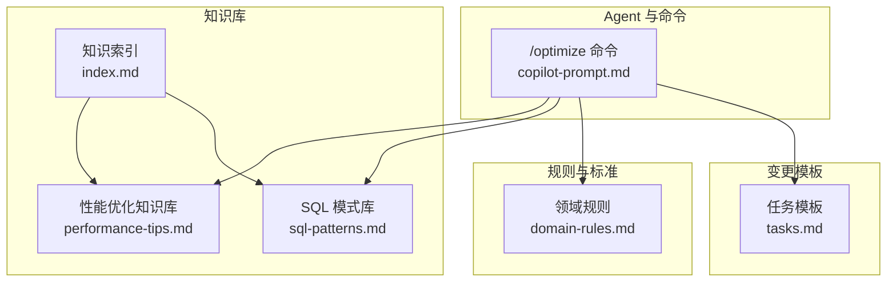
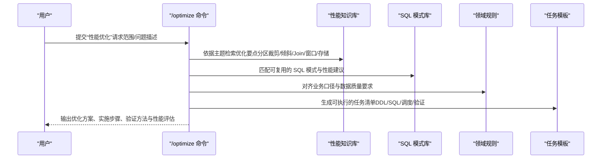
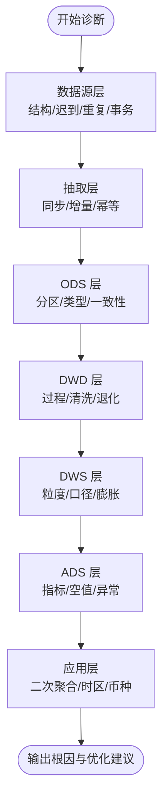
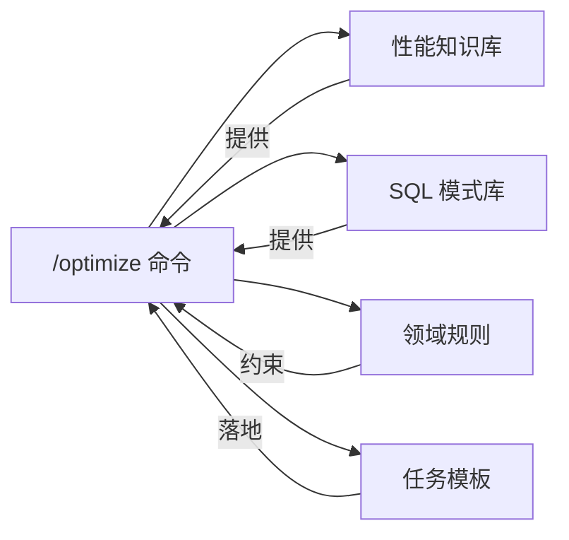

# 性能优化工作流程

<cite>
**本文引用的文件**
- [copilot-prompt.md](file://data_warehouse_engineering_code_copilot/agents/copilot-prompt.md)
- [performance-tips.md](file://data_warehouse_engineering_code_copilot/knowledge/performance-tips.md)
- [sql-patterns.md](file://data_warehouse_engineering_code_copilot/knowledge/sql-patterns.md)
- [domain-rules.md](file://data_warehouse_engineering_code_copilot/rules/domain-rules.md)
- [tasks.md](file://data_warehouse_engineering_code_copilot/changes/templates/tasks.md)
- [index.md](file://data_warehouse_engineering_code_copilot/knowledge/index.md)
</cite>

## 目录
1. [简介](#简介)
2. [项目结构](#项目结构)
3. [核心组件](#核心组件)
4. [架构总览](#架构总览)
5. [详细组件分析](#详细组件分析)
6. [依赖关系分析](#依赖关系分析)
7. [性能考量](#性能考量)
8. [故障排查指南](#故障排查指南)
9. [结论](#结论)
10. [附录](#附录)

## 简介
本文件围绕“/optimize”性能优化命令的工作流程，系统化梳理从问题识别、根因诊断、优化方案制定、实施与验证到持续监控的全流程方法论。结合仓库内的性能知识库、SQL 模式库、领域规则与变更模板，形成可落地、可复用、可审计的性能优化标准流程，覆盖分区裁剪、数据倾斜、小文件、谓词下推、Join 顺序与类型、窗口函数、存储格式与压缩、调度与资源等关键主题。

## 项目结构
该代码库以“知识库 + 规则 + 变更模板”的方式组织性能优化相关内容，便于在不同阶段快速检索与复用最佳实践。

图表来源
- [copilot-prompt.md:117-119](file://data_warehouse_engineering_code_copilot/agents/copilot-prompt.md#L117-L119)
- [performance-tips.md:1-349](file://data_warehouse_engineering_code_copilot/knowledge/performance-tips.md#L1-L349)
- [sql-patterns.md:1-331](file://data_warehouse_engineering_code_copilot/knowledge/sql-patterns.md#L1-L331)
- [index.md:38-48](file://data_warehouse_engineering_code_copilot/knowledge/index.md#L38-L48)
- [domain-rules.md:1-142](file://data_warehouse_engineering_code_copilot/rules/domain-rules.md#L1-L142)
- [tasks.md:1-74](file://data_warehouse_engineering_code_copilot/changes/templates/tasks.md#L1-L74)

章节来源
- [copilot-prompt.md:117-119](file://data_warehouse_engineering_code_copilot/agents/copilot-prompt.md#L117-L119)
- [index.md:38-48](file://data_warehouse_engineering_code_copilot/knowledge/index.md#L38-L48)

## 核心组件
- /optimize 命令：定义四层诊断范围（数据源层 → 抽取层 → 数仓层（ODS/DWD/DWS/ADS）→ 应用层），要求量化优化前后对比指标（扫描量、运行耗时、资源消耗、成本）。
- 性能知识库：覆盖分区裁剪、数据倾斜、Map/Broadcast Join、小文件、CTE 物化、谓词下推与列裁剪、Join 顺序与类型、窗口函数、存储格式与压缩、调度与资源、性能分析工具等。
- SQL 模式库：提供经验证的高质量 SQL 模式（去重保留最新、拉链表、同环比、TopN、累计求和、行转列/列转行、数据回刷、Lambda 合并、缺失日期补齐、NULL 安全比较）及其性能说明。
- 领域规则：明确业务口径、KPI 定义、数据质量五大维度、跨系统一致性、项目特定规则等，确保优化方案与业务目标一致。
- 任务模板：将优化工作拆分为可独立验证的原子任务，明确 DDL/SQL/ETL/调度变更、验收标准、验证方法、回刷计划与性能影响评估。

章节来源
- [copilot-prompt.md:117-119](file://data_warehouse_engineering_code_copilot/agents/copilot-prompt.md#L117-L119)
- [performance-tips.md:1-349](file://data_warehouse_engineering_code_copilot/knowledge/performance-tips.md#L1-L349)
- [sql-patterns.md:1-331](file://data_warehouse_engineering_code_copilot/knowledge/sql-patterns.md#L1-L331)
- [domain-rules.md:69-91](file://data_warehouse_engineering_code_copilot/rules/domain-rules.md#L69-L91)
- [tasks.md:1-74](file://data_warehouse_engineering_code_copilot/changes/templates/tasks.md#L1-L74)

## 架构总览
性能优化工作流采用“命令驱动 + 知识复用 + 模板落地 + 规则约束”的闭环架构，确保优化过程可追踪、可验证、可沉淀。

图表来源
- [copilot-prompt.md:117-119](file://data_warehouse_engineering_code_copilot/agents/copilot-prompt.md#L117-L119)
- [performance-tips.md:1-349](file://data_warehouse_engineering_code_copilot/knowledge/performance-tips.md#L1-L349)
- [sql-patterns.md:1-331](file://data_warehouse_engineering_code_copilot/knowledge/sql-patterns.md#L1-L331)
- [domain-rules.md:69-91](file://data_warehouse_engineering_code_copilot/rules/domain-rules.md#L69-L91)
- [tasks.md:1-74](file://data_warehouse_engineering_code_copilot/changes/templates/tasks.md#L1-L74)

## 详细组件分析

### 1. 识别与诊断（四层诊断）
- 数据源层：检查源表结构变更、迟到/重复数据、事务边界；确认抽取层增量字段单调性、CDC 是否丢失。
- 抽取层：验证同步成功、幂等与回放能力。
- 数仓层（ODS/DWD/DWS/ADS）：核对分区完整性、字段类型匹配、业务过程完整性、维度退化与口径一致性、聚合粒度与空值处理。
- 应用层：确认下游 BI/API 的二次聚合、时区/币种处理。

图表来源
- [copilot-prompt.md:137-146](file://data_warehouse_engineering_code_copilot/agents/copilot-prompt.md#L137-L146)

章节来源
- [copilot-prompt.md:137-146](file://data_warehouse_engineering_code_copilot/agents/copilot-prompt.md#L137-L146)

### 2. 性能问题识别与定位
- 分区裁剪：WHERE 条件必须直接命中分区字段，避免函数包裹导致全表扫描；通过 EXPLAIN/EXPLAIN EXTENDED 验证 PartitionFilters。
- 数据倾斜：关注 99% 卡住、reducer 数据量悬殊、OOM；热点键/默认值/时间集中是常见原因。
- 小文件：NameNode 压力、Map Task 启动开销大、查询性能下降；通过 reduce 数与 DISTRIBUTE BY 控制，AQE 合并或运维任务合并。
- 谓词下推与列裁剪：WHERE 下推到数据源层、只读必要列；UDF 与 SELECT * 会破坏下推。
- Join 顺序与类型：Hive/Spark/MaxCompute 的策略差异；Bucket Join 可跳过 Shuffle。
- 窗口函数：PARTITION BY 基数过低/过高都会带来性能问题；配合 DISTRIBUTE BY/SORT BY。
- 存储格式与压缩：ORC/Parquet 在列存与压缩上的收益显著；TextFile/JSON 性能较差。
- 调度与资源：资源队列划分、错峰调度、SLA 基线、失败重试与告警。

章节来源
- [performance-tips.md:5-349](file://data_warehouse_engineering_code_copilot/knowledge/performance-tips.md#L5-L349)

### 3. 优化方案制定与实施
- 分区裁剪：修正 WHERE 条件，避免函数包裹；验证执行计划。
- 数据倾斜：过滤+单独处理、加盐打散（二次聚合）、Map Join 小表；配置自适应倾斜处理参数。
- Map/Broadcast Join：调整阈值或显式 Hint；注意 Driver 内存累积风险。
- 小文件：控制 reduce 数与 DISTRIBUTE BY；启用 AQE 合并；定期运维合并。
- CTE 物化：复杂多次引用先落临时表；Spark 可显式 CACHE 并注意释放。
- 谓词下推与列裁剪：WHERE 各自约束；避免 UDF；避免 SELECT *。
- Join 顺序与类型：按引擎特性选择；Bucket Join 跳过 Shuffle。
- 窗口函数：合理 PARTITION BY；必要时预排序；配合 DISTRIBUTE BY/SORT BY。
- 存储格式与压缩：大型分析表优先 ORC/Parquet+ZSTD；小表/临时表用 Parquet+Snappy。
- 调度与资源：队列隔离、错峰调度、SLA 基线、指数退避重试。

章节来源
- [performance-tips.md:5-349](file://data_warehouse_engineering_code_copilot/knowledge/performance-tips.md#L5-L349)

### 4. 实施验证与回归
- 量化对比：扫描量、运行耗时、资源消耗、成本；确保优化前后可比。
- 验证方法：行数核验、关键字段非空率、主键唯一性、与基准来源对账、单作业耗时。
- 回刷计划：范围、分批策略、失败处理；确保幂等覆盖。
- 持续监控：上线后观察期与回退方案、遗留问题跟踪。

章节来源
- [tasks.md:43-52](file://data_warehouse_engineering_code_copilot/changes/templates/tasks.md#L43-L52)
- [copilot-prompt.md:31-33](file://data_warehouse_engineering_code_copilot/agents/copilot-prompt.md#L31-L33)

### 5. 性能优化案例（实战场景）
- SQL 优化：基于 SQL 模式库中的去重保留最新、拉链表、同环比、TopN、累计求和、行转列/列转行、数据回刷、Lambda 合并、缺失日期补齐、NULL 安全比较等模式，结合性能知识库的分区裁剪、倾斜治理、Join 优化、窗口函数与存储格式建议，形成可复用的优化路径。
- 表结构优化：优先采用 ORC/Parquet 存储，按查询模式设计列顺序与压缩；对大表启用分区与分桶（Bucket Join）；对维度表启用 Map Join 小表策略。
- 分区策略优化：确保 WHERE 条件直接命中分区字段；对热点日期/键进行倾斜治理；通过 DISTRIBUTE BY 与 reduce 数控制小文件；利用 AQE 合并与运维任务定期合并。

章节来源
- [sql-patterns.md:6-331](file://data_warehouse_engineering_code_copilot/knowledge/sql-patterns.md#L6-L331)
- [performance-tips.md:5-349](file://data_warehouse_engineering_code_copilot/knowledge/performance-tips.md#L5-L349)

## 依赖关系分析
- /optimize 命令依赖性能知识库与 SQL 模式库提供优化要点与可复用模式。
- 领域规则为优化方案提供业务与质量约束，确保指标口径一致、数据质量达标。
- 任务模板将优化工作拆分为可验证的原子任务，确保实施过程可审计、可回溯。

图表来源
- [copilot-prompt.md:117-119](file://data_warehouse_engineering_code_copilot/agents/copilot-prompt.md#L117-L119)
- [performance-tips.md:1-349](file://data_warehouse_engineering_code_copilot/knowledge/performance-tips.md#L1-L349)
- [sql-patterns.md:1-331](file://data_warehouse_engineering_code_copilot/knowledge/sql-patterns.md#L1-L331)
- [domain-rules.md:69-91](file://data_warehouse_engineering_code_copilot/rules/domain-rules.md#L69-L91)
- [tasks.md:1-74](file://data_warehouse_engineering_code_copilot/changes/templates/tasks.md#L1-L74)

章节来源
- [copilot-prompt.md:117-119](file://data_warehouse_engineering_code_copilot/agents/copilot-prompt.md#L117-L119)
- [domain-rules.md:69-91](file://data_warehouse_engineering_code_copilot/rules/domain-rules.md#L69-L91)

## 性能考量
- 扫描量与 IO：优先列裁剪与谓词下推，减少磁盘与网络 IO。
- Shuffle 与网络：通过 Map Join/Broadcast Join、Bucket Join、DISTRIBUTE BY/SORT BY 降低 Shuffle。
- 内存与 CPU：避免不必要的全局排序与重复计算；合理设置广播阈值与自适应参数。
- 存储与压缩：大型分析表采用 ORC/Parquet+ZSTD；小表/临时表采用 Parquet+Snappy。
- 调度与资源：队列隔离、错峰调度、SLA 基线、失败重试与告警，保障稳定性与可预测性。

## 故障排查指南
- 通用流程：EXPLAIN 执行计划、作业历史与 Profile、Stage Metrics、数据采样定位倾斜键。
- 常用命令：SHOW PARTITIONS、DESC FORMATTED、SHOW CREATE TABLE、ANALYZE TABLE COMPUTE STATISTICS。
- 常见问题与对策：
  - 分区裁剪失效：检查 WHERE 条件是否包裹分区字段；确认执行计划 PartitionFilters。
  - 数据倾斜：过滤热点键、加盐打散、Map Join 小表；启用自适应倾斜处理。
  - 小文件：控制 reduce 数与 DISTRIBUTE BY；启用 AQE 合并；定期运维合并。
  - 谓词下推失效：WHERE 放在各自约束；避免 UDF；避免 SELECT *。
  - Join 顺序不当：按引擎特性选择；Bucket Join 跳过 Shuffle。
  - 窗口函数：PARTITION BY 基数适中；必要时预排序与 DISTRIBUTE BY/SORT BY。
  - 存储格式：大型分析表优先 ORC/Parquet+ZSTD；避免 TextFile/JSON。

章节来源
- [performance-tips.md:327-349](file://data_warehouse_engineering_code_copilot/knowledge/performance-tips.md#L327-L349)

## 结论
通过“/optimize 命令 + 性能知识库 + SQL 模式库 + 领域规则 + 任务模板”的协同机制，可以形成标准化、可复用、可审计的性能优化工作流。建议在日常工作中：
- 将性能优化纳入变更流程，量化对比扫描量、耗时与资源消耗；
- 优先采用分区裁剪、倾斜治理、Map/Broadcast Join、列存与压缩等低成本高收益策略；
- 以任务模板落地优化方案，确保可验证、可回溯、可沉淀；
- 依托领域规则与数据质量标准，确保优化与业务目标一致、与质量基线相符。

## 附录
- 术语与约定：分区字段 dt/ds/pt、Map Join/Broadcast Join、Bucket Join、CTE 物化、谓词下推、列裁剪、倾斜、AQE 合并。
- 参考文件：
  - [copilot-prompt.md:117-119](file://data_warehouse_engineering_code_copilot/agents/copilot-prompt.md#L117-L119)
  - [performance-tips.md:1-349](file://data_warehouse_engineering_code_copilot/knowledge/performance-tips.md#L1-L349)
  - [sql-patterns.md:1-331](file://data_warehouse_engineering_code_copilot/knowledge/sql-patterns.md#L1-L331)
  - [domain-rules.md:69-91](file://data_warehouse_engineering_code_copilot/rules/domain-rules.md#L69-L91)
  - [tasks.md:1-74](file://data_warehouse_engineering_code_copilot/changes/templates/tasks.md#L1-L74)
  - [index.md:38-48](file://data_warehouse_engineering_code_copilot/knowledge/index.md#L38-L48)