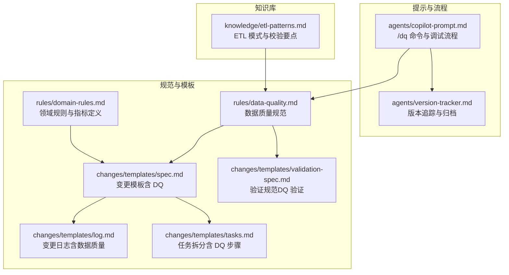
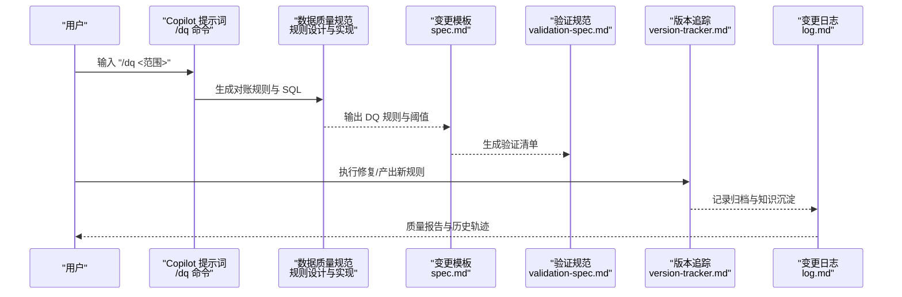
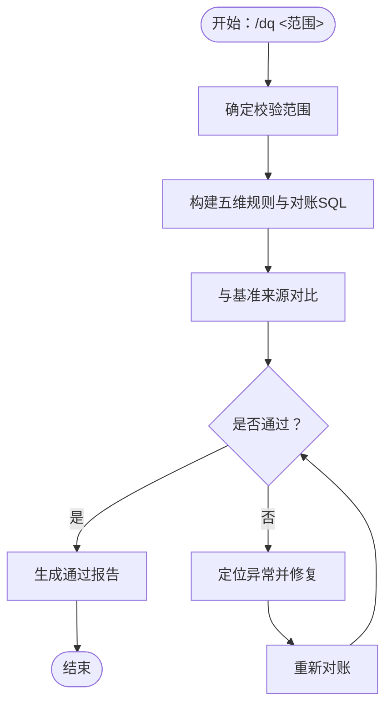
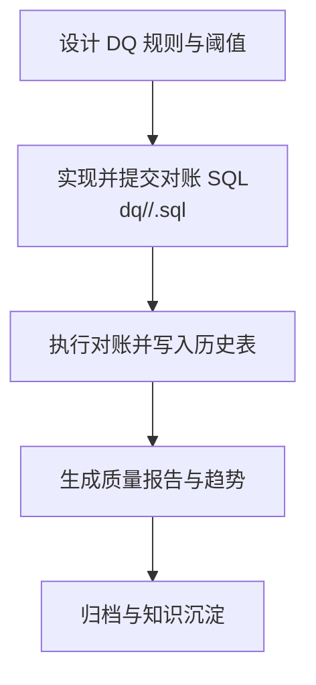
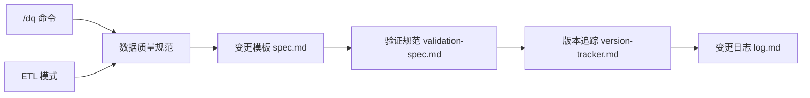
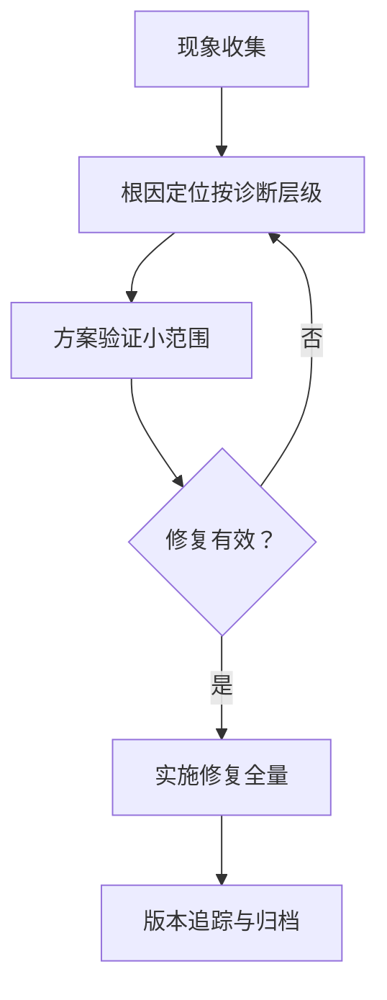

# 数据质量校验流程

<cite>
**本文引用的文件**
- [agents/copilot-prompt.md](file://agents/copilot-prompt.md)
- [rules/data-quality.md](file://rules/data-quality.md)
- [rules/domain-rules.md](file://rules/domain-rules.md)
- [changes/templates/spec.md](file://changes/templates/spec.md)
- [changes/templates/validation-spec.md](file://changes/templates/validation-spec.md)
- [knowledge/etl-patterns.md](file://knowledge/etl-patterns.md)
- [agents/version-tracker.md](file://agents/version-tracker.md)
- [changes/templates/log.md](file://changes/templates/log.md)
- [changes/templates/tasks.md](file://changes/templates/tasks.md)
</cite>

## 目录
1. [引言](#引言)
2. [项目结构](#项目结构)
3. [核心组件](#核心组件)
4. [架构总览](#架构总览)
5. [详细组件分析](#详细组件分析)
6. [依赖关系分析](#依赖关系分析)
7. [性能考量](#性能考量)
8. [故障排查指南](#故障排查指南)
9. [结论](#结论)
10. [附录](#附录)

## 引言
本文件围绕“/dq 命令”的数据质量校验标准流程进行系统化梳理，覆盖五大维度（完整性、唯一性、一致性、准确性、时效性）、对账规则生成、异常数据处理、质量报告与历史沉淀、以及最佳实践与自动化方案。目标是帮助读者快速理解并落地数据质量保障体系，确保从数据源到应用层的全链路数据可信。

## 项目结构
该仓库以知识与规范为主，围绕数据质量的关键文件分布如下：
- agents：Copilot 提示词与版本追踪，定义 /dq 命令与调试流程
- rules：数据质量规范、领域规则与建模标准
- changes/templates：变更模板与验收规范，包含数据质量规则与验证项
- knowledge：ETL 模式与常见问题处理要点
- agents/version-tracker.md：与 /dq 相关的变更追踪与归档

**图表来源**
- [agents/copilot-prompt.md:120-146](file://agents/copilot-prompt.md#L120-L146)
- [rules/data-quality.md:4-170](file://rules/data-quality.md#L4-L170)
- [rules/domain-rules.md:45-84](file://rules/domain-rules.md#L45-L84)
- [changes/templates/spec.md:5-110](file://changes/templates/spec.md#L5-L110)
- [changes/templates/validation-spec.md:80-90](file://changes/templates/validation-spec.md#L80-L90)
- [changes/templates/log.md:31-60](file://changes/templates/log.md#L31-L60)
- [changes/templates/tasks.md:2-50](file://changes/templates/tasks.md#L2-L50)
- [knowledge/etl-patterns.md:20-170](file://knowledge/etl-patterns.md#L20-L170)
- [agents/version-tracker.md:10-80](file://agents/version-tracker.md#L10-L80)

**章节来源**
- [agents/copilot-prompt.md:120-146](file://agents/copilot-prompt.md#L120-L146)
- [rules/data-quality.md:4-170](file://rules/data-quality.md#L4-L170)
- [rules/domain-rules.md:45-84](file://rules/domain-rules.md#L45-L84)
- [changes/templates/spec.md:5-110](file://changes/templates/spec.md#L5-L110)
- [changes/templates/validation-spec.md:80-90](file://changes/templates/validation-spec.md#L80-L90)
- [changes/templates/log.md:31-60](file://changes/templates/log.md#L31-L60)
- [changes/templates/tasks.md:2-50](file://changes/templates/tasks.md#L2-L50)
- [knowledge/etl-patterns.md:20-170](file://knowledge/etl-patterns.md#L20-L170)
- [agents/version-tracker.md:10-80](file://agents/version-tracker.md#L10-L80)

## 核心组件
- /dq 命令与五大维度：定义完整性、唯一性、一致性、准确性、时效性五类规则，要求为每条规则输出可执行的对账 SQL，并与基准来源对比。
- 数据质量规范：明确 DQ 设计、实现、存储与报告路径，统一存放于 dq/<schema>/<table>.sql，维护 ops_dq.dq_result 历史表。
- 领域规则与指标：KPI 定义需明确编号、名称、业务定义、计算公式、数据来源、粒度、更新频率、目标值/基准、责任人与适用范围；同名指标必须同口径。
- 变更模板与验证：spec 中必须包含数据质量规则（DQ），validation-spec 中包含 DQ 验证项；任务拆分中包含主键唯一性校验等步骤。
- ETL 模式与校验：强调 schema 校验、CDC/GTID 校验、CSV/Excel 解析与入库校验等。
- 版本追踪与归档：/dq 相关的规则产出与修复属于版本追踪范畴，完成后触发归档与知识沉淀。

**章节来源**
- [agents/copilot-prompt.md:120-146](file://agents/copilot-prompt.md#L120-L146)
- [rules/data-quality.md:4-170](file://rules/data-quality.md#L4-L170)
- [rules/domain-rules.md:45-84](file://rules/domain-rules.md#L45-L84)
- [changes/templates/spec.md:5-110](file://changes/templates/spec.md#L5-L110)
- [changes/templates/validation-spec.md:80-90](file://changes/templates/validation-spec.md#L80-L90)
- [knowledge/etl-patterns.md:20-170](file://knowledge/etl-patterns.md#L20-L170)
- [agents/version-tracker.md:10-80](file://agents/version-tracker.md#L10-L80)

## 架构总览
下图展示了从“/dq 命令”到“规则产出、执行与归档”的整体流程，体现各组件之间的协作关系。

**图表来源**
- [agents/copilot-prompt.md:120-146](file://agents/copilot-prompt.md#L120-L146)
- [rules/data-quality.md:110-170](file://rules/data-quality.md#L110-L170)
- [changes/templates/spec.md:5-110](file://changes/templates/spec.md#L5-L110)
- [changes/templates/validation-spec.md:80-90](file://changes/templates/validation-spec.md#L80-L90)
- [agents/version-tracker.md:10-80](file://agents/version-tracker.md#L10-L80)
- [changes/templates/log.md:31-60](file://changes/templates/log.md#L31-L60)

## 详细组件分析

### /dq 命令与五大维度
- 命令入口：用户输入“/dq <范围>”，触发 Copilot 提示词生成对账规则与 SQL。
- 五大维度：
  - 完整性：必填字段非空率等
  - 唯一性：主键不重复等
  - 一致性：上下游/跨系统对齐
  - 准确性：与业务库直查对账
  - 时效性：按时产出
- 对账 SQL：为每条规则生成可执行 SQL，并与基准来源（业务库直查/三方系统/上一版本）对比，形成判定与报告。

**图表来源**
- [agents/copilot-prompt.md:120-146](file://agents/copilot-prompt.md#L120-L146)

**章节来源**
- [agents/copilot-prompt.md:120-146](file://agents/copilot-prompt.md#L120-L146)

### 数据质量规范（设计、实现、存储与报告）
- 设计：在 spec 的“数据质量规则（DQ）”中明确规则与阈值。
- 实现：与作业 SQL 一同提交，统一存放于 dq/<schema>/<table>.sql。
- 存储：维护 ops_dq.dq_result 历史表，每次执行追加结果，支持趋势分析与回溯。
- 报告：结合历史表与验证清单生成质量报告，支持异常定位与修复闭环。

**图表来源**
- [rules/data-quality.md:110-170](file://rules/data-quality.md#L110-L170)

**章节来源**
- [rules/data-quality.md:4-170](file://rules/data-quality.md#L4-L170)

### 领域规则与指标定义
- 指标必备属性：编号、名称、业务定义、计算公式、数据来源、粒度、更新频率、目标值/基准、责任人、适用范围。
- 同名指标必须同口径：避免跨主题口径不一致，必要时改名并在指标字典中登记别名与差异。

**章节来源**
- [rules/domain-rules.md:45-84](file://rules/domain-rules.md#L45-L84)

### 变更模板与验证（spec 与 validation-spec）
- spec 模板：在“变更类型”中包含“数据质量”，并在“数据质量规则（DQ）”中列出规则与阈值。
- validation-spec：包含“数据质量规则验证”项，用于验收与回归测试。
- 任务拆分：在任务推进中包含主键唯一性校验等步骤，确保 DQ 落地。

**章节来源**
- [changes/templates/spec.md:5-110](file://changes/templates/spec.md#L5-L110)
- [changes/templates/validation-spec.md:80-90](file://changes/templates/validation-spec.md#L80-L90)
- [changes/templates/tasks.md:2-50](file://changes/templates/tasks.md#L2-L50)

### ETL 模式与校验要点
- schema 校验：列数、列名、类型不一致时阻断并告警。
- CDC/GTID 校验：MySQL 主备切换时位点跳变，订阅端需做 GTID 校验。
- CSV/Excel 解析与入库：需要解析、校验、入库，确保数据质量。

**章节来源**
- [knowledge/etl-patterns.md:20-170](file://knowledge/etl-patterns.md#L20-L170)

### 版本追踪与归档（/dq 相关）
- 当 /dq 命令产出新的对账规则或修复了数据问题时，触发版本追踪与归档。
- 归档完成后记录到知识库，形成可追溯的质量改进闭环。

**章节来源**
- [agents/version-tracker.md:10-80](file://agents/version-tracker.md#L10-L80)
- [changes/templates/log.md:31-60](file://changes/templates/log.md#L31-L60)

## 依赖关系分析
- /dq 命令依赖 Copilot 提示词生成规则与 SQL，再由数据质量规范约束实现与存储。
- 规范与模板共同驱动变更流程，确保 DQ 规则在设计、实现、验证、归档各环节落地。
- ETL 模式为 DQ 提供上游数据质量保障基础，减少脏数据进入数仓。
- 版本追踪与归档将 DQ 改进固化为知识资产，支撑持续改进。

**图表来源**
- [agents/copilot-prompt.md:120-146](file://agents/copilot-prompt.md#L120-L146)
- [rules/data-quality.md:110-170](file://rules/data-quality.md#L110-L170)
- [changes/templates/spec.md:5-110](file://changes/templates/spec.md#L5-L110)
- [changes/templates/validation-spec.md:80-90](file://changes/templates/validation-spec.md#L80-L90)
- [agents/version-tracker.md:10-80](file://agents/version-tracker.md#L10-L80)
- [changes/templates/log.md:31-60](file://changes/templates/log.md#L31-L60)
- [knowledge/etl-patterns.md:20-170](file://knowledge/etl-patterns.md#L20-L170)

**章节来源**
- [agents/copilot-prompt.md:120-146](file://agents/copilot-prompt.md#L120-L146)
- [rules/data-quality.md:110-170](file://rules/data-quality.md#L110-L170)
- [changes/templates/spec.md:5-110](file://changes/templates/spec.md#L5-L110)
- [changes/templates/validation-spec.md:80-90](file://changes/templates/validation-spec.md#L80-L90)
- [agents/version-tracker.md:10-80](file://agents/version-tracker.md#L10-L80)
- [changes/templates/log.md:31-60](file://changes/templates/log.md#L31-L60)
- [knowledge/etl-patterns.md:20-170](file://knowledge/etl-patterns.md#L20-L170)

## 性能考量
- 对账 SQL 的执行效率直接影响 DQ 报告生成速度，建议：
  - 使用分区裁剪与索引优化，避免全表扫描
  - 对大表采用采样与阈值控制，降低计算成本
  - 将高频规则拆分为异步批处理，避免阻塞主流程
- 历史表 ops_dq.dq_result 的写入应批量提交，减少事务开销
- 报告生成采用增量汇总与缓存，避免重复计算

## 故障排查指南
- 现象收集：明确“数据对不上/做下数据质量校验/对账”等场景，定位到 /dq 命令触发点
- 根因定位：按“诊断层级”逐层排查（数据源层→抽取层→ODS/DWD/DWS/ADS→应用层）
- 方案验证：先在小范围验证修复效果，再扩大到全量
- 实施修复：禁止在未确认根因前直接修改 SQL/DDL/调度作业
- 异常处理：针对主键重复、字段类型不一致、CDC/GTID 不一致等问题，分别采取去重、阻断与告警、位点校验等措施

**图表来源**
- [agents/copilot-prompt.md:133-146](file://agents/copilot-prompt.md#L133-L146)

**章节来源**
- [agents/copilot-prompt.md:133-146](file://agents/copilot-prompt.md#L133-L146)

## 结论
通过“/dq 命令”驱动的五大维度校验、规范化的规则设计与实现、严格的变更与验证流程、以及 ETL 与版本追踪的协同，可构建覆盖全链路的数据质量保障体系。建议在实际落地中优先完善 DQ 规则与阈值、建立对账 SQL 的自动化执行与报告机制，并将修复与归档纳入版本管理，持续提升数据可信度与团队效率。

## 附录
- 关键术语
  - DQ：数据质量（Data Quality）
  - 对账 SQL：用于与基准来源对比的可执行查询
  - 历史表：ops_dq.dq_result，记录每次 DQ 执行结果
- 建议的落地清单
  - 在 spec 中明确 DQ 规则与阈值
  - 为每个表/视图生成对账 SQL 并归档
  - 建立 DQ 报告与历史表，支持趋势分析
  - 将 DQ 修复与归档纳入版本追踪
  - 在 ETL 流程中强化 schema 校验与 CDC/GTID 校验