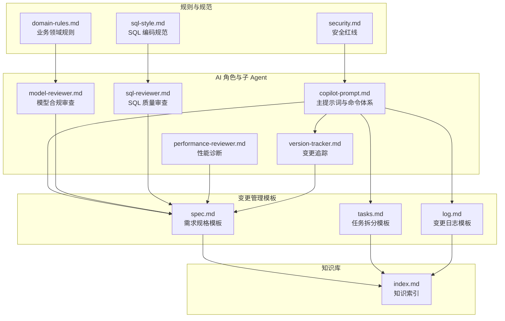
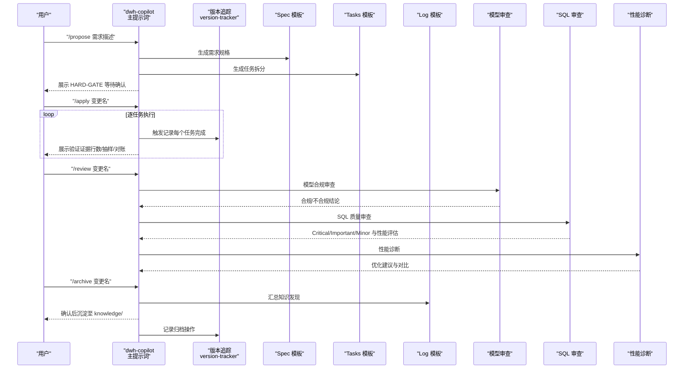
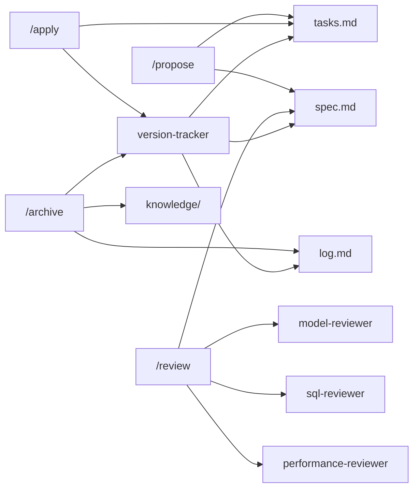
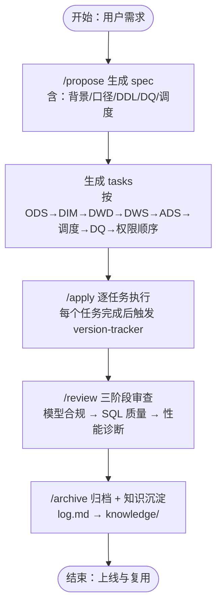

# 新建数据需求流程

<cite>
**本文引用的文件**
- [copilot-prompt.md](file://data_warehouse_engineering_code_copilot/agents/copilot-prompt.md)
- [version-tracker.md](file://data_warehouse_engineering_code_copilot/agents/version-tracker.md)
- [model-reviewer.md](file://data_warehouse_engineering_code_copilot/agents/model-reviewer.md)
- [sql-reviewer.md](file://data_warehouse_engineering_code_copilot/agents/sql-reviewer.md)
- [performance-reviewer.md](file://data_warehouse_engineering_code_copilot/agents/performance-reviewer.md)
- [spec.md](file://data_warehouse_engineering_code_copilot/changes/templates/spec.md)
- [tasks.md](file://data_warehouse_engineering_code_copilot/changes/templates/tasks.md)
- [log.md](file://data_warehouse_engineering_code_copilot/changes/templates/log.md)
- [domain-rules.md](file://data_warehouse_engineering_code_copilot/rules/domain-rules.md)
- [sql-style.md](file://data_warehouse_engineering_code_copilot/rules/sql-style.md)
- [security.md](file://data_warehouse_engineering_code_copilot/rules/security.md)
- [index.md](file://data_warehouse_engineering_code_copilot/knowledge/index.md)
- [目录结构和设计说明.md](file://data_warehouse_engineering_code_copilot/目录结构和设计说明.md)
</cite>

## 目录
1. [简介](#简介)
2. [项目结构](#项目结构)
3. [核心组件](#核心组件)
4. [架构总览](#架构总览)
5. [详细组件分析](#详细组件分析)
6. [依赖分析](#依赖分析)
7. [性能考量](#性能考量)
8. [故障排查指南](#故障排查指南)
9. [结论](#结论)
10. [附录](#附录)

## 简介
本文件系统化阐述“新建数据需求”的完整流程，围绕 Spec 驱动的工程化方法，覆盖从需求提出到最终上线的全过程：/propose 生成需求规格、/apply 执行任务、/review 质量审查、/archive 知识沉淀。文档同时给出各阶段的输入输出、检查要点、注意事项与典型流程图，帮助读者正确使用该流程。

## 项目结构
该工程采用“提示词 + 模板 + 知识库 + 规则”的组织方式，围绕 dwh-copilot 的命令体系展开：
- agents/：AI 角色与子 Agent 提示词（主提示词、SQL/模型/性能审查、版本追踪）
- changes/templates/：变更管理模板（spec、tasks、log、validation-spec）
- knowledge/：领域知识库（SQL 模式、ETL 模式、建模技巧、性能优化等）
- rules/：项目约束与规范（SQL 风格、建模标准、调度规范、数据质量、安全、领域规则）
- 目录结构和设计说明.md：总体设计与工作流说明

图表来源
- [目录结构和设计说明.md:21-55](file://data_warehouse_engineering_code_copilot/目录结构和设计说明.md#L21-L55)
- [copilot-prompt.md:55-147](file://data_warehouse_engineering_code_copilot/agents/copilot-prompt.md#L55-L147)

章节来源
- [目录结构和设计说明.md:19-55](file://data_warehouse_engineering_code_copilot/目录结构和设计说明.md#L19-L55)

## 核心组件
- 主提示词与命令体系：定义 dwh-copilot 的身份、法则、命令映射与启动流程，明确 /propose、/apply、/review、/archive 的职责与触发条件。
- 变更追踪 Agent：在每次 DDL/SQL/ETL/调度变更后自动记录结构化变更条目，确保可审计、可回溯。
- 审查子 Agent：模型合规审查（model-reviewer）、SQL 质量审查（sql-reviewer）、性能诊断（performance-reviewer），分别负责不同维度的质量把关。
- 变更模板：spec.md（需求规格）、tasks.md（任务拆分）、log.md（变更日志），支撑 Spec 驱动的全过程文档化。
- 规则与规范：sql-style.md（SQL 编码规范）、domain-rules.md（业务领域规则）、security.md（安全红线），为审查与实施提供强制约束。
- 知识库索引：index.md 提供知识快速检索入口，支持“实践 → 发现 → 沉淀 → 复用”。

章节来源
- [copilot-prompt.md:63-147](file://data_warehouse_engineering_code_copilot/agents/copilot-prompt.md#L63-L147)
- [version-tracker.md:1-120](file://data_warehouse_engineering_code_copilot/agents/version-tracker.md#L1-L120)
- [model-reviewer.md:1-50](file://data_warehouse_engineering_code_copilot/agents/model-reviewer.md#L1-L50)
- [sql-reviewer.md:1-68](file://data_warehouse_engineering_code_copilot/agents/sql-reviewer.md#L1-L68)
- [performance-reviewer.md:1-81](file://data_warehouse_engineering_code_copilot/agents/performance-reviewer.md#L1-L81)
- [spec.md:1-132](file://data_warehouse_engineering_code_copilot/changes/templates/spec.md#L1-L132)
- [tasks.md:1-74](file://data_warehouse_engineering_code_copilot/changes/templates/tasks.md#L1-L74)
- [log.md:1-61](file://data_warehouse_engineering_code_copilot/changes/templates/log.md#L1-L61)
- [sql-style.md:1-254](file://data_warehouse_engineering_code_copilot/rules/sql-style.md#L1-L254)
- [domain-rules.md:1-142](file://data_warehouse_engineering_code_copilot/rules/domain-rules.md#L1-L142)
- [security.md:1-98](file://data_warehouse_engineering_code_copilot/rules/security.md#L1-L98)
- [index.md:1-60](file://data_warehouse_engineering_code_copilot/knowledge/index.md#L1-L60)

## 架构总览
新建数据需求的端到端流程由“命令识别 → 规格生成 → 任务拆分 → 实施执行 → 质量审查 → 知识沉淀”构成，贯穿 changes/templates 与 agents/version-tracker 的协同。

图表来源
- [目录结构和设计说明.md:126-151](file://data_warehouse_engineering_code_copilot/目录结构和设计说明.md#L126-L151)
- [copilot-prompt.md:103-131](file://data_warehouse_engineering_code_copilot/agents/copilot-prompt.md#L103-L131)
- [version-tracker.md:5-15](file://data_warehouse_engineering_code_copilot/agents/version-tracker.md#L5-L15)
- [log.md:20-23](file://data_warehouse_engineering_code_copilot/changes/templates/log.md#L20-L23)

## 详细组件分析

### /propose：生成需求规格（Spec）
- 目标：基于需求描述，系统化产出需求规格（spec.md），包含背景与目标、现状分析、功能点、业务规则、模型变更、SQL 设计、ETL/同步、调度、DQ 规则、影响范围、风险与关注点、验证策略、待澄清、技术决策、执行日志、审查结论与 HARD-GATE 确认。
- 输入：自然语言需求描述。
- 输出：结构化 spec.md，含“待澄清”列表，必须全部解决后才允许进入 /apply。
- 关键检查点：
  - 现状分析必须有出处（库.表.字段、作业名、SQL 片段、截图）。
  - 业务规则必须可验证，具备判定 SQL 片段。
  - 影响范围与回刷范围需明确。
  - 风险与安全（PII/财务/历史回刷）必须标注。
- 注意事项：
  - 严格遵循 No Spec, No Change 铁律，未有 spec 不得变更。
  - 生成过程中遵循 YAGNI，逐段确认，避免过度设计。
  - HARD-GATE 必须由业务/数据负责人确认。

章节来源
- [copilot-prompt.md:103-106](file://data_warehouse_engineering_code_copilot/agents/copilot-prompt.md#L103-L106)
- [spec.md:8-132](file://data_warehouse_engineering_code_copilot/changes/templates/spec.md#L8-L132)
- [目录结构和设计说明.md:128-140](file://data_warehouse_engineering_code_copilot/目录结构和设计说明.md#L128-L140)

### /apply：执行任务（Tasks）
- 目标：按 spec 与 tasks.md 的拆分顺序逐项实施，每个任务完成后展示验证证据（行数/抽样/对账三选一），并触发版本追踪记录。
- 输入：变更名（来自 spec.md 标题）。
- 输出：每个任务的执行日志与变更记录，最终汇总到 tasks.md 的“变更摘要”。
- 关键检查点：
  - 任务原子化（聚焦单一表或单一作业）。
  - 严格按 ODS→DIM→DWD→DWS→ADS→调度→DQ→权限顺序推进。
  - 每个任务必须精确到库.表.字段/作业名/依赖。
  - 回刷任务需明确范围、分批策略与失败处理。
- 注意事项：
  - Plan 是合同，AI 是打印机，零偏差原则。
  - 每个任务完成后必须触发 version-tracker。
  - 涉及生产数据/PII/财务/历史回刷需高亮提醒人工审查。

章节来源
- [copilot-prompt.md:107-112](file://data_warehouse_engineering_code_copilot/agents/copilot-prompt.md#L107-L112)
- [tasks.md:3-74](file://data_warehouse_engineering_code_copilot/changes/templates/tasks.md#L3-L74)
- [version-tracker.md:13-15](file://data_warehouse_engineering_code_copilot/agents/version-tracker.md#L13-L15)

### /review：三阶段质量审查
- 目标：串行三阶段审查，不通过不得进入下一阶段。
  - 阶段一：Spec 合规（需求合规）。
  - 阶段二：模型质量（模型与建模规范质量）。
  - 阶段三：SQL 质量（SQL 与性能质量）。
- 输入：变更名（来自 spec.md 标题）。
- 输出：审查结论（通过/不通过）与问题清单，附性能评估与优化建议。
- 关键检查点：
  - 模型审查：缺失/多余/理解偏差、分层合规、建模合规、物理设计合规、数据变更准确性。
  - SQL 审查：Critical/Important/Minor 分级，性能审查清单（分区裁剪、Join 顺序、倾斜风险、小文件等）。
  - 性能诊断：按数据源→抽取→数仓→SQL→应用五层定位根因。
- 注意事项：
  - SQL 质量审查需在模型审查通过后启动。
  - 性能评估必须量化优化前后对比指标。

章节来源
- [copilot-prompt.md:113-116](file://data_warehouse_engineering_code_copilot/agents/copilot-prompt.md#L113-L116)
- [model-reviewer.md:6-47](file://data_warehouse_engineering_code_copilot/agents/model-reviewer.md#L6-L47)
- [sql-reviewer.md:5-64](file://data_warehouse_engineering_code_copilot/agents/sql-reviewer.md#L5-L64)
- [performance-reviewer.md:5-77](file://data_warehouse_engineering_code_copilot/agents/performance-reviewer.md#L5-L77)

### /archive：归档与知识沉淀
- 目标：汇总 changes/<change>/log.md 中的知识发现，逐条确认后沉淀到 knowledge/，并记录归档操作。
- 输入：变更名（来自 spec.md 标题）。
- 输出：knowledge/ 中新增条目，version-tracker 记录归档操作。
- 关键检查点：
  - log.md 中“知识发现”需逐条确认。
  - 分类标签（SQL 模式、建模技巧、ETL/同步技巧、调度与运维、性能优化、数据质量、数据安全与权限、业务口径）。
  - 沉淀后可用于后续项目复用。
- 注意事项：
  - 归档完成后触发 version-tracker。

章节来源
- [copilot-prompt.md:129-131](file://data_warehouse_engineering_code_copilot/agents/copilot-prompt.md#L129-L131)
- [log.md:20-35](file://data_warehouse_engineering_code_copilot/changes/templates/log.md#L20-L35)
- [index.md:27-36](file://data_warehouse_engineering_code_copilot/knowledge/index.md#L27-L36)
- [version-tracker.md:13-15](file://data_warehouse_engineering_code_copilot/agents/version-tracker.md#L13-L15)

### 版本追踪（version-tracker）：强制变更记录
- 触发时机：/sql、/etl、/model、/schedule、/dq 产出新规则或修复、/apply 每个任务完成后、用户手动要求记录。
- 记录内容：时间（精确到分）、模块、分层、任务、操作、变更内容（精确到库.表.字段/作业名）、关联文件、回刷范围、影响下游、备注。
- 记录规则：原子化、精确引用、任务可追溯、下游必标注、回刷必声明、时间精确到分钟、不阻塞主流程。
- 工具权限：只读读取与写入，不主动扫描项目文件。

章节来源
- [version-tracker.md:5-120](file://data_warehouse_engineering_code_copilot/agents/version-tracker.md#L5-L120)

### 规则与规范：约束与最佳实践
- SQL 编码规范：命名约定（库/表/字段/分区）、格式规范、编写原则、禁止事项、命名检查清单、常见错误对照。
- 业务领域规则：通用业务规则、KPI/指标定义标准、数据质量规则（五大维度、严重等级、边界值）、历史数据约定、行业特定规则、跨系统口径一致性、项目特定规则。
- 安全红线：数据安全、字段级脱敏标准、行级权限（RLS）、数据分级与访问控制、上线与发布安全、数据回刷安全、业务安全、跨境合规、安全审计、应急响应。

章节来源
- [sql-style.md:7-254](file://data_warehouse_engineering_code_copilot/rules/sql-style.md#L7-L254)
- [domain-rules.md:6-142](file://data_warehouse_engineering_code_copilot/rules/domain-rules.md#L6-L142)
- [security.md:5-98](file://data_warehouse_engineering_code_copilot/rules/security.md#L5-L98)

## 依赖分析
- 命令与模板的耦合：/propose 生成 spec.md，/apply 依赖 tasks.md，/review 依赖 spec.md 与审查子 Agent，/archive 依赖 log.md 与 knowledge/。
- 审查子 Agent 的依赖：model-reviewer 与 sql-reviewer 均以 spec.md 为依据，performance-reviewer 独立启动但可与上述审查联动。
- 版本追踪的横切关注：贯穿 /sql、/etl、/model、/schedule、/dq、/apply（每个任务）、/archive 的触发点，确保可审计性。
- 规则与规范的强制约束：审查与实施均需满足 sql-style.md、domain-rules.md、security.md 的要求。

图表来源
- [目录结构和设计说明.md:126-151](file://data_warehouse_engineering_code_copilot/目录结构和设计说明.md#L126-L151)
- [copilot-prompt.md:103-131](file://data_warehouse_engineering_code_copilot/agents/copilot-prompt.md#L103-L131)
- [version-tracker.md:5-15](file://data_warehouse_engineering_code_copilot/agents/version-tracker.md#L5-L15)

章节来源
- [目录结构和设计说明.md:126-151](file://data_warehouse_engineering_code_copilot/目录结构和设计说明.md#L126-L151)

## 性能考量
- 诊断框架：按数据源层→抽取层→数仓层（ODS/DWD/DWS/ADS）→SQL 层→应用层的五层诊断，定位分区裁剪失效、Join 顺序不当、数据倾斜、小文件、序列化开销等问题。
- 优化建议：优先补分区裁剪、倾斜键加盐打散、小文件合并、生命周期管理；每条建议必须量化优化前后对比（扫描量、运行耗时、资源消耗、成本）。
- 审查配合：SQL 质量审查与性能诊断并行，Critical/Important/Minor 分级明确修复优先级。

章节来源
- [performance-reviewer.md:5-77](file://data_warehouse_engineering_code_copilot/agents/performance-reviewer.md#L5-L77)
- [sql-reviewer.md:31-64](file://data_warehouse_engineering_code_copilot/agents/sql-reviewer.md#L31-L64)

## 故障排查指南
- 现象收集：明确问题表现（如慢查询、数据不一致、回刷失败）。
- 根因定位：按诊断层级逐层排查（数据源层→抽取层→ODS/DWD/DWS/ADS→SQL→应用层）。
- 方案验证：先在测试环境验证，再在生产环境回放，记录优化前后对比。
- 实施修复：修复后触发 version-tracker 记录变更，必要时沉淀到 knowledge/。

章节来源
- [copilot-prompt.md:133-146](file://data_warehouse_engineering_code_copilot/agents/copilot-prompt.md#L133-L146)

## 结论
通过 /propose → /apply → /review → /archive 的闭环流程，结合 Spec 驱动、三阶段审查与版本追踪，能够有效降低需求偏差、提升质量与可审计性。配套的规则与知识库为实施提供了强制约束与最佳实践支撑，确保项目在统一标准下持续演进。

## 附录

### 典型需求场景：新建 ADS 月度销售看板

图表来源
- [目录结构和设计说明.md:128-151](file://data_warehouse_engineering_code_copilot/目录结构和设计说明.md#L128-L151)