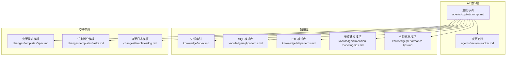
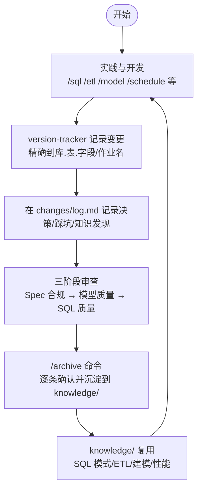
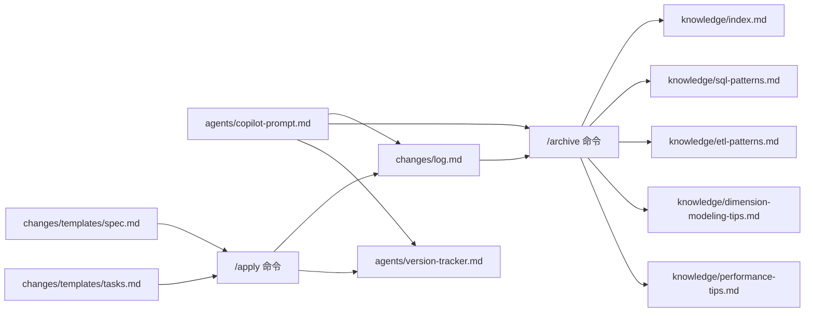

# 知识沉淀流程

<cite>
**本文引用的文件**
- [目录结构和设计说明.md](file://目录结构和设计说明.md)
- [copilot-prompt.md](file://agents/copilot-prompt.md)
- [version-tracker.md](file://agents/version-tracker.md)
- [index.md](file://knowledge/index.md)
- [sql-patterns.md](file://knowledge/sql-patterns.md)
- [etl-patterns.md](file://knowledge/etl-patterns.md)
- [dimension-modeling-tips.md](file://knowledge/dimension-modeling-tips.md)
- [performance-tips.md](file://knowledge/performance-tips.md)
- [spec.md](file://changes/templates/spec.md)
- [tasks.md](file://changes/templates/tasks.md)
- [log.md](file://changes/templates/log.md)
</cite>

## 目录
1. [简介](#简介)
2. [项目结构](#项目结构)
3. [核心组件](#核心组件)
4. [架构总览](#架构总览)
5. [详细组件分析](#详细组件分析)
6. [依赖分析](#依赖分析)
7. [性能考虑](#性能考虑)
8. [故障排查指南](#故障排查指南)
9. [结论](#结论)
10. [附录](#附录)

## 简介
本文件围绕“知识沉淀”主题，系统化梳理并输出“/archive 命令”的使用方法、经验总结、最佳实践与踩坑记录，以及知识库的维护方法、分类标准与复用机制。目标是帮助团队建立可持续的知识积累与传承机制，确保每次变更都能沉淀为可复用的经验资产。

## 项目结构
该项目采用“提示词工程 + 变更管理 + 知识库”的三段式知识结构：
- rules/：项目约束与规范（强制）
- knowledge/：领域知识与模式库（推荐复用）
- changes/：每次变更的“过程记录”（历史）

图表来源
- [目录结构和设计说明.md: 38-54:38-54](file://目录结构和设计说明.md#L38-L54)
- [目录结构和设计说明.md: 78](file://目录结构和设计说明.md#L78)
- [目录结构和设计说明.md: 186-193:186-193](file://目录结构和设计说明.md#L186-L193)

章节来源
- [目录结构和设计说明.md: 19-55:19-55](file://目录结构和设计说明.md#L19-L55)
- [目录结构和设计说明.md: 78](file://目录结构和设计说明.md#L78)

## 核心组件
- /archive 命令：将 changes/log.md 中的“知识发现/踩坑记录”逐条确认并沉淀到 knowledge/ 对应分类，形成可复用的知识条目。
- version-tracker：在每次 DDL/SQL/ETL/调度变更后自动记录结构化变更条目，支撑审计与回溯。
- knowledge/：包含 SQL 模式、ETL 模式、维度建模技巧、性能优化等高质量模式库，支持快速检索与复用。
- changes/templates/：提供规范化的变更需求、任务拆分与日志模板，保障沉淀质量与可追溯性。

章节来源
- [copilot-prompt.md: 129-131:129-131](file://agents/copilot-prompt.md#L129-L131)
- [version-tracker.md: 1-120:1-120](file://agents/version-tracker.md#L1-L120)
- [index.md: 1-60:1-60](file://knowledge/index.md#L1-L60)
- [目录结构和设计说明.md: 78](file://目录结构和设计说明.md#L78)

## 架构总览
“实践 → changes/log.md 知识发现 → /archive 归档 → knowledge/ 复用”的知识飞轮闭环如下：

图表来源
- [目录结构和设计说明.md: 78](file://目录结构和设计说明.md#L78)
- [copilot-prompt.md: 129-131:129-131](file://agents/copilot-prompt.md#L129-L131)
- [version-tracker.md: 1-120:1-120](file://agents/version-tracker.md#L1-L120)
- [log.md: 1-61:1-61](file://changes/templates/log.md#L1-L61)

## 详细组件分析

### /archive 命令使用方法与最佳实践
- 触发时机：在完成审查与验证后，进入 /archive 命令，逐条展示 changes/log.md 中的知识发现与踩坑记录，确认后沉淀到 knowledge/ 对应分类。
- 操作步骤：
  1) 打开 changes/<变更名>/log.md，逐条查看“知识发现”与“踩坑记录”。
  2) 依据“分类标签”选择合适的知识库条目类型（SQL 模式、建模技巧、ETL/同步技巧、性能优化、数据质量、安全与权限、业务口径等）。
  3) 在 knowledge/ 对应文件中新增条目，遵循“场景、代码、解释、性能说明”等结构化格式。
  4) 更新 knowledge/index.md，添加一句话索引，便于 AI 快速命中。
  5) 完成后触发 version-tracker，记录归档操作及沉淀的知识条目。
- 经验总结：
  - 沉淀条目必须可复用：提供可直接使用的 SQL/ETL 模式或建模套路，避免空泛描述。
  - 保持最小可执行单元：每个条目聚焦单一场景，便于检索与复用。
  - 注重“性能说明”：标注代价与注意事项，降低复用风险。
- 踩坑记录：
  - 避免“仅记录问题，不沉淀方案”；必须包含原因与解决方案。
  - 避免“重复沉淀”：先在 index.md 搜索是否已有类似条目，避免冗余。

章节来源
- [copilot-prompt.md: 129-131:129-131](file://agents/copilot-prompt.md#L129-L131)
- [log.md: 20-35:20-35](file://changes/templates/log.md#L20-L35)
- [index.md: 1-60:1-60](file://knowledge/index.md#L1-L60)
- [version-tracker.md: 1-120:1-120](file://agents/version-tracker.md#L1-L120)

### 知识库维护方法与分类标准
- 分类标准（来自 changes/log.md 的分类标签）：
  - SQL 模式：去重保留最新、拉链表 SCD2、同环比、TopN 分组排名、累计求和、行转列/列转行等。
  - 建模技巧：代理键 vs 业务键、SCD（Type 1/2/3）、桥接表、退化维度、一致性维度、快照事实表等。
  - ETL/同步技巧：CDC 增量同步、JDBC 增量抽取、MERGE/UPSERT、小文件合并、历史回刷、文件接入、API 拉取等。
  - 性能优化：分区裁剪、数据倾斜、Map Join、小文件、CTE 物化、谓词下推、列裁剪、窗口函数、存储格式与压缩、调度与资源等。
  - 数据质量：完整性/唯一性/一致性/准确性/时效性五维度规则与验证策略。
  - 数据安全与权限：PII/RLS/数据分级/合规等。
  - 业务口径：行业口径、公司内部 KPI 定义、跨系统对齐结论。
- 维护流程：
  1) 在 changes/log.md 中实时记录“知识发现”，并在 /archive 时逐条沉淀。
  2) 更新 knowledge/index.md 添加一句话索引，标注“相关表/作业/文件”以便检索。
  3) 对性能优化与 ETL 模式，补充“性能说明/阈值建议/踩坑”等关键信息。
  4) 对建模技巧，补充“选型建议/反模式/适用场景”等判据。

章节来源
- [log.md: 26-35:26-35](file://changes/templates/log.md#L26-L35)
- [index.md: 6-60:6-60](file://knowledge/index.md#L6-L60)
- [sql-patterns.md: 1-331:1-331](file://knowledge/sql-patterns.md#L1-L331)
- [etl-patterns.md: 1-220:1-220](file://knowledge/etl-patterns.md#L1-L220)
- [dimension-modeling-tips.md: 1-253:1-253](file://knowledge/dimension-modeling-tips.md#L1-L253)
- [performance-tips.md: 1-349:1-349](file://knowledge/performance-tips.md#L1-L349)

### 复用机制与检索策略
- 结构化索引：knowledge/index.md 以“一句话核心逻辑 + 相关表/作业/文件”形式呈现，便于 AI 快速命中。
- 模式库复用：knowledge/sql-patterns.md、knowledge/etl-patterns.md、knowledge/dimension-modeling-tips.md、knowledge/performance-tips.md 提供可直接复用的高质量模式，包含场景、代码、解释与性能说明。
- 检索建议：
  - 使用触发关键词（如“去重保留最新”“CDC 增量同步”“分区裁剪”）在 index.md 中快速定位。
  - 在对应分类文件中按编号查阅具体实现与注意事项。

章节来源
- [index.md: 1-60:1-60](file://knowledge/index.md#L1-L60)
- [目录结构和设计说明.md: 78](file://目录结构和设计说明.md#L78)

### 变更管理与审计追踪
- changes/templates/spec.md：规范化的变更需求文档，包含背景目标、现状分析、功能点、业务规则、模型变更、SQL 设计、ETL/同步、调度、数据质量、影响范围、风险关注、验证策略、技术决策、执行日志、审查结论与确认记录。
- changes/templates/tasks.md：按 ODS→DIM→DWD→DWS→ADS 顺序的任务拆分模板，每个任务为可独立验证的原子变更，精确到库.表.字段/作业名/调度依赖。
- changes/templates/log.md：记录决策、踩坑与知识发现，支持沉淀到 knowledge/ 的“知识飞轮”输入。
- version-tracker：在每次 DDL/SQL/ETL/调度变更后自动记录结构化条目，包含模块、分层、任务、操作、变更内容、关联文件、回刷范围、影响下游与备注，确保可审计与可回溯。

章节来源
- [spec.md: 1-132:1-132](file://changes/templates/spec.md#L1-L132)
- [tasks.md: 1-74:1-74](file://changes/templates/tasks.md#L1-L74)
- [log.md: 1-61:1-61](file://changes/templates/log.md#L1-L61)
- [version-tracker.md: 1-120:1-120](file://agents/version-tracker.md#L1-L120)

## 依赖分析
- 命令与流程依赖：
  - /archive 依赖 changes/log.md 的“知识发现/踩坑记录”，并依赖 knowledge/ 的分类与索引。
  - version-tracker 为所有变更提供审计基础，贯穿 /sql、/etl、/model、/schedule、/dq、/apply 等命令。
- 知识库与模板依赖：
  - knowledge/ 的条目来源于 changes/log.md 的沉淀；index.md 为检索入口。
  - rules/ 为约束，确保 Spec 驱动与三阶段审查的质量门槛。

图表来源
- [copilot-prompt.md: 129-131:129-131](file://agents/copilot-prompt.md#L129-L131)
- [version-tracker.md: 1-120:1-120](file://agents/version-tracker.md#L1-L120)
- [index.md: 1-60:1-60](file://knowledge/index.md#L1-L60)
- [log.md: 1-61:1-61](file://changes/templates/log.md#L1-L61)
- [spec.md: 1-132:1-132](file://changes/templates/spec.md#L1-L132)
- [tasks.md: 1-74:1-74](file://changes/templates/tasks.md#L1-L74)

## 性能考虑
- 沉淀条目应包含“性能说明”，如分区裁剪、数据倾斜、Map Join、小文件、CTE 物化、列裁剪、窗口函数、存储格式与压缩、调度与资源等，帮助复用者规避常见性能陷阱。
- 在 /archive 时，优先沉淀经过验证的高性能模式，减少重复踩坑。

章节来源
- [performance-tips.md: 1-349:1-349](file://knowledge/performance-tips.md#L1-L349)
- [copilot-prompt.md: 117-120:117-120](file://agents/copilot-prompt.md#L117-L120)

## 故障排查指南
- 常见问题与对策：
  - 沉淀内容过于抽象：要求提供“场景、代码、解释、性能说明”，确保可复用。
  - 重复沉淀：在 /archive 前先在 knowledge/index.md 搜索，避免冗余。
  - 未标注回刷范围与下游影响：version-tracker 要求必须标注，否则无法审计。
  - 未记录变更日志：每次 DDL/SQL/ETL/调度变更后必须触发 version-tracker。
- 审查与验证：
  - 三阶段审查（Spec 合规 → 模型质量 → SQL 质量）通过后方可进入 /archive。
  - changes/log.md 中的“知识发现/踩坑记录”需逐条确认，确保沉淀质量。

章节来源
- [version-tracker.md: 80-89:80-89](file://agents/version-tracker.md#L80-L89)
- [copilot-prompt.md: 113-116:113-116](file://agents/copilot-prompt.md#L113-L116)
- [log.md: 20-35:20-35](file://changes/templates/log.md#L20-L35)

## 结论
通过规范化的“/archive 命令 + changes/log.md + knowledge/”知识沉淀流程，结合 version-tracker 的强制审计与 rules/ 的约束，能够将每次实践转化为可复用的知识资产，形成“实践 → 沉淀 → 复用”的知识飞轮，持续提升团队的知识积累与传承效率。

## 附录
- 团队协作方法建议：
  - 每次变更完成后立即触发 version-tracker，确保可审计。
  - 在 changes/log.md 实时记录“知识发现/踩坑”，避免遗忘。
  - /archive 前先在 knowledge/index.md 搜索，避免重复沉淀。
  - 对性能优化与 ETL 模式，补充“性能说明/阈值建议/踩坑”等关键信息。
  - 三阶段审查通过后方可进入 /archive，确保沉淀质量。

章节来源
- [目录结构和设计说明.md: 78](file://目录结构和设计说明.md#L78)
- [version-tracker.md: 1-120:1-120](file://agents/version-tracker.md#L1-L120)
- [log.md: 1-61:1-61](file://changes/templates/log.md#L1-L61)
- [index.md: 1-60:1-60](file://knowledge/index.md#L1-L60)