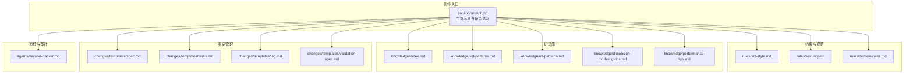
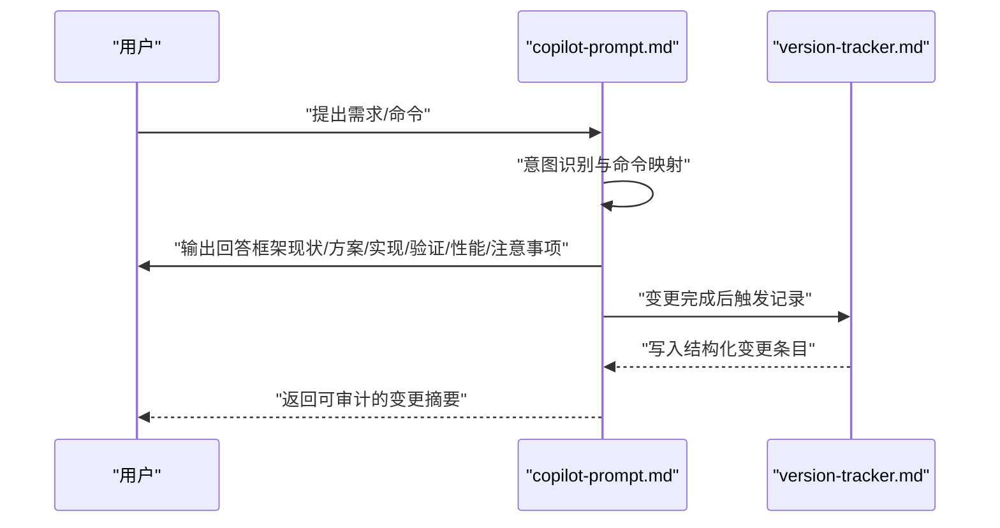
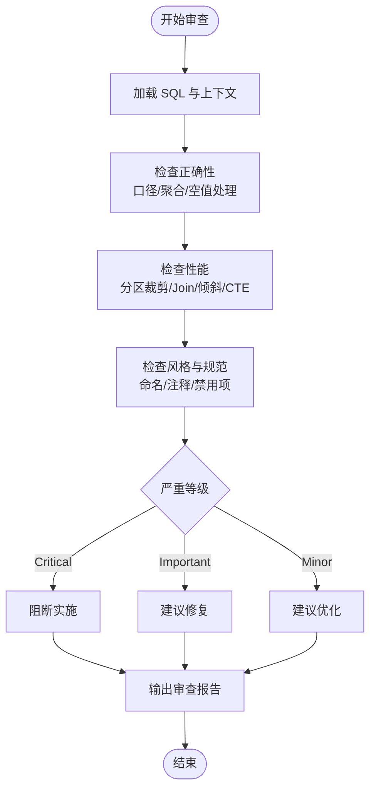
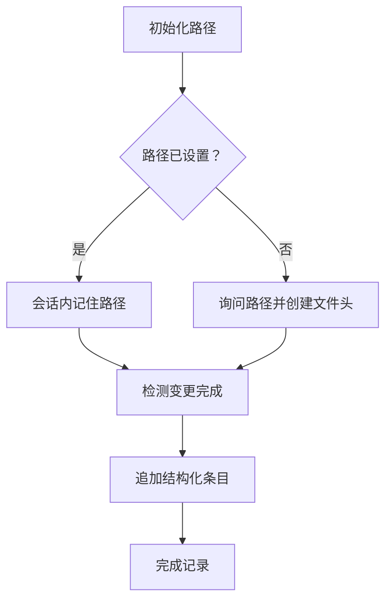
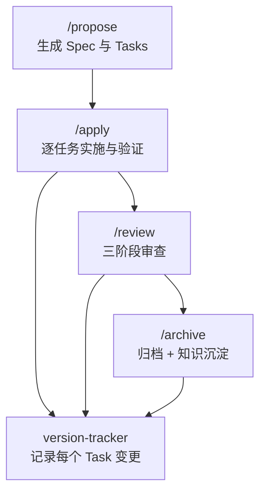
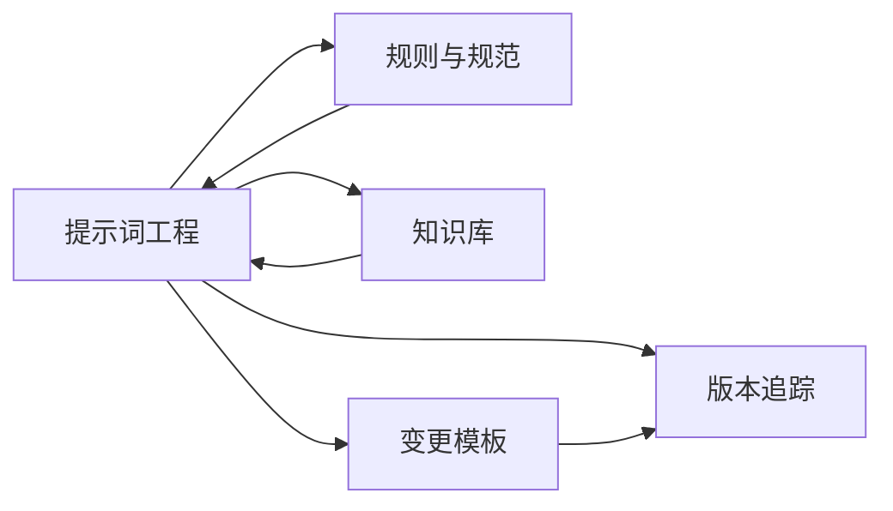
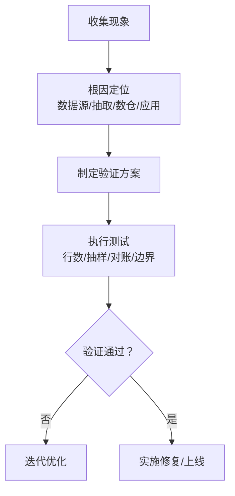

# 开发者指南

<cite>
**本文引用的文件**
- [目录结构和设计说明.md](file://目录结构和设计说明.md)
- [copilot-prompt.md](file://agents/copilot-prompt.md)
- [sql-reviewer.md](file://agents/sql-reviewer.md)
- [version-tracker.md](file://agents/version-tracker.md)
- [domain-rules.md](file://rules/domain-rules.md)
- [security.md](file://rules/security.md)
- [sql-style.md](file://rules/sql-style.md)
- [index.md](file://knowledge/index.md)
- [sql-patterns.md](file://knowledge/sql-patterns.md)
- [etl-patterns.md](file://knowledge/etl-patterns.md)
- [dimension-modeling-tips.md](file://knowledge/dimension-modeling-tips.md)
- [performance-tips.md](file://knowledge/performance-tips.md)
- [spec.md](file://changes/templates/spec.md)
- [tasks.md](file://changes/templates/tasks.md)
- [log.md](file://changes/templates/log.md)
- [validation-spec.md](file://changes/templates/validation-spec.md)
</cite>

## 目录
1. [简介](#简介)
2. [项目结构](#项目结构)
3. [核心组件](#核心组件)
4. [架构总览](#架构总览)
5. [详细组件分析](#详细组件分析)
6. [依赖分析](#依赖分析)
7. [性能考虑](#性能考虑)
8. [调试与测试指南](#调试与测试指南)
9. [常见问题排查](#常见问题排查)
10. [版本管理与发布流程](#版本管理与发布流程)
11. [结语](#结语)

## 简介
本指南面向开发者，帮助快速理解并高效参与“数仓开发 AI 协作助手”项目的开发与维护。项目围绕“Spec 驱动 + 三段式知识库 + 强制变更追踪”的核心理念，提供规范化的数仓建模、SQL 编写、ETL 同步、调度与数据质量、安全与权限、性能优化等领域的提示词与模板，确保每次变更可审计、可回溯、可沉淀。

## 项目结构
项目采用“提示词 + 规则 + 知识库 + 变更模板”的分层组织方式，便于在 AI 编码助手工作区中加载与协作。

```mermaid
graph TB
A["agents/ 提示词工程"] --> A1["copilot-prompt.md<br/>主提示词与命令体系"]
A --> A2["sql-reviewer.md<br/>SQL 质量审查"]
A --> A3["version-tracker.md<br/>变更追踪"]
B["rules/ 项目约束与规范"] --> B1["sql-style.md<br/>SQL 编码规范"]
B --> B2["security.md<br/>安全红线"]
B --> B3["domain-rules.md<br/>业务领域规则"]
C["knowledge/ 领域知识库"] --> C1["index.md<br/>知识索引"]
C --> C2["sql-patterns.md<br/>SQL 模式库"]
C --> C3["etl-patterns.md<br/>ETL 模式库"]
C --> C4["dimension-modeling-tips.md<br/>维度建模技巧"]
C --> C5["performance-tips.md<br/>性能优化知识库"]
D["changes/ 变更管理"] --> D1["templates/spec.md<br/>变更 Spec 模板"]
D --> D2["templates/tasks.md<br/>任务拆分模板"]
D --> D3["templates/log.md<br/>变更日志模板"]
D --> D4["templates/validation-spec.md<br/>验证 Spec 模板"]
```

**图表来源**
- [目录结构和设计说明.md:19-55](file://目录结构和设计说明.md#L19-L55)
- [copilot-prompt.md:1-147](file://agents/copilot-prompt.md#L1-L147)
- [sql-reviewer.md:1-68](file://agents/sql-reviewer.md#L1-L68)
- [version-tracker.md:1-120](file://agents/version-tracker.md#L1-L120)
- [sql-style.md:1-254](file://rules/sql-style.md#L1-L254)
- [security.md:1-98](file://rules/security.md#L1-L98)
- [domain-rules.md:1-142](file://rules/domain-rules.md#L1-L142)
- [index.md:1-60](file://knowledge/index.md#L1-L60)
- [sql-patterns.md:1-331](file://knowledge/sql-patterns.md#L1-L331)
- [etl-patterns.md:1-220](file://knowledge/etl-patterns.md#L1-L220)
- [dimension-modeling-tips.md:1-253](file://knowledge/dimension-modeling-tips.md#L1-L253)
- [performance-tips.md:1-349](file://knowledge/performance-tips.md#L1-L349)
- [spec.md:1-132](file://changes/templates/spec.md#L1-L132)
- [tasks.md:1-74](file://changes/templates/tasks.md#L1-L74)
- [log.md:1-61](file://changes/templates/log.md#L1-L61)
- [validation-spec.md:1-123](file://changes/templates/validation-spec.md#L1-L123)

**章节来源**
- [目录结构和设计说明.md:19-55](file://目录结构和设计说明.md#L19-L55)

## 核心组件
- 提示词与命令体系：定义 AI 在数仓开发中的角色、法则、回答框架与命令映射，确保协作流程标准化。
- 规则与规范：涵盖 SQL 编码、安全、领域规则等，作为强制约束与最佳实践依据。
- 知识库：沉淀 SQL 模式、ETL 模式、维度建模、性能优化等经验，形成“知识飞轮”。
- 变更模板：提供 Spec、任务拆分、日志与验证的结构化模板，支撑“需求 → 规划 → 实施 → 审查 → 归档”的闭环。

**章节来源**
- [copilot-prompt.md:1-147](file://agents/copilot-prompt.md#L1-L147)
- [sql-style.md:1-254](file://rules/sql-style.md#L1-L254)
- [security.md:1-98](file://rules/security.md#L1-L98)
- [domain-rules.md:1-142](file://rules/domain-rules.md#L1-L142)
- [index.md:1-60](file://knowledge/index.md#L1-L60)
- [sql-patterns.md:1-331](file://knowledge/sql-patterns.md#L1-L331)
- [etl-patterns.md:1-220](file://knowledge/etl-patterns.md#L1-L220)
- [dimension-modeling-tips.md:1-253](file://knowledge/dimension-modeling-tips.md#L1-L253)
- [performance-tips.md:1-349](file://knowledge/performance-tips.md#L1-L349)
- [spec.md:1-132](file://changes/templates/spec.md#L1-L132)
- [tasks.md:1-74](file://changes/templates/tasks.md#L1-L74)
- [log.md:1-61](file://changes/templates/log.md#L1-L61)
- [validation-spec.md:1-123](file://changes/templates/validation-spec.md#L1-L123)

## 架构总览
项目以“提示词工程”为核心入口，结合“规则库”和“知识库”，在每次变更中通过“变更模板”驱动实施，并由“版本追踪”保障可审计与可回溯。

**图表来源**
- [copilot-prompt.md:1-147](file://agents/copilot-prompt.md#L1-L147)
- [sql-style.md:1-254](file://rules/sql-style.md#L1-L254)
- [security.md:1-98](file://rules/security.md#L1-L98)
- [domain-rules.md:1-142](file://rules/domain-rules.md#L1-L142)
- [index.md:1-60](file://knowledge/index.md#L1-L60)
- [sql-patterns.md:1-331](file://knowledge/sql-patterns.md#L1-L331)
- [etl-patterns.md:1-220](file://knowledge/etl-patterns.md#L1-L220)
- [dimension-modeling-tips.md:1-253](file://knowledge/dimension-modeling-tips.md#L1-L253)
- [performance-tips.md:1-349](file://knowledge/performance-tips.md#L1-L349)
- [spec.md:1-132](file://changes/templates/spec.md#L1-L132)
- [tasks.md:1-74](file://changes/templates/tasks.md#L1-L74)
- [log.md:1-61](file://changes/templates/log.md#L1-L61)
- [validation-spec.md:1-123](file://changes/templates/validation-spec.md#L1-L123)
- [version-tracker.md:1-120](file://agents/version-tracker.md#L1-L120)

## 详细组件分析

### 提示词与命令体系
- 角色与法则：强调“Spec 驱动”“现状必须有出处”“变更即记录”，确保每次输出可验证、可追溯。
- 回答框架：问题理解 → 现状分析 → 方案设计 → 具体实现 → 验证方法 → 性能与成本考量 → 注意事项。
- 命令体系：覆盖 SQL、ETL、建模、提案、实施、审查、优化、数据质量、调度、归档等全流程命令。
- 调试流程：现象收集 → 根因定位 → 方案验证 → 实施修复，按层级从数据源层到应用层逐层诊断。

**图表来源**
- [copilot-prompt.md:23-147](file://agents/copilot-prompt.md#L23-L147)
- [version-tracker.md:5-16](file://agents/version-tracker.md#L5-L16)

**章节来源**
- [copilot-prompt.md:1-147](file://agents/copilot-prompt.md#L1-L147)

### SQL 质量审查
- 审查分级：Critical（阻塞）、Important（应修复）、Minor（建议），覆盖计算正确性、Join 膨胀、分区裁剪、幂等保护、PII 脱敏等。
- 性能审查清单：分区裁剪、Join 顺序、Map/Broadcast Join、倾斜风险、列裁剪、CTE 物化等。
- 输出格式：按分级列出问题与建议，附性能评估摘要与量化影响。

**图表来源**
- [sql-reviewer.md:5-68](file://agents/sql-reviewer.md#L5-L68)

**章节来源**
- [sql-reviewer.md:1-68](file://agents/sql-reviewer.md#L1-L68)

### 版本追踪与变更审计
- 触发时机：SQL/ETL/模型/调度/DQ 变更后，以及每个 Task 完成后。
- 初始化：首次询问并记忆变更日志路径，不存在则自动创建带文件头。
- 条目格式：模块、分层、任务、操作、变更内容、关联文件、回刷范围、下游影响、备注。
- 记录规则：原子化、精确引用、任务可追溯、下游必标注、回刷必声明、时间精确到分钟、不阻塞主流程。

**图表来源**
- [version-tracker.md:19-90](file://agents/version-tracker.md#L19-L90)

**章节来源**
- [version-tracker.md:1-120](file://agents/version-tracker.md#L1-L120)

### 规则与规范
- SQL 编码规范：命名约定（库/表/字段/分区）、格式规范（关键字大小写、缩进、注释）、编写原则（性能优先/正确性优先/可维护性）、禁止事项与检查清单。
- 安全红线：数据安全、字段级脱敏、行级权限、数据分级、上线与发布安全、回刷安全、业务安全、跨境合规、安全审计与应急响应。
- 业务领域规则：通用业务规则、KPI/指标定义标准、数据质量规则（五大维度与严重等级）、历史数据约定、行业特定规则、跨系统口径一致性、项目特定规则。

**章节来源**
- [sql-style.md:1-254](file://rules/sql-style.md#L1-L254)
- [security.md:1-98](file://rules/security.md#L1-L98)
- [domain-rules.md:1-142](file://rules/domain-rules.md#L1-L142)

### 知识库与模式库
- 知识索引：按 SQL 模式、ETL 模式、维度建模技巧、性能优化技巧、业务知识、技术约定、踩坑记录分类索引。
- SQL 模式库：去重保留最新、拉链表（SCD2）、同环比、TopN、累计求和、行转列/列转行、数据回刷、Lambda 合并、缺失日期补齐、NULL 安全比较。
- ETL 模式库：CDC 增量同步、JDBC 增量抽取、MERGE/UPSERT、小文件控制、历史回刷、文件接入、API 拉取、全量/增量/CDC 选型对照、数据漂移与时区处理。
- 维度建模技巧：代理键/业务键、SCD 三种类型、桥接表、退化维度、一致性维度、事实表类型选择、维度表分级、分层归属判定。
- 性能优化知识库：分区裁剪、数据倾斜、Map/Broadcast Join、小文件问题、CTE 物化策略、谓词下推与列裁剪、Join 顺序与类型、窗口函数性能、存储格式与压缩、调度与资源、性能分析工具。

**章节来源**
- [index.md:1-60](file://knowledge/index.md#L1-L60)
- [sql-patterns.md:1-331](file://knowledge/sql-patterns.md#L1-L331)
- [etl-patterns.md:1-220](file://knowledge/etl-patterns.md#L1-L220)
- [dimension-modeling-tips.md:1-253](file://knowledge/dimension-modeling-tips.md#L1-L253)
- [performance-tips.md:1-349](file://knowledge/performance-tips.md#L1-L349)

### 变更模板与流程
- 变更 Spec 模板：背景与目标、现状分析、功能点、业务规则与口径、模型变更（DDL）、SQL 加工设计、ETL/同步变更、调度变更、数据质量规则、影响范围、风险与关注点、验证策略、待澄清、技术决策、执行日志、审查结论、确认记录。
- 任务拆分模板：按 ODS→DIM→DWD→DWS→ADS→调度→DQ→权限的顺序原子化拆分，每个任务精确到对象与依赖，提供验收标准与验证方法。
- 变更日志模板：记录时间线、技术决策、踩坑记录、知识发现、Spec-实现偏差、回刷记录、性能对比、DQ 验证、质量备忘。
- 验证 Spec 模板：验证原则、验证环境、数据准确性验证（行数核验/主键唯一性/核心指标/抽样）、模型结构验证、性能验证、DQ 规则验证、安全与权限验证、回刷验证、执行计划。

**图表来源**
- [copilot-prompt.md:103-131](file://agents/copilot-prompt.md#L103-L131)
- [spec.md:1-132](file://changes/templates/spec.md#L1-L132)
- [tasks.md:1-74](file://changes/templates/tasks.md#L1-L74)
- [log.md:1-61](file://changes/templates/log.md#L1-L61)
- [validation-spec.md:1-123](file://changes/templates/validation-spec.md#L1-L123)
- [version-tracker.md:5-16](file://agents/version-tracker.md#L5-L16)

**章节来源**
- [spec.md:1-132](file://changes/templates/spec.md#L1-L132)
- [tasks.md:1-74](file://changes/templates/tasks.md#L1-L74)
- [log.md:1-61](file://changes/templates/log.md#L1-L61)
- [validation-spec.md:1-123](file://changes/templates/validation-spec.md#L1-L123)

## 依赖分析
- 组件耦合与内聚：提示词工程依赖规则与知识库；变更模板贯穿实施与审查；版本追踪独立于具体实现，仅依赖日志文件写入。
- 外部依赖：AI 编码助手工作区加载本项目目录；执行 SQL/ETL/调度需对接具体引擎与平台。
- 潜在循环依赖：当前结构以提示词为入口，规则与知识库为支撑，模板与追踪为输出，未见循环依赖迹象。

**图表来源**
- [copilot-prompt.md:1-147](file://agents/copilot-prompt.md#L1-L147)
- [version-tracker.md:1-120](file://agents/version-tracker.md#L1-L120)

**章节来源**
- [copilot-prompt.md:1-147](file://agents/copilot-prompt.md#L1-L147)
- [version-tracker.md:1-120](file://agents/version-tracker.md#L1-L120)

## 性能考虑
- 分区裁剪：WHERE 条件直接命中分区字段，避免函数包裹导致全表扫描。
- Join 优化：优先小表广播（Map/Broadcast Join），控制 Join 顺序与类型，避免 Shuffle。
- CTE 与物化：在 Hive/Spark 中谨慎使用 WITH，必要时物化或缓存；避免重复计算。
- 列裁剪与谓词下推：尽量减少扫描列，将过滤条件尽可能下推到数据源层。
- 存储格式：优先 ORC/Parquet，结合 ZSTD/Snappy 压缩；控制单文件大小与分区文件数量。
- 调度与资源：错峰调度、资源队列隔离、失败重试与告警。

**章节来源**
- [performance-tips.md:1-349](file://knowledge/performance-tips.md#L1-L349)
- [sql-style.md:165-201](file://rules/sql-style.md#L165-L201)

## 调试与测试指南
- 调试流程：现象收集 → 根因定位 → 方案验证 → 实施修复；按数据源层 → 抽取层 → 数仓层 → 应用层逐层诊断。
- 测试要求：三选一验证（行数核验/抽样对比/对账 SQL），核心指标与边界条件测试，回刷可重入（幂等）。
- 工具与方法：EXPLAIN/执行计划、作业历史与 Stage Metrics、Profile、数据采样、基准来源对比（业务库直查/旧表/Excel）。

**图表来源**
- [copilot-prompt.md:133-147](file://agents/copilot-prompt.md#L133-L147)
- [validation-spec.md:6-13](file://changes/templates/validation-spec.md#L6-L13)

**章节来源**
- [copilot-prompt.md:133-147](file://agents/copilot-prompt.md#L133-L147)
- [validation-spec.md:6-13](file://changes/templates/validation-spec.md#L6-L13)

## 常见问题排查
- SQL 性能问题：检查是否分区裁剪、是否使用 Map/Broadcast Join、是否存在数据倾斜、CTE 是否被物化。
- 数据质量问题：完整性/唯一性/一致性/准确性/时效性五大维度逐项验证，设定严重等级并及时告警。
- 安全与权限：PII 脱敏、行级权限（RLS）配置与验证、数据分级与访问控制、密钥管理与上线审批。
- 变更追踪：确保每次 DDL/SQL/ETL/调度变更后触发记录，条目格式完整、任务可追溯、回刷范围明确。

**章节来源**
- [performance-tips.md:1-349](file://knowledge/performance-tips.md#L1-L349)
- [security.md:1-98](file://rules/security.md#L1-L98)
- [version-tracker.md:5-90](file://agents/version-tracker.md#L5-L90)

## 版本管理与发布流程
- 版本追踪：每次变更完成后自动记录结构化条目，包含模块、分层、任务、操作、变更内容、关联文件、回刷范围、下游影响、备注。
- 变更闭环：/propose 生成 Spec 与 Tasks → /apply 逐任务实施与验证 → /review 三阶段审查 → /archive 归档与知识沉淀。
- 发布安全：生产 SQL 上线需代码评审，涉及 PII/财务的表需双签，DDL 变更需回滚预案，临时探索查询禁止落地生产库。

**章节来源**
- [version-tracker.md:5-90](file://agents/version-tracker.md#L5-L90)
- [copilot-prompt.md:103-131](file://agents/copilot-prompt.md#L103-L131)
- [security.md:61-67](file://rules/security.md#L61-L67)

## 结语
本指南提供了从项目结构、核心组件到开发流程、调试测试与版本管理的全景式说明。建议在实际协作中：
- 以提示词工程为入口，严格遵循命令体系与回答框架；
- 以规则与知识库为依据，确保实现与规范一致；
- 以变更模板为载体，推动 Spec 驱动的闭环管理；
- 以版本追踪为保障，实现可审计、可回溯、可沉淀的知识飞轮。