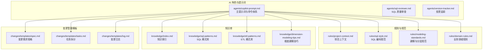
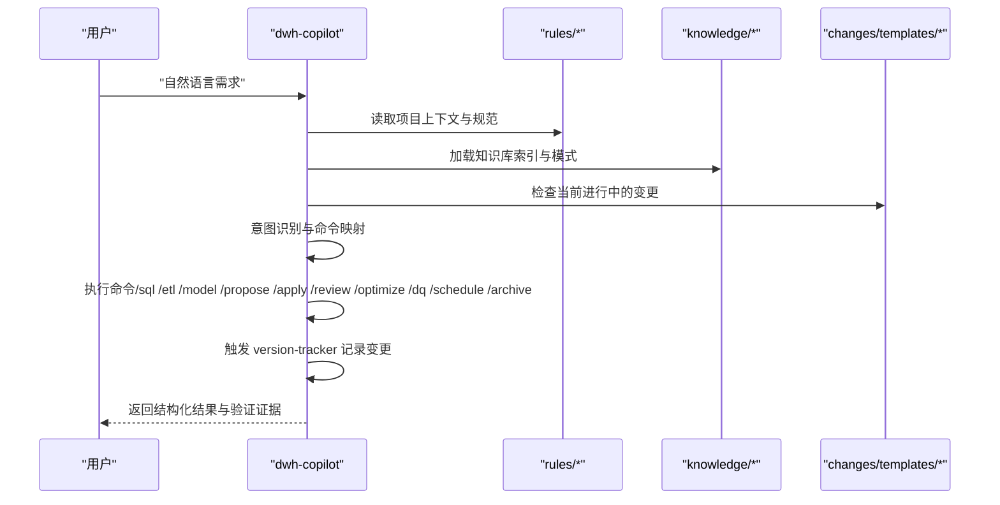
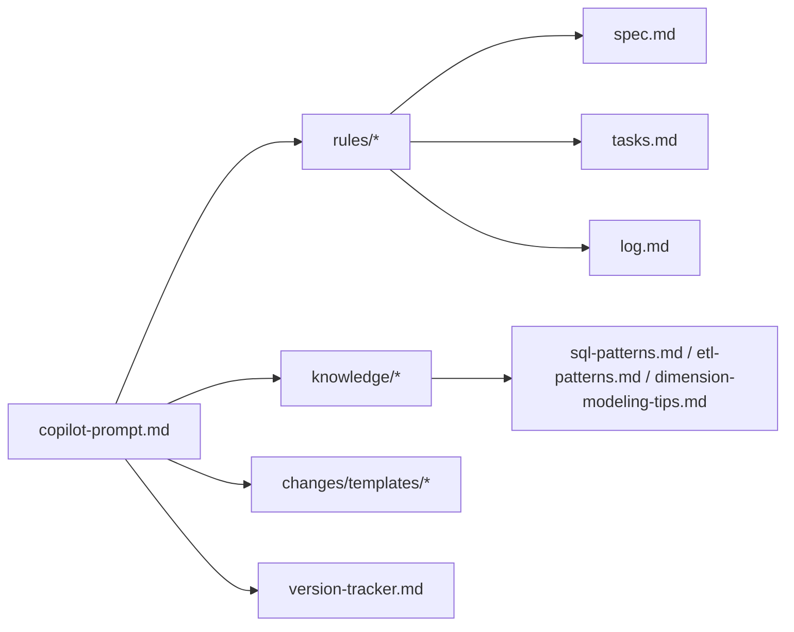

# 快速入门

<cite>
**本文引用的文件**
- [目录结构和设计说明.md](file://data_warehouse_engineering_code_copilot/目录结构和设计说明.md)
- [copilot-prompt.md](file://data_warehouse_engineering_code_copilot/agents/copilot-prompt.md)
- [sql-reviewer.md](file://data_warehouse_engineering_code_copilot/agents/sql-reviewer.md)
- [version-tracker.md](file://data_warehouse_engineering_code_copilot/agents/version-tracker.md)
- [project-context.md](file://data_warehouse_engineering_code_copilot/rules/project-context.md)
- [sql-style.md](file://data_warehouse_engineering_code_copilot/rules/sql-style.md)
- [modeling-standards.md](file://data_warehouse_engineering_code_copilot/rules/modeling-standards.md)
- [domain-rules.md](file://data_warehouse_engineering_code_copilot/rules/domain-rules.md)
- [index.md](file://data_warehouse_engineering_code_copilot/knowledge/index.md)
- [sql-patterns.md](file://data_warehouse_engineering_code_copilot/knowledge/sql-patterns.md)
- [etl-patterns.md](file://data_warehouse_engineering_code_copilot/knowledge/etl-patterns.md)
- [dimension-modeling-tips.md](file://data_warehouse_engineering_code_copilot/knowledge/dimension-modeling-tips.md)
- [spec.md](file://data_warehouse_engineering_code_copilot/changes/templates/spec.md)
- [tasks.md](file://data_warehouse_engineering_code_copilot/changes/templates/tasks.md)
- [log.md](file://data_warehouse_engineering_code_copilot/changes/templates/log.md)
</cite>

## 目录
1. [简介](#简介)
2. [项目结构](#项目结构)
3. [核心组件](#核心组件)
4. [架构总览](#架构总览)
5. [详细组件分析](#详细组件分析)
6. [依赖分析](#依赖分析)
7. [性能注意事项](#性能注意事项)
8. [故障排查指南](#故障排查指南)
9. [结论](#结论)
10. [附录](#附录)

## 简介
本指南面向首次使用 dwh-copilot 的用户，帮助你将项目加载到 AI 编码助手环境中，完成初始化与配置，掌握命令式协作流程，并通过常见任务示例快速上手数据仓库开发。项目围绕“Spec 驱动 + 三段式知识库 + 强制变更追踪”的核心理念，提供从需求到上线的完整闭环。

## 项目结构
项目采用“提示词 + 规则 + 知识 + 变更模板”的工程化组织方式，便于 AI 在固定流程内工作，避免发散与遗漏。

图表来源
- [目录结构和设计说明.md:19-55](file://data_warehouse_engineering_code_copilot/目录结构和设计说明.md#L19-L55)
- [copilot-prompt.md:1-147](file://data_warehouse_engineering_code_copilot/agents/copilot-prompt.md#L1-L147)

章节来源
- [目录结构和设计说明.md:19-55](file://data_warehouse_engineering_code_copilot/目录结构和设计说明.md#L19-L55)

## 核心组件
- 主提示词与命令体系：定义 AI 的身份、法则、回答框架与命令映射，指导每次会话的启动与交互。
- 规则与规范：提供项目上下文、SQL 编码规范、建模与分层规范、业务领域规则，确保实现与规范一致。
- 知识库：沉淀 SQL 模式、ETL 模式、维度建模技巧与性能优化经验，支持复用与迁移。
- 变更模板：提供 Spec、任务拆分、日志模板，保障变更的可审计与可追溯。

章节来源
- [copilot-prompt.md:55-147](file://data_warehouse_engineering_code_copilot/agents/copilot-prompt.md#L55-L147)
- [project-context.md:1-104](file://data_warehouse_engineering_code_copilot/rules/project-context.md#L1-L104)
- [sql-style.md:1-254](file://data_warehouse_engineering_code_copilot/rules/sql-style.md#L1-L254)
- [modeling-standards.md:1-242](file://data_warehouse_engineering_code_copilot/rules/modeling-standards.md#L1-L242)
- [domain-rules.md:1-142](file://data_warehouse_engineering_code_copilot/rules/domain-rules.md#L1-L142)
- [index.md:1-60](file://data_warehouse_engineering_code_copilot/knowledge/index.md#L1-L60)
- [sql-patterns.md:1-331](file://data_warehouse_engineering_code_copilot/knowledge/sql-patterns.md#L1-L331)
- [etl-patterns.md:1-220](file://data_warehouse_engineering_code_copilot/knowledge/etl-patterns.md#L1-L220)
- [dimension-modeling-tips.md:1-253](file://data_warehouse_engineering_code_copilot/knowledge/dimension-modeling-tips.md#L1-L253)
- [spec.md:1-132](file://data_warehouse_engineering_code_copilot/changes/templates/spec.md#L1-L132)
- [tasks.md:1-74](file://data_warehouse_engineering_code_copilot/changes/templates/tasks.md#L1-L74)
- [log.md:1-61](file://data_warehouse_engineering_code_copilot/changes/templates/log.md#L1-L61)

## 架构总览
AI 在每次会话开始时读取规则与知识库，检查当前进行中的变更，然后根据用户输入的自然语言识别意图并映射到命令，执行相应流程并在完成后触发变更追踪。

图表来源
- [copilot-prompt.md:55-147](file://data_warehouse_engineering_code_copilot/agents/copilot-prompt.md#L55-L147)

## 详细组件分析

### 初始化与项目上下文 (/init)
- 目标：分析项目结构与现状，填充 rules/project-context.md，建立 AI 对项目的全局认知。
- 触发方式：首次使用或项目上下文变更时执行 /init。
- 填充要求：项目概况、数据源清单、分层与库、主题域、核心事实表、一致性维度、关键 ADS 表/报表、关键 KPI/指标字典、调度与基线、命名规范偏差、安全配置、关键依赖与外部系统、已知技术债等。
- 作用：为后续命令提供上下文依据，确保 AI 的回答与实现与项目现状一致。

章节来源
- [copilot-prompt.md:65-66](file://data_warehouse_engineering_code_copilot/agents/copilot-prompt.md#L65-L66)
- [project-context.md:1-104](file://data_warehouse_engineering_code_copilot/rules/project-context.md#L1-L104)

### 命令式协作流程概览
- /sql：理解业务口径 → 编写 SQL（遵循规范）→ 提供验证方法 → 性能评估 → 完成后触发变更追踪。
- /etl：研究数据源 → 设计同步方式（全量/增量/CDC）→ 编写脚本 → 验证幂等与回放能力 → 完成后触发变更追踪。
- /model：梳理业务过程 → 识别维度与事实 → 分层归属判定 → DDL 设计 → 关系与口径文档化 → 完成后触发变更追踪。
- /propose：Research → 逐项澄清 → 生成 Spec 与 Tasks → HARD-GATE 确认。
- /apply：前置检查 Spec/Tasks/确认 → 逐 Task 执行 → 每个 Task 完成后展示验证证据 → 每个 Task 完成后触发变更追踪。
- /review：三阶段审查（Spec 合规 → 模型质量 → SQL 质量）。
- /optimize：四层诊断（数据源 → 抽取 → 数仓 → 应用）→ 量化优化前后对比。
- /dq：五大维度（完整性/唯一性/一致性/准确性/时效性）→ 产出可执行对账 SQL。
- /schedule：依赖识别 → 调度周期 → 重试与告警 → SLA/基线 → 资源队列 → 失败回放策略 → 有作业新增/调整时触发变更追踪。
- /archive：展示 log.md 知识发现 → 确认后沉淀到 knowledge/ → 完成后触发变更追踪。

章节来源
- [copilot-prompt.md:68-131](file://data_warehouse_engineering_code_copilot/agents/copilot-prompt.md#L68-L131)

### SQL 质量审查（/sql 之后）
- 审查分级：Critical（阻塞）、Important（应修复）、Minor（建议）。
- 性能审查清单：分区裁剪、Join 顺序、Map/Broadcast Join、数据倾斜、聚合下推、SELECT *、ORDER BY、DISTINCT 与 GROUP BY 替代、窗口函数 PARTITION BY、CTE 物化等。
- 输出格式：分级别列举问题与建议，附性能评估摘要与量化影响。

章节来源
- [sql-reviewer.md:1-68](file://data_warehouse_engineering_code_copilot/agents/sql-reviewer.md#L1-L68)

### 变更追踪（version-tracker）
- 触发时机：/sql、/etl、/model、/schedule、/dq 产出新的对账规则或修复、/apply 每个 Task 完成后、用户手动要求记录。
- 路径初始化：首次询问变更日志存储路径（可为已存在文件或新建路径），会话内记忆，文件不存在时自动创建并写入文件头。
- 条目格式：时间、模块、分层、任务、操作、变更内容、关联文件、回刷范围、影响下游、备注。
- 记录规则：原子化、精确引用、任务可追溯、下游必标注、回刷必声明、时间精确到分钟、不阻塞主流程。

章节来源
- [version-tracker.md:1-120](file://data_warehouse_engineering_code_copilot/agents/version-tracker.md#L1-L120)

### 变更模板与流程
- 变更需求规格（spec.md）：背景与目标、现状分析（数据源与数据流、现有模型结构、现有指标/口径、发现与风险）、功能点、业务规则与口径、模型变更（DDL）、SQL 加工设计、ETL/同步变更、调度变更、数据质量规则（DQ）、影响范围、风险与关注点、验证策略、待澄清、技术决策、执行日志、审查结论、确认记录（HARD-GATE）。
- 任务拆分（tasks.md）：按 ODS→DIM→DWD→DWS→ADS 顺序拆分，每个任务为可独立验证的原子变更，精确到库.表.字段/作业名/调度依赖。
- 变更日志（log.md）：记录决策、踩坑与知识发现，支持沉淀到 knowledge/。

章节来源
- [spec.md:1-132](file://data_warehouse_engineering_code_copilot/changes/templates/spec.md#L1-L132)
- [tasks.md:1-74](file://data_warehouse_engineering_code_copilot/changes/templates/tasks.md#L1-L74)
- [log.md:1-61](file://data_warehouse_engineering_code_copilot/changes/templates/log.md#L1-L61)

### 知识库与模式复用
- 索引（index.md）：一句话索引，便于 AI 快速命中 SQL 模式、ETL 模式、维度建模技巧、性能优化技巧、业务知识、技术约定与踩坑记录。
- SQL 模式库（sql-patterns.md）：去重保留最新、拉链表（SCD2）、同环比、TopN 分组排名、累计求和、行转列/列转行、数据回刷、增量+全量合并、缺失日期补齐、NULL 安全比较等。
- ETL 模式库（etl-patterns.md）：CDC 增量同步、JDBC 增量抽取、MERGE/UPSERT、小文件控制、历史回刷、文件接入、API 拉取、全量/增量/CDC 选型对照、数据漂移与时区处理。
- 维度建模技巧（dimension-modeling-tips.md）：代理键vs业务键、SCD 三种类型、桥接表、退化维度、一致性维度、事实表类型选择、维度表分级、分层归属判定。

章节来源
- [index.md:1-60](file://data_warehouse_engineering_code_copilot/knowledge/index.md#L1-L60)
- [sql-patterns.md:1-331](file://data_warehouse_engineering_code_copilot/knowledge/sql-patterns.md#L1-L331)
- [etl-patterns.md:1-220](file://data_warehouse_engineering_code_copilot/knowledge/etl-patterns.md#L1-L220)
- [dimension-modeling-tips.md:1-253](file://data_warehouse_engineering_code_copilot/knowledge/dimension-modeling-tips.md#L1-L253)

## 依赖分析
- 规则与规范依赖：AI 在启动时读取 rules/*，确保实现与项目上下文、SQL 编码规范、建模与分层规范、业务领域规则一致。
- 知识库依赖：AI 在执行命令时引用 knowledge/*，复用 SQL/ETL/建模/性能/业务经验。
- 变更模板依赖：AI 在 /propose 与 /apply 中生成/使用 spec.md 与 tasks.md，在 /archive 中沉淀到 knowledge/。
- 变更追踪依赖：AI 在每次 DDL/SQL/ETL/调度变更后触发 version-tracker，记录结构化日志。

图表来源
- [copilot-prompt.md:55-147](file://data_warehouse_engineering_code_copilot/agents/copilot-prompt.md#L55-L147)
- [version-tracker.md:1-120](file://data_warehouse_engineering_code_copilot/agents/version-tracker.md#L1-L120)

章节来源
- [copilot-prompt.md:55-147](file://data_warehouse_engineering_code_copilot/agents/copilot-prompt.md#L55-L147)
- [version-tracker.md:1-120](file://data_warehouse_engineering_code_copilot/agents/version-tracker.md#L1-L120)

## 性能注意事项
- 分区裁剪：大型分区表必须有分区裁剪，禁止函数包裹分区字段。
- Join 顺序：大表在前、小表在后；小表可广播加速；避免笛卡尔积与重复。
- 聚合下推：尽量将聚合下推到子查询，避免最外层大表上 Group By。
- CTE 与物化：复杂 SQL 拆为多个 CTE，关注引擎对 WITH 的物化策略。
- 小文件控制：通过 distribute by 与 reduce 数控制文件大小与数量。
- 幂等写入：写入大表使用覆盖写入，保证回放与回刷的幂等性。

章节来源
- [sql-style.md:165-201](file://data_warehouse_engineering_code_copilot/rules/sql-style.md#L165-L201)
- [sql-reviewer.md:31-42](file://data_warehouse_engineering_code_copilot/agents/sql-reviewer.md#L31-L42)
- [etl-patterns.md:90-120](file://data_warehouse_engineering_code_copilot/knowledge/etl-patterns.md#L90-L120)

## 故障排查指南
- 现象收集：明确问题表现（如慢查询、数据不一致、回刷失败）。
- 根因定位：按数据源层 → 抽取层 → 数仓层（ODS/DWD/DWS/ADS） → 应用层的诊断层级逐步排查。
- 方案验证：在测试环境验证修复方案，量化优化前后的对比指标。
- 实施修复：在确认根因后实施修复，触发变更追踪记录。

章节来源
- [copilot-prompt.md:133-146](file://data_warehouse_engineering_code_copilot/agents/copilot-prompt.md#L133-L146)

## 结论
通过将 dwh-copilot 项目加载到 AI 编码助手，你可以获得一套可复用的提示词工程与规范约束，借助命令式协作与三段式知识库，高效完成数据仓库的建模、SQL、ETL、调度、数据质量与性能优化任务，并通过强制变更追踪实现可审计、可回溯的工程闭环。

## 附录

### 环境准备与安装配置
- 将项目目录加载到 AI 编码助手的工作区/系统提示词。
- 让 AI 阅读主提示词文件，以便在每次会话开始时自动扫描 rules/、knowledge/ 与 changes/。
- 首次使用某项目时执行 /init，让 AI 填充 rules/project-context.md。

章节来源
- [目录结构和设计说明.md:186-194](file://data_warehouse_engineering_code_copilot/目录结构和设计说明.md#L186-L194)
- [copilot-prompt.md:55-61](file://data_warehouse_engineering_code_copilot/agents/copilot-prompt.md#L55-L61)

### 首次使用完整流程
- 加载项目 → 阅读主提示词 → 执行 /init 填充项目上下文 → 通过命令开展协作（/sql、/etl、/model、/propose、/apply、/review、/optimize、/dq、/schedule、/archive） → 每次变更完成后触发 version-tracker 记录。

章节来源
- [目录结构和设计说明.md:186-194](file://data_warehouse_engineering_code_copilot/目录结构和设计说明.md#L186-L194)
- [copilot-prompt.md:55-131](file://data_warehouse_engineering_code_copilot/agents/copilot-prompt.md#L55-L131)
- [version-tracker.md:5-15](file://data_warehouse_engineering_code_copilot/agents/version-tracker.md#L5-L15)

### 基本使用示例（命令式协作）
- 新建需求：用户输入“给销售域加一张 ADS 月度销售看板表”，AI 识别为 /propose，生成 spec 与 tasks，待澄清全部解决后进入 /apply，逐任务实施并通过验证，最后 /review 与 /archive。
- 性能优化：用户反馈“dws_user_active_1d 跑了 2 小时”，AI 走 /optimize，按五层诊断定位根因，给出具体修改与优化前后量化对比，触发 version-tracker 并沉淀到 knowledge/performance-tips.md。

章节来源
- [目录结构和设计说明.md:126-166](file://data_warehouse_engineering_code_copilot/目录结构和设计说明.md#L126-L166)