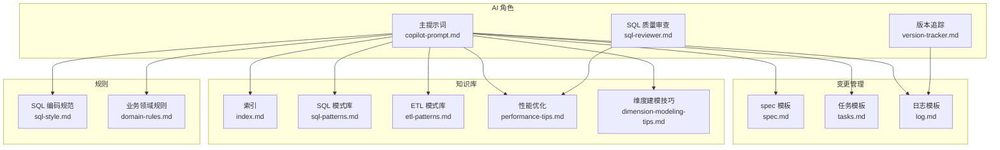
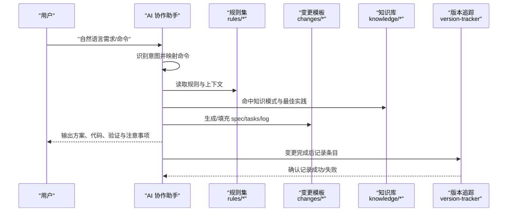
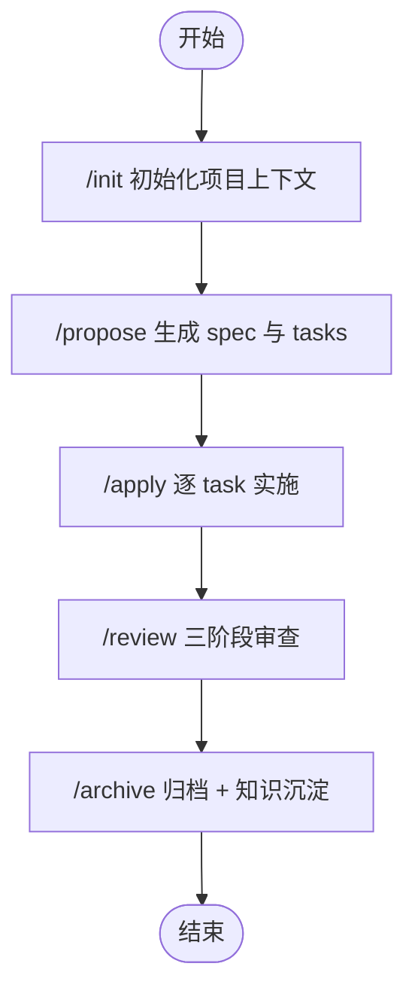
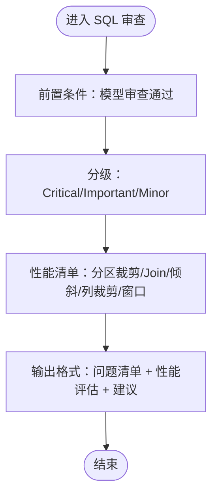
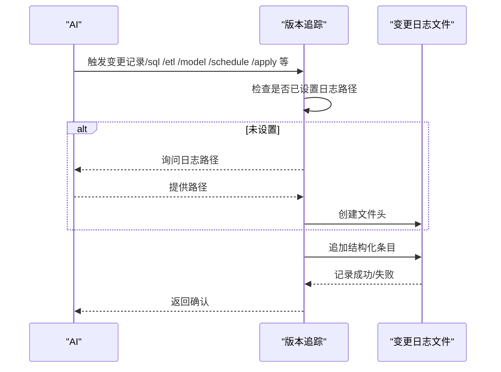
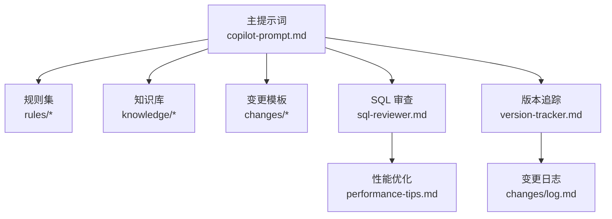

# 快速开始

<cite>
**本文引用的文件**
- [目录结构和设计说明.md](file://data_warehouse_engineering_code_copilot/目录结构和设计说明.md)
- [copilot-prompt.md](file://data_warehouse_engineering_code_copilot/agents/copilot-prompt.md)
- [sql-reviewer.md](file://data_warehouse_engineering_code_copilot/agents/sql-reviewer.md)
- [version-tracker.md](file://data_warehouse_engineering_code_copilot/agents/version-tracker.md)
- [domain-rules.md](file://data_warehouse_engineering_code_copilot/rules/domain-rules.md)
- [sql-style.md](file://data_warehouse_engineering_code_copilot/rules/sql-style.md)
- [index.md](file://data_warehouse_engineering_code_copilot/knowledge/index.md)
- [sql-patterns.md](file://data_warehouse_engineering_code_copilot/knowledge/sql-patterns.md)
- [etl-patterns.md](file://data_warehouse_engineering_code_copilot/knowledge/etl-patterns.md)
- [performance-tips.md](file://data_warehouse_engineering_code_copilot/knowledge/performance-tips.md)
- [dimension-modeling-tips.md](file://data_warehouse_engineering_code_copilot/knowledge/dimension-modeling-tips.md)
- [spec.md](file://data_warehouse_engineering_code_copilot/changes/templates/spec.md)
- [tasks.md](file://data_warehouse_engineering_code_copilot/changes/templates/tasks.md)
- [log.md](file://data_warehouse_engineering_code_copilot/changes/templates/log.md)
</cite>

## 目录
1. [简介](#简介)
2. [项目结构](#项目结构)
3. [核心组件](#核心组件)
4. [架构总览](#架构总览)
5. [详细组件分析](#详细组件分析)
6. [依赖分析](#依赖分析)
7. [性能注意事项](#性能注意事项)
8. [故障排查指南](#故障排查指南)
9. [结论](#结论)
10. [附录](#附录)

## 简介
本指南面向数据仓库（Data Warehouse）开发场景，帮助你快速上手“dwh-copilot”AI 协作助手。它围绕“Spec 驱动 + 三段式知识库 + 强制变更追踪”的核心理念，提供从需求到上线的完整闭环协作流程，确保每次变更可审计、可回溯、可沉淀。

- 项目定位：在 AI 编码助手中加载本工程化提示词工程，让 AI 像顶尖数仓工程师一样，遵循统一的 SQL、建模、调度、安全规范。
- 核心目标：强制走“需求 → spec → 任务 → 实施 → 审查 → 归档”的闭环；复用沉淀的 SQL 模式、ETL 模式、建模技巧、性能优化经验；自动追踪 DDL/SQL/ETL/调度变更，形成可审计的变更日志。

**章节来源**
- [目录结构和设计说明.md:1-16](file://data_warehouse_engineering_code_copilot/目录结构和设计说明.md#L1-L16)

## 项目结构
本项目采用“提示词 + 变更模板 + 知识库 + 规则 + 追踪”的分层组织：
- agents/：AI 角色与子 Agent 提示词（主提示词、SQL 审查、版本追踪等）
- changes/：变更管理（spec/tasks/log/validation-spec 模板）
- knowledge/：领域知识库（SQL 模式、ETL 模式、建模技巧、性能优化）
- rules/：项目约束与规范（SQL 编码规范、建模与分层、调度与运维、数据质量、安全、业务领域规则）

**图表来源**
- [目录结构和设计说明.md:19-54](file://data_warehouse_engineering_code_copilot/目录结构和设计说明.md#L19-L54)
- [copilot-prompt.md:63-147](file://data_warehouse_engineering_code_copilot/agents/copilot-prompt.md#L63-L147)

**章节来源**
- [目录结构和设计说明.md:19-54](file://data_warehouse_engineering_code_copilot/目录结构和设计说明.md#L19-L54)

## 核心组件
- 主提示词（copilot-prompt.md）：定义 AI 的身份、法则、命令体系与回答框架，指导 AI 在数仓开发中遵循“Spec 驱动”和“三段式知识库”。
- SQL 质量审查（sql-reviewer.md）：对 SQL 的正确性、性能与可维护性进行分级审查，前置条件为模型审查通过。
- 版本追踪（version-tracker.md）：在每次 DDL/SQL/ETL/调度变更后自动记录结构化变更条目，确保所有变更可审计、可回溯。
- 变更模板：spec.md（需求规格）、tasks.md（任务拆分）、log.md（变更日志）。
- 知识库：index.md + 各专题（sql-patterns.md、etl-patterns.md、performance-tips.md、dimension-modeling-tips.md）。
- 规则：sql-style.md（SQL 编码规范）、domain-rules.md（业务领域规则）。

**章节来源**
- [copilot-prompt.md:1-147](file://data_warehouse_engineering_code_copilot/agents/copilot-prompt.md#L1-L147)
- [sql-reviewer.md:1-68](file://data_warehouse_engineering_code_copilot/agents/sql-reviewer.md#L1-L68)
- [version-tracker.md:1-120](file://data_warehouse_engineering_code_copilot/agents/version-tracker.md#L1-L120)
- [spec.md:1-132](file://data_warehouse_engineering_code_copilot/changes/templates/spec.md#L1-L132)
- [tasks.md:1-74](file://data_warehouse_engineering_code_copilot/changes/templates/tasks.md#L1-L74)
- [log.md:1-61](file://data_warehouse_engineering_code_copilot/changes/templates/log.md#L1-L61)
- [index.md:1-60](file://data_warehouse_engineering_code_copilot/knowledge/index.md#L1-L60)
- [sql-style.md:1-254](file://data_warehouse_engineering_code_copilot/rules/sql-style.md#L1-L254)
- [domain-rules.md:1-142](file://data_warehouse_engineering_code_copilot/rules/domain-rules.md#L1-L142)

## 架构总览
AI 协作助手的工作流围绕“命令驱动 + 模板 + 知识 + 规则 + 追踪”展开。AI 在每次会话开始时读取规则与当前进行中的变更，然后根据用户输入的自然语言识别意图并映射到具体命令，执行相应流程并在完成后触发版本追踪。

**图表来源**
- [copilot-prompt.md:55-61](file://data_warehouse_engineering_code_copilot/agents/copilot-prompt.md#L55-L61)
- [copilot-prompt.md:63-147](file://data_warehouse_engineering_code_copilot/agents/copilot-prompt.md#L63-L147)
- [version-tracker.md:5-16](file://data_warehouse_engineering_code_copilot/agents/version-tracker.md#L5-L16)

**章节来源**
- [copilot-prompt.md:55-61](file://data_warehouse_engineering_code_copilot/agents/copilot-prompt.md#L55-L61)
- [copilot-prompt.md:63-147](file://data_warehouse_engineering_code_copilot/agents/copilot-prompt.md#L63-L147)
- [version-tracker.md:5-16](file://data_warehouse_engineering_code_copilot/agents/version-tracker.md#L5-L16)

## 详细组件分析

### 命令体系与使用方法
AI 通过一组命令驱动协作，覆盖从需求澄清到上线归档的全流程。以下为关键命令的使用场景与操作步骤概览（详细流程以各命令的“输出格式/流程”为准）。

- /init：初始化项目上下文
  - 作用：分析数仓项目结构（数据源、分层架构、库表清单、调度系统、命名规范），填充 rules/project-context.md。
  - 何时使用：首次使用某项目时。
  - 建议：在会话开始时执行，确保 AI 对项目上下文有准确认知。

- /propose：创建变更提案（生成 spec）
  - 作用：Research → 逐个澄清（一次只问一个，给选项+推荐）→ YAGNI 裁剪 → 分段生成 spec（每段确认）→ 生成 tasks → HARD-GATE 确认。
  - 何时使用：新建数据需求或变更需求时。
  - 注意：待澄清全部解决前不允许进入 /apply。

- /apply：按 spec/tasks 实施
  - 作用：前置检查 spec + tasks + 用户确认；逐 task 执行，每个 task 完成后展示验证证据（Verification 铁律：行数、抽样、对账三选一）。
  - 何时使用：/propose 通过后开始实施。
  - 零偏差原则：Plan 是合同，AI 是打印机。

- /review：三阶段审查
  - 作用：阶段一 Spec Compliance（需求合规）→ 阶段二 Model Quality（模型与建模规范质量）→ 阶段三 SQL Quality（SQL 与性能质量）。
  - 何时使用：实施完成后进行质量把关。

- /archive：归档 + 知识沉淀
  - 作用：逐条展示 log.md 知识发现，确认后沉淀到 knowledge/。
  - 何时使用：审查通过后进行归档与沉淀。

- 其他常用命令（简述）
  - /sql：SQL 开发（带注释，遵循编码规范，完成后触发版本追踪）
  - /etl：ETL/数据集成开发（幂等与回放能力）
  - /model：数仓建模（分层归属、DDL 设计、口径文档化）
  - /optimize：性能诊断与优化（五层诊断：数据源→抽取→数仓→应用）
  - /dq：数据质量校验（五大维度规则与对账 SQL）
  - /schedule：调度配置（依赖、SLA、重试、失败回放）

**章节来源**
- [copilot-prompt.md:65-132](file://data_warehouse_engineering_code_copilot/agents/copilot-prompt.md#L65-L132)

### 第一次使用完整流程示例
以下为从项目初始化到需求开发的端到端演示（以场景 A 为例）：

1) 初始化项目上下文
- 执行 /init，AI 会分析项目结构并填充 rules/project-context.md，以便后续命令基于准确上下文工作。

2) 提出需求并生成 spec
- 用户提出需求（如“销售域加一张 ADS 月度销售看板表，按门店×商品类目维度”）。
- AI 识别为 /propose，开始 Research、逐个澄清、生成 changes/<change-name>/spec.md 与 tasks.md，并等待用户确认。

3) 开始实施
- 用户确认后执行 /apply，AI 逐 task 执行，每个 task 完成后展示验证证据（行数/抽样/对账三选一），并触发版本追踪记录该 task 的变更。

4) 审查与归档
- 全部完成后执行 /review（三阶段审查），通过后执行 /archive，沉淀知识到 knowledge/ 并记录归档操作。

**图表来源**
- [目录结构和设计说明.md:126-151](file://data_warehouse_engineering_code_copilot/目录结构和设计说明.md#L126-L151)
- [copilot-prompt.md:103-132](file://data_warehouse_engineering_code_copilot/agents/copilot-prompt.md#L103-L132)

**章节来源**
- [目录结构和设计说明.md:126-151](file://data_warehouse_engineering_code_copilot/目录结构和设计说明.md#L126-L151)
- [copilot-prompt.md:103-132](file://data_warehouse_engineering_code_copilot/agents/copilot-prompt.md#L103-L132)

### 常见使用场景快速上手案例
- 场景 A：新建一个数据需求
  - 识别为 /propose → Research → 逐个澄清 → 生成 spec/tasks → 硬性 gate 确认 → /apply 实施 → /review → /archive。
- 场景 B：性能优化
  - 识别为 /optimize → 五层诊断（数据源→抽取→数仓→SQL→应用）→ 给出具体修改 + 优化前后量化对比 → 触发版本追踪 → 沉淀到 knowledge/performance-tips.md。

**章节来源**
- [目录结构和设计说明.md:126-166](file://data_warehouse_engineering_code_copilot/目录结构和设计说明.md#L126-L166)

### SQL 质量审查流程
SQL 质量审查分为 Critical/Important/Minor 三级，前置条件为模型审查通过。审查清单覆盖分区裁剪、Join 顺序、Map/Broadcast Join、倾斜风险、列裁剪、窗口函数等关键点。

**图表来源**
- [sql-reviewer.md:1-68](file://data_warehouse_engineering_code_copilot/agents/sql-reviewer.md#L1-L68)

**章节来源**
- [sql-reviewer.md:1-68](file://data_warehouse_engineering_code_copilot/agents/sql-reviewer.md#L1-L68)

### 版本追踪与变更记录
版本追踪在每次 DDL/SQL/ETL/调度变更后自动记录结构化条目，包含模块、分层、任务、操作类型、变更内容、关联文件、回刷范围、下游影响等。AI 首次询问时会初始化变更日志路径并自动创建文件头。

**图表来源**
- [version-tracker.md:19-41](file://data_warehouse_engineering_code_copilot/agents/version-tracker.md#L19-L41)
- [version-tracker.md:44-64](file://data_warehouse_engineering_code_copilot/agents/version-tracker.md#L44-L64)
- [version-tracker.md:80-89](file://data_warehouse_engineering_code_copilot/agents/version-tracker.md#L80-L89)

**章节来源**
- [version-tracker.md:19-41](file://data_warehouse_engineering_code_copilot/agents/version-tracker.md#L19-L41)
- [version-tracker.md:44-64](file://data_warehouse_engineering_code_copilot/agents/version-tracker.md#L44-L64)
- [version-tracker.md:80-89](file://data_warehouse_engineering_code_copilot/agents/version-tracker.md#L80-L89)

## 依赖分析
- 组件耦合与协作
  - 主提示词依赖 rules/ 与 knowledge/，并在会话开始时扫描当前进行中的变更（排除 templates/）。
  - SQL 审查依赖模型审查结果，审查清单与性能优化知识库相互印证。
  - 版本追踪贯穿所有命令的变更点，确保可审计与可回溯。
- 外部依赖与集成点
  - 与调度系统（Azkaban/DolphinScheduler/MC 等）集成：通过调度配置命令与日志模板对接。
  - 与数据血缘平台（DataHub/OpenMetadata）集成：未来扩展方向之一（见后续扩展点）。

**图表来源**
- [copilot-prompt.md:55-61](file://data_warehouse_engineering_code_copilot/agents/copilot-prompt.md#L55-L61)
- [sql-reviewer.md:1-68](file://data_warehouse_engineering_code_copilot/agents/sql-reviewer.md#L1-L68)
- [version-tracker.md:5-16](file://data_warehouse_engineering_code_copilot/agents/version-tracker.md#L5-L16)

**章节来源**
- [copilot-prompt.md:55-61](file://data_warehouse_engineering_code_copilot/agents/copilot-prompt.md#L55-L61)
- [sql-reviewer.md:1-68](file://data_warehouse_engineering_code_copilot/agents/sql-reviewer.md#L1-L68)
- [version-tracker.md:5-16](file://data_warehouse_engineering_code_copilot/agents/version-tracker.md#L5-L16)

## 性能注意事项
- 分区裁剪：WHERE 条件必须直接命中分区字段，禁止函数包裹。
- Join 顺序与类型：依据引擎特性选择 Broadcast Hash Join、Shuffle Hash Join、Sort Merge Join 或 Bucket Join。
- 小文件控制：通过 reduce 数、DISTRIBUTE BY、AQE 自动合并等方式控制。
- CTE 物化策略：在 Hive/Spark 中 WITH 默认不物化，建议复杂 CTE 先落临时表或显式 CACHE。
- 谓词下推与列裁剪：WHERE 下推与只读必要列可显著降低扫描量。
- 窗口函数：合理设置 PARTITION BY/ORDER BY，避免单分区数据过大或启动开销过高。
- 存储格式与压缩：优先 ORC/Parquet + ZSTD，提升查询性能与压缩比。
- 调度与资源：按主题/优先级划分队列，错峰调度，SLA 基线倒推，失败重试与回放策略。

**章节来源**
- [performance-tips.md:5-349](file://data_warehouse_engineering_code_copilot/knowledge/performance-tips.md#L5-L349)

## 故障排查指南
- 调试流程四阶段：现象收集 → 根因定位 → 方案验证 → 实施修复。
- 诊断层级：数据源层 → 抽取层 → ODS/DWD/DWS/ADS 层 → 应用层。
- 常见问题与对策：
  - 分区裁剪失效：检查 WHERE 条件是否包裹分区字段。
  - 数据倾斜：过滤热点键、加盐打散、Map Join 小表。
  - 小文件爆炸：控制 reduce 数、DISTRIBUTE BY、周期性合并。
  - CTE 重复计算：在 Hive/Spark 中先落临时表或 CACHE。
  - Join 顺序不当：依据引擎特性选择最优 Join 类型。
  - 窗口函数性能：合理分区与排序，避免全局排序。
  - 调度失败：幂等重试、失败回放、SLA 基线与告警联动。

**章节来源**
- [copilot-prompt.md:133-147](file://data_warehouse_engineering_code_copilot/agents/copilot-prompt.md#L133-L147)
- [performance-tips.md:327-349](file://data_warehouse_engineering_code_copilot/knowledge/performance-tips.md#L327-L349)

## 结论
通过本快速开始指南，你可以：
- 明确 dwh-copilot 的定位与核心设计原则（Spec 驱动、三段式知识库、强制变更追踪）。
- 掌握关键命令的使用场景与操作步骤，完成从需求到上线的闭环协作。
- 在首次使用时按“/init → /propose → /apply → /review → /archive”的流程推进。
- 借助知识库与规则快速复用最佳实践，提升 SQL/ETL/建模/性能/安全质量。

建议在实际使用中：
- 严格遵循“Spec is Truth”，实现与 spec 冲突时以 spec 为准。
- 每次变更完成后务必触发版本追踪，确保可审计与可回溯。
- 在审查阶段严格执行三阶段流程，不通过不进下一阶段。

[本节不直接分析具体文件，故无章节来源]

## 附录

### 环境准备与 AI 编码助手配置
- 将本项目目录加载到 AI 编码助手的工作区/系统提示词。
- 让 AI 阅读主提示词文件，使其具备“Spec 驱动 + 三段式知识库 + 强制变更追踪”的上下文。
- 首次使用某项目时执行 /init，AI 将自动填充 rules/project-context.md，确保后续命令基于准确上下文工作。

**章节来源**
- [目录结构和设计说明.md:186-193](file://data_warehouse_engineering_code_copilot/目录结构和设计说明.md#L186-L193)

### 命令映射与触发场景
- 用户自然语言 → AI 识别意图 → 映射到具体命令 → 执行相应流程 → 触发版本追踪。

**章节来源**
- [copilot-prompt.md:36-52](file://data_warehouse_engineering_code_copilot/agents/copilot-prompt.md#L36-L52)

### 变更模板与知识沉淀
- spec.md：需求规格模板（背景/口径/DDL/DQ/调度/验证/风险等）。
- tasks.md：任务拆分模板（按 ODS→DIM→DWD→DWS→ADS 顺序）。
- log.md：变更日志模板（决策/踩坑/知识发现/性能对比/质量验证等）。
- /archive：将 log.md 中的知识发现逐条确认后沉淀到 knowledge/。

**章节来源**
- [spec.md:1-132](file://data_warehouse_engineering_code_copilot/changes/templates/spec.md#L1-L132)
- [tasks.md:1-74](file://data_warehouse_engineering_code_copilot/changes/templates/tasks.md#L1-L74)
- [log.md:1-61](file://data_warehouse_engineering_code_copilot/changes/templates/log.md#L1-L61)

### 知识库与规则速览
- 索引：快速定位 SQL 模式、ETL 模式、建模技巧、性能优化、业务知识。
- SQL 模式库：去重保留最新、拉链表 SCD2、同环比、TopN 分组排名、累计求和、行转列/列转行、数据回刷、Lambda 合并、缺失日期补齐、NULL 安全比较。
- ETL 模式库：CDC 增量同步、JDBC 增量抽取、MERGE/UPSERT、小文件控制、历史回刷、文件接入、API 拉取、全量/增量/CDC 选型对照、数据漂移与时区处理。
- 维度建模技巧：代理键 vs 业务键、SCD 三种类型、桥接表、退化维度、一致性维度、事实表类型选择、维度表分级、分层归属判定。
- 性能优化：分区裁剪、数据倾斜、Map Join/Broadcast Join、小文件、CTE 物化、谓词下推与列裁剪、Join 顺序与类型、窗口函数、存储格式与压缩、调度与资源、性能分析工具。
- SQL 编码规范：命名约定（库/表/字段/分区）、格式规范（关键字大小写/缩进/换行/头部注释）、编写原则（性能优先/正确性优先/可维护性）、禁止事项、命名检查清单、常见错误对照。
- 业务领域规则：通用业务规则（金额/百分比/时间/排名/状态颜色）、KPI/指标定义标准、数据质量规则（五大维度/严重等级/边界值）、历史数据约定、行业特定规则、跨系统口径一致性、项目特定规则。

**章节来源**
- [index.md:1-60](file://data_warehouse_engineering_code_copilot/knowledge/index.md#L1-L60)
- [sql-patterns.md:1-331](file://data_warehouse_engineering_code_copilot/knowledge/sql-patterns.md#L1-L331)
- [etl-patterns.md:1-220](file://data_warehouse_engineering_code_copilot/knowledge/etl-patterns.md#L1-L220)
- [dimension-modeling-tips.md:1-253](file://data_warehouse_engineering_code_copilot/knowledge/dimension-modeling-tips.md#L1-L253)
- [performance-tips.md:1-349](file://data_warehouse_engineering_code_copilot/knowledge/performance-tips.md#L1-L349)
- [sql-style.md:1-254](file://data_warehouse_engineering_code_copilot/rules/sql-style.md#L1-L254)
- [domain-rules.md:1-142](file://data_warehouse_engineering_code_copilot/rules/domain-rules.md#L1-L142)