# Agent扩展机制

<cite>
**本文档引用的文件**
- [目录结构和设计说明.md](file://目录结构和设计说明.md)
- [copilot-prompt.md](file://agents/copilot-prompt.md)
- [sql-reviewer.md](file://agents/sql-reviewer.md)
- [version-tracker.md](file://agents/version-tracker.md)
- [index.md](file://knowledge/index.md)
- [domain-rules.md](file://rules/domain-rules.md)
- [security.md](file://rules/security.md)
- [sql-style.md](file://rules/sql-style.md)
- [spec.md](file://changes/templates/spec.md)
- [tasks.md](file://changes/templates/tasks.md)
- [log.md](file://changes/templates/log.md)
</cite>

## 目录
1. [简介](#简介)
2. [项目结构](#项目结构)
3. [核心组件](#核心组件)
4. [架构概览](#架构概览)
5. [详细组件分析](#详细组件分析)
6. [依赖关系分析](#依赖关系分析)
7. [性能考虑](#性能考虑)
8. [故障排除指南](#故障排除指南)
9. [结论](#结论)
10. [附录](#附录)

## 简介

dwh-copilot是一个面向数据仓库开发场景的AI协作助手，采用"Spec驱动 + 三段式知识库 + 强制变更追踪"的设计理念。该项目通过精心设计的Agent机制，实现了数仓开发全流程的智能化协作，包括需求分析、模型设计、SQL编写、ETL开发、性能优化、数据质量检查等多个方面。

该系统的核心价值在于：
- **标准化流程**：通过严格的命令体系确保数仓开发的规范性和可追溯性
- **知识复用**：构建了完整的知识库体系，支持经验的沉淀和传承
- **强制审计**：所有变更都必须记录在案，确保可审计、可回溯
- **智能协作**：AI Agent能够理解复杂的数仓场景，提供专业的技术指导

## 项目结构

项目采用模块化设计，主要分为四个核心目录：

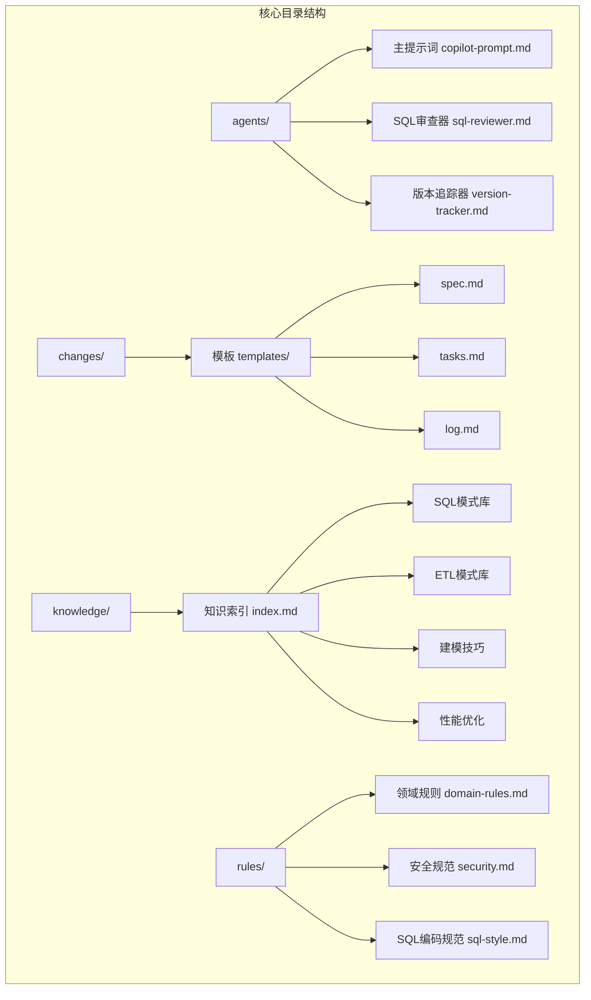

**图表来源**
- [目录结构和设计说明.md:21-55](file://目录结构和设计说明.md#L21-L55)
- [目录结构和设计说明.md:186-193](file://目录结构和设计说明.md#L186-L193)

**章节来源**
- [目录结构和设计说明.md:19-55](file://目录结构和设计说明.md#L19-L55)

## 核心组件

### Agent架构设计原理

dwh-copilot的Agent架构基于以下核心设计原则：

#### 1. Spec驱动原则
- **核心理念**：需求文档（Spec）是昂贵的核心资产，SQL脚本和模型DDL都是可重建的消耗品
- **执行规则**：
  - No Spec, No Change（没有spec，不准改）
  - Spec is Truth（spec与实现冲突时，错的一定是实现）
  - Reverse Sync（发现偏差先改spec再改实现）
  - 变更即记录（任何变更必须更新changes/与changelog）

#### 2. 三段式知识结构
系统将知识分为三个层次：
- **rules/**：约束 - 必须遵守的"红线"（强制）
- **knowledge/**：经验 - 可复用的"工具箱"（推荐）
- **changes/**：过程 - 每次变更的"病历"（历史）

#### 3. 命令式协作
通过标准化的命令体系实现AI与用户的协作：
- `/init`：项目初始化
- `/sql`：SQL开发
- `/etl`：ETL开发
- `/model`：数仓建模
- `/propose`：创建变更提案
- `/apply`：实施变更
- `/review`：三阶段审查
- `/optimize`：性能优化
- `/dq`：数据质量检查
- `/schedule`：调度配置
- `/archive`：归档与知识沉淀

**章节来源**
- [目录结构和设计说明.md:59-106](file://目录结构和设计说明.md#L59-L106)
- [目录结构和设计说明.md:186-193](file://目录结构和设计说明.md#L186-L193)

## 架构概览

### Agent协作架构

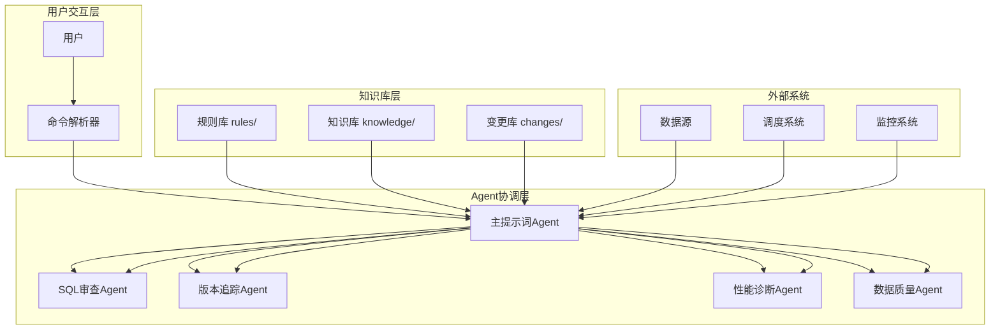

**图表来源**
- [copilot-prompt.md:63-147](file://agents/copilot-prompt.md#L63-L147)
- [目录结构和设计说明.md:24-29](file://目录结构和设计说明.md#L24-L29)

### Agent生命周期管理

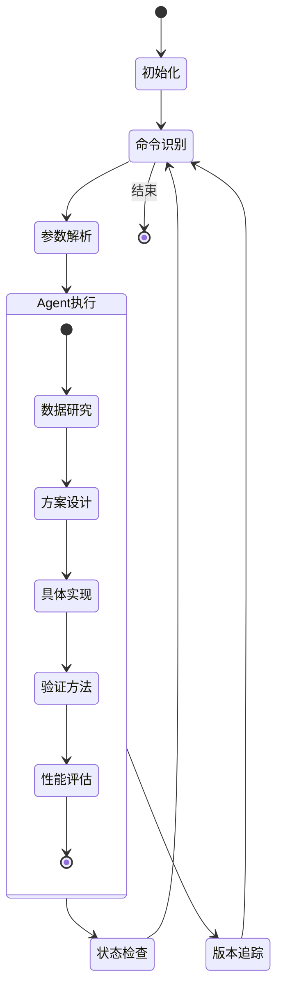

**图表来源**
- [copilot-prompt.md:65-136](file://agents/copilot-prompt.md#L65-L136)

## 详细组件分析

### 主提示词Agent（copilot-prompt.md）

主提示词Agent是整个系统的中枢，负责协调各个子Agent的工作。

#### 核心功能

1. **身份与原则**
   - 顶尖数仓工程师搭档
   - 用中文输出，技术术语保留英文
   - 不确定就问，不假设，不编造

2. **回答框架**
   每个回答必须包含七个结构化部分：
   - 问题理解
   - 现状分析
   - 方案设计
   - 具体实现
   - 验证方法
   - 性能与成本考量
   - 注意事项

3. **命令系统**
   - `/init`：初始化项目上下文
   - `/sql`：SQL开发
   - `/etl`：ETL开发
   - `/model`：数仓建模
   - `/propose`：创建变更提案
   - `/apply`：执行实施
   - `/review`：三阶段审查
   - `/optimize`：性能诊断
   - `/dq`：数据质量检查
   - `/schedule`：调度配置
   - `/archive`：归档与知识沉淀

#### 调试流程

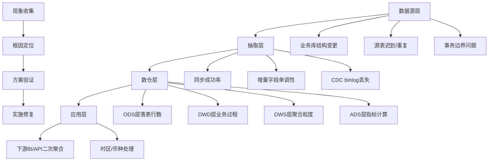

**图表来源**
- [copilot-prompt.md:133-147](file://agents/copilot-prompt.md#L133-L147)

**章节来源**
- [copilot-prompt.md:1-147](file://agents/copilot-prompt.md#L1-L147)

### SQL审查Agent（sql-reviewer.md）

SQL审查Agent专注于数仓SQL代码的质量、性能和可维护性审查。

#### 审查分级体系

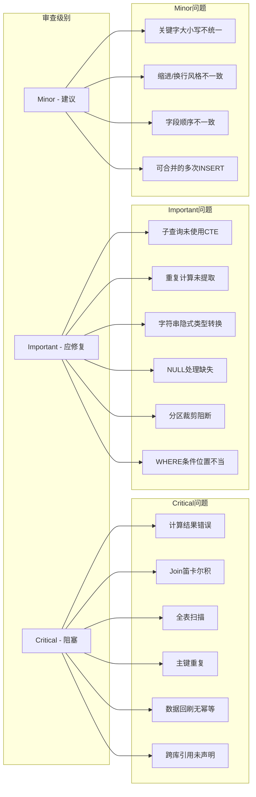

**图表来源**
- [sql-reviewer.md:5-68](file://agents/sql-reviewer.md#L5-L68)

#### 性能审查清单

| 审查维度 | 检查要点 | 优化建议 |
|---------|---------|---------|
| 分区裁剪 | 大型分区表是否使用dt/ds/pt | 确保WHERE条件直接命中分区字段 |
| Join顺序 | 大表在前、小表在后 | 按引擎特性调整Join顺序 |
| 广播Join | 小表阈值判断 | 启用Map Join/Broadcast Join |
| 数据倾斜 | 高频空值/默认值处理 | 添加盐值或拆分SQL |
| 聚合下推 | 外层Group By优化 | 将聚合下推到子查询 |
| 字段选择 | SELECT *使用 | 明列字段减少扫描量 |

**章节来源**
- [sql-reviewer.md:1-68](file://agents/sql-reviewer.md#L1-L68)

### 版本追踪Agent（version-tracker.md）

版本追踪Agent负责在每次DDL/SQL/ETL/调度变更后自动记录结构化的变更条目。

#### 触发时机

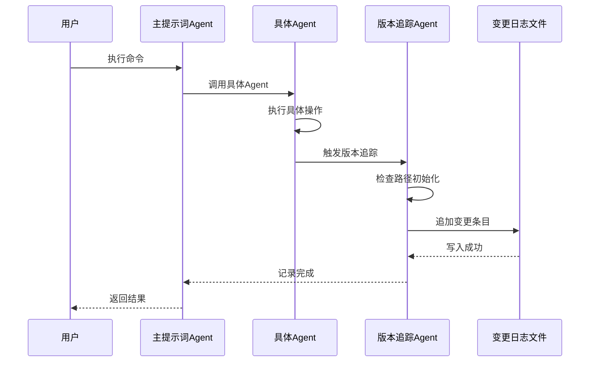

**图表来源**
- [version-tracker.md:5-16](file://agents/version-tracker.md#L5-L16)

#### 变更条目格式

每次记录包含以下结构化信息：

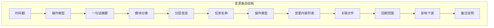

**图表来源**
- [version-tracker.md:44-64](file://agents/version-tracker.md#L44-L64)

**章节来源**
- [version-tracker.md:1-120](file://agents/version-tracker.md#L1-L120)

### 知识库Agent群

#### 知识索引Agent（index.md）

知识索引Agent提供轻量级的知识检索功能，通过关键词快速定位相关知识内容。

##### 知识分类体系

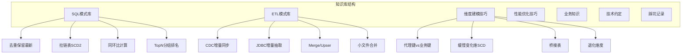

**图表来源**
- [index.md:6-48](file://knowledge/index.md#L6-L48)

**章节来源**
- [index.md:1-60](file://knowledge/index.md#L1-L60)

## 依赖关系分析

### Agent间协作关系

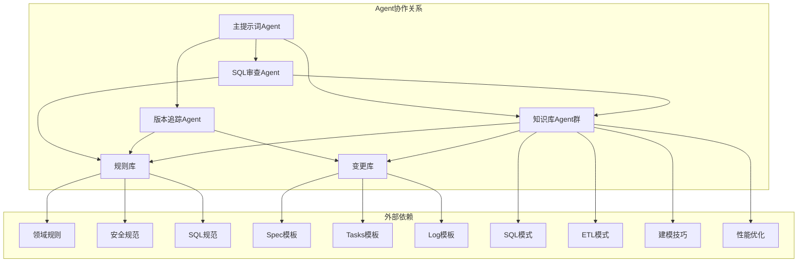

**图表来源**
- [目录结构和设计说明.md:24-53](file://目录结构和设计说明.md#L24-L53)

### 数据流分析

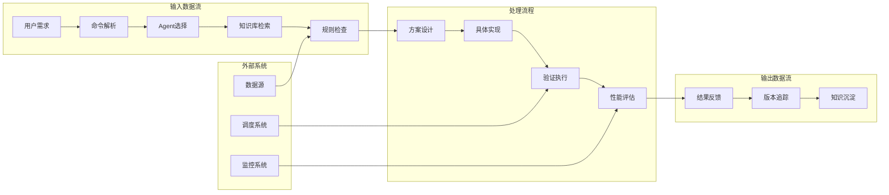

**图表来源**
- [copilot-prompt.md:23-34](file://agents/copilot-prompt.md#L23-L34)

**章节来源**
- [目录结构和设计说明.md:109-123](file://目录结构和设计说明.md#L109-L123)

## 性能考虑

### Agent执行效率优化

1. **并行处理能力**
   - 多个Agent可以并行执行，提高整体响应速度
   - 知识库检索支持缓存机制，减少重复查询
   - 版本追踪采用异步写入，不影响主流程执行

2. **内存使用优化**
   - Agent状态管理采用轻量级数据结构
   - 知识库内容按需加载，避免内存溢出
   - 变更日志采用流式写入，控制内存占用

3. **网络通信优化**
   - Agent间通信采用本地进程间通信
   - 知识库访问支持本地文件系统缓存
   - 外部系统集成采用连接池管理

### 性能监控指标

| 指标类型 | 监控内容 | 阈值标准 |
|---------|---------|---------|
| 响应时间 | Agent平均响应时间 | < 5秒 |
| 并发处理 | 同时处理的Agent数量 | 支持10个以上 |
| 内存使用 | Agent内存占用峰值 | < 500MB |
| 磁盘IO | 版本追踪写入频率 | < 100次/分钟 |
| 网络延迟 | 外部系统调用延迟 | < 2秒 |

## 故障排除指南

### 常见问题诊断

#### Agent启动问题

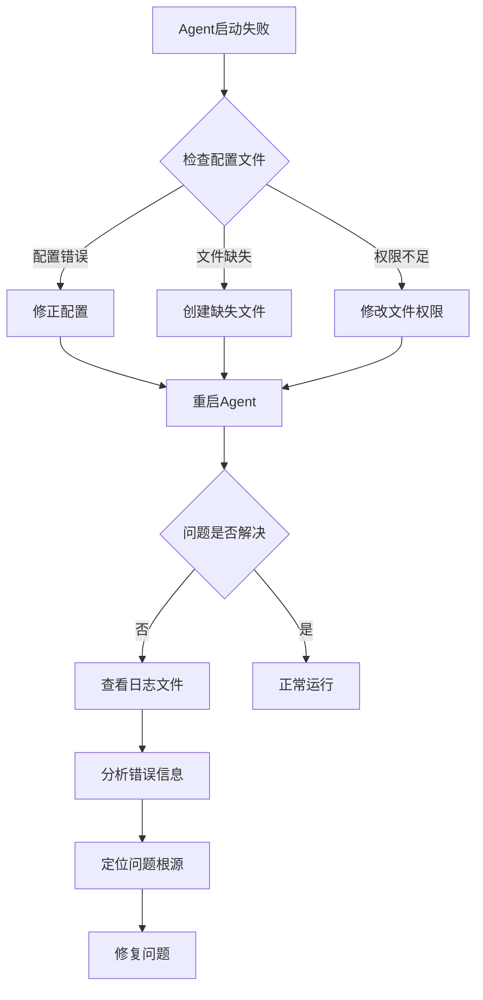

#### 性能问题排查

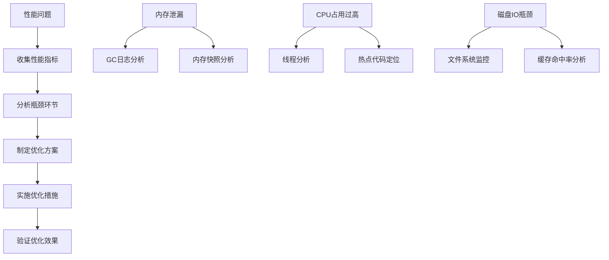

### 调试技巧

1. **日志分析**
   - 启用详细日志模式，记录Agent执行过程
   - 分析Agent间的调用关系和数据传递
   - 监控异常情况和错误堆栈信息

2. **性能分析**
   - 使用性能监控工具分析Agent执行时间
   - 分析内存使用情况和垃圾回收行为
   - 监控外部系统调用的响应时间

3. **集成测试**
   - 编写单元测试验证Agent功能
   - 进行集成测试验证Agent协作
   - 模拟异常情况测试容错能力

**章节来源**
- [copilot-prompt.md:133-147](file://agents/copilot-prompt.md#L133-L147)

## 结论

dwh-copilot的Agent扩展机制通过精心设计的架构和规范，实现了数仓开发全流程的智能化协作。该系统的主要优势包括：

1. **标准化流程**：严格的命令体系确保了数仓开发的规范性和一致性
2. **知识复用**：完整的知识库体系支持经验的沉淀和传承
3. **强制审计**：所有变更都必须记录在案，确保可审计、可回溯
4. **智能协作**：AI Agent能够理解复杂的数仓场景，提供专业的技术指导

对于新Agent的开发，建议遵循以下最佳实践：
- 明确Agent的职责边界和功能范围
- 设计清晰的接口定义和数据交换格式
- 实现完善的错误处理和异常恢复机制
- 提供详细的日志记录和性能监控
- 遵循系统的规范和约束要求

## 附录

### Agent开发规范

#### 接口定义规范

1. **输入参数规范**
   - 参数类型必须明确且一致
   - 提供参数验证和错误处理
   - 支持参数的默认值和可选性

2. **输出格式规范**
   - 统一的JSON/XML格式
   - 标准化的错误码和消息
   - 完整的状态信息和进度报告

3. **通信协议规范**
   - 支持同步和异步调用
   - 实现超时和重试机制
   - 提供心跳检测和健康检查

#### 集成流程规范

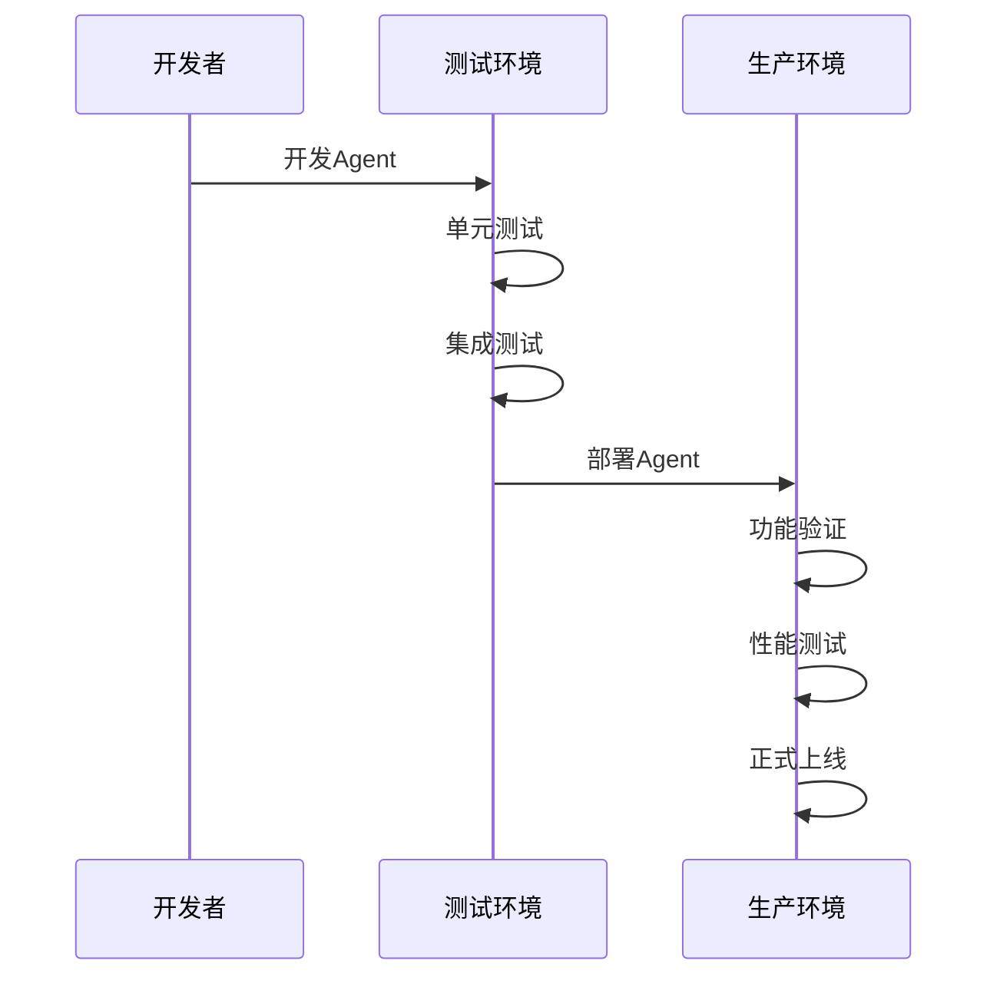

#### 生命周期管理

1. **开发阶段**
   - 需求分析和设计
   - 编码实现和单元测试
   - 代码审查和重构

2. **测试阶段**
   - 单元测试和集成测试
   - 性能测试和压力测试
   - 安全测试和合规检查

3. **部署阶段**
   - 环境准备和配置
   - 服务注册和发现
   - 监控和告警设置

4. **运维阶段**
   - 日常监控和维护
   - 性能优化和调优
   - 故障处理和恢复

### 最佳实践建议

1. **设计原则**
   - 单一职责原则：每个Agent专注于特定功能
   - 开闭原则：对扩展开放，对修改封闭
   - 依赖倒置原则：依赖抽象而非具体实现

2. **代码质量**
   - 代码注释和文档齐全
   - 异常处理和错误恢复完善
   - 性能优化和资源管理合理

3. **安全性**
   - 输入验证和参数过滤
   - 权限控制和访问限制
   - 数据加密和传输安全

4. **可维护性**
   - 代码结构清晰，易于理解和修改
   - 配置管理集中，便于维护
   - 日志记录完整，便于排查问题