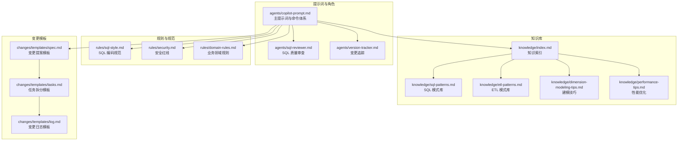
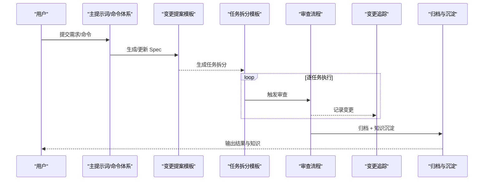
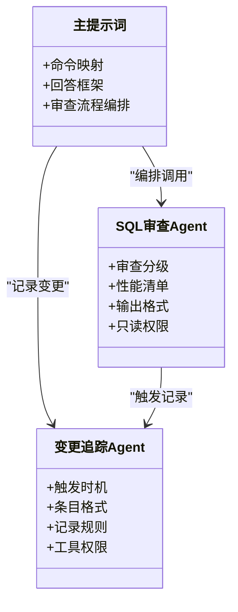
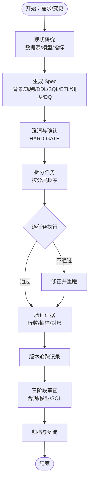
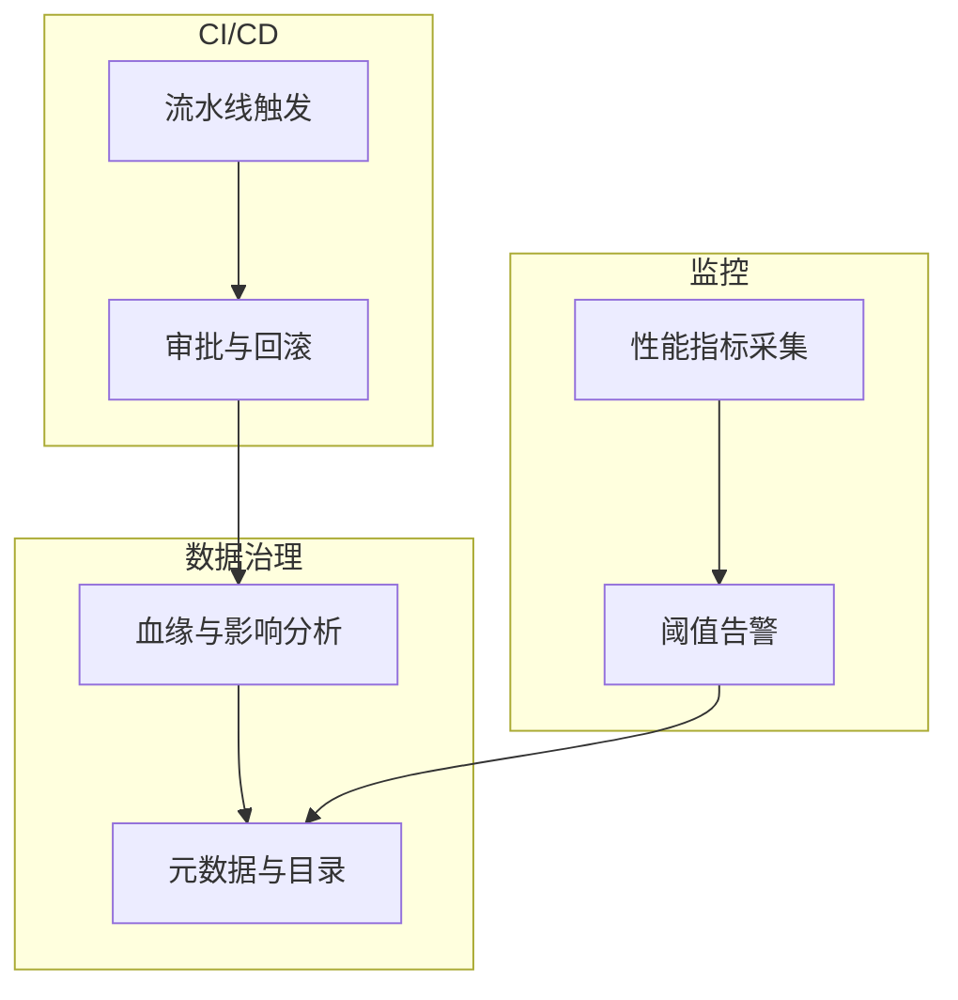
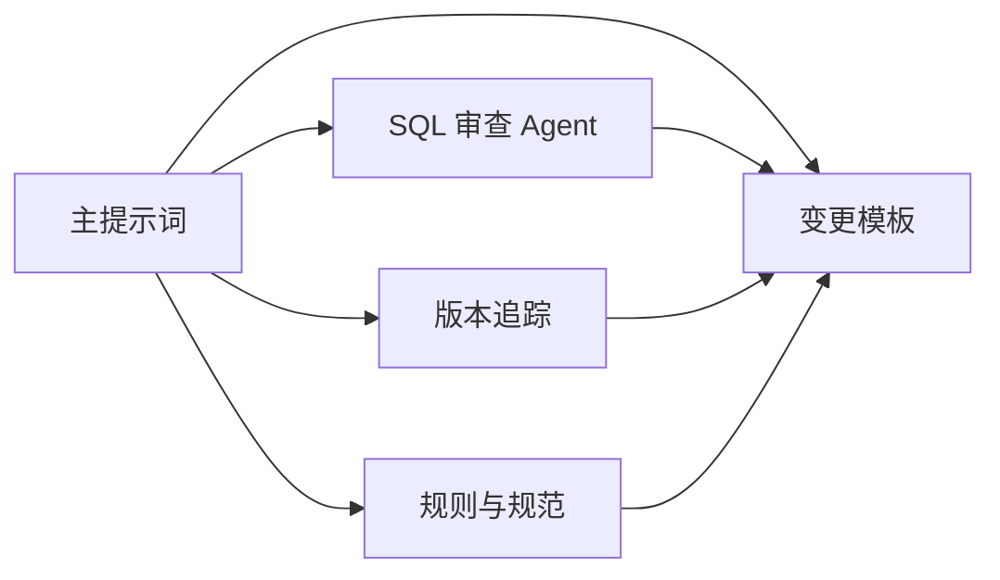

# 扩展与集成

<cite>
**本文引用的文件**
- [目录结构和设计说明.md](file://目录结构和设计说明.md)
- [copilot-prompt.md](file://agents/copilot-prompt.md)
- [sql-reviewer.md](file://agents/sql-reviewer.md)
- [version-tracker.md](file://agents/version-tracker.md)
- [domain-rules.md](file://rules/domain-rules.md)
- [security.md](file://rules/security.md)
- [sql-style.md](file://rules/sql-style.md)
- [index.md](file://knowledge/index.md)
- [sql-patterns.md](file://knowledge/sql-patterns.md)
- [etl-patterns.md](file://knowledge/etl-patterns.md)
- [dimension-modeling-tips.md](file://knowledge/dimension-modeling-tips.md)
- [performance-tips.md](file://knowledge/performance-tips.md)
- [spec.md](file://changes/templates/spec.md)
- [tasks.md](file://changes/templates/tasks.md)
- [log.md](file://changes/templates/log.md)
</cite>

## 目录
1. [简介](#简介)
2. [项目结构](#项目结构)
3. [核心组件](#核心组件)
4. [架构总览](#架构总览)
5. [详细组件分析](#详细组件分析)
6. [依赖分析](#依赖分析)
7. [性能考虑](#性能考虑)
8. [故障排查指南](#故障排查指南)
9. [结论](#结论)
10. [附录](#附录)

## 简介
本项目是一套“工程化提示词工程”型的数仓 AI 协作助手，围绕“Spec 驱动 + 三段式知识库 + 强制变更追踪”的理念，提供可扩展的 Agent 体系、模板化变更流程与知识沉淀机制。其目标是帮助团队在数据仓库开发中统一规范、强制合规、可审计、可回溯，并通过命令式协作提升交付效率与质量。

## 项目结构
项目采用“提示词 + 规则 + 知识 + 变更模板”的分层组织方式，便于扩展与集成：
- agents：AI 角色与子 Agent 的提示词，定义协作流程与审查标准
- rules：项目约束与规范（强制约束）
- knowledge：领域知识库（经验复用）
- changes/templates：变更管理的模板（Spec、任务、日志）

**图表来源**
- [目录结构和设计说明.md:19-55](file://目录结构和设计说明.md#L19-L55)
- [copilot-prompt.md:1-147](file://agents/copilot-prompt.md#L1-L147)
- [sql-reviewer.md:1-68](file://agents/sql-reviewer.md#L1-L68)
- [version-tracker.md:1-120](file://agents/version-tracker.md#L1-L120)
- [sql-style.md:1-254](file://rules/sql-style.md#L1-L254)
- [security.md:1-98](file://rules/security.md#L1-L98)
- [domain-rules.md:1-142](file://rules/domain-rules.md#L1-L142)
- [index.md:1-60](file://knowledge/index.md#L1-L60)
- [sql-patterns.md:1-331](file://knowledge/sql-patterns.md#L1-L331)
- [etl-patterns.md:1-220](file://knowledge/etl-patterns.md#L1-L220)
- [dimension-modeling-tips.md:1-253](file://knowledge/dimension-modeling-tips.md#L1-L253)
- [performance-tips.md:1-349](file://knowledge/performance-tips.md#L1-L349)
- [spec.md:1-132](file://changes/templates/spec.md#L1-L132)
- [tasks.md:1-74](file://changes/templates/tasks.md#L1-L74)
- [log.md:1-61](file://changes/templates/log.md#L1-L61)

**章节来源**
- [目录结构和设计说明.md:19-55](file://目录结构和设计说明.md#L19-L55)

## 核心组件
- 主提示词与命令体系：定义 AI 的身份、原则、回答框架与命令映射，确保每次协作在固定流程内进行
- SQL 质量审查 Agent：对 SQL 的正确性、性能与可维护性进行分级审查
- 变更追踪 Agent：在关键变更完成后自动记录结构化日志，确保可审计与可回溯
- 规则与规范：SQL 编码规范、安全红线、业务领域规则，作为强制约束
- 知识库：SQL 模式、ETL 模式、建模技巧、性能优化与业务知识，作为推荐复用
- 变更模板：Spec、任务拆分与日志模板，支撑“需求 → 规划 → 实施 → 审查 → 归档”的闭环

**章节来源**
- [copilot-prompt.md:1-147](file://agents/copilot-prompt.md#L1-L147)
- [sql-reviewer.md:1-68](file://agents/sql-reviewer.md#L1-L68)
- [version-tracker.md:1-120](file://agents/version-tracker.md#L1-L120)
- [sql-style.md:1-254](file://rules/sql-style.md#L1-L254)
- [security.md:1-98](file://rules/security.md#L1-L98)
- [domain-rules.md:1-142](file://rules/domain-rules.md#L1-L142)
- [index.md:1-60](file://knowledge/index.md#L1-L60)
- [spec.md:1-132](file://changes/templates/spec.md#L1-L132)
- [tasks.md:1-74](file://changes/templates/tasks.md#L1-L74)
- [log.md:1-61](file://changes/templates/log.md#L1-L61)

## 架构总览
整体架构以“提示词驱动 + 模板化流程 + 知识复用 + 变更追踪”为核心，形成“输入（需求）→ 规划（Spec/任务）→ 实施（SQL/ETL/调度）→ 审查（合规/模型/SQL）→ 归档（知识沉淀）”的闭环。

**图表来源**
- [copilot-prompt.md:63-131](file://agents/copilot-prompt.md#L63-L131)
- [spec.md:1-132](file://changes/templates/spec.md#L1-L132)
- [tasks.md:1-74](file://changes/templates/tasks.md#L1-L74)
- [version-tracker.md:5-16](file://agents/version-tracker.md#L5-L16)
- [log.md:1-61](file://changes/templates/log.md#L1-L61)

## 详细组件分析

### Agent 扩展机制与开发规范
- 扩展点
  - 新增 Agent：在 agents 目录下新增提示词文件，定义角色、审查维度与输出格式
  - 命令扩展：在主提示词中增加命令映射与执行流程
  - 审查流程：在审查阶段串联多个 Agent，形成“合规 → 模型 → SQL”的三阶段
- 开发规范
  - 明确前置条件与触发时机
  - 输出结构化格式，包含问题理解、现状分析、方案设计、具体实现、验证方法、性能与成本考量、注意事项
  - 仅读权限原则，避免写入干扰
- 集成流程
  - 在主提示词中注册新 Agent 的命令与触发条件
  - 在审查流程中按需调用新 Agent
  - 与版本追踪联动，在关键节点记录变更

**图表来源**
- [copilot-prompt.md:23-147](file://agents/copilot-prompt.md#L23-L147)
- [sql-reviewer.md:1-68](file://agents/sql-reviewer.md#L1-L68)
- [version-tracker.md:5-120](file://agents/version-tracker.md#L5-L120)

**章节来源**
- [copilot-prompt.md:23-147](file://agents/copilot-prompt.md#L23-L147)
- [sql-reviewer.md:1-68](file://agents/sql-reviewer.md#L1-L68)
- [version-tracker.md:5-120](file://agents/version-tracker.md#L5-L120)

### 模板扩展与最佳实践
- 变更提案模板（Spec）
  - 结构化记录背景、现状、功能点、业务规则、模型变更、SQL 设计、ETL/同步、调度、DQ、影响范围、验证策略、技术决策等
  - 通过 HARD-GATE 机制确保澄清与确认
- 任务拆分模板（Tasks）
  - 严格按 ODS→DIM→DWD→DWS→ADS 顺序拆分，每个任务原子化、可独立验证
  - 明确验收标准、验证方法与回刷计划
- 变更日志模板（Log）
  - 记录时间线、技术决策、踩坑记录、知识发现、性能对比、DQ 验证等
  - 为归档沉淀提供依据

**图表来源**
- [spec.md:1-132](file://changes/templates/spec.md#L1-L132)
- [tasks.md:1-74](file://changes/templates/tasks.md#L1-L74)
- [log.md:1-61](file://changes/templates/log.md#L1-L61)
- [copilot-prompt.md:103-131](file://agents/copilot-prompt.md#L103-L131)

**章节来源**
- [spec.md:1-132](file://changes/templates/spec.md#L1-L132)
- [tasks.md:1-74](file://changes/templates/tasks.md#L1-L74)
- [log.md:1-61](file://changes/templates/log.md#L1-L61)
- [copilot-prompt.md:103-131](file://agents/copilot-prompt.md#L103-L131)

### 与外部系统的集成方案
- CI/CD 流水线
  - 在任务执行后触发版本追踪，记录变更条目，作为上线审计依据
  - 将 DDL/SQL/ETL/调度变更纳入变更日志，便于流水线审批与回滚
- 监控系统
  - 在性能优化与 DQ 审查中输出量化指标（扫描量、耗时、资源、成本），对接监控面板
  - 将关键阈值与告警策略固化在规则与模板中
- 数据治理平台
  - 通过版本追踪记录“模块/分层/任务/变更内容/关联文件/影响下游”，支撑血缘与影响分析
  - 将 Spec/DQ/回刷范围等结构化信息对接数据目录与元数据平台

[本图为概念性集成示意，不直接映射具体源文件，故不提供图表来源]

### 第三方工具集成指导与 API 接口说明
- 工具权限与最小权限
  - 审查类 Agent 仅需只读权限，避免写入风险
- API 接口建议
  - 变更追踪：提供“追加日志条目”的接口，支持结构化字段（模块、分层、任务、操作、变更内容、关联文件、回刷范围、影响下游、备注）
  - 规则与模板：提供“读取规则/模板”的接口，支持按需检索与缓存
  - 审查流程：提供“调用审查 Agent”的接口，支持链式调用与失败回退

**章节来源**
- [sql-reviewer.md:66-68](file://agents/sql-reviewer.md#L66-L68)
- [version-tracker.md:115-120](file://agents/version-tracker.md#L115-L120)

### 自动化部署配置与维护
- 部署方式
  - 将项目目录加载到 AI 编码助手的工作区/系统提示词，AI 在每次会话开始时自动扫描 rules/ 与 changes/
- 维护要点
  - 定期更新规则与知识库，确保规范与经验同步
  - 通过版本追踪记录变更，建立回溯与审计机制
  - 在流水线中集成 DQ 与性能审查，保障上线质量

**章节来源**
- [目录结构和设计说明.md:186-194](file://目录结构和设计说明.md#L186-L194)
- [copilot-prompt.md:57-61](file://agents/copilot-prompt.md#L57-L61)
- [version-tracker.md:19-41](file://agents/version-tracker.md#L19-L41)

### 开发环境搭建与调试技巧
- 环境搭建
  - 将项目目录作为工作区加载到 AI 编码助手
  - 首次使用执行 /init 填充项目上下文
- 调试流程
  - 四阶段：现象收集 → 根因定位 → 方案验证 → 实施修复
  - 诊断层级：数据源层 → 抽取层 → 数仓层（ODS/DWD/DWS/ADS）→ 应用层
- 调试技巧
  - 使用 EXPLAIN/执行计划验证分区裁剪、Join 类型与谓词下推
  - 通过采样与抽样校验快速定位偏差
  - 在审查阶段严格执行“Critical/Important/Minor”分级，阻断高风险问题

**章节来源**
- [copilot-prompt.md:133-147](file://agents/copilot-prompt.md#L133-L147)
- [performance-tips.md:327-349](file://knowledge/performance-tips.md#L327-L349)

## 依赖分析
- 组件耦合
  - 主提示词编排各 Agent 与模板，耦合度适中，便于扩展
  - 审查 Agent 依赖规则与模板，形成“规范 → 实施 → 审查”的闭环
  - 版本追踪独立于具体实现，仅依赖日志文件写入
- 外部依赖
  - 与 CI/CD、监控与数据治理平台通过结构化日志与模板对接
- 潜在循环依赖
  - 通过模板与提示词的单向依赖避免循环

**图表来源**
- [copilot-prompt.md:63-131](file://agents/copilot-prompt.md#L63-L131)
- [sql-reviewer.md:1-68](file://agents/sql-reviewer.md#L1-L68)
- [version-tracker.md:5-16](file://agents/version-tracker.md#L5-L16)
- [sql-style.md:1-254](file://rules/sql-style.md#L1-L254)
- [domain-rules.md:1-142](file://rules/domain-rules.md#L1-L142)
- [spec.md:1-132](file://changes/templates/spec.md#L1-L132)
- [tasks.md:1-74](file://changes/templates/tasks.md#L1-L74)

**章节来源**
- [copilot-prompt.md:63-131](file://agents/copilot-prompt.md#L63-L131)
- [sql-reviewer.md:1-68](file://agents/sql-reviewer.md#L1-L68)
- [version-tracker.md:5-16](file://agents/version-tracker.md#L5-L16)
- [sql-style.md:1-254](file://rules/sql-style.md#L1-L254)
- [domain-rules.md:1-142](file://rules/domain-rules.md#L1-L142)
- [spec.md:1-132](file://changes/templates/spec.md#L1-L132)
- [tasks.md:1-74](file://changes/templates/tasks.md#L1-L74)

## 性能考虑
- 分区裁剪与谓词下推：确保 WHERE 条件直接命中分区字段，避免函数包裹
- Join 顺序与广播：按引擎特性选择 Join 类型，小表广播降低 Shuffle
- CTE 物化与列裁剪：在 Hive/Spark 中避免 WITH 重复计算，利用列存格式与列裁剪提升性能
- 小文件控制：通过 distribute by、AQE 合并与周期性合并控制小文件
- 资源队列与错峰调度：核心表独占队列，避免高峰期资源争用

**章节来源**
- [performance-tips.md:5-349](file://knowledge/performance-tips.md#L5-L349)
- [sql-style.md:165-201](file://rules/sql-style.md#L165-L201)

## 故障排查指南
- 调试流程
  - 现象收集：记录异常表现与影响范围
  - 根因定位：按数据源层 → 抽取层 → 数仓层 → 应用层逐层排查
  - 方案验证：在测试环境验证修复方案
  - 实施修复：在受控环境下实施，并触发版本追踪记录
- 常见问题
  - 数据倾斜：热点键处理、加盐打散、Map Join
  - 小文件爆炸：控制 reduce 数、AQE 合并、周期性合并
  - 性能退化：检查执行计划、Join 顺序、广播阈值、列裁剪

**章节来源**
- [copilot-prompt.md:133-147](file://agents/copilot-prompt.md#L133-L147)
- [performance-tips.md:42-194](file://knowledge/performance-tips.md#L42-L194)

## 结论
本项目通过“提示词工程 + 模板化流程 + 知识复用 + 变更追踪”的架构，实现了数仓开发的标准化与可扩展性。扩展 Agent 与模板只需遵循统一的输出格式与触发规则，即可无缝融入现有流程。通过与 CI/CD、监控与数据治理平台的结构化对接，进一步提升了交付质量与可审计性。

## 附录
- 命令速览
  - /init：初始化项目上下文
  - /sql：SQL 开发
  - /etl：ETL/数据集成开发
  - /model：数仓建模
  - /propose：创建变更提案
  - /apply：执行实施
  - /review：三阶段审查
  - /optimize：性能诊断与优化
  - /dq：数据质量校验
  - /schedule：调度配置
  - /archive：归档 + 知识沉淀
- 变更追踪触发时机
  - SQL/ETL/模型/调度变更完成后
  - 每个任务完成后
  - 用户手动记录时

**章节来源**
- [copilot-prompt.md:65-131](file://agents/copilot-prompt.md#L65-L131)
- [version-tracker.md:5-16](file://agents/version-tracker.md#L5-L16)