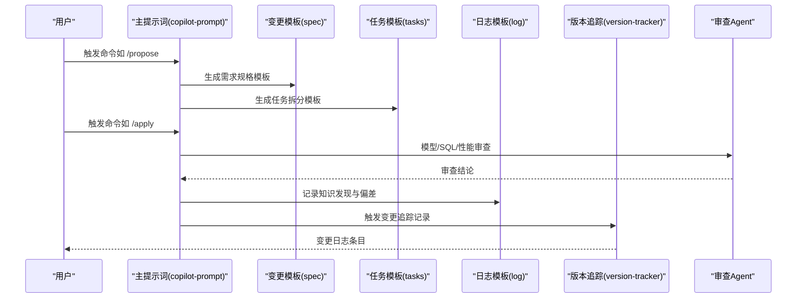
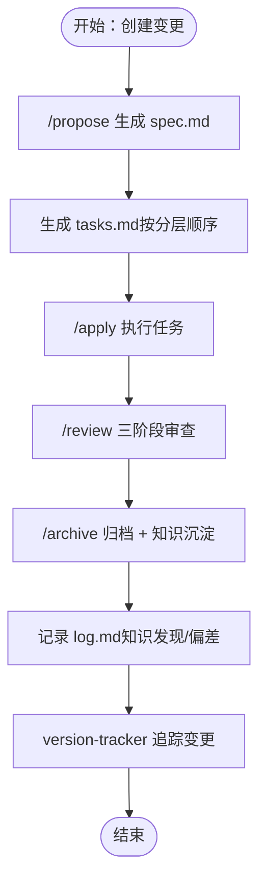
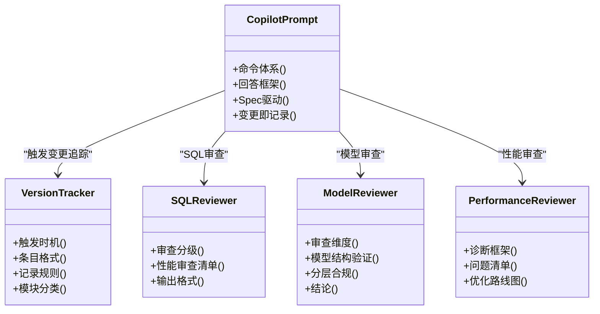
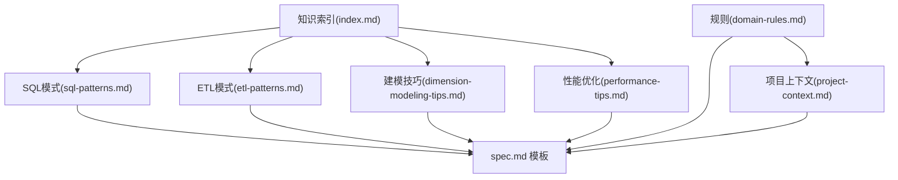
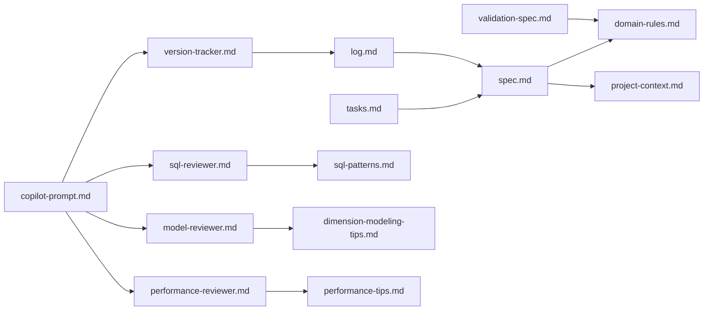
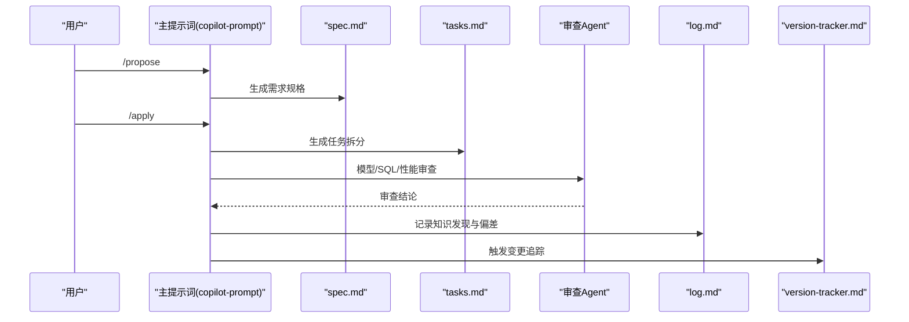

# 模板扩展方法

<cite>
**本文引用的文件**
- [目录结构和设计说明.md](file://目录结构和设计说明.md)
- [copilot-prompt.md](file://agents/copilot-prompt.md)
- [version-tracker.md](file://agents/version-tracker.md)
- [sql-reviewer.md](file://agents/sql-reviewer.md)
- [model-reviewer.md](file://agents/model-reviewer.md)
- [performance-reviewer.md](file://agents/performance-reviewer.md)
- [spec.md](file://changes/templates/spec.md)
- [tasks.md](file://changes/templates/tasks.md)
- [log.md](file://changes/templates/log.md)
- [validation-spec.md](file://changes/templates/validation-spec.md)
- [index.md](file://knowledge/index.md)
- [sql-patterns.md](file://knowledge/sql-patterns.md)
- [etl-patterns.md](file://knowledge/etl-patterns.md)
- [dimension-modeling-tips.md](file://knowledge/dimension-modeling-tips.md)
- [performance-tips.md](file://knowledge/performance-tips.md)
- [domain-rules.md](file://rules/domain-rules.md)
- [project-context.md](file://rules/project-context.md)
</cite>

## 目录
1. [简介](#简介)
2. [项目结构](#项目结构)
3. [核心组件](#核心组件)
4. [架构总览](#架构总览)
5. [详细组件分析](#详细组件分析)
6. [依赖分析](#依赖分析)
7. [性能考虑](#性能考虑)
8. [故障排查指南](#故障排查指南)
9. [结论](#结论)
10. [附录](#附录)

## 简介
本文件面向“模板扩展方法”，系统化阐述本项目的模板系统设计与扩展机制，涵盖：
- 模板系统整体架构与职责边界
- 新模板的开发规范与创建流程
- 模板的继承关系与复用机制
- 模板定制的最佳实践与参数化配置方法
- 具体模板开发示例（工作流模板）
- 模板验证与测试方法
- 模板版本管理策略

本项目以“Spec 驱动 + 三段式知识库 + 强制变更追踪”为核心理念，围绕 changes/templates 下的变更模板（spec、tasks、log、validation-spec）与 agents 的审查与追踪 Agent，形成可复用、可审计、可演进的模板体系。

## 项目结构
项目采用“目录即知识域”的组织方式：
- agents/：AI 角色与子 Agent 的提示词与审查流程
- changes/templates/：变更管理的模板（spec、tasks、log、validation-spec）
- knowledge/：领域知识库（SQL 模式、ETL 模式、建模技巧、性能优化）
- rules/：项目约束与规范（上下文、建模标准、调度标准、安全、领域规则）

```mermaid
graph TB
A["项目根目录"] --> B["agents/"]
A --> C["changes/templates/"]
A --> D["knowledge/"]
A --> E["rules/"]
B1["copilot-prompt.md"] --> B
B2["version-tracker.md"] --> B
B3["sql-reviewer.md"] --> B
B4["model-reviewer.md"] --> B
B5["performance-reviewer.md"] --> B
C1["spec.md"] --> C
C2["tasks.md"] --> C
C3["log.md"] --> C
C4["validation-spec.md"] --> C
D1["index.md"] --> D
D2["sql-patterns.md"] --> D
D3["etl-patterns.md"] --> D
D4["dimension-modeling-tips.md"] --> D
D5["performance-tips.md"] --> D
E1["domain-rules.md"] --> E
E2["project-context.md"] --> E
```

图表来源
- [目录结构和设计说明.md:19-55](file://目录结构和设计说明.md#L19-L55)
- [copilot-prompt.md:1-147](file://agents/copilot-prompt.md#L1-L147)
- [version-tracker.md:1-120](file://agents/version-tracker.md#L1-L120)
- [spec.md:1-132](file://changes/templates/spec.md#L1-L132)
- [tasks.md:1-74](file://changes/templates/tasks.md#L1-L74)
- [log.md:1-61](file://changes/templates/log.md#L1-L61)
- [validation-spec.md](file://changes/templates/validation-spec.md)
- [index.md:1-60](file://knowledge/index.md#L1-L60)
- [sql-patterns.md:1-331](file://knowledge/sql-patterns.md#L1-331)
- [etl-patterns.md:1-220](file://knowledge/etl-patterns.md#L1-220)
- [dimension-modeling-tips.md:1-253](file://knowledge/dimension-modeling-tips.md#L1-253)
- [performance-tips.md:1-349](file://knowledge/performance-tips.md#L1-349)
- [domain-rules.md:1-142](file://rules/domain-rules.md#L1-142)
- [project-context.md:1-104](file://rules/project-context.md#L1-104)

章节来源
- [目录结构和设计说明.md:19-55](file://目录结构和设计说明.md#L19-L55)

## 核心组件
- 变更模板族：spec.md（需求规格）、tasks.md（任务拆分）、log.md（变更日志）、validation-spec.md（验证规范）
- 审查与追踪 Agent：copilot-prompt.md（主提示词与命令体系）、version-tracker.md（变更追踪）、sql-reviewer.md（SQL 质量审查）、model-reviewer.md（模型合规审查）、performance-reviewer.md（性能诊断）
- 领域知识库：index.md（索引）、sql-patterns.md、etl-patterns.md、dimension-modeling-tips.md、performance-tips.md
- 规则与上下文：domain-rules.md（业务领域规则）、project-context.md（项目上下文）

章节来源
- [copilot-prompt.md:1-147](file://agents/copilot-prompt.md#L1-L147)
- [version-tracker.md:1-120](file://agents/version-tracker.md#L1-L120)
- [spec.md:1-132](file://changes/templates/spec.md#L1-L132)
- [tasks.md:1-74](file://changes/templates/tasks.md#L1-L74)
- [log.md:1-61](file://changes/templates/log.md#L1-L61)
- [validation-spec.md](file://changes/templates/validation-spec.md)
- [index.md:1-60](file://knowledge/index.md#L1-L60)
- [sql-patterns.md:1-331](file://knowledge/sql-patterns.md#L1-331)
- [etl-patterns.md:1-220](file://knowledge/etl-patterns.md#L1-220)
- [dimension-modeling-tips.md:1-253](file://knowledge/dimension-modeling-tips.md#L1-253)
- [performance-tips.md:1-349](file://knowledge/performance-tips.md#L1-349)
- [domain-rules.md:1-142](file://rules/domain-rules.md#L1-142)
- [project-context.md:1-104](file://rules/project-context.md#L1-104)

## 架构总览
模板系统围绕“命令驱动 + 模板生成 + 审查与追踪”的闭环工作流展开：
- 命令入口：copilot-prompt.md 定义命令（/propose、/apply、/review、/optimize、/dq、/schedule、/archive 等）
- 模板生成：根据命令生成 spec、tasks、log、validation-spec 等模板
- 审查与追踪：各 Agent 对生成内容进行质量把关与变更记录
- 知识复用：knowledge/ 与 rules/ 为模板提供约束与模式库支撑

图表来源
- [copilot-prompt.md:63-147](file://agents/copilot-prompt.md#L63-L147)
- [version-tracker.md:5-120](file://agents/version-tracker.md#L5-L120)
- [spec.md:1-132](file://changes/templates/spec.md#L1-L132)
- [tasks.md:1-74](file://changes/templates/tasks.md#L1-L74)
- [log.md:1-61](file://changes/templates/log.md#L1-L61)
- [sql-reviewer.md:1-68](file://agents/sql-reviewer.md#L1-L68)
- [model-reviewer.md:1-50](file://agents/model-reviewer.md#L1-L50)
- [performance-reviewer.md:1-81](file://agents/performance-reviewer.md#L1-L81)

## 详细组件分析

### 变更模板族（spec、tasks、log、validation-spec）
- spec.md：用于生成需求规格，包含背景目标、现状分析、功能点、业务规则、模型变更 DDL、SQL 设计、ETL/同步、调度、数据质量、影响范围、风险关注、验证策略、待澄清、技术决策、执行日志、审查结论与 HARD-GATE 确认等章节。
- tasks.md：用于生成任务拆分，按 ODS→DIM→DWD→DWS→ADS 顺序拆解，每个任务精确到库.表.字段/作业名/依赖，包含验收标准、验证方法、回刷计划等。
- log.md：用于记录变更日志，包含时间线、技术决策、踩坑记录、知识发现、Spec-实现偏差、数据回刷、性能对比、数据质量验证、质量备忘等。
- validation-spec.md：用于定义验证规范，覆盖行数/对账/性能/DQ 等维度的判定标准与执行策略。

图表来源
- [copilot-prompt.md:103-131](file://agents/copilot-prompt.md#L103-L131)
- [spec.md:1-132](file://changes/templates/spec.md#L1-L132)
- [tasks.md:1-74](file://changes/templates/tasks.md#L1-L74)
- [log.md:1-61](file://changes/templates/log.md#L1-L61)
- [version-tracker.md:5-120](file://agents/version-tracker.md#L5-L120)

章节来源
- [spec.md:1-132](file://changes/templates/spec.md#L1-L132)
- [tasks.md:1-74](file://changes/templates/tasks.md#L1-L74)
- [log.md:1-61](file://changes/templates/log.md#L1-L61)
- [validation-spec.md](file://changes/templates/validation-spec.md)

### 审查与追踪 Agent
- copilot-prompt.md：定义命令体系与回答框架，强调 Spec 驱动、现状出处、变更即记录等原则。
- version-tracker.md：在每次 DDL/SQL/ETL/调度变更后自动记录结构化条目，包含模块、分层、任务、操作、变更内容、关联文件、回刷范围、影响下游、备注等字段。
- sql-reviewer.md：对 SQL 的计算正确性、分区裁剪、Join、重复计算、NULL 处理、CTE 使用、字段别名等进行分级审查。
- model-reviewer.md：对模型结构、分层合规、建模合规、物理设计、数据变更准确性进行独立验证。
- performance-reviewer.md：按数据源层→抽取层→数仓层→SQL 层→应用层的五层诊断框架进行性能评估与优化建议。

图表来源
- [copilot-prompt.md:1-147](file://agents/copilot-prompt.md#L1-L147)
- [version-tracker.md:1-120](file://agents/version-tracker.md#L1-L120)
- [sql-reviewer.md:1-68](file://agents/sql-reviewer.md#L1-L68)
- [model-reviewer.md:1-50](file://agents/model-reviewer.md#L1-L50)
- [performance-reviewer.md:1-81](file://agents/performance-reviewer.md#L1-L81)

章节来源
- [copilot-prompt.md:1-147](file://agents/copilot-prompt.md#L1-L147)
- [version-tracker.md:1-120](file://agents/version-tracker.md#L1-L120)
- [sql-reviewer.md:1-68](file://agents/sql-reviewer.md#L1-L68)
- [model-reviewer.md:1-50](file://agents/model-reviewer.md#L1-L50)
- [performance-reviewer.md:1-81](file://agents/performance-reviewer.md#L1-L81)

### 领域知识库与规则
- knowledge/index.md：提供 SQL 模式、ETL 模式、维度建模技巧、性能优化技巧、业务知识、技术约定、踩坑记录的索引与导航。
- sql-patterns.md：提供去重保留最新、拉链表（SCD2）、同环比、TopN、累计求和、行转列/列转行、数据回刷、Lambda 合并、缺失日期补齐、NULL 安全比较等高质量模式。
- etl-patterns.md：提供 CDC 增量同步、JDBC 增量抽取、MERGE/UPSERT、小文件控制、历史回刷、文件接入、API 拉取、全量/增量/CDC 选型对照、数据漂移与时区处理等模式。
- dimension-modeling-tips.md：提供代理键/业务键、SCD 三种类型、桥接表、退化维度、一致性维度、事实表类型、维度表分级、分层归属判定等建模技巧。
- performance-tips.md：提供分区裁剪、数据倾斜、Map/Broadcast Join、小文件问题、CTE 物化策略、谓词下推与列裁剪、Join 顺序与类型、窗口函数性能、存储格式与压缩、调度与资源、性能分析工具等。
- rules/domain-rules.md：提供通用业务规则、KPI/指标定义标准、数据质量规则、历史数据约定、行业特定规则、跨系统口径一致性、项目特定规则等。
- rules/project-context.md：提供项目概况、数据源清单、分层与库、主题域划分、核心事实表/维度清单、关键 ADS 表/报表清单、关键 KPI/指标字典、调度与基线、命名规范偏差登记、安全配置、关键依赖与外部系统、已知技术债等。

图表来源
- [index.md:1-60](file://knowledge/index.md#L1-L60)
- [sql-patterns.md:1-331](file://knowledge/sql-patterns.md#L1-331)
- [etl-patterns.md:1-220](file://knowledge/etl-patterns.md#L1-220)
- [dimension-modeling-tips.md:1-253](file://knowledge/dimension-modeling-tips.md#L1-253)
- [performance-tips.md:1-349](file://knowledge/performance-tips.md#L1-349)
- [domain-rules.md:1-142](file://rules/domain-rules.md#L1-142)
- [project-context.md:1-104](file://rules/project-context.md#L1-104)
- [spec.md:1-132](file://changes/templates/spec.md#L1-L132)

章节来源
- [index.md:1-60](file://knowledge/index.md#L1-L60)
- [sql-patterns.md:1-331](file://knowledge/sql-patterns.md#L1-331)
- [etl-patterns.md:1-220](file://knowledge/etl-patterns.md#L1-220)
- [dimension-modeling-tips.md:1-253](file://knowledge/dimension-modeling-tips.md#L1-253)
- [performance-tips.md:1-349](file://knowledge/performance-tips.md#L1-349)
- [domain-rules.md:1-142](file://rules/domain-rules.md#L1-142)
- [project-context.md:1-104](file://rules/project-context.md#L1-104)

## 依赖分析
- 模板依赖关系
  - spec.md 依赖 rules/domain-rules.md 与 rules/project-context.md 的业务与上下文约束
  - tasks.md 依赖 spec.md 的分层与任务拆分顺序
  - log.md 依赖 changes/ 当前变更的执行与审查结论
  - validation-spec.md 依赖 domain-rules.md 的 DQ 五维度与严重等级
- Agent 依赖关系
  - copilot-prompt.md 作为中枢，协调 version-tracker.md、sql-reviewer.md、model-reviewer.md、performance-reviewer.md
  - 各 Agent 依赖 knowledge/ 与 rules/ 提供的模式与规范
- 外部依赖
  - 版本追踪依赖用户指定的变更日志文件路径
  - 审查依赖数据库/引擎的 EXPLAIN/DESC/SHOW 等只读工具

图表来源
- [spec.md:1-132](file://changes/templates/spec.md#L1-L132)
- [tasks.md:1-74](file://changes/templates/tasks.md#L1-L74)
- [log.md:1-61](file://changes/templates/log.md#L1-L61)
- [validation-spec.md](file://changes/templates/validation-spec.md)
- [domain-rules.md:1-142](file://rules/domain-rules.md#L1-142)
- [project-context.md:1-104](file://rules/project-context.md#L1-104)
- [copilot-prompt.md:1-147](file://agents/copilot-prompt.md#L1-L147)
- [version-tracker.md:1-120](file://agents/version-tracker.md#L1-L120)
- [sql-reviewer.md:1-68](file://agents/sql-reviewer.md#L1-L68)
- [model-reviewer.md:1-50](file://agents/model-reviewer.md#L1-L50)
- [performance-reviewer.md:1-81](file://agents/performance-reviewer.md#L1-L81)
- [sql-patterns.md:1-331](file://knowledge/sql-patterns.md#L1-331)
- [dimension-modeling-tips.md:1-253](file://knowledge/dimension-modeling-tips.md#L1-253)
- [performance-tips.md:1-349](file://knowledge/performance-tips.md#L1-349)

章节来源
- [spec.md:1-132](file://changes/templates/spec.md#L1-L132)
- [tasks.md:1-74](file://changes/templates/tasks.md#L1-L74)
- [log.md:1-61](file://changes/templates/log.md#L1-L61)
- [validation-spec.md](file://changes/templates/validation-spec.md)
- [domain-rules.md:1-142](file://rules/domain-rules.md#L1-142)
- [project-context.md:1-104](file://rules/project-context.md#L1-104)
- [copilot-prompt.md:1-147](file://agents/copilot-prompt.md#L1-L147)
- [version-tracker.md:1-120](file://agents/version-tracker.md#L1-L120)
- [sql-reviewer.md:1-68](file://agents/sql-reviewer.md#L1-L68)
- [model-reviewer.md:1-50](file://agents/model-reviewer.md#L1-L50)
- [performance-reviewer.md:1-81](file://agents/performance-reviewer.md#L1-L81)
- [sql-patterns.md:1-331](file://knowledge/sql-patterns.md#L1-331)
- [dimension-modeling-tips.md:1-253](file://knowledge/dimension-modeling-tips.md#L1-253)
- [performance-tips.md:1-349](file://knowledge/performance-tips.md#L1-349)

## 性能考虑
- 模板生成与审查的性能
  - 通过只读工具（EXPLAIN/DESC/SHOW/GLOB/READ）进行审查，避免写入开销
  - 审查 Agent 的输出格式标准化，便于快速定位瓶颈
- 模板复用与模式库
  - knowledge/ 模式库提供经过验证的高质量模板，减少重复劳动
  - rules/ 约束确保模板在统一规范下生成，降低返工概率
- 变更追踪的性能
  - version-tracker.md 的条目格式简洁、字段明确，便于机器解析与自动化处理

[本节为通用指导，不直接分析具体文件]

## 故障排查指南
- 常见问题与定位
  - 审查不通过：依据 sql-reviewer.md 的分级与清单逐项核对；依据 model-reviewer.md 的审查维度检查模型结构与分层合规；依据 performance-reviewer.md 的诊断框架定位性能瓶颈
  - 变更追踪失败：检查 version-tracker.md 的路径初始化与记录规则，确保路径可写且条目格式符合规范
  - 模板内容缺失：核对 spec.md、tasks.md、log.md、validation-spec.md 的章节完整性，确保引用 rules/ 与 knowledge/ 的内容齐全
- 建议流程
  - 现象收集：明确问题类型（SQL/模型/性能/调度/数据质量）
  - 根因定位：按 Agent 诊断层级逐层排查
  - 方案验证：在受控环境验证修复方案
  - 实施修复：遵循 Spec 驱动与变更即记录原则，触发 version-tracker.md 记录

章节来源
- [sql-reviewer.md:1-68](file://agents/sql-reviewer.md#L1-L68)
- [model-reviewer.md:1-50](file://agents/model-reviewer.md#L1-L50)
- [performance-reviewer.md:1-81](file://agents/performance-reviewer.md#L1-L81)
- [version-tracker.md:1-120](file://agents/version-tracker.md#L1-L120)
- [spec.md:1-132](file://changes/templates/spec.md#L1-L132)
- [tasks.md:1-74](file://changes/templates/tasks.md#L1-L74)
- [log.md:1-61](file://changes/templates/log.md#L1-L61)
- [validation-spec.md](file://changes/templates/validation-spec.md)

## 结论
本模板扩展方法以“命令驱动 + 模板生成 + 审查与追踪 + 知识复用”为核心，通过规范化的模板族与 Agent 协作，实现了可审计、可复用、可演进的数仓工程化协作体系。新模板的开发应遵循统一的字段与结构规范，充分利用领域知识库与规则约束，确保生成内容的质量与一致性。

[本节为总结性内容，不直接分析具体文件]

## 附录

### 新模板开发规范与创建流程
- 开发规范
  - 字段与结构：遵循 changes/templates 下现有模板的章节与字段命名，确保与 Agent 的解析逻辑兼容
  - 内容约束：引用 rules/ 与 knowledge/ 的权威内容，标注出处；遵循 domain-rules.md 的业务规则与严重等级
  - 输出格式：采用 Markdown 表格与列表，便于机器解析与自动化处理
- 创建流程
  - 明确场景与目标：确定模板用途（如验证规范、回滚预案、部署清单等）
  - 参考现有模板：以 spec.md、tasks.md、log.md、validation-spec.md 为蓝本，复用字段与结构
  - 引用权威内容：在模板中引用 domain-rules.md、project-context.md、sql-patterns.md、etl-patterns.md、dimension-modeling-tips.md、performance-tips.md
  - 审查与测试：通过 copilot-prompt.md 的命令体系生成模板，交由相应 Agent 审查；在受控环境中验证模板的有效性
  - 记录与追踪：模板生成后触发 version-tracker.md 记录，确保可审计

章节来源
- [spec.md:1-132](file://changes/templates/spec.md#L1-L132)
- [tasks.md:1-74](file://changes/templates/tasks.md#L1-L74)
- [log.md:1-61](file://changes/templates/log.md#L1-L61)
- [validation-spec.md](file://changes/templates/validation-spec.md)
- [domain-rules.md:1-142](file://rules/domain-rules.md#L1-142)
- [project-context.md:1-104](file://rules/project-context.md#L1-104)
- [sql-patterns.md:1-331](file://knowledge/sql-patterns.md#L1-331)
- [etl-patterns.md:1-220](file://knowledge/etl-patterns.md#L1-220)
- [dimension-modeling-tips.md:1-253](file://knowledge/dimension-modeling-tips.md#L1-253)
- [performance-tips.md:1-349](file://knowledge/performance-tips.md#L1-349)
- [copilot-prompt.md:1-147](file://agents/copilot-prompt.md#L1-L147)
- [version-tracker.md:1-120](file://agents/version-tracker.md#L1-L120)

### 模板继承关系与复用机制
- 继承关系
  - tasks.md 继承自 spec.md 的分层与任务拆分顺序
  - log.md 继承自 changes/ 当前变更的执行与审查结论
  - validation-spec.md 继承自 domain-rules.md 的 DQ 五维度与严重等级
- 复用机制
  - knowledge/ 模式库提供可直接复用的 SQL/ETL/建模/性能模板
  - rules/ 约束提供可复用的业务规则与上下文
  - Agent 的审查逻辑可复用到新模板的生成与验证

章节来源
- [tasks.md:1-74](file://changes/templates/tasks.md#L1-L74)
- [log.md:1-61](file://changes/templates/log.md#L1-L61)
- [validation-spec.md](file://changes/templates/validation-spec.md)
- [domain-rules.md:1-142](file://rules/domain-rules.md#L1-142)
- [index.md:1-60](file://knowledge/index.md#L1-L60)

### 模板定制的最佳实践与参数化配置
- 最佳实践
  - 参数化：在模板中使用占位符（如 ${bizdate}、${bizdate_minus_1}）以适配不同日期与环境
  - 引用权威：优先引用 domain-rules.md、project-context.md、sql-patterns.md、etl-patterns.md、dimension-modeling-tips.md、performance-tips.md
  - 结构化：采用表格与列表，确保字段与内容的可读性与可解析性
- 参数化配置
  - 日期参数：${bizdate}、${bizdate_minus_1}、${bizdate_plus_1}
  - 环境参数：根据 project-context.md 的上下文动态注入（如引擎、调度系统、命名规范等）

章节来源
- [sql-patterns.md:1-331](file://knowledge/sql-patterns.md#L1-331)
- [etl-patterns.md:1-220](file://knowledge/etl-patterns.md#L1-220)
- [dimension-modeling-tips.md:1-253](file://knowledge/dimension-modeling-tips.md#L1-253)
- [performance-tips.md:1-349](file://knowledge/performance-tips.md#L1-349)
- [project-context.md:1-104](file://rules/project-context.md#L1-104)

### 具体模板开发示例（工作流模板）
- 示例场景：新建一个数据需求（ADS 月度销售看板表，按门店×商品类目维度）
- 开发步骤
  - 使用 /propose 命令生成 spec.md，明确背景目标、现状分析、功能点、业务规则、模型变更 DDL、SQL 设计、ETL/同步、调度、数据质量、影响范围、风险关注、验证策略、待澄清、技术决策、执行日志、审查结论与 HARD-GATE 确认
  - 使用 /apply 命令生成 tasks.md，按 ODS→DIM→DWD→DWS→ADS 顺序拆解任务，每个任务精确到库.表.字段/作业名/依赖，包含验收标准、验证方法、回刷计划
  - 在审查阶段，由 model-reviewer.md、sql-reviewer.md、performance-reviewer.md 对模型、SQL、性能进行独立验证
  - 使用 /archive 命令归档并沉淀知识，记录 log.md 的知识发现与 Spec-实现偏差
  - 每次变更后触发 version-tracker.md 记录结构化条目

图表来源
- [copilot-prompt.md:103-131](file://agents/copilot-prompt.md#L103-L131)
- [spec.md:1-132](file://changes/templates/spec.md#L1-L132)
- [tasks.md:1-74](file://changes/templates/tasks.md#L1-L74)
- [log.md:1-61](file://changes/templates/log.md#L1-L61)
- [version-tracker.md:5-120](file://agents/version-tracker.md#L5-L120)
- [sql-reviewer.md:1-68](file://agents/sql-reviewer.md#L1-L68)
- [model-reviewer.md:1-50](file://agents/model-reviewer.md#L1-L50)
- [performance-reviewer.md:1-81](file://agents/performance-reviewer.md#L1-L81)

### 模板验证与测试方法
- 验证方法
  - 数据准确性验证：对比来源（业务库直查/旧表/Excel 基准）
  - 行数核验：源 vs 目标 vs 上一版本
  - 抽样校验：随机 N 条 + 边界 N 条
  - 性能验证：单作业耗时、扫描量、成本
  - 回刷验证：分批回刷 + 每批对账
  - 用户验收：业务方确认
- 测试方法
  - 受控环境测试：在受控环境中验证模板的有效性与稳定性
  - 审查 Agent 测试：通过 sql-reviewer.md、model-reviewer.md、performance-reviewer.md 的审查逻辑验证模板质量
  - 变更追踪测试：验证 version-tracker.md 的条目格式与记录规则

章节来源
- [spec.md:104-111](file://changes/templates/spec.md#L104-L111)
- [sql-reviewer.md:1-68](file://agents/sql-reviewer.md#L1-L68)
- [model-reviewer.md:1-50](file://agents/model-reviewer.md#L1-L50)
- [performance-reviewer.md:1-81](file://agents/performance-reviewer.md#L1-L81)
- [version-tracker.md:1-120](file://agents/version-tracker.md#L1-L120)

### 模板版本管理策略
- 版本标识：在模板文件中使用状态字段（status: propose | apply | review | done）与创建日期（created: YYYY-MM-DD）
- 复杂度标注：在模板中使用复杂度字段（complexity: 🟢简单 | 🟡中等 | 🔴复杂）
- 类型标注：在模板中使用类型字段（type: 新建主题 | 模型变更 | SQL 开发 | ETL 接入 | 调度配置 | 数据回刷 | 性能优化 | 数据质量）
- 变更追踪：每次模板变更后触发 version-tracker.md 记录，确保可审计、可回溯

章节来源
- [spec.md:3-6](file://changes/templates/spec.md#L3-L6)
- [version-tracker.md:1-120](file://agents/version-tracker.md#L1-L120)