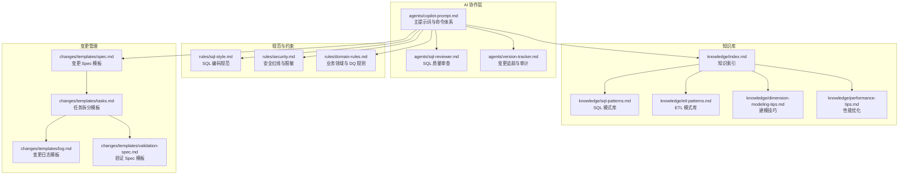
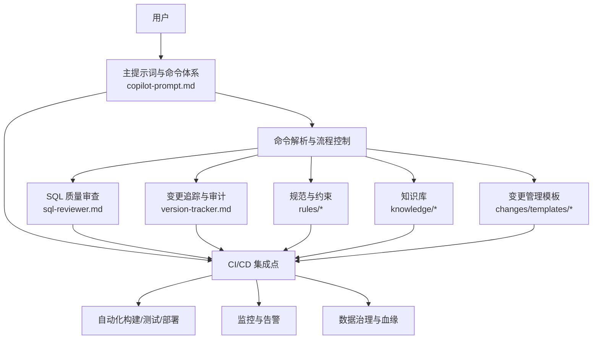
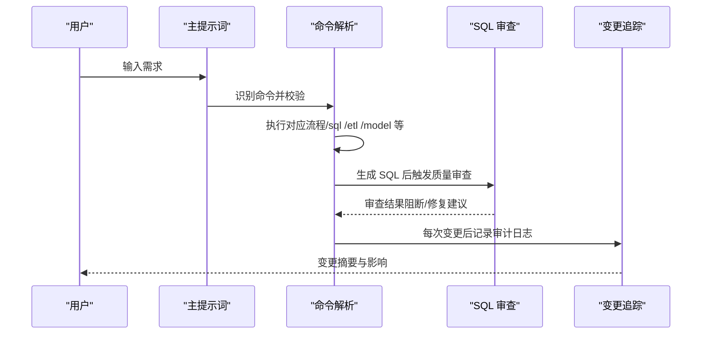
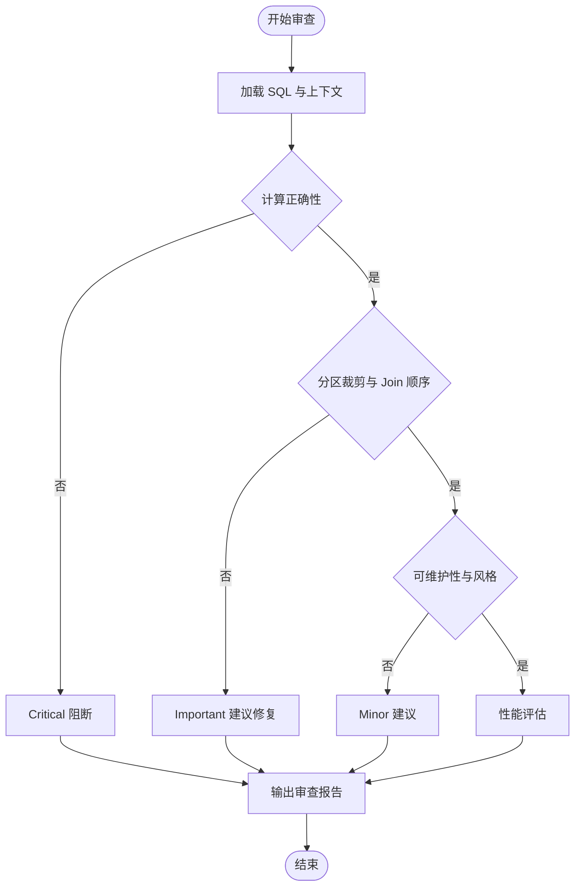
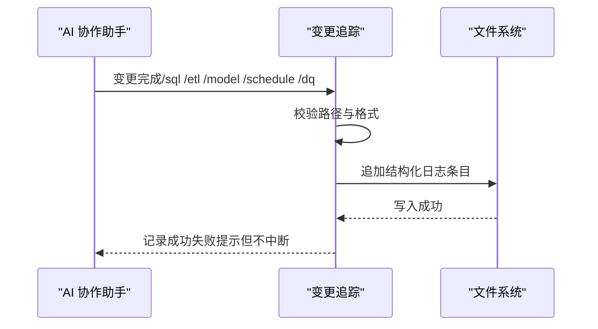
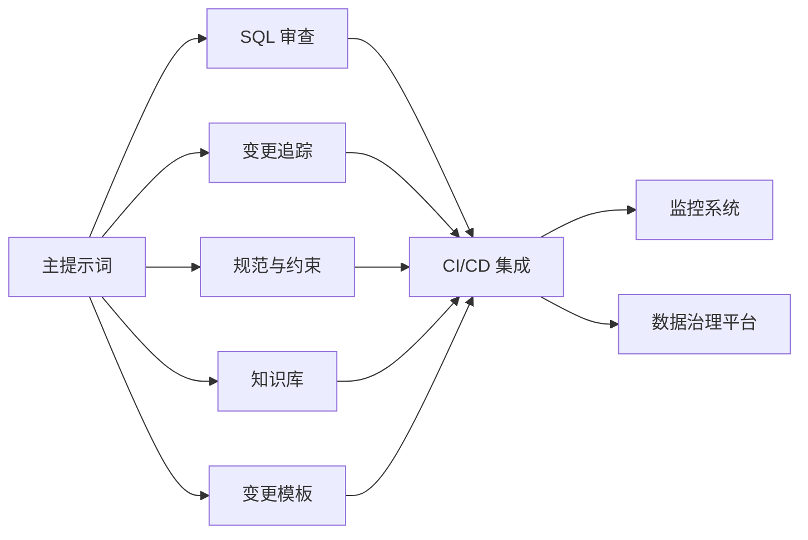

# 系统集成方案

<cite>
**本文引用的文件**
- [目录结构和设计说明.md](file://目录结构和设计说明.md)
- [copilot-prompt.md](file://agents/copilot-prompt.md)
- [sql-reviewer.md](file://agents/sql-reviewer.md)
- [version-tracker.md](file://agents/version-tracker.md)
- [domain-rules.md](file://rules/domain-rules.md)
- [security.md](file://rules/security.md)
- [sql-style.md](file://rules/sql-style.md)
- [index.md](file://knowledge/index.md)
- [sql-patterns.md](file://knowledge/sql-patterns.md)
- [etl-patterns.md](file://knowledge/etl-patterns.md)
- [dimension-modeling-tips.md](file://knowledge/dimension-modeling-tips.md)
- [performance-tips.md](file://knowledge/performance-tips.md)
- [spec.md](file://changes/templates/spec.md)
- [tasks.md](file://changes/templates/tasks.md)
- [log.md](file://changes/templates/log.md)
- [validation-spec.md](file://changes/templates/validation-spec.md)
</cite>

## 目录
1. [简介](#简介)
2. [项目结构](#项目结构)
3. [核心组件](#核心组件)
4. [架构总览](#架构总览)
5. [详细组件分析](#详细组件分析)
6. [依赖分析](#依赖分析)
7. [性能考虑](#性能考虑)
8. [故障排查指南](#故障排查指南)
9. [结论](#结论)
10. [附录](#附录)

## 简介
本系统集成方案围绕“数仓开发 AI 协作助手”dwh-copilot，提供与 CI/CD 流水线、监控系统、数据治理平台的集成方法，以及与第三方工具的对接指导。方案强调“Spec 驱动 + 三段式知识库 + 强制变更追踪”，确保每次 DDL/SQL/ETL/调度变更均可审计、可回溯、可沉淀。

## 项目结构
项目采用提示词工程化组织，三大目录协同支撑工程化协作：
- agents：AI 角色与子 Agent 提示词，负责命令解析、审查与变更追踪
- rules：项目约束与规范（安全、SQL 规范、领域规则、调度与运维）
- knowledge：领域知识库（SQL 模式、ETL 模式、建模技巧、性能优化）
- changes：变更管理（Spec 驱动，模板化任务与日志）

**图表来源**
- [目录结构和设计说明.md:19-55](file://目录结构和设计说明.md#L19-L55)
- [copilot-prompt.md:63-147](file://agents/copilot-prompt.md#L63-L147)
- [sql-reviewer.md:1-68](file://agents/sql-reviewer.md#L1-L68)
- [version-tracker.md:1-120](file://agents/version-tracker.md#L1-L120)
- [sql-style.md:1-254](file://rules/sql-style.md#L1-L254)
- [security.md:1-98](file://rules/security.md#L1-L98)
- [domain-rules.md:1-142](file://rules/domain-rules.md#L1-L142)
- [index.md:1-60](file://knowledge/index.md#L1-L60)
- [sql-patterns.md:1-331](file://knowledge/sql-patterns.md#L1-L331)
- [etl-patterns.md:1-220](file://knowledge/etl-patterns.md#L1-L220)
- [dimension-modeling-tips.md:1-253](file://knowledge/dimension-modeling-tips.md#L1-L253)
- [performance-tips.md:1-349](file://knowledge/performance-tips.md#L1-L349)
- [spec.md:1-132](file://changes/templates/spec.md#L1-L132)
- [tasks.md:1-74](file://changes/templates/tasks.md#L1-L74)
- [log.md:1-61](file://changes/templates/log.md#L1-L61)
- [validation-spec.md:1-123](file://changes/templates/validation-spec.md#L1-L123)

**章节来源**
- [目录结构和设计说明.md:19-55](file://目录结构和设计说明.md#L19-L55)

## 核心组件
- 主提示词与命令体系：定义 AI 的身份、法则、命令映射与启动流程，确保每次协作遵循固定流程与输出结构。
- SQL 质量审查：对 SQL 的正确性、性能与可维护性进行分级审查，阻断关键缺陷进入生产。
- 变更追踪与审计：在每次 DDL/SQL/ETL/调度变更后自动记录结构化日志，确保可审计、可回溯。
- 规范与约束：SQL 编码规范、安全红线、领域规则与调度规范，保障工程一致性与合规性。
- 知识库：SQL 模式、ETL 模式、建模技巧、性能优化与业务知识，支撑可复用的经验沉淀与传承。
- 变更模板：Spec、任务拆分、日志与验证模板，确保变更过程标准化与可验证。

**章节来源**
- [copilot-prompt.md:1-147](file://agents/copilot-prompt.md#L1-L147)
- [sql-reviewer.md:1-68](file://agents/sql-reviewer.md#L1-L68)
- [version-tracker.md:1-120](file://agents/version-tracker.md#L1-L120)
- [sql-style.md:1-254](file://rules/sql-style.md#L1-L254)
- [security.md:1-98](file://rules/security.md#L1-L98)
- [domain-rules.md:1-142](file://rules/domain-rules.md#L1-L142)
- [index.md:1-60](file://knowledge/index.md#L1-L60)
- [spec.md:1-132](file://changes/templates/spec.md#L1-L132)
- [tasks.md:1-74](file://changes/templates/tasks.md#L1-L74)
- [log.md:1-61](file://changes/templates/log.md#L1-L61)
- [validation-spec.md:1-123](file://changes/templates/validation-spec.md#L1-L123)

## 架构总览
系统以“提示词工程 + 模板化流程 + 审查与追踪”的方式，将 AI 协作与工程规范深度融合，形成从需求到上线的闭环。

**图表来源**
- [copilot-prompt.md:63-147](file://agents/copilot-prompt.md#L63-L147)
- [sql-reviewer.md:1-68](file://agents/sql-reviewer.md#L1-L68)
- [version-tracker.md:1-120](file://agents/version-tracker.md#L1-L120)
- [sql-style.md:1-254](file://rules/sql-style.md#L1-L254)
- [security.md:1-98](file://rules/security.md#L1-L98)
- [domain-rules.md:1-142](file://rules/domain-rules.md#L1-L142)
- [index.md:1-60](file://knowledge/index.md#L1-L60)
- [spec.md:1-132](file://changes/templates/spec.md#L1-L132)
- [tasks.md:1-74](file://changes/templates/tasks.md#L1-L74)
- [log.md:1-61](file://changes/templates/log.md#L1-L61)
- [validation-spec.md:1-123](file://changes/templates/validation-spec.md#L1-L123)

## 详细组件分析

### 组件 A：主提示词与命令体系
- 职责：定义 AI 身份、核心法则、命令映射与启动流程，确保协作可预期、可审计。
- 关键流程：/init 初始化上下文、/sql 开发、/etl 接入、/model 建模、/propose 提案、/apply 实施、/review 审查、/optimize 诊断、/dq 校验、/schedule 调度、/archive 归档。
- 输出结构：问题理解、现状分析、方案设计、具体实现、验证方法、性能与成本考量、注意事项。

**图表来源**
- [copilot-prompt.md:63-147](file://agents/copilot-prompt.md#L63-L147)
- [sql-reviewer.md:1-68](file://agents/sql-reviewer.md#L1-L68)
- [version-tracker.md:1-120](file://agents/version-tracker.md#L1-L120)

**章节来源**
- [copilot-prompt.md:1-147](file://agents/copilot-prompt.md#L1-L147)

### 组件 B：SQL 质量审查
- 审查分级：Critical（阻断）、Important（应修复）、Minor（建议）
- 关注点：计算结果正确性、Join 正确性、分区裁剪、重复计算、NULL 处理、字段别名、性能评估
- 输出格式：问题清单、性能评估摘要、建议修复项

**图表来源**
- [sql-reviewer.md:1-68](file://agents/sql-reviewer.md#L1-L68)

**章节来源**
- [sql-reviewer.md:1-68](file://agents/sql-reviewer.md#L1-L68)

### 组件 C：变更追踪与审计
- 触发时机：/sql、/etl、/model、/schedule、/dq 产出新规则、/apply 每个 Task 完成后、手动记录
- 记录格式：时间、模块、分层、任务、操作、变更内容、关联文件、回刷范围、影响下游、备注
- 记录规则：原子化、精确引用、任务可追溯、下游必标注、回刷必声明、时间精确到分钟、不阻塞主流程

**图表来源**
- [version-tracker.md:1-120](file://agents/version-tracker.md#L1-L120)

**章节来源**
- [version-tracker.md:1-120](file://agents/version-tracker.md#L1-L120)

### 组件 D：规范与约束
- SQL 编码规范：命名约定、格式规范、编写原则、禁止事项、检查清单与常见错误对照
- 安全红线：数据安全、字段级脱敏、行级权限（RLS）、数据分级与访问控制、上线与发布安全、回刷安全、业务安全、跨境合规、安全审计、应急响应
- 领域规则：通用业务规则、KPI/指标定义标准、数据质量规则（五大维度、严重等级、边界值）、历史数据约定、行业特定规则、跨系统口径一致性、项目特定规则

**章节来源**
- [sql-style.md:1-254](file://rules/sql-style.md#L1-L254)
- [security.md:1-98](file://rules/security.md#L1-L98)
- [domain-rules.md:1-142](file://rules/domain-rules.md#L1-L142)

### 组件 E：知识库
- 索引：SQL 模式、ETL 模式、维度建模技巧、性能优化技巧、业务知识、技术约定、踩坑记录
- SQL 模式：去重保留最新、拉链表（SCD2）、同环比、TopN、累计求和、行转列/列转行、数据回刷、Lambda 合并、缺失日期补齐、NULL 安全比较
- ETL 模式：CDC 增量同步、JDBC 增量抽取、MERGE/UPSERT、小文件控制、历史回刷、文件接入、API 拉取、全量/增量/CDC 选型对照、数据漂移与时区处理
- 建模技巧：代理键/业务键、SCD 三种类型、桥接表、退化维度、一致性维度、事实表类型、维度表分级、分层归属判定
- 性能优化：分区裁剪、数据倾斜、Map/Broadcast Join、小文件问题、CTE 物化策略、谓词下推与列裁剪、Join 顺序与类型、窗口函数性能、存储格式与压缩、调度与资源、性能分析工具

**章节来源**
- [index.md:1-60](file://knowledge/index.md#L1-L60)
- [sql-patterns.md:1-331](file://knowledge/sql-patterns.md#L1-L331)
- [etl-patterns.md:1-220](file://knowledge/etl-patterns.md#L1-L220)
- [dimension-modeling-tips.md:1-253](file://knowledge/dimension-modeling-tips.md#L1-L253)
- [performance-tips.md:1-349](file://knowledge/performance-tips.md#L1-L349)

### 组件 F：变更模板
- 变更 Spec 模板：背景与目标、现状分析、功能点、业务规则与口径、模型变更（DDL）、SQL 加工设计、ETL/同步变更、调度变更、数据质量规则（DQ）、影响范围、风险与关注点、验证策略、待澄清、技术决策、执行日志、审查结论、确认记录
- 任务拆分模板：按 ODS→DIM→DWD→DWS→ADS 顺序拆分，每个任务原子化、精确到对象与依赖、验收标准与验证方法、回刷计划
- 变更日志模板：时间线、技术决策、踩坑记录、知识发现、Spec-实现偏差、回刷记录、性能对比、DQ 验证记录、质量备忘
- 验证 Spec 模板：验证原则、验证环境、数据准确性验证（行数核验、唯一性核验、核心业务指标、辅助指标、字段级抽样）、模型结构验证、性能验证、DQ 规则验证、安全与权限验证、回刷验证、执行计划

**章节来源**
- [spec.md:1-132](file://changes/templates/spec.md#L1-L132)
- [tasks.md:1-74](file://changes/templates/tasks.md#L1-L74)
- [log.md:1-61](file://changes/templates/log.md#L1-L61)
- [validation-spec.md:1-123](file://changes/templates/validation-spec.md#L1-L123)

## 依赖分析
- 组件耦合与内聚：主提示词驱动各子组件协作，SQL 审查与变更追踪贯穿所有命令流程；规范与知识库为审查与实施提供依据；变更模板确保流程可复用与可验证。
- 外部依赖与集成点：与 CI/CD（构建/测试/部署）、监控系统（变更追踪、性能指标、告警）、数据治理平台（元数据、血缘、DQ 规则）的对接点。
- 潜在环路：提示词与模板相互引用，但通过命令流程与审查节点避免循环依赖。

**图表来源**
- [copilot-prompt.md:63-147](file://agents/copilot-prompt.md#L63-L147)
- [sql-reviewer.md:1-68](file://agents/sql-reviewer.md#L1-L68)
- [version-tracker.md:1-120](file://agents/version-tracker.md#L1-L120)
- [sql-style.md:1-254](file://rules/sql-style.md#L1-L254)
- [security.md:1-98](file://rules/security.md#L1-L98)
- [domain-rules.md:1-142](file://rules/domain-rules.md#L1-L142)
- [index.md:1-60](file://knowledge/index.md#L1-L60)
- [spec.md:1-132](file://changes/templates/spec.md#L1-L132)
- [tasks.md:1-74](file://changes/templates/tasks.md#L1-L74)
- [log.md:1-61](file://changes/templates/log.md#L1-L61)
- [validation-spec.md:1-123](file://changes/templates/validation-spec.md#L1-L123)

**章节来源**
- [目录结构和设计说明.md:19-55](file://目录结构和设计说明.md#L19-L55)

## 性能考虑
- 分区裁剪：WHERE 条件直接命中分区字段，避免函数包裹导致全表扫描
- 数据倾斜：热点键打散、过滤单独处理、Map Join 小表广播
- 小文件控制：输出端控制 reduce 数、DISTRIBUTE BY、AQE 自动合并
- CTE 物化：复杂 CTE 先落临时表，Spark 可显式 CACHE
- 谓词下推与列裁剪：WHERE 下推、SELECT 明列字段、列存格式收益显著
- Join 顺序与类型：按引擎选择最优 Join，分桶 Join 跳过 Shuffle
- 窗口函数：合理 PARTITION BY，配合 DISTRIBUTE BY/SORT BY
- 存储格式与压缩：ORC/Parquet + ZSTD，列裁剪与统计信息提升查询性能
- 调度与资源：资源队列隔离、错峰调度、SLA 基线、失败重试与告警

**章节来源**
- [performance-tips.md:1-349](file://knowledge/performance-tips.md#L1-L349)

## 故障排查指南
- 调试流程：现象收集 → 根因定位 → 方案验证 → 实施修复
- 诊断层级：数据源层 → 抽取层 → ODS → DWD → DWS → ADS → 应用层
- SQL 审查：阻断关键错误（计算结果错误、笛卡尔积、全表扫描、重复、PII 未脱敏等），建议修复与优化建议
- 变更追踪：记录失败不阻塞主流程，提示用户但继续执行，确保审计日志可回溯
- 安全与权限：PII 脱敏、RLS 验证、L3+ 查询留痕、异常访问告警、应急响应流程

**章节来源**
- [copilot-prompt.md:133-147](file://agents/copilot-prompt.md#L133-L147)
- [sql-reviewer.md:1-68](file://agents/sql-reviewer.md#L1-L68)
- [version-tracker.md:80-120](file://agents/version-tracker.md#L80-L120)
- [security.md:87-98](file://rules/security.md#L87-L98)

## 结论
本方案通过“提示词工程 + 模板化流程 + 审查与追踪 + 规范与知识库”的协同，形成可审计、可回溯、可沉淀的数仓工程化协作体系。在此基础上，可进一步对接 CI/CD、监控与数据治理平台，实现从需求到上线的全链路自动化与智能化。

## 附录

### 附录 A：与 CI/CD 流水线的集成方法
- 自动化构建：在 CI 中加载提示词工程（agents/rules/knowledge/changes），在构建阶段执行 SQL/ETL/调度脚本的语法与规范检查
- 自动化测试：基于验证 Spec 模板执行行数核验、唯一性核验、核心业务指标对比、边界测试、性能压测
- 自动化部署：在 PR 合并后触发部署，部署前执行审查与 DQ 规则上线，部署后记录变更日志并触发监控告警
- 变更追踪：每次构建/测试/部署完成后，自动记录结构化日志，确保可审计、可回溯

**章节来源**
- [copilot-prompt.md:63-147](file://agents/copilot-prompt.md#L63-L147)
- [validation-spec.md:1-123](file://changes/templates/validation-spec.md#L1-L123)
- [version-tracker.md:1-120](file://agents/version-tracker.md#L1-L120)

### 附录 B：与监控系统的对接方案
- 变更追踪：通过变更追踪记录模块、分层、任务、操作、变更内容、关联文件、回刷范围、影响下游、备注，形成可审计的变更日志
- 审计日志：记录每次变更的时间、精确到分钟，确保审计可追溯
- 性能监控：结合性能优化知识库，监控分区裁剪、数据倾斜、小文件、CTE 物化、谓词下推与列裁剪、Join 顺序与类型、窗口函数、存储格式与压缩、调度与资源等关键指标
- 告警与恢复：失败重试与告警、连续失败告警值班、自动跳过下游或保留前一日数据

**章节来源**
- [version-tracker.md:1-120](file://agents/version-tracker.md#L1-L120)
- [performance-tips.md:1-349](file://knowledge/performance-tips.md#L1-L349)

### 附录 C：与数据治理平台的集成策略
- 元数据管理：基于规范与知识库，统一命名约定、字段命名、分区字段、表属性、生命周期、存储格式，确保元数据一致性
- 血缘分析：通过变更追踪记录影响下游，结合 ETL 模式库（CDC、JDBC、MERGE/UPSERT、小文件控制、历史回刷、文件接入、API 拉取）与建模技巧（代理键/业务键、SCD、桥接表、退化维度、一致性维度、维度表分级、分层归属判定），实现自动化血缘分析
- 数据质量管理：基于领域规则与验证 Spec 模板，建立完整性、唯一性、一致性、准确性、时效性五大维度的 DQ 规则与验证流程

**章节来源**
- [sql-style.md:1-254](file://rules/sql-style.md#L1-L254)
- [domain-rules.md:1-142](file://rules/domain-rules.md#L1-L142)
- [validation-spec.md:1-123](file://changes/templates/validation-spec.md#L1-L123)
- [etl-patterns.md:1-220](file://knowledge/etl-patterns.md#L1-L220)
- [dimension-modeling-tips.md:1-253](file://knowledge/dimension-modeling-tips.md#L1-L253)

### 附录 D：API 接口规范与集成示例
- 接口规范：以命令体系为核心，每个命令对应一组输入参数、输出结构与验证方法；SQL/ETL/调度脚本需满足规范与审查要求
- 集成示例：/sql 命令生成 SQL，/etl 命令生成 ETL 配置，/model 命令生成 DDL，/schedule 命令生成调度配置，/dq 命令生成 DQ 规则与对账 SQL
- 第三方工具集成：CDC（Flink CDC/Debezium）、JDBC（DataX/SeaTunnel）、MERGE/UPSERT（Hudi/Iceberg/Delta/MaxCompute）、文件接入（CSV/Excel/JSON）、API 拉取（REST/GraphQL）

**章节来源**
- [copilot-prompt.md:63-147](file://agents/copilot-prompt.md#L63-L147)
- [etl-patterns.md:1-220](file://knowledge/etl-patterns.md#L1-L220)

### 附录 E：认证授权与数据安全传输机制
- 数据安全：禁止硬编码凭据、禁止在 ADS/视图中直接展示 PII、禁止在测试环境使用真实生产数据、禁止在公共仓库提交密钥/内部数据样本
- 字段级脱敏：手机号、身份证、邮箱、银行卡、姓名（中文）、地址等脱敏方式与实现示例
- 行级权限（RLS）：多租户/多组织/多业务线必须配置 RLS，变更需验证；严禁绕过权限校验
- 数据分级与访问控制：L1-L4 级别与访问限制，L3+ 数据导出二次审批，跨级别合并表按最高级别管控
- 上线与发布安全：生产 SQL 上线需代码评审，涉及 PII/财务的表上线需双签，DDL 变更需回滚预案，数据网关/服务账号使用统一密钥管理
- 数据回刷安全：明确范围、影响下游、回退方案，涉及对外指标需发布“数据修订公告”，回刷在低峰期执行
- 业务安全：财务/营收/上市口径指标需在 Spec 中标注精度、四舍五入规则、对外披露口径；预测/预算指标需明确数据时效性与可靠性
- 跨境合规：GDPR/PIPL 等法规，出境数据去标识化处理，跨境数据分类有数据出境清单与审批记录
- 安全审计：L3+ 查询留痕（查询日志+用户+表），异常访问行为告警，离职员工权限回收
- 应急响应：数据泄露/错误数据流出/SQL 注入等事件的冻结、通知、启动 RCA

**章节来源**
- [security.md:1-98](file://rules/security.md#L1-L98)