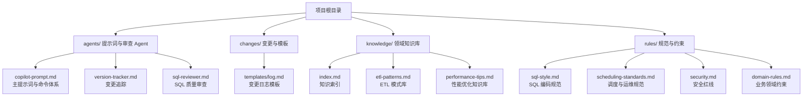
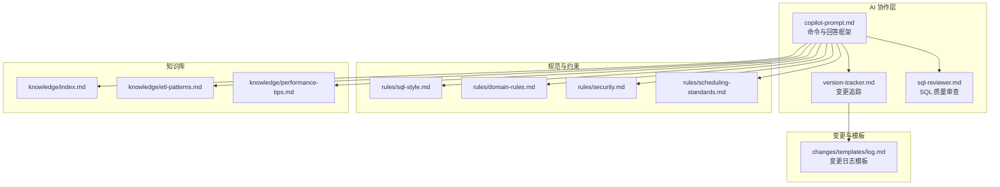
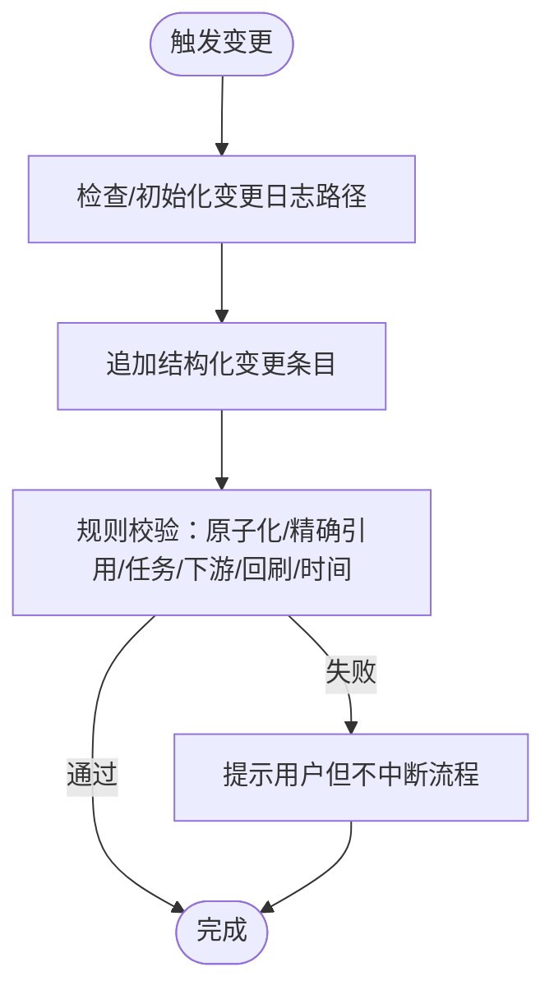
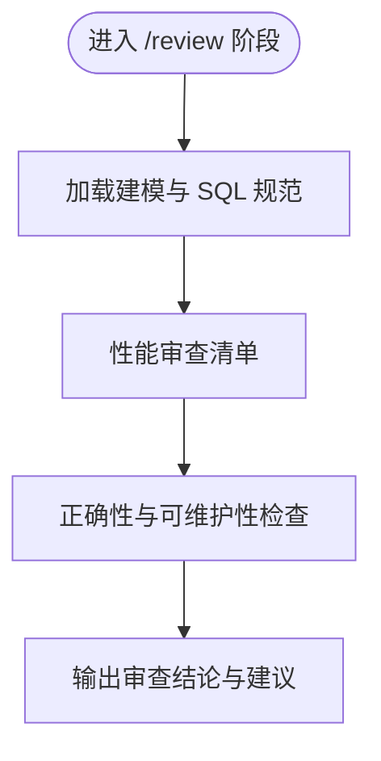
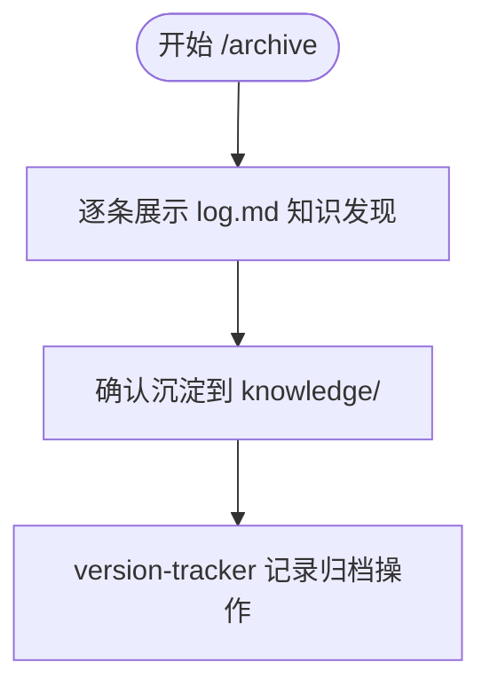
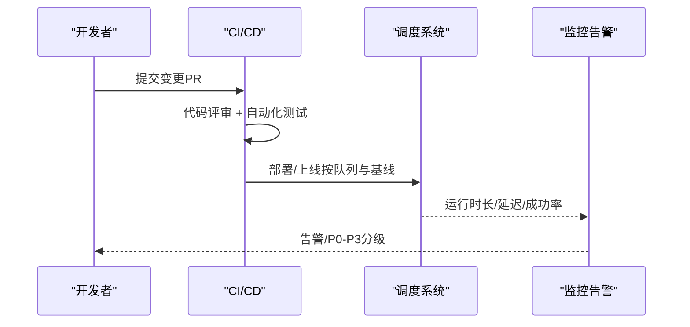
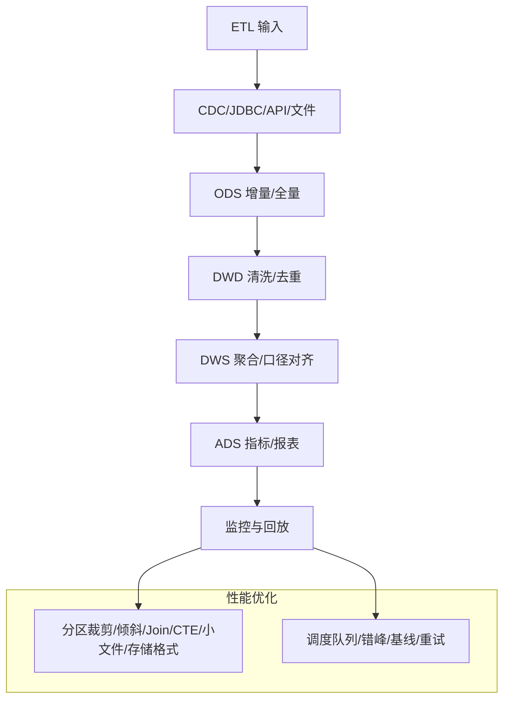
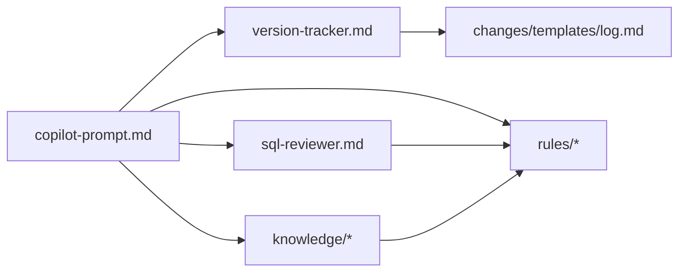
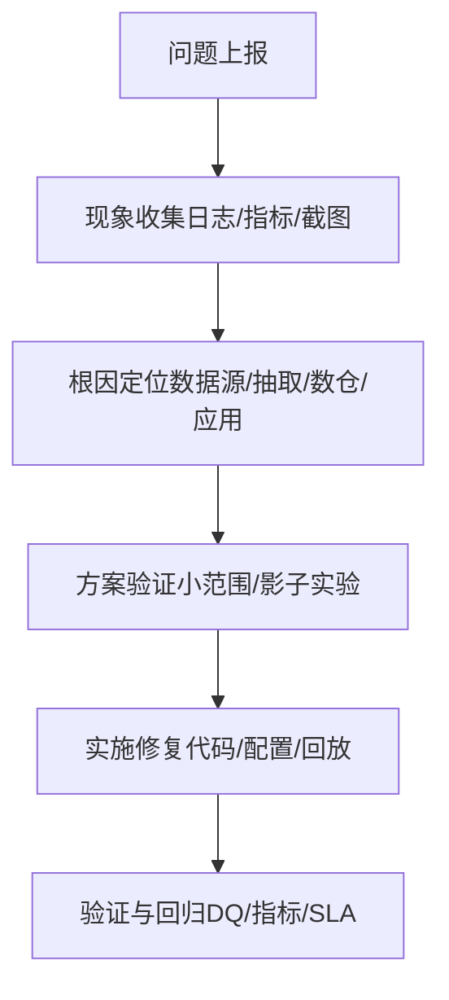

# 自动化部署配置

<cite>
**本文引用的文件**
- [目录结构和设计说明.md](file://目录结构和设计说明.md)
- [copilot-prompt.md](file://agents/copilot-prompt.md)
- [version-tracker.md](file://agents/version-tracker.md)
- [sql-reviewer.md](file://agents/sql-reviewer.md)
- [log.md](file://changes/templates/log.md)
- [index.md](file://knowledge/index.md)
- [sql-style.md](file://rules/sql-style.md)
- [scheduling-standards.md](file://rules/scheduling-standards.md)
- [security.md](file://rules/security.md)
- [domain-rules.md](file://rules/domain-rules.md)
- [etl-patterns.md](file://knowledge/etl-patterns.md)
- [performance-tips.md](file://knowledge/performance-tips.md)
</cite>

## 目录
1. [简介](#简介)
2. [项目结构](#项目结构)
3. [核心组件](#核心组件)
4. [架构总览](#架构总览)
5. [详细组件分析](#详细组件分析)
6. [依赖分析](#依赖分析)
7. [性能考虑](#性能考虑)
8. [故障排查指南](#故障排查指南)
9. [结论](#结论)
10. [附录](#附录)

## 简介
本指南面向数据仓库工程的自动化部署与运维，围绕“规范驱动 + 变更追踪 + 知识沉淀”的工程化方法论，提供从部署脚本、容器化、CI/CD 流水线、环境准备、监控与回滚、故障排查到版本管理与更新流程的系统性实施建议。项目以提示词工程与知识库为核心，强调“先规范、后实施、可审计、可回溯”的工程实践。

## 项目结构
该项目采用“提示词 + 变更模板 + 领域知识 + 规范约束”的分层组织方式，便于在 AI 协作助手环境中加载与执行，支撑自动化部署与变更治理。

图表来源
- [目录结构和设计说明.md:19-55](file://目录结构和设计说明.md#L19-L55)
- [copilot-prompt.md:63-147](file://agents/copilot-prompt.md#L63-L147)
- [version-tracker.md:19-41](file://agents/version-tracker.md#L19-L41)
- [log.md:1-61](file://changes/templates/log.md#L1-L61)
- [index.md:1-60](file://knowledge/index.md#L1-L60)
- [sql-style.md:1-254](file://rules/sql-style.md#L1-L254)
- [scheduling-standards.md:1-233](file://rules/scheduling-standards.md#L1-L233)
- [security.md:1-98](file://rules/security.md#L1-L98)
- [domain-rules.md:1-142](file://rules/domain-rules.md#L1-L142)
- [etl-patterns.md:1-220](file://knowledge/etl-patterns.md#L1-L220)
- [performance-tips.md:1-349](file://knowledge/performance-tips.md#L1-L349)

章节来源
- [目录结构和设计说明.md:19-55](file://目录结构和设计说明.md#L19-L55)

## 核心组件
- 提示词与命令体系：定义 AI 协作的命令映射、回答框架与调试流程，确保部署与变更过程可标准化。
- 变更追踪 Agent：在关键变更完成后自动记录结构化日志，保障可审计与可回溯。
- SQL 质量审查：对 SQL 的正确性、性能与可维护性进行分级审查。
- 变更日志模板：统一记录技术决策、踩坑、知识发现、性能对比与 DQ 验证。
- 规范与约束：SQL 编码规范、调度与运维规范、安全红线、业务领域规则。
- 领域知识库：ETL 模式、性能优化技巧、知识索引，支撑自动化实施与优化。

章节来源
- [copilot-prompt.md:63-147](file://agents/copilot-prompt.md#L63-L147)
- [version-tracker.md:5-16](file://agents/version-tracker.md#L5-L16)
- [sql-reviewer.md:1-68](file://agents/sql-reviewer.md#L1-L68)
- [log.md:1-61](file://changes/templates/log.md#L1-L61)
- [sql-style.md:1-254](file://rules/sql-style.md#L1-L254)
- [scheduling-standards.md:1-233](file://rules/scheduling-standards.md#L1-L233)
- [security.md:1-98](file://rules/security.md#L1-L98)
- [domain-rules.md:1-142](file://rules/domain-rules.md#L1-L142)
- [etl-patterns.md:1-220](file://knowledge/etl-patterns.md#L1-L220)
- [performance-tips.md:1-349](file://knowledge/performance-tips.md#L1-L349)

## 架构总览
下图展示了部署与变更治理的关键交互：AI 提示词驱动任务执行，SQL/ETL/调度/模型变更完成后由变更追踪记录，同时触发质量审查与知识沉淀，形成闭环。

图表来源
- [copilot-prompt.md:63-147](file://agents/copilot-prompt.md#L63-L147)
- [version-tracker.md:5-16](file://agents/version-tracker.md#L5-L16)
- [sql-reviewer.md:1-68](file://agents/sql-reviewer.md#L1-L68)
- [log.md:1-61](file://changes/templates/log.md#L1-L61)
- [sql-style.md:1-254](file://rules/sql-style.md#L1-L254)
- [domain-rules.md:1-142](file://rules/domain-rules.md#L1-L142)
- [security.md:1-98](file://rules/security.md#L1-L98)
- [scheduling-standards.md:1-233](file://rules/scheduling-standards.md#L1-L233)
- [index.md:1-60](file://knowledge/index.md#L1-L60)
- [etl-patterns.md:1-220](file://knowledge/etl-patterns.md#L1-L220)
- [performance-tips.md:1-349](file://knowledge/performance-tips.md#L1-L349)

## 详细组件分析

### 组件 A：变更追踪与审计（version-tracker）
- 触发时机：SQL/ETL/模型/调度/DQ 变更完成、apply 每个任务完成后。
- 记录格式：模块、分层、任务、操作、变更内容、关联文件、回刷范围、下游影响、备注。
- 规则要点：原子化、精确引用、任务可追溯、下游必标注、回刷必声明、时间精确到分钟、不阻塞主流程。

图表来源
- [version-tracker.md:5-16](file://agents/version-tracker.md#L5-L16)
- [version-tracker.md:44-64](file://agents/version-tracker.md#L44-L64)
- [version-tracker.md:80-89](file://agents/version-tracker.md#L80-L89)

章节来源
- [version-tracker.md:5-16](file://agents/version-tracker.md#L5-L16)
- [version-tracker.md:44-64](file://agents/version-tracker.md#L44-L64)
- [version-tracker.md:80-89](file://agents/version-tracker.md#L80-L89)

### 组件 B：SQL 质量审查（sql-reviewer）
- 审查分级：Critical（阻塞）、Important（应修复）、Minor（建议）。
- 性能审查清单：分区裁剪、Join 顺序、Map/Broadcast Join、倾斜风险、CTE 物化等。
- 输出格式：问题定位、影响评估、扫描量预估、优化建议摘要。

图表来源
- [sql-reviewer.md:1-68](file://agents/sql-reviewer.md#L1-L68)

章节来源
- [sql-reviewer.md:1-68](file://agents/sql-reviewer.md#L1-L68)

### 组件 C：变更日志模板（changes/templates/log.md）
- 记录内容：时间线、技术决策、踩坑记录、知识发现、Spec-实现偏差、回刷记录、性能对比、DQ 验证、质量备忘。
- 作用：作为归档与知识沉淀的输入，支撑知识飞轮。

图表来源
- [log.md:1-61](file://changes/templates/log.md#L1-L61)

章节来源
- [log.md:1-61](file://changes/templates/log.md#L1-L61)

### 组件 D：调度与运维规范（scheduling-standards）
- 作业命名与依赖：强依赖（上游分区就绪触发）、弱依赖（事件驱动）。
- SLA 与告警：基线设置、去重与升级策略。
- 资源队列：核心、通用、回刷、探索、实时队列划分。
- 上线流程：代码评审、测试验证、DQ 上线、首跑、回刷、观察期、变更日志。

图表来源
- [scheduling-standards.md:169-186](file://rules/scheduling-standards.md#L169-L186)
- [scheduling-standards.md:188-203](file://rules/scheduling-standards.md#L188-L203)
- [scheduling-standards.md:205-233](file://rules/scheduling-standards.md#L205-L233)

章节来源
- [scheduling-standards.md:1-233](file://rules/scheduling-standards.md#L1-L233)

### 组件 E：ETL 模式与性能优化（etl-patterns、performance-tips）
- ETL 模式：CDC 增量、JDBC 增量、MERGE/UPSERT、小文件控制、历史回刷、文件接入、API 拉取、全量/增量/CDC 选型。
- 性能优化：分区裁剪、倾斜处理、Map/Broadcast Join、小文件合并、CTE 物化、谓词下推、列裁剪、存储格式与压缩、调度与资源、性能分析工具。

图表来源
- [etl-patterns.md:1-220](file://knowledge/etl-patterns.md#L1-L220)
- [performance-tips.md:1-349](file://knowledge/performance-tips.md#L1-L349)

章节来源
- [etl-patterns.md:1-220](file://knowledge/etl-patterns.md#L1-L220)
- [performance-tips.md:1-349](file://knowledge/performance-tips.md#L1-L349)

## 依赖分析
- 组件耦合与内聚：提示词驱动各组件协同，变更追踪贯穿关键节点，质量审查与规范约束共同保障正确性与可维护性。
- 外部依赖与集成点：调度系统（Airflow/DolphinScheduler）、存储格式（ORC/Parquet/Iceberg/Hudi）、监控告警平台、密钥管理服务。
- 潜在循环依赖：本项目以模板/规则/知识库为输入，通过提示词驱动执行，未见直接循环依赖迹象。

图表来源
- [copilot-prompt.md:63-147](file://agents/copilot-prompt.md#L63-L147)
- [version-tracker.md:5-16](file://agents/version-tracker.md#L5-L16)
- [sql-reviewer.md:1-68](file://agents/sql-reviewer.md#L1-L68)
- [log.md:1-61](file://changes/templates/log.md#L1-L61)
- [sql-style.md:1-254](file://rules/sql-style.md#L1-L254)
- [scheduling-standards.md:1-233](file://rules/scheduling-standards.md#L1-L233)
- [security.md:1-98](file://rules/security.md#L1-L98)
- [domain-rules.md:1-142](file://rules/domain-rules.md#L1-L142)
- [index.md:1-60](file://knowledge/index.md#L1-L60)
- [etl-patterns.md:1-220](file://knowledge/etl-patterns.md#L1-L220)
- [performance-tips.md:1-349](file://knowledge/performance-tips.md#L1-L349)

章节来源
- [copilot-prompt.md:63-147](file://agents/copilot-prompt.md#L63-L147)
- [version-tracker.md:5-16](file://agents/version-tracker.md#L5-L16)
- [sql-reviewer.md:1-68](file://agents/sql-reviewer.md#L1-L68)
- [log.md:1-61](file://changes/templates/log.md#L1-L61)
- [sql-style.md:1-254](file://rules/sql-style.md#L1-L254)
- [scheduling-standards.md:1-233](file://rules/scheduling-standards.md#L1-L233)
- [security.md:1-98](file://rules/security.md#L1-L98)
- [domain-rules.md:1-142](file://rules/domain-rules.md#L1-L142)
- [index.md:1-60](file://knowledge/index.md#L1-L60)
- [etl-patterns.md:1-220](file://knowledge/etl-patterns.md#L1-L220)
- [performance-tips.md:1-349](file://knowledge/performance-tips.md#L1-L349)

## 性能考虑
- 分区裁剪与谓词下推：确保 WHERE 条件直接命中分区字段，避免函数包裹；将过滤条件置于可下推位置。
- Join 与倾斜：优先小表广播/Map Join；对倾斜键进行过滤/加盐打散/二次聚合。
- CTE 与物化：复杂 CTE 先落临时表或显式物化；避免重复计算。
- 小文件控制：合理设置 reduce 数、使用 DISTRIBUTE BY、启用 AQE 合并；周期性合并文件。
- 存储格式与压缩：优先 ORC/Parquet + ZSTD；列裁剪与统计信息提升查询性能。
- 调度与资源：按主题划分队列、错峰调度、SLA 基线、指数退避重试。

章节来源
- [performance-tips.md:5-35](file://knowledge/performance-tips.md#L5-L35)
- [performance-tips.md:42-99](file://knowledge/performance-tips.md#L42-L99)
- [performance-tips.md:101-135](file://knowledge/performance-tips.md#L101-L135)
- [performance-tips.md:138-165](file://knowledge/performance-tips.md#L138-L165)
- [performance-tips.md:167-193](file://knowledge/performance-tips.md#L167-L193)
- [performance-tips.md:196-229](file://knowledge/performance-tips.md#L196-L229)
- [performance-tips.md:232-256](file://knowledge/performance-tips.md#L232-L256)
- [performance-tips.md:259-283](file://knowledge/performance-tips.md#L259-L283)
- [performance-tips.md:286-305](file://knowledge/performance-tips.md#L286-L305)
- [performance-tips.md:308-325](file://knowledge/performance-tips.md#L308-L325)
- [performance-tips.md:327-349](file://knowledge/performance-tips.md#L327-L349)

## 故障排查指南
- 现象收集 → 根因定位 → 方案验证 → 实施修复：按诊断层级从数据源层到应用层逐步排查。
- 常见问题：
  - 分区裁剪失效：检查 WHERE 条件是否包裹分区字段。
  - 数据倾斜：识别热点键，采用过滤/加盐/小表广播。
  - 小文件爆炸：控制 reduce 数、启用合并、周期性 concat/rewrite。
  - DQ 失败：依据五大维度（完整性/唯一性/一致性/准确性/时效性）定位规则与数据源。
  - 回放与回退：按回退脚本伪代码冻结下游、回滚到上一版本、回刷分区、验证后解冻。

图表来源
- [copilot-prompt.md:133-147](file://agents/copilot-prompt.md#L133-L147)
- [scheduling-standards.md:205-233](file://rules/scheduling-standards.md#L205-L233)

章节来源
- [copilot-prompt.md:133-147](file://agents/copilot-prompt.md#L133-L147)
- [scheduling-standards.md:205-233](file://rules/scheduling-standards.md#L205-L233)

## 结论
本项目通过提示词工程与知识库驱动的规范与流程，为自动化部署提供了可复用的模板与最佳实践。结合变更追踪、质量审查与调度规范，能够有效保障部署质量、可审计性与可回溯性。建议在实际落地中配套 CI/CD 流水线、监控告警与密钥管理，持续沉淀知识并迭代优化。

## 附录
- 部署脚本编写与维护
  - 以规范为依据：命名、分区、幂等写入、头部注释、变量约定。
  - 以模板为载体：变更日志模板、SQL/ETL/调度脚本模板。
  - 以审查为保障：SQL 质量审查、上线流程与 DQ 规则同步上线。
- 容器化部署配置与优化
  - 镜像层：最小化基础镜像、按需安装依赖、缓存优化。
  - 运行时：资源限制与队列隔离、时区与环境变量、密钥注入。
  - 存储：分区字段与格式选择、小文件合并策略、统计信息更新。
- CI/CD 流水线配置示例与最佳实践
  - 触发：PR/分支推送/定时任务。
  - 步骤：代码评审、单元/集成测试、DQ 校验、打包/镜像构建、部署、回放/回滚。
  - 最佳实践：幂等部署、灰度发布、SLA 基线、告警分级、失败重试与去重。
- 部署环境准备与环境变量配置
  - 环境：开发/测试/生产隔离、资源队列、调度系统、监控平台。
  - 变量：${bizdate}/${bizdate_minus_1} 等调度变量、密钥管理服务、时区与编码。
- 监控与回滚机制
  - 监控：成功率、运行时长、数据延迟、DQ 通过率、资源消耗趋势。
  - 回滚：冻结下游、回滚到上一版本、回刷受影响分区、验证后解冻。
- 故障排查与性能优化实用技巧
  - EXPLAIN 执行计划、作业历史与 Profile、数据采样与统计信息。
  - 性能优化：分区裁剪、倾斜处理、Join 顺序与类型、CTE 物化、小文件合并、存储格式与压缩。
- 部署文档的版本管理与更新流程
  - 版本管理：变更日志模板记录版本与影响范围，配合 Git 提交与标签。
  - 更新流程：变更提案 → 实施 → 审查 → 归档 → 知识沉淀 → 版本追踪。

章节来源
- [sql-style.md:142-155](file://rules/sql-style.md#L142-L155)
- [sql-style.md:165-201](file://rules/sql-style.md#L165-L201)
- [scheduling-standards.md:137-167](file://rules/scheduling-standards.md#L137-L167)
- [scheduling-standards.md:169-186](file://rules/scheduling-standards.md#L169-L186)
- [scheduling-standards.md:188-203](file://rules/scheduling-standards.md#L188-L203)
- [scheduling-standards.md:205-233](file://rules/scheduling-standards.md#L205-L233)
- [log.md:1-61](file://changes/templates/log.md#L1-L61)
- [performance-tips.md:327-349](file://knowledge/performance-tips.md#L327-L349)