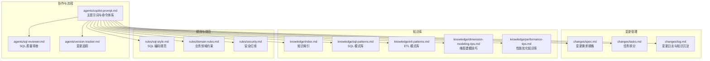
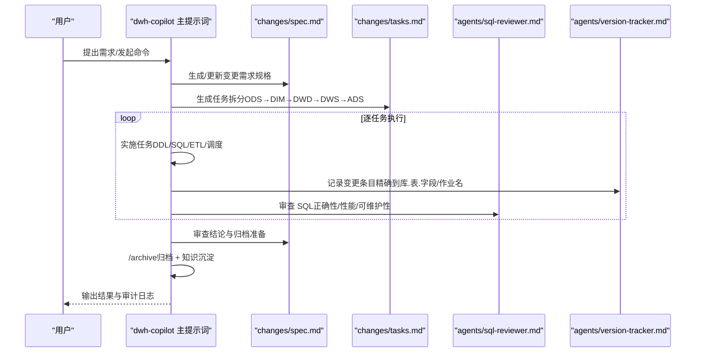
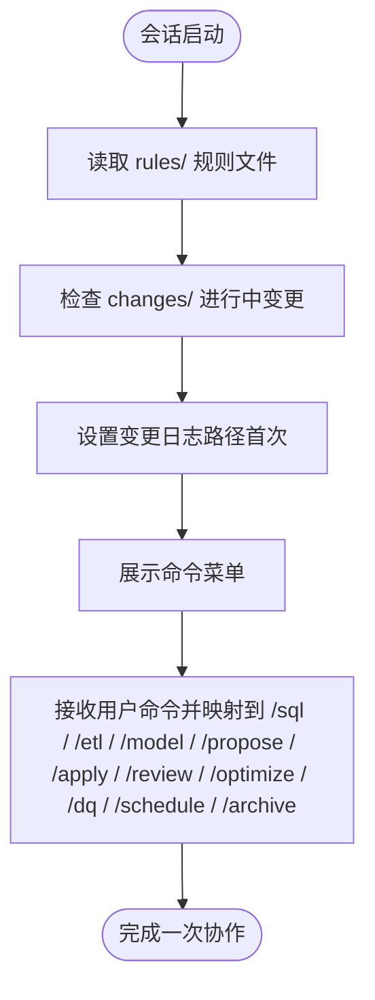
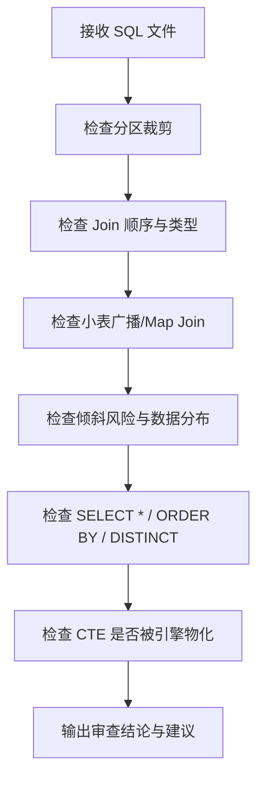
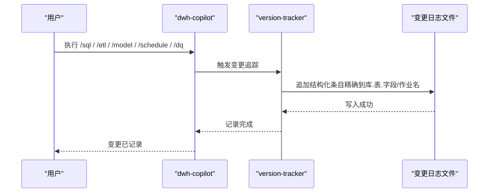
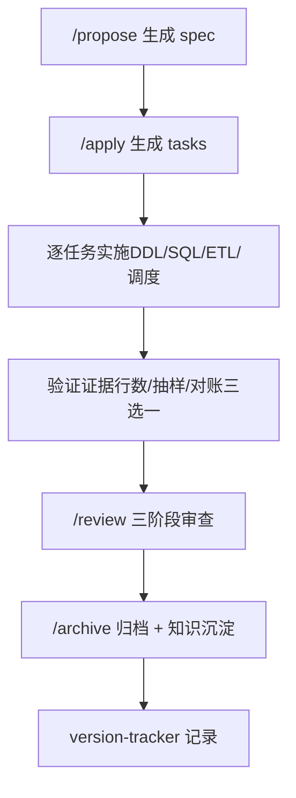
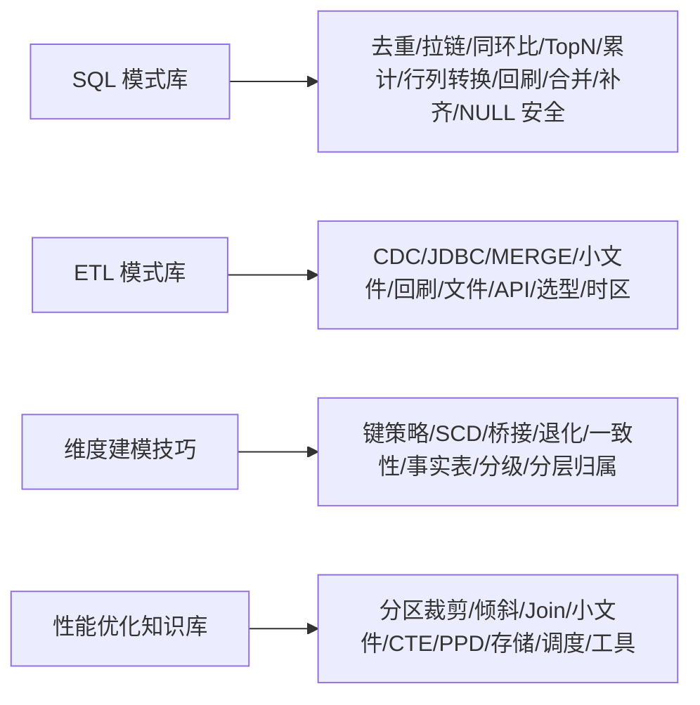
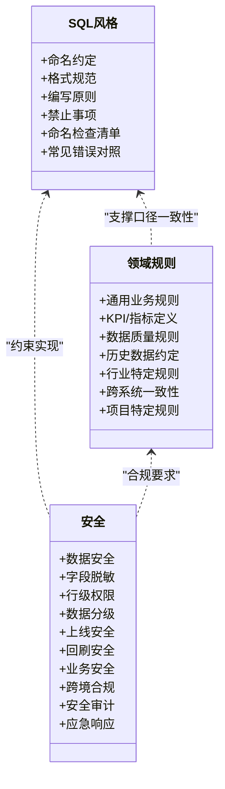
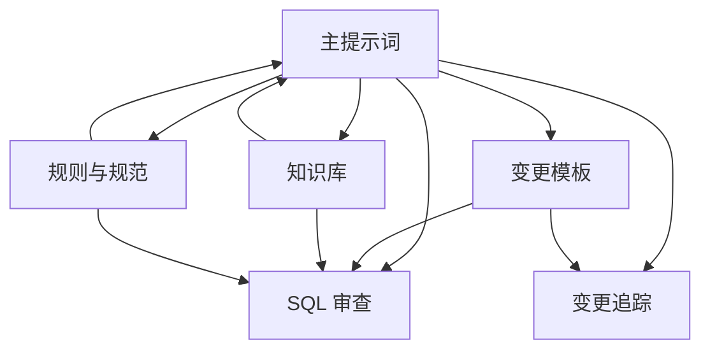
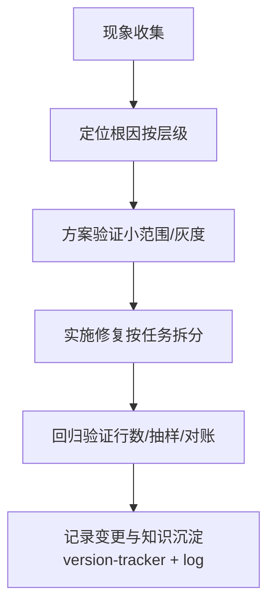

# 最佳实践指南

<cite>
**本文引用的文件**
- [目录结构和设计说明.md](file://目录结构和设计说明.md)
- [copilot-prompt.md](file://agents/copilot-prompt.md)
- [sql-reviewer.md](file://agents/sql-reviewer.md)
- [version-tracker.md](file://agents/version-tracker.md)
- [spec.md](file://changes/templates/spec.md)
- [tasks.md](file://changes/templates/tasks.md)
- [log.md](file://changes/templates/log.md)
- [index.md](file://knowledge/index.md)
- [sql-patterns.md](file://knowledge/sql-patterns.md)
- [etl-patterns.md](file://knowledge/etl-patterns.md)
- [dimension-modeling-tips.md](file://knowledge/dimension-modeling-tips.md)
- [performance-tips.md](file://knowledge/performance-tips.md)
- [domain-rules.md](file://rules/domain-rules.md)
- [security.md](file://rules/security.md)
- [sql-style.md](file://rules/sql-style.md)
</cite>

## 目录
1. [简介](#简介)
2. [项目结构](#项目结构)
3. [核心组件](#核心组件)
4. [架构总览](#架构总览)
5. [详细组件分析](#详细组件分析)
6. [依赖分析](#依赖分析)
7. [性能考虑](#性能考虑)
8. [故障排查指南](#故障排查指南)
9. [结论](#结论)
10. [附录](#附录)

## 简介
本指南面向数据仓库（Data Warehouse）开发场景，围绕“Spec 驱动 + 三段式知识库 + 强制变更追踪”的工程化方法论，总结常见问题的解决方案与经验教训，提供性能优化、代码质量保证、团队协作规范、问题排查与调试方法，以及新技术趋势与行业最佳实践的参考。目标是帮助团队在复杂的数据工程场景中，建立可审计、可复用、可演进的数仓工程能力。

## 项目结构
项目采用“Agent + 变更模板 + 知识库 + 规则”的分层组织方式：
- agents：AI 协作角色与审查流程（主提示词、SQL 质量审查、版本追踪）
- changes：变更管理（spec、tasks、log、validation-spec 模板）
- knowledge：领域知识库（SQL 模式、ETL 模式、维度建模、性能优化）
- rules：项目约束与规范（SQL 风格、领域规则、安全、调度与运维）

**图表来源**
- [目录结构和设计说明.md:19-55](file://目录结构和设计说明.md#L19-L55)
- [copilot-prompt.md:63-147](file://agents/copilot-prompt.md#L63-L147)
- [spec.md:1-132](file://changes/templates/spec.md#L1-L132)
- [tasks.md:1-74](file://changes/templates/tasks.md#L1-L74)
- [log.md:1-61](file://changes/templates/log.md#L1-L61)
- [index.md:1-60](file://knowledge/index.md#L1-L60)
- [sql-patterns.md:1-331](file://knowledge/sql-patterns.md#L1-L331)
- [etl-patterns.md:1-220](file://knowledge/etl-patterns.md#L1-L220)
- [dimension-modeling-tips.md:1-253](file://knowledge/dimension-modeling-tips.md#L1-L253)
- [performance-tips.md:1-349](file://knowledge/performance-tips.md#L1-L349)
- [sql-style.md:1-254](file://rules/sql-style.md#L1-L254)
- [domain-rules.md:1-142](file://rules/domain-rules.md#L1-L142)
- [security.md:1-98](file://rules/security.md#L1-L98)

**章节来源**
- [目录结构和设计说明.md:1-204](file://目录结构和设计说明.md#L1-L204)

## 核心组件
- 主提示词与命令体系：定义 AI 协作的“Spec 驱动”原则、身份与回答框架、命令映射与启动流程，确保每次交互可审计、可复用。
- SQL 质量审查：对 SQL 的正确性、性能与可维护性进行分级审查，提供可执行的检查清单与输出格式。
- 变更追踪：在 DDL/SQL/ETL/调度等关键变更后自动记录结构化日志，确保可审计、可回溯。
- 变更模板：spec（需求规格）、tasks（任务拆分）、log（变更日志与知识沉淀）构成“需求 → 规划 → 实施 → 审查 → 归档”的闭环。
- 知识库：SQL 模式、ETL 模式、维度建模、性能优化等经验沉淀，形成“实践 → 发现 → 沉淀 → 复用”的知识飞轮。
- 规则与规范：SQL 风格、领域规则、安全红线等强制约束，保障一致性与合规性。

**章节来源**
- [copilot-prompt.md:1-147](file://agents/copilot-prompt.md#L1-L147)
- [sql-reviewer.md:1-68](file://agents/sql-reviewer.md#L1-L68)
- [version-tracker.md:1-120](file://agents/version-tracker.md#L1-L120)
- [spec.md:1-132](file://changes/templates/spec.md#L1-L132)
- [tasks.md:1-74](file://changes/templates/tasks.md#L1-L74)
- [log.md:1-61](file://changes/templates/log.md#L1-L61)
- [index.md:1-60](file://knowledge/index.md#L1-L60)
- [sql-patterns.md:1-331](file://knowledge/sql-patterns.md#L1-L331)
- [etl-patterns.md:1-220](file://knowledge/etl-patterns.md#L1-L220)
- [dimension-modeling-tips.md:1-253](file://knowledge/dimension-modeling-tips.md#L1-L253)
- [performance-tips.md:1-349](file://knowledge/performance-tips.md#L1-L349)
- [sql-style.md:1-254](file://rules/sql-style.md#L1-L254)
- [domain-rules.md:1-142](file://rules/domain-rules.md#L1-L142)
- [security.md:1-98](file://rules/security.md#L1-L98)

## 架构总览
下图展示了从“需求提出”到“归档沉淀”的端到端流程，以及各组件之间的交互关系：

**图表来源**
- [copilot-prompt.md:63-147](file://agents/copilot-prompt.md#L63-L147)
- [spec.md:1-132](file://changes/templates/spec.md#L1-L132)
- [tasks.md:1-74](file://changes/templates/tasks.md#L1-L74)
- [sql-reviewer.md:1-68](file://agents/sql-reviewer.md#L1-L68)
- [version-tracker.md:1-120](file://agents/version-tracker.md#L1-L120)

## 详细组件分析

### 组件 A：主提示词与命令体系
- 核心原则：Spec 驱动、现状必须有出处、变更即记录。
- 回答框架：问题理解 → 现状分析 → 方案设计 → 具体实现 → 验证方法 → 性能与成本考量 → 注意事项。
- 命令体系：/init、/sql、/etl、/model、/propose、/apply、/review、/optimize、/dq、/schedule、/archive。
- 启动流程：读取 rules/、检查 changes/ 进行中的变更、设置变更日志路径、展示命令菜单。

**图表来源**
- [copilot-prompt.md:55-62](file://agents/copilot-prompt.md#L55-L62)
- [copilot-prompt.md:63-147](file://agents/copilot-prompt.md#L63-L147)

**章节来源**
- [copilot-prompt.md:1-147](file://agents/copilot-prompt.md#L1-L147)

### 组件 B：SQL 质量审查
- 审查分级：Critical（阻断）、Important（应修复）、Minor（建议）。
- 性能审查清单：分区裁剪、Join 顺序与类型、Map/Broadcast Join、倾斜风险、CTE 物化、SELECT *、ORDER BY、DISTINCT 与 GROUP BY 等。
- 输出格式：明确指出问题定位、影响范围、预估影响与优化建议。

**图表来源**
- [sql-reviewer.md:31-64](file://agents/sql-reviewer.md#L31-L64)

**章节来源**
- [sql-reviewer.md:1-68](file://agents/sql-reviewer.md#L1-L68)

### 组件 C：变更追踪（Version Tracker）
- 触发时机：/sql、/etl、/model、/schedule、/dq 产出新规则、/apply 每个任务完成后、用户手动记录。
- 记录格式：模块、分层、任务、操作、变更内容、关联文件、回刷范围、影响下游、备注。
- 记录规则：原子化、精确引用、任务可追溯、下游必标注、回刷必声明、时间精确到分钟、不阻塞主流程。

**图表来源**
- [version-tracker.md:5-16](file://agents/version-tracker.md#L5-L16)
- [version-tracker.md:44-64](file://agents/version-tracker.md#L44-L64)
- [version-tracker.md:80-89](file://agents/version-tracker.md#L80-L89)

**章节来源**
- [version-tracker.md:1-120](file://agents/version-tracker.md#L1-L120)

### 组件 D：变更模板（Spec/Tasks/Log）
- spec：背景与目标、现状分析、功能点、业务规则与口径、模型变更（DDL）、SQL 加工设计、ETL/同步变更、调度变更、数据质量规则、影响范围、风险与关注点、验证策略、待澄清、技术决策、执行日志、审查结论、确认记录。
- tasks：按 ODS→DIM→DWD→DWS→ADS 顺序拆分，每个任务原子化、可独立验证、精确到对象名称与依赖。
- log：时间线、技术决策、踩坑记录、知识发现、Spec-实现偏差、回刷记录、性能对比、DQ 验证、质量备忘。

**图表来源**
- [spec.md:1-132](file://changes/templates/spec.md#L1-L132)
- [tasks.md:1-74](file://changes/templates/tasks.md#L1-L74)
- [log.md:1-61](file://changes/templates/log.md#L1-L61)

**章节来源**
- [spec.md:1-132](file://changes/templates/spec.md#L1-L132)
- [tasks.md:1-74](file://changes/templates/tasks.md#L1-L74)
- [log.md:1-61](file://changes/templates/log.md#L1-L61)

### 组件 E：知识库（SQL 模式、ETL 模式、维度建模、性能优化）
- SQL 模式：去重保留最新、拉链表（SCD2）、同环比、TopN、累计求和、行转列/列转行、回刷幂等覆盖、Lambda 合并、缺失日期补齐、NULL 安全比较。
- ETL 模式：CDC 增量同步、JDBC 增量抽取、MERGE/UPSERT、小文件控制、历史回刷、文件接入、API 拉取、全量/增量/CDC 选型、时区与数据漂移。
- 维度建模：代理键 vs 业务键、SCD 三种类型、桥接表、退化维度、一致性维度、事实表类型、维度表分级、分层归属判定。
- 性能优化：分区裁剪、数据倾斜、Map Join/Broadcast Join、小文件、CTE 物化、谓词下推与列裁剪、Join 顺序与类型、窗口函数、存储格式与压缩、调度与资源、性能分析工具。

**图表来源**
- [sql-patterns.md:1-331](file://knowledge/sql-patterns.md#L1-L331)
- [etl-patterns.md:1-220](file://knowledge/etl-patterns.md#L1-L220)
- [dimension-modeling-tips.md:1-253](file://knowledge/dimension-modeling-tips.md#L1-L253)
- [performance-tips.md:1-349](file://knowledge/performance-tips.md#L1-L349)

**章节来源**
- [index.md:1-60](file://knowledge/index.md#L1-L60)
- [sql-patterns.md:1-331](file://knowledge/sql-patterns.md#L1-L331)
- [etl-patterns.md:1-220](file://knowledge/etl-patterns.md#L1-L220)
- [dimension-modeling-tips.md:1-253](file://knowledge/dimension-modeling-tips.md#L1-L253)
- [performance-tips.md:1-349](file://knowledge/performance-tips.md#L1-L349)

### 组件 F：规则与规范（SQL 风格、领域规则、安全）
- SQL 风格：命名约定（库/表/字段/分区）、格式规范（关键字大小写、缩进与换行、头部注释）、编写原则（性能优先/正确性优先/可维护性）、禁止事项、命名检查清单、常见错误对照。
- 领域规则：通用业务规则（金额/百分比/时间/排名）、KPI/指标定义标准、数据质量五大维度、历史数据约定、行业特定规则、跨系统口径一致性、项目特定规则。
- 安全：数据安全红线、字段级脱敏标准、行级权限（RLS）、数据分级与访问控制、上线与发布安全、数据回刷安全、业务安全、跨境合规、安全审计、应急响应。

**图表来源**
- [sql-style.md:1-254](file://rules/sql-style.md#L1-L254)
- [domain-rules.md:1-142](file://rules/domain-rules.md#L1-L142)
- [security.md:1-98](file://rules/security.md#L1-L98)

**章节来源**
- [sql-style.md:1-254](file://rules/sql-style.md#L1-L254)
- [domain-rules.md:1-142](file://rules/domain-rules.md#L1-L142)
- [security.md:1-98](file://rules/security.md#L1-L98)

## 依赖分析
- 组件耦合与内聚：主提示词驱动所有流程，SQL 审查与变更追踪作为质量门禁与审计保障，模板与知识库提供可复用的经验与规范。
- 直接与间接依赖：知识库为 SQL/ETL/建模提供模式与最佳实践；规则为 SQL 风格与安全提供强制约束；变更追踪贯穿实施全过程，确保可审计。
- 外部依赖与集成点：调度系统（Azkaban/DolphinScheduler/MC）、数据湖/数据仓库引擎（Hive/Spark/Flink/MaxCompute）、密钥管理服务（KMS/Vault）、数据血缘平台（DataHub/OpenMetadata）。

**图表来源**
- [copilot-prompt.md:63-147](file://agents/copilot-prompt.md#L63-L147)
- [sql-reviewer.md:1-68](file://agents/sql-reviewer.md#L1-L68)
- [version-tracker.md:1-120](file://agents/version-tracker.md#L1-L120)
- [spec.md:1-132](file://changes/templates/spec.md#L1-L132)
- [tasks.md:1-74](file://changes/templates/tasks.md#L1-L74)
- [log.md:1-61](file://changes/templates/log.md#L1-L61)
- [sql-style.md:1-254](file://rules/sql-style.md#L1-L254)
- [domain-rules.md:1-142](file://rules/domain-rules.md#L1-L142)
- [security.md:1-98](file://rules/security.md#L1-L98)
- [sql-patterns.md:1-331](file://knowledge/sql-patterns.md#L1-L331)
- [etl-patterns.md:1-220](file://knowledge/etl-patterns.md#L1-L220)
- [dimension-modeling-tips.md:1-253](file://knowledge/dimension-modeling-tips.md#L1-L253)
- [performance-tips.md:1-349](file://knowledge/performance-tips.md#L1-L349)

**章节来源**
- [目录结构和设计说明.md:196-204](file://目录结构和设计说明.md#L196-L204)

## 性能考虑
- 分区裁剪：WHERE 条件直接命中分区字段，避免函数包裹；验证执行计划中的 PartitionFilters。
- 数据倾斜：识别热点键与默认值，采用过滤/单独处理、加盐打散、Map Join 等策略；结合配置项（Hive/Spark）启用自适应倾斜处理。
- Join 与广播：小表广播（Map Join/Broadcast Join）降低 Shuffle；按引擎选择 Join 类型与顺序；分桶 Join 跳过 Shuffle。
- 小文件：控制 reduce 数、DISTRIBUTE BY、AQE 合并、周期性合并；设定单文件与单分区文件数阈值。
- CTE 物化：在 Hive/Spark 中谨慎假设 WITH 被物化，必要时临时表或 CACHE；注意内存占用。
- 谓词下推与列裁剪：WHERE 下推到数据源层，SELECT 明列字段；避免 UDF 导致下推失效。
- 窗口函数：合理 PARTITION BY 列基数，配合 DISTRIBUTE BY/SORT BY；避免全局排序。
- 存储格式与压缩：优先 ORC/Parquet + ZSTD；列存格式在列裁剪与统计信息下收益显著。
- 调度与资源：按主题/优先级划分队列，错峰调度，SLA 基线，失败重试与回放策略。

**章节来源**
- [performance-tips.md:5-349](file://knowledge/performance-tips.md#L5-L349)

## 故障排查指南
- 调试流程：现象收集 → 根因定位 → 方案验证 → 实施修复。
- 诊断层级：数据源层（结构/迟到/重复/事务边界）→ 抽取层（同步/增量字段单调性/CDC binlog）→ ODS（落表行数/分区/字段类型）→ DWD（业务过程/维度退化/清洗规则）→ DWS（聚合粒度/口径/膨胀）→ ADS（指标计算/空值/零值/异常值）→ 应用层（BI/API 二次聚合/时区/币种）。

**图表来源**
- [copilot-prompt.md:133-146](file://agents/copilot-prompt.md#L133-L146)
- [version-tracker.md:5-16](file://agents/version-tracker.md#L5-L16)
- [log.md:1-61](file://changes/templates/log.md#L1-L61)

**章节来源**
- [copilot-prompt.md:133-146](file://agents/copilot-prompt.md#L133-L146)
- [version-tracker.md:5-16](file://agents/version-tracker.md#L5-L16)
- [log.md:1-61](file://changes/templates/log.md#L1-L61)

## 结论
本指南以“Spec 驱动 + 三段式知识库 + 强制变更追踪”为核心，结合 SQL 模式、ETL 模式、维度建模与性能优化知识，以及严格的规则与安全规范，构建了可审计、可复用、可演进的数据仓库工程方法论。通过标准化的变更模板与审查流程，团队可以在复杂场景中快速交付高质量的数据能力，同时沉淀经验、规避风险、提升效率。

## 附录
- 新技术趋势与扩展点：实时数仓（Flink）、湖仓一体（Iceberg/Hudi/Delta）、云数仓成本优化、dbt/SQLMesh 集成、数据血缘平台集成。
- 团队协作规范与沟通机制：明确责任人、跨系统一致性、变更门禁（Spec 合规 → 模型质量 → SQL 质量）、上线与发布安全、应急响应流程。

**章节来源**
- [目录结构和设计说明.md:196-204](file://目录结构和设计说明.md#L196-L204)