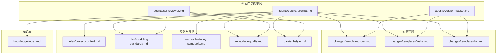
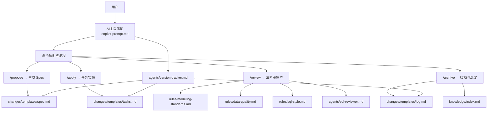
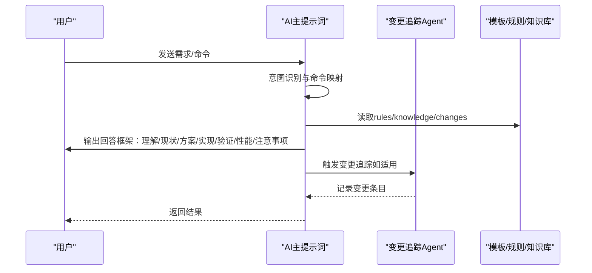
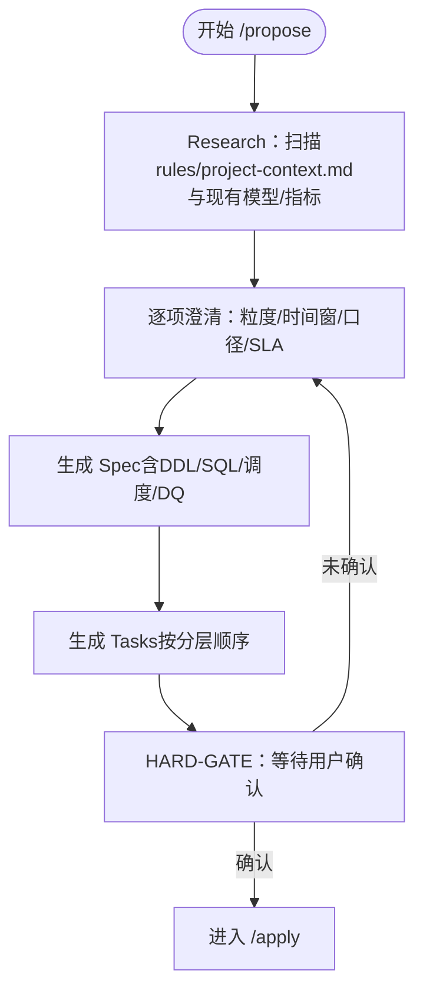
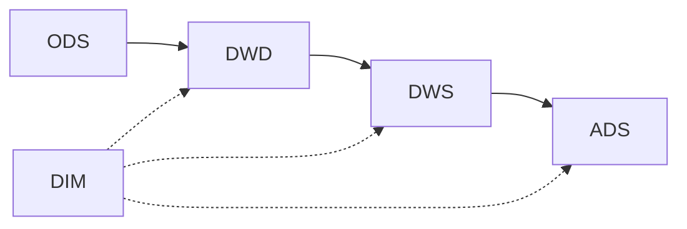
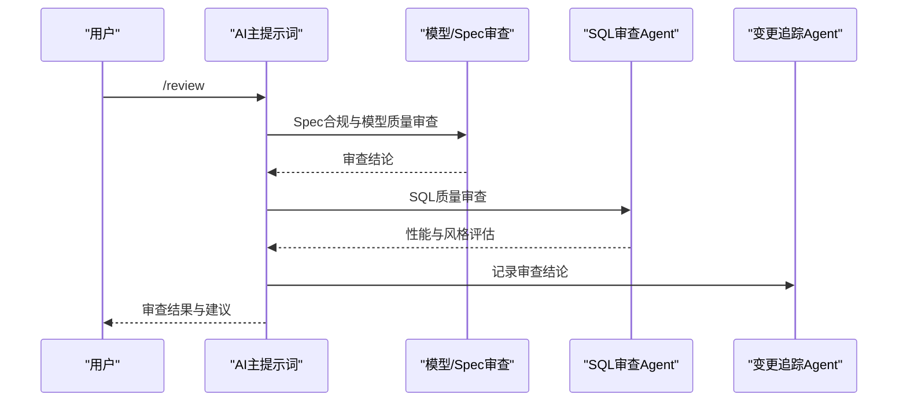
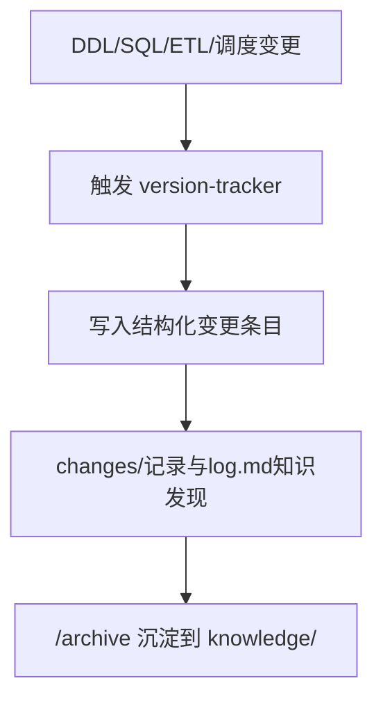
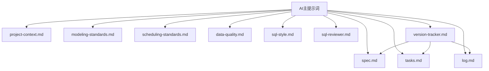

# Spec驱动开发模式

<cite>
**本文引用的文件**
- [目录结构和设计说明.md](file://目录结构和设计说明.md)
- [copilot-prompt.md](file://agents/copilot-prompt.md)
- [sql-reviewer.md](file://agents/sql-reviewer.md)
- [version-tracker.md](file://agents/version-tracker.md)
- [spec.md](file://changes/templates/spec.md)
- [tasks.md](file://changes/templates/tasks.md)
- [log.md](file://changes/templates/log.md)
- [project-context.md](file://rules/project-context.md)
- [modeling-standards.md](file://rules/modeling-standards.md)
- [scheduling-standards.md](file://rules/scheduling-standards.md)
- [data-quality.md](file://rules/data-quality.md)
- [sql-style.md](file://rules/sql-style.md)
- [index.md](file://knowledge/index.md)
</cite>

## 目录
1. [简介](#简介)
2. [项目结构](#项目结构)
3. [核心组件](#核心组件)
4. [架构总览](#架构总览)
5. [详细组件分析](#详细组件分析)
6. [依赖分析](#依赖分析)
7. [性能考虑](#性能考虑)
8. [故障排查指南](#故障排查指南)
9. [结论](#结论)
10. [附录](#附录)

## 简介
本文件面向数据仓库工程团队，系统化阐述“Spec驱动开发模式”的完整流程与机制。该模式以“需求→Spec→任务→实施→审查→归档”为主线，强调：
- Spec是核心资产，一切实现必须以Spec为准
- 三段式知识库：rules（约束）、knowledge（经验）、changes（过程）
- 强制变更追踪，确保可审计、可回溯
- 数仓分层架构下的任务依赖与执行顺序
- 三阶段审查（Spec合规→模型质量→SQL质量）的质量保证机制

## 项目结构
该项目采用“提示词工程 + 变更模板 + 规则与知识库”的组织方式，围绕AI协作助手dwh-copilot构建工程化流程。

图表来源
- [目录结构和设计说明.md: 19-55:19-55](file://目录结构和设计说明.md#L19-L55)
- [目录结构和设计说明.md: 109-123:109-123](file://目录结构和设计说明.md#L109-L123)

章节来源
- [目录结构和设计说明.md: 19-55:19-55](file://目录结构和设计说明.md#L19-L55)
- [目录结构和设计说明.md: 109-123:109-123](file://目录结构和设计说明.md#L109-L123)

## 核心组件
- AI主提示词与命令体系：定义角色、法则、命令映射与协作框架
- 三阶段审查Agent：SQL质量审查，结合性能与风格规范
- 变更追踪Agent：在DDL/SQL/ETL/调度变更后自动记录结构化日志
- 变更模板：Spec、任务拆分、变更日志模板
- 规则与规范：项目上下文、建模分层、调度运维、数据质量、SQL风格
- 知识库：SQL模式、ETL模式、维度建模技巧、性能优化经验

章节来源
- [copilot-prompt.md: 1-147:1-147](file://agents/copilot-prompt.md#L1-L147)
- [sql-reviewer.md: 1-68:1-68](file://agents/sql-reviewer.md#L1-L68)
- [version-tracker.md: 1-120:1-120](file://agents/version-tracker.md#L1-L120)
- [spec.md: 1-132:1-132](file://changes/templates/spec.md#L1-L132)
- [tasks.md: 1-74:1-74](file://changes/templates/tasks.md#L1-L74)
- [log.md: 1-61:1-61](file://changes/templates/log.md#L1-L61)
- [project-context.md: 1-104:1-104](file://rules/project-context.md#L1-L104)
- [modeling-standards.md: 1-242:1-242](file://rules/modeling-standards.md#L1-L242)
- [scheduling-standards.md: 1-233:1-233](file://rules/scheduling-standards.md#L1-L233)
- [data-quality.md: 1-195:1-195](file://rules/data-quality.md#L1-L195)
- [sql-style.md: 1-254:1-254](file://rules/sql-style.md#L1-L254)
- [index.md: 1-60:1-60](file://knowledge/index.md#L1-L60)

## 架构总览
Spec驱动开发模式的系统架构围绕“命令驱动 + 模板化流程 + 强制审查 + 变更追踪”展开，确保从需求到交付的全过程可审计、可回溯、可复用。

图表来源
- [目录结构和设计说明.md: 126-166:126-166](file://目录结构和设计说明.md#L126-L166)
- [copilot-prompt.md: 63-131:63-131](file://agents/copilot-prompt.md#L63-L131)
- [version-tracker.md: 5-15:5-15](file://agents/version-tracker.md#L5-L15)

## 详细组件分析

### 组件A：AI主提示词与命令体系
- 角色与法则：强调Spec驱动、No Spec, No Change、Spec is Truth、Reverse Sync、现状必须有出处、变更即记录
- 回答框架：问题理解→现状分析→方案设计→具体实现→验证方法→性能与成本考量→注意事项
- 命令体系：/init、/sql、/etl、/model、/propose、/apply、/review、/optimize、/dq、/schedule、/archive
- 启动流程：读取rules、检查changes、检查变更日志路径、报告状态与命令菜单

图表来源
- [copilot-prompt.md: 23-53:23-53](file://agents/copilot-prompt.md#L23-L53)
- [copilot-prompt.md: 63-131:63-131](file://agents/copilot-prompt.md#L63-L131)
- [version-tracker.md: 5-15:5-15](file://agents/version-tracker.md#L5-L15)

章节来源
- [copilot-prompt.md: 1-147:1-147](file://agents/copilot-prompt.md#L1-L147)

### 组件B：Spec文档模板与生成机制
- 结构要点：背景与目标、现状分析（数据源与数据流、现有模型结构、现有指标/口径、发现与风险）、功能点、业务规则与口径、模型变更（DDL）、SQL加工设计、ETL/同步变更、调度变更、数据质量规则（DQ）、影响范围、风险与关注点、验证策略、待澄清、技术决策、执行日志、审查结论、确认记录（HARD-GATE）
- 生成机制：/propose命令触发，AI基于rules/project-context.md与领域知识进行Research，逐项澄清，分段生成Spec与Tasks，待澄清全部解决后进入/apply

图表来源
- [目录结构和设计说明.md: 126-151:126-151](file://目录结构和设计说明.md#L126-L151)
- [spec.md: 8-132:8-132](file://changes/templates/spec.md#L8-L132)
- [tasks.md: 3-6:3-6](file://changes/templates/tasks.md#L3-L6)

章节来源
- [spec.md: 1-132:1-132](file://changes/templates/spec.md#L1-L132)
- [tasks.md: 1-74:1-74](file://changes/templates/tasks.md#L1-L74)
- [目录结构和设计说明.md: 126-151:126-151](file://目录结构和设计说明.md#L126-L151)

### 组件C：任务拆分与执行顺序
- 拆分原则：每个任务为可独立验证的原子变更，精确到库.表.字段/作业名/调度依赖
- 执行顺序：数据源接入→ODS落地→DIM维度建设→DWD明细加工→DWS汇总→ADS应用层→调度配置→数据质量→权限发布
- 验证方法：行数核验、关键字段非空率、主键唯一性、与基准来源对账、单作业耗时
- 回刷计划：范围、分批策略、失败处理

图表来源
- [tasks.md: 3-6:3-6](file://changes/templates/tasks.md#L3-L6)
- [modeling-standards.md: 36-45:36-45](file://rules/modeling-standards.md#L36-L45)

章节来源
- [tasks.md: 1-74:1-74](file://changes/templates/tasks.md#L1-L74)
- [modeling-standards.md: 36-45:36-45](file://rules/modeling-standards.md#L36-L45)

### 组件D：三阶段审查流程
- 阶段一：Spec合规（需求与实现一致性、现状有出处、变更记录）
- 阶段二：模型质量（分层归属、建模规范、物理设计、关系与关联）
- 阶段三：SQL质量（性能、风格、正确性、可维护性）
- 审查Agent：SQL质量审查，分级（Critical/Important/Minor），提供性能评估与优化建议

图表来源
- [copilot-prompt.md: 113-116:113-116](file://agents/copilot-prompt.md#L113-L116)
- [sql-reviewer.md: 5-30:5-30](file://agents/sql-reviewer.md#L5-L30)

章节来源
- [copilot-prompt.md: 113-116:113-116](file://agents/copilot-prompt.md#L113-L116)
- [sql-reviewer.md: 1-68:1-68](file://agents/sql-reviewer.md#L1-L68)

### 组件E：变更追踪与归档
- 触发时机：/sql、/etl、/model、/schedule、/dq、/apply每个Task完成后、用户手动记录
- 记录格式：模块、分层、任务、操作、变更内容、关联文件、回刷范围、影响下游、备注
- 归档流程：/archive逐条展示log.md知识发现，确认后沉淀到knowledge/

图表来源
- [version-tracker.md: 5-15:5-15](file://agents/version-tracker.md#L5-L15)
- [version-tracker.md: 44-64:44-64](file://agents/version-tracker.md#L44-L64)
- [log.md: 1-61:1-61](file://changes/templates/log.md#L1-L61)
- [index.md: 1-60:1-60](file://knowledge/index.md#L1-L60)

章节来源
- [version-tracker.md: 1-120:1-120](file://agents/version-tracker.md#L1-L120)
- [log.md: 1-61:1-61](file://changes/templates/log.md#L1-L61)
- [index.md: 1-60:1-60](file://knowledge/index.md#L1-L60)

## 依赖分析
- 组件耦合与内聚
  - AI主提示词与各Agent高度内聚，围绕命令体系协同
  - 变更模板与规则/知识库松耦合，通过引用与路径约定连接
  - 变更追踪Agent与所有变更环节强耦合，确保可审计
- 直接与间接依赖
  - /apply依赖spec.md与tasks.md，依赖rules/project-context.md与rules/modeling-standards.md
  - /review依赖rules/modeling-standards.md、rules/data-quality.md、rules/sql-style.md与agents/sql-reviewer.md
  - /archive依赖changes/templates/log.md与knowledge/index.md
- 外部依赖与集成点
  - 调度系统（DolphinScheduler/Airflow/Oozie等）与资源队列
  - 元数据系统（Atlas/DataHub/Amundsen等）
  - BI工具（Tableau/Power BI/Superset等）

图表来源
- [目录结构和设计说明.md: 19-55:19-55](file://目录结构和设计说明.md#L19-L55)
- [copilot-prompt.md: 63-131:63-131](file://agents/copilot-prompt.md#L63-L131)

章节来源
- [目录结构和设计说明.md: 19-55:19-55](file://目录结构和设计说明.md#L19-L55)
- [copilot-prompt.md: 63-131:63-131](file://agents/copilot-prompt.md#L63-L131)

## 性能考虑
- 分区裁剪：大型分区表必须有分区裁剪，禁止函数包裹分区字段
- Join顺序与广播：小表广播加速，避免笛卡尔积与重复
- 聚合下推：避免最外层大表Group By，尽量下推到子查询
- 存储格式与压缩：大表优先ORC/Parquet + ZSTD/Snappy
- 小文件合并：控制并发与文件大小，减少小文件
- CTE物化：根据引擎行为合理使用WITH，避免重复计算

章节来源
- [sql-reviewer.md: 31-42:31-42](file://agents/sql-reviewer.md#L31-L42)
- [sql-style.md: 165-190:165-190](file://rules/sql-style.md#L165-L190)
- [modeling-standards.md: 171-192:171-192](file://rules/modeling-standards.md#L171-L192)

## 故障排查指南
- 调试流程：现象收集→根因定位→方案验证→实施修复
- 诊断层级：数据源层→抽取层→ODS层→DWD层→DWS层→ADS层→应用层
- 常见问题与处理：
  - 未分区裁剪导致扫描量过大
  - Join条件使用函数包裹分区字段
  - 数据倾斜（高频空值/默认值）
  - 主键/唯一键重复
  - 回刷未幂等（INSERT而非INSERT OVERWRITE）

章节来源
- [copilot-prompt.md: 133-146:133-146](file://agents/copilot-prompt.md#L133-L146)
- [sql-reviewer.md: 7-30:7-30](file://agents/sql-reviewer.md#L7-L30)

## 结论
Spec驱动开发模式通过严格的命令体系、模板化流程、三阶段审查与强制变更追踪，将“需求→Spec→任务→实施→审查→归档”的闭环固化为可复用的工程化方法。它不仅提升了数仓开发的规范性与质量，还通过知识沉淀与审计追踪实现了长期演进与可持续交付。

## 附录
- 命令速览与触发场景
  - /init：初始化项目上下文
  - /sql：单段SQL加工开发
  - /etl：数据接入/同步任务开发
  - /model：数仓建模（事实/维度/分层）
  - /propose：创建变更提案（生成spec）
  - /apply：按spec/tasks实施
  - /review：三阶段审查（合规→模型→SQL）
  - /optimize：性能诊断与优化
  - /dq：数据质量校验与对账
  - /schedule：调度配置与依赖
  - /archive：归档+知识沉淀

章节来源
- [目录结构和设计说明.md: 80-97:80-97](file://目录结构和设计说明.md#L80-L97)
- [copilot-prompt.md: 63-131:63-131](file://agents/copilot-prompt.md#L63-L131)