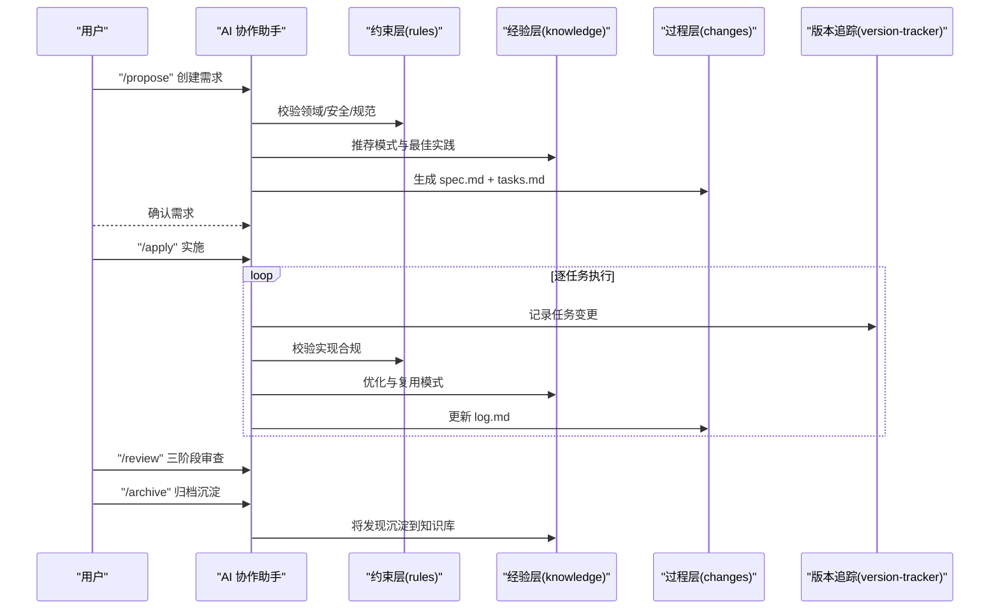
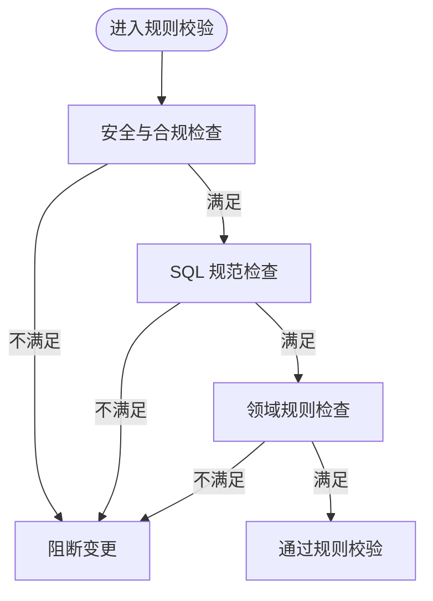
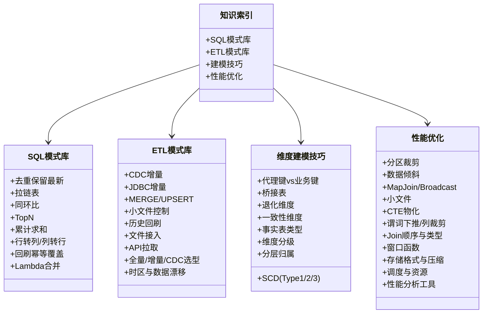
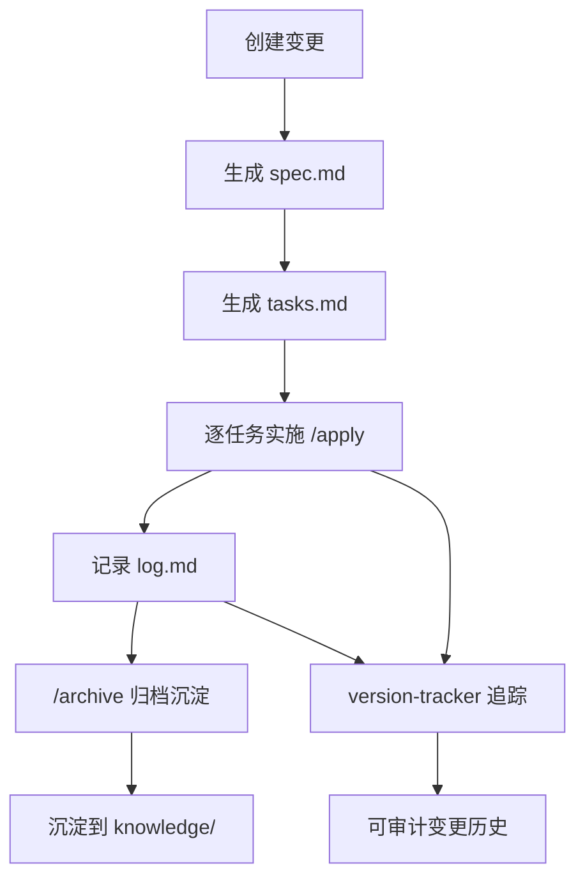
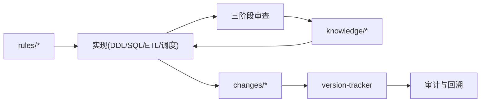

# 三段式知识结构

<cite>
**本文引用的文件**
- [目录结构和设计说明.md](file://目录结构和设计说明.md)
- [copilot-prompt.md](file://agents/copilot-prompt.md)
- [sql-reviewer.md](file://agents/sql-reviewer.md)
- [version-tracker.md](file://agents/version-tracker.md)
- [domain-rules.md](file://rules/domain-rules.md)
- [security.md](file://rules/security.md)
- [sql-style.md](file://rules/sql-style.md)
- [index.md](file://knowledge/index.md)
- [dimension-modeling-tips.md](file://knowledge/dimension-modeling-tips.md)
- [etl-patterns.md](file://knowledge/etl-patterns.md)
- [performance-tips.md](file://knowledge/performance-tips.md)
- [sql-patterns.md](file://knowledge/sql-patterns.md)
- [log.md](file://changes/templates/log.md)
- [spec.md](file://changes/templates/spec.md)
- [tasks.md](file://changes/templates/tasks.md)
</cite>

## 目录
1. [简介](#简介)
2. [项目结构](#项目结构)
3. [核心组件](#核心组件)
4. [架构总览](#架构总览)
5. [详细组件分析](#详细组件分析)
6. [依赖分析](#依赖分析)
7. [性能考量](#性能考量)
8. [故障排查指南](#故障排查指南)
9. [结论](#结论)
10. [附录](#附录)

## 简介
本项目围绕“三段式知识结构”构建数据仓库 AI 协作助手，通过 rules/（约束）、knowledge/（经验）、changes/（过程）三层协同，形成“强制约束 + 推荐经验 + 历史过程”的闭环：
- rules/ 提供强制性约束与规范，确保安全、正确、可审计；
- knowledge/ 沉淀最佳实践与模式库，提升复用效率；
- changes/ 记录每次变更的过程与结果，支撑持续改进与知识飞轮。

## 项目结构
项目采用“提示词驱动 + 模板化流程 + 自动化追踪”的组织方式，核心目录与职责如下：
- agents/：AI 角色与子 Agent 提示词，定义协作流程与审查标准
- changes/templates/：变更管理模板（spec、tasks、log）
- knowledge/：领域知识库（SQL 模式、ETL 模式、建模技巧、性能优化）
- rules/：项目约束与规范（安全、SQL 规范、领域规则、建模/调度/质量规范）

```mermaid
graph TB
subgraph "AI 协作层"
Copilot["主提示词<br/>agents/copilot-prompt.md"]
SQLR["SQL 质量审查<br/>agents/sql-reviewer.md"]
VT["版本追踪<br/>agents/version-tracker.md"]
end
subgraph "约束层"
Rules["规则集合<br/>rules/*"]
Sec["安全红线<br/>rules/security.md"]
Style["SQL 规范<br/>rules/sql-style.md"]
Domain["领域规则<br/>rules/domain-rules.md"]
end
subgraph "经验层"
Know["知识库<br/>knowledge/*"]
Index["索引<br/>knowledge/index.md"]
SQLP["SQL 模式库<br/>knowledge/sql-patterns.md"]
ETL["ETL 模式库<br/>knowledge/etl-patterns.md"]
DM["建模技巧<br/>knowledge/dimension-modeling-tips.md"]
Perf["性能优化<br/>knowledge/performance-tips.md"]
end
subgraph "过程层"
Changes["变更模板<br/>changes/templates/*"]
Spec["需求规格<br/>changes/templates/spec.md"]
Tasks["任务拆分<br/>changes/templates/tasks.md"]
Log["变更日志<br/>changes/templates/log.md"]
end
Copilot --> Rules
Copilot --> Know
Copilot --> Changes
SQLR --> Know
SQLR --> Rules
VT --> Changes
VT --> Know
VT --> Rules
```

图表来源
- [目录结构和设计说明.md:19-55](file://目录结构和设计说明.md#L19-L55)
- [copilot-prompt.md:1-147](file://agents/copilot-prompt.md#L1-L147)
- [version-tracker.md:1-120](file://agents/version-tracker.md#L1-L120)

章节来源
- [目录结构和设计说明.md:19-55](file://目录结构和设计说明.md#L19-L55)

## 核心组件
- 规则（rules/）：提供强制性约束，包括安全红线、SQL 编码规范、领域规则等，确保项目在正确轨道上运行。
- 知识（knowledge/）：沉淀 SQL 模式、ETL 模式、建模技巧、性能优化等经验，形成可复用的“工具箱”。
- 过程（changes/）：以模板化方式记录需求、任务、日志与验证，形成“实践—发现—沉淀—复用”的知识飞轮。

章节来源
- [目录结构和设计说明.md:70-78](file://目录结构和设计说明.md#L70-L78)
- [copilot-prompt.md:6-22](file://agents/copilot-prompt.md#L6-L22)

## 架构总览
三段式知识结构的运行机制如下：
- Spec 驱动：所有变更必须基于需求文档（Spec），先规划再实施；
- 约束先行：在设计与实现中始终遵循 rules/ 的强制规范；
- 经验复用：优先采用 knowledge/ 的成熟模式与最佳实践；
- 过程闭环：通过 changes/ 模板记录全过程，version-tracker 自动审计；
- 审查把关：三阶段审查（Spec 合规 → 模型质量 → SQL 质量）保障交付质量。

图表来源
- [copilot-prompt.md:63-131](file://agents/copilot-prompt.md#L63-L131)
- [version-tracker.md:5-16](file://agents/version-tracker.md#L5-L16)
- [spec.md:1-132](file://changes/templates/spec.md#L1-L132)
- [tasks.md:1-74](file://changes/templates/tasks.md#L1-L74)
- [log.md:1-61](file://changes/templates/log.md#L1-L61)

章节来源
- [copilot-prompt.md:6-22](file://agents/copilot-prompt.md#L6-L22)
- [目录结构和设计说明.md:126-166](file://目录结构和设计说明.md#L126-L166)

## 详细组件分析

### 规则层（rules/）设计理念与职责
- 安全红线（安全）：明确数据安全、字段脱敏、行级权限、数据分级、上线流程、回刷与跨境合规等强制要求，确保生产安全与合规。
- SQL 编码规范：统一命名、格式、关键字大小写、注释、禁用项与常见错误对照，提升可读性与可维护性。
- 领域规则：定义业务口径、KPI 标准、数据质量五维度、历史数据约定、跨系统一致性与行业特定规则，确保业务正确性与一致性。

图表来源
- [security.md:1-98](file://rules/security.md#L1-L98)
- [sql-style.md:1-254](file://rules/sql-style.md#L1-L254)
- [domain-rules.md:1-142](file://rules/domain-rules.md#L1-L142)

章节来源
- [security.md:7-98](file://rules/security.md#L7-L98)
- [sql-style.md:7-254](file://rules/sql-style.md#L7-L254)
- [domain-rules.md:6-142](file://rules/domain-rules.md#L6-L142)

### 经验层（knowledge/）设计理念与职责
- 知识索引：以“一句话”快速定位核心逻辑，便于 AI 快速命中；
- SQL 模式库：覆盖去重保留最新、拉链表、同环比、TopN、累计求和、行转列/列转行、回刷幂等覆盖、Lambda 合并等；
- ETL 模式库：CDC 增量同步、JDBC 增量抽取、MERGE/UPSERT、小文件控制、历史回刷、文件接入、API 拉取、全量/增量/CDC 选型对照、时区与数据漂移处理；
- 维度建模技巧：代理键/业务键、SCD（Type 1/2/3）、桥接表、退化维度、一致性维度、事实表类型、维度分级、分层归属判定；
- 性能优化：分区裁剪、数据倾斜、Map Join/Broadcast、小文件、CTE 物化、谓词下推/列裁剪、Join 顺序与类型、窗口函数、存储格式与压缩、调度与资源、性能分析工具。

图表来源
- [index.md:1-60](file://knowledge/index.md#L1-L60)
- [sql-patterns.md:1-331](file://knowledge/sql-patterns.md#L1-L331)
- [etl-patterns.md:1-220](file://knowledge/etl-patterns.md#L1-L220)
- [dimension-modeling-tips.md:1-253](file://knowledge/dimension-modeling-tips.md#L1-L253)
- [performance-tips.md:1-349](file://knowledge/performance-tips.md#L1-L349)

章节来源
- [index.md:6-60](file://knowledge/index.md#L6-L60)
- [sql-patterns.md:6-331](file://knowledge/sql-patterns.md#L6-L331)
- [etl-patterns.md:6-220](file://knowledge/etl-patterns.md#L6-L220)
- [dimension-modeling-tips.md:1-253](file://knowledge/dimension-modeling-tips.md#L1-L253)
- [performance-tips.md:1-349](file://knowledge/performance-tips.md#L1-L349)

### 过程层（changes/）设计理念与职责
- 变更需求规格（spec.md）：背景与目标、现状分析、功能点、业务规则与口径、DDL、SQL 设计、ETL/同步、调度、DQ、影响范围、风险与关注点、验证策略、技术决策、执行日志、审查结论与确认记录；
- 任务拆分（tasks.md）：按 ODS→DIM→DWD→DWS→ADS→调度→DQ→权限的顺序拆解原子任务，明确目标、分层、涉及变更、关键 DDL/SQL、依赖、验收标准、验证方法与回刷计划；
- 变更日志（log.md）：时间线、技术决策、踩坑记录、知识发现、Spec-实现偏差、回刷记录、性能对比、DQ 验证记录与质量备忘。

图表来源
- [spec.md:1-132](file://changes/templates/spec.md#L1-L132)
- [tasks.md:1-74](file://changes/templates/tasks.md#L1-L74)
- [log.md:1-61](file://changes/templates/log.md#L1-L61)
- [version-tracker.md:5-16](file://agents/version-tracker.md#L5-L16)

章节来源
- [spec.md:8-132](file://changes/templates/spec.md#L8-L132)
- [tasks.md:3-74](file://changes/templates/tasks.md#L3-L74)
- [log.md:1-61](file://changes/templates/log.md#L1-L61)

### 交互机制示例
- SQL 开发：AI 基于 rules/sql-style.md 编写规范 SQL，结合 knowledge/sql-patterns.md 的模式，完成后触发 version-tracker 记录；
- ETL 开发：AI 基于 knowledge/etl-patterns.md 的模式设计 CDC/JDBC/文件/API 同步，确保幂等与回放能力；
- 建模设计：AI 基于 knowledge/dimension-modeling-tips.md 的技巧与 rules/domain-rules.md 的口径，完成分层归属与一致性维度设计；
- 性能优化：AI 基于 knowledge/performance-tips.md 的清单进行分区裁剪、倾斜治理、小文件合并、Join 优化等；
- 数据质量：AI 基于 rules/domain-rules.md 的 DQ 五维度模板生成对账 SQL，与基准来源对比；
- 审查流程：AI 通过三阶段审查（Spec 合规 → 模型质量 → SQL 质量），确保 Plan 与实现一致。

章节来源
- [copilot-prompt.md:68-131](file://agents/copilot-prompt.md#L68-L131)
- [sql-reviewer.md:1-68](file://agents/sql-reviewer.md#L1-L68)
- [sql-patterns.md:6-331](file://knowledge/sql-patterns.md#L6-L331)
- [etl-patterns.md:6-220](file://knowledge/etl-patterns.md#L6-L220)
- [dimension-modeling-tips.md:1-253](file://knowledge/dimension-modeling-tips.md#L1-L253)
- [performance-tips.md:1-349](file://knowledge/performance-tips.md#L1-L349)
- [domain-rules.md:69-91](file://rules/domain-rules.md#L69-L91)

## 依赖分析
- 约束依赖：所有实现必须满足 rules/ 的强制规范；
- 经验依赖：优先复用 knowledge/ 的模式与技巧；
- 过程依赖：changes/ 模板贯穿全流程，version-tracker 提供审计；
- 审查依赖：三阶段审查确保交付质量。

图表来源
- [copilot-prompt.md:6-22](file://agents/copilot-prompt.md#L6-L22)
- [version-tracker.md:80-90](file://agents/version-tracker.md#L80-L90)

章节来源
- [copilot-prompt.md:6-22](file://agents/copilot-prompt.md#L6-L22)
- [version-tracker.md:80-90](file://agents/version-tracker.md#L80-L90)

## 性能考量
- 分区裁剪：WHERE 条件直接命中分区字段，避免函数包裹；
- 倾斜治理：过滤热点键、加盐打散、Map Join 小表；
- 小文件控制：合理设置 reduce 数、AQE 合并、周期性合并；
- Join 优化：按引擎选择最优 Join 类型与顺序；
- CTE 物化：在不物化的引擎中显式物化或落临时表；
- 存储格式：优先 ORC/Parquet，结合压缩策略；
- 调度与资源：错峰调度、SLA 基线、失败重试与回放。

章节来源
- [performance-tips.md:5-349](file://knowledge/performance-tips.md#L5-L349)

## 故障排查指南
- SQL 质量审查：检查分区裁剪、Join 顺序、倾斜风险、重复计算、别名与注释、NULL 处理、函数包裹分区字段等；
- 数据质量校验：完整性、唯一性、一致性、准确性、时效性五维度，配套对账 SQL 与阈值；
- 变更追踪：通过 version-tracker 的结构化条目定位时间、模块、分层、变更内容、回刷范围与下游影响；
- 知识沉淀：在 changes/log.md 中记录踩坑与知识发现，归档后沉淀到 knowledge/。

章节来源
- [sql-reviewer.md:1-68](file://agents/sql-reviewer.md#L1-L68)
- [domain-rules.md:69-91](file://rules/domain-rules.md#L69-L91)
- [version-tracker.md:44-120](file://agents/version-tracker.md#L44-L120)
- [log.md:15-61](file://changes/templates/log.md#L15-L61)

## 结论
三段式知识结构通过“约束—经验—过程”的协同，实现了数据仓库开发的标准化、可审计与可持续演进：
- 约束层确保安全与正确；
- 经验层提升效率与质量；
- 过程层保障闭环与可追溯；
- 配套的 AI 协作与审查机制，进一步固化最佳实践，推动知识飞轮持续运转。

## 附录
- 使用方式：将项目加载到 AI 编码助手，阅读主提示词，通过命令开展协作，首次使用执行初始化；
- 扩展方向：后续可增加数据质量评审 Agent、实时数仓与湖仓专题、成本优化、dbt 集成与血缘分析等。

章节来源
- [目录结构和设计说明.md:186-204](file://目录结构和设计说明.md#L186-L204)