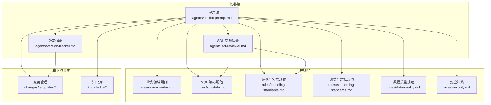
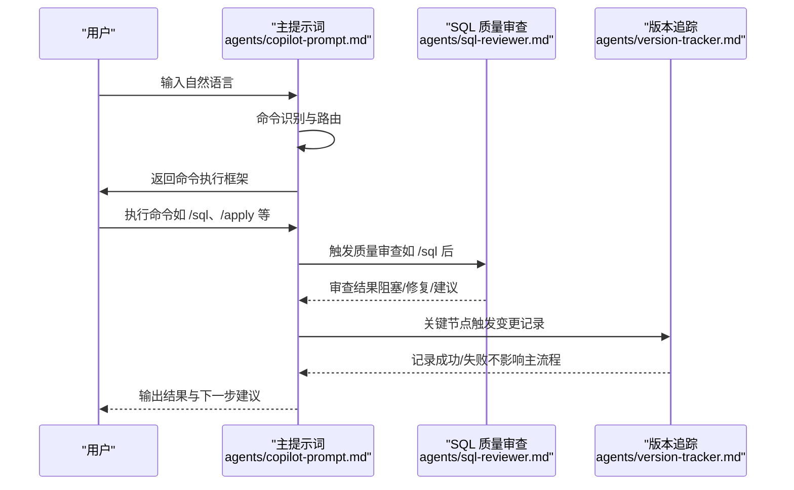
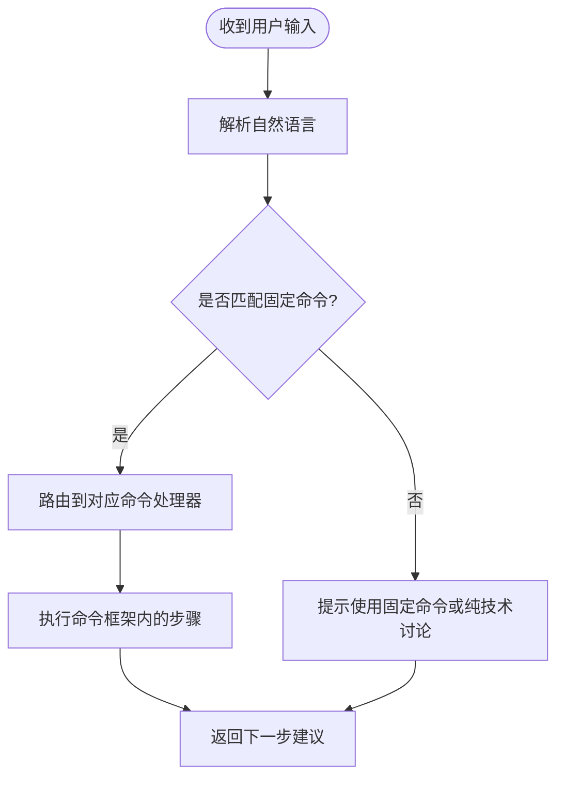
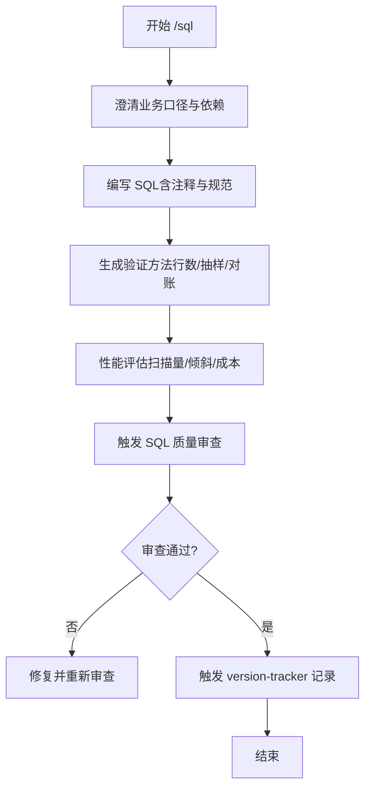
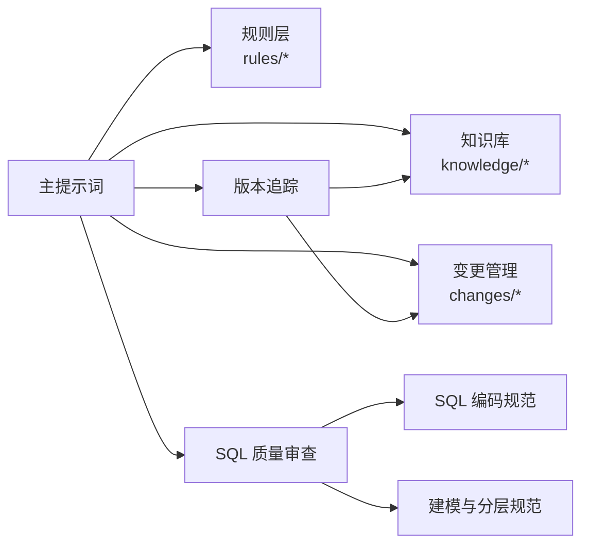

# 命令式协作机制

<cite>
**本文引用的文件**
- [目录结构和设计说明.md](file://目录结构和设计说明.md)
- [copilot-prompt.md](file://agents/copilot-prompt.md)
- [version-tracker.md](file://agents/version-tracker.md)
- [sql-reviewer.md](file://agents/sql-reviewer.md)
- [domain-rules.md](file://rules/domain-rules.md)
- [sql-style.md](file://rules/sql-style.md)
- [modeling-standards.md](file://rules/modeling-standards.md)
- [scheduling-standards.md](file://rules/scheduling-standards.md)
- [data-quality.md](file://rules/data-quality.md)
- [security.md](file://rules/security.md)
</cite>

## 目录
1. [简介](#简介)
2. [项目结构](#项目结构)
3. [核心组件](#核心组件)
4. [架构总览](#架构总览)
5. [详细组件分析](#详细组件分析)
6. [依赖分析](#依赖分析)
7. [性能考虑](#性能考虑)
8. [故障排查指南](#故障排查指南)
9. [结论](#结论)
10. [附录](#附录)

## 简介
本文件系统化阐述“命令式协作机制”的设计与实现，围绕固定命令体系（/init、/sql、/etl、/model、/propose、/apply、/review、/optimize、/dq、/schedule、/archive）构建统一的协作流程，确保数仓开发在“Spec 驱动 + 三段式知识库 + 强制变更追踪”的范式下保持一致性与可追溯性。文档覆盖命令识别、路由与执行的完整流程，以及标准化命令如何保障工作流稳定闭环。

## 项目结构
该项目采用“提示词工程 + 规则与知识库 + 变更管理”的三层协作结构：
- agents/：AI 角色与子 Agent 的提示词，定义命令识别、路由与执行框架
- rules/：项目约束与规范（强制约束），为命令执行提供上下文与规则依据
- changes/：变更管理（Spec 驱动核心），承载每次变更的提案、任务与日志
- knowledge/：领域知识库（经验复用），沉淀最佳实践
- version-tracker：强制变更追踪 Agent，确保所有变更可审计、可回溯

图表来源
- [目录结构和设计说明.md:19-55](file://目录结构和设计说明.md#L19-L55)
- [copilot-prompt.md:1-147](file://agents/copilot-prompt.md#L1-L147)
- [version-tracker.md:1-120](file://agents/version-tracker.md#L1-L120)
- [sql-reviewer.md:1-68](file://agents/sql-reviewer.md#L1-L68)

章节来源
- [目录结构和设计说明.md:19-55](file://目录结构和设计说明.md#L19-L55)

## 核心组件
- 命令识别与路由：主提示词将用户自然语言映射到固定命令，形成统一入口与流程起点
- 命令执行引擎：各命令在明确的执行框架下完成任务，遵循规则层约束
- 审查与质量门禁：SQL 质量审查与三阶段审查构成质量门禁，阻断偏差进入下一阶段
- 强制变更追踪：version-tracker 在关键节点自动记录结构化变更条目，确保可审计与可回溯
- 规则与知识：rules/提供强制约束，knowledge/沉淀经验，changes/记录过程

章节来源
- [copilot-prompt.md:36-54](file://agents/copilot-prompt.md#L36-L54)
- [copilot-prompt.md:63-131](file://agents/copilot-prompt.md#L63-L131)
- [version-tracker.md:5-16](file://agents/version-tracker.md#L5-L16)
- [sql-reviewer.md:1-68](file://agents/sql-reviewer.md#L1-L68)

## 架构总览
命令式协作机制的端到端流程如下：
- 会话启动：读取 rules/ 与 changes/，展示命令菜单
- 命令识别：将用户输入映射到固定命令
- 命令执行：按命令框架完成任务，引用规则与知识
- 质量门禁：通过 SQL 质量审查与三阶段审查
- 变更追踪：在关键节点记录结构化变更条目
- 归档沉淀：将知识发现固化到 knowledge/

图表来源
- [copilot-prompt.md:36-54](file://agents/copilot-prompt.md#L36-L54)
- [copilot-prompt.md:63-131](file://agents/copilot-prompt.md#L63-L131)
- [sql-reviewer.md:1-68](file://agents/sql-reviewer.md#L1-L68)
- [version-tracker.md:5-16](file://agents/version-tracker.md#L5-L16)

## 详细组件分析

### 命令识别与路由
- 识别策略：将自然语言映射到固定命令，避免发散与遗漏
- 路由规则：每个命令绑定明确的触发场景与执行框架
- 会话启动：自动扫描 rules/ 与 changes/，报告当前状态并展示命令菜单

图表来源
- [copilot-prompt.md:36-54](file://agents/copilot-prompt.md#L36-L54)
- [copilot-prompt.md:55-62](file://agents/copilot-prompt.md#L55-L62)

章节来源
- [copilot-prompt.md:36-62](file://agents/copilot-prompt.md#L36-L62)

### /init — 初始化项目上下文
- 目标：填充 rules/project-context.md，建立项目上下文
- 触发时机：首次使用项目时
- 产出：项目数据源、分层架构、库表清单、调度系统、命名规范等

章节来源
- [copilot-prompt.md:65-67](file://agents/copilot-prompt.md#L65-L67)
- [目录结构和设计说明.md:80-97](file://目录结构和设计说明.md#L80-L97)

### /sql — SQL 开发
- 步骤：理解业务口径 → 编写 SQL（遵循编码规范）→ 提供验证方法 → 性能评估
- 质量门禁：SQL 质量审查（阻塞/修复/建议）
- 变更追踪：完成后触发 version-tracker 记录

图表来源
- [copilot-prompt.md:68-90](file://agents/copilot-prompt.md#L68-L90)
- [sql-reviewer.md:1-68](file://agents/sql-reviewer.md#L1-L68)
- [version-tracker.md:9](file://agents/version-tracker.md#L9)

章节来源
- [copilot-prompt.md:68-90](file://agents/copilot-prompt.md#L68-L90)
- [sql-style.md:142-154](file://rules/sql-style.md#L142-L154)

### /etl — ETL / 数据集成开发
- 步骤：研究数据源 → 设计同步方式（全量/增量/CDC）→ 编写脚本 → 验证幂等与回放
- 变更追踪：完成后触发 version-tracker 记录

章节来源
- [copilot-prompt.md:91-94](file://agents/copilot-prompt.md#L91-L94)
- [version-tracker.md:10](file://agents/version-tracker.md#L10)

### /model — 数仓建模
- 步骤：业务过程 → 粒度 → 维度与事实 → 分层归属 → DDL 设计 → 文档化口径
- 规范：严格分层、星型模型、代理键/业务键、分区与生命周期
- 变更追踪：完成后触发 version-tracker 记录

章节来源
- [copilot-prompt.md:95-102](file://agents/copilot-prompt.md#L95-L102)
- [modeling-standards.md:7-46](file://rules/modeling-standards.md#L7-L46)
- [version-tracker.md:11](file://agents/version-tracker.md#L11)

### /propose — 创建变更提案
- 步骤：Research → 逐项澄清（一次一个）→ 生成 spec 与 tasks → HARD-GATE 确认
- 规范：No Spec, No Change；Spec is Truth；Reverse Sync；变更即记录

章节来源
- [copilot-prompt.md:103-106](file://agents/copilot-prompt.md#L103-L106)
- [目录结构和设计说明.md:64-69](file://目录结构和设计说明.md#L64-L69)

### /apply — 执行实施
- 步骤：前置检查（spec + tasks + 用户确认）→ 逐 task 执行 → 每个 task 完成后展示验证证据 → 触发 version-tracker
- 原子化：每个任务聚焦单一表或作业，零偏差原则

章节来源
- [copilot-prompt.md:107-112](file://agents/copilot-prompt.md#L107-L112)
- [version-tracker.md:14](file://agents/version-tracker.md#L14)

### /review — 三阶段审查
- 阶段一：Spec 合规（需求合规）
- 阶段二：模型质量（建模规范与一致性）
- 阶段三：SQL 质量（正确性、性能、可维护性）
- 通过顺序：一阶 PASS 后启动二阶，二阶 PASS 后启动三阶

章节来源
- [copilot-prompt.md:113-116](file://agents/copilot-prompt.md#L113-L116)
- [sql-reviewer.md:1-68](file://agents/sql-reviewer.md#L1-L68)

### /optimize — 性能诊断与优化
- 诊断层级：数据源层 → 抽取层 → 数仓层（ODS/DWD/DWS/ADS）→ 应用层
- 要求：量化优化前后对比（扫描量、运行耗时、资源消耗、成本）

章节来源
- [copilot-prompt.md:117-120](file://agents/copilot-prompt.md#L117-L120)

### /dq — 数据质量校验
- 五维度：完整性、唯一性、一致性、准确性、时效性
- 规则：为每条规则产出可执行的对账 SQL，并与基准来源对比
- 规范：DQ 规则模板、严重等级、上线流程

章节来源
- [copilot-prompt.md:121-124](file://agents/copilot-prompt.md#L121-L124)
- [data-quality.md:9-195](file://rules/data-quality.md#L9-L195)

### /schedule — 调度配置
- 步骤：依赖识别 → 调度周期 → 重试与告警 → SLA/基线 → 资源队列 → 失败回放策略
- 变更追踪：新增/调整作业时触发

章节来源
- [copilot-prompt.md:125-128](file://agents/copilot-prompt.md#L125-L128)
- [scheduling-standards.md:7-233](file://rules/scheduling-standards.md#L7-L233)
- [version-tracker.md:13](file://agents/version-tracker.md#L13)

### /archive — 归档 + 知识沉淀
- 步骤：逐条展示 log.md 知识发现 → 确认后沉淀到 knowledge/
- 变更追踪：完成后记录归档操作及沉淀条目

章节来源
- [copilot-prompt.md:129-132](file://agents/copilot-prompt.md#L129-L132)
- [version-tracker.md:15](file://agents/version-tracker.md#L15)

## 依赖分析
命令式协作机制的关键依赖关系如下：
- 命令识别依赖主提示词（agents/copilot-prompt.md）
- 命令执行依赖规则层（rules/*）与知识库（knowledge/*）
- 质量门禁依赖 SQL 质量审查（agents/sql-reviewer.md）
- 变更追踪依赖版本追踪（agents/version-tracker.md）
- 归档沉淀依赖 changes/ 与 knowledge/

图表来源
- [copilot-prompt.md:1-147](file://agents/copilot-prompt.md#L1-L147)
- [sql-reviewer.md:1-68](file://agents/sql-reviewer.md#L1-L68)
- [version-tracker.md:1-120](file://agents/version-tracker.md#L1-L120)

章节来源
- [copilot-prompt.md:1-147](file://agents/copilot-prompt.md#L1-L147)
- [sql-reviewer.md:1-68](file://agents/sql-reviewer.md#L1-L68)
- [version-tracker.md:1-120](file://agents/version-tracker.md#L1-L120)

## 性能考虑
- 通过命令式协作减少无效分支与重复劳动，提升整体效率
- SQL 质量审查与 DQ 规则在早期阻断性能隐患，降低后期修复成本
- 调度规范与 SLA 基线确保作业在资源与时间约束内稳定运行
- 版本追踪避免重复变更与回溯成本，提升可维护性

## 故障排查指南
- 命令识别失败：确认输入是否符合固定命令语义，必要时参考命令菜单
- 质量门禁不通过：按 SQL 质量审查反馈逐项修复，直至阻塞项消除
- 变更追踪失败：检查日志路径与权限，version-tracker 仅提示不阻断主流程
- DQ 失败：根据严重等级采取相应处置（P0 停下游、P1 告警、P2 监控）
- 安全违规：立即停止操作并上报，按安全红线与应急响应流程处理

章节来源
- [version-tracker.md:80-89](file://agents/version-tracker.md#L80-L89)
- [data-quality.md:102-114](file://rules/data-quality.md#L102-L114)
- [security.md:7-98](file://rules/security.md#L7-L98)

## 结论
命令式协作机制通过固定命令体系、规则与知识库、质量门禁与强制变更追踪，实现了数仓开发的标准化、可追溯与可持续演进。遵循该机制可显著降低偏差风险、提升交付质量，并为知识沉淀与团队协作提供坚实基础。

## 附录
- 典型工作流（新建需求）：/propose → /apply → /review → /archive
- 典型工作流（性能优化）：/optimize → 修复 → DQ 验证 → 归档沉淀

章节来源
- [目录结构和设计说明.md:126-167](file://目录结构和设计说明.md#L126-L167)