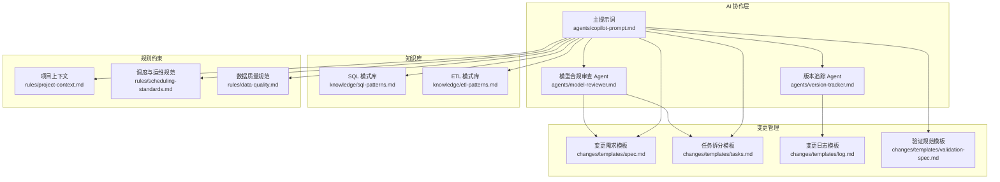
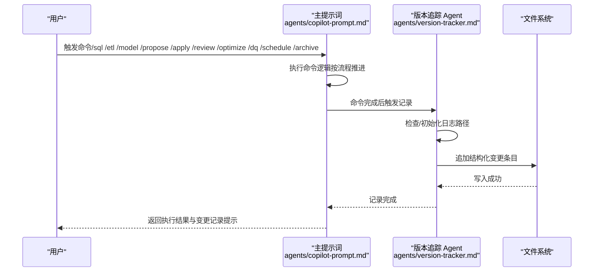
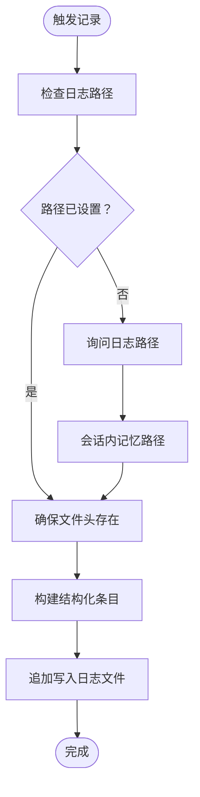
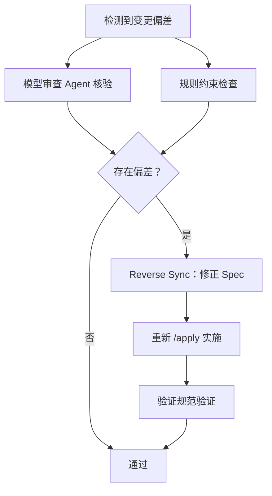
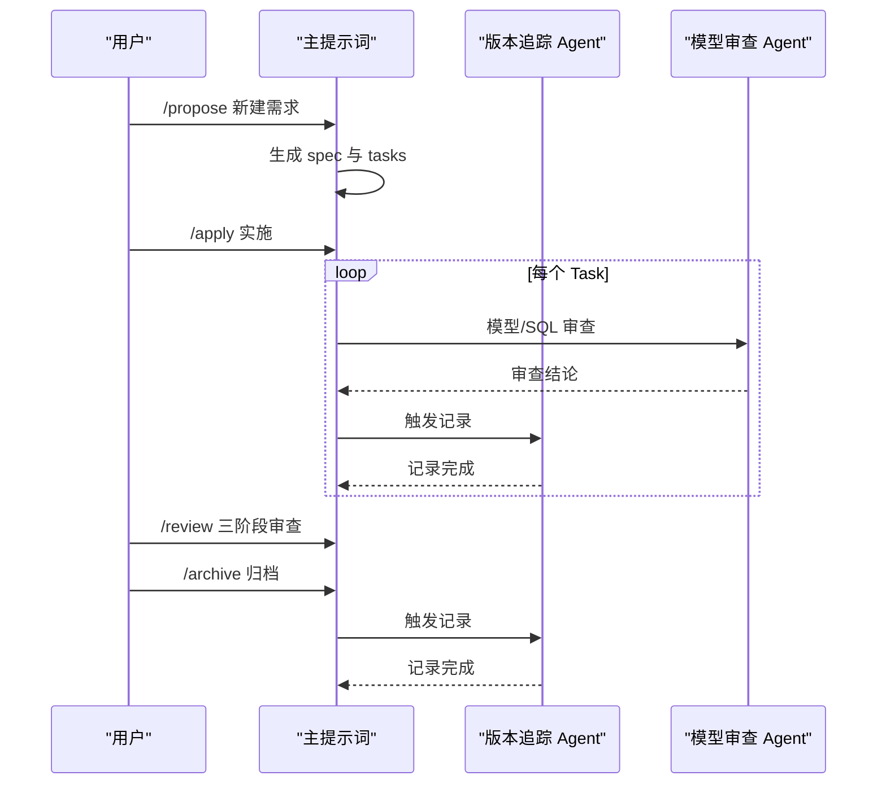
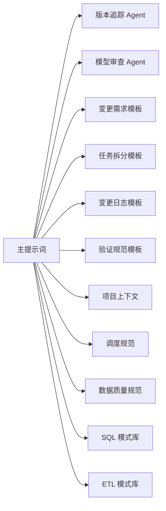

# 强制变更追踪系统

<cite>
**本文引用的文件**
- [目录结构和设计说明.md](file://目录结构和设计说明.md)
- [agents/version-tracker.md](file://agents/version-tracker.md)
- [agents/copilot-prompt.md](file://agents/copilot-prompt.md)
- [changes/templates/spec.md](file://changes/templates/spec.md)
- [changes/templates/tasks.md](file://changes/templates/tasks.md)
- [changes/templates/log.md](file://changes/templates/log.md)
- [changes/templates/validation-spec.md](file://changes/templates/validation-spec.md)
- [rules/project-context.md](file://rules/project-context.md)
- [rules/scheduling-standards.md](file://rules/scheduling-standards.md)
- [rules/data-quality.md](file://rules/data-quality.md)
- [knowledge/sql-patterns.md](file://knowledge/sql-patterns.md)
- [knowledge/etl-patterns.md](file://knowledge/etl-patterns.md)
- [agents/model-reviewer.md](file://agents/model-reviewer.md)
</cite>

## 目录
1. [简介](#简介)
2. [项目结构](#项目结构)
3. [核心组件](#核心组件)
4. [架构总览](#架构总览)
5. [详细组件分析](#详细组件分析)
6. [依赖分析](#依赖分析)
7. [性能考虑](#性能考虑)
8. [故障排查指南](#故障排查指南)
9. [结论](#结论)
10. [附录](#附录)

## 简介
本项目围绕“强制变更追踪”这一核心目标，构建了覆盖 DDL、SQL、ETL、调度与数据质量的自动化变更记录体系。系统通过 AI Agent 在关键节点自动追加结构化变更条目，确保每次变更均可审计、可回溯、可溯源。配合 Spec 驱动的变更管理流程与三段式知识库（规则/经验/过程），形成从需求到归档的完整闭环。

## 项目结构
项目采用“提示词工程 + 变更模板 + 知识库 + 规则约束”的组织方式，核心目录与职责如下：
- agents/：AI 角色与子 Agent 提示词，其中 version-tracker 负责强制变更记录
- changes/templates/：变更管理模板（spec、tasks、log、validation-spec）
- knowledge/：SQL 模式、ETL 模式、建模技巧、性能优化等经验库
- rules/：项目约束与规范（上下文、建模标准、调度与运维、数据质量、安全等）

图表来源
- [目录结构和设计说明.md:19-55](file://目录结构和设计说明.md#L19-L55)
- [agents/version-tracker.md:1-120](file://agents/version-tracker.md#L1-L120)
- [agents/copilot-prompt.md:63-132](file://agents/copilot-prompt.md#L63-L132)
- [changes/templates/spec.md:1-132](file://changes/templates/spec.md#L1-L132)
- [changes/templates/tasks.md:1-74](file://changes/templates/tasks.md#L1-L74)
- [changes/templates/log.md:1-61](file://changes/templates/log.md#L1-L61)
- [changes/templates/validation-spec.md:1-123](file://changes/templates/validation-spec.md#L1-L123)
- [rules/project-context.md:1-104](file://rules/project-context.md#L1-L104)
- [rules/scheduling-standards.md:1-233](file://rules/scheduling-standards.md#L1-L233)
- [rules/data-quality.md:1-195](file://rules/data-quality.md#L1-L195)
- [knowledge/sql-patterns.md:1-331](file://knowledge/sql-patterns.md#L1-L331)
- [knowledge/etl-patterns.md:1-220](file://knowledge/etl-patterns.md#L1-L220)

章节来源
- [目录结构和设计说明.md:19-55](file://目录结构和设计说明.md#L19-L55)

## 核心组件
- 版本追踪 Agent：在 /sql、/etl、/model、/schedule、/dq、/apply 等关键节点后，自动追加结构化变更条目到指定日志文件，确保“变更即记录”
- 变更模板体系：spec、tasks、log、validation-spec 四大模板构成变更管理的“过程资产”，支撑可审计、可回溯
- 知识库与规则：SQL/ETL 模式库与建模/调度/数据质量/安全等规范，提供可复用的经验与强制约束
- 主提示词：定义命令体系、工作流与“变更即记录”的核心法则，贯穿所有操作

章节来源
- [agents/version-tracker.md:5-120](file://agents/version-tracker.md#L5-L120)
- [agents/copilot-prompt.md:4-14](file://agents/copilot-prompt.md#L4-L14)
- [目录结构和设计说明.md:98-106](file://目录结构和设计说明.md#L98-L106)

## 架构总览
系统以“主提示词”为入口，通过命令驱动 AI 在各阶段执行任务；在每个关键节点触发版本追踪 Agent，将结构化条目写入变更日志。同时，模型审查 Agent 与验证规范模板协同，确保实现与 Spec 一致，减少偏差与冲突。

图表来源
- [agents/copilot-prompt.md:63-132](file://agents/copilot-prompt.md#L63-L132)
- [agents/version-tracker.md:5-120](file://agents/version-tracker.md#L5-L120)

## 详细组件分析

### 版本追踪 Agent（自动变更记录）
- 触发时机：DDL/SQL/ETL/调度变更完成后，以及 /apply 每个 Task 完成后
- 路径管理：首次触发时询问日志路径，会话内记忆；文件不存在则自动创建并写入文件头
- 条目格式：包含时间（精确到分钟）、模块、分层、任务、操作类型、变更内容、关联文件、回刷范围、下游影响、备注等字段
- 记录规则：原子化、精确引用、任务可追溯、下游必标注、回刷必声明、时间精确到分钟、不阻塞主流程

图表来源
- [agents/version-tracker.md:19-64](file://agents/version-tracker.md#L19-L64)
- [agents/version-tracker.md:80-89](file://agents/version-tracker.md#L80-L89)

章节来源
- [agents/version-tracker.md:5-120](file://agents/version-tracker.md#L5-L120)

### 变更条目字段定义与存储结构
- 字段清单与含义（摘自条目格式）：
  - 时间：YYYY-MM-DD HH:MM（精确到分钟）
  - 模块：DDL、SQL、ETL、调度、数据质量、权限/安全、项目配置
  - 分层：ODS、DWD、DWS、ADS、DIM、跨层
  - 任务：来自 spec 或用户描述
  - 操作：新建、修改、删除、回刷
  - 变更内容：精确到库.表.字段或作业名的具体变更项
  - 关联文件：SQL 文件路径、DDL 文件、调度配置文件、changes/ 文档
  - 回刷范围：涉及历史分区回刷时标明分区范围
  - 影响下游：受影响的下游表/作业/报表
  - 备注：特殊说明、已知限制、待跟进事项
- 存储位置：用户指定的 Markdown 文件（如项目根目录下的 changelog.md），按时间倒序追加

章节来源
- [agents/version-tracker.md:44-120](file://agents/version-tracker.md#L44-L120)

### 审计追踪的完整性与溯源能力
- 完整性保障：
  - “变更即记录”法则：任何 DDL/SQL/调度变更完成后必须同步记录
  - 原子化记录：一次命令对应一条记录，避免合并导致信息丢失
  - 精确引用：变更内容精确到对象名称，便于回溯
- 溯源能力：
  - 任务可追溯：任务字段必须填写，无明确任务时填写用户原始描述
  - 关联文件：记录 SQL/DDL/调度配置等文件路径，便于回溯实现
  - 下游标注：DDL 或核心 DWS/DIM 变更必须列出受影响的下游，便于影响分析

章节来源
- [agents/copilot-prompt.md:4-14](file://agents/copilot-prompt.md#L4-L14)
- [agents/version-tracker.md:80-89](file://agents/version-tracker.md#L80-L89)

### 变更冲突检测与解决机制
- 冲突检测：
  - 模型审查 Agent：独立验证模型结构与业务规则落地，识别缺失/多余/理解偏差
  - 规范约束：建模/调度/数据质量/安全等规则作为“强制约束”，发现偏差立即提示
- 冲突解决：
  - Reverse Sync：发现 spec 与实现不符时，先修正 spec 再修正实现
  - 三阶段审查：Spec 合规 → 模型质量 → SQL 质量，逐级把关
  - 验证规范：通过行数核验、抽样对比、对账 SQL 等实证手段验证偏差

图表来源
- [agents/model-reviewer.md:1-50](file://agents/model-reviewer.md#L1-L50)
- [agents/copilot-prompt.md:6-13](file://agents/copilot-prompt.md#L6-L13)
- [changes/templates/validation-spec.md:6-13](file://changes/templates/validation-spec.md#L6-L13)

章节来源
- [agents/model-reviewer.md:1-50](file://agents/model-reviewer.md#L1-L50)
- [agents/copilot-prompt.md:6-13](file://agents/copilot-prompt.md#L6-L13)
- [changes/templates/validation-spec.md:6-13](file://changes/templates/validation-spec.md#L6-L13)

### 变更追踪的应用案例与管理流程
- 典型工作流（新建数据需求）：
  - /propose：生成 spec 与 tasks，明确模型变更、SQL 设计、调度配置、DQ 规则
  - /apply：逐 task 实施，每个 task 完成后触发 version-tracker 记录
  - /review：三阶段审查，确保实现与 spec 一致
  - /archive：归档 + 知识沉淀，触发 version-tracker 记录
- 性能优化场景：
  - /optimize：按数据源→ETL→数仓→SQL→应用五层诊断，量化优化前后对比
  - 触发 version-tracker 并沉淀到性能技巧知识库

图表来源
- [目录结构和设计说明.md:126-151](file://目录结构和设计说明.md#L126-L151)
- [agents/copilot-prompt.md:103-132](file://agents/copilot-prompt.md#L103-L132)
- [agents/version-tracker.md:5-16](file://agents/version-tracker.md#L5-L16)

章节来源
- [目录结构和设计说明.md:126-167](file://目录结构和设计说明.md#L126-L167)
- [agents/copilot-prompt.md:103-132](file://agents/copilot-prompt.md#L103-L132)

## 依赖分析
- 组件耦合与协作：
  - 主提示词驱动命令执行，串联版本追踪 Agent 与模型审查 Agent
  - 变更模板（spec/tasks/log/validation-spec）为每次变更提供结构化“过程资产”
  - 规则约束（project-context/scheduling-standards/data-quality）作为强制约束，贯穿设计与实施
  - 知识库（sql-patterns/etl-patterns）提供可复用模式，降低实现偏差
- 外部依赖与集成点：
  - 调度系统（DolphinScheduler/Airflow/Oozie 等）：通过调度配置模板与规范对接
  - 数据质量平台：通过 DQ 规则模板与历史趋势表对接
  - 元数据与血缘平台：可扩展对接以增强影响分析自动化

图表来源
- [agents/copilot-prompt.md:63-132](file://agents/copilot-prompt.md#L63-L132)
- [目录结构和设计说明.md:19-55](file://目录结构和设计说明.md#L19-L55)

章节来源
- [agents/copilot-prompt.md:63-132](file://agents/copilot-prompt.md#L63-L132)
- [目录结构和设计说明.md:19-55](file://目录结构和设计说明.md#L19-L55)

## 性能考虑
- 记录开销：版本追踪仅追加写入，不阻塞主流程，对性能影响极小
- 写入策略：按分钟级时间戳追加，避免频繁随机写；建议将日志文件放置在高性能存储
- 并发与一致性：单进程追加写入，避免并发写入冲突；如需多实例，建议引入轻量锁或队列
- 查询与检索：日志为 Markdown，适合人类阅读；如需大规模检索，可在 CI/CD 流程中生成索引或导入知识库系统

## 故障排查指南
- 记录失败（路径无效/权限不足）：
  - 现象：提示用户但不中断当前操作
  - 处理：检查日志路径权限与磁盘空间，重新触发记录或手动补填占位符
- 时间精度问题：
  - 现象：系统无法获取精确时间
  - 处理：使用占位符“⚠️ 请补填具体时间”，在人工确认后补全
- 偏差与冲突：
  - 现象：模型/SQL 与 spec 不一致
  - 处理：通过模型审查 Agent 与验证规范模板定位问题，执行 Reverse Sync 修正

章节来源
- [agents/version-tracker.md:80-89](file://agents/version-tracker.md#L80-L89)
- [agents/model-reviewer.md:1-50](file://agents/model-reviewer.md#L1-L50)
- [changes/templates/validation-spec.md:6-13](file://changes/templates/validation-spec.md#L6-L13)

## 结论
本强制变更追踪系统通过“主提示词 + Agent + 模板 + 规则 + 知识库”的协同，实现了对 DDL/SQL/ETL/调度/数据质量的全流程自动化记录与审计。其核心价值在于：
- 变更即记录，确保可审计、可回溯、可溯源
- 以模板与规范为约束，降低实现偏差，提升质量
- 以知识库沉淀经验，形成“实践 → 发现 → 沉淀 → 复用”的知识飞轮

## 附录
- 变更条目字段速览（便于对照与自查）
  - 时间、模块、分层、任务、操作、变更内容、关联文件、回刷范围、影响下游、备注
- 常用模板与规则索引
  - 变更需求模板：用于明确背景、现状、功能点、业务规则、DDL、SQL、ETL、调度、DQ、影响范围、风险与验证策略
  - 任务拆分模板：按 ODS→DIM→DWD→DWS→ADS 顺序拆解，确保原子化与可验证
  - 项目上下文：统一数据源、分层、主题域、核心表、调度基线、安全配置等
  - 调度与运维规范：作业命名、依赖、周期、SLA、重试与告警、资源队列、幂等写入
  - 数据质量规范：五维度规则、阈值与严重等级、规则文件结构与历史趋势表

章节来源
- [changes/templates/spec.md:1-132](file://changes/templates/spec.md#L1-L132)
- [changes/templates/tasks.md:1-74](file://changes/templates/tasks.md#L1-L74)
- [rules/project-context.md:1-104](file://rules/project-context.md#L1-L104)
- [rules/scheduling-standards.md:1-233](file://rules/scheduling-standards.md#L1-L233)
- [rules/data-quality.md:1-195](file://rules/data-quality.md#L1-L195)
- [knowledge/sql-patterns.md:1-331](file://knowledge/sql-patterns.md#L1-L331)
- [knowledge/etl-patterns.md:1-220](file://knowledge/etl-patterns.md#L1-L220)