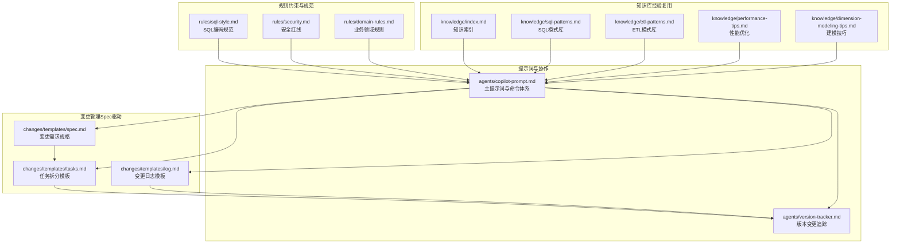
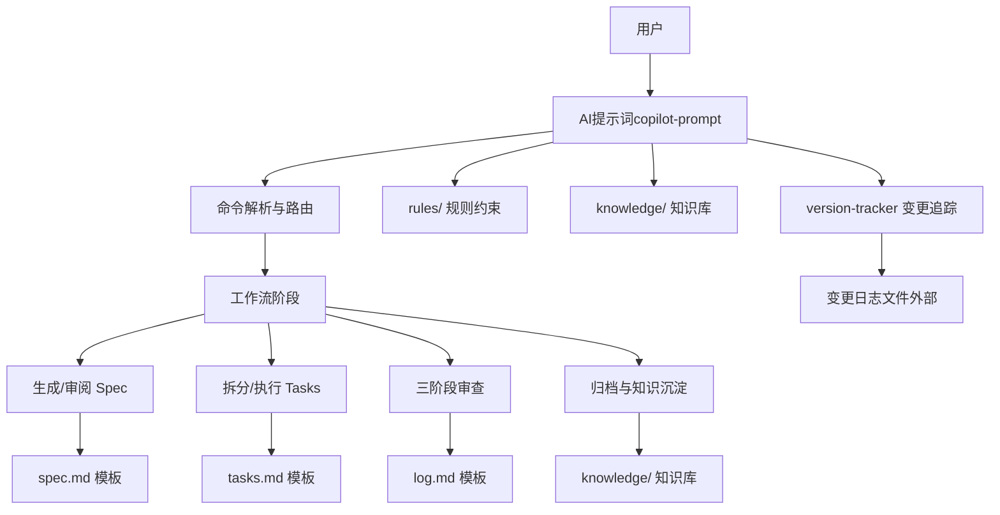
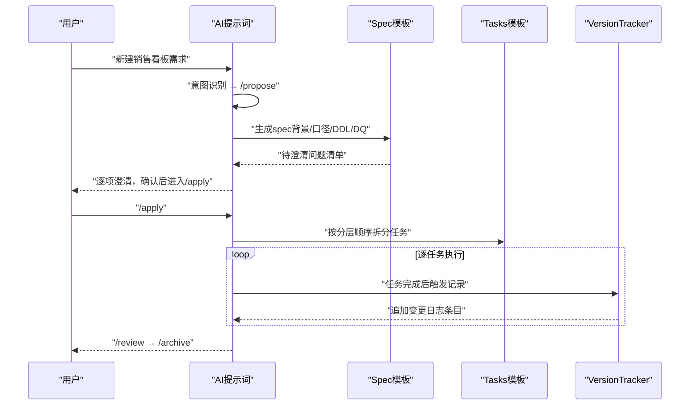
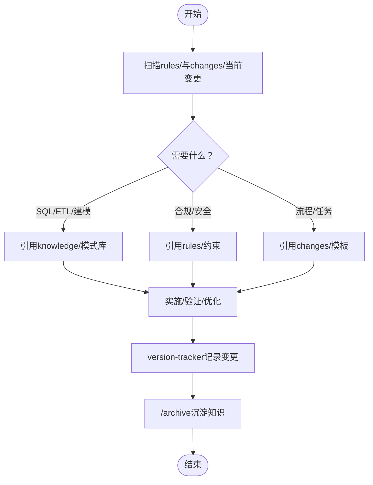
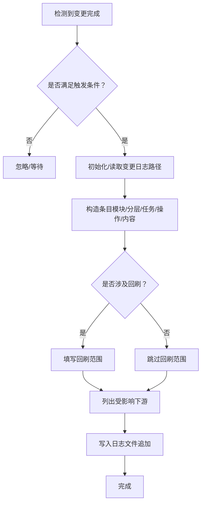
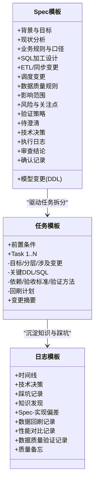
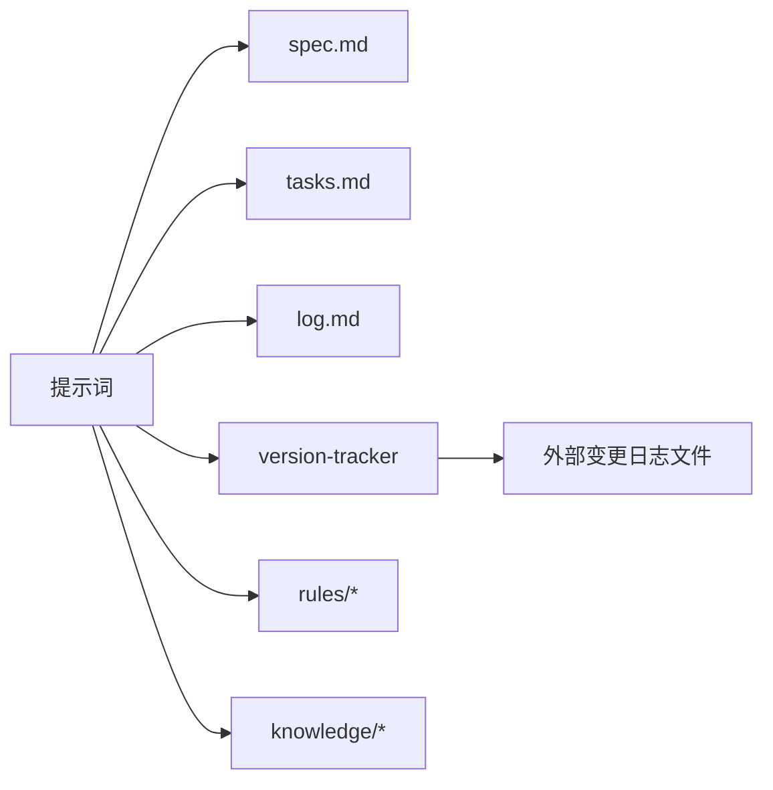
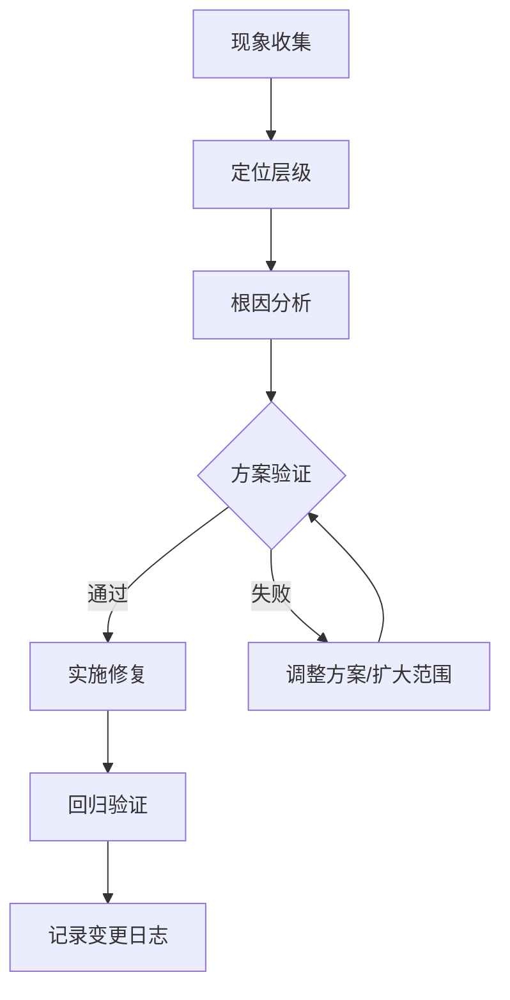

# 核心架构设计

<cite>
**本文引用的文件**
- [目录结构和设计说明.md](file://目录结构和设计说明.md)
- [copilot-prompt.md](file://agents/copilot-prompt.md)
- [version-tracker.md](file://agents/version-tracker.md)
- [spec.md](file://changes/templates/spec.md)
- [tasks.md](file://changes/templates/tasks.md)
- [log.md](file://changes/templates/log.md)
- [sql-style.md](file://rules/sql-style.md)
- [security.md](file://rules/security.md)
- [domain-rules.md](file://rules/domain-rules.md)
- [index.md](file://knowledge/index.md)
- [sql-patterns.md](file://knowledge/sql-patterns.md)
- [etl-patterns.md](file://knowledge/etl-patterns.md)
- [performance-tips.md](file://knowledge/performance-tips.md)
- [dimension-modeling-tips.md](file://knowledge/dimension-modeling-tips.md)
</cite>

## 目录
1. [简介](#简介)
2. [项目结构](#项目结构)
3. [核心组件](#核心组件)
4. [架构总览](#架构总览)
5. [详细组件分析](#详细组件分析)
6. [依赖关系分析](#依赖关系分析)
7. [性能考量](#性能考量)
8. [故障排查指南](#故障排查指南)
9. [结论](#结论)
10. [附录](#附录)

## 简介
本项目“数据仓库AI协作助手”围绕“Spec驱动 + 三段式知识结构 + 强制变更追踪”的核心理念，构建了面向数据仓库开发的工程化协作体系。其目标是：
- 以统一的规范约束（rules/）确保合规与一致性
- 以可复用的经验（knowledge/）提升交付效率
- 以结构化变更过程（changes/）保障可审计与可回溯
- 通过命令式协作机制固化工作流，确保需求→spec→任务→实施→审查→归档的闭环

## 项目结构
项目采用“提示词 + 模板 + 知识库 + 规则”的分层组织方式，辅以版本追踪Agent，形成“AI驱动的工程化协作平台”。

**图表来源**
- [目录结构和设计说明.md: 19-55:19-55](file://目录结构和设计说明.md#L19-L55)
- [copilot-prompt.md: 1-L147:1-147](file://agents/copilot-prompt.md#L1-L147)
- [version-tracker.md: 1-L120:1-120](file://agents/version-tracker.md#L1-L120)
- [spec.md: 1-L132:1-132](file://changes/templates/spec.md#L1-L132)
- [tasks.md: 1-L74:1-74](file://changes/templates/tasks.md#L1-L74)
- [log.md: 1-L61:1-61](file://changes/templates/log.md#L1-L61)
- [sql-style.md: 1-L254:1-254](file://rules/sql-style.md#L1-L254)
- [security.md: 1-L98:1-98](file://rules/security.md#L1-L98)
- [domain-rules.md: 1-L142:1-142](file://rules/domain-rules.md#L1-L142)
- [index.md: 1-L60:1-60](file://knowledge/index.md#L1-L60)
- [sql-patterns.md: 1-L331:1-331](file://knowledge/sql-patterns.md#L1-L331)
- [etl-patterns.md: 1-L220:1-220](file://knowledge/etl-patterns.md#L1-L220)
- [performance-tips.md: 1-L349:1-349](file://knowledge/performance-tips.md#L1-L349)
- [dimension-modeling-tips.md: 1-L253:1-253](file://knowledge/dimension-modeling-tips.md#L1-L253)

**章节来源**
- [目录结构和设计说明.md: 19-55:19-55](file://目录结构和设计说明.md#L19-L55)

## 核心组件
- 提示词与命令体系（agents/copilot-prompt.md）
  - 明确核心法则（Spec驱动、现状必须有出处、变更即记录等）
  - 定义命令映射与执行流程（/sql、/etl、/model、/propose、/apply、/review、/optimize、/dq、/schedule、/archive）
  - 规定回答框架与意图确认流程
- 版本追踪Agent（agents/version-tracker.md）
  - 规定触发时机（DDL/SQL/ETL/调度变更后）
  - 规范变更条目格式与模块分类
  - 要求精确引用、任务可追溯、下游必标注、回刷必声明
- 变更模板（changes/templates/）
  - spec.md：需求规格与验证策略
  - tasks.md：按分层顺序的任务拆分与验收
  - log.md：知识发现与踩坑沉淀
- 规则库（rules/）
  - sql-style.md：命名、格式、编写原则与禁止事项
  - security.md：数据安全、字段脱敏、行级权限、数据分级与合规
  - domain-rules.md：业务领域规则、KPI定义、数据质量与跨系统一致性
- 知识库（knowledge/）
  - index.md：知识索引与检索标签
  - sql-patterns.md、etl-patterns.md、performance-tips.md、dimension-modeling-tips.md：SQL/ETL/性能/建模模式与最佳实践

**章节来源**
- [copilot-prompt.md: 4-L34:4-34](file://agents/copilot-prompt.md#L4-L34)
- [copilot-prompt.md: 63-L147:63-147](file://agents/copilot-prompt.md#L63-L147)
- [version-tracker.md: 5-L89:5-89](file://agents/version-tracker.md#L5-L89)
- [spec.md: 1-L132:1-132](file://changes/templates/spec.md#L1-L132)
- [tasks.md: 1-L74:1-74](file://changes/templates/tasks.md#L1-L74)
- [log.md: 1-L61:1-61](file://changes/templates/log.md#L1-L61)
- [sql-style.md: 1-L254:1-254](file://rules/sql-style.md#L1-L254)
- [security.md: 1-L98:1-98](file://rules/security.md#L1-L98)
- [domain-rules.md: 1-L142:1-142](file://rules/domain-rules.md#L1-L142)
- [index.md: 1-L60:1-60](file://knowledge/index.md#L1-L60)
- [sql-patterns.md: 1-L331:1-331](file://knowledge/sql-patterns.md#L1-L331)
- [etl-patterns.md: 1-L220:1-220](file://knowledge/etl-patterns.md#L1-L220)
- [performance-tips.md: 1-L349:1-349](file://knowledge/performance-tips.md#L1-L349)
- [dimension-modeling-tips.md: 1-L253:1-253](file://knowledge/dimension-modeling-tips.md#L1-L253)

## 架构总览
整体架构以“提示词驱动 + 模板化流程 + 规则约束 + 知识复用 + 强制追踪”为核心，形成闭环协作。

**图表来源**
- [copilot-prompt.md: 63-L147:63-147](file://agents/copilot-prompt.md#L63-L147)
- [spec.md: 1-L132:1-132](file://changes/templates/spec.md#L1-L132)
- [tasks.md: 1-L74:1-74](file://changes/templates/tasks.md#L1-L74)
- [log.md: 1-L61:1-61](file://changes/templates/log.md#L1-L61)
- [version-tracker.md: 1-L120:1-120](file://agents/version-tracker.md#L1-L120)
- [目录结构和设计说明.md: 78-L106:78-106](file://目录结构和设计说明.md#L78-L106)

## 详细组件分析

### 组件A：提示词与命令体系（Spec驱动 + 命令式协作）
- 核心法则
  - No Spec, No Change：无Spec不准变更
  - Spec is Truth：实现与Spec冲突时，实现必须修正
  - Reverse Sync：发现偏差先修Spec再修实现
  - 现状必须有出处：结论必须标注具体对象与出处
  - 变更即记录：DDL/SQL/调度变更完成后必须更新changes与变更日志
- 命令体系
  - /sql：单段SQL加工开发
  - /etl：数据接入/同步任务开发
  - /model：数仓建模（事实/维度/分层）
  - /propose：创建变更提案（生成spec）
  - /apply：按spec/tasks实施
  - /review：三阶段审查（合规→模型→SQL）
  - /optimize：性能诊断与优化
  - /dq：数据质量校验与对账
  - /schedule：调度配置与依赖
  - /archive：归档+知识沉淀
- 回答框架
  - 问题理解→现状分析→方案设计→具体实现→验证方法→性能与成本考量→注意事项

**图表来源**
- [copilot-prompt.md: 36-L53:36-53](file://agents/copilot-prompt.md#L36-L53)
- [copilot-prompt.md: 103-L131:103-131](file://agents/copilot-prompt.md#L103-L131)
- [spec.md: 113-L116:113-116](file://changes/templates/spec.md#L113-L116)
- [tasks.md: 3-L6:3-6](file://changes/templates/tasks.md#L3-L6)
- [version-tracker.md: 7-L15:7-15](file://agents/version-tracker.md#L7-L15)

**章节来源**
- [copilot-prompt.md: 4-L34:4-34](file://agents/copilot-prompt.md#L4-L34)
- [copilot-prompt.md: 63-L147:63-147](file://agents/copilot-prompt.md#L63-L147)
- [目录结构和设计说明.md: 80-L97:80-97](file://目录结构和设计说明.md#L80-L97)

### 组件B：三段式知识结构（rules/knowledge/changes）
- rules/（约束）
  - sql-style.md：命名、格式、编写原则与禁止事项
  - security.md：数据安全、字段脱敏、行级权限、数据分级与合规
  - domain-rules.md：业务领域规则、KPI定义、数据质量与跨系统一致性
- knowledge/（经验）
  - index.md：知识索引与检索标签
  - sql-patterns.md、etl-patterns.md、performance-tips.md、dimension-modeling-tips.md：模式库与最佳实践
- changes/（过程）
  - spec.md：需求规格与验证策略
  - tasks.md：按分层顺序的任务拆分与验收
  - log.md：知识发现、踩坑记录与沉淀

**图表来源**
- [copilot-prompt.md: 57-L61:57-61](file://agents/copilot-prompt.md#L57-L61)
- [index.md: 1-L60:1-60](file://knowledge/index.md#L1-L60)
- [sql-style.md: 1-L254:1-254](file://rules/sql-style.md#L1-L254)
- [security.md: 1-L98:1-98](file://rules/security.md#L1-L98)
- [domain-rules.md: 1-L142:1-142](file://rules/domain-rules.md#L1-L142)
- [spec.md: 1-L132:1-132](file://changes/templates/spec.md#L1-L132)
- [tasks.md: 1-L74:1-74](file://changes/templates/tasks.md#L1-L74)
- [log.md: 1-L61:1-61](file://changes/templates/log.md#L1-L61)

**章节来源**
- [目录结构和设计说明.md: 70-L78:70-78](file://目录结构和设计说明.md#L70-L78)
- [index.md: 1-L60:1-60](file://knowledge/index.md#L1-L60)
- [sql-style.md: 1-L254:1-254](file://rules/sql-style.md#L1-L254)
- [security.md: 1-L98:1-98](file://rules/security.md#L1-L98)
- [domain-rules.md: 1-L142:1-142](file://rules/domain-rules.md#L1-L142)
- [spec.md: 1-L132:1-132](file://changes/templates/spec.md#L1-L132)
- [tasks.md: 1-L74:1-74](file://changes/templates/tasks.md#L1-L74)
- [log.md: 1-L61:1-61](file://changes/templates/log.md#L1-L61)

### 组件C：强制变更追踪系统（version-tracker）
- 触发时机
  - /sql、/etl、/model、/schedule、/dq完成后
  - /apply每个Task完成后
  - 用户手动要求记录时
- 记录规则
  - 原子化：一次命令一条记录
  - 精确引用：库.表.字段或作业名
  - 任务可追溯：必须填写任务字段
  - 下游必标注：DDL或核心DWS/DIM变更必须列出受影响下游
  - 回刷必声明：涉及历史分区回刷需标明范围
  - 时间精确到分钟：YYYY-MM-DD HH:MM
- 条目格式
  - 模块（DDL/SQL/ETL/调度/数据质量/权限/安全/项目配置）
  - 分层（ODS/DWD/DWS/ADS/DIM/跨层）
  - 操作（新建/修改/删除/回刷）
  - 变更内容、关联文件、回刷范围、影响下游、备注

**图表来源**
- [version-tracker.md: 5-L89:5-89](file://agents/version-tracker.md#L5-L89)
- [version-tracker.md: 44-L64:44-64](file://agents/version-tracker.md#L44-L64)
- [version-tracker.md: 66-L77:66-77](file://agents/version-tracker.md#L66-L77)

**章节来源**
- [version-tracker.md: 1-L120:1-120](file://agents/version-tracker.md#L1-L120)

### 组件D：变更模板（Spec/Task/Log）
- spec.md
  - 背景与目标、现状分析（数据源/模型/指标/风险）
  - 业务规则与口径、模型变更（DDL）、SQL加工设计、ETL/同步变更、调度变更、数据质量规则、影响范围、风险与关注点、验证策略、待澄清、技术决策、执行日志、审查结论、确认记录
- tasks.md
  - 拆分顺序：数据源接入→ODS→DIM→DWD→DWS→ADS→调度→DQ→权限发布
  - 每个任务原子化，精确到库.表.字段/作业名/调度依赖
  - 验收标准与验证方法（行数核验、关键字段非空率、主键唯一性、与基准对账、单作业耗时）
- log.md
  - 时间线、技术决策、踩坑记录、知识发现、Spec-实现偏差记录、数据回刷记录、性能对比记录、数据质量验证记录、质量备忘

**图表来源**
- [spec.md: 1-L132:1-132](file://changes/templates/spec.md#L1-L132)
- [tasks.md: 1-L74:1-74](file://changes/templates/tasks.md#L1-L74)
- [log.md: 1-L61:1-61](file://changes/templates/log.md#L1-L61)

**章节来源**
- [spec.md: 1-L132:1-132](file://changes/templates/spec.md#L1-L132)
- [tasks.md: 1-L74:1-74](file://changes/templates/tasks.md#L1-L74)
- [log.md: 1-L61:1-61](file://changes/templates/log.md#L1-L61)

## 依赖关系分析
- 组件耦合与内聚
  - 提示词与命令体系是中枢，内聚工作流与回答框架
  - 变更模板与版本追踪强耦合，确保流程闭环
  - 规则库与知识库弱耦合，通过提示词按需引用
- 外部依赖与集成点
  - 变更日志文件（version-tracker）写入外部路径，不依赖项目内文件系统
  - 命令映射与意图识别依赖提示词中的映射表
- 潜在循环依赖
  - 无直接循环依赖；知识库与规则库通过提示词间接引用，避免循环

**图表来源**
- [copilot-prompt.md: 57-L61:57-61](file://agents/copilot-prompt.md#L57-L61)
- [version-tracker.md: 19-L41:19-41](file://agents/version-tracker.md#L19-L41)
- [spec.md: 1-L132:1-132](file://changes/templates/spec.md#L1-L132)
- [tasks.md: 1-L74:1-74](file://changes/templates/tasks.md#L1-L74)
- [log.md: 1-L61:1-61](file://changes/templates/log.md#L1-L61)

**章节来源**
- [copilot-prompt.md: 57-L61:57-61](file://agents/copilot-prompt.md#L57-L61)
- [version-tracker.md: 19-L41:19-41](file://agents/version-tracker.md#L19-L41)

## 性能考量
- 规范先行
  - sql-style.md：分区裁剪、CTE命名、头部注释、禁止SELECT *等，降低执行计划复杂度与扫描量
- 诊断与优化
  - performance-tips.md：分区裁剪、数据倾斜、Map Join、小文件合并、谓词下推、列裁剪、窗口函数优化、存储格式与压缩、调度与资源
- ETL与CDC
  - etl-patterns.md：CDC位点保护、幂等与回放、MERGE/UPSERT、小文件控制、历史回刷分批与进度跟踪
- 建模与口径
  - dimension-modeling-tips.md：代理键/业务键、SCD类型、桥接表、退化维度、一致性维度、事实表类型选择
- SQL模式
  - sql-patterns.md：去重保留最新、拉链表、同环比、TopN、累计求和、行转列/列转行、数据回刷幂等覆盖、Lambda合并、缺失日期补齐、NULL安全比较

**章节来源**
- [sql-style.md: 165-L201:165-201](file://rules/sql-style.md#L165-L201)
- [performance-tips.md: 5-L39:5-39](file://knowledge/performance-tips.md#L5-L39)
- [performance-tips.md: 42-L98:42-98](file://knowledge/performance-tips.md#L42-L98)
- [performance-tips.md: 101-L135:101-135](file://knowledge/performance-tips.md#L101-L135)
- [performance-tips.md: 138-L164:138-164](file://knowledge/performance-tips.md#L138-L164)
- [performance-tips.md: 167-L229:167-229](file://knowledge/performance-tips.md#L167-L229)
- [performance-tips.md: 232-L283:232-283](file://knowledge/performance-tips.md#L232-L283)
- [performance-tips.md: 286-L305:286-305](file://knowledge/performance-tips.md#L286-L305)
- [performance-tips.md: 308-L324:308-324](file://knowledge/performance-tips.md#L308-L324)
- [performance-tips.md: 327-L349:327-349](file://knowledge/performance-tips.md#L327-L349)
- [etl-patterns.md: 6-L27:6-27](file://knowledge/etl-patterns.md#L6-L27)
- [etl-patterns.md: 57-L87:57-87](file://knowledge/etl-patterns.md#L57-L87)
- [etl-patterns.md: 90-L119:90-119](file://knowledge/etl-patterns.md#L90-L119)
- [etl-patterns.md: 122-L152:122-152](file://knowledge/etl-patterns.md#L122-L152)
- [dimension-modeling-tips.md: 5-L36:5-36](file://knowledge/dimension-modeling-tips.md#L5-L36)
- [dimension-modeling-tips.md: 39-L83:39-83](file://knowledge/dimension-modeling-tips.md#L39-L83)
- [dimension-modeling-tips.md: 86-L122:86-122](file://knowledge/dimension-modeling-tips.md#L86-L122)
- [dimension-modeling-tips.md: 125-L155:125-155](file://knowledge/dimension-modeling-tips.md#L125-L155)
- [dimension-modeling-tips.md: 158-L176:158-176](file://knowledge/dimension-modeling-tips.md#L158-L176)
- [dimension-modeling-tips.md: 179-L204:179-204](file://knowledge/dimension-modeling-tips.md#L179-L204)
- [dimension-modeling-tips.md: 207-L231:207-231](file://knowledge/dimension-modeling-tips.md#L207-L231)
- [sql-patterns.md: 6-L39:6-39](file://knowledge/sql-patterns.md#L6-L39)
- [sql-patterns.md: 42-L94:42-94](file://knowledge/sql-patterns.md#L42-L94)
- [sql-patterns.md: 144-L168:144-168](file://knowledge/sql-patterns.md#L144-L168)
- [sql-patterns.md: 171-L195:171-195](file://knowledge/sql-patterns.md#L171-L195)
- [sql-patterns.md: 198-L229:198-229](file://knowledge/sql-patterns.md#L198-L229)
- [sql-patterns.md: 232-L255:232-255](file://knowledge/sql-patterns.md#L232-L255)
- [sql-patterns.md: 258-L286:258-286](file://knowledge/sql-patterns.md#L258-L286)
- [sql-patterns.md: 289-L308:289-308](file://knowledge/sql-patterns.md#L289-L308)
- [sql-patterns.md: 311-L331:311-331](file://knowledge/sql-patterns.md#L311-L331)

## 故障排查指南
- 诊断层级（数据源层→抽取层→ODS层→DWD层→DWS层→ADS层→应用层）
- 诊断流程：现象收集→根因定位→方案验证→实施修复
- 禁止在未确认根因前直接修改SQL、DDL或调度作业
- 性能分析工具与步骤：EXPLAIN执行计划、作业历史、Profile/Stage Metrics、数据采样、分区列表/表元数据/建表语句、统计信息

**图表来源**
- [copilot-prompt.md: 133-L147:133-147](file://agents/copilot-prompt.md#L133-L147)
- [performance-tips.md: 327-L349:327-349](file://knowledge/performance-tips.md#L327-L349)

**章节来源**
- [copilot-prompt.md: 133-L147:133-147](file://agents/copilot-prompt.md#L133-L147)
- [performance-tips.md: 327-L349:327-349](file://knowledge/performance-tips.md#L327-L349)

## 结论
本架构以“Spec驱动 + 三段式知识结构 + 强制变更追踪”为核心，通过提示词与命令体系固化工作流，借助模板与Agent确保过程可审计、结果可复用。规则库与知识库提供约束与经验支撑，版本追踪Agent保障变更可回溯。整体形成“实践→发现→沉淀→复用”的知识飞轮，持续提升数据仓库交付质量与效率。

## 附录
- 使用方式
  - 将项目目录加载到AI编码助手工作区/系统提示词
  - 阅读agents/copilot-prompt.md作为主提示词
  - 每次会话开始时，AI自动扫描rules/与changes/当前进行中的变更
  - 通过命令（/sql、/propose、/apply等）开展协作
  - 首次使用某项目时执行/init填充rules/project-context.md

**章节来源**
- [目录结构和设计说明.md: 186-L194:186-194](file://目录结构和设计说明.md#L186-L194)