# ETL模式库

<cite>
**本文引用的文件**
- [etl-patterns.md](file://data_warehouse_engineering_code_copilot/knowledge/etl-patterns.md)
- [index.md](file://data_warehouse_engineering_code_copilot/knowledge/index.md)
- [performance-tips.md](file://data_warehouse_engineering_code_copilot/knowledge/performance-tips.md)
- [sql-patterns.md](file://data_warehouse_engineering_code_copilot/knowledge/sql-patterns.md)
- [dimension-modeling-tips.md](file://data_warehouse_engineering_code_copilot/knowledge/dimension-modeling-tips.md)
- [domain-rules.md](file://data_warehouse_engineering_code_copilot/rules/domain-rules.md)
- [security.md](file://data_warehouse_engineering_code_copilot/rules/security.md)
- [sql-style.md](file://data_warehouse_engineering_code_copilot/rules/sql-style.md)
- [copilot-prompt.md](file://data_warehouse_engineering_code_copilot/agents/copilot-prompt.md)
- [sql-reviewer.md](file://data_warehouse_engineering_code_copilot/agents/sql-reviewer.md)
- [version-tracker.md](file://data_warehouse_engineering_code_copilot/agents/version-tracker.md)
</cite>

## 目录
1. [简介](#简介)
2. [项目结构](#项目结构)
3. [核心组件](#核心组件)
4. [架构总览](#架构总览)
5. [详细组件分析](#详细组件分析)
6. [依赖分析](#依赖分析)
7. [性能考量](#性能考量)
8. [故障排查指南](#故障排查指南)
9. [结论](#结论)
10. [附录](#附录)

## 简介
本ETL模式库围绕数据仓库工程实践，系统整理了多种数据同步与抽取模式，涵盖CDC增量同步、JDBC增量抽取、MERGE/UPSERT幂等写入、小文件控制、历史回刷、文件接入、API拉取、全量/增量/CDC选型决策以及数据漂移与时区处理等关键场景。文档为每种模式提供配置要点、性能优化建议、错误处理机制与监控要点，并给出适用场景与选择标准，帮助读者在不同业务与技术条件下做出最优决策。

## 项目结构
该项目采用“知识库 + 规则 + 代理”的组织方式：
- knowledge/：存放ETL模式、SQL模式、性能优化、维度建模等知识条目
- rules/：存放业务领域规则、安全红线、SQL编码规范等约束
- agents/：存放Copilot工作流、SQL审查、版本追踪等自动化Agent

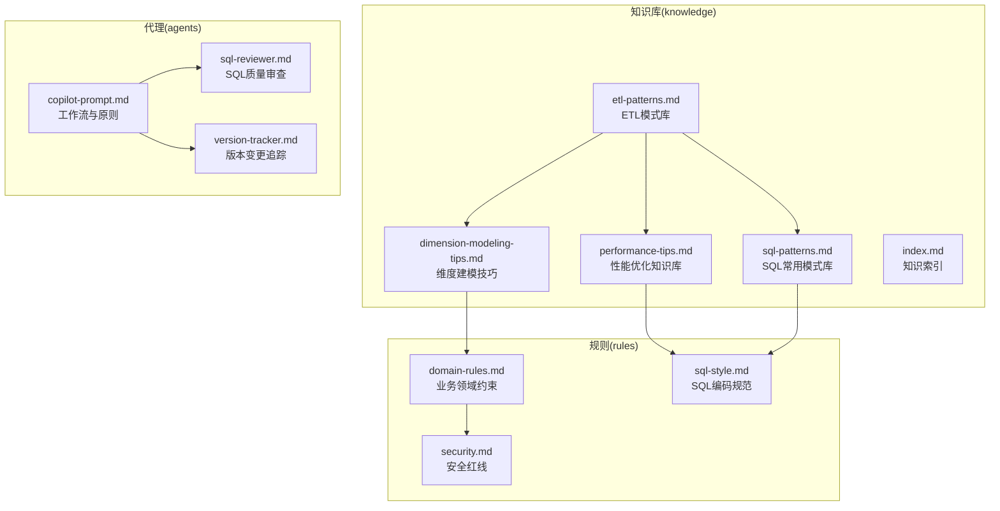

图表来源
- [etl-patterns.md:1-220](file://data_warehouse_engineering_code_copilot/knowledge/etl-patterns.md#L1-L220)
- [performance-tips.md:1-349](file://data_warehouse_engineering_code_copilot/knowledge/performance-tips.md#L1-L349)
- [sql-patterns.md:1-331](file://data_warehouse_engineering_code_copilot/knowledge/sql-patterns.md#L1-L331)
- [dimension-modeling-tips.md:1-253](file://data_warehouse_engineering_code_copilot/knowledge/dimension-modeling-tips.md#L1-L253)
- [index.md:1-60](file://data_warehouse_engineering_code_copilot/knowledge/index.md#L1-L60)
- [domain-rules.md:1-142](file://data_warehouse_engineering_code_copilot/rules/domain-rules.md#L1-L142)
- [security.md:1-98](file://data_warehouse_engineering_code_copilot/rules/security.md#L1-L98)
- [sql-style.md:1-254](file://data_warehouse_engineering_code_copilot/rules/sql-style.md#L1-L254)
- [copilot-prompt.md:1-147](file://data_warehouse_engineering_code_copilot/agents/copilot-prompt.md#L1-L147)
- [sql-reviewer.md:1-68](file://data_warehouse_engineering_code_copilot/agents/sql-reviewer.md#L1-L68)
- [version-tracker.md:1-120](file://data_warehouse_engineering_code_copilot/agents/version-tracker.md#L1-L120)

章节来源
- [index.md:1-60](file://data_warehouse_engineering_code_copilot/knowledge/index.md#L1-L60)

## 核心组件
- ETL模式库：覆盖CDC、JDBC增量、MERGE/UPSERT、小文件控制、历史回刷、文件接入、API拉取、全量/增量/CDC选型、数据漂移与时区处理
- SQL模式库：提供去重保留最新、拉链表、同环比、TopN、累计求和、行转列/列转行、数据回刷幂等覆盖、Lambda（增量+全量合并）、缺失日期补齐、NULL安全比较等
- 性能优化知识库：分区裁剪、数据倾斜、Map Join/Broadcast Join、小文件问题、CTE物化策略、谓词下推与列裁剪、Join顺序与类型、窗口函数性能、存储格式与压缩、调度与资源、性能分析工具
- 维度建模技巧：代理键/业务键、SCD类型、桥接表、退化维度、一致性维度、事实表类型、维度分级、分层归属判定
- 业务领域规则：通用业务规则、KPI/指标定义标准、数据质量五大维度、历史数据约定、行业特定规则、跨系统口径一致性
- 安全红线：数据安全、字段级脱敏、行级权限、数据分级与访问控制、上线与发布安全、数据回刷安全、业务安全、跨境合规、安全审计
- SQL编码规范：命名约定、格式规范、编写原则、禁止事项、命名检查清单、常见错误对照
- Copilot工作流：Spec驱动、身份与原则、回答框架、命令体系、调试流程
- SQL质量审查：审查分级、性能审查清单、输出格式
- 版本变更追踪：触发时机、路径初始化、变更条目格式、记录规则

章节来源
- [etl-patterns.md:1-220](file://data_warehouse_engineering_code_copilot/knowledge/etl-patterns.md#L1-L220)
- [sql-patterns.md:1-331](file://data_warehouse_engineering_code_copilot/knowledge/sql-patterns.md#L1-L331)
- [performance-tips.md:1-349](file://data_warehouse_engineering_code_copilot/knowledge/performance-tips.md#L1-L349)
- [dimension-modeling-tips.md:1-253](file://data_warehouse_engineering_code_copilot/knowledge/dimension-modeling-tips.md#L1-L253)
- [domain-rules.md:1-142](file://data_warehouse_engineering_code_copilot/rules/domain-rules.md#L1-L142)
- [security.md:1-98](file://data_warehouse_engineering_code_copilot/rules/security.md#L1-L98)
- [sql-style.md:1-254](file://data_warehouse_engineering_code_copilot/rules/sql-style.md#L1-L254)
- [copilot-prompt.md:1-147](file://data_warehouse_engineering_code_copilot/agents/copilot-prompt.md#L1-L147)
- [sql-reviewer.md:1-68](file://data_warehouse_engineering_code_copilot/agents/sql-reviewer.md#L1-L68)
- [version-tracker.md:1-120](file://data_warehouse_engineering_code_copilot/agents/version-tracker.md#L1-L120)

## 架构总览
下图展示了ETL模式库在数仓工程中的位置与相互关系，以及与性能优化、SQL模式、维度建模、规则与Agent的协同。

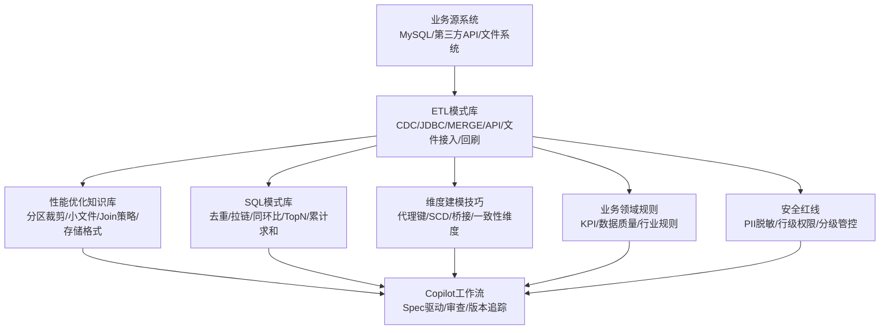

图表来源
- [etl-patterns.md:1-220](file://data_warehouse_engineering_code_copilot/knowledge/etl-patterns.md#L1-L220)
- [performance-tips.md:1-349](file://data_warehouse_engineering_code_copilot/knowledge/performance-tips.md#L1-L349)
- [sql-patterns.md:1-331](file://data_warehouse_engineering_code_copilot/knowledge/sql-patterns.md#L1-L331)
- [dimension-modeling-tips.md:1-253](file://data_warehouse_engineering_code_copilot/knowledge/dimension-modeling-tips.md#L1-L253)
- [domain-rules.md:1-142](file://data_warehouse_engineering_code_copilot/rules/domain-rules.md#L1-L142)
- [security.md:1-98](file://data_warehouse_engineering_code_copilot/rules/security.md#L1-L98)
- [copilot-prompt.md:1-147](file://data_warehouse_engineering_code_copilot/agents/copilot-prompt.md#L1-L147)

## 详细组件分析

### CDC增量同步（Flink CDC + Kafka + Iceberg/Hudi）
- 场景：对延迟敏感的业务表（订单、支付）实时同步至数仓，并保留历史每条变更
- 拓扑：MySQL binlog → Flink CDC Source → Kafka（原始流）→ Flink ETL → Iceberg/Hudi（MOR）；同时写入ODS增量表（按dt分区）
- 关键约定：
  - 位点保护：Checkpoint周期建议30s~60s，state backend选RocksDB
  - op字段：保留+I/-U/+U/-D四种事件，下游可还原全量
  - 幂等：Hudi/Iceberg主键upsert；Hive增量表落binlog原始事件，由ODS合并任务做去重
  - 回放：保留Kafka topic不少于7天，故障时按位点重放
- 踩坑：
  - binlog中ts字段是事件时间，不是事务提交时间。强一致排序需结合gtid+bin_pos+op_seq
  - 大事务（DDL/批量update）会瞬间产生海量binlog，需要监控lag
  - MySQL主备切换时位点会跳变，订阅端需要做GTID校验

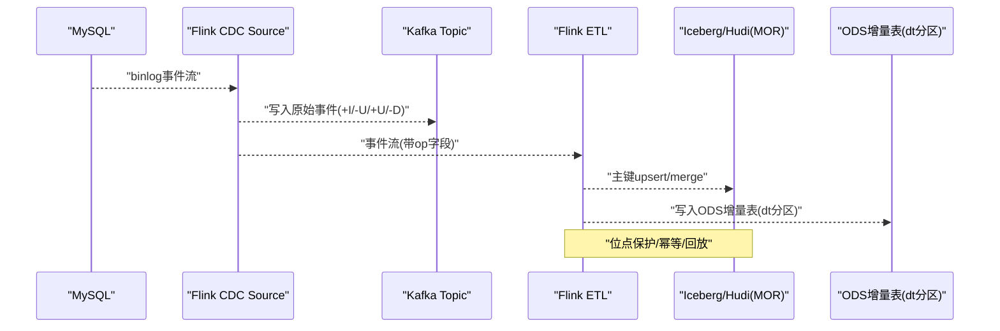

图表来源
- [etl-patterns.md:6-27](file://data_warehouse_engineering_code_copilot/knowledge/etl-patterns.md#L6-L27)

章节来源
- [etl-patterns.md:6-27](file://data_warehouse_engineering_code_copilot/knowledge/etl-patterns.md#L6-L27)

### JDBC增量抽取（DataX/SeaTunnel）
- 场景：对实时性要求一般的业务表（每日T+1），用基于update_time水位的批量抽取
- 关键SQL：在DataX/SeaTunnel的querySql中按update_time范围抽取
- 关键约定：
  - 水位字段：必须单调递增、有索引、与业务事件时间一致；推荐update_time而非create_time
  - 重叠窗口：跨天边界抽取建议有5~30分钟重叠+ODS去重，避免漏数
  - 网络与并发：DataX channel数与源端连接池容量匹配；大表用splitPk分片
  - 幂等：写入侧用INSERT OVERWRITE PARTITION (dt='${bizdate}')
- 踩坑：
  - 用create_time做水位会漏掉历史数据的字段更新
  - 源端update_time不更新（如某些枚举切换走存储过程）会丢更新
  - 时区不一致（业务库+00:00，数仓+08:00）会导致跨日丢数

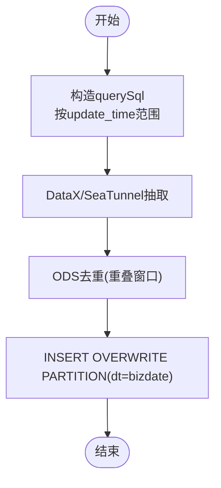

图表来源
- [etl-patterns.md:30-54](file://data_warehouse_engineering_code_copilot/knowledge/etl-patterns.md#L30-L54)

章节来源
- [etl-patterns.md:30-54](file://data_warehouse_engineering_code_copilot/knowledge/etl-patterns.md#L30-L54)

### MERGE/UPSERT（基于主键的幂等写入）
- 场景：对支持ACID的存储（Hudi/Iceberg/Delta/MaxCompute Transaction Table）做主键幂等写入
- 代码：以Iceberg/Spark为例的MERGE语法，按主键匹配并更新最新记录
- 关键约定：
  - 乱序保护：必须用s.update_time > t.update_time避免被后到的旧事件覆盖
  - 冲突处理：源端如有重复主键，先在USING子查询里ROW_NUMBER去重
  - 小文件：开启compaction（Hudi clustering、Iceberg rewrite_data_files）
- 踩坑：
  - Hive非事务表不支持MERGE，会被解析为INSERT，产生重复
  - 频繁UPSERT产生大量删除标记文件，需要定期合并

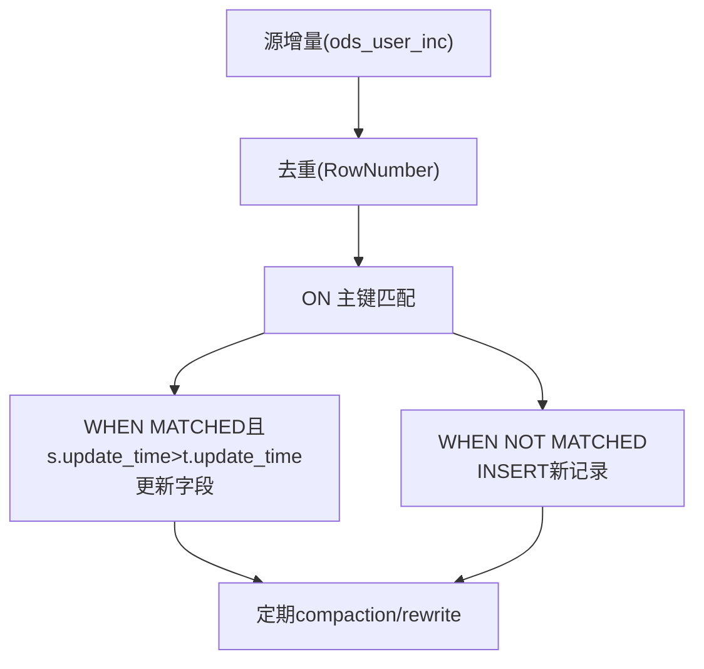

图表来源
- [etl-patterns.md:57-87](file://data_warehouse_engineering_code_copilot/knowledge/etl-patterns.md#L57-L87)
- [sql-patterns.md:6-39](file://data_warehouse_engineering_code_copilot/knowledge/sql-patterns.md#L6-L39)

章节来源
- [etl-patterns.md:57-87](file://data_warehouse_engineering_code_copilot/knowledge/etl-patterns.md#L57-L87)
- [sql-patterns.md:6-39](file://data_warehouse_engineering_code_copilot/knowledge/sql-patterns.md#L6-L39)

### 小文件控制
- 场景：Spark/Hive输出端reduce数过多，导致下游小文件爆炸
- 解决思路：
  - Hive：手动控制reduce数；通过DISTRIBUTE BY强制散列；动态合并
  - Spark：AQE自适应合并；按目标文件大小估算桶数
- 阈值建议：
  - 单文件目标大小：128MB~256MB（HDFS/OSS）
  - 单分区文件数：建议<50
- 踩坑：
  - 一刀切设置mapreduce.job.reduces=1会导致最后阶段单点
  - AQE在Spark 3.0之前默认关闭，旧版需要手动开启

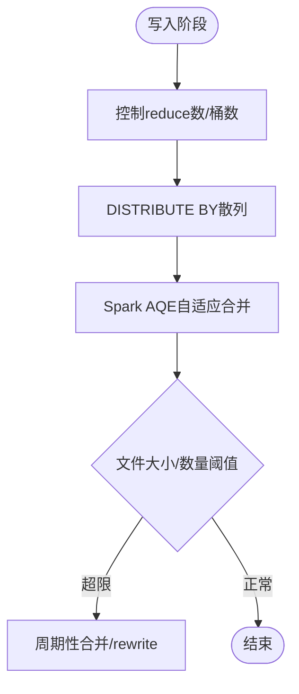

图表来源
- [etl-patterns.md:90-120](file://data_warehouse_engineering_code_copilot/knowledge/etl-patterns.md#L90-L120)
- [performance-tips.md:138-164](file://data_warehouse_engineering_code_copilot/knowledge/performance-tips.md#L138-L164)

章节来源
- [etl-patterns.md:90-120](file://data_warehouse_engineering_code_copilot/knowledge/etl-patterns.md#L90-L120)
- [performance-tips.md:138-164](file://data_warehouse_engineering_code_copilot/knowledge/performance-tips.md#L138-L164)

### 历史回刷（分批+进度跟踪）
- 场景：口径调整需要回刷过去N个月的分区，单次执行体量过大
- 推荐流程：
  1) 确认范围：列出受影响表与分区
  2) 确认依赖：构建依赖DAG，确认上游ODS/DIM数据齐备
  3) 试点：先回刷最近7天，对比指标，确认口径一致
  4) 分批执行：每批N个分区，控制并发不影响日常作业
  5) 进度追踪：用一张状态表记录每个分区状态（pending/running/success/failed）
  6) 失败处理：单分区失败重试3次后告警
- 进度状态表示例：包含refresh_id、table_name、dt、status、start_time、end_time、rows_count、err_msg等字段
- 踩坑：
  - 一次性回刷上千分区会把队列资源吃光，影响日常基线
  - 回刷期间下游会读到不一致数据，建议加"回刷中"标记并通知下游

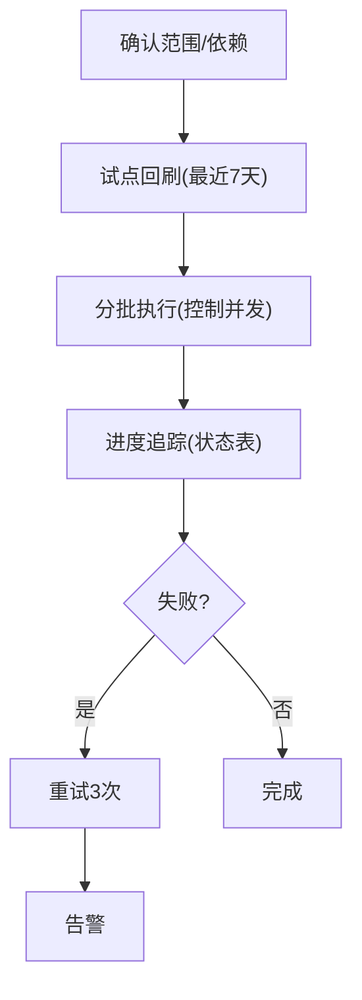

图表来源
- [etl-patterns.md:122-152](file://data_warehouse_engineering_code_copilot/knowledge/etl-patterns.md#L122-L152)

章节来源
- [etl-patterns.md:122-152](file://data_warehouse_engineering_code_copilot/knowledge/etl-patterns.md#L122-L152)

### 文件接入（CSV/Excel/JSON）
- 场景：合作方按日推送CSV/Excel文件，需要解析、校验、入库
- 关键约定：
  - 目录约定：按日期分文件夹/landing/{system}/{table}/dt=YYYYMMDD/
  - 完成标记：等待_SUCCESS文件再触发解析，避免读到半文件
  - 编码：CSV显式指定UTF-8/GBK；Excel用XLSX而非XLS
  - schema校验：列数、列名、类型不一致时阻断+告警
  - bad record隔离：解析失败的行单独落到*_error表，不阻塞主流程
- 踩坑：
  - Excel中文本数字（如手机号）被自动转科学计数法
  - CSV中字段含逗号但未转义，会错列
  - 文件名时间戳与数据日期不一致时，需要约定以哪个为准

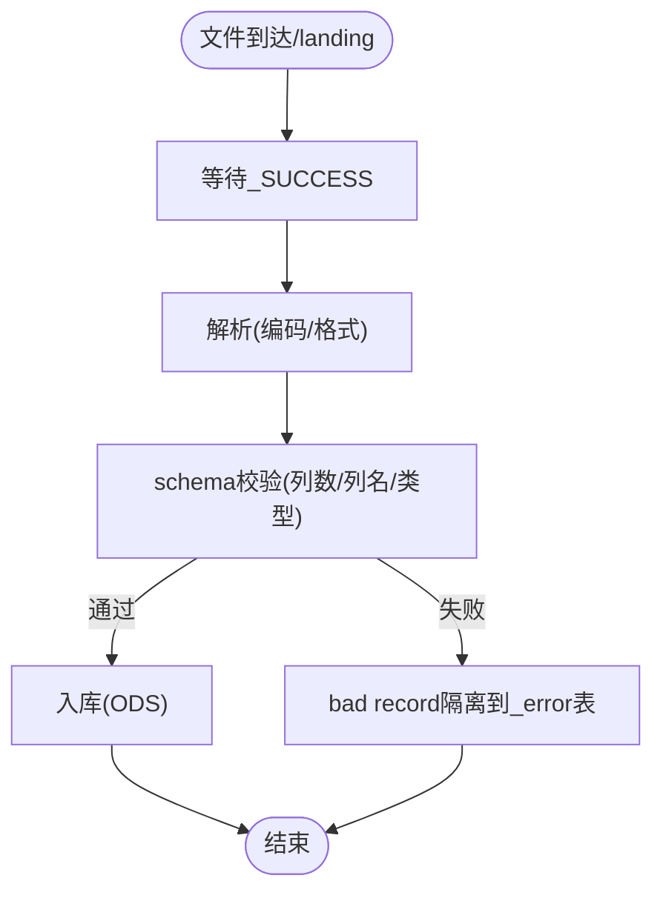

图表来源
- [etl-patterns.md:155-171](file://data_warehouse_engineering_code_copilot/knowledge/etl-patterns.md#L155-L171)

章节来源
- [etl-patterns.md:155-171](file://data_warehouse_engineering_code_copilot/knowledge/etl-patterns.md#L155-L171)

### API拉取（REST/GraphQL）
- 场景：从三方SaaS（如广告平台、CRM）拉取数据，多为分页+Token鉴权
- 关键约定：
  - 限流：尊重API rate limit，使用token bucket
  - 重试：5xx/429退避重试；4xx直接告警
  - 断点续传：保存cursor/next_token，避免全量重拉
  - 变更追踪：能取增量就用增量参数（since/updated_after）
  - schema漂移：保留原始JSON列raw_payload，便于回溯字段新增/调整
- 踩坑：
  - Token写在代码或脚本里→必须走密钥管理服务
  - API返回字段大小写不一致（snake/camel），统一在ODS入库时规范化

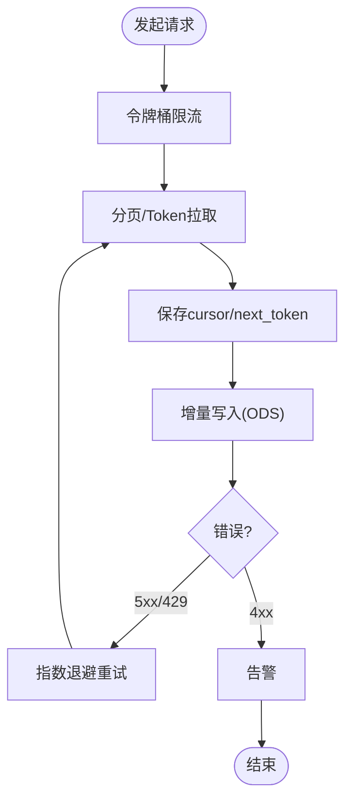

图表来源
- [etl-patterns.md:174-189](file://data_warehouse_engineering_code_copilot/knowledge/etl-patterns.md#L174-L189)

章节来源
- [etl-patterns.md:174-189](file://data_warehouse_engineering_code_copilot/knowledge/etl-patterns.md#L174-L189)

### 全量 vs 增量 vs CDC选型对照
- 维度对比：实时性、源端压力、数据完整性、实现复杂度、历史变更追踪、适用规模、工具栈
- 适用建议：
  - 小表（<100万行）：全量抽取
  - 中等规模且需要变更追踪：CDC
  - 实时性要求一般（T+1）：JDBC增量

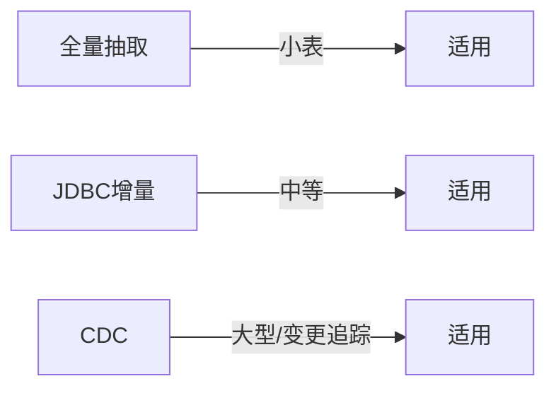

图表来源
- [etl-patterns.md:192-204](file://data_warehouse_engineering_code_copilot/knowledge/etl-patterns.md#L192-L204)

章节来源
- [etl-patterns.md:192-204](file://data_warehouse_engineering_code_copilot/knowledge/etl-patterns.md#L192-L204)

### 数据漂移与时区处理
- 场景：跨时区业务（出海）按"业务自然日"切分时与数据落库时间不一致
- 关键约定：
  - 存储：所有时间字段存储为UTC，并附带tz列或local_dt派生列
  - 分区：按业务日（local_dt）分区，而非数据落库时间
  - 报表：明确每个指标的时区口径（北京时间/UTC/本地时区）
  - 跨日订单：以下单时区的自然日为准
- 踩坑：
  - 业务库datetime（无时区）+数仓timestamp（UTC）混用→必须显式转换
  - 夏令时国家（如美国）跨日订单会有23/25小时的日，注意聚合时不要硬编码24

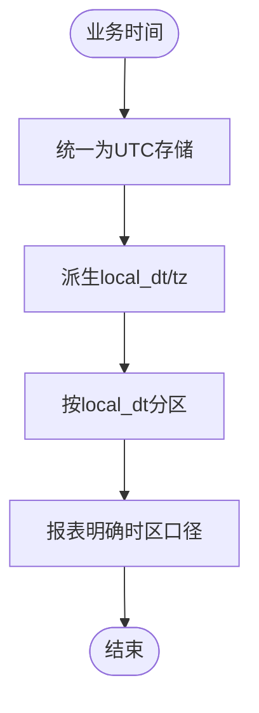

图表来源
- [etl-patterns.md:206-220](file://data_warehouse_engineering_code_copilot/knowledge/etl-patterns.md#L206-L220)

章节来源
- [etl-patterns.md:206-220](file://data_warehouse_engineering_code_copilot/knowledge/etl-patterns.md#L206-L220)

## 依赖分析
- ETL模式与SQL模式的耦合：ETL产出ODS后，DWD/DWS/ADS层通过SQL模式进行清洗、聚合与指标计算
- 性能优化与ETL的耦合：分区裁剪、小文件控制、Join策略直接影响ETL执行成本与稳定性
- 维度建模与ETL的耦合：维度表的SCD策略、一致性维度设计影响ETL的join与回刷策略
- 规则与ETL的耦合：业务领域规则（KPI口径、数据质量、行业规则）指导ETL的字段与分区设计
- 安全与ETL的耦合：PII脱敏、行级权限、分级管控贯穿ETL各环节
- Agent与ETL的耦合：Copilot工作流确保ETL变更受Spec驱动、审查与版本追踪

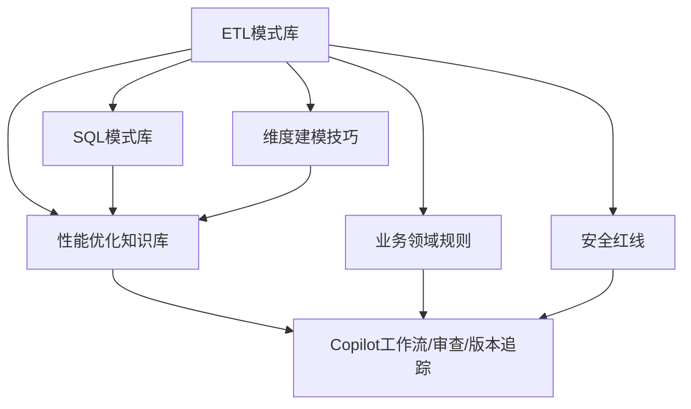

图表来源
- [etl-patterns.md:1-220](file://data_warehouse_engineering_code_copilot/knowledge/etl-patterns.md#L1-L220)
- [performance-tips.md:1-349](file://data_warehouse_engineering_code_copilot/knowledge/performance-tips.md#L1-L349)
- [sql-patterns.md:1-331](file://data_warehouse_engineering_code_copilot/knowledge/sql-patterns.md#L1-L331)
- [dimension-modeling-tips.md:1-253](file://data_warehouse_engineering_code_copilot/knowledge/dimension-modeling-tips.md#L1-L253)
- [domain-rules.md:1-142](file://data_warehouse_engineering_code_copilot/rules/domain-rules.md#L1-L142)
- [security.md:1-98](file://data_warehouse_engineering_code_copilot/rules/security.md#L1-L98)
- [copilot-prompt.md:1-147](file://data_warehouse_engineering_code_copilot/agents/copilot-prompt.md#L1-L147)

## 性能考量
- 分区裁剪：WHERE条件直接命中分区字段，禁止用函数包裹；验证执行计划中的PartitionFilters/DataFilters
- 数据倾斜：热点key、高频空值/默认值、时间集中；解决方案包括过滤单独处理、加盐打散、Map Join小表
- Map Join/Broadcast Join：小表广播避免Shuffle；阈值建议（Hive/Spark/Trino）；注意driver内存
- 小文件问题：输出端控制reduce数/桶数、Spark AQE自适应合并、周期性合并/rewrite
- CTE物化策略：Hive/Spark默认不物化，Snowflake默认物化；复杂CTE建议先落临时表
- 谓词下推与列裁剪：WHERE下推到数据源层，列裁剪减少扫描；避免UDF导致下推失效
- Join顺序与类型：Hive on MR左大右小；Spark/Trino CBO自动选；Bucket Join跳过Shuffle
- 窗口函数性能：PARTITION BY列基数适中；配合DISTRIBUTE BY/SORT BY
- 存储格式与压缩：ORC/Parquet列存收益显著；ZSTD压缩率高
- 调度与资源：资源队列划分、错峰调度、依赖紧凑、SLA基线、失败重试策略
- 性能分析工具：EXPLAIN执行计划、作业历史、Profile/Stage Metrics、数据采样

章节来源
- [performance-tips.md:1-349](file://data_warehouse_engineering_code_copilot/knowledge/performance-tips.md#L1-L349)

## 故障排查指南
- SQL质量审查：
  - Critical：计算结果错误、笛卡尔积/多对多膨胀、全表扫描大型分区表、主键重复、数据回刷未幂等、跨库引用未声明/PII未脱敏
  - Important：子查询未用CTE、重复计算未提取、字符串隐式类型转换、NULL处理缺失、WHERE写在ON阻断分区裁剪、未声明字段别名、复杂SQL缺少头部注释
  - Minor：关键字大小写不统一、缩进/换行风格不一致、字段顺序与DDL不一致、可合并的多次INSERT
- 性能审查清单：大型分区表是否分区裁剪、Join顺序、Map/Broadcast Join、数据倾斜风险、聚合是否下推、SELECT *、不必要的ORDER BY、DISTINCT是否可用GROUP BY替代、窗口函数PARTITION BY合理性、CTE物化情况
- Copilot调试流程：现象收集→根因定位→方案验证→实施修复；禁止在未确认根因前直接修改SQL/DDL/调度作业
- 版本变更追踪：每次DDL/SQL/ETL/调度变更后自动记录结构化变更条目，确保原子化、精确引用、任务可追溯、下游必标注、回刷必声明

章节来源
- [sql-reviewer.md:1-68](file://data_warehouse_engineering_code_copilot/agents/sql-reviewer.md#L1-L68)
- [copilot-prompt.md:133-147](file://data_warehouse_engineering_code_copilot/agents/copilot-prompt.md#L133-L147)
- [version-tracker.md:1-120](file://data_warehouse_engineering_code_copilot/agents/version-tracker.md#L1-L120)

## 结论
ETL模式库提供了从数据源接入到数仓分层加工的系统化方法论与最佳实践。通过结合性能优化、SQL模式、维度建模、业务规则与安全规范，并借助Copilot工作流与版本追踪Agent，能够有效提升ETL的稳定性、可维护性与可扩展性。在实际工程中，应依据业务实时性、数据规模与变更追踪需求，选择合适的ETL模式，并在设计阶段充分考虑幂等、回放、小文件控制、历史回刷与安全脱敏等关键要素。

## 附录
- SQL模式库：去重保留最新、拉链表（SCD2）、同环比、TopN、累计求和、行转列/列转行、数据回刷幂等覆盖、Lambda（增量+全量合并）、缺失日期补齐、NULL安全比较
- 维度建模技巧：代理键/业务键、SCD类型、桥接表、退化维度、一致性维度、事实表类型、维度分级、分层归属判定
- 业务领域规则：通用业务规则、KPI/指标定义标准、数据质量五大维度、历史数据约定、行业特定规则、跨系统口径一致性
- 安全红线：数据安全、字段级脱敏、行级权限、数据分级与访问控制、上线与发布安全、数据回刷安全、业务安全、跨境合规、安全审计
- SQL编码规范：命名约定、格式规范、编写原则、禁止事项、命名检查清单、常见错误对照

章节来源
- [sql-patterns.md:1-331](file://data_warehouse_engineering_code_copilot/knowledge/sql-patterns.md#L1-L331)
- [dimension-modeling-tips.md:1-253](file://data_warehouse_engineering_code_copilot/knowledge/dimension-modeling-tips.md#L1-L253)
- [domain-rules.md:1-142](file://data_warehouse_engineering_code_copilot/rules/domain-rules.md#L1-L142)
- [security.md:1-98](file://data_warehouse_engineering_code_copilot/rules/security.md#L1-L98)
- [sql-style.md:1-254](file://data_warehouse_engineering_code_copilot/rules/sql-style.md#L1-L254)