# ETL模式库

<cite>
**本文引用的文件**
- [etl-patterns.md](file://data_warehouse_engineering_code_copilot/knowledge/etl-patterns.md)
- [目录结构和设计说明.md](file://data_warehouse_engineering_code_copilot/目录结构和设计说明.md)
- [sql-patterns.md](file://data_warehouse_engineering_code_copilot/knowledge/sql-patterns.md)
- [performance-tips.md](file://data_warehouse_engineering_code_copilot/knowledge/performance-tips.md)
- [domain-rules.md](file://data_warehouse_engineering_code_copilot/rules/domain-rules.md)
- [spec.md](file://data_warehouse_engineering_code_copilot/changes/templates/spec.md)
- [tasks.md](file://data_warehouse_engineering_code_copilot/changes/templates/tasks.md)
</cite>

## 目录
1. [简介](#简介)
2. [项目结构](#项目结构)
3. [核心组件](#核心组件)
4. [架构总览](#架构总览)
5. [详细组件分析](#详细组件分析)
6. [依赖分析](#依赖分析)
7. [性能考量](#性能考量)
8. [故障排查指南](#故障排查指南)
9. [结论](#结论)
10. [附录](#附录)

## 简介
本ETL模式库面向数据仓库工程化实践，聚焦“全量同步”“增量同步”“CDC（变更数据捕获）”三大策略，配套幂等写入、小文件治理、历史回刷、文件与API接入等常见模式，提供从设计原理、实现要点、一致性与性能保障到错误处理与优化策略的完整指南。文档同时强调“Spec驱动 + 三段式知识库 + 强制变更追踪”的工程化方法论，帮助团队在复杂业务场景下稳定落地ETL方案。

## 项目结构
该仓库采用“Agent + 变更模板 + 知识库 + 规则”的组织方式，围绕ETL模式库沉淀可复用的经验与规范：
- agents：AI角色与提示词，辅助审查、优化、归档等流程
- changes/templates：变更需求、任务拆分、变更日志、验证规范模板
- knowledge：ETL模式库、SQL模式库、性能优化、维度建模技巧等
- rules：项目约束与规范（SQL风格、建模分层、调度运维、数据质量、安全、领域规则）

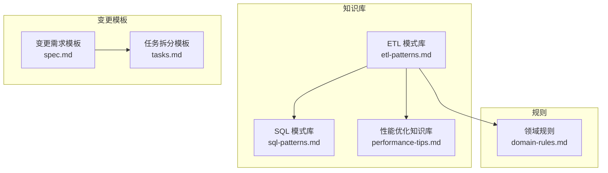

图表来源
- [目录结构和设计说明.md:21-55](file://data_warehouse_engineering_code_copilot/目录结构和设计说明.md#L21-L55)
- [etl-patterns.md:1-220](file://data_warehouse_engineering_code_copilot/knowledge/etl-patterns.md#L1-L220)
- [sql-patterns.md:1-331](file://data_warehouse_engineering_code_copilot/knowledge/sql-patterns.md#L1-L331)
- [performance-tips.md:1-349](file://data_warehouse_engineering_code_copilot/knowledge/performance-tips.md#L1-L349)
- [domain-rules.md:1-142](file://data_warehouse_engineering_code_copilot/rules/domain-rules.md#L1-L142)
- [spec.md:1-132](file://data_warehouse_engineering_code_copilot/changes/templates/spec.md#L1-L132)
- [tasks.md:1-74](file://data_warehouse_engineering_code_copilot/changes/templates/tasks.md#L1-L74)

章节来源
- [目录结构和设计说明.md:19-55](file://data_warehouse_engineering_code_copilot/目录结构和设计说明.md#L19-L55)

## 核心组件
- ETL模式库：覆盖CDC、JDBC增量、MERGE/UPSERT、小文件治理、历史回刷、文件接入、API拉取等
- SQL模式库：去重保留最新、拉链表（SCD2）、同环比、TopN、累计求和、行转列/列转行、数据回刷幂等覆盖、Lambda（全量+增量合并）、缺失日期补齐、NULL安全比较
- 性能优化知识库：分区裁剪、数据倾斜、Map Join、小文件、CTE物化、谓词下推与列裁剪、Join顺序与类型、窗口函数、存储格式与压缩、调度与资源、性能分析工具
- 领域规则：金额精度、百分比格式、时间维度、KPI口径、数据质量五大维度、跨系统一致性、行业特定规则
- 变更模板：Spec驱动的变更需求、任务拆分、变更日志与验证规范

章节来源
- [etl-patterns.md:1-220](file://data_warehouse_engineering_code_copilot/knowledge/etl-patterns.md#L1-L220)
- [sql-patterns.md:1-331](file://data_warehouse_engineering_code_copilot/knowledge/sql-patterns.md#L1-L331)
- [performance-tips.md:1-349](file://data_warehouse_engineering_code_copilot/knowledge/performance-tips.md#L1-L349)
- [domain-rules.md:1-142](file://data_warehouse_engineering_code_copilot/rules/domain-rules.md#L1-L142)
- [spec.md:1-132](file://data_warehouse_engineering_code_copilot/changes/templates/spec.md#L1-L132)
- [tasks.md:1-74](file://data_warehouse_engineering_code_copilot/changes/templates/tasks.md#L1-L74)

## 架构总览
ETL模式库在整体数仓工程化框架中的位置如下：
- 以“Spec驱动 + 三段式知识库 + 强制变更追踪”为核心，ETL模式库作为“经验”层，沉淀可复用的接入与同步策略
- 与SQL模式库协同，保障ODS/DWD/DWS/ADS各层的幂等写入、一致性与性能
- 与性能优化知识库联动，指导分区裁剪、小文件治理、Join优化、窗口函数与存储格式选择
- 与领域规则对接，确保金额精度、时间维度、KPI口径、数据质量与跨系统一致性
- 通过变更模板（Spec/Task/Log/Validation）实现“需求 → 规划 → 实施 → 审查 → 归档”的闭环

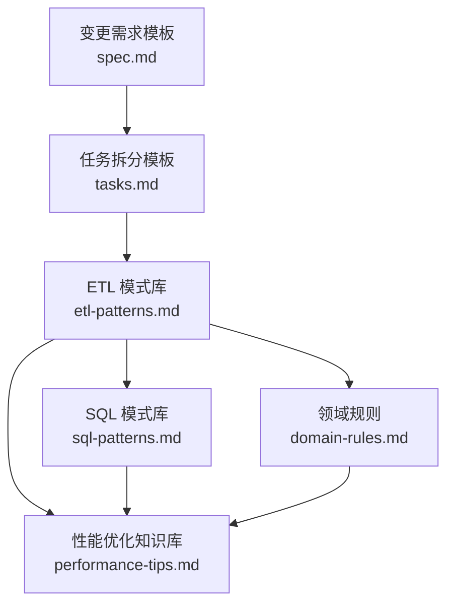

图表来源
- [目录结构和设计说明.md:70-78](file://data_warehouse_engineering_code_copilot/目录结构和设计说明.md#L70-L78)
- [spec.md:1-132](file://data_warehouse_engineering_code_copilot/changes/templates/spec.md#L1-L132)
- [tasks.md:1-74](file://data_warehouse_engineering_code_copilot/changes/templates/tasks.md#L1-L74)
- [etl-patterns.md:1-220](file://data_warehouse_engineering_code_copilot/knowledge/etl-patterns.md#L1-L220)
- [sql-patterns.md:1-331](file://data_warehouse_engineering_code_copilot/knowledge/sql-patterns.md#L1-L331)
- [performance-tips.md:1-349](file://data_warehouse_engineering_code_copilot/knowledge/performance-tips.md#L1-L349)
- [domain-rules.md:1-142](file://data_warehouse_engineering_code_copilot/rules/domain-rules.md#L1-L142)

## 详细组件分析

### 组件A：CDC 增量同步（Flink CDC + Kafka + Iceberg/Hudi）
- 设计原理
  - 基于MySQL binlog的事件流，实现实时/近实时的增量同步
  - 通过op字段保留四种事件类型，下游可还原全量
  - 采用主键upsert实现幂等写入，支持回放与位点保护
- 关键约定
  - Checkpoint周期与RocksDB状态后端
  - 保留op字段用于事件还原
  - 幂等写入（Hudi/Iceberg主键upsert；Hive增量表由ODS合并任务去重）
  - Kafka保留不少于7天，故障时按位点重放
- 适用场景
  - 对延迟敏感的业务表（订单、支付）实时同步至数仓
- 优缺点
  - 优点：实时性强、事件完整、可回放
  - 缺点：实现复杂度高、源端binlog位点管理复杂
- 性能与一致性
  - 位点保护与op字段保证一致性
  - 大事务会产生海量binlog，需监控lag
- 错误处理
  - 主备切换位点跳变需GTID校验
  - binlog ts字段为事件时间，非事务提交时间，需结合gtid+bin_pos+op_seq实现强一致排序

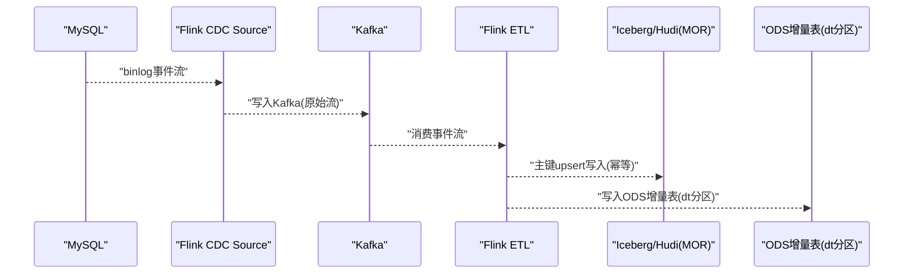

图表来源
- [etl-patterns.md:11-21](file://data_warehouse_engineering_code_copilot/knowledge/etl-patterns.md#L11-L21)

章节来源
- [etl-patterns.md:6-27](file://data_warehouse_engineering_code_copilot/knowledge/etl-patterns.md#L6-L27)

### 组件B：JDBC 增量抽取（DataX / SeaTunnel）
- 设计原理
  - 基于update_time水位的批量抽取，每日T+1
  - 抽取SQL按bizdate边界构造，支持跨天重叠窗口与ODS去重
- 关键约定
  - 水位字段需单调递增、有索引、与业务事件时间一致
  - 跨天边界建议5~30分钟重叠 + ODS去重
  - DataX channel数与源端连接池匹配；大表用splitPk分片
  - 写入侧用INSERT OVERWRITE PARTITION(dt=bizdate)实现幂等
- 适用场景
  - 对实时性要求一般的业务表（每日T+1）
- 优缺点
  - 优点：实现简单、源端压力适中
  - 缺点：实时性不如CDC；依赖水位字段的正确性
- 性能与一致性
  - 水位字段时区不一致会导致跨日丢数
  - 大事务或DDL会瞬时产生海量更新，需监控lag
- 错误处理
  - update_time不更新（如枚举切换走存储过程）会丢更新
  - 时区不一致会导致跨日丢数

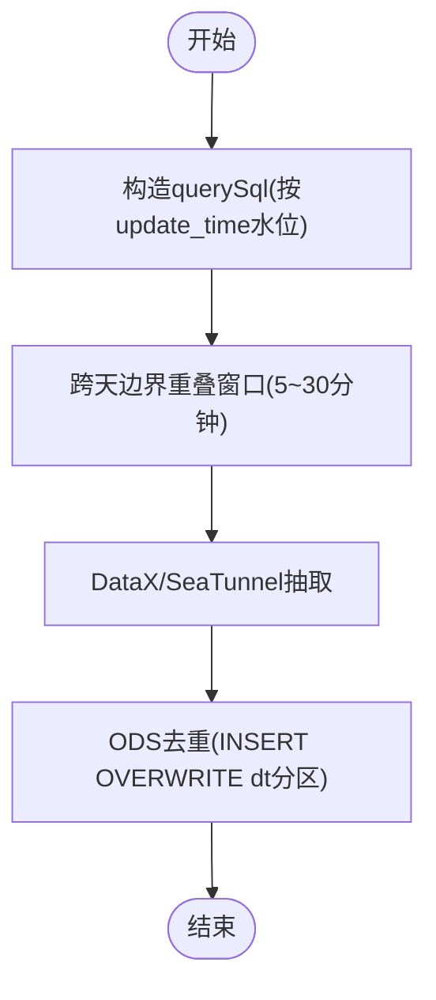

图表来源
- [etl-patterns.md:35-48](file://data_warehouse_engineering_code_copilot/knowledge/etl-patterns.md#L35-L48)

章节来源
- [etl-patterns.md:30-54](file://data_warehouse_engineering_code_copilot/knowledge/etl-patterns.md#L30-L54)

### 组件C：MERGE / UPSERT（基于主键的幂等写入）
- 设计原理
  - 在支持ACID的存储（Hudi/Iceberg/Delta/MaxCompute事务表）上按主键upsert
  - 使用s.update_time > t.update_time避免后到旧事件覆盖
- 关键约定
  - 乱序保护：使用时间戳比较
  - 冲突处理：源端重复主键先在USING子查询中ROW_NUMBER去重
  - 小文件：开启compaction（Hudi clustering、Iceberg rewrite_data_files）
- 适用场景
  - 需要主键幂等写入且支持ACID的存储
- 优缺点
  - 优点：幂等、可处理乱序
  - 缺点：频繁upsert会产生删除标记文件，需定期合并
- 性能与一致性
  - 频繁UPSERT会产生大量删除标记文件，需定期合并
  - Hive非事务表不支持MERGE，会被解析为INSERT，产生重复
- 错误处理
  - 源端重复主键需先去重
  - 非事务表需改用INSERT OVERWRITE或ODS合并任务

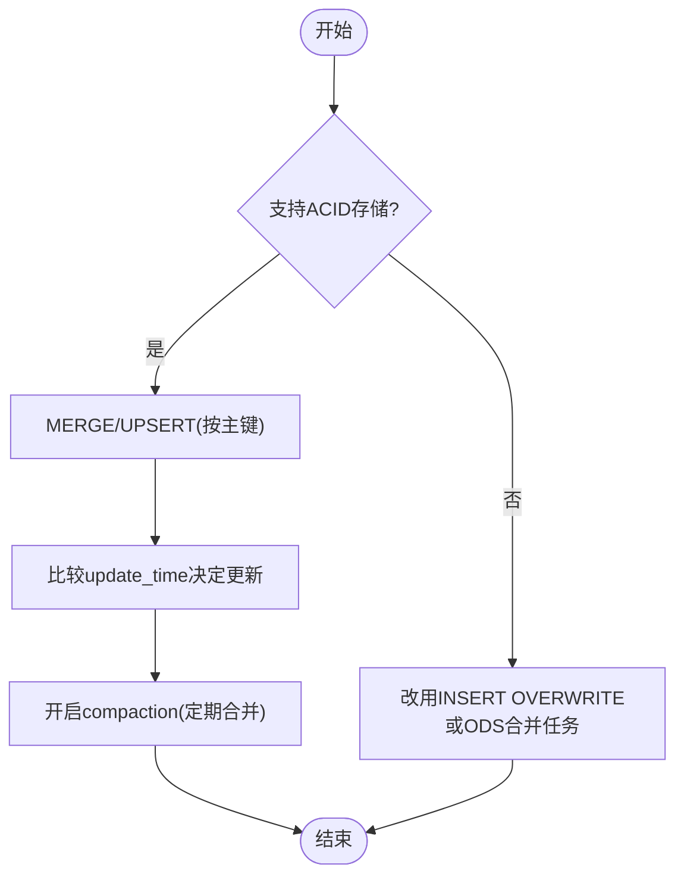

图表来源
- [etl-patterns.md:62-82](file://data_warehouse_engineering_code_copilot/knowledge/etl-patterns.md#L62-L82)

章节来源
- [etl-patterns.md:57-87](file://data_warehouse_engineering_code_copilot/knowledge/etl-patterns.md#L57-L87)

### 组件D：小文件控制
- 设计原理
  - 通过控制reduce数、DISTRIBUTE BY散列、AQE动态合并等方式减少小文件
- 关键约定
  - 单文件目标大小：128MB~256MB；单分区文件数建议<50
  - Hive手动控制reduce数；Spark开启AQE自适应合并
- 适用场景
  - Spark/Hive输出端reduce数过多导致小文件爆炸
- 优缺点
  - 优点：降低NameNode压力、提升查询性能
  - 缺点：过度合并会影响并行度
- 性能与一致性
  - AQE在Spark 3.0之前默认关闭，需手动开启
- 错误处理
  - 一刀切设置reduce=1会导致最后阶段单点

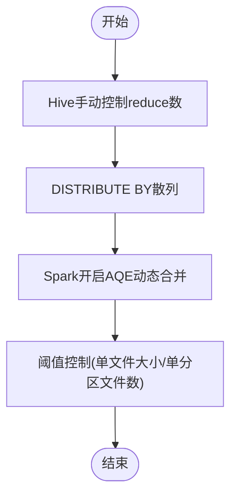

图表来源
- [etl-patterns.md:95-110](file://data_warehouse_engineering_code_copilot/knowledge/etl-patterns.md#L95-L110)

章节来源
- [etl-patterns.md:90-119](file://data_warehouse_engineering_code_copilot/knowledge/etl-patterns.md#L90-L119)

### 组件E：历史回刷（分批 + 进度跟踪）
- 设计原理
  - 口径调整需要回刷过去N个月的分区，单次体量过大
  - 通过确认范围、构建依赖DAG、试点、分批执行、进度追踪与失败重试实现
- 关键约定
  - 进度状态表记录pending/running/success/failed
  - 单分区失败重试3次后告警
- 适用场景
  - 口径调整导致的历史分区回刷
- 优缺点
  - 优点：可控、可追踪、可回放
  - 缺点：影响日常基线，需错峰执行
- 性能与一致性
  - 一次性回刷上千分区会占用大量队列资源
  - 回刷期间下游会读到不一致数据，建议加“回刷中”标记并通知下游
- 错误处理
  - 失败重试3次后告警，避免无限重试

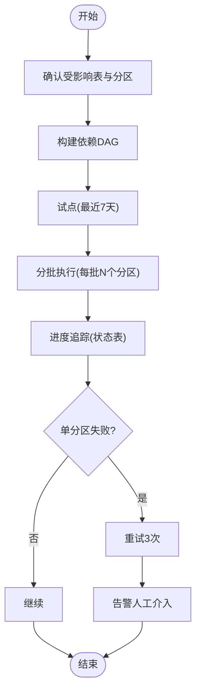

图表来源
- [etl-patterns.md:127-134](file://data_warehouse_engineering_code_copilot/knowledge/etl-patterns.md#L127-L134)

章节来源
- [etl-patterns.md:122-152](file://data_warehouse_engineering_code_copilot/knowledge/etl-patterns.md#L122-L152)

### 组件F：文件接入（CSV/Excel/JSON）
- 设计原理
  - 合作方按日推送文件，需解析、校验、入库
- 关键约定
  - 目录约定：按日期分文件夹/landing/{system}/{table}/dt=YYYYMMDD/
  - 完成标记：等待_SUCCESS文件再触发解析
  - 编码：CSV显式UTF-8/GBK；Excel用XLSX而非XLS
  - schema校验：列数、列名、类型不一致时阻断+告警
  - bad record隔离：解析失败的行落到*_error表
- 适用场景
  - 合作方按日推送CSV/Excel文件
- 优缺点
  - 优点：接入灵活
  - 缺点：文件格式与编码问题较多
- 性能与一致性
  - Excel中文本数字可能被转科学计数法
  - CSV字段含逗号未转义会错列
- 错误处理
  - 文件名时间戳与数据日期不一致时需约定以哪个为准

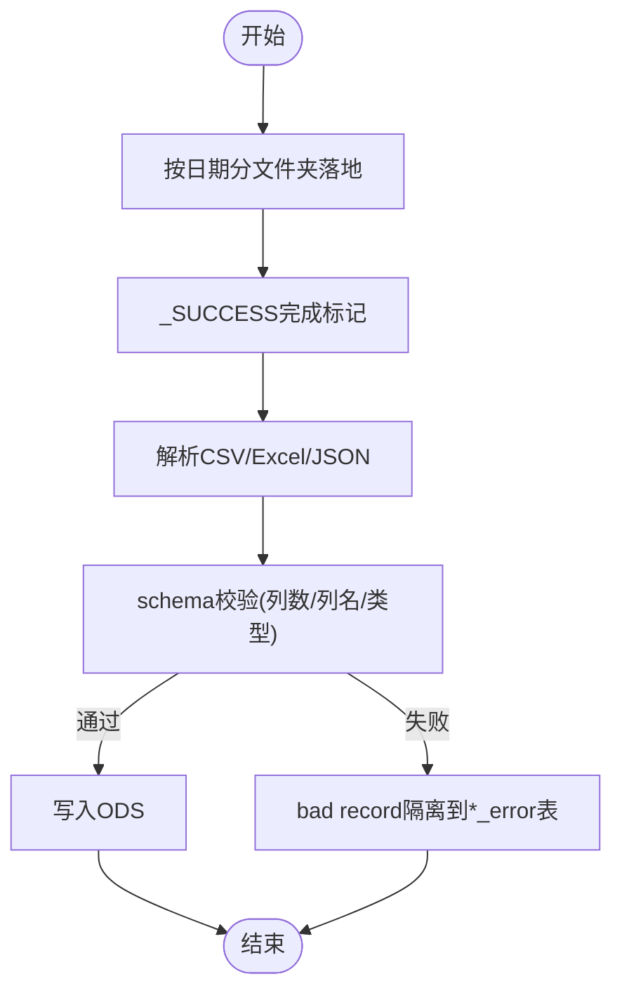

图表来源
- [etl-patterns.md:160-166](file://data_warehouse_engineering_code_copilot/knowledge/etl-patterns.md#L160-L166)

章节来源
- [etl-patterns.md:155-171](file://data_warehouse_engineering_code_copilot/knowledge/etl-patterns.md#L155-L171)

### 组件G：API 拉取（REST/GraphQL）
- 设计原理
  - 从三方SaaS拉取数据，多为分页+Token鉴权
- 关键约定
  - 限流：尊重API rate limit，使用token bucket
  - 重试：5xx/429退避重试；4xx直接告警
  - 断点续传：保存cursor/next_token，避免全量重拉
  - 变更追踪：能取增量就用since/updated_after
  - schema漂移：保留原始JSON列raw_payload，便于回溯字段新增/调整
- 适用场景
  - 从三方SaaS（广告平台、CRM）拉取数据
- 优缺点
  - 优点：标准化接口、可增量
  - 缺点：API限制与鉴权复杂
- 性能与一致性
  - Token需走密钥管理服务
  - 字段大小写不一致需在ODS入库时规范化
- 错误处理
  - Token泄露风险需通过密钥管理服务管控
  - 字段大小写不一致需统一规范化

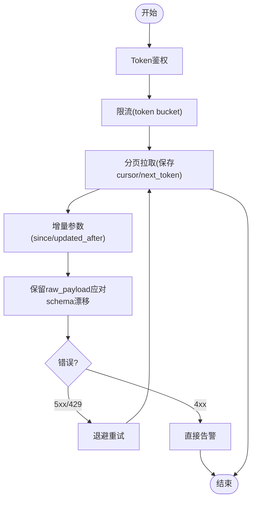

图表来源
- [etl-patterns.md:179-184](file://data_warehouse_engineering_code_copilot/knowledge/etl-patterns.md#L179-L184)

章节来源
- [etl-patterns.md:174-189](file://data_warehouse_engineering_code_copilot/knowledge/etl-patterns.md#L174-L189)

### 组件H：全量 vs 增量 vs CDC 选型对照
- 选型维度
  - 实时性：全量T+1；JDBC增量T+1（小时级）；CDC秒级~分钟级
  - 源端压力：全量高；JDBC中；CDC低
  - 数据完整性：全量高；JDBC中；CDC高
  - 实现复杂度：全量低；JDBC低；CDC高
  - 历史变更追踪：全量无；JDBC弱；CDC强
  - 适用规模：全量小表(<100万行)；JDBC中等；CDC大型/需要变更追踪
  - 工具：全量DataX/SeaTunnel；JDBCDataX/SeaTunnel；CDC Flink CDC/Debezium

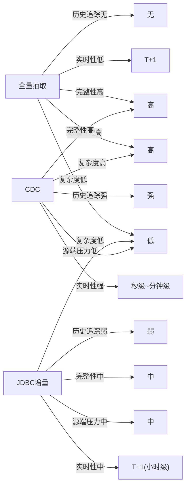

图表来源
- [etl-patterns.md:192-203](file://data_warehouse_engineering_code_copilot/knowledge/etl-patterns.md#L192-L203)

章节来源
- [etl-patterns.md:192-203](file://data_warehouse_engineering_code_copilot/knowledge/etl-patterns.md#L192-L203)

### 组件I：数据漂移与时区处理
- 设计原理
  - 跨时区业务按“业务自然日”切分时与数据落库时间不一致
- 关键约定
  - 存储：所有时间字段存储为UTC，并附带tz列或local_dt派生列
  - 分区：按业务日(local_dt)分区，而非数据落库时间
  - 报表：明确每个指标的时区口径（北京时间/UTC/本地时区）
  - 跨日订单：以下单时区的自然日为准
- 适用场景
  - 出海业务按业务自然日切分
- 优缺点
  - 优点：统一口径、避免跨日错配
  - 缺点：需在入库与报表层统一处理
- 性能与一致性
  - 业务库datetime(无时区)+数仓timestamp(UTC)混用必须显式转换
  - 夏令时国家跨日订单会有23/25小时日，聚合时不要硬编码24

章节来源
- [etl-patterns.md:206-220](file://data_warehouse_engineering_code_copilot/knowledge/etl-patterns.md#L206-L220)

## 依赖分析
- 组件耦合与内聚
  - ETL模式库内部高度内聚，围绕“接入/同步/幂等/回放/回刷/文件/API”形成完整闭环
  - 与SQL模式库耦合：去重保留最新、拉链表、回刷幂等覆盖等SQL模式广泛应用于ODS/DWD层
  - 与性能优化知识库耦合：分区裁剪、小文件治理、Join优化、窗口函数、存储格式等贯穿ETL全流程
  - 与领域规则耦合：金额精度、时间维度、KPI口径、数据质量、跨系统一致性等约束ETL实现
- 外部依赖与集成点
  - 工具栈：DataX/SeaTunnel、Flink CDC、dbt、Spark、Iceberg/Hudi/Delta
  - Kafka：CDC事件流的缓冲与回放
  - Hive/Spark：批处理与分布式计算
- 接口契约与实现细节
  - CDC：op字段、位点保护、回放窗口
  - JDBC增量：update_time水位、跨天重叠、幂等覆盖
  - MERGE/UPSERT：主键upsert、时间戳比较、compaction
  - 小文件：reduce数、DISTRIBUTE BY、AQE合并
  - 历史回刷：状态表、重试策略、错峰执行
  - 文件接入：目录约定、完成标记、schema校验、bad record隔离
  - API拉取：限流、重试、断点续传、schema漂移

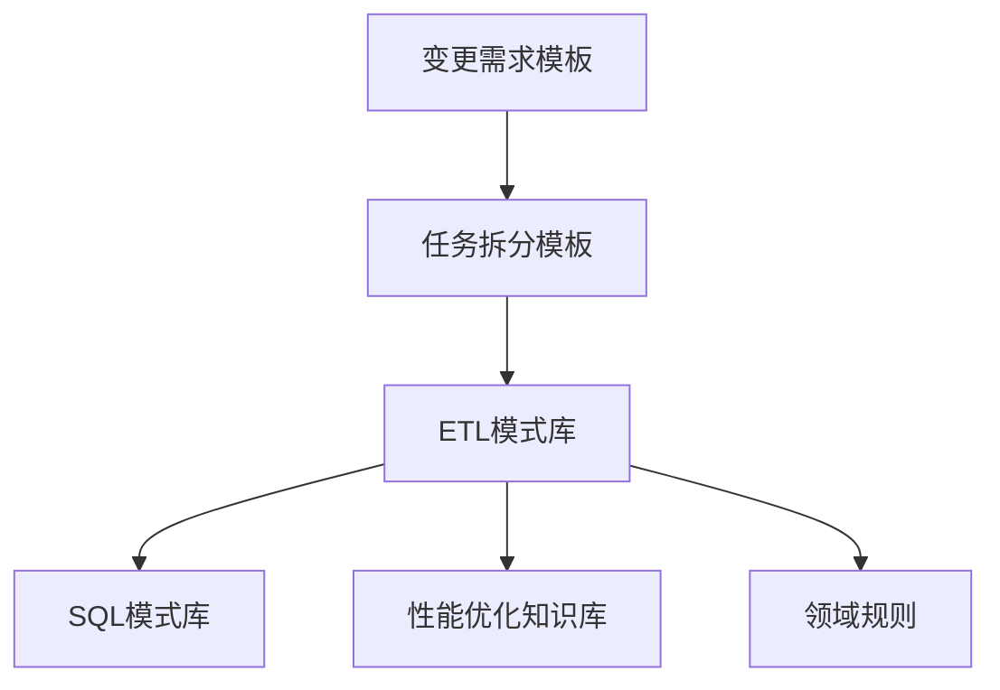

图表来源
- [目录结构和设计说明.md:70-78](file://data_warehouse_engineering_code_copilot/目录结构和设计说明.md#L70-L78)
- [spec.md:1-132](file://data_warehouse_engineering_code_copilot/changes/templates/spec.md#L1-L132)
- [tasks.md:1-74](file://data_warehouse_engineering_code_copilot/changes/templates/tasks.md#L1-L74)
- [etl-patterns.md:1-220](file://data_warehouse_engineering_code_copilot/knowledge/etl-patterns.md#L1-L220)
- [sql-patterns.md:1-331](file://data_warehouse_engineering_code_copilot/knowledge/sql-patterns.md#L1-L331)
- [performance-tips.md:1-349](file://data_warehouse_engineering_code_copilot/knowledge/performance-tips.md#L1-L349)
- [domain-rules.md:1-142](file://data_warehouse_engineering_code_copilot/rules/domain-rules.md#L1-L142)

章节来源
- [目录结构和设计说明.md:70-78](file://data_warehouse_engineering_code_copilot/目录结构和设计说明.md#L70-L78)
- [spec.md:1-132](file://data_warehouse_engineering_code_copilot/changes/templates/spec.md#L1-L132)
- [tasks.md:1-74](file://data_warehouse_engineering_code_copilot/changes/templates/tasks.md#L1-L74)
- [etl-patterns.md:1-220](file://data_warehouse_engineering_code_copilot/knowledge/etl-patterns.md#L1-L220)
- [sql-patterns.md:1-331](file://data_warehouse_engineering_code_copilot/knowledge/sql-patterns.md#L1-L331)
- [performance-tips.md:1-349](file://data_warehouse_engineering_code_copilot/knowledge/performance-tips.md#L1-L349)
- [domain-rules.md:1-142](file://data_warehouse_engineering_code_copilot/rules/domain-rules.md#L1-L142)

## 性能考量
- 分区裁剪
  - WHERE条件必须直接命中分区字段，禁止用函数包裹
  - 通过EXPLAIN/EXPLAIN EXTENDED验证裁剪是否生效
- 数据倾斜
  - 常见原因：Group By/Join Key大量NULL/默认值、业务热点、时间集中
  - 解决方案：过滤+单独处理、加盐打散（Salt+二次聚合）、Map Join小表
- 小文件问题
  - 危害：元数据爆炸、Map Task启动开销、查询性能下降
  - 控制手段：Hive手动控制reduce数、DISTRIBUTE BY散列、Spark AQE自动合并、周期性合并
- CTE/WITH物化策略
  - Hive/Spark默认不物化，多次引用会导致重复计算
  - 推荐做法：先落临时表或Spark显式CACHE
- 谓词下推与列裁剪
  - WHERE条件与列裁剪下推到数据源层，减少扫描
  - ON条件中混入外层过滤会使谓词无法下推
- Join顺序与类型
  - Broadcast Hash Join最快，Sort Merge Join代价最高
  - 分桶Join可跳过Shuffle
- 窗口函数性能
  - PARTITION BY列基数过低或过高都会带来性能问题
  - 配合DISTRIBUTE BY/SORT BY优化
- 存储格式与压缩
  - 大型分析表：ORC+ZSTD（Hive）/Parquet+ZSTD（Spark）
  - 小表/临时表：Parquet+Snappy
  - 强schema演进：Iceberg+Parquet
- 调度与资源
  - 按主题/优先级划分队列，错峰调度，SLA基线倒推
  - 失败重试：指数退避，重试前判断幂等

章节来源
- [performance-tips.md:5-349](file://data_warehouse_engineering_code_copilot/knowledge/performance-tips.md#L5-L349)

## 故障排查指南
- CDC
  - binlog ts字段为事件时间，非事务提交时间，需结合gtid+bin_pos+op_seq实现强一致排序
  - 大事务（DDL/批量update）会瞬间产生海量binlog，需监控lag
  - 主备切换位点会跳变，订阅端需做GTID校验
- JDBC增量
  - 用create_time做水位会漏掉历史数据的字段更新
  - update_time不更新（如某些枚举切换走存储过程）会丢更新
  - 时区不一致会导致跨日丢数
- MERGE/UPSERT
  - Hive非事务表不支持MERGE，会被解析为INSERT，产生重复
  - 频繁UPSERT产生大量删除标记文件，需定期合并
- 小文件
  - 一刀切设置reduce=1会导致最后阶段单点
  - AQE在Spark 3.0之前默认关闭，旧版需手动开启
- 历史回刷
  - 一次性回刷上千分区会占用大量队列资源，影响日常基线
  - 回刷期间下游会读到不一致数据，建议加“回刷中”标记并通知下游
- 文件接入
  - Excel中文本数字被自动转科学计数法
  - CSV字段含逗号未转义会错列
  - 文件名时间戳与数据日期不一致时需约定以哪个为准
- API拉取
  - Token写在代码或脚本里需走密钥管理服务
  - API返回字段大小写不一致（snake/camel），统一在ODS入库时规范化

章节来源
- [etl-patterns.md:23-27](file://data_warehouse_engineering_code_copilot/knowledge/etl-patterns.md#L23-L27)
- [etl-patterns.md:50-54](file://data_warehouse_engineering_code_copilot/knowledge/etl-patterns.md#L50-L54)
- [etl-patterns.md:84-87](file://data_warehouse_engineering_code_copilot/knowledge/etl-patterns.md#L84-L87)
- [etl-patterns.md:116-119](file://data_warehouse_engineering_code_copilot/knowledge/etl-patterns.md#L116-L119)
- [etl-patterns.md:149-152](file://data_warehouse_engineering_code_copilot/knowledge/etl-patterns.md#L149-L152)
- [etl-patterns.md:167-171](file://data_warehouse_engineering_code_copilot/knowledge/etl-patterns.md#L167-L171)
- [etl-patterns.md:186-189](file://data_warehouse_engineering_code_copilot/knowledge/etl-patterns.md#L186-L189)

## 结论
ETL模式库提供了从全量、增量到CDC的完整策略矩阵，并配套幂等写入、小文件治理、历史回刷、文件与API接入等关键能力。通过与SQL模式库、性能优化知识库、领域规则以及变更模板的协同，能够实现“Spec驱动 + 三段式知识库 + 强制变更追踪”的工程化闭环，帮助团队在复杂业务场景下稳定、高效地落地ETL方案。选型时应综合考虑实时性、源端压力、数据完整性、实现复杂度、历史变更追踪与适用规模，结合性能与一致性保障措施，制定最优ETL策略。

## 附录
- ETL流程设计示例（以CDC为例）
  - 数据抽取：MySQL binlog → Flink CDC Source
  - 数据转换：Kafka事件流 → Flink ETL（op字段还原、去重、清洗）
  - 数据加载：Iceberg/Hudi主表upsert；ODS增量表按dt分区
  - 一致性保证：Checkpoint位点保护、op字段、回放窗口
  - 性能考虑：RocksDB状态后端、事件流分区、compaction
  - 错误处理：lag监控、GTID校验、失败重试与告警
- ETL模式选择原则与优化策略
  - 选型原则：实时性、源端压力、数据完整性、实现复杂度、历史变更追踪、适用规模、工具栈
  - 优化策略：分区裁剪、小文件治理、Map Join、CTE物化、谓词下推与列裁剪、Join顺序与类型、窗口函数、存储格式与压缩、调度与资源、性能分析工具

章节来源
- [etl-patterns.md:11-21](file://data_warehouse_engineering_code_copilot/knowledge/etl-patterns.md#L11-L21)
- [etl-patterns.md:192-203](file://data_warehouse_engineering_code_copilot/knowledge/etl-patterns.md#L192-L203)
- [performance-tips.md:320-349](file://data_warehouse_engineering_code_copilot/knowledge/performance-tips.md#L320-L349)