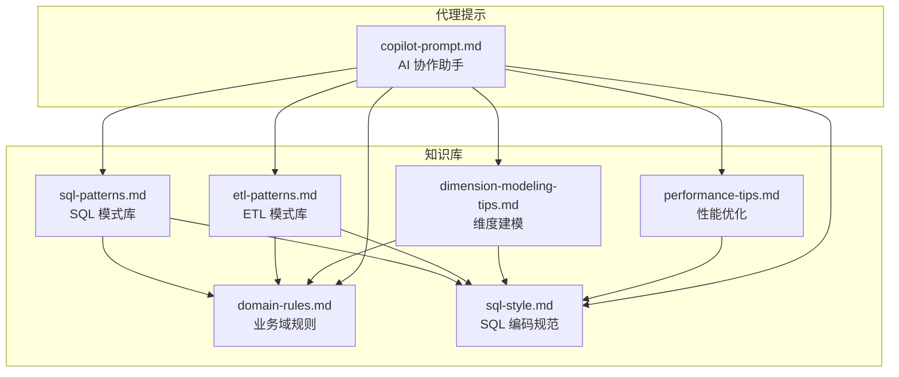
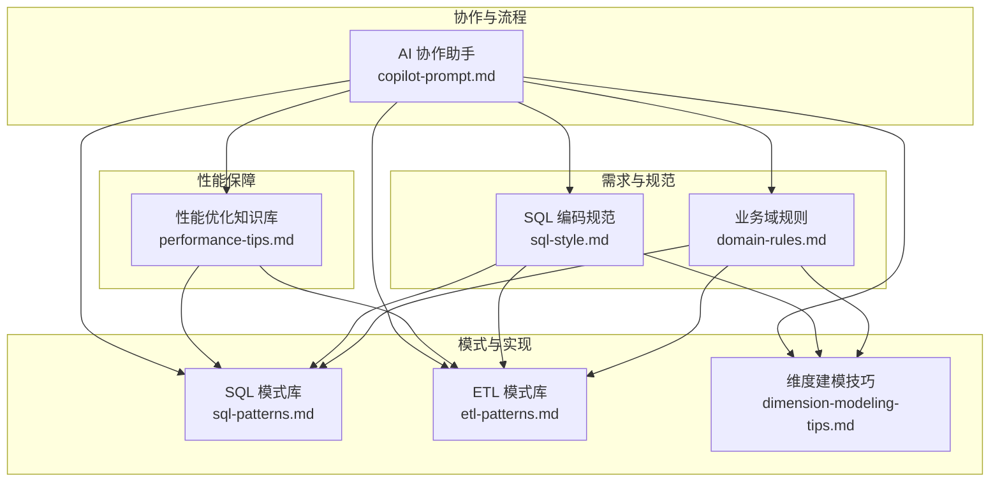
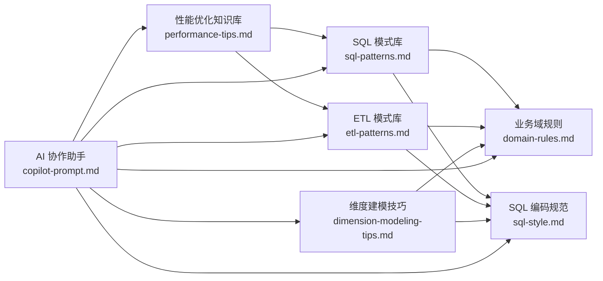

# SQL模式库

<cite>
**本文引用的文件**
- [sql-patterns.md](file://data_warehouse_engineering_code_copilot/knowledge/sql-patterns.md)
- [etl-patterns.md](file://data_warehouse_engineering_code_copilot/knowledge/etl-patterns.md)
- [performance-tips.md](file://data_warehouse_engineering_code_copilot/knowledge/performance-tips.md)
- [dimension-modeling-tips.md](file://data_warehouse_engineering_code_copilot/knowledge/dimension-modeling-tips.md)
- [domain-rules.md](file://data_warehouse_engineering_code_copilot/rules/domain-rules.md)
- [sql-style.md](file://data_warehouse_engineering_code_copilot/rules/sql-style.md)
- [copilot-prompt.md](file://data_warehouse_engineering_code_copilot/agents/copilot-prompt.md)
</cite>

## 目录
1. [简介](#简介)
2. [项目结构](#项目结构)
3. [核心组件](#核心组件)
4. [架构总览](#架构总览)
5. [详细组件分析](#详细组件分析)
6. [依赖关系分析](#依赖关系分析)
7. [性能考量](#性能考量)
8. [故障排查指南](#故障排查指南)
9. [结论](#结论)
10. [附录](#附录)

## 简介
本文件系统化整理了数据仓库工程中的 SQL 常用模式库，覆盖去重保留最新、拉链表（SCD Type 2）、同环比（YoY/MoM）、分组 TopN、累计求和、行转列/列转行、数据回刷（幂等覆盖）、增量+全量合并（Lambda）、缺失日期补齐、NULL 安全比较等核心模式。每个模式提供：
- 适用场景说明
- 完整 SQL 实现示例（以文件路径引用）
- 性能考虑与常见陷阱
- 模式间的组合使用与实际项目应用建议

此外，文档还整合了 ETL 模式、性能优化、维度建模、业务域规则与 SQL 编码规范，帮助读者在真实项目中正确、高效地落地这些模式。

## 项目结构
该仓库围绕“知识库 + 规则 + 代理提示”组织内容，形成“模式库 + 规范 + 指南”的协同体系：
- knowledge/sql-patterns.md：SQL 模式库（含 10 个核心模式）
- knowledge/etl-patterns.md：ETL/数据集成模式库（含 CDC、JDBC 增量、MERGE/UPSERT、小文件控制、历史回刷、文件/API 接入、同步方式选型、时区处理）
- knowledge/performance-tips.md：性能优化知识库（分区裁剪、数据倾斜、Map Join、小文件、CTE 物化、谓词下推、Join 顺序与类型、窗口函数、存储格式与压缩、调度与资源、性能分析工具）
- knowledge/dimension-modeling-tips.md：维度建模技巧（代理键/业务键、SCD 三类、桥接表、退化维度、一致性维度、事实表类型、维度分级、分层归属）
- rules/domain-rules.md：业务领域约束（金额精度、百分比格式、同比/环比口径、排名与排序键、状态颜色、KPI 定义、数据质量、历史数据约定、行业特定规则、跨系统一致性）
- rules/sql-style.md：SQL 编码规范（命名约定、格式规范、编写原则、禁止事项、命名检查清单、常见错误对照）
- agents/copilot-prompt.md：AI 协作助手的“核心法则”与工作流（Spec 驱动、身份与原则、回答框架、命令映射）

**图表来源**
- [sql-patterns.md:1-331](file://data_warehouse_engineering_code_copilot/knowledge/sql-patterns.md#L1-L331)
- [etl-patterns.md:1-220](file://data_warehouse_engineering_code_copilot/knowledge/etl-patterns.md#L1-L220)
- [performance-tips.md:1-349](file://data_warehouse_engineering_code_copilot/knowledge/performance-tips.md#L1-L349)
- [dimension-modeling-tips.md:1-253](file://data_warehouse_engineering_code_copilot/knowledge/dimension-modeling-tips.md#L1-L253)
- [domain-rules.md:1-142](file://data_warehouse_engineering_code_copilot/rules/domain-rules.md#L1-L142)
- [sql-style.md:1-254](file://data_warehouse_engineering_code_copilot/rules/sql-style.md#L1-L254)
- [copilot-prompt.md:1-147](file://data_warehouse_engineering_code_copilot/agents/copilot-prompt.md#L1-L147)

**章节来源**
- [sql-patterns.md:1-331](file://data_warehouse_engineering_code_copilot/knowledge/sql-patterns.md#L1-L331)
- [etl-patterns.md:1-220](file://data_warehouse_engineering_code_copilot/knowledge/etl-patterns.md#L1-L220)
- [performance-tips.md:1-349](file://data_warehouse_engineering_code_copilot/knowledge/performance-tips.md#L1-L349)
- [dimension-modeling-tips.md:1-253](file://data_warehouse_engineering_code_copilot/knowledge/dimension-modeling-tips.md#L1-L253)
- [domain-rules.md:1-142](file://data_warehouse_engineering_code_copilot/rules/domain-rules.md#L1-L142)
- [sql-style.md:1-254](file://data_warehouse_engineering_code_copilot/rules/sql-style.md#L1-L254)
- [copilot-prompt.md:1-147](file://data_warehouse_engineering_code_copilot/agents/copilot-prompt.md#L1-L147)

## 核心组件
本节对 SQL 模式库中的 10 个核心模式进行概览，给出场景、实现入口与性能要点，便于快速检索与组合使用。

- 去重保留最新：按主键保留最新一条（CDC 后处理/全量去重），性能关注分区键基数与倾斜，可加散列提示。
- 拉链表（SCD Type 2）：维度表保留历史变化，三列区间标记，写入需幂等覆盖。
- 同环比（YoY/MoM）：同比/环比增长率计算，必须处理空值与零值约定。
- 分组 TopN：按组取前 N，注意窗口函数触发 Shuffle 与分区键基数。
- 累计求和（Running Total）：时间序列累计，支持跨年/跨月分组。
- 行转列/列转行：透视与反透视，注意列转行的行数膨胀。
- 数据回刷（幂等覆盖）：历史分区重跑，必须保证可重入。
- 增量+全量合并（Lambda）：ODS 全量+增量合并出当日快照，注意 schema 一致与去重。
- 缺失日期补齐：左关联日期维度表补全，LEFT JOIN 成本可控。
- NULL 安全比较：允许两侧同时为 NULL 时匹配，优先使用引擎内置安全比较。

**章节来源**
- [sql-patterns.md:6-331](file://data_warehouse_engineering_code_copilot/knowledge/sql-patterns.md#L6-L331)

## 架构总览
SQL 模式库与 ETL 模式、性能优化、维度建模、业务域规则、SQL 规范共同构成数据仓库工程的“模式-实现-质量-规范”闭环。AI 协作助手以“Spec 驱动”指导从需求到实现再到验证与归档的全流程。

**图表来源**
- [domain-rules.md:1-142](file://data_warehouse_engineering_code_copilot/rules/domain-rules.md#L1-L142)
- [sql-style.md:1-254](file://data_warehouse_engineering_code_copilot/rules/sql-style.md#L1-L254)
- [sql-patterns.md:1-331](file://data_warehouse_engineering_code_copilot/knowledge/sql-patterns.md#L1-L331)
- [etl-patterns.md:1-220](file://data_warehouse_engineering_code_copilot/knowledge/etl-patterns.md#L1-L220)
- [dimension-modeling-tips.md:1-253](file://data_warehouse_engineering_code_copilot/knowledge/dimension-modeling-tips.md#L1-L253)
- [performance-tips.md:1-349](file://data_warehouse_engineering_code_copilot/knowledge/performance-tips.md#L1-L349)
- [copilot-prompt.md:1-147](file://data_warehouse_engineering_code_copilot/agents/copilot-prompt.md#L1-L147)

## 详细组件分析

### 去重保留最新
- 场景：源端可能有重复或变更记录，需要按主键保留最新一条（CDC 后处理/全量去重）。
- 实现入口：[去重保留最新:6-39](file://data_warehouse_engineering_code_copilot/knowledge/sql-patterns.md#L6-L39)
- 解释要点：
  - 使用窗口函数按主键分区，按更新时间降序排序，必要时用操作序号作为 tie-breaker。
  - 等价写法可使用 QUALIFY（部分引擎支持）。
- 性能说明：
  - 良好；注意分区键基数过低会引发数据倾斜，可通过散列提示降低倾斜风险。
- 常见陷阱：
  - 忘记 ORDER BY 的 tie-breaker，导致并列时不确定。
  - 分区键基数过低导致单分区数据量过大。

**章节来源**
- [sql-patterns.md:6-39](file://data_warehouse_engineering_code_copilot/knowledge/sql-patterns.md#L6-L39)

### 拉链表（SCD Type 2）
- 场景：维度表需要保留历史变化（如用户等级变迁），用三列标记每条版本的生效区间。
- 实现入口：[拉链表（SCD Type 2）:42-94](file://data_warehouse_engineering_code_copilot/knowledge/sql-patterns.md#L42-L94)
- 解释要点：
  - “老链关，新链开”：对当前有效的历史链路进行闭合，同时对当日变更生成新链。
  - 写入必须幂等覆盖，保证历史累积带来的全量重写成本可控。
- 性能说明：
  - 中等；建议按年/季做归档拆分，降低全量重写的成本。
- 常见陷阱：
  - 非幂等写入导致重复或遗漏。
  - 历史链路未闭合导致查询结果不一致。

**章节来源**
- [sql-patterns.md:42-94](file://data_warehouse_engineering_code_copilot/knowledge/sql-patterns.md#L42-L94)

### 同环比（YoY / MoM）
- 场景：计算指标的同比/环比，必须处理空值与除零。
- 实现入口：[同环比（YoY / MoM）:97-141](file://data_warehouse_engineering_code_copilot/knowledge/sql-patterns.md#L97-L141)
- 解释要点：
  - 处理“双零返 NULL，本期 0 同期非 0 返 -1（即 -100%）”约定。
  - 自连接日期偏移；闰年/财年场景需切换为日期维度表的日期标识。
- 性能说明：
  - 良好；base CTE 限定窗口避免全表扫描，使用日期维度关联更稳健。
- 常见陷阱：
  - 未处理零值与空值导致异常结果。
  - 日期偏移未考虑闰年/财年导致错位。

**章节来源**
- [sql-patterns.md:97-141](file://data_warehouse_engineering_code_copilot/knowledge/sql-patterns.md#L97-L141)

### 分组 TopN
- 场景：取每个店铺销售额前 3 的 SKU。
- 实现入口：[分组 TopN:144-168](file://data_warehouse_engineering_code_copilot/knowledge/sql-patterns.md#L144-L168)
- 解释要点：
  - ROW_NUMBER 严格唯一序号；RANK 并列同名次但跳号；DENSE_RANK 并列同名次不跳号。
  - 大型表注意分区键基数，必要时配合散列与排序提示。
- 性能说明：
  - 中等；窗口函数会触发 Shuffle，可配合散列与排序提示减少二次排序。
- 常见陷阱：
  - 并列场景误用 ROW_NUMBER 导致漏排。
  - 分区键基数过低导致倾斜。

**章节来源**
- [sql-patterns.md:144-168](file://data_warehouse_engineering_code_copilot/knowledge/sql-patterns.md#L144-L168)

### 累计求和（Running Total）
- 场景：按订单时间序列展示从期初到当前的累计销售。
- 实现入口：[累计求和（Running Total）:171-195](file://data_warehouse_engineering_code_copilot/knowledge/sql-patterns.md#L171-L195)
- 解释要点：
  - 标准写法为 UNBOUNDED PRECEDING 到 CURRENT ROW；跨年/跨月分组可加分区键。
- 性能说明：
  - 良好。
- 常见陷阱：
  - 未限定时间窗口导致全表扫描。
  - 分组键不当导致计算范围过大。

**章节来源**
- [sql-patterns.md:171-195](file://data_warehouse_engineering_code_copilot/knowledge/sql-patterns.md#L171-L195)

### 行转列 / 列转行
- 场景：将每日销售按月份做透视，或将多列指标 unpivot 为长表。
- 实现入口：[行转列 / 列转行:198-229](file://data_warehouse_engineering_code_copilot/knowledge/sql-patterns.md#L198-L229)
- 解释要点：
  - 行转列：CASE WHEN 法通用；列转行：Hive UNION ALL、Spark stack()、Presto/Trino UNNEST。
- 性能说明：
  - 行转列性能可控；列转行注意展开后的行数膨胀。
- 常见陷阱：
  - 列转行导致行数爆炸，需评估内存与 IO。

**章节来源**
- [sql-patterns.md:198-229](file://data_warehouse_engineering_code_copilot/knowledge/sql-patterns.md#L198-L229)

### 数据回刷（幂等覆盖）
- 场景：历史分区因口径调整需要重跑，必须保证可重入。
- 实现入口：[数据回刷（幂等覆盖）:232-255](file://data_warehouse_engineering_code_copilot/knowledge/sql-patterns.md#L232-L255)
- 解释要点：
  - 推荐使用单分区覆盖写入；禁止使用追加写入。
  - 批量回刷注意并发与资源占用。
- 性能说明：
  - 单次扫描成本视加工逻辑而定；批量回刷需控制并发。
- 常见陷阱：
  - 使用追加写入导致重复数据。
  - 未控制并发导致队列资源紧张。

**章节来源**
- [sql-patterns.md:232-255](file://data_warehouse_engineering_code_copilot/knowledge/sql-patterns.md#L232-L255)

### 增量 + 全量合并（Lambda）
- 场景：ODS 层全量 + 增量同时存在，需要合并出当日的最新全量快照。
- 实现入口：[增量 + 全量合并（Lambda）:258-286](file://data_warehouse_engineering_code_copilot/knowledge/sql-patterns.md#L258-L286)
- 解释要点：
  - 增量优先（更新时间最新）覆盖昨日全量；注意 schema 一致与字段补齐。
- 性能说明：
  - 全量重写代价随用户表规模线性增长；超大表建议改用拉链或基于 ACID 表的 MERGE。
- 常见陷阱：
  - schema 不一致导致 UNION ALL 失败。
  - 未去重导致重复主键。

**章节来源**
- [sql-patterns.md:258-286](file://data_warehouse_engineering_code_copilot/knowledge/sql-patterns.md#L258-L286)

### 缺失日期补齐
- 场景：按日维度展示指标，但事实表只在有交易的日期有记录，需要左关联日期维度表补全。
- 实现入口：[缺失日期补齐:289-308](file://data_warehouse_engineering_code_copilot/knowledge/sql-patterns.md#L289-L308)
- 解释要点：
  - LEFT JOIN 日期维度表，使用 COALESCE 补零。
- 性能说明：
  - 日期维度表行数小，LEFT JOIN 代价可忽略。
- 常见陷阱：
  - 未限制日期范围导致扫描扩大。

**章节来源**
- [sql-patterns.md:289-308](file://data_warehouse_engineering_code_copilot/knowledge/sql-patterns.md#L289-L308)

### NULL 安全比较
- 场景：Join 条件中允许两侧同时为 NULL 时匹配（业务上等价）。
- 实现入口：[NULL 安全比较:311-331](file://data_warehouse_engineering_code_copilot/knowledge/sql-patterns.md#L311-L331)
- 解释要点：
  - Spark/Hive 可用安全比较运算符；通用写法使用 OR (a IS NULL AND b IS NULL)。
- 性能说明：
  - 通用写法略慢；优先在 Hive/Spark 中使用安全比较运算符。
- 常见陷阱：
  - 标准 SQL 中 NULL <> NULL，直接比较会丢行。

**章节来源**
- [sql-patterns.md:311-331](file://data_warehouse_engineering_code_copilot/knowledge/sql-patterns.md#L311-L331)

### 模式组合与实战应用
- 组合示例 1：去重保留最新 + 缺失日期补齐
  - 先对增量表去重，再与日期维度表 LEFT JOIN 补齐缺失日期，确保每日指标连续。
- 组合示例 2：拉链表 + 同环比
  - 对维度表使用拉链表保留历史，查询时带上时间窗口；对指标计算同环比时，注意历史口径与日期偏移。
- 组合示例 3：分组 TopN + 行转列
  - 先按组取 TopN，再将指标按月份透视，用于看板展示。
- 组合示例 4：数据回刷 + 增量+全量合并
  - 历史回刷时使用幂等覆盖；合并当日快照时先去重再合并，保证一致性。

**章节来源**
- [sql-patterns.md:6-331](file://data_warehouse_engineering_code_copilot/knowledge/sql-patterns.md#L6-L331)

## 依赖关系分析
SQL 模式库与 ETL 模式、性能优化、维度建模、业务域规则、SQL 规范之间存在紧密耦合关系。下图展示主要依赖与交互：

**图表来源**
- [sql-patterns.md:1-331](file://data_warehouse_engineering_code_copilot/knowledge/sql-patterns.md#L1-L331)
- [etl-patterns.md:1-220](file://data_warehouse_engineering_code_copilot/knowledge/etl-patterns.md#L1-L220)
- [performance-tips.md:1-349](file://data_warehouse_engineering_code_copilot/knowledge/performance-tips.md#L1-L349)
- [dimension-modeling-tips.md:1-253](file://data_warehouse_engineering_code_copilot/knowledge/dimension-modeling-tips.md#L1-L253)
- [domain-rules.md:1-142](file://data_warehouse_engineering_code_copilot/rules/domain-rules.md#L1-L142)
- [sql-style.md:1-254](file://data_warehouse_engineering_code_copilot/rules/sql-style.md#L1-L254)
- [copilot-prompt.md:1-147](file://data_warehouse_engineering_code_copilot/agents/copilot-prompt.md#L1-L147)

**章节来源**
- [sql-patterns.md:1-331](file://data_warehouse_engineering_code_copilot/knowledge/sql-patterns.md#L1-L331)
- [etl-patterns.md:1-220](file://data_warehouse_engineering_code_copilot/knowledge/etl-patterns.md#L1-L220)
- [performance-tips.md:1-349](file://data_warehouse_engineering_code_copilot/knowledge/performance-tips.md#L1-L349)
- [dimension-modeling-tips.md:1-253](file://data_warehouse_engineering_code_copilot/knowledge/dimension-modeling-tips.md#L1-L253)
- [domain-rules.md:1-142](file://data_warehouse_engineering_code_copilot/rules/domain-rules.md#L1-L142)
- [sql-style.md:1-254](file://data_warehouse_engineering_code_copilot/rules/sql-style.md#L1-L254)
- [copilot-prompt.md:1-147](file://data_warehouse_engineering_code_copilot/agents/copilot-prompt.md#L1-L147)

## 性能考量
- 分区裁剪：WHERE 条件必须直接命中分区字段，禁止用函数包裹；通过 EXPLAIN 验证裁剪是否生效。
- 数据倾斜：热点 key、默认值、时间集中是常见原因；可采用过滤单独处理、加盐打散、Map Join 等策略。
- Map Join/Broadcast Join：小表广播可避免 Shuffle；注意阈值与驱动内存风险。
- 小文件问题：控制输出端 reduce 数、使用散列提示、启用自适应合并；周期性合并降低元数据压力。
- CTE/WITH 物化：Hive/Spark 默认不物化，复杂多次引用的 CTE 建议物化为临时表或显式 CACHE。
- 谓词下推与列裁剪：WHERE 下推与只读必要列可显著减少扫描；避免在 ON 中混入过滤与 UDF。
- Join 顺序与类型：按引擎选择最优 Join 类型；分桶 Join 可跳过 Shuffle。
- 窗口函数：PARTITION BY 列基数需平衡；可配合散列与排序提示；避免不必要的全局排序。
- 存储格式与压缩：优先列存格式（ORC/Parquet）与高压缩；列裁剪与谓词下推收益巨大。
- 调度与资源：按主题/优先级划分队列，错峰调度，SLA 基线与失败重试策略。

**章节来源**
- [performance-tips.md:5-349](file://data_warehouse_engineering_code_copilot/knowledge/performance-tips.md#L5-L349)

## 故障排查指南
- SQL 编码规范与禁止事项：避免 SELECT *、函数包裹分区字段、FLOAT 存金额、保留字作字段名、硬编码日期等；严格使用幂等覆盖写入。
- 业务域规则：金额精度、百分比格式、同比/环比口径、排名与排序键、状态颜色、KPI 定义、数据质量、历史数据约定、行业特定规则、跨系统一致性。
- 性能诊断流程：EXPLAIN 执行计划 → 作业历史与 Stage Metrics → Profile 采样 → 数据采样定位倾斜键。
- ETL 回放与幂等：CDC 位点保护、回放窗口、MERGE/UPSERT 乱序保护、小文件控制与合并。
- 维度建模一致性：代理键/业务键、SCD 三类、桥接表、退化维度、一致性维度、事实表类型、维度分级、分层归属。

**章节来源**
- [sql-style.md:165-254](file://data_warehouse_engineering_code_copilot/rules/sql-style.md#L165-L254)
- [domain-rules.md:6-142](file://data_warehouse_engineering_code_copilot/rules/domain-rules.md#L6-L142)
- [performance-tips.md:327-349](file://data_warehouse_engineering_code_copilot/knowledge/performance-tips.md#L327-L349)
- [etl-patterns.md:6-220](file://data_warehouse_engineering_code_copilot/knowledge/etl-patterns.md#L6-L220)
- [dimension-modeling-tips.md:5-253](file://data_warehouse_engineering_code_copilot/knowledge/dimension-modeling-tips.md#L5-L253)

## 结论
SQL 模式库提供了数据仓库工程中最常用且经过验证的实现套路。结合 ETL 模式、性能优化、维度建模、业务域规则与 SQL 规范，可在保证正确性与性能的前提下，快速、稳定地交付高质量的数据产品。建议在实际项目中：
- 以模式为骨架，以规范为准绳，以性能为底线；
- 在变更前进行充分的性能评估与数据质量校验；
- 通过 AI 协作助手的“Spec 驱动”流程，确保实现与需求一致、可追溯、可复用。

## 附录
- 实现示例路径索引（仅列出路径，不展示具体代码内容）：
  - 去重保留最新：[去重保留最新:6-39](file://data_warehouse_engineering_code_copilot/knowledge/sql-patterns.md#L6-L39)
  - 拉链表（SCD Type 2）：[拉链表（SCD Type 2）:42-94](file://data_warehouse_engineering_code_copilot/knowledge/sql-patterns.md#L42-L94)
  - 同环比（YoY / MoM）：[同环比（YoY / MoM）:97-141](file://data_warehouse_engineering_code_copilot/knowledge/sql-patterns.md#L97-L141)
  - 分组 TopN：[分组 TopN:144-168](file://data_warehouse_engineering_code_copilot/knowledge/sql-patterns.md#L144-L168)
  - 累计求和（Running Total）：[累计求和（Running Total）:171-195](file://data_warehouse_engineering_code_copilot/knowledge/sql-patterns.md#L171-L195)
  - 行转列 / 列转行：[行转列 / 列转行:198-229](file://data_warehouse_engineering_code_copilot/knowledge/sql-patterns.md#L198-L229)
  - 数据回刷（幂等覆盖）：[数据回刷（幂等覆盖）:232-255](file://data_warehouse_engineering_code_copilot/knowledge/sql-patterns.md#L232-L255)
  - 增量 + 全量合并（Lambda）：[增量 + 全量合并（Lambda）:258-286](file://data_warehouse_engineering_code_copilot/knowledge/sql-patterns.md#L258-L286)
  - 缺失日期补齐：[缺失日期补齐:289-308](file://data_warehouse_engineering_code_copilot/knowledge/sql-patterns.md#L289-L308)
  - NULL 安全比较：[NULL 安全比较:311-331](file://data_warehouse_engineering_code_copilot/knowledge/sql-patterns.md#L311-L331)
- 相关规则与指南：
  - 业务域规则：[业务域规则:1-142](file://data_warehouse_engineering_code_copilot/rules/domain-rules.md#L1-L142)
  - SQL 编码规范：[SQL 编码规范:1-254](file://data_warehouse_engineering_code_copilot/rules/sql-style.md#L1-L254)
  - 性能优化知识库：[性能优化知识库:1-349](file://data_warehouse_engineering_code_copilot/knowledge/performance-tips.md#L1-L349)
  - 维度建模技巧：[维度建模技巧:1-253](file://data_warehouse_engineering_code_copilot/knowledge/dimension-modeling-tips.md#L1-L253)
  - ETL 模式库：[ETL 模式库:1-220](file://data_warehouse_engineering_code_copilot/knowledge/etl-patterns.md#L1-L220)
  - AI 协作助手：[AI 协作助手:1-147](file://data_warehouse_engineering_code_copilot/agents/copilot-prompt.md#L1-L147)