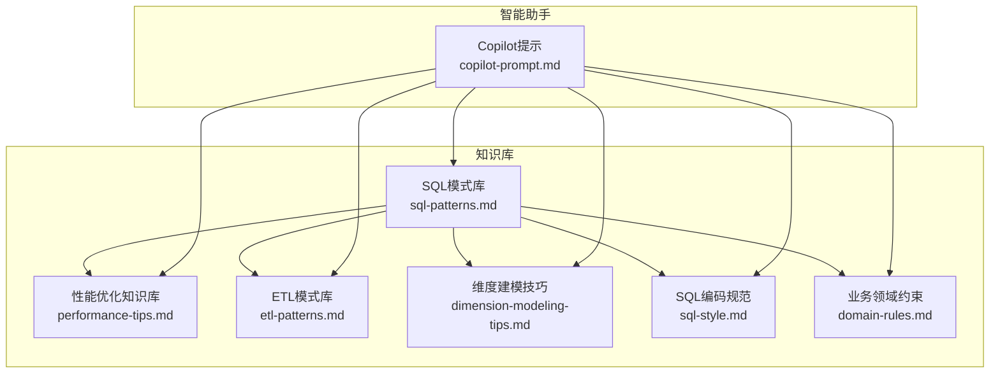
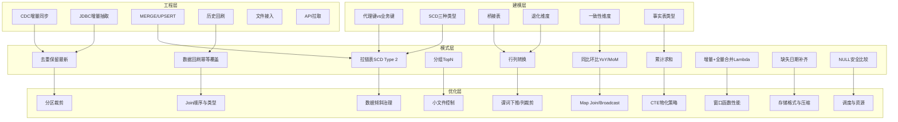
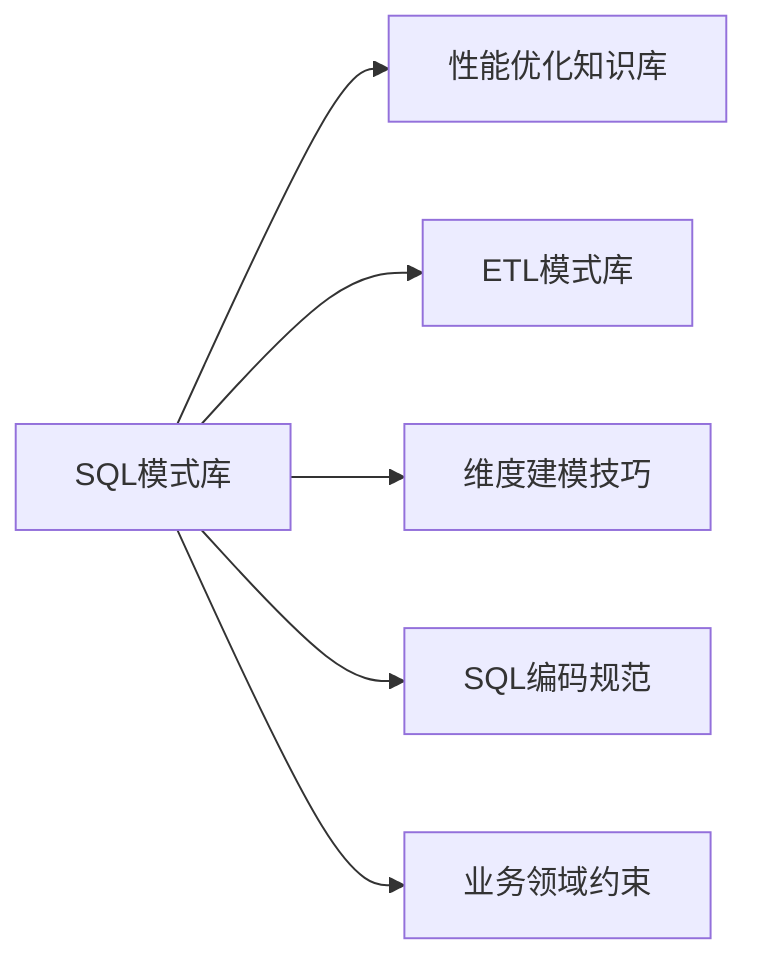

# SQL模式库

<cite>
**本文引用的文件**
- [sql-patterns.md](file://data_warehouse_engineering_code_copilot/knowledge/sql-patterns.md)
- [performance-tips.md](file://data_warehouse_engineering_code_copilot/knowledge/performance-tips.md)
- [etl-patterns.md](file://data_warehouse_engineering_code_copilot/knowledge/etl-patterns.md)
- [dimension-modeling-tips.md](file://data_warehouse_engineering_code_copilot/knowledge/dimension-modeling-tips.md)
- [sql-style.md](file://data_warehouse_engineering_code_copilot/rules/sql-style.md)
- [domain-rules.md](file://data_warehouse_engineering_code_copilot/rules/domain-rules.md)
- [copilot-prompt.md](file://data_warehouse_engineering_code_copilot/agents/copilot-prompt.md)
</cite>

## 目录
1. [简介](#简介)
2. [项目结构](#项目结构)
3. [核心组件](#核心组件)
4. [架构概览](#架构概览)
5. [详细组件分析](#详细组件分析)
6. [依赖分析](#依赖分析)
7. [性能考量](#性能考量)
8. [故障排查指南](#故障排查指南)
9. [结论](#结论)
10. [附录](#附录)

## 简介
本文件为“SQL模式库”的权威参考文档，系统整理了数据仓库工程中常用的SQL查询模式与最佳实践，涵盖复杂查询构建、性能优化、常见陷阱规避、不同场景下的SQL模式应用（聚合查询、窗口函数、CTE递归等），并提供可复用的模式模板与使用场景说明。文档同时阐述SQL模式的设计原则与扩展方法，帮助开发者快速定位并定制适合自身业务的SQL模式。

## 项目结构
该知识库围绕“SQL模式”“性能优化”“ETL模式”“维度建模”“编码规范”“领域规则”“智能助手提示”七个方面组织内容，形成“模式库 + 规范 + 规则 + 工具”的知识体系，支撑从需求到实现再到运维的全链路。

图表来源
- [sql-patterns.md:1-331](file://data_warehouse_engineering_code_copilot/knowledge/sql-patterns.md#L1-L331)
- [performance-tips.md:1-349](file://data_warehouse_engineering_code_copilot/knowledge/performance-tips.md#L1-L349)
- [etl-patterns.md:1-220](file://data_warehouse_engineering_code_copilot/knowledge/etl-patterns.md#L1-L220)
- [dimension-modeling-tips.md:1-253](file://data_warehouse_engineering_code_copilot/knowledge/dimension-modeling-tips.md#L1-L253)
- [sql-style.md:1-254](file://data_warehouse_engineering_code_copilot/rules/sql-style.md#L1-L254)
- [domain-rules.md:1-142](file://data_warehouse_engineering_code_copilot/rules/domain-rules.md#L1-L142)
- [copilot-prompt.md:1-147](file://data_warehouse_engineering_code_copilot/agents/copilot-prompt.md#L1-L147)

章节来源
- [sql-patterns.md:1-331](file://data_warehouse_engineering_code_copilot/knowledge/sql-patterns.md#L1-L331)
- [performance-tips.md:1-349](file://data_warehouse_engineering_code_copilot/knowledge/performance-tips.md#L1-L349)
- [etl-patterns.md:1-220](file://data_warehouse_engineering_code_copilot/knowledge/etl-patterns.md#L1-L220)
- [dimension-modeling-tips.md:1-253](file://data_warehouse_engineering_code_copilot/knowledge/dimension-modeling-tips.md#L1-L253)
- [sql-style.md:1-254](file://data_warehouse_engineering_code_copilot/rules/sql-style.md#L1-L254)
- [domain-rules.md:1-142](file://data_warehouse_engineering_code_copilot/rules/domain-rules.md#L1-L142)
- [copilot-prompt.md:1-147](file://data_warehouse_engineering_code_copilot/agents/copilot-prompt.md#L1-L147)

## 核心组件
- SQL模式库：提供经过验证的高质量SQL模式，覆盖去重保留最新、拉链表（SCD Type 2）、同比环比、分组TopN、累计求和、行列转换、数据回刷、增量+全量合并、缺失日期补齐、NULL安全比较等。
- 性能优化知识库：提供分区裁剪、数据倾斜、Map Join/Broadcast Join、小文件问题、CTE物化策略、谓词下推与列裁剪、Join顺序与类型、窗口函数性能、存储格式与压缩、调度与资源、性能分析工具等。
- ETL模式库：提供CDC增量同步、JDBC增量抽取、MERGE/UPSERT、小文件控制、历史回刷、文件接入、API拉取、全量/增量/CDC选型对照、数据漂移与时区处理等。
- 维度建模技巧：提供代理键vs业务键、SCD三种类型、桥接表、退化维度、一致性维度、事实表类型、维度分级、分层归属判定等。
- SQL编码规范：提供命名约定、格式规范、编写原则、禁止事项、命名检查清单、常见错误对照等。
- 业务领域约束：提供通用业务规则、KPI指标定义标准、数据质量规则、历史数据约定、行业特定规则、跨系统口径一致性等。
- Copilot提示：提供AI助手的工作原则、回答框架、命令体系、调试流程等。

章节来源
- [sql-patterns.md:1-331](file://data_warehouse_engineering_code_copilot/knowledge/sql-patterns.md#L1-L331)
- [performance-tips.md:1-349](file://data_warehouse_engineering_code_copilot/knowledge/performance-tips.md#L1-L349)
- [etl-patterns.md:1-220](file://data_warehouse_engineering_code_copilot/knowledge/etl-patterns.md#L1-L220)
- [dimension-modeling-tips.md:1-253](file://data_warehouse_engineering_code_copilot/knowledge/dimension-modeling-tips.md#L1-L253)
- [sql-style.md:1-254](file://data_warehouse_engineering_code_copilot/rules/sql-style.md#L1-L254)
- [domain-rules.md:1-142](file://data_warehouse_engineering_code_copilot/rules/domain-rules.md#L1-L142)
- [copilot-prompt.md:1-147](file://data_warehouse_engineering_code_copilot/agents/copilot-prompt.md#L1-L147)

## 架构概览
SQL模式库在数据仓库工程中的作用是“模式即规范”，通过标准化的模式模板与最佳实践，降低重复劳动、提升一致性与可维护性。其与性能优化、ETL、维度建模、编码规范、领域规则形成闭环：模式指导实现，性能优化保障执行效率，ETL确保数据来源可靠，维度建模提供正确的数据结构，编码规范与领域规则确保正确性与一致性。

图表来源
- [sql-patterns.md:6-331](file://data_warehouse_engineering_code_copilot/knowledge/sql-patterns.md#L6-L331)
- [performance-tips.md:5-349](file://data_warehouse_engineering_code_copilot/knowledge/performance-tips.md#L5-L349)
- [etl-patterns.md:6-220](file://data_warehouse_engineering_code_copilot/knowledge/etl-patterns.md#L6-L220)
- [dimension-modeling-tips.md:5-253](file://data_warehouse_engineering_code_copilot/knowledge/dimension-modeling-tips.md#L5-L253)

## 详细组件分析

### 去重保留最新
- 场景：源端可能有重复或变更记录，需要按主键保留最新一条（CDC后处理/全量去重）。
- 模式要点：
  - 使用窗口函数按主键分区、按更新时间与操作序号排序，取第一条。
  - 等价写法可使用限定器（如某些引擎支持）。
  - 注意分区键基数过低可能导致数据倾斜，可通过散列提示缓解。
- 性能说明：性能良好；注意分区键基数与倾斜风险。

章节来源
- [sql-patterns.md:6-40](file://data_warehouse_engineering_code_copilot/knowledge/sql-patterns.md#L6-L40)

### 拉链表（SCD Type 2）
- 场景：维度表需要保留历史变化（如用户等级变迁），用三列标记版本生效区间。
- 模式要点：
  - “老链关，新链开”：对当前有效的历史链路进行闭合，并对当日变更生成新链。
  - 写入必须幂等（覆盖写）。
  - 查询历史时使用生效日期区间判断。
- 性能说明：中等；建议定期归档拆分以控制全量重写成本。

章节来源
- [sql-patterns.md:42-95](file://data_warehouse_engineering_code_copilot/knowledge/sql-patterns.md#L42-L95)
- [dimension-modeling-tips.md:39-83](file://data_warehouse_engineering_code_copilot/knowledge/dimension-modeling-tips.md#L39-L83)

### 同环比（YoY / MoM）
- 场景：计算指标的同比/环比，必须处理空值与除零。
- 模式要点：
  - 使用CTE限定窗口，避免全表扫描。
  - 自连接按日期偏移计算同比/环比。
  - 约定“双零返NULL，本期0且同期非0返-1”。
- 性能说明：性能良好；限定窗口与日期维度关联更稳健。

章节来源
- [sql-patterns.md:97-142](file://data_warehouse_engineering_code_copilot/knowledge/sql-patterns.md#L97-L142)
- [domain-rules.md:16-28](file://data_warehouse_engineering_code_copilot/rules/domain-rules.md#L16-L28)

### 分组TopN
- 场景：取每个分组的Top N（如每个店铺销售额前3的SKU）。
- 模式要点：
  - 使用窗口函数按分组排序取前N。
  - 区分严格序号与并列序号（ROW_NUMBER/RANK/DENSE_RANK）。
  - 注意分区键基数与窗口函数触发的Shuffle。
- 性能说明：中等；必要时配合散列与排序提示减少二次排序。

章节来源
- [sql-patterns.md:144-169](file://data_warehouse_engineering_code_copilot/knowledge/sql-patterns.md#L144-L169)

### 累计求和（Running Total）
- 场景：按时间序列展示累计指标。
- 模式要点：
  - 使用窗口函数定义从起点到当前行的累计。
  - 跨年/跨月分组时增加分区键。
- 性能说明：性能良好。

章节来源
- [sql-patterns.md:171-195](file://data_warehouse_engineering_code_copilot/knowledge/sql-patterns.md#L171-L195)

### 行转列 / 列转行
- 场景：将每日销售按月份做透视，或将多列指标unpivot为长表。
- 模式要点：
  - 行转列：CASE WHEN聚合。
  - 列转行：不同引擎使用UNION ALL、stack()、UNNEST等。
- 性能说明：行转列可控；列转行注意展开后的行数膨胀。

章节来源
- [sql-patterns.md:198-230](file://data_warehouse_engineering_code_copilot/knowledge/sql-patterns.md#L198-L230)

### 数据回刷（幂等覆盖）
- 场景：历史分区因口径调整需要重跑，必须保证可重入。
- 模式要点：
  - 推荐使用覆盖写单分区。
  - 禁止追加写入。
  - 批量回刷注意并发与资源占用。
- 性能说明：单次扫描成本视加工逻辑而定。

章节来源
- [sql-patterns.md:232-256](file://data_warehouse_engineering_code_copilot/knowledge/sql-patterns.md#L232-L256)
- [etl-patterns.md:122-152](file://data_warehouse_engineering_code_copilot/knowledge/etl-patterns.md#L122-L152)

### 增量 + 全量合并（Lambda）
- 场景：ODS层全量+增量同时存在，合并出当日最新全量快照。
- 模式要点：
  - 增量优先覆盖昨日全量。
  - 注意schema一致与字段补齐。
- 性能说明：全量重写代价随规模线性增长；超大表建议改用拉链或ACID表MERGE。

章节来源
- [sql-patterns.md:258-287](file://data_warehouse_engineering_code_copilot/knowledge/sql-patterns.md#L258-L287)

### 缺失日期补齐
- 场景：按日维度展示指标，但事实表只在有交易的日期有记录，需要左关联日期维度表补全。
- 模式要点：
  - 左关联日期维度表，按业务日期过滤。
- 性能说明：日期维度小，代价可忽略。

章节来源
- [sql-patterns.md:289-309](file://data_warehouse_engineering_code_copilot/knowledge/sql-patterns.md#L289-L309)

### NULL 安全比较
- 场景：Join条件中允许两侧同时为NULL时匹配。
- 模式要点：
  - 不同引擎提供不同语法（如某些引擎支持安全比较运算符）。
  - 通用写法使用OR组合IS NULL判断。
- 性能说明：通用写法略慢；优先使用引擎提供的安全比较。

章节来源
- [sql-patterns.md:311-331](file://data_warehouse_engineering_code_copilot/knowledge/sql-patterns.md#L311-L331)

### 维度建模与SQL模式的协同
- 代理键vs业务键：推荐双键并存，兼顾历史追溯与性能。
- SCD类型：根据业务需要选择Type 1/2/3，平衡历史完整性与存储成本。
- 桥接表：解决多对多或多值维度问题，注意权重与时间窗口。
- 退化维度：低基数且仅事实表内使用的属性可退化为事实表列。
- 一致性维度：跨主题共享，避免重复建设。
- 事实表类型：事务/周期/累积/无事实事实表，按业务场景选择。

章节来源
- [dimension-modeling-tips.md:5-253](file://data_warehouse_engineering_code_copilot/knowledge/dimension-modeling-tips.md#L5-L253)

### ETL与SQL模式的衔接
- CDC增量同步：Flink CDC + Kafka + Iceberg/Hudi，强调位点保护、幂等与回放。
- JDBC增量抽取：基于更新时间水位的批量抽取，注意重叠窗口与幂等写入。
- MERGE/UPSERT：主键幂等写入，注意乱序保护与小文件控制。
- 历史回刷：分批执行、进度跟踪、失败重试与告警。
- 文件接入与API拉取：完成标记、编码与schema校验、限流与断点续传。

章节来源
- [etl-patterns.md:6-220](file://data_warehouse_engineering_code_copilot/knowledge/etl-patterns.md#L6-L220)

### SQL编码规范与领域规则
- 命名约定：库/表/字段命名规范，分区字段统一使用dt。
- 格式规范：关键字大小写、缩进与换行、头部注释与行内注释。
- 编写原则：性能优先、正确性优先、可维护性优先。
- 禁止事项：INSERT INTO写分区表、DROP TABLE出现在调度脚本、硬编码日期、跨层反向引用等。
- 领域规则：金额精度、百分比显示、同比/环比口径、KPI定义、数据质量规则、历史数据约定、行业特定规则、跨系统一致性。

章节来源
- [sql-style.md:7-254](file://data_warehouse_engineering_code_copilot/rules/sql-style.md#L7-L254)
- [domain-rules.md:8-142](file://data_warehouse_engineering_code_copilot/rules/domain-rules.md#L8-L142)

## 依赖分析
SQL模式库与性能优化、ETL、维度建模、编码规范、领域规则之间存在强耦合关系：
- 模式依赖性能优化：分区裁剪、谓词下推、列裁剪、Join类型选择、窗口函数性能等直接影响模式执行效率。
- 模式依赖ETL：CDC、JDBC抽取、MERGE/UPSERT等为模式提供数据来源与更新机制。
- 模式依赖维度建模：SCD、桥接表、退化维度等为模式提供正确的数据结构。
- 模式依赖编码规范与领域规则：命名、格式、禁止事项、KPI口径等确保模式正确性与一致性。

图表来源
- [sql-patterns.md:1-331](file://data_warehouse_engineering_code_copilot/knowledge/sql-patterns.md#L1-L331)
- [performance-tips.md:1-349](file://data_warehouse_engineering_code_copilot/knowledge/performance-tips.md#L1-L349)
- [etl-patterns.md:1-220](file://data_warehouse_engineering_code_copilot/knowledge/etl-patterns.md#L1-L220)
- [dimension-modeling-tips.md:1-253](file://data_warehouse_engineering_code_copilot/knowledge/dimension-modeling-tips.md#L1-L253)
- [sql-style.md:1-254](file://data_warehouse_engineering_code_copilot/rules/sql-style.md#L1-L254)
- [domain-rules.md:1-142](file://data_warehouse_engineering_code_copilot/rules/domain-rules.md#L1-L142)

## 性能考量
- 分区裁剪：WHERE条件必须直接命中分区字段，禁止用函数包裹；通过执行计划验证裁剪效果。
- 数据倾斜：识别热点Key、NULL/默认值、时间集中等现象；采用过滤单独处理、加盐打散、Map Join等方式。
- Map Join/Broadcast Join：小表广播避免Shuffle；合理设置阈值与Hint；注意Driver内存压力。
- 小文件问题：控制输出端Reduce数、DISTRIBUTE BY散列、AQE自动合并；周期性合并。
- CTE物化策略：不同引擎默认不物化；复杂多次引用的CTE应物化为临时表或显式缓存。
- 谓词下推与列裁剪：WHERE条件与过滤尽量靠近数据源；避免UDF导致下推失效；避免SELECT *。
- Join顺序与类型：依据引擎特性选择最优Join类型；分桶Join跳过Shuffle。
- 窗口函数性能：控制PARTITION BY列基数；必要时配合DISTRIBUTE BY与预排序。
- 存储格式与压缩：优先列存格式与高压缩；利用列裁剪与统计信息。
- 调度与资源：按主题/优先级划分队列；错峰调度；SLA基线与失败重试策略。

章节来源
- [performance-tips.md:5-349](file://data_warehouse_engineering_code_copilot/knowledge/performance-tips.md#L5-L349)

## 故障排查指南
- EXPLAIN执行计划：查看分区裁剪、Join类型、Shuffle数量。
- 作业历史与Profile：识别慢Stage、单Task数据量与运行时长。
- 数据采样：按Key分组统计，定位倾斜键。
- 常见问题定位：
  - 分区字段函数包裹导致全表扫描。
  - Join条件中混入对外层过滤导致谓词下推失效。
  - CTE多次引用导致重复计算。
  - 窗口函数分区键基数不当引发倾斜。
  - 小文件过多导致元数据与启动开销问题。
  - NULL安全比较在不同引擎的差异。

章节来源
- [performance-tips.md:327-349](file://data_warehouse_engineering_code_copilot/knowledge/performance-tips.md#L327-L349)
- [sql-patterns.md:311-331](file://data_warehouse_engineering_code_copilot/knowledge/sql-patterns.md#L311-L331)

## 结论
SQL模式库通过标准化的模式模板与最佳实践，为数据仓库工程提供了“可复用、可维护、可优化”的SQL实现路径。结合性能优化、ETL、维度建模、编码规范与领域规则，能够有效降低实现成本、提升执行效率、保障数据质量与一致性。建议在实际项目中：
- 优先选用经过验证的SQL模式作为实现起点；
- 在实现过程中持续关注性能优化与数据质量；
- 严格遵守编码规范与领域规则；
- 通过ETL确保数据来源的可靠性与幂等性；
- 通过维度建模提供正确的数据结构与口径。

## 附录
- 智能助手工作原则与命令体系：提供从需求理解、现状分析、方案设计、具体实现、验证方法、性能与成本考量到注意事项的完整流程，确保每次变更可追溯、可复盘、可沉淀。

章节来源
- [copilot-prompt.md:1-147](file://data_warehouse_engineering_code_copilot/agents/copilot-prompt.md#L1-L147)