# 性能优化指南

<cite>
**本文引用的文件**
- [目录结构和设计说明.md](file://目录结构和设计说明.md)
- [performance-tips.md](file://knowledge/performance-tips.md)
- [sql-patterns.md](file://knowledge/sql-patterns.md)
- [etl-patterns.md](file://knowledge/etl-patterns.md)
- [copilot-prompt.md](file://agents/copilot-prompt.md)
- [sql-reviewer.md](file://agents/sql-reviewer.md)
- [index.md](file://knowledge/index.md)
</cite>

## 目录
1. [简介](#简介)
2. [项目结构](#项目结构)
3. [核心组件](#核心组件)
4. [架构总览](#架构总览)
5. [详细组件分析](#详细组件分析)
6. [依赖分析](#依赖分析)
7. [性能考量](#性能考量)
8. [故障排查指南](#故障排查指南)
9. [结论](#结论)
10. [附录](#附录)

## 简介
本指南围绕数据仓库性能诊断与优化，系统梳理分区裁剪、倾斜数据处理、小文件控制、索引设计原则、查询重写技巧、内存与 IO 优化等核心技术，并结合仓库内的知识库与提示词工程，提供可落地的诊断流程、监控指标解读与优化效果评估方法。文档强调“以 EXPLAIN 为起点”的四层诊断法（数据源 → 抽取层 → 数仓层 → 应用层），并辅以实际案例与最佳实践，帮助团队建立标准化的性能治理流程。

## 项目结构
仓库采用“Agent + 知识库 + 变更追踪”的工程化组织方式，围绕数仓开发的全生命周期沉淀规范与经验，支撑性能优化工作的可复用与可审计。

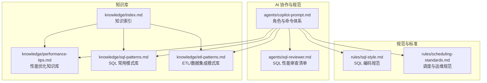

图表来源
- [目录结构和设计说明.md:19-55](file://目录结构和设计说明.md#L19-L55)
- [目录结构和设计说明.md:109-123](file://目录结构和设计说明.md#L109-L123)

章节来源
- [目录结构和设计说明.md:1-204](file://目录结构和设计说明.md#L1-L204)

## 核心组件
- 性能优化知识库：涵盖分区裁剪、倾斜处理、小文件控制、CTE 物化、谓词下推与列裁剪、Join 顺序与类型、窗口函数、存储格式与压缩、调度与资源、性能分析工具等。
- SQL 模式库：提供经验证的高质量 SQL 模式，包含去重保留最新、拉链表（SCD Type 2）、同环比、分组 TopN、累计求和、行转列/列转行、数据回刷、Lambda 合并、缺失日期补齐、NULL 安全比较等。
- ETL 模式库：覆盖 CDC 增量同步、JDBC 增量抽取、MERGE/UPSERT、小文件控制、历史回刷、文件接入、API 拉取、全量/增量/CDC 选型对照、数据漂移与时区处理。
- SQL 审查清单：提供可执行的性能检查项，用于快速定位分区裁剪缺失、Map/Broadcast Join 未启用、倾斜风险、不必要的 ORDER BY、CTE 未物化等问题。
- 调度与资源：强调资源队列划分、错峰调度、SLA 基线、失败重试策略，确保性能优化与运行稳定性协同推进。

章节来源
- [performance-tips.md:1-349](file://knowledge/performance-tips.md#L1-L349)
- [sql-patterns.md:1-331](file://knowledge/sql-patterns.md#L1-L331)
- [etl-patterns.md:1-220](file://knowledge/etl-patterns.md#L1-L220)
- [sql-reviewer.md:31-68](file://agents/sql-reviewer.md#L31-L68)
- [copilot-prompt.md:117-120](file://agents/copilot-prompt.md#L117-L120)

## 架构总览
性能优化贯穿数据从源系统到应用消费的全链路，建议以“EXPLAIN + 作业历史 + Profile + 数据采样”为主线，分层诊断并制定优化策略。

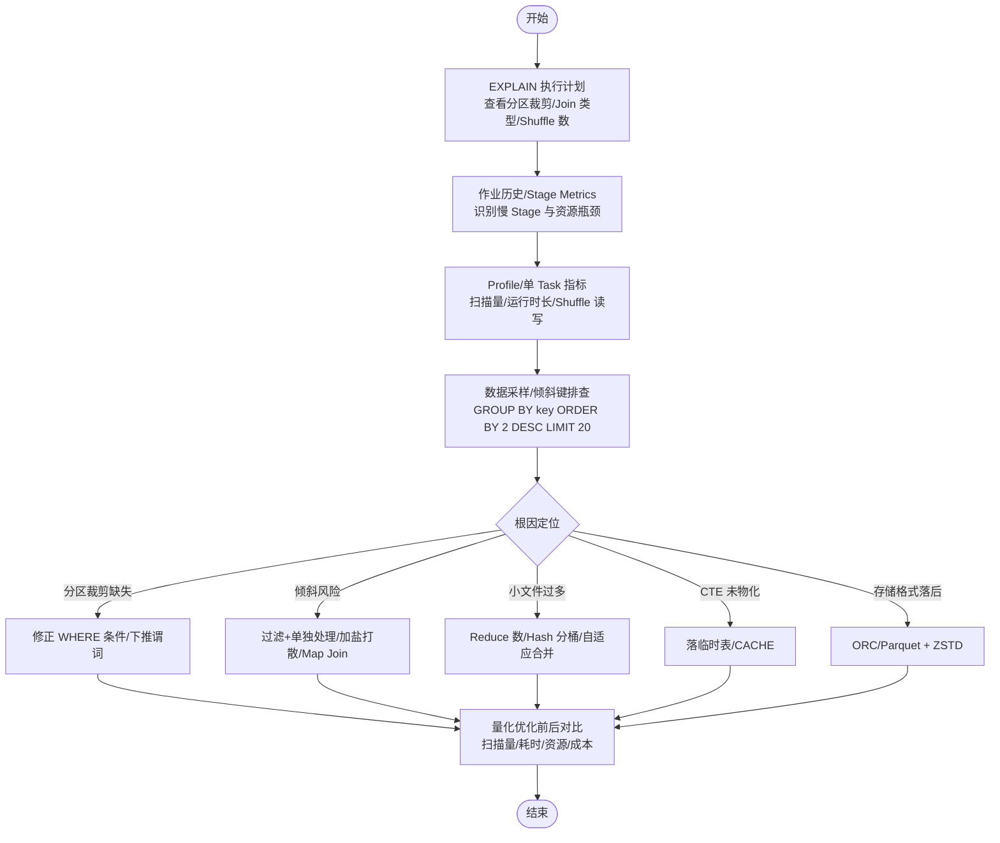

图表来源
- [performance-tips.md:327-349](file://knowledge/performance-tips.md#L327-L349)
- [sql-reviewer.md:31-68](file://agents/sql-reviewer.md#L31-L68)

## 详细组件分析

### 分区裁剪优化
- 核心要点：大型分区表的 WHERE 条件必须直接命中分区字段，禁止用函数包裹；验证方式为查看执行计划中的分区过滤信息。
- 常见陷阱：Spark 3.0+ 才默认开启动态分区裁剪（DPP），旧版本失效；子查询/JOIN 关联条件中使用分区字段时需确认裁剪是否生效。
- 优化建议：将日期/分区字段直接比较；避免在 WHERE 中对分区字段使用函数；必要时使用 EXPLAIN/EXPLAIN EXTENDED 校验 PartitionFilters。

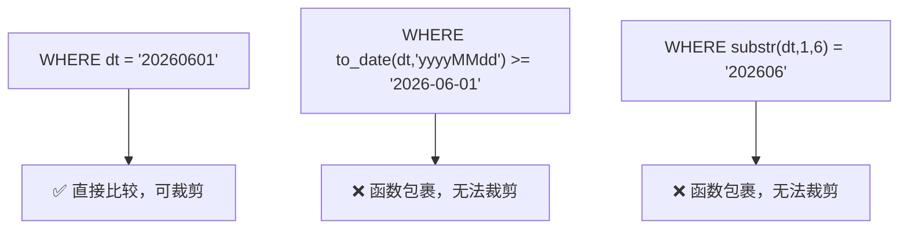

图表来源
- [performance-tips.md:10-21](file://knowledge/performance-tips.md#L10-L21)
- [performance-tips.md:23-34](file://knowledge/performance-tips.md#L23-L34)

章节来源
- [performance-tips.md:5-39](file://knowledge/performance-tips.md#L5-L39)

### 倾斜数据处理
- 现象：任务卡在 99%、个别 reducer 处理量远高于平均、特定 stage OOM。
- 常见原因：Group By/Join Key 上大量 NULL/默认值、业务热点（爆款 SKU、头部用户）、时间集中（大促日单分区数据显著放大）。
- 解决方案：
  - 方案 A：过滤 + 单独处理（将热点键单独处理后合并）。
  - 方案 B：加盐打散（Salt + 二次聚合），降低单分区数据量。
  - 方案 C：Map Join 小表（详见 Map Join/广播 Join 章节）。
- 引擎配置参考：Hive/Spark 的倾斜处理开关与阈值。

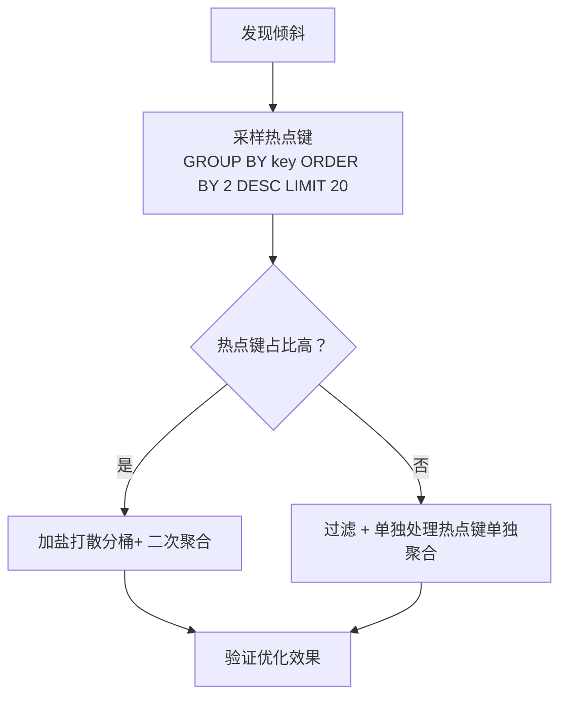

图表来源
- [performance-tips.md:42-98](file://knowledge/performance-tips.md#L42-L98)

章节来源
- [performance-tips.md:42-98](file://knowledge/performance-tips.md#L42-L98)

### Map Join / 广播 Join
- 核心：当 Join 一侧是小表（通常 < 50-100MB）时，将小表广播到每个 Map Task，避免 Shuffle。
- 触发方式：Hive/Spark 的自动广播阈值与显式 Hint；阈值建议见性能知识库。
- 踩坑：广播小表行数过大可能导致 Driver OOM；多个广播 Join 嵌套时注意累积 Driver 内存。

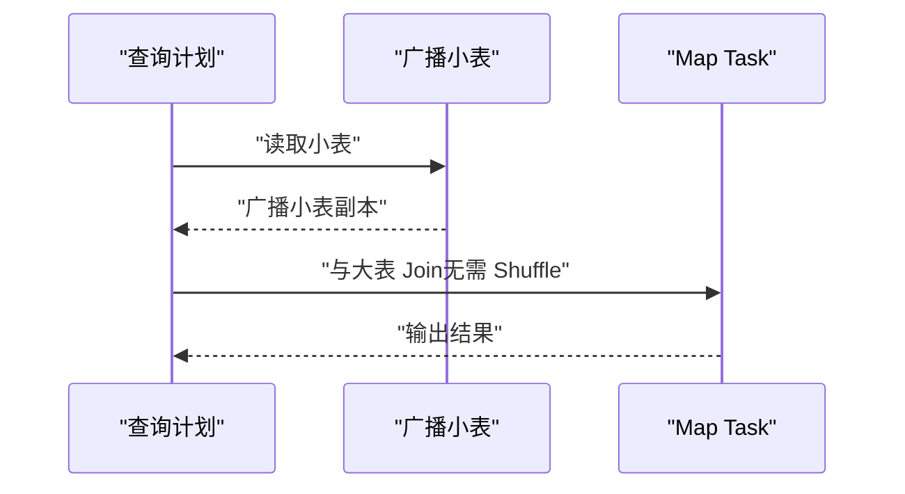

图表来源
- [performance-tips.md:101-135](file://knowledge/performance-tips.md#L101-L135)

章节来源
- [performance-tips.md:101-135](file://knowledge/performance-tips.md#L101-L135)

### 小文件控制策略
- 危害：NameNode 压力、Map Task 启动开销大、查询性能下降。
- 控制手段：输出端控制 Reduce 数、DISTRIBUTE BY 强制散列；Spark AQE 自动合并；周期性合并（Hive/ORC CONCATENATE、Iceberg rewrite_data_files）。
- 阈值：单文件目标 128MB~256MB，单分区文件数 < 50。

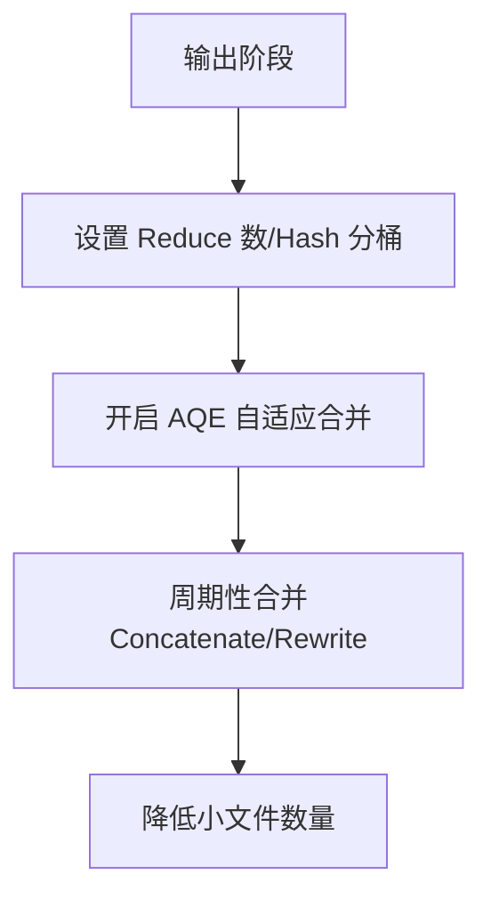

图表来源
- [performance-tips.md:138-164](file://knowledge/performance-tips.md#L138-L164)
- [etl-patterns.md:90-120](file://knowledge/etl-patterns.md#L90-L120)

章节来源
- [performance-tips.md:138-164](file://knowledge/performance-tips.md#L138-L164)
- [etl-patterns.md:90-120](file://knowledge/etl-patterns.md#L90-L120)

### CTE / WITH 物化策略
- 引擎差异：Hive/Spark 默认不物化（可 CACHE），Trino/Presto 默认不物化，Snowflake 物化为临时结果。
- 推荐做法：多次引用的复杂 CTE 先落临时表；Spark 可显式 CACHE；注意释放缓存。
- 踩坑：假设 WITH 会被物化导致重复计算多次；Spark CACHE 占用 Executor 内存。

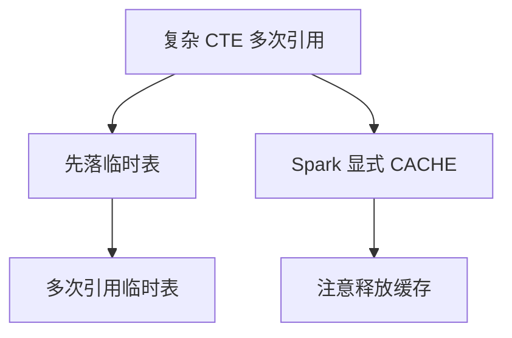

图表来源
- [performance-tips.md:167-193](file://knowledge/performance-tips.md#L167-L193)

章节来源
- [performance-tips.md:167-193](file://knowledge/performance-tips.md#L167-L193)

### 谓词下推（PPD）与列裁剪
- 核心：WHERE 条件下推到数据源层减少扫描；列裁剪只读必要列（列存收益显著）。
- 失效场景：ON 条件中混入对外层表的过滤、UDF 使谓词无法下推、SELECT * 导致列裁剪失效。
- 优化技巧：将 WHERE 条件各自约束在 JOIN 两侧，避免写在 ON 中；明确列出所需列。

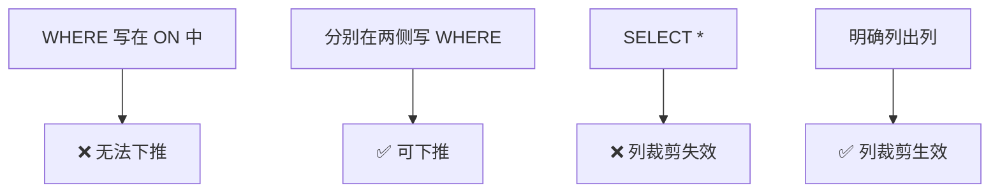

图表来源
- [performance-tips.md:196-228](file://knowledge/performance-tips.md#L196-L228)

章节来源
- [performance-tips.md:196-228](file://knowledge/performance-tips.md#L196-L228)

### Join 顺序与类型
- 顺序原则：Hive on MR 左大右小（SortMerge），Spark/Trino CBO 自动选；MaxCompute Map Join 优先小表。
- 类型选择：Broadcast Hash Join（最快，小表）、Shuffle Hash Join（中等）、Sort Merge Join（高，需排序）、Bucket Join（跳过 Shuffle）。
- 分桶 Join：两张大表按相同 key 分桶，Join 时跳过 Shuffle。

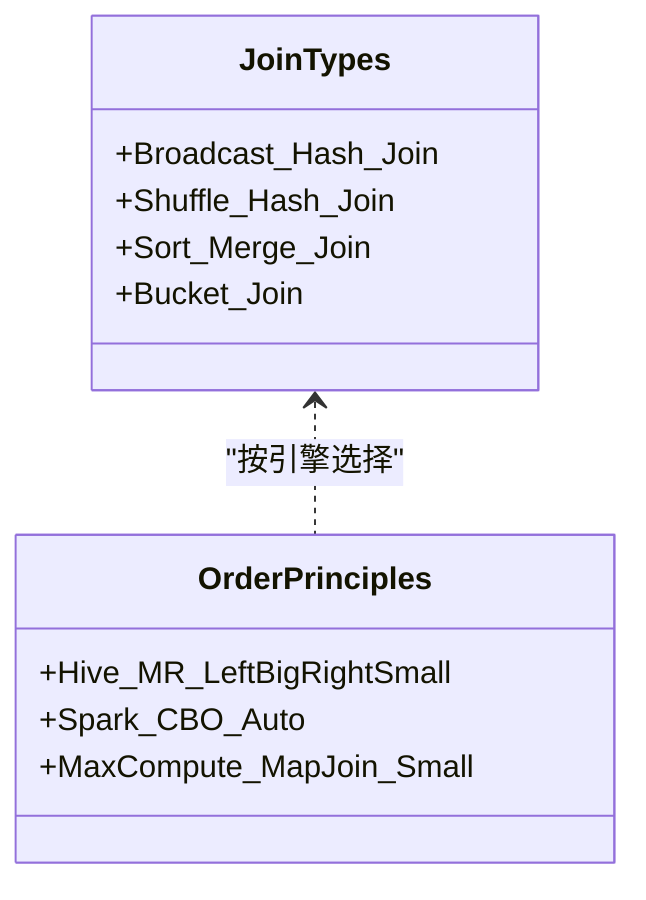

图表来源
- [performance-tips.md:232-256](file://knowledge/performance-tips.md#L232-L256)

章节来源
- [performance-tips.md:232-256](file://knowledge/performance-tips.md#L232-L256)

### 窗口函数性能
- 关键点：PARTITION BY 列基数过低 → 单分区数据过大；基数过高 → 分区过多，启动开销；ORDER BY 复杂时考虑预排序。
- 优化技巧：加 PARTITION BY 限定范围；配合 DISTRIBUTE BY + SORT BY 提前散列与排序。

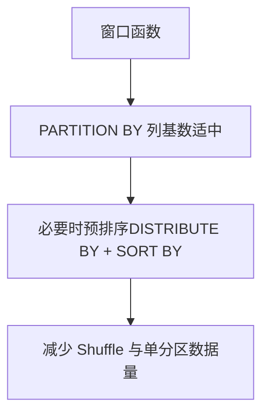

图表来源
- [performance-tips.md:259-282](file://knowledge/performance-tips.md#L259-L282)

章节来源
- [performance-tips.md:259-282](file://knowledge/performance-tips.md#L259-L282)

### 存储格式与压缩
- 推荐：大型分析表 ORC+ZSTD（Hive）/ Parquet+ZSTD（Spark）；小表/临时表 Parquet+Snappy；强 schema 演进用 Iceberg+Parquet。
- 列存收益：列裁剪（扫描量降 5-10x）、谓词下推（基于列统计跳过 row group）、压缩（列内同质数据压缩率高 3-5x）。

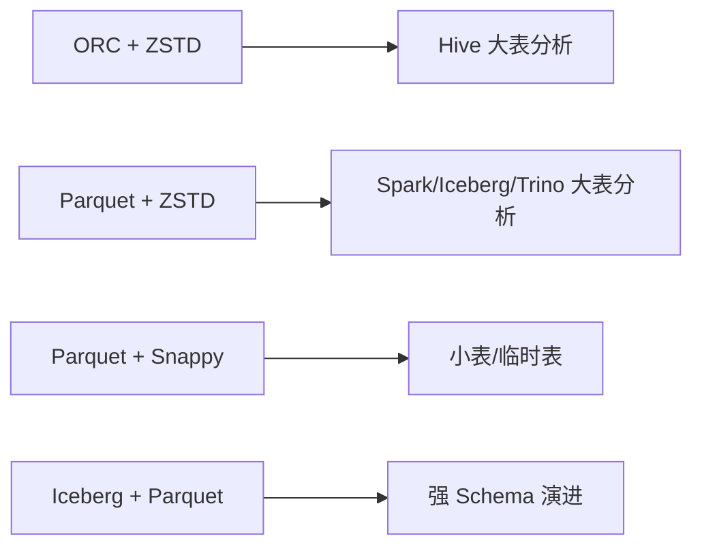

图表来源
- [performance-tips.md:286-305](file://knowledge/performance-tips.md#L286-L305)

章节来源
- [performance-tips.md:286-305](file://knowledge/performance-tips.md#L286-L305)

### 调度与资源
- 资源队列：按主题/优先级划分；核心 ADS 独占队列；探索/回刷放共享队列并限并发。
- 调度时间窗：错峰调度（避开数据库备份高峰）、上游就绪后立即触发、核心表 SLA 基线。
- 失败重试：指数退避（1min→5min→15min）、幂等前提（INSERT OVERWRITE）、连续失败告警值班。

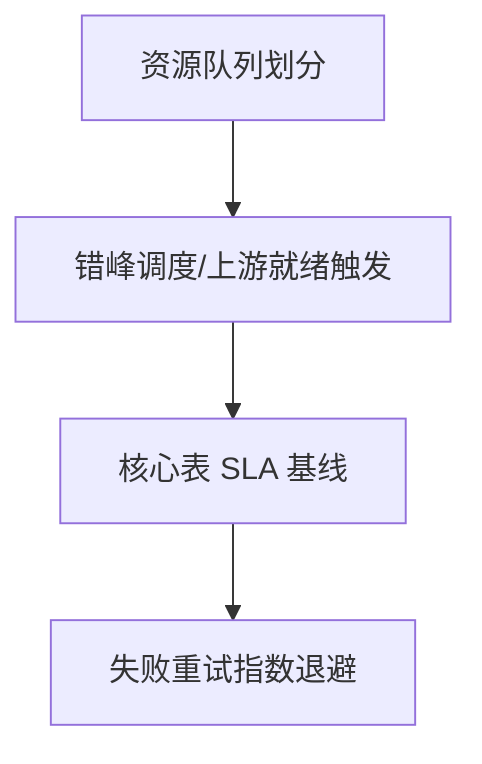

图表来源
- [performance-tips.md:308-324](file://knowledge/performance-tips.md#L308-L324)

章节来源
- [performance-tips.md:308-324](file://knowledge/performance-tips.md#L308-L324)

### 性能分析工具与流程
- 通用流程：EXPLAIN → 作业历史 → Profile/Stage Metrics → 数据采样。
- 常用命令：SHOW PARTITIONS、DESC FORMATTED、SHOW CREATE TABLE、ANALYZE TABLE COMPUTE STATISTICS。

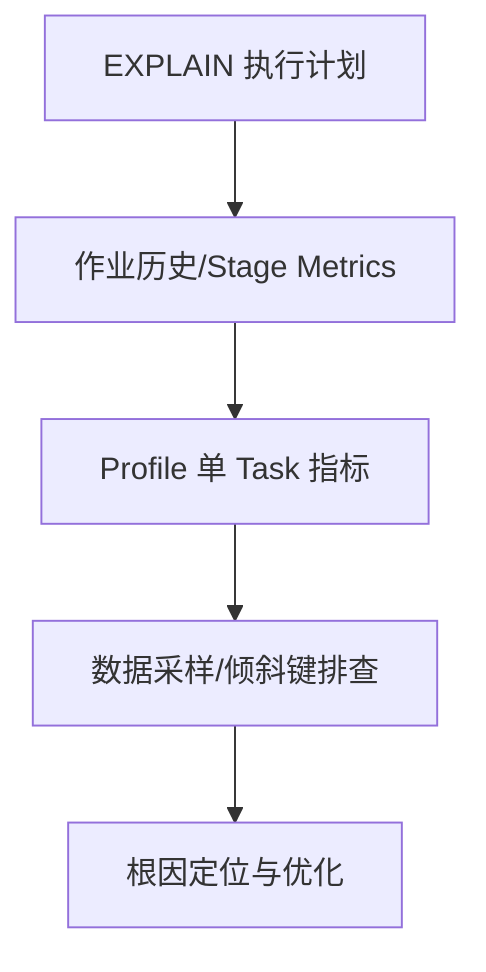

图表来源
- [performance-tips.md:327-348](file://knowledge/performance-tips.md#L327-L348)

章节来源
- [performance-tips.md:327-348](file://knowledge/performance-tips.md#L327-L348)

### SQL 模式与性能说明
- 去重保留最新：窗口函数性能良好，注意 PARTITION BY 列基数过低会引发倾斜，可加 DISTRIBUTE BY。
- 拉链表（SCD Type 2）：全量重写代价随历史累积增大，建议归档拆分。
- 同环比（YoY/MoM）：限定窗口避免全表扫描，dim_date 关联更稳健。
- 分组 TopN：窗口函数触发 Shuffle，必要时配合 DISTRIBUTE BY + SORT BY。
- 累计求和：性能良好。
- 行转列/列转行：行转列可控；列转行注意展开后的行数膨胀。
- 数据回刷：INSERT OVERWRITE 单分区幂等覆盖；批量回刷注意并发与队列资源。
- Lambda 合并：全量重写代价线性增长，超大表建议改用拉链或 ACID MERGE。
- 缺失日期补齐：dim_date 行数小，LEFT JOIN 代价可忽略。
- NULL 安全比较：Hive/Spark 优先使用 <=>，通用写法兼容所有引擎。

章节来源
- [sql-patterns.md:6-331](file://knowledge/sql-patterns.md#L6-L331)

### ETL 模式与性能说明
- CDC 增量同步：Flink CDC + Kafka + Iceberg/Hudi，位点保护、幂等、回放。
- JDBC 增量抽取：基于 update_time 水位，重叠窗口 + ODS 去重；网络与并发匹配。
- MERGE/UPSERT：主键幂等写入，乱序保护与小文件合并。
- 小文件控制：Reduce 数/Hash 分桶 + AQE 自适应合并。
- 历史回刷：分批 + 进度跟踪 + 失败处理。
- 文件接入：目录约定、完成标记、编码与 schema 校验、bad record 隔离。
- API 拉取：限流、重试、断点续传、变更追踪、schema 漂移。
- 全量/增量/CDC 选型：实时性、源端压力、完整性、复杂度、历史变更追踪、适用规模。
- 数据漂移与时区：存储 UTC + tz/local_dt，分区按业务日，报表明确时区口径。

章节来源
- [etl-patterns.md:6-220](file://knowledge/etl-patterns.md#L6-L220)

## 依赖分析
- 组件耦合：性能优化知识库为 SQL/ETL 模式提供理论基础；SQL 审查清单为落地检查提供抓手；调度与资源保障优化成果的稳定运行。
- 外部依赖：不同引擎（Hive/Spark/Trino）在物化策略、广播阈值、倾斜处理等方面存在差异，需按引擎配置与行为调整。
- 循环依赖：本指南为知识与流程的集合，不涉及代码层面的循环依赖。

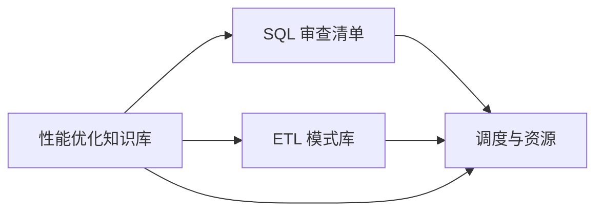

图表来源
- [performance-tips.md:1-349](file://knowledge/performance-tips.md#L1-L349)
- [sql-reviewer.md:31-68](file://agents/sql-reviewer.md#L31-L68)
- [etl-patterns.md:1-220](file://knowledge/etl-patterns.md#L1-L220)

章节来源
- [performance-tips.md:1-349](file://knowledge/performance-tips.md#L1-L349)
- [sql-reviewer.md:31-68](file://agents/sql-reviewer.md#L31-L68)
- [etl-patterns.md:1-220](file://knowledge/etl-patterns.md#L1-L220)

## 性能考量
- 量化对比：优化前后必须记录扫描量、运行耗时、资源消耗、成本等指标，确保可追踪与可复现。
- 诊断层级：数据源层 → 抽取层 → 数仓层（ODS/DWD/DWS/ADS）→ 应用层（API/BI/下游消费）。
- 工具权限：仅需只读权限（Read/Grep/Glob），避免误改生产环境。

章节来源
- [copilot-prompt.md:117-120](file://agents/copilot-prompt.md#L117-L120)
- [copilot-prompt.md:133-147](file://agents/copilot-prompt.md#L133-L147)
- [sql-reviewer.md:66-68](file://agents/sql-reviewer.md#L66-L68)

## 故障排查指南
- 现象收集：任务长时间卡住、单节点 OOM、Shuffle 数据量异常。
- 根因定位：EXPLAIN 执行计划、作业历史慢 Stage、Profile 单 Task 指标、数据采样找倾斜键。
- 方案验证：按优化建议修改后，量化对比扫描量/耗时/资源/成本。
- 实施修复：遵循“先定位、再验证、后实施”的流程，避免未确认根因直接修改。

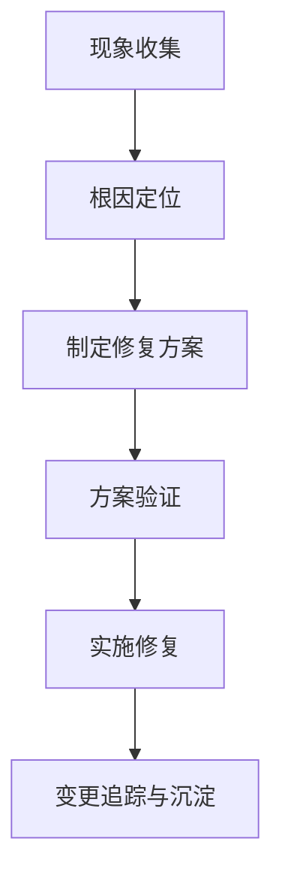

图表来源
- [copilot-prompt.md:133-147](file://agents/copilot-prompt.md#L133-L147)
- [performance-tips.md:327-349](file://knowledge/performance-tips.md#L327-L349)

章节来源
- [copilot-prompt.md:133-147](file://agents/copilot-prompt.md#L133-L147)
- [performance-tips.md:327-349](file://knowledge/performance-tips.md#L327-L349)

## 结论
本指南以仓库内的性能优化知识库为核心，结合 SQL/ETL 模式与审查清单，构建了“以 EXPLAIN 为起点”的四层诊断与优化流程。通过量化对比与可审计的变更追踪，团队可在保证稳定性的同时持续提升数据仓库性能，形成可复用的知识飞轮。

## 附录
- 知识索引：性能优化技巧（分区裁剪、倾斜、Map Join、小文件、CTE 物化等）详见知识索引文件。
- 命令体系：AI 协作助手提供 /optimize 等命令，支持按分层诊断与量化评估。

章节来源
- [index.md:38-48](file://knowledge/index.md#L38-L48)
- [copilot-prompt.md:47-52](file://agents/copilot-prompt.md#L47-L52)